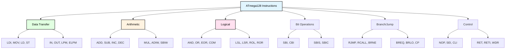
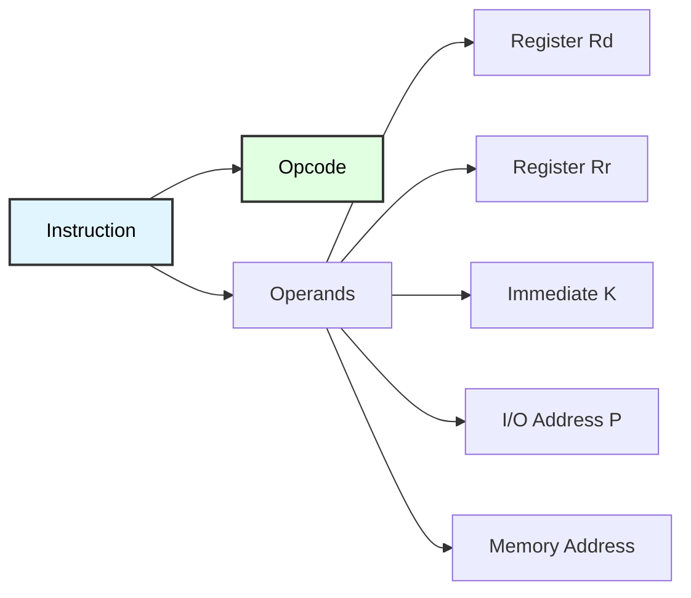

# ATmega128 Instruction Set Overview
## Complete AVR Assembly Instruction Reference

**Reference**: [ATmega128 Datasheet](https://ww1.microchip.com/downloads/aemDocuments/documents/OTH/ProductDocuments/DataSheets/2467S.pdf)

---

## Slide 1: Introduction to ATmega128 Instructions

### AVR RISC Architecture
- **Reduced Instruction Set Computer**: Simple, fast instructions
- **130+ instructions**: Complete set for embedded programming
- **32 general-purpose registers**: r0-r31 (8-bit each)
- **Harvard architecture**: Separate program and data memory
- **Most instructions**: Single-cycle execution

### Instruction Categories


---

## Slide 2: Data Transfer Instructions

### Load and Store Operations
```
Instruction | Operation              | C Equivalent        | Cycles
------------|------------------------|---------------------|-------
LDI Rd, K   | Load immediate         | x = 42;             | 1
MOV Rd, Rr  | Copy register          | x = y;              | 1
LDS Rd, k   | Load from SRAM         | x = *(uint8_t*)addr;| 2
STS k, Rr   | Store to SRAM          | *(uint8_t*)addr = x;| 2
LD Rd, X    | Load indirect (X ptr)  | x = *ptr;           | 2
LD Rd, X+   | Load, post-increment   | x = *ptr++;         | 2
LD Rd, -X   | Pre-decrement, load    | x = *--ptr;         | 2
ST X, Rr    | Store indirect         | *ptr = x;           | 2
ST X+, Rr   | Store, post-increment  | *ptr++ = x;         | 2
LPM Rd, Z   | Load program memory    | pgm_read_byte(ptr)  | 3
ELPM Rd, Z  | Extended load (>64KB)  | pgm_read_byte_far() | 3
```

### Examples
```assembly
; Load immediate (r16-r31 only!)
LDI r16, 0xFF         ; r16 = 255
LDI r17, 42           ; r17 = 42

; Copy register
MOV r18, r16          ; r18 = r16 (255)

; Array access
LDI r26, lo8(buffer)  ; X = &buffer (low byte)
LDI r27, hi8(buffer)  ; X = &buffer (high byte)
LD r19, X+            ; r19 = buffer[0], X++
LD r20, X+            ; r20 = buffer[1], X++
```

---

## Slide 3: I/O Register Access

### Fast I/O Operations (1-2 Cycles)
```
Instruction | Operation             | C Equivalent          | Cycles
------------|----------------------|----------------------|-------
IN Rd, P    | Read I/O register    | x = PORTB;           | 1
OUT P, Rr   | Write I/O register   | PORTB = x;           | 1
SBI P, b    | Set bit in I/O       | PORTB |= (1<<b);     | 1-2
CBI P, b    | Clear bit in I/O     | PORTB &= ~(1<<b);    | 1-2
SBIS P, b   | Skip if bit set      | if (PORTB & (1<<b))  | 1-3
SBIC P, b   | Skip if bit clear    | if (!(PORTB & (1<<b)))| 1-3
```

### I/O Address Space
```
Low I/O (0x00-0x1F):  Use IN/OUT/SBI/CBI (fast!)
  - PORTB (0x18), DDRB (0x17), PINB (0x16)
  - PORTD (0x12), DDRD (0x11), PIND (0x10)
  - SREG (0x3F), SPL (0x3D), SPH (0x3E)

Extended I/O (0x20-0x5F): Use LDS/STS (slower)
  - PORTF, DDRG, etc.
  - Timer/Counter registers
  - UART, SPI, I2C registers
```

### Examples
```assembly
; Configure PORTB as outputs
LDI r16, 0xFF
OUT DDRB, r16         ; DDRB = 0xFF (all outputs)

; Set individual LED (atomic)
SBI PORTB, 3          ; PORTB.3 = 1 (1-2 cycles)

; Read button state
SBIC PIND, 2          ; Skip next if PIND.2 clear
RJMP button_released  ; Execute if button pressed (LOW)
```

---

## Slide 4: Arithmetic Instructions

### Addition and Subtraction
```
Instruction  | Operation             | C Equivalent       | Flags   | Cycles
-------------|----------------------|--------------------|---------| ------
ADD Rd, Rr   | Add                  | x += y;            | ZCNVSH  | 1
ADC Rd, Rr   | Add with carry       | x += y + carry;    | ZCNVSH  | 1
ADIW Rd, K   | Add immediate word   | pair += K;         | ZCNVS   | 2
SUB Rd, Rr   | Subtract             | x -= y;            | ZCNVSH  | 1
SBC Rd, Rr   | Subtract with borrow | x -= y - borrow;   | ZCNVSH  | 1
SBIW Rd, K   | Subtract imm word    | pair -= K;         | ZCNVS   | 2
INC Rd       | Increment            | x++;               | ZNVS    | 1
DEC Rd       | Decrement            | x--;               | ZNVS    | 1
NEG Rd       | Negate (two's comp)  | x = -x;            | ZCNVSH  | 1
```

### Status Register (SREG) Flags
```
Bit 7 (I): Global interrupt enable
Bit 6 (T): Bit copy storage
Bit 5 (H): Half carry flag
Bit 4 (S): Sign bit (S = N ⊕ V)
Bit 3 (V): Two's complement overflow
Bit 2 (N): Negative flag
Bit 1 (Z): Zero flag
Bit 0 (C): Carry flag
```

### Examples
```assembly
; 8-bit addition
LDI r16, 100
LDI r17, 50
ADD r16, r17          ; r16 = 150

; 16-bit addition (r25:r24 += r27:r26)
ADD r24, r26          ; Add low bytes
ADC r25, r27          ; Add high bytes with carry

; Increment counter
INC r20               ; r20++
```

---

## Slide 5: Logical Instructions

### Bitwise Operations
```
Instruction | Operation       | C Equivalent    | Flags  | Cycles
------------|----------------|-----------------|--------|-------
AND Rd, Rr  | Logical AND    | x &= y;         | ZNV    | 1
ANDI Rd, K  | AND immediate  | x &= 0x0F;      | ZNV    | 1
OR Rd, Rr   | Logical OR     | x |= y;         | ZNV    | 1
ORI Rd, K   | OR immediate   | x |= 0xF0;      | ZNV    | 1
EOR Rd, Rr  | Exclusive OR   | x ^= y;         | ZNV    | 1
COM Rd      | One's comp     | x = ~x;         | ZNC    | 1
NEG Rd      | Two's comp     | x = -x;         | ZCNVSH | 1
CLR Rd      | Clear (x^x)    | x = 0;          | ZNV    | 1
SER Rd      | Set all (0xFF) | x = 0xFF;       | -      | 1
```

### Shift and Rotate
```
Instruction | Operation          | C Equivalent  | Flags  | Cycles
------------|--------------------|---------------|--------|-------
LSL Rd      | Logical shift left | x <<= 1;      | ZCNVH  | 1
LSR Rd      | Logical shift right| x >>= 1;      | ZCNV   | 1
ROL Rd      | Rotate left (carry)| (see below)   | ZCNVH  | 1
ROR Rd      | Rotate right       | (see below)   | ZCNV   | 1
ASR Rd      | Arithmetic shift R | x >>= 1; (signed) | ZCNV | 1
SWAP Rd     | Swap nibbles       | x = (x<<4)|(x>>4) | - | 1
```

### Examples
```assembly
; Mask lower nibble
LDI r16, 0xAB
ANDI r16, 0x0F        ; r16 = 0x0B

; Toggle bits
LDI r17, 0b10101010
EOR r16, r17          ; Toggle bits matching pattern

; Multiply by 2 (shift left)
LSL r16               ; r16 *= 2
```

---

## Slide 6: Bit Operations

### Test and Modify Bits
```
Instruction  | Operation             | C Equivalent           | Cycles
-------------|-----------------------|------------------------|-------
SBI P, b     | Set bit in I/O        | PORTB |= (1<<b);       | 1-2
CBI P, b     | Clear bit in I/O      | PORTB &= ~(1<<b);      | 1-2
BST Rr, b    | Bit store to T flag   | T = (x >> b) & 1;      | 1
BLD Rd, b    | Bit load from T flag  | x = (x & ~(1<<b)) | (T<<b) | 1
SBIS P, b    | Skip if I/O bit set   | if (PORTB & (1<<b))    | 1-3
SBIC P, b    | Skip if I/O bit clear | if (!(PORTB & (1<<b))) | 1-3
SBRS Rr, b   | Skip if reg bit set   | if (x & (1<<b))        | 1-3
SBRC Rr, b   | Skip if reg bit clear | if (!(x & (1<<b)))     | 1-3
```

### Examples
```assembly
; Atomic bit operations (I/O only)
SBI PORTB, 0          ; Turn on LED (1-2 cycles)
CBI PORTB, 0          ; Turn off LED (1-2 cycles)

; Copy bit from r16.3 to r17.5
BST r16, 3            ; T = r16.3
BLD r17, 5            ; r17.5 = T

; Conditional execution
SBRC r16, 7           ; Skip if r16.7 = 0
RJMP negative_number  ; Execute if r16.7 = 1
```

---

## Slide 7: Branch and Jump Instructions

### Conditional Branches
```
Instruction | Condition         | Description              | Cycles
------------|-------------------|--------------------------|-------
BREQ        | Z = 1             | Branch if equal          | 1-2
BRNE        | Z = 0             | Branch if not equal      | 1-2
BRCS / BRLO | C = 1             | Branch if carry / lower  | 1-2
BRCC / BRSH | C = 0             | Branch if no carry / same/higher | 1-2
BRMI        | N = 1             | Branch if minus          | 1-2
BRPL        | N = 0             | Branch if plus           | 1-2
BRGE        | N ⊕ V = 0         | Branch if greater/equal (signed) | 1-2
BRLT        | N ⊕ V = 1         | Branch if less than (signed) | 1-2
```

### Unconditional Jumps and Calls
```
Instruction  | Operation             | Range         | Cycles
-------------|-----------------------|---------------|-------
RJMP label   | Relative jump         | ±4K words     | 2
JMP address  | Absolute jump         | Full 128KB    | 3
RCALL label  | Relative call         | ±4K words     | 3
CALL address | Absolute call         | Full 128KB    | 4
RET          | Return from call      | -             | 4
RETI         | Return from interrupt | -             | 4
IJMP         | Indirect jump (Z ptr) | -             | 2
ICALL        | Indirect call (Z ptr) | -             | 3
```

### Examples
```assembly
; Compare and branch
LDI r16, 10
LDI r17, 20
CP r16, r17           ; Compare (r16 - r17)
BRLO less_than        ; Branch if r16 < r17
BREQ equal            ; Branch if r16 == r17
; Fall through if r16 > r17

less_than:
    ; r16 < r17 code
    RJMP done

equal:
    ; r16 == r17 code

done:
```

---

## Slide 8: Multiplication Instructions

### Hardware Multiply (2 Cycles!)
```
Instruction   | Operation                    | Result   | Cycles
--------------|------------------------------|----------|-------
MUL Rd, Rr    | Unsigned 8×8 → 16-bit        | r1:r0    | 2
MULS Rd, Rr   | Signed 8×8 → 16-bit          | r1:r0    | 2
MULSU Rd, Rr  | Signed × Unsigned            | r1:r0    | 2
FMUL Rd, Rr   | Fractional unsigned          | r1:r0    | 2
FMULS Rd, Rr  | Fractional signed            | r1:r0    | 2
FMULSU Rd, Rr | Fractional signed × unsigned | r1:r0    | 2
```

### Important: MUL Result Handling
```assembly
; Multiply 5 × 10
LDI r16, 5
LDI r17, 10
MUL r16, r17          ; Result in r1:r0 = 50

; Move result to working registers
MOVW r24, r0          ; r25:r24 = r1:r0

; CRITICAL: Clear r1 (compiler expects it zero!)
CLR r1

/*
 * Why clear r1?
 * - GCC uses r1 as constant zero
 * - Compiler-generated code assumes r1 = 0
 * - Forgetting causes mysterious bugs!
 */
```

---

## Slide 9: Control Instructions

### System Control
```
Instruction | Operation                  | Description              | Cycles
------------|---------------------------|--------------------------|-------
NOP         | No operation              | Delay 1 cycle            | 1
SEI         | Set interrupt flag        | Enable interrupts        | 1
CLI         | Clear interrupt flag      | Disable interrupts       | 1
SLEEP       | Enter sleep mode          | Low power mode           | 1
WDR         | Watchdog reset            | Reset watchdog timer     | 1
BREAK       | Break (debugger)          | Breakpoint for ICE       | 1
```

### Stack Operations
```
Instruction | Operation                  | C Equivalent      | Cycles
------------|---------------------------|-------------------|-------
PUSH Rr     | Push register to stack    | (SP--) = x;       | 2
POP Rd      | Pop from stack            | x = (++SP);       | 2
```

### Examples
```assembly
; Critical section (atomic operation)
CLI                   ; Disable interrupts
; Critical code here
SBI PORTB, 0
SEI                   ; Re-enable interrupts

; Function call with parameter passing
PUSH r16              ; Save register
LDI r16, 42           ; Load parameter
RCALL function        ; Call function
POP r16               ; Restore register
```

---

## Slide 10: Program Memory Access

### LPM and ELPM Instructions
```
Instruction    | Address Range | Description                  | Cycles
---------------|---------------|------------------------------|-------
LPM Rd, Z      | 0-64KB        | Load from program memory     | 3
LPM Rd, Z+     | 0-64KB        | Load, post-increment Z       | 3
ELPM Rd, Z     | 0-128KB       | Extended load (uses RAMPZ)   | 3
ELPM Rd, Z+    | 0-128KB       | Extended load, post-inc      | 3
```

### Accessing PROGMEM in C
```c
// Define data in program memory
const uint8_t lookup_table[] PROGMEM = {10, 20, 30, 40, 50};

// Read with LPM (< 64KB)
uint8_t read_lpm(uint8_t index) {
    return pgm_read_byte(&lookup_table[index]);
}

// Generated assembly:
// LDI r30, lo8(lookup_table)
// LDI r31, hi8(lookup_table)
// ADD r30, index
// ADC r31, __zero_reg__
// LPM r24, Z

// For addresses > 64KB, use pgm_read_byte_far()
// (generates ELPM with RAMPZ)
```

---

## Slide 11: Register Architecture

### General Purpose Registers
```
┌─────────────────────────────────────────────────────┐
│        ATmega128 Register File (32 × 8-bit)         │
├─────────────────────────────────────────────────────┤
│ r0-r1   [××] Reserved (MUL result, compiler temp)  │
│ r2-r15  [  ] Free for general use                   │
│ r16-r23 [  ] Upper regs (LDI, ANDI, ORI, etc.)     │
│ r24-r25 [  ] Function return / 1st parameter        │
│ r26-r27 [XX] X pointer (XH:XL)                      │
│ r28-r29 [YY] Y pointer (YH:YL) / Frame pointer     │
│ r30-r31 [ZZ] Z pointer (ZH:ZL) / LPM/ELPM          │
└─────────────────────────────────────────────────────┘

Key constraints:
- LDI works only on r16-r31
- ADIW/SBIW work on r24, r26, r28, r30 (word pairs)
- MUL always uses r1:r0 for result
- X, Y, Z are 16-bit pointer registers
```

---

## Slide 12: Instruction Cycle Count

### Performance Characteristics
```
Cycles | Instructions
-------|------------------------------------------------------
1      | Most ALU (ADD, SUB, AND, OR, EOR, INC, DEC)
       | Most logical (LSL, LSR, ROL, ROR, COM, NEG)
       | Bit ops (SBI, CBI, BST, BLD)
       | I/O (IN, OUT - low I/O only)
       | Control (NOP, SEI, CLI, WDR)

2      | Most branches (if taken)
       | Word ops (ADIW, SBIW)
       | Multiply (MUL, MULS, MULSU)
       | Relative jump (RJMP)
       | Indirect jump (IJMP)
       | Load/Store (LDS, STS, LD, ST)
       | Stack (PUSH, POP)

3      | Program memory (LPM, ELPM)
       | Relative call (RCALL)
       | Indirect call (ICALL)
       | Absolute jump (JMP)

4      | Return (RET, RETI)
       | Absolute call (CALL)
```

### Optimization Tips
- Use IN/OUT instead of LDS/STS for low I/O (0x00-0x1F)
- Use SBI/CBI for single-bit operations (atomic + fast)
- Use RJMP instead of JMP when possible (smaller + faster)
- Use RCALL instead of CALL when possible
- Minimize branches (pipeline stalls)

---

## Slide 13: Assembly Directives

### Segment Directives
```assembly
.CSEG                 ; Code segment (flash memory)
.DSEG                 ; Data segment (SRAM)
.ESEG                 ; EEPROM segment
.ORG address          ; Set origin address
```

### Data Allocation
```assembly
.BYTE n               ; Reserve n bytes
.DB value1, value2    ; Define bytes
.DW value1, value2    ; Define words (16-bit)
.EQU name = value     ; Define constant
.DEF alias = register ; Define register alias
```

### Example Program
```assembly
.INCLUDE "m128def.inc"

; Constants
.EQU LED_PIN = 0

.CSEG
.ORG 0x0000
    RJMP main

main:
    ; Initialize stack
    LDI r16, LOW(RAMEND)
    OUT SPL, r16
    LDI r16, HIGH(RAMEND)
    OUT SPH, r16
    
    ; Configure LED pin
    SBI DDRB, LED_PIN
    
loop:
    SBI PORTB, LED_PIN    ; LED on
    RCALL delay
    CBI PORTB, LED_PIN    ; LED off
    RCALL delay
    RJMP loop

delay:
    ; Software delay
    LDI r18, 41
outer:
    LDI r17, 150
middle:
    LDI r16, 200
inner:
    DEC r16
    BRNE inner
    DEC r17
    BRNE middle
    DEC r18
    BRNE outer
    RET
```

---

## Slide 14: Summary

### Essential Instructions by Category

**Data Transfer (7 most used)**:
- LDI, MOV, LD, ST, IN, OUT, LPM

**Arithmetic (8 most used)**:
- ADD, ADC, SUB, SBC, INC, DEC, ADIW, SBIW

**Logical (6 most used)**:
- AND, OR, EOR, COM, LSL, LSR

**Bit Operations (6 most used)**:
- SBI, CBI, SBIS, SBIC, SBRS, SBRC

**Branch/Jump (8 most used)**:
- RJMP, RCALL, RET, BREQ, BRNE, BRLO, CP, CPI

**Control (4 most used)**:
- NOP, SEI, CLI, WDR

### Instruction Format


---

## Slide 15: Practice Exercises

### Exercise 1: Basic Instructions
**Goal**: Implement LED control with assembly
- Use LDI to load values
- Use OUT to configure DDRB
- Use SBI/CBI to toggle LED
- Use RJMP for main loop

### Exercise 2: Arithmetic
**Goal**: Implement 16-bit addition
- Load two 16-bit numbers
- Use ADD for low bytes
- Use ADC for high bytes
- Check carry flag (SREG.C)

### Exercise 3: Bit Manipulation
**Goal**: Rotate LED pattern
- Read current PORTB value (IN)
- Rotate left (LSL + bit 0 = carry)
- Write back to PORTB (OUT)
- Add delay and loop

### Exercise 4: Branching
**Goal**: Button-controlled counter
- Read button state (SBIC/SBIS)
- Increment counter on press
- Display on LEDs (OUT)
- Use conditional branches

### Exercise 5: Program Memory
**Goal**: Read lookup table from PROGMEM
- Define table with .DB directive
- Use Z pointer to access
- Use LPM to read byte
- Display value on PORTB

---

# End of Slides

**Questions?**

For more information, see:
- [ATmega128 Datasheet](https://ww1.microchip.com/downloads/aemDocuments/documents/OTH/ProductDocuments/DataSheets/2467S.pdf) (Instruction Set Summary: pages 321-334)
- `Instructions.md` (detailed instruction reference)
- `Peripherals.md` (assembly examples for peripherals)
- Project source code in `Atmega128_Instructions/`
