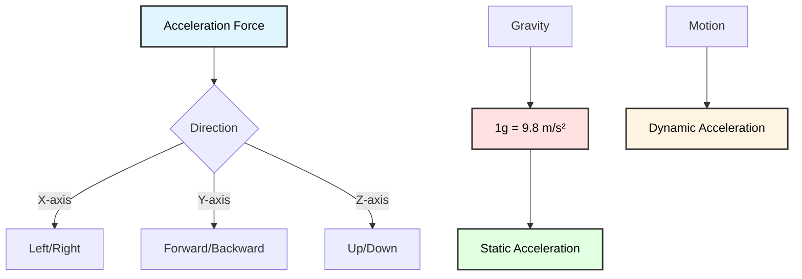
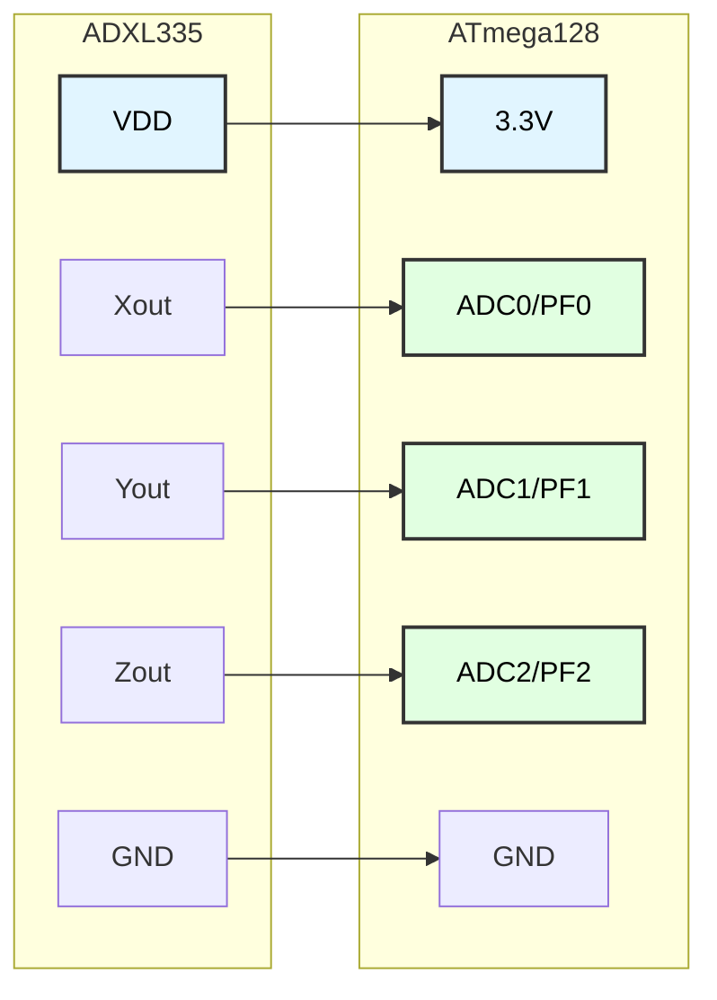
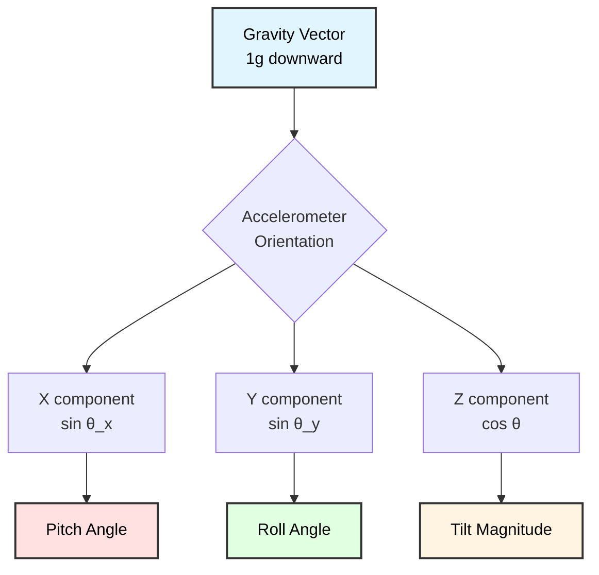
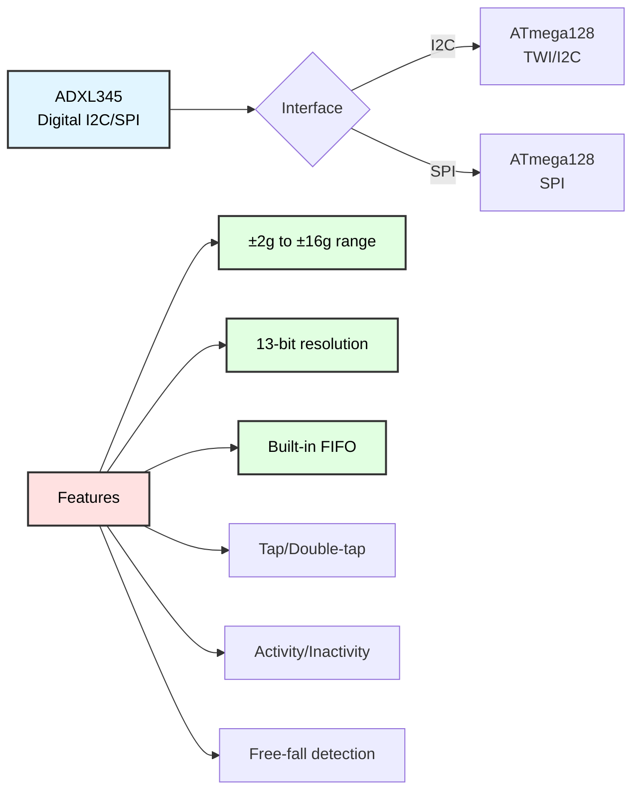
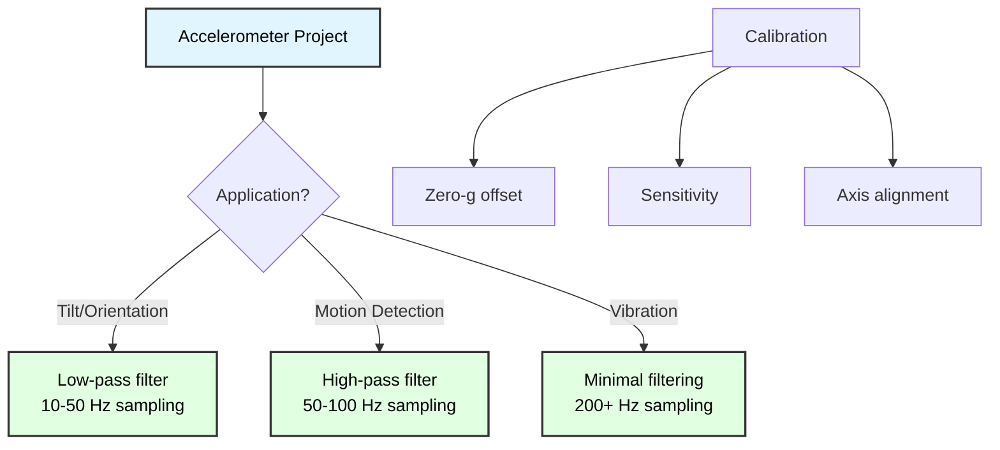

# Accelerometer Programming
## ATmega128 Embedded Systems Course

**Reference**: [ATmega128 Datasheet](https://ww1.microchip.com/downloads/en/DeviceDoc/doc2467.pdf)

---

## Slide 1: Introduction to Accelerometers

### What is an Accelerometer?
- **Sensor** that measures acceleration forces
- Detects **static** acceleration (gravity/tilt) and **dynamic** acceleration (motion/vibration)
- Outputs analog or digital signals proportional to acceleration

### Why Use Accelerometers?
✓ **Motion detection** - Detect movement, shaking, tapping  
✓ **Tilt sensing** - Measure orientation relative to gravity  
✓ **Vibration monitoring** - Detect vibrations and impacts  
✓ **Navigation** - Inertial measurement for positioning  
✓ **Activity tracking** - Step counting, fall detection  

### Common Applications
- Mobile devices (screen rotation)
- Gaming controllers
- Industrial vibration monitoring
- Fall detection systems
- Robotics and drones

---

## Slide 2: Accelerometer Fundamentals

### Acceleration Measurement


### Units of Measurement
- **g**: Gravitational acceleration (1g = 9.8 m/s²)
- **At rest**: ±1g on each axis depending on orientation
- **Moving**: Additional dynamic acceleration

### Sensitivity
- **±1.5g**: Low sensitivity, high resolution
- **±2g**: General purpose applications
- **±6g**: High impact/vibration
- **±16g**: Extreme conditions

---

## Slide 3: ADXL335 Triple-Axis Accelerometer

### ADXL335 Overview
- **Type**: Analog output, 3-axis MEMS accelerometer
- **Range**: ±3g on all axes
- **Supply**: 1.8V - 3.6V (typically 3.3V)
- **Output**: Ratiometric analog voltage
- **Bandwidth**: 0.5 Hz - 1600 Hz

### Pin Configuration
```
ADXL335 Pinout:
┌─────────────┐
│  1  VDD     │ ← 3.3V Power
│  2  GND     │ ← Ground
│  3  Xout    │ → X-axis output
│  4  Yout    │ → Y-axis output
│  5  Zout    │ → Z-axis output
│  6  ST      │ ← Self-test (optional)
└─────────────┘
```

### Output Characteristics
- **Zero-g output**: Typically 1.65V (VDD/2)
- **Sensitivity**: ~300 mV/g at 3.3V supply
- **Ratiometric**: Output scales with supply voltage

---

## Slide 4: Accelerometer to ATmega128 Interface

### Hardware Connection


### Important Notes
⚠️ **Voltage Level**: ADXL335 outputs 0-3.3V  
⚠️ **ADC Reference**: Use 3.3V AREF or AVCC (if 3.3V system)  
⚠️ **Power Supply**: Use clean 3.3V regulator  
⚠️ **Decoupling**: 0.1µF ceramic capacitor near VDD  

---

## Slide 5: ADC Configuration for Accelerometer

### ADC Initialization
```c
#include <avr/io.h>
#define F_CPU 16000000UL

// ADC channels for accelerometer
#define ACCEL_X_CHANNEL 0  // ADC0/PF0
#define ACCEL_Y_CHANNEL 1  // ADC1/PF1
#define ACCEL_Z_CHANNEL 2  // ADC2/PF2

void adc_init(void) {
    // External AREF (3.3V reference)
    ADMUX = 0;  // REFS1:0 = 00
    
    // Or use AVCC if system is 3.3V
    // ADMUX = (1 << REFS0);
    
    // Enable ADC, prescaler = 128
    // ADC clock = 16MHz/128 = 125kHz (optimal)
    ADCSRA = (1 << ADEN) | 
             (1 << ADPS2) | (1 << ADPS1) | (1 << ADPS0);
    
    // Dummy conversion
    ADCSRA |= (1 << ADSC);
    while (ADCSRA & (1 << ADSC));
}

uint16_t adc_read(uint8_t channel) {
    ADMUX = (ADMUX & 0xF0) | (channel & 0x0F);
    ADCSRA |= (1 << ADSC);
    while (ADCSRA & (1 << ADSC));
    return ADC;
}
```

---

## Slide 6: Reading Raw Accelerometer Data

### Basic Reading Function
```c
typedef struct {
    uint16_t x;
    uint16_t y;
    uint16_t z;
} accel_raw_t;

accel_raw_t accel_read_raw(void) {
    accel_raw_t data;
    
    data.x = adc_read(ACCEL_X_CHANNEL);
    data.y = adc_read(ACCEL_Y_CHANNEL);
    data.z = adc_read(ACCEL_Z_CHANNEL);
    
    return data;
}

// With averaging for noise reduction
accel_raw_t accel_read_averaged(uint8_t samples) {
    accel_raw_t data = {0, 0, 0};
    uint32_t sum_x = 0, sum_y = 0, sum_z = 0;
    
    for (uint8_t i = 0; i < samples; i++) {
        sum_x += adc_read(ACCEL_X_CHANNEL);
        sum_y += adc_read(ACCEL_Y_CHANNEL);
        sum_z += adc_read(ACCEL_Z_CHANNEL);
    }
    
    data.x = sum_x / samples;
    data.y = sum_y / samples;
    data.z = sum_z / samples;
    
    return data;
}
```

---

## Slide 7: Calibration

### Zero-g Calibration
```c
typedef struct {
    uint16_t x_zero;  // ADC value at 0g for X
    uint16_t y_zero;  // ADC value at 0g for Y
    uint16_t z_zero;  // ADC value at 0g for Z
} accel_calibration_t;

accel_calibration_t calibration;

void accel_calibrate(void) {
    // Place accelerometer flat on level surface
    // Z should read +1g, X and Y should read 0g
    
    uint32_t sum_x = 0, sum_y = 0, sum_z = 0;
    
    // Average many samples for accuracy
    for (uint16_t i = 0; i < 256; i++) {
        sum_x += adc_read(ACCEL_X_CHANNEL);
        sum_y += adc_read(ACCEL_Y_CHANNEL);
        sum_z += adc_read(ACCEL_Z_CHANNEL);
        _delay_ms(5);
    }
    
    calibration.x_zero = sum_x / 256;
    calibration.y_zero = sum_y / 256;
    // Z at +1g, need to find 0g offset
    calibration.z_zero = sum_z / 256;
}
```

### Why Calibrate?
- **Offset variation**: Each sensor has slightly different zero-g output
- **Temperature drift**: Output changes with temperature
- **Supply voltage**: Ratiometric output depends on VDD
- **Improved accuracy**: Calibration removes systematic errors

---

## Slide 8: Converting to G-Force

### ADC to G-Force Conversion
```c
typedef struct {
    float x;  // Acceleration in g
    float y;
    float z;
} accel_g_t;

// For ADXL335 with 3.3V supply
// Sensitivity: ~300 mV/g
// Zero-g output: 1.65V (512 ADC counts at 3.3V AREF)
#define ADC_REF_VOLTAGE  3.3
#define ADC_RESOLUTION   1024
#define SENSITIVITY_MV_G 300.0  // mV per g

accel_g_t accel_convert_to_g(accel_raw_t raw) {
    accel_g_t g_force;
    
    // Convert ADC to voltage
    float v_x = (raw.x * ADC_REF_VOLTAGE) / ADC_RESOLUTION;
    float v_y = (raw.y * ADC_REF_VOLTAGE) / ADC_RESOLUTION;
    float v_z = (raw.z * ADC_REF_VOLTAGE) / ADC_RESOLUTION;
    
    // Subtract zero-g voltage and convert to g
    float v_zero = ADC_REF_VOLTAGE / 2.0;  // 1.65V
    float sensitivity_v_g = SENSITIVITY_MV_G / 1000.0;  // 0.3 V/g
    
    g_force.x = (v_x - v_zero) / sensitivity_v_g;
    g_force.y = (v_y - v_zero) / sensitivity_v_g;
    g_force.z = (v_z - v_zero) / sensitivity_v_g;
    
    return g_force;
}

// Using calibration values
accel_g_t accel_calibrated_g(accel_raw_t raw) {
    accel_g_t g_force;
    
    // ADC counts per g (measured from calibration)
    // Approximately 93 counts/g for 3.3V AREF
    float counts_per_g = 1024 / (ADC_REF_VOLTAGE / SENSITIVITY_MV_G * 1000);
    
    g_force.x = (float)(raw.x - calibration.x_zero) / counts_per_g;
    g_force.y = (float)(raw.y - calibration.y_zero) / counts_per_g;
    g_force.z = (float)(raw.z - calibration.z_zero) / counts_per_g;
    
    return g_force;
}
```

---

## Slide 9: Tilt Angle Calculation

### Tilt Sensing Using Gravity


### Angle Calculation
```c
#include <math.h>

typedef struct {
    float pitch;  // Rotation around Y axis (degrees)
    float roll;   // Rotation around X axis (degrees)
} accel_angle_t;

accel_angle_t accel_get_angle(accel_g_t g) {
    accel_angle_t angle;
    
    // Pitch (rotation around Y-axis)
    // pitch = atan2(x, sqrt(y² + z²))
    angle.pitch = atan2(g.x, sqrt(g.y * g.y + g.z * g.z)) 
                  * 180.0 / M_PI;
    
    // Roll (rotation around X-axis)
    // roll = atan2(y, sqrt(x² + z²))
    angle.roll = atan2(g.y, sqrt(g.x * g.x + g.z * g.z)) 
                 * 180.0 / M_PI;
    
    return angle;
}

// Simplified for small angles (faster, no sqrt)
accel_angle_t accel_get_angle_simple(accel_g_t g) {
    accel_angle_t angle;
    
    // For small angles: angle ≈ sin(angle)
    angle.pitch = asin(g.x) * 180.0 / M_PI;
    angle.roll = asin(g.y) * 180.0 / M_PI;
    
    return angle;
}
```

---

## Slide 10: Motion Detection

### Detecting Movement
```c
#define MOTION_THRESHOLD 0.2  // g-force threshold

typedef enum {
    MOTION_NONE,
    MOTION_DETECTED,
    MOTION_SHOCK
} motion_state_t;

motion_state_t detect_motion(accel_g_t current, accel_g_t previous) {
    // Calculate change in acceleration
    float delta_x = fabs(current.x - previous.x);
    float delta_y = fabs(current.y - previous.y);
    float delta_z = fabs(current.z - previous.z);
    
    // Total acceleration change
    float total_delta = sqrt(delta_x * delta_x + 
                             delta_y * delta_y + 
                             delta_z * delta_z);
    
    if (total_delta > 2.0) {
        return MOTION_SHOCK;  // High impact detected
    } else if (total_delta > MOTION_THRESHOLD) {
        return MOTION_DETECTED;  // Movement detected
    } else {
        return MOTION_NONE;  // Stationary
    }
}

// Vibration detection
uint8_t detect_vibration(accel_g_t *samples, uint8_t count) {
    float variance = 0;
    float mean_x = 0, mean_y = 0, mean_z = 0;
    
    // Calculate mean
    for (uint8_t i = 0; i < count; i++) {
        mean_x += samples[i].x;
        mean_y += samples[i].y;
        mean_z += samples[i].z;
    }
    mean_x /= count;
    mean_y /= count;
    mean_z /= count;
    
    // Calculate variance
    for (uint8_t i = 0; i < count; i++) {
        variance += pow(samples[i].x - mean_x, 2);
        variance += pow(samples[i].y - mean_y, 2);
        variance += pow(samples[i].z - mean_z, 2);
    }
    variance /= count;
    
    // High variance = vibration
    return (variance > 0.1) ? 1 : 0;
}
```

---

## Slide 11: Tap/Shake Detection

### Tap Detection Algorithm
```c
#define TAP_THRESHOLD    1.5   // g-force for tap
#define TAP_DURATION     50    // ms
#define TAP_QUIET_TIME   100   // ms between taps

typedef enum {
    TAP_NONE,
    TAP_SINGLE,
    TAP_DOUBLE
} tap_type_t;

tap_type_t detect_tap(void) {
    static uint32_t last_tap_time = 0;
    static uint8_t tap_count = 0;
    
    accel_g_t g = accel_calibrated_g(accel_read_averaged(4));
    
    // Calculate total acceleration magnitude
    float magnitude = sqrt(g.x * g.x + g.y * g.y + g.z * g.z);
    
    // Remove gravity component (1g)
    float dynamic = fabs(magnitude - 1.0);
    
    if (dynamic > TAP_THRESHOLD) {
        uint32_t current_time = millis();  // Need timer function
        
        if (current_time - last_tap_time < TAP_QUIET_TIME) {
            tap_count++;
        } else {
            tap_count = 1;
        }
        
        last_tap_time = current_time;
        
        if (tap_count >= 2) {
            tap_count = 0;
            return TAP_DOUBLE;
        }
    }
    
    // Check for single tap timeout
    if (tap_count == 1 && (millis() - last_tap_time) > TAP_QUIET_TIME) {
        tap_count = 0;
        return TAP_SINGLE;
    }
    
    return TAP_NONE;
}
```

---

## Slide 12: Free Fall Detection

### Free Fall Algorithm
```c
#define FREEFALL_THRESHOLD  0.3  // g (total acceleration)
#define FREEFALL_DURATION   100  // ms

typedef enum {
    NOT_FALLING,
    FREE_FALL,
    LANDED
} freefall_state_t;

freefall_state_t detect_freefall(void) {
    static freefall_state_t state = NOT_FALLING;
    static uint32_t freefall_start = 0;
    
    accel_g_t g = accel_calibrated_g(accel_read_averaged(4));
    
    // Calculate total acceleration magnitude
    float magnitude = sqrt(g.x * g.x + g.y * g.y + g.z * g.z);
    
    switch (state) {
        case NOT_FALLING:
            if (magnitude < FREEFALL_THRESHOLD) {
                state = FREE_FALL;
                freefall_start = millis();
            }
            break;
            
        case FREE_FALL:
            if (magnitude >= FREEFALL_THRESHOLD) {
                // Landed
                if (millis() - freefall_start > FREEFALL_DURATION) {
                    state = LANDED;
                } else {
                    // Too short, false alarm
                    state = NOT_FALLING;
                }
            }
            break;
            
        case LANDED:
            // Wait for user to reset or handle landing
            state = NOT_FALLING;
            break;
    }
    
    return state;
}
```

---

## Slide 13: Complete Application Example

### Motion-Activated System
```c
#include <avr/io.h>
#include <avr/interrupt.h>
#include <util/delay.h>
#include <math.h>

// Accelerometer state
typedef struct {
    accel_g_t current;
    accel_g_t previous;
    accel_angle_t angle;
    motion_state_t motion;
} accel_state_t;

accel_state_t accel_state;

void system_init(void) {
    // LED outputs
    DDRA |= (1 << PA0) | (1 << PA1) | (1 << PA2);
    
    // Initialize ADC
    adc_init();
    
    // Calibrate accelerometer
    accel_calibrate();
    
    // Initialize state
    accel_raw_t raw = accel_read_averaged(16);
    accel_state.current = accel_calibrated_g(raw);
    accel_state.previous = accel_state.current;
}

void update_accelerometer(void) {
    // Save previous reading
    accel_state.previous = accel_state.current;
    
    // Read new data
    accel_raw_t raw = accel_read_averaged(4);
    accel_state.current = accel_calibrated_g(raw);
    
    // Calculate angles
    accel_state.angle = accel_get_angle(accel_state.current);
    
    // Detect motion
    accel_state.motion = detect_motion(accel_state.current, 
                                       accel_state.previous);
}

int main(void) {
    system_init();
    
    while (1) {
        update_accelerometer();
        
        // Visual feedback
        if (accel_state.motion == MOTION_SHOCK) {
            PORTA |= (1 << PA0);   // Red LED - shock
        } else if (accel_state.motion == MOTION_DETECTED) {
            PORTA |= (1 << PA1);   // Yellow LED - motion
        } else {
            PORTA |= (1 << PA2);   // Green LED - still
        }
        
        // Check tilt
        if (fabs(accel_state.angle.pitch) > 45 || 
            fabs(accel_state.angle.roll) > 45) {
            // Excessive tilt alarm
            PORTA ^= (1 << PA0);  // Blink red
        }
        
        _delay_ms(50);  // 20 Hz update rate
        PORTA = 0;      // Clear LEDs
    }
    
    return 0;
}
```

---

## Slide 14: Data Filtering

### Low-Pass Filter (Smoothing)
```c
// Simple moving average
#define FILTER_SIZE 8
accel_g_t filter_buffer[FILTER_SIZE];
uint8_t filter_index = 0;

accel_g_t apply_moving_average(accel_g_t new_data) {
    accel_g_t filtered = {0, 0, 0};
    
    // Add new data to buffer
    filter_buffer[filter_index++] = new_data;
    if (filter_index >= FILTER_SIZE) filter_index = 0;
    
    // Calculate average
    for (uint8_t i = 0; i < FILTER_SIZE; i++) {
        filtered.x += filter_buffer[i].x;
        filtered.y += filter_buffer[i].y;
        filtered.z += filter_buffer[i].z;
    }
    
    filtered.x /= FILTER_SIZE;
    filtered.y /= FILTER_SIZE;
    filtered.z /= FILTER_SIZE;
    
    return filtered;
}

// Exponential moving average (faster, less memory)
accel_g_t apply_ema(accel_g_t new_data, accel_g_t old_ema) {
    accel_g_t filtered;
    const float alpha = 0.2;  // Smoothing factor (0-1)
    
    filtered.x = alpha * new_data.x + (1 - alpha) * old_ema.x;
    filtered.y = alpha * new_data.y + (1 - alpha) * old_ema.y;
    filtered.z = alpha * new_data.z + (1 - alpha) * old_ema.z;
    
    return filtered;
}
```

### High-Pass Filter (Remove Gravity)
```c
// Isolate dynamic acceleration (motion only)
accel_g_t apply_highpass(accel_g_t current, accel_g_t *lowpass) {
    accel_g_t dynamic;
    const float alpha = 0.8;  // Cutoff frequency factor
    
    // Update low-pass filter (gravity component)
    lowpass->x = alpha * lowpass->x + (1 - alpha) * current.x;
    lowpass->y = alpha * lowpass->y + (1 - alpha) * current.y;
    lowpass->z = alpha * lowpass->z + (1 - alpha) * current.z;
    
    // Subtract to get high-frequency (dynamic) component
    dynamic.x = current.x - lowpass->x;
    dynamic.y = current.y - lowpass->y;
    dynamic.z = current.z - lowpass->z;
    
    return dynamic;
}
```

---

## Slide 15: Orientation Detection

### Detecting Device Orientation
```c
typedef enum {
    ORIENT_FLAT_UP,      // Lying flat, screen up
    ORIENT_FLAT_DOWN,    // Lying flat, screen down
    ORIENT_PORTRAIT,     // Standing upright
    ORIENT_PORTRAIT_INV, // Upside down
    ORIENT_LANDSCAPE_L,  // Landscape left
    ORIENT_LANDSCAPE_R,  // Landscape right
    ORIENT_UNKNOWN
} orientation_t;

orientation_t detect_orientation(accel_g_t g) {
    // Dominant axis determines orientation
    float abs_x = fabs(g.x);
    float abs_y = fabs(g.y);
    float abs_z = fabs(g.z);
    
    // Find dominant axis
    if (abs_z > abs_x && abs_z > abs_y) {
        // Z is dominant
        if (g.z > 0.7) return ORIENT_FLAT_UP;
        if (g.z < -0.7) return ORIENT_FLAT_DOWN;
    } else if (abs_y > abs_x && abs_y > abs_z) {
        // Y is dominant
        if (g.y > 0.7) return ORIENT_PORTRAIT;
        if (g.y < -0.7) return ORIENT_PORTRAIT_INV;
    } else if (abs_x > abs_y && abs_x > abs_z) {
        // X is dominant
        if (g.x > 0.7) return ORIENT_LANDSCAPE_R;
        if (g.x < -0.7) return ORIENT_LANDSCAPE_L;
    }
    
    return ORIENT_UNKNOWN;
}

// With hysteresis to prevent jitter
orientation_t detect_orientation_stable(accel_g_t g) {
    static orientation_t last_orientation = ORIENT_UNKNOWN;
    orientation_t new_orientation = detect_orientation(g);
    
    // Only change if new orientation is stable
    static uint8_t stable_count = 0;
    const uint8_t STABILITY_THRESHOLD = 5;
    
    if (new_orientation == last_orientation) {
        stable_count = 0;
    } else {
        stable_count++;
        if (stable_count >= STABILITY_THRESHOLD) {
            last_orientation = new_orientation;
            stable_count = 0;
        }
    }
    
    return last_orientation;
}
```

---

## Slide 16: Step Counter Implementation

### Pedometer Algorithm
```c
#define STEP_THRESHOLD 1.2      // g
#define STEP_MIN_INTERVAL 300   // ms
#define STEP_MAX_INTERVAL 2000  // ms

typedef struct {
    uint32_t step_count;
    uint32_t last_step_time;
    float last_magnitude;
} pedometer_t;

pedometer_t pedometer = {0, 0, 0};

void update_step_counter(accel_g_t g) {
    uint32_t current_time = millis();
    
    // Calculate magnitude
    float magnitude = sqrt(g.x * g.x + g.y * g.y + g.z * g.z);
    
    // Detect peak (step)
    if (magnitude > STEP_THRESHOLD && 
        pedometer.last_magnitude < STEP_THRESHOLD) {
        
        // Check timing
        uint32_t interval = current_time - pedometer.last_step_time;
        
        if (interval > STEP_MIN_INTERVAL && 
            interval < STEP_MAX_INTERVAL) {
            
            pedometer.step_count++;
            pedometer.last_step_time = current_time;
        }
    }
    
    pedometer.last_magnitude = magnitude;
}

uint32_t get_step_count(void) {
    return pedometer.step_count;
}

void reset_step_counter(void) {
    pedometer.step_count = 0;
    pedometer.last_step_time = 0;
}
```

---

## Slide 17: Serial Data Output

### Sending Data via UART
```c
#include "uart.h"  // Assume UART library exists

void send_accel_data(accel_g_t g, accel_angle_t angle) {
    char buffer[100];
    
    // Format: X,Y,Z,Pitch,Roll
    sprintf(buffer, "%.2f,%.2f,%.2f,%.1f,%.1f\r\n",
            g.x, g.y, g.z, angle.pitch, angle.roll);
    
    uart_puts(buffer);
}

// CSV format for data logging
void send_accel_csv(void) {
    static uint8_t header_sent = 0;
    
    if (!header_sent) {
        uart_puts("Time,X,Y,Z,Pitch,Roll,Motion\r\n");
        header_sent = 1;
    }
    
    char buffer[100];
    accel_raw_t raw = accel_read_averaged(4);
    accel_g_t g = accel_calibrated_g(raw);
    accel_angle_t angle = accel_get_angle(g);
    
    sprintf(buffer, "%lu,%.3f,%.3f,%.3f,%.1f,%.1f,%d\r\n",
            millis(), g.x, g.y, g.z, 
            angle.pitch, angle.roll, 
            accel_state.motion);
    
    uart_puts(buffer);
}

// Binary format (more efficient)
void send_accel_binary(accel_raw_t raw) {
    uart_putc(0xAA);  // Start marker
    uart_putc(raw.x >> 8);
    uart_putc(raw.x & 0xFF);
    uart_putc(raw.y >> 8);
    uart_putc(raw.y & 0xFF);
    uart_putc(raw.z >> 8);
    uart_putc(raw.z & 0xFF);
    uart_putc(0x55);  // End marker
}
```

---

## Slide 18: LCD Display Output

### Displaying Accelerometer Data
```c
#include "lcd.h"  // Assume LCD library exists

void display_accel_data(accel_g_t g, accel_angle_t angle) {
    char buffer[20];
    
    lcd_clear();
    
    // Line 1: G-forces
    lcd_gotoxy(0, 0);
    sprintf(buffer, "X:%+.2fg Y:%+.2fg", g.x, g.y);
    lcd_puts(buffer);
    
    // Line 2: Z and angles
    lcd_gotoxy(0, 1);
    sprintf(buffer, "Z:%+.2fg P:%+.0f R:%+.0f", 
            g.z, angle.pitch, angle.roll);
    lcd_puts(buffer);
}

void display_motion_status(void) {
    lcd_gotoxy(0, 1);
    
    switch (accel_state.motion) {
        case MOTION_NONE:
            lcd_puts("Status: Still    ");
            break;
        case MOTION_DETECTED:
            lcd_puts("Status: Moving   ");
            break;
        case MOTION_SHOCK:
            lcd_puts("Status: SHOCK!   ");
            break;
    }
}

void display_orientation(orientation_t orient) {
    lcd_gotoxy(0, 0);
    lcd_puts("Orientation:    ");
    lcd_gotoxy(0, 1);
    
    switch (orient) {
        case ORIENT_FLAT_UP:      lcd_puts("Flat (Up)       "); break;
        case ORIENT_FLAT_DOWN:    lcd_puts("Flat (Down)     "); break;
        case ORIENT_PORTRAIT:     lcd_puts("Portrait        "); break;
        case ORIENT_PORTRAIT_INV: lcd_puts("Portrait (Inv)  "); break;
        case ORIENT_LANDSCAPE_L:  lcd_puts("Landscape (L)   "); break;
        case ORIENT_LANDSCAPE_R:  lcd_puts("Landscape (R)   "); break;
        default:                  lcd_puts("Unknown         "); break;
    }
}
```

---

## Slide 19: Digital Accelerometers (I2C/SPI)

### ADXL345 Digital Accelerometer


### Advantages of Digital Accelerometers
✓ **No ADC needed** - Digital output via I2C/SPI  
✓ **Higher resolution** - 13-bit or more  
✓ **Built-in features** - Tap, free-fall detection in hardware  
✓ **FIFO buffer** - Store data while MCU sleeps  
✓ **Interrupt outputs** - Event-driven operation  
✓ **Lower noise** - Digital filtering  

### Common Digital Models
- **ADXL345**: 3-axis, I2C/SPI, tap detection
- **MPU6050**: 3-axis accel + 3-axis gyro
- **LSM303**: 3-axis accel + 3-axis magnetometer
- **MMA8452Q**: 3-axis, ultra-low power

---

## Slide 20: Best Practices

### Hardware Design
```c
// 1. Power supply filtering
// - Use dedicated 3.3V LDO regulator
// - 10µF tantalum + 0.1µF ceramic near sensor
// - Separate analog and digital grounds

// 2. Decoupling
// - 0.1µF ceramic capacitor on each supply pin
// - Place as close as possible to sensor

// 3. PCB layout
// - Keep traces short
// - Avoid routing near high-frequency signals
// - Use ground plane

// 4. Mechanical mounting
// - Mount securely to PCB
// - Align axes with device orientation
// - Avoid stress on sensor package
```

### Software Design
```c
// 1. Calibration
void startup_calibration(void) {
    // Wait for system to stabilize
    _delay_ms(100);
    
    // Perform calibration
    accel_calibrate();
    
    // Save to EEPROM (optional)
    eeprom_write_block(&calibration, 
                       (void*)EEPROM_CAL_ADDR, 
                       sizeof(calibration));
}

// 2. Filtering
// - Use appropriate filter for application
// - Low-pass for tilt (remove vibration)
// - High-pass for motion (remove gravity)

// 3. Update rate
// - Tilt sensing: 10-50 Hz sufficient
// - Motion detection: 50-100 Hz
// - Vibration: 200+ Hz

// 4. Interrupt-driven
// - Use Timer interrupt for regular sampling
// - Don't poll in tight loop
```

---

## Slide 21: Common Issues and Solutions

### Problem 1: Noisy Readings
```c
// Solution: Averaging and filtering
#define SAMPLES 16
accel_raw_t raw_avg = accel_read_averaged(SAMPLES);

// Or use EMA filter
static accel_g_t ema = {0, 0, 0};
accel_g_t current = accel_calibrated_g(raw);
ema = apply_ema(current, ema);
```

### Problem 2: Incorrect Orientation
```c
// Check axis mapping
// ADXL335 may have different axis orientation
// Adjust in software:
accel_g_t remap_axes(accel_g_t raw) {
    accel_g_t remapped;
    remapped.x = raw.y;   // Swap as needed
    remapped.y = -raw.x;  // Invert if necessary
    remapped.z = raw.z;
    return remapped;
}
```

### Problem 3: Drift Over Time
```c
// Re-calibrate periodically
if (is_stationary() && (time_since_cal > RECAL_INTERVAL)) {
    accel_calibrate();
}

// Or use complementary filter with gyroscope
```

### Problem 4: False Motion Detection
```c
// Increase threshold or add timing requirements
#define MOTION_STABLE_COUNT 3
static uint8_t motion_count = 0;

if (motion_detected) {
    motion_count++;
    if (motion_count >= MOTION_STABLE_COUNT) {
        // Confirmed motion
    }
} else {
    motion_count = 0;
}
```

---

## Slide 22: Application Examples

### Example 1: Anti-Theft Alarm
```c
void anti_theft_system(void) {
    static uint8_t armed = 0;
    
    if (armed) {
        accel_g_t g = accel_calibrated_g(accel_read_averaged(4));
        
        // Detect movement
        if (detect_motion(g, accel_state.previous) == MOTION_DETECTED) {
            // Sound alarm
            buzzer_on();
            led_flash();
            send_alert_message();
        }
    }
}
```

### Example 2: Tilt Switch Replacement
```c
uint8_t is_tilted(void) {
    accel_angle_t angle = accel_get_angle(accel_state.current);
    
    // Replace mechanical tilt switch
    if (fabs(angle.pitch) > 30 || fabs(angle.roll) > 30) {
        return 1;  // Tilted
    }
    return 0;  // Level
}
```

### Example 3: Activity Logger
```c
void log_activity(void) {
    static uint32_t last_log = 0;
    
    if (millis() - last_log > 1000) {  // Log every second
        accel_g_t g = accel_calibrated_g(accel_read_averaged(8));
        
        // Calculate activity level
        float magnitude = sqrt(g.x*g.x + g.y*g.y + g.z*g.z);
        float activity = fabs(magnitude - 1.0);  // Remove gravity
        
        // Log to SD card or EEPROM
        log_data(millis(), activity);
        
        last_log = millis();
    }
}
```

---

## Slide 23: Advanced Applications

### Sensor Fusion (Accelerometer + Gyroscope)
```c
// Complementary filter combines accel and gyro
// Accel: Good for long-term, noisy short-term
// Gyro: Good for short-term, drifts long-term

typedef struct {
    float pitch;
    float roll;
} angle_t;

angle_t complementary_filter(accel_g_t accel, 
                             float gyro_x, float gyro_y, 
                             float dt) {
    static angle_t angle = {0, 0};
    const float alpha = 0.98;  // Gyro trust factor
    
    // Gyro integration
    angle.pitch += gyro_x * dt;
    angle.roll += gyro_y * dt;
    
    // Accelerometer angles
    float accel_pitch = atan2(accel.x, 
                        sqrt(accel.y*accel.y + accel.z*accel.z)) 
                        * 180.0 / M_PI;
    float accel_roll = atan2(accel.y, 
                       sqrt(accel.x*accel.x + accel.z*accel.z)) 
                       * 180.0 / M_PI;
    
    // Complementary filter
    angle.pitch = alpha * angle.pitch + (1 - alpha) * accel_pitch;
    angle.roll = alpha * angle.roll + (1 - alpha) * accel_roll;
    
    return angle;
}
```

### Gesture Recognition
```c
typedef enum {
    GESTURE_NONE,
    GESTURE_SHAKE,
    GESTURE_FLIP,
    GESTURE_TAP,
    GESTURE_CIRCLE
} gesture_t;

gesture_t recognize_gesture(accel_g_t *history, uint8_t samples) {
    // Analyze pattern in recent samples
    // Use simple pattern matching or ML algorithm
    
    // Example: Detect shake (rapid X movement)
    float max_x = -999, min_x = 999;
    for (uint8_t i = 0; i < samples; i++) {
        if (history[i].x > max_x) max_x = history[i].x;
        if (history[i].x < min_x) min_x = history[i].x;
    }
    
    if ((max_x - min_x) > 2.0) {
        return GESTURE_SHAKE;
    }
    
    return GESTURE_NONE;
}
```

---

## Slide 24: Summary

### Key Takeaways

✓ **Accelerometers** measure static (gravity) and dynamic (motion) acceleration  
✓ **ADXL335** is analog 3-axis sensor with ±3g range  
✓ **Calibration** is essential for accurate measurements  
✓ **Filtering** reduces noise and separates motion from tilt  
✓ **Applications** include tilt sensing, motion detection, tap/shake, pedometer  
✓ **Digital accelerometers** offer built-in features and higher resolution  

### Design Checklist


---

## Slide 25: Practice Exercises

### Exercise 1: Basic Tilt Meter
**Goal**: Display tilt angles on LCD
- Read 3-axis accelerometer
- Calculate pitch and roll angles
- Display on LCD with ±90° range
- Update 10 times per second

### Exercise 2: Motion Alarm
**Goal**: Detect movement and sound alarm
- Implement motion detection
- Set sensitivity threshold
- Trigger buzzer on motion
- Add LED indicator

### Exercise 3: Orientation Display
**Goal**: Show device orientation
- Detect 6 orientations
- Display on LCD or LEDs
- Add hysteresis for stability
- Update smoothly

### Exercise 4: Step Counter
**Goal**: Build a pedometer
- Detect steps from acceleration
- Count and display steps
- Calculate distance (assume stride length)
- Reset function

### Exercise 5: Data Logger
**Goal**: Log acceleration data
- Sample at 50 Hz
- Store to SD card or EEPROM
- Include timestamp
- Visualize on PC

---

## Slide 26: Additional Resources

### ATmega128 Documentation
- **[Official Datasheet (PDF)](https://ww1.microchip.com/downloads/en/DeviceDoc/doc2467.pdf)**
  - Section 22: ADC (for analog accelerometers)
  - Section 20: TWI/I2C (for digital accelerometers)

### Accelerometer Datasheets
- **[ADXL335 Datasheet](https://www.analog.com/media/en/technical-documentation/data-sheets/ADXL335.pdf)**
- **[ADXL345 Datasheet](https://www.analog.com/media/en/technical-documentation/data-sheets/ADXL345.pdf)**
- **[MPU6050 Datasheet](https://invensense.tdk.com/products/motion-tracking/6-axis/mpu-6050/)**

### Application Notes
- AN-1057: Using Accelerometers for Tilt Sensing
- AN-1018: Implementing Tap Detection
- Freescale: Sensor Fusion on ARM Cortex

### Online Resources
- Accelerometer tutorials
- Kalman filter implementations
- Gesture recognition algorithms

---

# End of Slides

**Questions?**

For more information, see:
- [ATmega128 Datasheet](https://ww1.microchip.com/downloads/en/DeviceDoc/doc2467.pdf)
- Project source code in `Accelerometer/`
- Shared libraries: `_adc.h`, `_adc.c`
