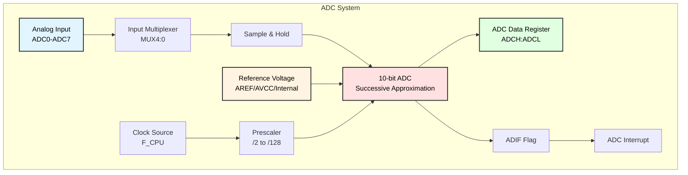
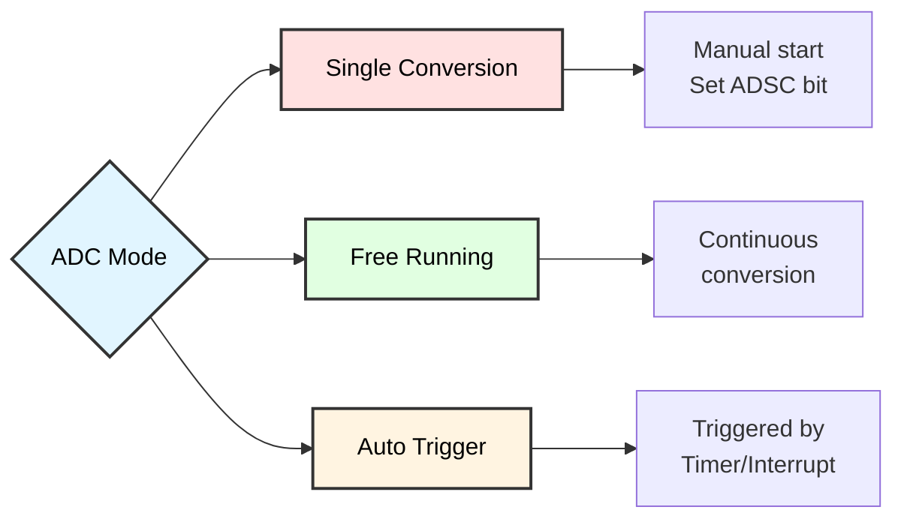
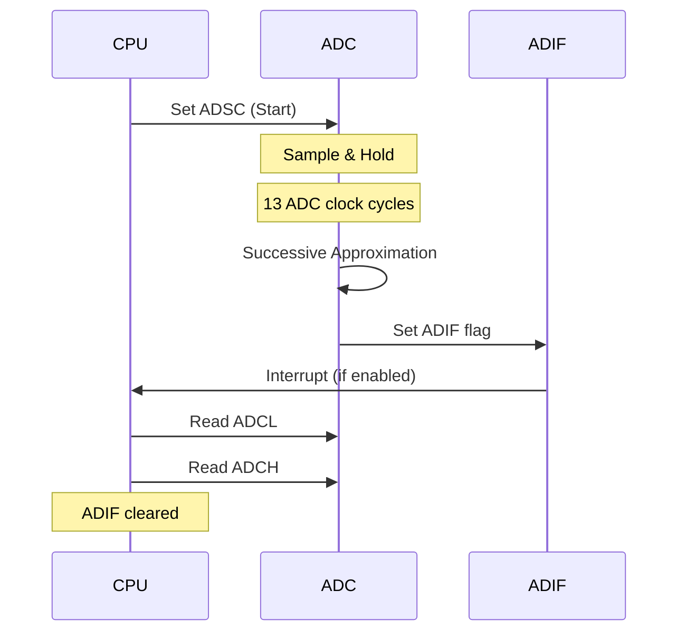
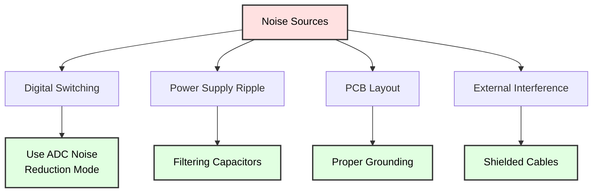
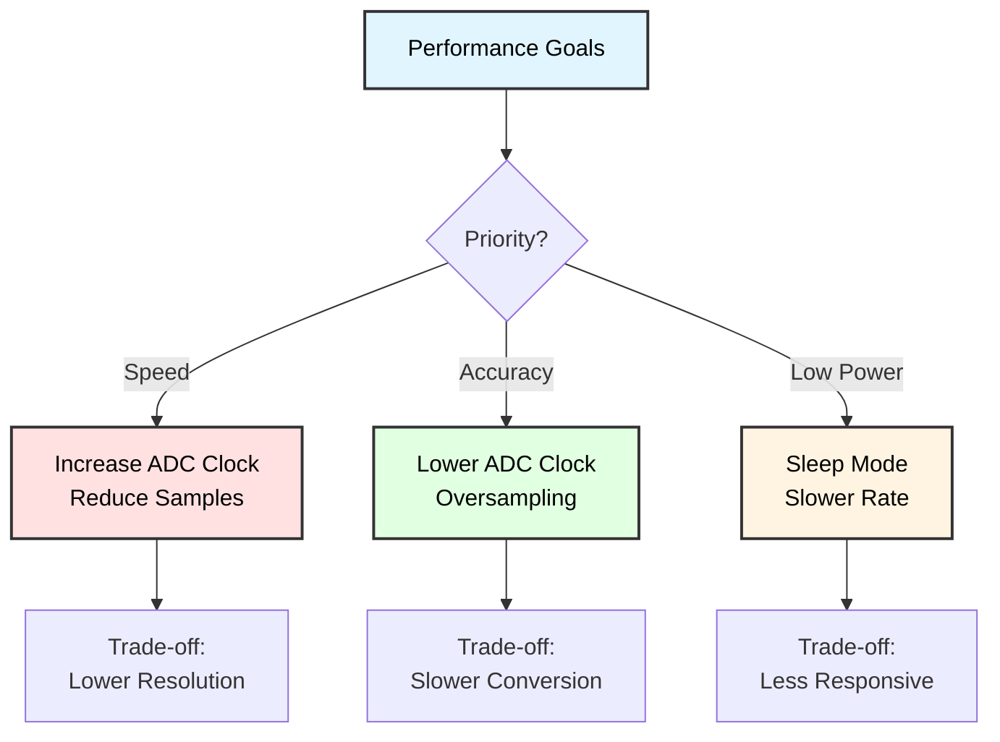
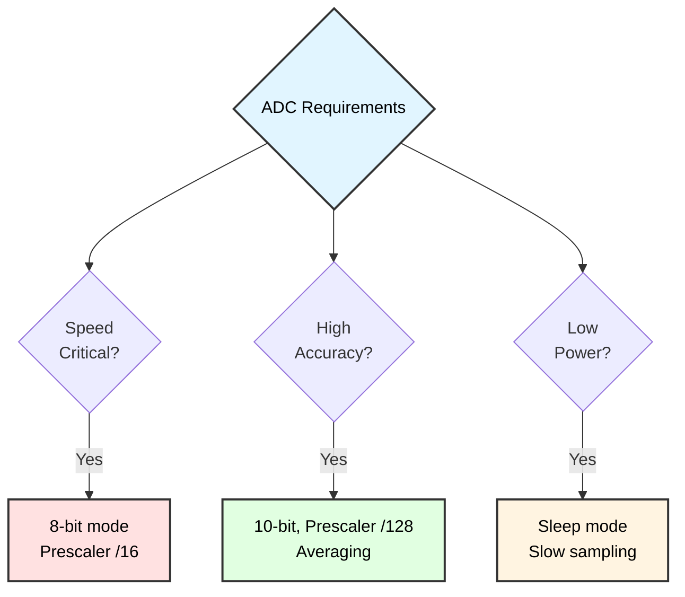

# ADC (Analog-to-Digital Converter) Programming
## ATmega128 Embedded Systems Course

**Reference**: [ATmega128 Datasheet](https://ww1.microchip.com/downloads/en/DeviceDoc/doc2467.pdf)

---

## Slide 1: Introduction to ADC

### What is ADC?
- **Analog-to-Digital Converter** - Converts continuous analog voltages to discrete digital values
- Essential for interfacing with sensors and analog signals
- ATmega128 has **8-channel, 10-bit ADC**

### Why Use ADC?
✓ Read **sensor values** (temperature, light, pressure)  
✓ Measure **voltage levels** (battery monitoring)  
✓ Process **analog signals** (audio, position)  
✓ Interface with **real-world** analog systems  

### Key Specifications
- **Resolution**: 10 bits (0-1023 values)
- **Channels**: 8 single-ended inputs (ADC0-ADC7)
- **Reference Voltage**: AREF, AVCC, or Internal 2.56V
- **Conversion Time**: 13-260 μs (depending on prescaler)

---

## Slide 2: ATmega128 ADC Architecture

### ADC Block Diagram


### Input Channels
- **PORTF**: ADC0-ADC7 (PF0-PF7)
- Single-ended mode: measures voltage relative to GND
- Voltage range: 0V to VREF

---

## Slide 3: ADC Operation Modes

### Conversion Modes


### Single Conversion Mode
1. Select channel
2. Start conversion (ADSC = 1)
3. Wait for completion (ADIF = 1)
4. Read result from ADCH:ADCL

### Free Running Mode
- Continuous conversions
- New conversion starts immediately after previous completes
- Useful for monitoring signals

---

## Slide 4: ADC Control Registers

### ADMUX - ADC Multiplexer Selection Register
```
Bit     7      6      5      4      3      2      1      0
      ┌──────┬──────┬──────┬──────┬──────┬──────┬──────┬──────┐
ADMUX │ REFS1│ REFS0│ ADLAR│ MUX4 │ MUX3 │ MUX2 │ MUX1 │ MUX0 │
      └──────┴──────┴──────┴──────┴──────┴──────┴──────┴──────┘
```

#### REFS1:0 - Reference Voltage Selection
```
00 = AREF pin (external reference)
01 = AVCC with external capacitor at AREF
10 = Reserved
11 = Internal 2.56V with external capacitor at AREF
```

#### ADLAR - ADC Left Adjust Result
```
0 = Right adjusted (default)
1 = Left adjusted (8-bit mode)
```

#### MUX4:0 - Channel Selection
```
00000 = ADC0 (PF0)
00001 = ADC1 (PF1)
00010 = ADC2 (PF2)
...
00111 = ADC7 (PF7)
```

---

## Slide 5: ADC Control and Status Register A

### ADCSRA - ADC Control and Status Register A
```
Bit     7      6      5      4      3      2      1      0
      ┌──────┬──────┬──────┬──────┬──────┬──────┬──────┬──────┐
ADCSRA│ ADEN │ ADSC │ ADATE│ ADIF │ ADIE │ADPS2 │ADPS1 │ADPS0 │
      └──────┴──────┴──────┴──────┴──────┴──────┴──────┴──────┘
```

### Bit Functions

| Bit | Name | Function |
|-----|------|----------|
| **ADEN** | ADC Enable | 1 = Enable ADC |
| **ADSC** | Start Conversion | 1 = Start conversion (stays high during conversion) |
| **ADATE** | Auto Trigger Enable | 1 = Enable auto trigger mode |
| **ADIF** | Interrupt Flag | Set when conversion completes |
| **ADIE** | Interrupt Enable | 1 = Enable ADC interrupt |
| **ADPS2:0** | Prescaler Select | Clock division factor |

### Prescaler Selection (ADPS2:0)
```
000 = /2     100 = /16
001 = /2     101 = /32
010 = /4     110 = /64
011 = /8     111 = /128
```

**Requirement**: ADC clock should be 50-200 kHz for maximum resolution

---

## Slide 6: ADC Data Registers

### ADC Result Registers
```
      ┌──────────────────────────────────────┐
ADCL  │  7   6   5   4   3   2   1   0      │ (Low byte)
      └──────────────────────────────────────┘
      
      ┌──────────────────────────────────────┐
ADCH  │  -   -   -   -   -   -   9   8      │ (High byte)
      └──────────────────────────────────────┘
```

### Right Adjusted (ADLAR = 0)
```
10-bit result: ADCH[1:0] : ADCL[7:0]
Read ADCL first, then ADCH
```

### Left Adjusted (ADLAR = 1)
```
      ┌──────────────────────────────────────┐
ADCL  │  -   -   -   -   -   -   1   0      │
      └──────────────────────────────────────┘
      
      ┌──────────────────────────────────────┐
ADCH  │  9   8   7   6   5   4   3   2      │
      └──────────────────────────────────────┘

8-bit mode: Read only ADCH
```

---

## Slide 7: ADC Timing and Conversion

### Conversion Process


### Conversion Time Calculation
```
Conversion Time = 13 × (1 / ADC_Clock)

Example with F_CPU = 16 MHz, Prescaler = 128:
ADC_Clock = 16 MHz / 128 = 125 kHz
Conversion Time = 13 / 125 kHz = 104 μs
```

### First Conversion
- Takes 25 ADC clock cycles (initialization)
- Subsequent conversions: 13 cycles

---

## Slide 8: Prescaler Selection Guide

### ADC Clock Requirements
- **Optimal Range**: 50-200 kHz for full 10-bit accuracy
- **Maximum**: 1 MHz (reduced resolution)

### Prescaler Selection Table

| F_CPU | Prescaler | ADC Clock | Status |
|-------|-----------|-----------|--------|
| 16 MHz | /128 | 125 kHz | ✓ Optimal |
| 16 MHz | /64 | 250 kHz | ⚠ High but OK |
| 16 MHz | /32 | 500 kHz | ⚠ Reduced accuracy |
| 8 MHz | /64 | 125 kHz | ✓ Optimal |
| 8 MHz | /32 | 250 kHz | ⚠ High but OK |
| 1 MHz | /8 | 125 kHz | ✓ Optimal |

### Calculation
```
Prescaler = F_CPU / Desired_ADC_Clock

For F_CPU = 16 MHz, target 125 kHz:
Prescaler = 16,000,000 / 125,000 = 128
```

---

## Slide 9: Practical Example - Single Conversion

### Complete ADC Initialization
```c
#include <avr/io.h>
#define F_CPU 16000000UL

void adc_init(void) {
    // Select AVCC as reference voltage
    ADMUX = (1 << REFS0);
    
    // Enable ADC, prescaler = 128
    // ADC clock = 16MHz/128 = 125kHz
    ADCSRA = (1 << ADEN) | (1 << ADPS2) | (1 << ADPS1) | (1 << ADPS0);
    
    // Perform dummy conversion (discard first result)
    ADCSRA |= (1 << ADSC);
    while (ADCSRA & (1 << ADSC));
}

uint16_t adc_read(uint8_t channel) {
    // Select channel (0-7)
    ADMUX = (ADMUX & 0xF0) | (channel & 0x0F);
    
    // Start conversion
    ADCSRA |= (1 << ADSC);
    
    // Wait for completion
    while (ADCSRA & (1 << ADSC));
    
    // Read result (10-bit)
    return ADC;  // ADC = (ADCH << 8) | ADCL
}

int main(void) {
    uint16_t adc_value;
    
    adc_init();
    
    while(1) {
        adc_value = adc_read(0);  // Read ADC0
        
        // adc_value is now 0-1023
        // Process the value...
    }
    return 0;
}
```

---

## Slide 10: Voltage Conversion

### Digital to Voltage Conversion
```
Voltage = (ADC_Value × VREF) / 1024

Where:
- ADC_Value: 0-1023 (10-bit)
- VREF: Reference voltage
- 1024: 2^10 (10-bit resolution)
```

### Example Calculations
```c
// With VREF = 5.0V
uint16_t adc_value = 512;
float voltage = (adc_value * 5.0) / 1024.0;
// voltage = 2.5V

// With VREF = 2.56V (internal)
adc_value = 1023;
voltage = (adc_value * 2.56) / 1024.0;
// voltage = 2.56V

// Avoiding floating point (integer math)
uint16_t millivolts = (adc_value * 5000UL) / 1024;
// millivolts = voltage in mV
```

### Resolution
```
Resolution = VREF / 1024

VREF = 5.0V:  Resolution = 4.88 mV/step
VREF = 2.56V: Resolution = 2.5 mV/step
```

---

## Slide 11: Interrupt-Driven ADC

### ADC with Interrupts
```c
#include <avr/io.h>
#include <avr/interrupt.h>

volatile uint16_t adc_result;
volatile uint8_t adc_ready = 0;

void adc_init_interrupt(void) {
    // AVCC reference
    ADMUX = (1 << REFS0);
    
    // Enable ADC, interrupt, prescaler = 128
    ADCSRA = (1 << ADEN) | (1 << ADIE) | 
             (1 << ADPS2) | (1 << ADPS1) | (1 << ADPS0);
    
    // Enable global interrupts
    sei();
}

void adc_start(uint8_t channel) {
    // Select channel
    ADMUX = (ADMUX & 0xF0) | (channel & 0x0F);
    
    // Start conversion
    adc_ready = 0;
    ADCSRA |= (1 << ADSC);
}

// ADC Conversion Complete ISR
ISR(ADC_vect) {
    adc_result = ADC;
    adc_ready = 1;
}

int main(void) {
    adc_init_interrupt();
    
    while(1) {
        adc_start(0);  // Start conversion on ADC0
        
        // Do other work while conversion happens
        
        // Wait for result
        while (!adc_ready);
        
        // Use adc_result
    }
    return 0;
}
```

---

## Slide 12: Free Running Mode

### Continuous Conversion
```c
void adc_free_running_init(void) {
    // AVCC reference, channel 0
    ADMUX = (1 << REFS0);
    
    // Enable ADC, auto trigger, interrupt, prescaler = 128
    ADCSRA = (1 << ADEN) | (1 << ADATE) | (1 << ADIE) |
             (1 << ADPS2) | (1 << ADPS1) | (1 << ADPS0);
    
    // Auto trigger source = Free Running (default in SFIOR)
    SFIOR = 0x00;
    
    // Start first conversion
    ADCSRA |= (1 << ADSC);
    
    sei();
}

volatile uint16_t latest_adc;

ISR(ADC_vect) {
    latest_adc = ADC;
    // Conversion automatically restarts
}

int main(void) {
    adc_free_running_init();
    
    while(1) {
        // latest_adc always has fresh data
        // Use the value for monitoring, display, etc.
    }
    return 0;
}
```

### Free Running Timing

```mermaid
gantt
    title Free Running ADC Conversions
    dateFormat X
    axisFormat %L
    
    section Conversions
    Conv 1 :0, 13
    Conv 2 :13, 13
    Conv 3 :26, 13
    Conv 4 :39, 13
```


---

## Slide 13: Sensor Reading Example

### Reading Temperature Sensor (LM35)
```c
// LM35: 10mV per degree Celsius
// VREF = 5V, ADC range 0-1023

float read_temperature_lm35(void) {
    uint16_t adc_value = adc_read(0);  // Read from ADC0
    
    // Convert to voltage (in mV)
    uint32_t millivolts = (adc_value * 5000UL) / 1024;
    
    // LM35: 10mV per °C
    float temperature = millivolts / 10.0;
    
    return temperature;
}

// Integer version (avoid floating point)
int16_t read_temperature_lm35_int(void) {
    uint16_t adc_value = adc_read(0);
    
    // Temperature in tenths of degree
    // (adc * 5000 / 1024) / 10 = adc * 500 / 1024
    int16_t temp_tenths = (adc_value * 500L) / 1024;
    
    return temp_tenths;  // Divide by 10 for actual temp
}
```

### Reading Light Sensor (LDR/CDS)
```c
uint16_t read_light_level(void) {
    // LDR in voltage divider configuration
    // Higher ADC value = more light (if LDR to GND)
    // or less light (if LDR to VCC)
    
    uint16_t adc_value = adc_read(1);  // ADC1
    
    // Return raw value or percentage
    uint8_t light_percent = (adc_value * 100UL) / 1023;
    
    return light_percent;
}
```

---

## Slide 14: Multi-Channel Scanning

### Scanning Multiple Channels
```c
#define NUM_CHANNELS 4
uint16_t adc_values[NUM_CHANNELS];

void adc_scan_channels(void) {
    for (uint8_t ch = 0; ch < NUM_CHANNELS; ch++) {
        adc_values[ch] = adc_read(ch);
    }
}

// With interrupt and state machine
volatile uint8_t current_channel = 0;

ISR(ADC_vect) {
    adc_values[current_channel] = ADC;
    
    current_channel++;
    if (current_channel >= NUM_CHANNELS) {
        current_channel = 0;
    }
    
    // Select next channel and start conversion
    ADMUX = (ADMUX & 0xF0) | current_channel;
    ADCSRA |= (1 << ADSC);
}

void adc_start_scanning(void) {
    current_channel = 0;
    ADMUX = (ADMUX & 0xF0) | current_channel;
    ADCSRA |= (1 << ADSC);  // Start first conversion
}
```

---

## Slide 15: ADC Noise Reduction

### Sources of Noise


### Hardware Solutions
1. **Decoupling Capacitors**
   - 100nF ceramic near ADC pins
   - 10μF electrolytic on AVCC
   
2. **AREF Capacitor**
   - 0.1μF to GND (required for internal reference)

3. **Separate Analog Ground**
   - AGND connected to DGND at single point

### Software Solutions
```c
// Oversampling and averaging
uint16_t adc_read_averaged(uint8_t channel, uint8_t samples) {
    uint32_t sum = 0;
    
    for (uint8_t i = 0; i < samples; i++) {
        sum += adc_read(channel);
    }
    
    return (uint16_t)(sum / samples);
}

// ADC Noise Reduction Sleep Mode
#include <avr/sleep.h>

uint16_t adc_read_noise_reduced(uint8_t channel) {
    ADMUX = (ADMUX & 0xF0) | (channel & 0x0F);
    
    set_sleep_mode(SLEEP_MODE_ADC);
    sleep_enable();
    
    ADCSRA |= (1 << ADSC);  // Start conversion
    sleep_cpu();             // Sleep during conversion
    sleep_disable();
    
    return ADC;
}
```

---

## Slide 16: 8-bit Fast Mode

### Left-Adjusted Result (ADLAR = 1)
```c
// For applications needing only 8-bit resolution
void adc_init_8bit(void) {
    // AVCC reference, left adjusted
    ADMUX = (1 << REFS0) | (1 << ADLAR);
    
    // Enable ADC, prescaler = 128
    ADCSRA = (1 << ADEN) | (1 << ADPS2) | (1 << ADPS1) | (1 << ADPS0);
}

uint8_t adc_read_8bit(uint8_t channel) {
    // Select channel, keep ADLAR set
    ADMUX = (1 << REFS0) | (1 << ADLAR) | (channel & 0x0F);
    
    // Start conversion
    ADCSRA |= (1 << ADSC);
    
    // Wait for completion
    while (ADCSRA & (1 << ADSC));
    
    // Read only high byte (8-bit result)
    return ADCH;
}
```

### Advantages of 8-bit Mode
✓ **Faster** - Only need to read ADCH  
✓ **Simpler** - No 16-bit handling  
✓ **Sufficient** - Many sensors don't need 10-bit precision  
✓ **Better resolution** - Can use faster ADC clock  

---

## Slide 17: Auto Trigger Sources

### SFIOR - Special Function IO Register
```
Bit     7      6      5      4      3      2      1      0
      ┌──────┬──────┬──────┬──────┬──────┬──────┬──────┬──────┐
SFIOR │ TSM  │  -   │  -   │  -   │ADTS2 │ADTS1 │ADTS0 │  -   │
      └──────┴──────┴──────┴──────┴──────┴──────┴──────┴──────┘
```

### Auto Trigger Source Selection (ADTS2:0)

| ADTS2:0 | Trigger Source |
|---------|----------------|
| 000 | Free Running mode |
| 001 | Analog Comparator |
| 010 | External Interrupt Request 0 |
| 011 | Timer/Counter0 Compare Match |
| 100 | Timer/Counter0 Overflow |
| 101 | Timer/Counter1 Compare Match B |
| 110 | Timer/Counter1 Overflow |
| 111 | Timer/Counter1 Capture Event |

### Example: Timer-Triggered ADC
```c
void adc_timer_trigger_init(void) {
    // ADC setup
    ADMUX = (1 << REFS0);
    ADCSRA = (1 << ADEN) | (1 << ADATE) | (1 << ADIE) |
             (1 << ADPS2) | (1 << ADPS1) | (1 << ADPS0);
    
    // Trigger on Timer0 overflow
    SFIOR = (1 << ADTS2);
    
    // Setup Timer0 for periodic trigger (e.g., 1ms)
    TCCR0 = (1 << CS01) | (1 << CS00);  // Prescaler 64
    
    sei();
}
```

---

## Slide 18: Best Practices

### Design Guidelines

#### 1. Proper Initialization
```c
// Always perform dummy conversion
void adc_init(void) {
    ADMUX = (1 << REFS0);
    ADCSRA = (1 << ADEN) | (1 << ADPS2) | (1 << ADPS1) | (1 << ADPS0);
    
    // First conversion is discarded
    ADCSRA |= (1 << ADSC);
    while (ADCSRA & (1 << ADSC));
}
```

#### 2. Read Sequence for 16-bit
```c
// MUST read ADCL first, then ADCH
uint16_t adc_result;
uint8_t low, high;

low = ADCL;   // Read low byte first (locks high byte)
high = ADCH;  // Read high byte
adc_result = (high << 8) | low;

// Or simply:
adc_result = ADC;  // Compiler handles it correctly
```

#### 3. Channel Switching Delay
```c
// After changing channel, allow time to settle
ADMUX = (ADMUX & 0xF0) | new_channel;
_delay_us(10);  // Small delay
ADCSRA |= (1 << ADSC);
```

#### 4. Reference Voltage Stability
```c
// Use external capacitor on AREF pin
// 0.1μF ceramic recommended
// Allow settling time after changing reference
```

---

## Slide 19: Common Applications

### Application Examples

| Application | Configuration | Notes |
|-------------|---------------|-------|
| **Temperature Sensor** | LM35 on ADC0 | 10mV/°C, 0-100°C range |
| **Light Sensor** | CDS/LDR divider | Use averaging for stability |
| **Potentiometer** | 10kΩ pot on ADC1 | User input, position sensing |
| **Battery Monitor** | Voltage divider | Monitor power supply |
| **Joystick** | 2 channels (X,Y) | Game controller, navigation |
| **Audio Input** | Microphone amp | Fast sampling needed |
| **Accelerometer** | 3 channels (X,Y,Z) | Motion detection |

### Typical Sampling Rates
- **DC signals**: 10-100 Hz sufficient
- **Slow sensors**: 1-10 Hz (temperature)
- **Control loops**: 100-1000 Hz
- **Audio**: 8-44 kHz (requires fast mode)

---

## Slide 20: Debugging ADC Issues

### Common Problems and Solutions

#### Problem 1: Always Reading 0 or 1023
```c
// Check:
ADCSRA |= (1 << ADEN);  // ✓ ADC enabled?
// ✓ Input pin configured (DDRF should be 0 for ADC pins)
// ✓ Voltage actually present on pin?
// ✓ Reference voltage correct?
```

#### Problem 2: Noisy Readings
```c
// Solution: Averaging
uint16_t adc_filtered = adc_read_averaged(channel, 16);

// Or exponential moving average
static uint16_t ema = 0;
uint16_t new_reading = adc_read(channel);
ema = (ema * 7 + new_reading) / 8;  // Alpha = 1/8
```

#### Problem 3: Incorrect Values
```c
// Verify prescaler calculation
// ADC clock should be 50-200 kHz
uint32_t adc_clock = F_CPU / prescaler;
// Check if in range

// Verify reference voltage
// VREF should match physical voltage
```

#### Problem 4: Slow Conversions
```c
// Reduce prescaler (trade-off: less accuracy)
// Or use interrupt/free-running mode
// Don't wait in tight loop if doing other tasks
```

---

## Slide 21: Advanced Techniques

### 1. Oversampling for Higher Resolution
```c
// Increase resolution beyond 10-bit
// Oversample by 4^n for n additional bits

uint16_t adc_read_12bit(uint8_t channel) {
    // 4^1 = 4 samples for 1 extra bit (11-bit)
    // 4^2 = 16 samples for 2 extra bits (12-bit)
    uint32_t sum = 0;
    
    for (uint8_t i = 0; i < 16; i++) {
        sum += adc_read(channel);
    }
    
    // Right shift by (n samples bits - extra bits)
    // 16 samples = 4 bits, want 2 extra bits
    return (uint16_t)(sum >> 2);  // 12-bit result
}
```

### 2. Digital Filtering
```c
// Moving average filter
#define FILTER_SIZE 8
uint16_t filter_buffer[FILTER_SIZE];
uint8_t filter_index = 0;

uint16_t adc_moving_average(uint8_t channel) {
    filter_buffer[filter_index++] = adc_read(channel);
    if (filter_index >= FILTER_SIZE) filter_index = 0;
    
    uint32_t sum = 0;
    for (uint8_t i = 0; i < FILTER_SIZE; i++) {
        sum += filter_buffer[i];
    }
    
    return (uint16_t)(sum / FILTER_SIZE);
}
```

### 3. Calibration
```c
// Two-point calibration
typedef struct {
    uint16_t adc_low;   // ADC reading at known low value
    uint16_t adc_high;  // ADC reading at known high value
    float value_low;    // Actual low value
    float value_high;   // Actual high value
} calibration_t;

float apply_calibration(uint16_t adc_raw, calibration_t *cal) {
    float slope = (cal->value_high - cal->value_low) / 
                  (float)(cal->adc_high - cal->adc_low);
    
    return cal->value_low + slope * (adc_raw - cal->adc_low);
}
```

---

## Slide 22: Complete Sensor Dashboard Example

### Multi-Sensor Monitoring System
```c
#include <avr/io.h>
#include <avr/interrupt.h>

#define TEMP_CHANNEL    0  // LM35 temperature
#define LIGHT_CHANNEL   1  // CDS light sensor
#define POT_CHANNEL     2  // Potentiometer
#define BATTERY_CHANNEL 3  // Battery voltage monitor

volatile uint16_t sensor_data[4];
volatile uint8_t current_sensor = 0;

void sensors_init(void) {
    // AVCC reference
    ADMUX = (1 << REFS0);
    
    // Enable ADC, auto-trigger, interrupt, prescaler 128
    ADCSRA = (1 << ADEN) | (1 << ADATE) | (1 << ADIE) |
             (1 << ADPS2) | (1 << ADPS1) | (1 << ADPS0);
    
    // Free running mode
    SFIOR = 0;
    
    sei();
    
    // Start first conversion
    ADCSRA |= (1 << ADSC);
}

ISR(ADC_vect) {
    // Store result
    sensor_data[current_sensor] = ADC;
    
    // Move to next sensor
    current_sensor++;
    if (current_sensor >= 4) {
        current_sensor = 0;
    }
    
    // Select next channel
    ADMUX = (ADMUX & 0xF0) | current_sensor;
}

float get_temperature(void) {
    // LM35: 10mV/°C, VREF=5V
    return (sensor_data[TEMP_CHANNEL] * 500.0) / 1024.0;
}

uint8_t get_light_percent(void) {
    return (sensor_data[LIGHT_CHANNEL] * 100UL) / 1023;
}

uint8_t get_potentiometer_percent(void) {
    return (sensor_data[POT_CHANNEL] * 100UL) / 1023;
}

float get_battery_voltage(void) {
    // Voltage divider R1=10k, R2=10k (divides by 2)
    // Max input 10V -> ADC sees 5V
    return (sensor_data[BATTERY_CHANNEL] * 10.0) / 1024.0;
}
```

---

## Slide 23: ADC Performance Optimization

### Optimization Strategies



### Speed Optimization
```c
// Fast 8-bit mode
ADMUX = (1 << REFS0) | (1 << ADLAR);
ADCSRA = (1 << ADEN) | (1 << ADPS2);  // Prescaler /16

uint8_t fast_read = ADCH;  // 8-bit only
// Conversion time: ~26 μs @ 16 MHz
```

### Accuracy Optimization
```c
// Slow 10-bit mode with averaging
ADCSRA = (1 << ADEN) | (1 << ADPS2) | (1 << ADPS1) | (1 << ADPS0);

uint16_t accurate_read = adc_read_averaged(channel, 64);
// Trade-off: ~6.6 ms for 64 samples
```

### Power Optimization
```c
// ADC noise reduction mode
set_sleep_mode(SLEEP_MODE_ADC);
ADCSRA |= (1 << ADIE);  // Enable interrupt to wake

// Conversion happens during sleep
// CPU wakes when done
```

---

## Slide 24: Reference Voltage Selection

### Reference Options Comparison

| Reference | REFS1:0 | Voltage | Pros | Cons |
|-----------|---------|---------|------|------|
| **AREF** | 00 | External | Precision, flexibility | Requires external source |
| **AVCC** | 01 | ~5V | Convenient, no ext. ref | Affected by supply noise |
| **Internal** | 11 | 2.56V | Independent, stable | Lower range, needs cap |

### Reference Selection Code
```c
// External AREF (must provide voltage on AREF pin)
void adc_init_external_ref(void) {
    ADMUX = 0;  // REFS1:0 = 00
    ADCSRA = (1 << ADEN) | (1 << ADPS2) | (1 << ADPS1) | (1 << ADPS0);
}

// AVCC as reference (most common)
void adc_init_avcc_ref(void) {
    ADMUX = (1 << REFS0);  // REFS1:0 = 01
    ADCSRA = (1 << ADEN) | (1 << ADPS2) | (1 << ADPS1) | (1 << ADPS0);
}

// Internal 2.56V reference
void adc_init_internal_ref(void) {
    ADMUX = (1 << REFS1) | (1 << REFS0);  // REFS1:0 = 11
    ADCSRA = (1 << ADEN) | (1 << ADPS2) | (1 << ADPS1) | (1 << ADPS0);
    
    // Wait for voltage to stabilize
    _delay_ms(10);
}
```

### When to Use Each
- **AREF**: Precision measurements, known reference voltage
- **AVCC**: General purpose, 0-5V range
- **Internal 2.56V**: Low voltage sensors, independent of supply

---

## Slide 25: ADC Register Quick Reference

### Summary of Registers

```
ADMUX   - Multiplexer Selection
  • REFS1:0  - Reference voltage
  • ADLAR    - Left adjust result
  • MUX4:0   - Channel selection

ADCSRA  - Control and Status Register A
  • ADEN     - ADC Enable
  • ADSC     - Start Conversion
  • ADATE    - Auto Trigger Enable
  • ADIF     - Interrupt Flag
  • ADIE     - Interrupt Enable
  • ADPS2:0  - Prescaler Select

ADCL    - Data Register Low
ADCH    - Data Register High
  • Combined: ADC (16-bit access)

SFIOR   - Special Function IO
  • ADTS2:0  - Auto Trigger Source
```

### Quick Setup Template
```c
void adc_init(void) {
    ADMUX  = (1 << REFS0);           // AVCC reference
    ADCSRA = (1 << ADEN)             // Enable
           | (1 << ADPS2)            // Prescaler
           | (1 << ADPS1) 
           | (1 << ADPS0);           // = 128
}

uint16_t adc_read(uint8_t ch) {
    ADMUX = (ADMUX & 0xF0) | ch;     // Select channel
    ADCSRA |= (1 << ADSC);           // Start
    while (ADCSRA & (1 << ADSC));    // Wait
    return ADC;                       // Return result
}
```

---

## Slide 26: Practice Exercises

### Exercise 1: Basic ADC Reading
**Goal**: Read potentiometer and display value
- Initialize ADC with AVCC reference
- Read ADC channel 0
- Convert to voltage (0-5V)
- Display on LCD or serial

### Exercise 2: Temperature Monitor
**Goal**: Temperature monitoring with alarm
- Read LM35 sensor
- Convert to degrees Celsius
- Trigger buzzer if temp > 30°C
- Update LCD every second

### Exercise 3: Light-Controlled LED
**Goal**: Auto-brightness LED
- Read CDS light sensor
- Map to PWM duty cycle (inverse)
- Darker environment = brighter LED
- Use Timer PWM for LED control

### Exercise 4: Multi-Channel Data Logger
**Goal**: Log multiple sensors
- Read 4 sensors (temp, light, pot, voltage)
- Use interrupt-driven scanning
- Average 8 samples per channel
- Send data via UART every 100ms

### Exercise 5: Joystick Control
**Goal**: 2-axis joystick input
- Read X and Y axes (2 ADC channels)
- Center calibration (512 = center)
- Dead zone implementation
- Display position or control servo/motor

---

## Slide 27: Summary

### Key Takeaways

✓ **ATmega128 ADC** is 10-bit, 8-channel converter  
✓ **Prescaler** must give 50-200 kHz for best accuracy  
✓ **Three references**: AREF, AVCC, Internal 2.56V  
✓ **Three modes**: Single, Free Running, Auto Trigger  
✓ **Read sequence**: ADCL first, then ADCH (or use ADC)  
✓ **First conversion** should be discarded  
✓ **Averaging** improves noise immunity  
✓ **Oversampling** can increase resolution  

### Selection Guide


---

## Slide 28: Additional Resources

### ATmega128 Documentation
- **[Official Datasheet (PDF)](https://ww1.microchip.com/downloads/en/DeviceDoc/doc2467.pdf)**
  - Section 22: Analog-to-Digital Converter
  - Pages 240-260: Complete ADC documentation
  
- **Application Notes**:
  - AVR120: Characterization and Calibration of the ADC
  - AVR121: Enhancing ADC Resolution by Oversampling
  - AVR122: Calibration of the ADC

### Online Resources
- ADC Calculator Tools
- Sensor Interface Examples
- Oversampling Guides

### Next Steps
- Combine ADC with LCD display
- Implement sensor fusion (multiple sensors)
- Build data acquisition system
- Explore differential ADC mode
- Advanced filtering techniques

---

# End of Slides

**Questions?**

For more information, see:
- [ATmega128 Datasheet](https://ww1.microchip.com/downloads/en/DeviceDoc/doc2467.pdf)
- Project source code in `ADC_Basic/`
- Shared libraries: `_adc.h`, `_adc.c`
