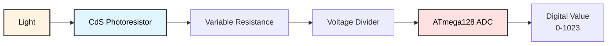

# CDS Light Sensor Programming
## ATmega128 Embedded Systems Course

**Reference**: [ATmega128 Datasheet](https://ww1.microchip.com/downloads/en/DeviceDoc/doc2467.pdf)

---

## Slide 1: Introduction to CDS Photoresistors

### What is a CDS Sensor?
- **CdS (Cadmium Sulfide) Photoresistor** or LDR (Light Dependent Resistor)
- **Resistance changes** with light intensity
- Dark: High resistance (1MΩ - 10MΩ)
- Bright: Low resistance (100Ω - 1kΩ)
- Simple, low-cost ambient light sensor

### CDS Sensor Characteristics
```
Resistance vs Light:
      
R(Ω) │
10M  │ ●
     │  ╲
1M   │   ╲
     │    ●
100k │     ╲
     │      ╲●
10k  │        ╲
     │         ●
1k   │          ╲●
     │            ╲●
100  │              ●
     └────────────────── Light (lux)
     0   10  100  1k  10k
```

### Applications
- **Automatic lighting** - street lights, garden lights
- **Light meters** - photography, displays
- **Day/night detection** - security systems
- **Display brightness** - auto-adjust LCD backlight
- **Sun tracking** - solar panel positioning

### CDS Sensor Architecture


---

## Slide 2: Voltage Divider Circuit

### Why Voltage Divider?
CDS sensor is a **variable resistor**, not a voltage source.  
We need to convert resistance → voltage for ADC reading.

### Voltage Divider Formula
```
         VCC (+5V)
            │
            │
           ┌┴┐
           │ │ R1 (fixed resistor)
           │ │
           └┬┘
            │
            ├────→ Vout (to ADC)
            │
           ┌┴┐
           │ │ CDS (light-dependent resistor)
           │ │
           └┬┘
            │
           GND

Vout = VCC × (R_CDS / (R1 + R_CDS))
```

### Choosing R1 Value
```c
// Target: Maximum sensitivity in operating range
// Typical: R1 = √(R_dark × R_bright)

// Example:
// R_dark = 1 MΩ (night)
// R_bright = 1 kΩ (daylight)
// R1 = √(1000000 × 1000) = √1,000,000,000 = 31,623 Ω
// Use standard value: 33kΩ or 47kΩ

#define R1_VALUE 10000  // 10kΩ typical for indoor use
```

### Circuit Configurations

**Configuration 1: CDS on bottom (more common)**
```
VCC ── R1 ── Vout ── CDS ── GND

Vout increases with light (brighter = higher voltage)
```

**Configuration 2: CDS on top**
```
VCC ── CDS ── Vout ── R1 ── GND

Vout decreases with light (brighter = lower voltage)
```

---

## Slide 3: Hardware Connection

### Wiring Diagram
```
CDS Module/Circuit         ATmega128
-------------------        ---------
VCC                ──→     VCC (5V)
GND                ──→     GND
Vout (analog)      ──→     PF0 (ADC0)

Voltage Divider:
    VCC
     │
    [R1] 10kΩ
     │
     ├─────→ ADC0 (PF0)
     │
    [CDS]
     │
    GND
```

### Multiple Sensor Array
```c
// Use multiple ADC channels for light direction detection
// 4 sensors in cross pattern

#define CDS_FRONT   0  // ADC0
#define CDS_BACK    1  // ADC1
#define CDS_LEFT    2  // ADC2
#define CDS_RIGHT   3  // ADC3

//      FRONT
//        │
// LEFT ──┼── RIGHT
//        │
//       BACK
```

---

## Slide 4: ADC Configuration

### Initialize ADC for Light Sensor
```c
#include <avr/io.h>

void adc_init(void) {
    // Reference: AVCC with external capacitor
    ADMUX = (1 << REFS0);
    
    // Enable ADC, prescaler = 128
    // ADC clock = 16MHz / 128 = 125 kHz
    ADCSRA = (1 << ADEN) | (1 << ADPS2) | (1 << ADPS1) | (1 << ADPS0);
    
    // Dummy conversion (first reading often inaccurate)
    ADCSRA |= (1 << ADSC);
    while (ADCSRA & (1 << ADSC));
}

uint16_t adc_read(uint8_t channel) {
    // Select ADC channel (0-7)
    ADMUX = (ADMUX & 0xF8) | (channel & 0x07);
    
    // Start conversion
    ADCSRA |= (1 << ADSC);
    
    // Wait for completion
    while (ADCSRA & (1 << ADSC));
    
    // Return 10-bit result
    return ADC;
}
```

---

## Slide 5: Basic Light Reading

### Read Light Sensor
```c
#define CDS_CHANNEL  0  // ADC0

uint16_t read_light_raw(void) {
    return adc_read(CDS_CHANNEL);
}

// Convert ADC value to percentage (0-100%)
uint8_t read_light_percent(void) {
    uint16_t adc = read_light_raw();
    
    // Map 0-1023 to 0-100
    return (uint8_t)((uint32_t)adc * 100 / 1023);
}

// Example usage
int main(void) {
    adc_init();
    uart_init();
    
    while (1) {
        uint16_t raw = read_light_raw();
        uint8_t percent = read_light_percent();
        
        printf("Light: %4d (ADC)  %3d%%\n", raw, percent);
        
        _delay_ms(500);
    }
}
```

### Voltage Calculation
```c
// Convert ADC value to voltage
float adc_to_voltage(uint16_t adc) {
    return (float)adc * 5.0 / 1023.0;
}

// Estimate CDS resistance (if R1 is known)
float calculate_cds_resistance(uint16_t adc, uint32_t r1) {
    // Vout = VCC × (R_CDS / (R1 + R_CDS))
    // Solving for R_CDS:
    // R_CDS = R1 × Vout / (VCC - Vout)
    
    float vout = adc_to_voltage(adc);
    float r_cds = r1 * vout / (5.0 - vout);
    
    return r_cds;
}

// Usage
uint16_t adc = read_light_raw();
float volts = adc_to_voltage(adc);
float resistance = calculate_cds_resistance(adc, 10000);

printf("ADC: %d  Voltage: %.2fV  R_CDS: %.0f Ω\n", 
       adc, volts, resistance);
```

---

## Slide 6: Calibration

### Why Calibrate?
- Different sensors have different characteristics
- Ambient light varies (indoor vs outdoor)
- Aging affects sensor response
- Application-specific thresholds

### Calibration Procedure
```c
typedef struct {
    uint16_t dark_level;    // ADC value in darkness
    uint16_t bright_level;  // ADC value in bright light
} light_cal_t;

light_cal_t cal = {0, 1023};  // Default values

void calibrate_light_sensor(void) {
    printf("Light Sensor Calibration\n");
    printf("------------------------\n");
    
    // Calibrate dark level
    printf("1. Cover sensor completely\n");
    printf("   Press button when ready...\n");
    wait_for_button();
    
    _delay_ms(500);
    
    // Average multiple readings
    uint32_t sum = 0;
    for (uint8_t i = 0; i < 10; i++) {
        sum += read_light_raw();
        _delay_ms(100);
    }
    cal.dark_level = sum / 10;
    
    printf("   Dark level: %d\n\n", cal.dark_level);
    
    // Calibrate bright level
    printf("2. Expose sensor to bright light\n");
    printf("   Press button when ready...\n");
    wait_for_button();
    
    _delay_ms(500);
    
    sum = 0;
    for (uint8_t i = 0; i < 10; i++) {
        sum += read_light_raw();
        _delay_ms(100);
    }
    cal.bright_level = sum / 10;
    
    printf("   Bright level: %d\n\n", cal.bright_level);
    
    printf("Calibration complete!\n");
    printf("Range: %d - %d\n", cal.dark_level, cal.bright_level);
    
    // Save to EEPROM
    eeprom_write_block(&cal, (void*)0, sizeof(cal));
}

// Apply calibration to reading
uint8_t read_light_calibrated(void) {
    uint16_t raw = read_light_raw();
    
    // Clamp to calibrated range
    if (raw < cal.dark_level) raw = cal.dark_level;
    if (raw > cal.bright_level) raw = cal.bright_level;
    
    // Map to 0-100%
    return (uint8_t)((uint32_t)(raw - cal.dark_level) * 100 / 
                     (cal.bright_level - cal.dark_level));
}
```

---

## Slide 7: Threshold Detection

### Simple Day/Night Detection
```c
#define THRESHOLD_NIGHT  200  // ADC value
#define THRESHOLD_DAY    600

typedef enum {
    LIGHT_DARK,
    LIGHT_DIM,
    LIGHT_BRIGHT
} light_level_t;

light_level_t get_light_level(void) {
    uint16_t light = read_light_raw();
    
    if (light < THRESHOLD_NIGHT) {
        return LIGHT_DARK;
    } else if (light < THRESHOLD_DAY) {
        return LIGHT_DIM;
    } else {
        return LIGHT_BRIGHT;
    }
}

// Example: Automatic street light
void automatic_light_control(void) {
    #define LED_PIN PB0
    
    DDRB |= (1 << LED_PIN);
    
    while (1) {
        light_level_t level = get_light_level();
        
        if (level == LIGHT_DARK) {
            // Turn light ON
            PORTB |= (1 << LED_PIN);
            printf("Light: ON (dark)\n");
            
        } else if (level == LIGHT_BRIGHT) {
            // Turn light OFF
            PORTB &= ~(1 << LED_PIN);
            printf("Light: OFF (bright)\n");
        }
        // DIM: no change (hysteresis)
        
        _delay_ms(1000);
    }
}
```

### Hysteresis for Stable Switching
```c
// Prevent rapid on/off switching at threshold

#define THRESHOLD_ON   300  // Turn light ON below this
#define THRESHOLD_OFF  500  // Turn light OFF above this

uint8_t light_state = 0;  // 0=OFF, 1=ON

void light_control_with_hysteresis(void) {
    uint16_t light = read_light_raw();
    
    if (light < THRESHOLD_ON && !light_state) {
        // Turn ON
        PORTB |= (1 << LED_PIN);
        light_state = 1;
        printf("Light: ON\n");
        
    } else if (light > THRESHOLD_OFF && light_state) {
        // Turn OFF
        PORTB &= ~(1 << LED_PIN);
        light_state = 0;
        printf("Light: OFF\n");
    }
    
    // Between THRESHOLD_ON and THRESHOLD_OFF: maintain current state
}
```

---

## Slide 8: Filtering

### Exponential Moving Average
```c
// Smooth out noise and rapid fluctuations

float light_filtered = 0;

#define ALPHA 0.1  // Smoothing factor (0-1, lower = smoother)

uint16_t read_light_filtered(void) {
    uint16_t raw = read_light_raw();
    
    // EMA filter
    light_filtered = ALPHA * raw + (1.0 - ALPHA) * light_filtered;
    
    return (uint16_t)light_filtered;
}

// Usage
int main(void) {
    adc_init();
    
    // Initialize filter with first reading
    light_filtered = read_light_raw();
    
    while (1) {
        uint16_t raw = read_light_raw();
        uint16_t filtered = read_light_filtered();
        
        printf("Raw: %4d  Filtered: %4d\n", raw, filtered);
        
        _delay_ms(100);
    }
}
```

### Running Average Filter
```c
#define SAMPLES 10

uint16_t light_buffer[SAMPLES];
uint8_t buffer_index = 0;

uint16_t read_light_averaged(void) {
    // Add new reading to buffer
    light_buffer[buffer_index] = read_light_raw();
    buffer_index = (buffer_index + 1) % SAMPLES;
    
    // Calculate average
    uint32_t sum = 0;
    for (uint8_t i = 0; i < SAMPLES; i++) {
        sum += light_buffer[i];
    }
    
    return (uint16_t)(sum / SAMPLES);
}
```

---

## Slide 9: Application - Automatic Lighting

### Auto-Adjusting LED Brightness
```c
// PWM-controlled LED brightness based on ambient light

void init_pwm(void) {
    // Timer0: Fast PWM, OC0 = PB4
    TCCR0 = (1 << WGM01) | (1 << WGM00) | (1 << COM01) | (1 << CS01);
    DDRB |= (1 << PB4);
}

void auto_brightness(void) {
    adc_init();
    init_pwm();
    
    while (1) {
        uint16_t light = read_light_filtered();
        
        // Inverse relationship: darker = brighter LED
        uint8_t brightness;
        
        if (light < 200) {
            // Very dark: full brightness
            brightness = 255;
        } else if (light > 800) {
            // Very bright: LED off
            brightness = 0;
        } else {
            // Map 200-800 to 255-0
            brightness = (uint8_t)map(light, 200, 800, 255, 0);
        }
        
        // Set PWM duty cycle
        OCR0 = brightness;
        
        _delay_ms(100);
    }
}

// Multi-level lighting
void smart_lighting(void) {
    uint16_t light = read_light_calibrated();  // 0-100%
    
    if (light < 10) {
        // Night mode: warm dim light
        set_led_brightness(30);
        printf("Mode: NIGHT (30%%)\n");
        
    } else if (light < 30) {
        // Evening mode: medium brightness
        set_led_brightness(70);
        printf("Mode: EVENING (70%%)\n");
        
    } else if (light < 70) {
        // Day mode: off or very dim
        set_led_brightness(0);
        printf("Mode: DAY (OFF)\n");
        
    } else {
        // Bright mode: completely off
        set_led_brightness(0);
        printf("Mode: BRIGHT (OFF)\n");
    }
}
```

---

## Slide 10: Application - LCD Backlight Control

### Auto-Adjust LCD Backlight
```c
// Adjust LCD backlight PWM based on ambient light

#define LCD_BL_PIN PB5  // OC1A

void init_lcd_backlight(void) {
    // Timer1: Fast PWM, 8-bit
    TCCR1A = (1 << WGM10) | (1 << COM1A1);
    TCCR1B = (1 << WGM12) | (1 << CS11);  // Prescaler = 8
    
    DDRB |= (1 << LCD_BL_PIN);
}

void lcd_backlight_auto(void) {
    adc_init();
    init_lcd_backlight();
    lcd_init();
    
    while (1) {
        uint16_t light = read_light_filtered();
        
        // Brighter ambient = brighter backlight
        uint8_t backlight;
        
        if (light < 100) {
            backlight = 50;   // Dim in dark
        } else if (light > 900) {
            backlight = 255;  // Bright in bright light
        } else {
            backlight = (uint8_t)map(light, 100, 900, 50, 255);
        }
        
        OCR1A = backlight;
        
        // Display light level on LCD
        lcd_gotoxy(0, 0);
        printf("Light: %3d%%", (light * 100) / 1023);
        lcd_gotoxy(0, 1);
        printf("Backlight: %3d", backlight);
        
        _delay_ms(200);
    }
}
```

---

## Slide 11: Application - Light Tracking

### 4-Sensor Light Direction Detector
```c
typedef struct {
    uint16_t front;
    uint16_t back;
    uint16_t left;
    uint16_t right;
} light_array_t;

light_array_t sensors;

void read_light_array(void) {
    sensors.front = adc_read(CDS_FRONT);
    sensors.back  = adc_read(CDS_BACK);
    sensors.left  = adc_read(CDS_LEFT);
    sensors.right = adc_read(CDS_RIGHT);
}

typedef enum {
    LIGHT_DIR_CENTER,
    LIGHT_DIR_FRONT,
    LIGHT_DIR_BACK,
    LIGHT_DIR_LEFT,
    LIGHT_DIR_RIGHT,
    LIGHT_DIR_FRONT_LEFT,
    LIGHT_DIR_FRONT_RIGHT,
    LIGHT_DIR_BACK_LEFT,
    LIGHT_DIR_BACK_RIGHT
} light_direction_t;

light_direction_t get_light_direction(void) {
    read_light_array();
    
    // Find brightest sensor
    uint16_t max = sensors.front;
    light_direction_t dir = LIGHT_DIR_FRONT;
    
    if (sensors.back > max) {
        max = sensors.back;
        dir = LIGHT_DIR_BACK;
    }
    if (sensors.left > max) {
        max = sensors.left;
        dir = LIGHT_DIR_LEFT;
    }
    if (sensors.right > max) {
        max = sensors.right;
        dir = LIGHT_DIR_RIGHT;
    }
    
    // Check if difference is significant
    #define THRESHOLD_DIFF 50
    
    if (max - sensors.front < THRESHOLD_DIFF &&
        max - sensors.back < THRESHOLD_DIFF &&
        max - sensors.left < THRESHOLD_DIFF &&
        max - sensors.right < THRESHOLD_DIFF) {
        // All sensors similar = centered or ambient
        return LIGHT_DIR_CENTER;
    }
    
    return dir;
}

// Solar tracker application
void solar_tracker(void) {
    while (1) {
        light_direction_t dir = get_light_direction();
        
        switch (dir) {
            case LIGHT_DIR_FRONT:
                servo_tilt_up();
                break;
            case LIGHT_DIR_BACK:
                servo_tilt_down();
                break;
            case LIGHT_DIR_LEFT:
                servo_pan_left();
                break;
            case LIGHT_DIR_RIGHT:
                servo_pan_right();
                break;
            case LIGHT_DIR_CENTER:
                servo_stop();
                break;
            default:
                break;
        }
        
        _delay_ms(100);
    }
}
```

---

## Slide 12: Application - Light Meter

### Lux Estimation
```c
// Approximate conversion to lux (requires calibration)

float estimate_lux(uint16_t adc) {
    // This is sensor-specific and approximate
    // Proper calibration requires a reference lux meter
    
    // Example formula (adjust for your sensor):
    // lux = k × (R_CDS)^(-γ)
    
    float r_cds = calculate_cds_resistance(adc, 10000);
    
    // Typical values: k = 50000, γ = 0.7
    float lux = 50000.0 * pow(r_cds / 1000.0, -0.7);
    
    return lux;
}

void light_meter(void) {
    adc_init();
    lcd_init();
    
    while (1) {
        uint16_t adc = read_light_filtered();
        float lux = estimate_lux(adc);
        
        lcd_clear();
        lcd_puts("Light Meter");
        
        lcd_gotoxy(0, 1);
        if (lux < 1) {
            printf("%.2f lux", lux);
        } else if (lux < 1000) {
            printf("%.0f lux", lux);
        } else {
            printf("%.1f klux", lux / 1000.0);
        }
        
        // Show condition
        lcd_gotoxy(10, 1);
        if (lux < 10) {
            lcd_puts("DARK");
        } else if (lux < 100) {
            lcd_puts("DIM");
        } else if (lux < 1000) {
            lcd_puts("ROOM");
        } else {
            lcd_puts("BRIGHT");
        }
        
        _delay_ms(500);
    }
}
```

---

## Slide 13: Application - Data Logger

### Log Light Levels Over Time
```c
#include <avr/eeprom.h>

#define LOG_SIZE 100
uint16_t light_log[LOG_SIZE] EEMEM;
uint8_t log_index = 0;

void log_light_level(void) {
    uint16_t light = read_light_filtered();
    
    // Write to EEPROM
    eeprom_write_word(&light_log[log_index], light);
    
    log_index++;
    if (log_index >= LOG_SIZE) {
        log_index = 0;  // Wrap around (circular buffer)
    }
}

void display_log(void) {
    printf("Light Level Log:\n");
    printf("----------------\n");
    
    for (uint8_t i = 0; i < LOG_SIZE; i++) {
        uint16_t value = eeprom_read_word(&light_log[i]);
        
        if (value == 0xFFFF) {
            // Unwritten EEPROM location
            break;
        }
        
        printf("%3d: %4d (", i, value);
        
        // Bar graph
        uint8_t bars = value / 64;  // 0-15
        for (uint8_t j = 0; j < bars; j++) {
            printf("#");
        }
        printf(")\n");
    }
}

// Timed logging
void auto_logger(void) {
    adc_init();
    timer_init();  // 1-minute interval
    
    printf("Starting light logger...\n");
    printf("Logging every 1 minute\n");
    
    while (1) {
        if (timer_expired()) {
            log_light_level();
            
            uint16_t light = read_light_filtered();
            printf("[%3d] Light: %4d\n", log_index, light);
            
            timer_reset();
        }
        
        _delay_ms(100);
    }
}
```

---

## Slide 14: Advanced - Change Detection

### Detect Rapid Light Changes
```c
uint16_t last_light = 0;

#define CHANGE_THRESHOLD 100

uint8_t detect_light_change(void) {
    uint16_t current = read_light_filtered();
    
    int16_t delta = current - last_light;
    
    if (abs(delta) > CHANGE_THRESHOLD) {
        last_light = current;
        return 1;  // Significant change detected
    }
    
    last_light = current;
    return 0;  // No significant change
}

// Motion detector (shadow detection)
void shadow_detector(void) {
    adc_init();
    last_light = read_light_filtered();
    
    printf("Shadow detector active\n");
    
    while (1) {
        if (detect_light_change()) {
            uint16_t current = read_light_filtered();
            
            if (current < last_light - CHANGE_THRESHOLD) {
                printf("ALERT: Shadow detected!\n");
                trigger_alarm();
            } else {
                printf("Light increased\n");
            }
        }
        
        _delay_ms(50);
    }
}
```

---

## Slide 15: Multiple Sensors - Average and Comparison

### Averaging Multiple Sensors
```c
#define NUM_SENSORS 4

uint16_t read_light_average(void) {
    uint32_t sum = 0;
    
    for (uint8_t i = 0; i < NUM_SENSORS; i++) {
        sum += adc_read(i);
    }
    
    return (uint16_t)(sum / NUM_SENSORS);
}

// Find brightest and darkest sensors
void find_extremes(uint16_t *min, uint16_t *max, uint8_t *min_ch, uint8_t *max_ch) {
    *min = 1023;
    *max = 0;
    
    for (uint8_t i = 0; i < NUM_SENSORS; i++) {
        uint16_t value = adc_read(i);
        
        if (value < *min) {
            *min = value;
            *min_ch = i;
        }
        
        if (value > *max) {
            *max = value;
            *max_ch = i;
        }
    }
}

// Example: Light balance detection
void check_light_balance(void) {
    uint16_t min, max;
    uint8_t min_ch, max_ch;
    
    find_extremes(&min, &max, &min_ch, &max_ch);
    
    uint16_t difference = max - min;
    
    if (difference < 50) {
        printf("Light: BALANCED\n");
    } else {
        printf("Light: UNBALANCED (diff: %d)\n", difference);
        printf("Darkest: CH%d (%d)\n", min_ch, min);
        printf("Brightest: CH%d (%d)\n", max_ch, max);
    }
}
```

---

## Slide 16: Troubleshooting

### Common Issues

| Problem | Cause | Solution |
|---------|-------|----------|
| **Reading always 0 or 1023** | CDS disconnected | Check wiring |
| **No variation** | Wrong ADC channel | Verify ADMUX setting |
| **Noisy readings** | No filtering | Add capacitor (0.1µF) or software filter |
| **Inverted response** | Circuit reversed | Swap R1 and CDS positions |
| **Slow response** | R1 too large + ADC input capacitance | Use smaller R1 (1-10kΩ) |
| **Limited range** | R1 mismatch | Choose R1 = √(R_dark × R_bright) |

### Debugging Code
```c
void cds_diagnostic(void) {
    adc_init();
    uart_init();
    
    printf("CDS Sensor Diagnostic\n");
    printf("---------------------\n");
    
    // Test ADC
    printf("ADC Test:\n");
    for (uint8_t ch = 0; ch < 4; ch++) {
        uint16_t value = adc_read(ch);
        printf("ADC%d: %4d (0x%03X) %.2fV\n", 
               ch, value, value, adc_to_voltage(value));
    }
    
    printf("\nContinuous monitoring:\n");
    printf("Cover/uncover sensor...\n\n");
    
    uint16_t min = 1023, max = 0;
    
    for (uint8_t i = 0; i < 50; i++) {
        uint16_t light = read_light_raw();
        
        if (light < min) min = light;
        if (light > max) max = light;
        
        printf("Light: %4d   Min: %4d   Max: %4d   Range: %4d  [", 
               light, min, max, max - min);
        
        // Bar graph
        uint8_t bars = light / 64;
        for (uint8_t j = 0; j < 16; j++) {
            printf(j < bars ? "#" : "-");
        }
        printf("]\n");
        
        _delay_ms(200);
    }
    
    printf("\nDiagnostic complete.\n");
    printf("Observed range: %d - %d\n", min, max);
    
    if (max - min < 100) {
        printf("WARNING: Limited range. Check:\n");
        printf("  - Sensor connection\n");
        printf("  - R1 value\n");
        printf("  - Light variation\n");
    }
}
```

---

## Slide 17: Best Practices

### CDS Sensor Programming Guidelines

✓ **Use voltage divider** with appropriate R1
```c
// R1 = √(R_dark × R_bright) for best sensitivity
#define R1_VALUE 10000  // 10kΩ typical
```

✓ **Filter readings** for stability
```c
// Exponential moving average
filtered = ALPHA * new + (1 - ALPHA) * filtered;
```

✓ **Calibrate** for application
```c
// Store min/max values
eeprom_write_block(&cal, (void*)0, sizeof(cal));
```

✓ **Use hysteresis** for threshold switching
```c
#define THRESHOLD_ON   300
#define THRESHOLD_OFF  500  // Higher than ON
```

✓ **Protect sensor** from physical damage
- CdS is fragile - handle carefully
- Avoid excessive heat (>70°C)
- Protect from moisture

✓ **Consider response time**
- CDS sensors are slow (100ms - several seconds)
- Not suitable for fast light detection
- Use photodiodes or phototransistors for speed

---

## Slide 18: Summary

### Key Concepts

✓ **CDS sensor** = light-dependent resistor  
✓ **Voltage divider** converts resistance to voltage  
✓ **ADC** reads 0-1023 proportional to light  
✓ **Calibration** improves accuracy  
✓ **Filtering** reduces noise  
✓ **Hysteresis** prevents flickering  
✓ **Multiple sensors** enable direction detection  

### Light Level Reference
```
Environment               Lux       ADC (typical, 10kΩ R1)
---------------------  ---------   -----------------------
Full moonlight            0.1           10-50
Indoor dim lighting       10            100-200
Office lighting           300-500       400-600
Overcast day              1,000         700-800
Full daylight             10,000        900-950
Direct sunlight           100,000       980-1000
```

### Applications
- Automatic lighting control
- LCD backlight adjustment
- Solar panel tracking
- Light meters and data loggers
- Security (shadow detection)
- Photography exposure metering

---

## Slide 19: Practice Exercises

### Exercise 1: Basic Light Reading
**Goal**: Read and display light levels
- Initialize ADC
- Read CDS sensor on ADC0
- Display raw ADC value
- Calculate and display percentage

### Exercise 2: Automatic LED
**Goal**: Control LED based on light
- Turn LED on when dark (<300 ADC)
- Turn LED off when bright (>700 ADC)
- Implement hysteresis
- Add visual feedback on LCD

### Exercise 3: PWM Brightness Control
**Goal**: Auto-adjust LED brightness
- Read light level
- Map to PWM duty cycle (inverse)
- Darker ambient = brighter LED
- Use filtering for smooth transitions

### Exercise 4: Light Direction Detector
**Goal**: Find brightest direction
- Use 4 CDS sensors
- Determine light source direction
- Display on LCD with arrows
- Control servo to point at light

### Exercise 5: Data Logger
**Goal**: Log light levels over time
- Sample every 10 seconds
- Store 100 samples in EEPROM
- Display log as bar graph
- Calculate min/max/average

---

## Slide 20: Additional Resources

### ATmega128 Documentation
- **[Official Datasheet (PDF)](https://ww1.microchip.com/downloads/en/DeviceDoc/doc2467.pdf)**
  - Section 24: ADC
  - ADC characteristics and timing
  - Reference voltage selection

### CDS Sensor Resources
- Photoresistor datasheets
- Light measurement units (lux, lumens)
- Voltage divider design calculators
- Response time characteristics

### Application Notes
- Light sensing circuit design
- Filtering and signal conditioning
- Solar tracking algorithms
- Automatic lighting control

### Tools
- Lux meter for calibration
- Oscilloscope for response time analysis
- Serial plotter for visualization

---

# End of Slides

**Questions?**

For more information, see:
- [ATmega128 Datasheet](https://ww1.microchip.com/downloads/en/DeviceDoc/doc2467.pdf)
- Project source code in `CDS_Light_Sensor/`
- Shared libraries: `_adc.h`, `_light_sensor.h`
