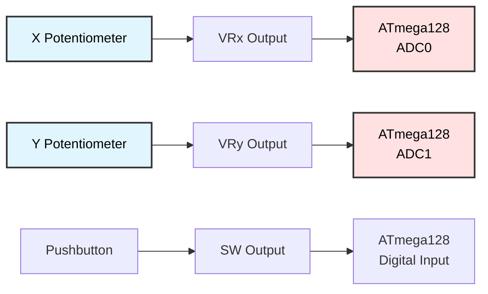
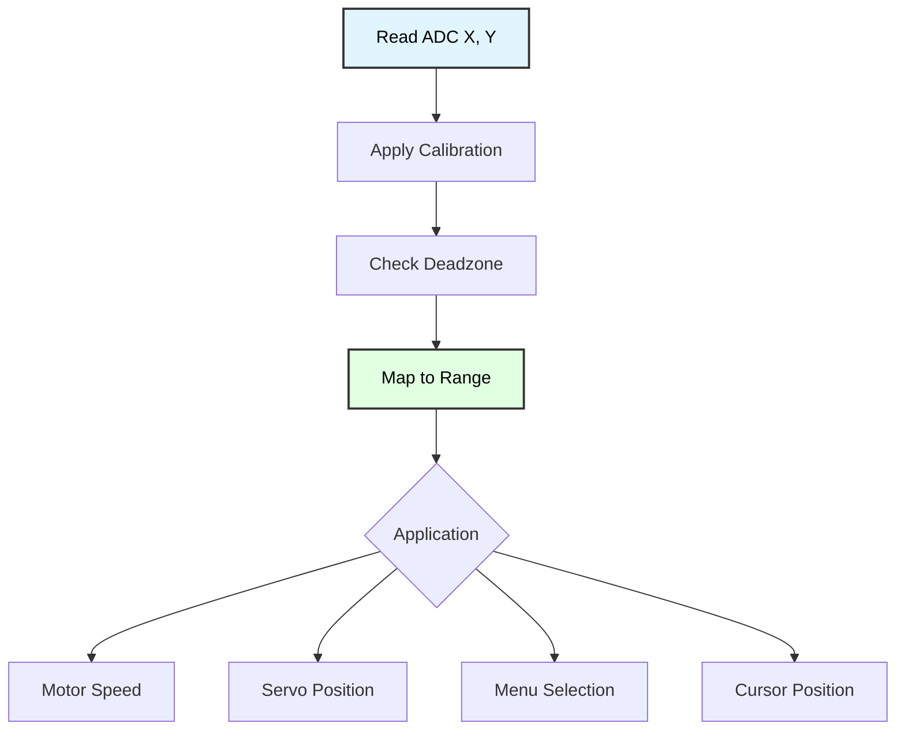

# Analog Joystick Programming
## ATmega128 Embedded Systems Course

**Reference**: [ATmega128 Datasheet](https://ww1.microchip.com/downloads/en/DeviceDoc/doc2467.pdf)

---

## Slide 1: Introduction to Analog Joysticks

### What is an Analog Joystick?
- **Two-axis analog input device** (X and Y)
- Each axis uses a **potentiometer** (variable resistor)
- Output: **0-5V** analog voltage proportional to position
- Often includes **pushbutton switch** (Z-axis/select)

### Joystick Applications
- **Game controllers** and UI navigation
- **Robot control** - pan/tilt, drive direction
- **Camera gimbals** - smooth positioning
- **Industrial HMI** - machine control panels

### Joystick Module Pinout
```
Typical 5-pin joystick module:
┌─────────────┐
│  VCC  │ GND │  ← Power (5V, GND)
│  VRx  │ VRy │  ← Analog outputs
│    SW       │  ← Pushbutton (active LOW)
└─────────────┘
```

### Joystick Architecture


---

## Slide 2: Hardware Connection

### Wiring Diagram
```
Joystick Module          ATmega128
---------------          ---------
VCC (5V)    ────────→    VCC
GND         ────────→    GND
VRx         ────────→    PF0 (ADC0)
VRy         ────────→    PF1 (ADC1)
SW          ────────→    PB0 (Digital Input)
            ┌──────┐
            │ 10kΩ │ Pull-up for SW
            └──────┘
```

### Physical Orientation
```
Top view of joystick:

         UP (Y = MAX)
            │
            │
LEFT ───────┼─────── RIGHT
(X = MIN)   │      (X = MAX)
            │
          DOWN (Y = MIN)

Center position: X = ~512, Y = ~512 (10-bit ADC)
```

### Pin Assignments
```c
// ADC channels for joystick axes
#define JOY_X_CHANNEL  0  // ADC0 (PF0)
#define JOY_Y_CHANNEL  1  // ADC1 (PF1)

// Digital input for button
#define JOY_SW_PIN     PB0
#define JOY_SW_PORT    PINB
```

---

## Slide 3: ADC Configuration for Joystick

### Initialize ADC
```c
#include <avr/io.h>

void adc_init(void) {
    // Reference voltage: AVCC (5V)
    ADMUX = (1 << REFS0);
    
    // Enable ADC, prescaler = 128 (125 kHz @ 16 MHz)
    ADCSRA = (1 << ADEN) | (1 << ADPS2) | (1 << ADPS1) | (1 << ADPS0);
    
    // First conversion (dummy)
    ADCSRA |= (1 << ADSC);
    while (ADCSRA & (1 << ADSC));
}

uint16_t adc_read(uint8_t channel) {
    // Select channel (0-7)
    ADMUX = (ADMUX & 0xF8) | (channel & 0x07);
    
    // Start conversion
    ADCSRA |= (1 << ADSC);
    
    // Wait for completion
    while (ADCSRA & (1 << ADSC));
    
    // Return 10-bit result
    return ADC;
}
```

---

## Slide 4: Reading Joystick Position

### Joystick Data Structure
```c
typedef struct {
    uint16_t x;      // X-axis ADC value (0-1023)
    uint16_t y;      // Y-axis ADC value (0-1023)
    uint8_t button;  // Button state (0=pressed, 1=released)
} joystick_t;

joystick_t joystick;
```

### Read Joystick Function
```c
void joystick_init(void) {
    // Initialize ADC
    adc_init();
    
    // Configure button pin as input with pull-up
    DDRB &= ~(1 << JOY_SW_PIN);
    PORTB |= (1 << JOY_SW_PIN);
}

void joystick_read(joystick_t *joy) {
    // Read X and Y axes
    joy->x = adc_read(JOY_X_CHANNEL);
    joy->y = adc_read(JOY_Y_CHANNEL);
    
    // Read button (inverted - pressed = LOW)
    joy->button = (JOY_SW_PORT & (1 << JOY_SW_PIN)) ? 1 : 0;
}

// Usage example
int main(void) {
    joystick_init();
    uart_init();
    
    while (1) {
        joystick_read(&joystick);
        
        printf("X: %4d  Y: %4d  BTN: %d\n", 
               joystick.x, joystick.y, joystick.button);
        
        _delay_ms(100);
    }
}
```

---

## Slide 5: Calibration

### Why Calibrate?
- **Center position** may not be exactly 512
- **Range** may not be full 0-1023
- **Dead zone** around center for stability

### Calibration Data
```c
typedef struct {
    uint16_t x_min;
    uint16_t x_max;
    uint16_t x_center;
    uint16_t y_min;
    uint16_t y_max;
    uint16_t y_center;
    uint16_t deadzone;  // ± from center
} joystick_cal_t;

// Default calibration (will be updated)
joystick_cal_t cal = {
    .x_min = 0,
    .x_max = 1023,
    .x_center = 512,
    .y_min = 0,
    .y_max = 1023,
    .y_center = 512,
    .deadzone = 20
};
```

### Calibration Procedure
```c
void joystick_calibrate(void) {
    printf("Calibration procedure:\n");
    printf("1. Center joystick, press button\n");
    
    // Wait for button press
    while (JOY_SW_PORT & (1 << JOY_SW_PIN));
    _delay_ms(50);
    
    // Read center position
    cal.x_center = adc_read(JOY_X_CHANNEL);
    cal.y_center = adc_read(JOY_Y_CHANNEL);
    
    while (!(JOY_SW_PORT & (1 << JOY_SW_PIN)));
    _delay_ms(50);
    
    printf("Center: X=%d Y=%d\n", cal.x_center, cal.y_center);
    
    printf("2. Move joystick in full circle\n");
    printf("   Press button when done\n");
    
    cal.x_min = 1023;
    cal.x_max = 0;
    cal.y_min = 1023;
    cal.y_max = 0;
    
    // Collect min/max while user moves joystick
    while (JOY_SW_PORT & (1 << JOY_SW_PIN)) {
        uint16_t x = adc_read(JOY_X_CHANNEL);
        uint16_t y = adc_read(JOY_Y_CHANNEL);
        
        if (x < cal.x_min) cal.x_min = x;
        if (x > cal.x_max) cal.x_max = x;
        if (y < cal.y_min) cal.y_min = y;
        if (y > cal.y_max) cal.y_max = y;
        
        _delay_ms(10);
    }
    
    printf("X range: %d - %d\n", cal.x_min, cal.x_max);
    printf("Y range: %d - %d\n", cal.y_min, cal.y_max);
    printf("Calibration complete!\n");
}
```

---

## Slide 6: Position Mapping

### Map to -127 to +127 Range
```c
int8_t joystick_map_axis(uint16_t raw, uint16_t min, uint16_t center, uint16_t max) {
    int16_t value;
    
    if (raw < center) {
        // Map min..center to -127..0
        value = map(raw, min, center, -127, 0);
    } else {
        // Map center..max to 0..+127
        value = map(raw, center, max, 0, 127);
    }
    
    // Apply deadzone
    if (abs(value) < (cal.deadzone / 4)) {
        value = 0;
    }
    
    return (int8_t)value;
}

// Standard map function
int16_t map(int16_t x, int16_t in_min, int16_t in_max, int16_t out_min, int16_t out_max) {
    return (x - in_min) * (out_max - out_min) / (in_max - in_min) + out_min;
}

// Get mapped position
void joystick_get_position(int8_t *x, int8_t *y) {
    joystick_read(&joystick);
    
    *x = joystick_map_axis(joystick.x, cal.x_min, cal.x_center, cal.x_max);
    *y = joystick_map_axis(joystick.y, cal.y_min, cal.y_center, cal.y_max);
}

// Usage
int main(void) {
    joystick_init();
    joystick_calibrate();
    
    int8_t x, y;
    
    while (1) {
        joystick_get_position(&x, &y);
        printf("Position: X=%4d Y=%4d\n", x, y);
        _delay_ms(100);
    }
}
```

---

## Slide 7: Direction Detection

### 8-Direction Detection
```c
typedef enum {
    DIR_CENTER,
    DIR_UP,
    DIR_UP_RIGHT,
    DIR_RIGHT,
    DIR_DOWN_RIGHT,
    DIR_DOWN,
    DIR_DOWN_LEFT,
    DIR_LEFT,
    DIR_UP_LEFT
} direction_t;

direction_t joystick_get_direction(void) {
    int8_t x, y;
    joystick_get_position(&x, &y);
    
    // Threshold for direction detection
    #define THRESHOLD 30
    
    if (abs(x) < THRESHOLD && abs(y) < THRESHOLD) {
        return DIR_CENTER;
    }
    
    // Determine angle (8 directions)
    if (y > THRESHOLD) {
        // Up quadrant
        if (x > THRESHOLD)      return DIR_UP_RIGHT;
        else if (x < -THRESHOLD) return DIR_UP_LEFT;
        else                     return DIR_UP;
        
    } else if (y < -THRESHOLD) {
        // Down quadrant
        if (x > THRESHOLD)      return DIR_DOWN_RIGHT;
        else if (x < -THRESHOLD) return DIR_DOWN_LEFT;
        else                     return DIR_DOWN;
        
    } else {
        // Left/Right
        if (x > THRESHOLD)      return DIR_RIGHT;
        else                     return DIR_LEFT;
    }
}

const char* direction_names[] = {
    "CENTER", "UP", "UP-RIGHT", "RIGHT", "DOWN-RIGHT",
    "DOWN", "DOWN-LEFT", "LEFT", "UP-LEFT"
};

int main(void) {
    joystick_init();
    
    direction_t last_dir = DIR_CENTER;
    
    while (1) {
        direction_t dir = joystick_get_direction();
        
        if (dir != last_dir) {
            printf("Direction: %s\n", direction_names[dir]);
            last_dir = dir;
        }
        
        _delay_ms(50);
    }
}
```

---

## Slide 8: Application - Menu Navigation

### Menu Control with Joystick
```c
const char *menu_items[] = {
    "1. Start Game",
    "2. Settings",
    "3. High Scores",
    "4. Exit"
};

#define MENU_COUNT 4

uint8_t selected_item = 0;

void display_menu(void) {
    lcd_clear();
    
    // Show current and next item
    lcd_gotoxy(0, 0);
    lcd_putc('>');
    lcd_puts(menu_items[selected_item]);
    
    if (selected_item + 1 < MENU_COUNT) {
        lcd_gotoxy(0, 1);
        lcd_putc(' ');
        lcd_puts(menu_items[selected_item + 1]);
    }
}

void menu_navigation(void) {
    display_menu();
    
    direction_t last_dir = DIR_CENTER;
    
    while (1) {
        direction_t dir = joystick_get_direction();
        
        // Detect direction change
        if (dir != last_dir && last_dir == DIR_CENTER) {
            if (dir == DIR_UP) {
                // Move up
                if (selected_item > 0) {
                    selected_item--;
                    display_menu();
                }
                
            } else if (dir == DIR_DOWN) {
                // Move down
                if (selected_item < MENU_COUNT - 1) {
                    selected_item++;
                    display_menu();
                }
            }
        }
        
        // Button press = select
        joystick_read(&joystick);
        if (!joystick.button) {
            lcd_clear();
            lcd_puts("Selected:");
            lcd_gotoxy(0, 1);
            lcd_puts(menu_items[selected_item]);
            _delay_ms(2000);
            display_menu();
        }
        
        last_dir = dir;
        _delay_ms(50);
    }
}
```

---

## Slide 9: Application - Cursor Control

### LCD Cursor Control
```c
typedef struct {
    uint8_t x;  // Column (0-15)
    uint8_t y;  // Row (0-1)
} cursor_t;

cursor_t cursor = {0, 0};

void draw_screen(void) {
    lcd_clear();
    lcd_puts("Cursor Control");
    
    // Draw cursor position
    lcd_gotoxy(cursor.x, cursor.y);
    lcd_putc('X');
}

void cursor_control(void) {
    draw_screen();
    
    uint32_t last_move = 0;
    #define MOVE_DELAY_MS 200
    
    while (1) {
        direction_t dir = joystick_get_direction();
        
        if (dir != DIR_CENTER && (millis() - last_move > MOVE_DELAY_MS)) {
            uint8_t moved = 0;
            
            switch (dir) {
                case DIR_UP:
                    if (cursor.y > 0) {
                        cursor.y--;
                        moved = 1;
                    }
                    break;
                    
                case DIR_DOWN:
                    if (cursor.y < 1) {
                        cursor.y++;
                        moved = 1;
                    }
                    break;
                    
                case DIR_LEFT:
                    if (cursor.x > 0) {
                        cursor.x--;
                        moved = 1;
                    }
                    break;
                    
                case DIR_RIGHT:
                    if (cursor.x < 15) {
                        cursor.x++;
                        moved = 1;
                    }
                    break;
                    
                default:
                    break;
            }
            
            if (moved) {
                draw_screen();
                last_move = millis();
            }
        }
        
        _delay_ms(20);
    }
}
```

---

## Slide 10: Application - DC Motor Control

### Two-Motor Differential Drive
```c
// Motor control using joystick
void motor_control_tank(void) {
    int8_t x, y;
    
    while (1) {
        joystick_get_position(&x, &y);
        
        // Tank drive mixing:
        // Y = forward/backward
        // X = left/right turning
        
        int16_t left_speed = y + x;
        int16_t right_speed = y - x;
        
        // Clamp to -127..+127
        if (left_speed > 127) left_speed = 127;
        if (left_speed < -127) left_speed = -127;
        if (right_speed > 127) right_speed = 127;
        if (right_speed < -127) right_speed = -127;
        
        // Convert to PWM duty cycle (0-255)
        uint8_t left_pwm = abs(left_speed) * 2;
        uint8_t right_pwm = abs(right_speed) * 2;
        
        // Set motor directions
        if (left_speed >= 0) {
            motor_left_forward();
        } else {
            motor_left_reverse();
        }
        
        if (right_speed >= 0) {
            motor_right_forward();
        } else {
            motor_right_reverse();
        }
        
        // Set PWM
        OCR1A = left_pwm;
        OCR1B = right_pwm;
        
        _delay_ms(20);
    }
}

// Car-style steering
void motor_control_car(void) {
    int8_t x, y;
    
    while (1) {
        joystick_get_position(&x, &y);
        
        // Y = throttle (0 = stop, +127 = full forward, -127 = full reverse)
        // X = steering (-127 = full left, +127 = full right)
        
        int16_t throttle = y;
        int16_t steering = x;
        
        // Apply steering to differential
        int16_t left_speed = throttle + (steering / 2);
        int16_t right_speed = throttle - (steering / 2);
        
        // Clamp and apply
        left_speed = constrain(left_speed, -127, 127);
        right_speed = constrain(right_speed, -127, 127);
        
        set_motor_speed(MOTOR_LEFT, left_speed);
        set_motor_speed(MOTOR_RIGHT, right_speed);
        
        _delay_ms(20);
    }
}
```

---

## Slide 11: Application - Servo Control

### Pan-Tilt Servo Control
```c
#include <avr/io.h>

// Servo positions (in Timer1 compare values)
#define SERVO_MIN  1000   // ~1ms pulse
#define SERVO_MAX  2000   // ~2ms pulse
#define SERVO_MID  1500   // ~1.5ms pulse

uint16_t servo_pan = SERVO_MID;
uint16_t servo_tilt = SERVO_MID;

void servo_init(void) {
    // Timer1: Fast PWM, TOP = ICR1
    ICR1 = 20000;  // 20ms period @ 16MHz/8 prescaler
    
    // Configure Timer1
    TCCR1A = (1 << WGM11) | (1 << COM1A1) | (1 << COM1B1);
    TCCR1B = (1 << WGM13) | (1 << WGM12) | (1 << CS11);
    
    // Set outputs
    DDRB |= (1 << PB5) | (1 << PB6);  // OC1A, OC1B
    
    // Initial position (center)
    OCR1A = servo_pan;
    OCR1B = servo_tilt;
}

void servo_control(void) {
    servo_init();
    joystick_init();
    
    while (1) {
        int8_t x, y;
        joystick_get_position(&x, &y);
        
        // Map joystick to servo range
        servo_pan = map(x, -127, 127, SERVO_MIN, SERVO_MAX);
        servo_tilt = map(y, -127, 127, SERVO_MIN, SERVO_MAX);
        
        // Apply to PWM
        OCR1A = servo_pan;
        OCR1B = servo_tilt;
        
        _delay_ms(20);
    }
}

// Smooth servo movement
void servo_control_smooth(void) {
    servo_init();
    joystick_init();
    
    #define SERVO_SPEED 5  // Increment per update
    
    while (1) {
        int8_t x, y;
        joystick_get_position(&x, &y);
        
        uint16_t target_pan = map(x, -127, 127, SERVO_MIN, SERVO_MAX);
        uint16_t target_tilt = map(y, -127, 127, SERVO_MIN, SERVO_MAX);
        
        // Smooth approach to target
        if (servo_pan < target_pan) {
            servo_pan += SERVO_SPEED;
            if (servo_pan > target_pan) servo_pan = target_pan;
        } else if (servo_pan > target_pan) {
            servo_pan -= SERVO_SPEED;
            if (servo_pan < target_pan) servo_pan = target_pan;
        }
        
        if (servo_tilt < target_tilt) {
            servo_tilt += SERVO_SPEED;
            if (servo_tilt > target_tilt) servo_tilt = target_tilt;
        } else if (servo_tilt > target_tilt) {
            servo_tilt -= SERVO_SPEED;
            if (servo_tilt < target_tilt) servo_tilt = target_tilt;
        }
        
        OCR1A = servo_pan;
        OCR1B = servo_tilt;
        
        _delay_ms(20);
    }
}
```

---

## Slide 12: Application - Drawing Program

### LCD Drawing with Joystick
```c
// 16x2 LCD as canvas
uint8_t canvas[2][16];  // 0 = empty, 1 = drawn

cursor_t draw_cursor = {0, 0};

void canvas_init(void) {
    memset(canvas, 0, sizeof(canvas));
}

void canvas_draw(void) {
    lcd_clear();
    
    for (uint8_t row = 0; row < 2; row++) {
        lcd_gotoxy(0, row);
        
        for (uint8_t col = 0; col < 16; col++) {
            if (col == draw_cursor.x && row == draw_cursor.y) {
                lcd_putc('X');  // Cursor
            } else if (canvas[row][col]) {
                lcd_putc('#');  // Drawn pixel
            } else {
                lcd_putc('.');  // Empty
            }
        }
    }
}

void drawing_program(void) {
    lcd_init();
    joystick_init();
    canvas_init();
    
    canvas_draw();
    
    uint32_t last_move = 0;
    
    while (1) {
        direction_t dir = joystick_get_direction();
        
        // Move cursor
        if (dir != DIR_CENTER && (millis() - last_move > 150)) {
            switch (dir) {
                case DIR_UP:
                    if (draw_cursor.y > 0) draw_cursor.y--;
                    break;
                case DIR_DOWN:
                    if (draw_cursor.y < 1) draw_cursor.y++;
                    break;
                case DIR_LEFT:
                    if (draw_cursor.x > 0) draw_cursor.x--;
                    break;
                case DIR_RIGHT:
                    if (draw_cursor.x < 15) draw_cursor.x++;
                    break;
                default:
                    break;
            }
            
            canvas_draw();
            last_move = millis();
        }
        
        // Button press = draw/erase
        joystick_read(&joystick);
        if (!joystick.button) {
            canvas[draw_cursor.y][draw_cursor.x] ^= 1;  // Toggle
            canvas_draw();
            _delay_ms(200);  // Debounce
        }
        
        _delay_ms(20);
    }
}
```

---

## Slide 13: Velocity and Acceleration

### Calculate Joystick Velocity
```c
typedef struct {
    int8_t x;
    int8_t y;
    uint32_t timestamp;
} position_history_t;

position_history_t history[5];
uint8_t history_index = 0;

void update_history(int8_t x, int8_t y) {
    history[history_index].x = x;
    history[history_index].y = y;
    history[history_index].timestamp = millis();
    
    history_index = (history_index + 1) % 5;
}

void get_velocity(float *vx, float *vy) {
    // Calculate velocity from last 2 samples
    uint8_t current = (history_index + 4) % 5;
    uint8_t previous = (history_index + 3) % 5;
    
    int16_t dx = history[current].x - history[previous].x;
    int16_t dy = history[current].y - history[previous].y;
    uint32_t dt = history[current].timestamp - history[previous].timestamp;
    
    if (dt > 0) {
        *vx = (float)dx / dt;  // units per millisecond
        *vy = (float)dy / dt;
    } else {
        *vx = 0;
        *vy = 0;
    }
}

// Example: Gesture detection
void detect_swipe(void) {
    float vx, vy;
    get_velocity(&vx, &vy);
    
    #define SWIPE_THRESHOLD 0.5
    
    if (fabs(vx) > SWIPE_THRESHOLD || fabs(vy) > SWIPE_THRESHOLD) {
        if (fabs(vx) > fabs(vy)) {
            if (vx > 0) {
                printf("Swipe RIGHT\n");
            } else {
                printf("Swipe LEFT\n");
            }
        } else {
            if (vy > 0) {
                printf("Swipe UP\n");
            } else {
                printf("Swipe DOWN\n");
            }
        }
    }
}
```

---

## Slide 14: Filtering and Smoothing

### Exponential Moving Average Filter
```c
typedef struct {
    float x;
    float y;
} joystick_filtered_t;

joystick_filtered_t filtered = {0, 0};

#define ALPHA 0.3  // Smoothing factor (0-1, lower = smoother)

void filter_update(int8_t raw_x, int8_t raw_y) {
    filtered.x = ALPHA * raw_x + (1 - ALPHA) * filtered.x;
    filtered.y = ALPHA * raw_y + (1 - ALPHA) * filtered.y;
}

int main(void) {
    joystick_init();
    
    while (1) {
        int8_t x, y;
        joystick_get_position(&x, &y);
        
        filter_update(x, y);
        
        printf("Raw: X=%4d Y=%4d  Filtered: X=%6.1f Y=%6.1f\n",
               x, y, filtered.x, filtered.y);
        
        _delay_ms(50);
    }
}
```

### Median Filter (Remove Spikes)
```c
int8_t median_buffer_x[5];
int8_t median_buffer_y[5];
uint8_t median_index = 0;

int8_t get_median(int8_t *buffer) {
    int8_t sorted[5];
    memcpy(sorted, buffer, 5);
    
    // Simple bubble sort
    for (uint8_t i = 0; i < 4; i++) {
        for (uint8_t j = 0; j < 4 - i; j++) {
            if (sorted[j] > sorted[j + 1]) {
                int8_t temp = sorted[j];
                sorted[j] = sorted[j + 1];
                sorted[j + 1] = temp;
            }
        }
    }
    
    return sorted[2];  // Middle value
}

void joystick_read_filtered(int8_t *x, int8_t *y) {
    joystick_get_position(x, y);
    
    // Add to circular buffer
    median_buffer_x[median_index] = *x;
    median_buffer_y[median_index] = *y;
    median_index = (median_index + 1) % 5;
    
    // Return median
    *x = get_median(median_buffer_x);
    *y = get_median(median_buffer_y);
}
```

---

## Slide 15: Advanced - Polar Coordinates

### Convert to Magnitude and Angle
```c
#include <math.h>

typedef struct {
    float magnitude;  // 0.0 to 1.0
    float angle;      // 0 to 360 degrees
} polar_t;

polar_t joystick_to_polar(int8_t x, int8_t y) {
    polar_t result;
    
    // Calculate magnitude (0-127 → 0.0-1.0)
    float fx = x / 127.0;
    float fy = y / 127.0;
    result.magnitude = sqrt(fx * fx + fy * fy);
    
    // Clamp to 1.0
    if (result.magnitude > 1.0) {
        result.magnitude = 1.0;
    }
    
    // Calculate angle (0 = right, 90 = up, 180 = left, 270 = down)
    result.angle = atan2(fy, fx) * 180.0 / M_PI;
    
    // Normalize to 0-360
    if (result.angle < 0) {
        result.angle += 360.0;
    }
    
    return result;
}

// Example: Omnidirectional robot control
void omni_robot_control(void) {
    while (1) {
        int8_t x, y;
        joystick_get_position(&x, &y);
        
        polar_t cmd = joystick_to_polar(x, y);
        
        printf("Magnitude: %.2f  Angle: %.1f°\n", 
               cmd.magnitude, cmd.angle);
        
        // Use magnitude for speed, angle for direction
        set_robot_velocity(cmd.magnitude * 100);  // 0-100%
        set_robot_heading(cmd.angle);
        
        _delay_ms(50);
    }
}
```

---

## Slide 16: Troubleshooting

### Common Issues

| Problem | Cause | Solution |
|---------|-------|----------|
| **Erratic readings** | Noise on ADC | Add capacitor (0.1µF) to VRx/VRy |
| **Center not 512** | Potentiometer tolerance | Calibrate center position |
| **Jitter at center** | No deadzone | Implement deadzone (±20) |
| **Limited range** | Wrong reference voltage | Use AVCC reference |
| **Button doesn't work** | No pull-up | Enable internal pull-up |
| **Slow response** | ADC prescaler too high | Use prescaler 64 or 128 |

### Debugging Code
```c
void joystick_diagnostic(void) {
    adc_init();
    uart_init();
    
    printf("Joystick Diagnostic\n");
    printf("-------------------\n");
    
    // Test ADC channels
    printf("Testing ADC channels:\n");
    for (uint8_t ch = 0; ch < 2; ch++) {
        uint16_t value = adc_read(ch);
        printf("ADC%d: %4d (0x%03X)\n", ch, value, value);
    }
    
    // Test button
    printf("\nButton test:\n");
    for (uint8_t i = 0; i < 10; i++) {
        uint8_t btn = (JOY_SW_PORT & (1 << JOY_SW_PIN)) ? 1 : 0;
        printf("Button: %d\n", btn);
        _delay_ms(500);
    }
    
    // Continuous monitoring
    printf("\nContinuous monitoring:\n");
    printf("Move joystick and press button...\n");
    
    while (1) {
        joystick_read(&joystick);
        
        printf("X:%4d Y:%4d BTN:%d   ", 
               joystick.x, joystick.y, joystick.button);
        
        // Show bar graph
        uint8_t x_bar = joystick.x / 64;  // 0-15
        uint8_t y_bar = joystick.y / 64;
        
        printf("X:[");
        for (uint8_t i = 0; i < 16; i++) {
            printf(i == x_bar ? "#" : "-");
        }
        printf("] Y:[");
        for (uint8_t i = 0; i < 16; i++) {
            printf(i == y_bar ? "#" : "-");
        }
        printf("]\n");
        
        _delay_ms(100);
    }
}
```

---

## Slide 17: Best Practices

### Joystick Programming Guidelines

✓ **Always calibrate** on first use
```c
// Store calibration in EEPROM
void save_calibration(void) {
    eeprom_write_block(&cal, (void*)0, sizeof(cal));
}

void load_calibration(void) {
    eeprom_read_block(&cal, (void*)0, sizeof(cal));
}
```

✓ **Use deadzone** to avoid jitter
```c
#define DEADZONE 20

if (abs(x - cal.x_center) < DEADZONE) {
    x = 0;
}
```

✓ **Filter readings** for smooth control
```c
// Exponential moving average
filtered_x = 0.7 * filtered_x + 0.3 * raw_x;
```

✓ **Limit update rate** to save CPU
```c
// Update at 20-50 Hz
if (millis() - last_update > 20) {
    joystick_read(&joystick);
    last_update = millis();
}
```

✓ **Use non-blocking code**
```c
// Don't block in joystick functions
// Use state machines for complex behaviors
```

---

## Slide 18: Summary

### Key Concepts

✓ **Analog joystick** = 2 potentiometers (X, Y) + button  
✓ **ADC channels** read 0-1023 for each axis  
✓ **Calibration** essential for accurate control  
✓ **Deadzone** prevents jitter at center  
✓ **Mapping** converts raw values to usable range  
✓ **Direction detection** for discrete inputs  
✓ **Filtering** improves smoothness  

### Common Applications
- Menu and UI navigation
- Robot and vehicle control
- Camera pan/tilt systems
- Drawing and positioning
- Game controllers
- Industrial HMI

### Joystick Control Flow


---

## Slide 19: Practice Exercises

### Exercise 1: Basic Joystick Reading
**Goal**: Read and display joystick values
- Initialize ADC for X and Y channels
- Read joystick position
- Display on UART (X, Y, Button)
- Update at 10 Hz

### Exercise 2: LED Position Indicator
**Goal**: Show joystick position with LEDs
- Use 8 LEDs on PORTB
- Light LEDs based on X position
- More LEDs = further from center
- Button press = all LEDs flash

### Exercise 3: Servo Pan-Tilt
**Goal**: Control 2 servos with joystick
- X axis controls pan servo
- Y axis controls tilt servo
- Smooth movement (no jumping)
- Calibrate joystick center

### Exercise 4: Motor Speed Control
**Goal**: Control DC motor with joystick
- Y axis = speed (0-100%)
- X axis = direction/turning
- Implement deadzone
- Show speed on LCD

### Exercise 5: Drawing Program
**Goal**: Draw on LCD with joystick
- Move cursor with joystick
- Button press = draw pixel
- Clear screen function
- Save drawing to EEPROM

---

## Slide 20: Additional Resources

### ATmega128 Documentation
- **[Official Datasheet (PDF)](https://ww1.microchip.com/downloads/en/DeviceDoc/doc2467.pdf)**
  - Section 24: ADC (Analog-to-Digital Converter)
  - Section 22: I/O Ports (for button input)
  - ADC conversion timing and prescaler

### Joystick Resources
- Analog joystick module datasheets
- Potentiometer characteristics
- Calibration algorithms
- Filtering techniques (EMA, median)

### Application Examples
- Robot control algorithms (tank drive, car steering)
- Servo control and smoothing
- Menu navigation patterns
- PID control with joystick setpoint

### Tools
- Serial plotter for visualizing joystick data
- Oscilloscope for ADC signal analysis
- Calibration tools and EEPROM storage

---

# End of Slides

**Questions?**

For more information, see:
- [ATmega128 Datasheet](https://ww1.microchip.com/downloads/en/DeviceDoc/doc2467.pdf)
- Project source code in `Joystick/`
- Shared libraries: `_adc.h`, `_joystick.h`
