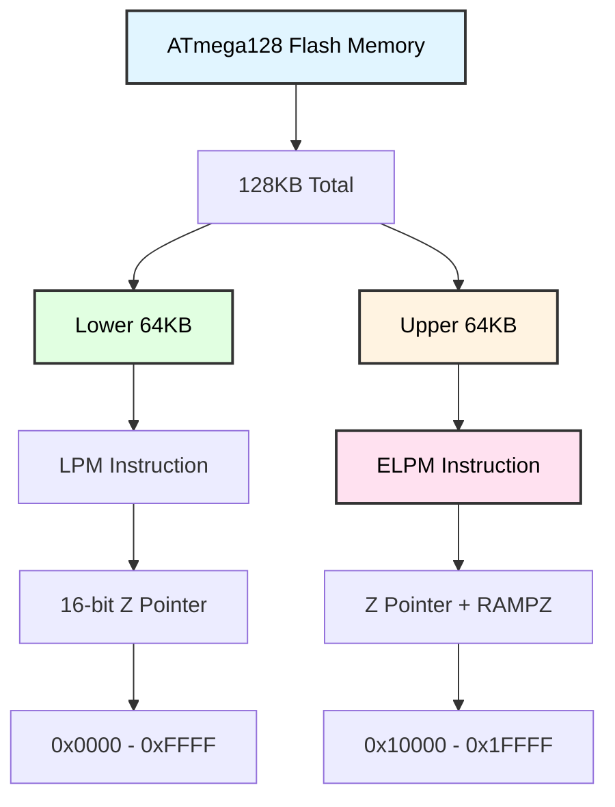
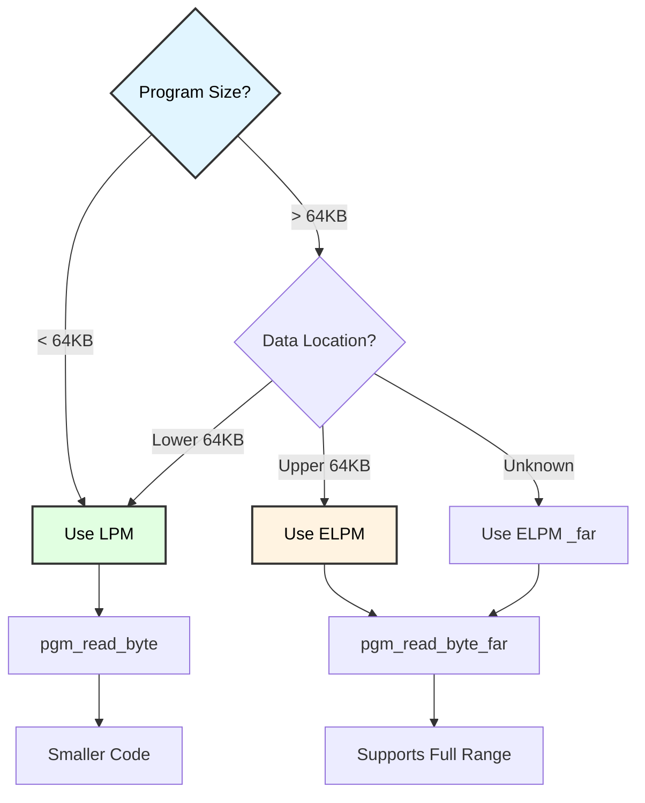
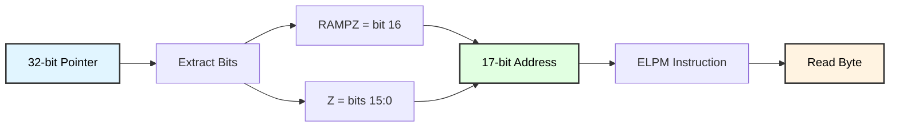

# ELPM Instruction and Extended Memory Access
## ATmega128 Program Memory Beyond 64KB

**Reference**: [ATmega128 Datasheet](https://ww1.microchip.com/downloads/aemDocuments/documents/OTH/ProductDocuments/DataSheets/2467S.pdf)

---

## Slide 1: Introduction to ELPM

### What is ELPM?
- **Extended Load Program Memory**: Read from program memory > 64KB
- **ATmega128 has 128KB flash**: Requires extended addressing
- **RAMPZ register**: RAM Page Z (bits 16:17 of address)
- **LPM vs ELPM**: LPM for 0-64KB, ELPM for 0-128KB

### Why Extended Memory?


### ATmega128 Memory Map
```
Flash Memory (128KB = 64K words):
┌──────────────────────────────────────┐
│ 0x00000 - 0x0FFFF (64K words)       │  ← LPM addressable
│   Lower 64KB                         │    (Z pointer only)
├──────────────────────────────────────┤
│ 0x10000 - 0x1FFFF (64K words)       │  ← ELPM required
│   Upper 64KB                         │    (RAMPZ + Z pointer)
└──────────────────────────────────────┘

Address Formation:
  17-bit address = RAMPZ[0] : Z[15:0]
  
  Example:
    RAMPZ = 0x00, Z = 0x1234  →  0x01234 (lower 64KB)
    RAMPZ = 0x01, Z = 0x5678  →  0x15678 (upper 64KB)
```

---

## Slide 2: RAMPZ Register

### RAM Page Z Register
```
RAMPZ (RAM Page Z - Address 0x5B)
Bit:   7    6    5    4    3    2    1    0
       -    -    -    -    -    -    -   RAMPZ0

RAMPZ0 (bit 0):
  - Extended address bit 16
  - Combined with Z (r31:r30) forms 17-bit address
  - Bits 7:1 reserved, read as zero

Full address calculation:
  Physical Address = (RAMPZ << 16) | Z
```

### Setting RAMPZ
```c
// Set RAMPZ to access upper 64KB
RAMPZ = 0x01;  // Bit 16 = 1

// Or use inline assembly
__asm__ volatile (
    "LDI r16, 0x01 \n"
    "STS %0, r16 \n"
    :
    : "M" (_SFR_MEM_ADDR(RAMPZ))
    : "r16"
);

/*
 * IMPORTANT:
 * - RAMPZ is in extended I/O space
 * - Must use STS/LDS (not OUT/IN)
 * - Automatically incremented by ELPM with Z+
 */
```

---

## Slide 3: LPM vs ELPM Comparison

### LPM Instruction (Load Program Memory)
```assembly
; LPM - 16-bit addressing (0-64KB)
LDI r30, lo8(data_table)   ; Z low byte
LDI r31, hi8(data_table)   ; Z high byte
LPM r16, Z                 ; r16 = flash[Z]

; LPM with post-increment
LPM r17, Z+                ; r17 = flash[Z], then Z++
```

### ELPM Instruction (Extended Load)
```assembly
; ELPM - 17-bit addressing (0-128KB)
LDI r16, 0x01
STS RAMPZ, r16             ; RAMPZ = 1 (upper 64KB)
LDI r30, lo8(data_table)
LDI r31, hi8(data_table)
ELPM r17, Z                ; r17 = flash[(RAMPZ<<16)|Z]

; ELPM with post-increment (increments Z and RAMPZ!)
ELPM r18, Z+               ; r18 = flash[addr], addr++
```

### Comparison Table
| Feature | LPM | ELPM |
|---------|-----|------|
| **Address range** | 0-64KB (0x0000-0xFFFF) | 0-128KB (0x00000-0x1FFFF) |
| **Address bits** | 16 (Z pointer only) | 17 (RAMPZ + Z) |
| **Instruction** | `LPM Rd, Z` | `ELPM Rd, Z` |
| **Cycles** | 3 | 3 |
| **Post-increment** | Z++ (16-bit) | Z++ with RAMPZ carry |
| **Use case** | Small programs | Large programs (>64KB) |

---

## Slide 4: PROGMEM in C

### Declaring Data in Program Memory
```c
#include <avr/pgmspace.h>

// Small data (< 64KB from program start)
const uint8_t small_table[] PROGMEM = {1, 2, 3, 4, 5};

// Large data (may exceed 64KB)
const uint8_t large_table[1000] PROGMEM = { /* ... */ };

/*
 * PROGMEM attribute:
 * - Stores data in flash instead of SRAM
 * - Read-only (flash is not writable at runtime)
 * - Saves precious SRAM for variables
 */
```

### Reading PROGMEM Data
```c
// Read with LPM (< 64KB)
uint8_t read_small(uint8_t index) {
    return pgm_read_byte(&small_table[index]);
}

// Read with ELPM (> 64KB)
uint8_t read_large(uint16_t index) {
    return pgm_read_byte_far(&large_table[index]);
}

/*
 * pgm_read_byte():      Uses LPM (16-bit address)
 * pgm_read_byte_far():  Uses ELPM (17-bit address)
 * pgm_read_word():      Read 16-bit value with LPM
 * pgm_read_word_far():  Read 16-bit value with ELPM
 * pgm_read_dword_far(): Read 32-bit value with ELPM
 */
```

---

## Slide 5: ELPM Assembly Implementation

### Manual ELPM Access
```c
// Read byte from extended program memory
uint8_t elpm_read_byte(uint32_t address) {
    uint8_t result;
    
    __asm__ volatile (
        "OUT %2, %B1 \n"       // RAMPZ = address[23:16]
        "MOVW r30, %A1 \n"     // Z = address[15:0]
        "ELPM %0, Z \n"        // Read byte
        : "=r" (result)
        : "r" (address), "I" (_SFR_IO_ADDR(RAMPZ))
        : "r30", "r31"
    );
    
    return result;
}

/*
 * %A1 = low byte of address (bits 7:0)
 * %B1 = high byte of address (bits 15:8)
 * Third byte (bits 23:16) to RAMPZ
 */
```

### Reading Array from Upper Memory
```c
void read_progmem_array(uint32_t start_addr, uint8_t *dest, uint8_t len) {
    __asm__ volatile (
        "MOVW r30, %A1 \n"         // Z = start_addr[15:0]
        "OUT %3, %B1 \n"           // RAMPZ = start_addr[16]
        "MOVW r26, %0 \n"          // X = dest
        "1: \n"                    // Loop label
        "ELPM r16, Z+ \n"          // Read and auto-increment
        "ST X+, r16 \n"            // Store to SRAM
        "DEC %2 \n"                // Decrement counter
        "BRNE 1b \n"               // Loop if not zero
        :
        : "r" ((uint16_t)dest),
          "r" (start_addr),
          "r" (len),
          "I" (_SFR_IO_ADDR(RAMPZ))
        : "r16", "r26", "r27", "r30", "r31"
    );
}
```

---

## Slide 6: ELPM Post-Increment Behavior

### Auto-Increment with RAMPZ Carry
```assembly
; ELPM with post-increment handles page overflow!
LDI r16, 0x00
STS RAMPZ, r16             ; Start at 0x0FFFF

LDI r30, 0xFF
LDI r31, 0xFF              ; Z = 0xFFFF

ELPM r17, Z+               ; Read 0x0FFFF, then increment
                           ; Result: Z = 0x0000, RAMPZ = 0x01
                           ; (Now pointing to 0x10000)

ELPM r18, Z+               ; Read 0x10000, increment
                           ; Result: Z = 0x0001, RAMPZ = 0x01
```

### C Implementation of Auto-Increment
```c
// Simulate ELPM Z+ behavior
typedef struct {
    uint8_t rampz;
    uint16_t z;
} extended_addr_t;

uint8_t elpm_post_inc(extended_addr_t *addr) {
    // Calculate full 17-bit address
    uint32_t full_addr = ((uint32_t)addr->rampz << 16) | addr->z;
    
    // Read byte
    uint8_t result = pgm_read_byte_far(full_addr);
    
    // Increment with carry
    addr->z++;
    if (addr->z == 0) {
        addr->rampz++;  // Carry to RAMPZ
    }
    
    return result;
}
```

---

## Slide 7: Large Data Tables Example

### Storing Sensor Calibration Data
```c
// 2KB calibration table in program memory
const uint16_t calibration_table[1024] PROGMEM = {
    100, 105, 110, 115, 120, /* ... */ 5000
};

// Read calibration value
uint16_t get_calibration(uint16_t index) {
    // Check bounds
    if (index >= 1024) return 0;
    
    // Calculate address
    uint32_t addr = (uint32_t)&calibration_table[index];
    
    // Read word (16-bit) from program memory
    return pgm_read_word_far(addr);
}

// Usage
uint16_t cal_value = get_calibration(512);
printf("Calibration[512] = %u\n", cal_value);
```

---

## Slide 8: String Data in PROGMEM

### Storing Strings in Flash
```c
// Store strings in program memory (saves SRAM!)
const char string1[] PROGMEM = "Temperature: ";
const char string2[] PROGMEM = "Humidity: ";
const char string3[] PROGMEM = "Pressure: ";

// Array of pointers to strings (also in PROGMEM)
const char * const string_table[] PROGMEM = {
    string1,
    string2,
    string3
};

// Print string from PROGMEM
void print_progmem_string(uint8_t index) {
    // Read pointer from table
    char *ptr = (char*)pgm_read_word_far(&string_table[index]);
    
    // Read and print characters
    char c;
    while ((c = pgm_read_byte_far(ptr++)) != '\0') {
        uart_putchar(c);
    }
}

// Usage
print_progmem_string(0);  // Prints "Temperature: "
```

---

## Slide 9: When to Use ELPM

### Decision Flow


### Size Optimization
```c
// If you know data is in lower 64KB
#define USE_FAR_MEMORY 0

#if USE_FAR_MEMORY
    #define READ_BYTE(addr) pgm_read_byte_far(addr)
#else
    #define READ_BYTE(addr) pgm_read_byte(addr)
#endif

// Check program size
/*
 * avr-size program.elf
 * 
 * Output:
 *    text    data     bss     dec     hex filename
 *   45678     234    1024   46936    b758 program.elf
 *   
 * If text > 65536, use ELPM
 */
```

---

## Slide 10: Linker Script and Memory Layout

### Forcing Data to Upper Memory
```c
// Place data in specific section
const uint8_t upper_data[1000] 
    __attribute__((section(".progmem.upper"))) = { /* ... */ };

// Linker script excerpt (.lds file):
/*
MEMORY
{
    flash_lower (rx) : ORIGIN = 0x0000, LENGTH = 64K
    flash_upper (rx) : ORIGIN = 0x10000, LENGTH = 64K
}

SECTIONS
{
    .text : { *(.text*) } > flash_lower
    .progmem.upper : { *(.progmem.upper*) } > flash_upper
}
*/
```

---

## Slide 11: ELPM Performance

### Cycle Count and Optimization
```
Operation          | Cycles | Code Size
-------------------|--------|----------
LPM Rd, Z          | 3      | 2 bytes
ELPM Rd, Z         | 3      | 2 bytes
LPM Rd, Z+         | 3      | 2 bytes
ELPM Rd, Z+        | 3      | 2 bytes

Performance:
- ELPM same speed as LPM (both 3 cycles)
- Post-increment adds no overhead
- RAMPZ setup adds ~2 cycles (one-time cost)
```

### Optimized Block Read
```c
// Fast block read with ELPM
void fast_progmem_copy(uint32_t src_addr, uint8_t *dest, uint16_t len) {
    uint8_t rampz = (src_addr >> 16) & 0x01;
    uint16_t z = src_addr & 0xFFFF;
    
    RAMPZ = rampz;
    
    __asm__ volatile (
        "MOVW r30, %1 \n"      // Load Z
        "MOVW r26, %0 \n"      // Load X (dest)
        "1: \n"
        "ELPM r16, Z+ \n"      // 3 cycles
        "ST X+, r16 \n"        // 2 cycles
        "SBIW %2, 1 \n"        // 2 cycles
        "BRNE 1b \n"           // 1-2 cycles
        :
        : "r" ((uint16_t)dest), "r" (z), "w" (len)
        : "r16", "r26", "r27", "r30", "r31"
    );
    
    // Total: 8-9 cycles per byte
}
```

---

## Slide 12: SimulIDE ELPM Support

### SimulIDE 1.1.0-SR1 Update
```
Previous versions (< 1.1.0-SR1):
  ✗ ELPM instruction not implemented
  ✗ Programs crash when accessing > 64KB
  ✗ RAMPZ register not simulated

Current version (≥ 1.1.0-SR1):
  ✓ Full ELPM support
  ✓ RAMPZ register functional
  ✓ 128KB flash memory accessible
  ✓ pgm_read_byte_far() works correctly
```

### Testing ELPM in SimulIDE
```c
void test_elpm_support(void) {
    // Place test data at known address
    const char test_msg[] PROGMEM = "ELPM Works!";
    
    uint32_t addr = (uint32_t)test_msg;
    
    // Set RAMPZ manually
    RAMPZ = (addr >> 16) & 0x01;
    
    // Read characters
    char buffer[20];
    for (uint8_t i = 0; i < 11; i++) {
        buffer[i] = pgm_read_byte_far(addr + i);
    }
    buffer[11] = '\0';
    
    printf("Result: %s\n", buffer);
    
    // Should print: "ELPM Works!"
    // If crashes or prints garbage: ELPM not supported
}
```

---

## Slide 13: Troubleshooting ELPM

### Common Issues

| Problem | Cause | Solution |
|---------|-------|----------|
| **Program crashes** | SimulIDE version too old | Update to 1.1.0-SR1 or newer |
| **Wrong data read** | RAMPZ not set | Set RAMPZ before ELPM |
| **Address overflow** | RAMPZ not incremented | Use ELPM Z+ for auto-increment |
| **Linker error** | Program > 128KB | Reduce code/data size |
| **Can't access upper 64KB** | Using LPM instead of ELPM | Use pgm_read_byte_far() |
| **RAMPZ not changing** | Using OUT instead of STS | RAMPZ is extended I/O, use LDS/STS |

### Debugging ELPM
```c
void debug_elpm_address(uint32_t addr) {
    uint8_t rampz = (addr >> 16) & 0x01;
    uint16_t z = addr & 0xFFFF;
    
    printf("Address: 0x%05lX\n", addr);
    printf("  RAMPZ: 0x%02X\n", rampz);
    printf("  Z: 0x%04X\n", z);
    
    RAMPZ = rampz;
    uint8_t value = pgm_read_byte_far(addr);
    
    printf("  Value: 0x%02X\n", value);
}
```

---

## Slide 14: Summary

### Key Concepts

✓ **ELPM**: Extended Load Program Memory (0-128KB)  
✓ **RAMPZ**: Register holding address bit 16  
✓ **17-bit addressing**: RAMPZ[0] : Z[15:0]  
✓ **LPM**: Use for addresses < 64KB  
✓ **ELPM**: Required for addresses ≥ 64KB  
✓ **Auto-increment**: ELPM Z+ increments Z and RAMPZ  
✓ **C macros**: pgm_read_byte_far() for ELPM access  

### Address Calculation


### When to Use
- Large lookup tables (> 64KB total program)
- Extensive string data
- Calibration/configuration data
- Firmware with resource files
- Programs exceeding 64KB code

---

## Slide 15: Practice Exercises

### Exercise 1: Basic ELPM
**Goal**: Read byte from upper memory using ELPM
- Define data in PROGMEM
- Set RAMPZ register
- Use ELPM instruction to read
- Display value on UART

### Exercise 2: Array Copy
**Goal**: Copy array from flash to SRAM
- Create 100-byte array in PROGMEM
- Use ELPM Z+ in loop
- Copy to SRAM buffer
- Verify data integrity

### Exercise 3: String Table
**Goal**: Store multiple strings in PROGMEM
- Define 10 strings in flash
- Create pointer table
- Read string by index
- Print to UART using pgm_read_byte_far()

### Exercise 4: Address Calculator
**Goal**: Convert 32-bit address to RAMPZ + Z
- Input 32-bit address
- Extract RAMPZ (bit 16)
- Extract Z (bits 15:0)
- Display on LCD

### Exercise 5: Performance Test
**Goal**: Compare LPM vs ELPM speed
- Copy 1KB array with LPM
- Copy 1KB array with ELPM
- Measure cycles using timer
- Print comparison results

---

# End of Slides

**Questions?**

For more information, see:
- [ATmega128 Datasheet](https://ww1.microchip.com/downloads/aemDocuments/documents/OTH/ProductDocuments/DataSheets/2467S.pdf) (ELPM: page 83, RAMPZ: page 12)
- SimulIDE Troubleshooting: `SIMULIDE_TROUBLESHOOTING.md`
- Project source code in `ELPM_Test/`
- AVR Libc documentation: `<avr/pgmspace.h>`
