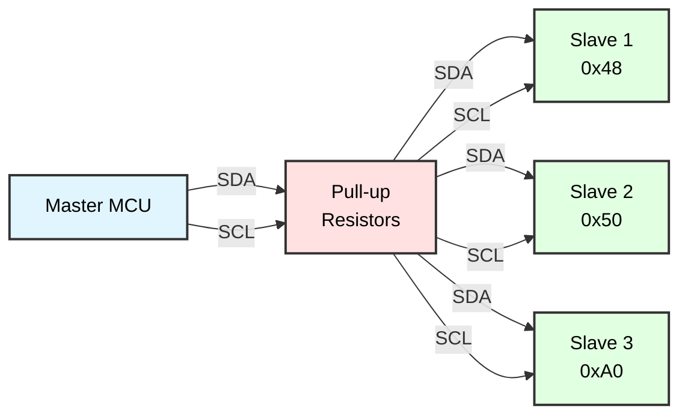
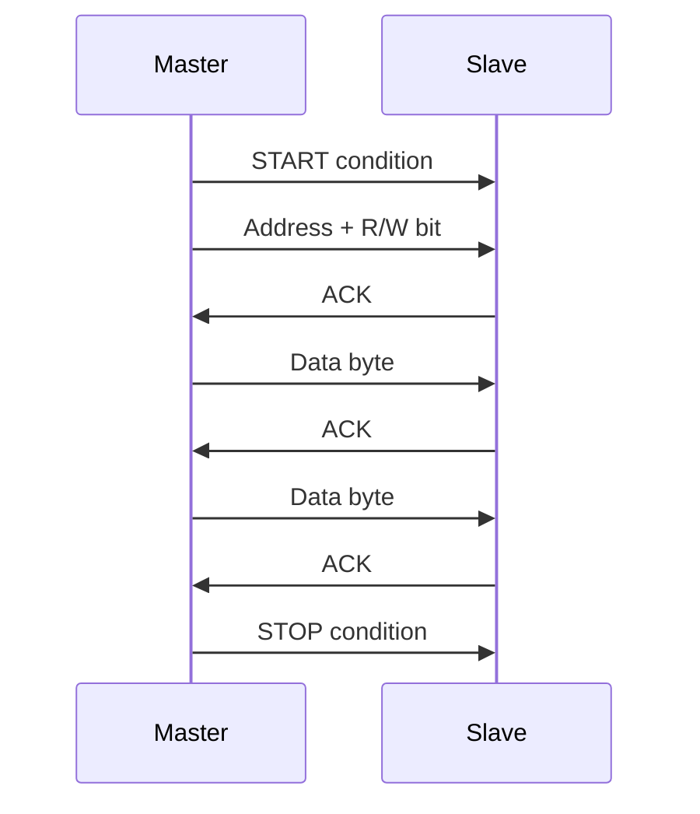
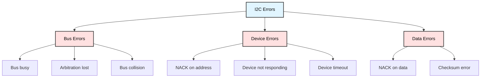

# I2C (TWI) Master Communication
## ATmega128 Embedded Systems Course

**Reference**: [ATmega128 Datasheet](https://ww1.microchip.com/downloads/en/DeviceDoc/doc2467.pdf)

---

## Slide 1: Introduction to I2C

### What is I2C?
- **Inter-Integrated Circuit** (I²C or IIC)
- **Two-wire** serial communication protocol
- Developed by Philips (now NXP) in 1982
- **Multi-master, multi-slave** architecture
- **Synchronous** communication (clock line)

### I2C Bus Structure


### Key Features
✓ **Only 2 wires**: SDA (data) + SCL (clock)  
✓ **Multiple devices**: Up to 128 devices (7-bit addressing)  
✓ **Speeds**: 100 kHz (Standard), 400 kHz (Fast), 1 MHz (Fast+)  
✓ **Addressing**: Each slave has unique 7-bit or 10-bit address  
✓ **Acknowledge**: Built-in error detection  

---

## Slide 2: I2C Signal Lines

### Two-Wire Bus
| Signal | Name | Function | Type |
|--------|------|----------|------|
| **SDA** | Serial Data | Bidirectional data line | Open-drain |
| **SCL** | Serial Clock | Clock generated by master | Open-drain |

### ATmega128 I2C Pins
```
ATmega128 I2C Pins (called TWI - Two-Wire Interface):
- SDA: PD1 (Port D, Pin 1)
- SCL: PD0 (Port D, Pin 0)
```

### Pull-Up Resistors
```
         VCC (+5V or +3.3V)
          │
       ┌──┴──┐
       │ Rp  │  Typical: 4.7kΩ (2.2kΩ - 10kΩ)
       └──┬──┘
          │
    ──────┴────────  SDA (or SCL)
          │
      ┌───┴───┐
      │Device │
      └───────┘
```

**Why open-drain?**
- Multiple devices can pull line LOW
- No device actively drives HIGH (pull-ups do this)
- Prevents bus contention

---

## Slide 3: I2C Communication Protocol

### Message Format
```
START - ADDRESS(7-bit) - R/W - ACK - DATA(8-bit) - ACK - ... - STOP

Example: Write 0x42 to device 0x50
START - 0x50 - W - ACK - 0x42 - ACK - STOP
```

### Timing Diagram


### Conditions
```
START Condition:
  SDA falls while SCL is HIGH
  
    SCL ──────┐     ┌────────
              │     │
    SDA ──────┘     └────────
         ↑
       START

STOP Condition:
  SDA rises while SCL is HIGH
  
    SCL ──────┐     ┌────────
              │     │
    SDA ──────┘     └────────
                    ↑
                  STOP

ACK/NACK:
  SDA LOW  = ACK (acknowledge)
  SDA HIGH = NACK (not acknowledge)
```

---

## Slide 4: I2C Addressing

### 7-Bit Addressing
```
Byte Format:  A6 A5 A4 A3 A2 A1 A0 R/W
              └─────── Address ──────┘

Example: Device address 0x48, Write operation
  Address byte = 0x48 << 1 | 0 = 0x90
  
Example: Device address 0x48, Read operation
  Address byte = 0x48 << 1 | 1 = 0x91
```

### Common I2C Device Addresses
| Device | Address (7-bit) | Hex | Description |
|--------|-----------------|-----|-------------|
| **PCF8574** | 0x20-0x27 | 0x20 | I/O Expander |
| **DS1307** | 0x68 | 0x68 | RTC |
| **24C32** | 0x50-0x57 | 0x50 | EEPROM |
| **LM75** | 0x48-0x4F | 0x48 | Temp Sensor |
| **MPU6050** | 0x68/0x69 | 0x68 | IMU |
| **SSD1306** | 0x3C/0x3D | 0x3C | OLED Display |
| **BMP280** | 0x76/0x77 | 0x76 | Pressure Sensor |

### Address Scanning
```c
void i2c_scan(void) {
    printf("Scanning I2C bus...\n");
    
    for (uint8_t addr = 1; addr < 128; addr++) {
        i2c_start();
        
        if (i2c_write(addr << 1) == 0) {  // ACK received
            printf("Device found at 0x%02X\n", addr);
        }
        
        i2c_stop();
        _delay_ms(10);
    }
    
    printf("Scan complete.\n");
}
```

---

## Slide 5: ATmega128 TWI Registers

### Key TWI Registers
```
TWCR - TWI Control Register
TWDR - TWI Data Register  
TWSR - TWI Status Register
TWBR - TWI Bit Rate Register
TWAR - TWI (Slave) Address Register
```

### TWCR - TWI Control Register
```
Bit     7      6      5      4      3      2      1      0
      ┌──────┬──────┬──────┬──────┬──────┬──────┬──────┬──────┐
TWCR  │ TWINT│ TWEA │ TWSTA│ TWSTO│ TWWC │ TWEN │   -  │ TWIE │
      └──────┴──────┴──────┴──────┴──────┴──────┴──────┴──────┘
```

**Bit Functions:**
- **TWINT**: TWI Interrupt Flag (set when operation complete)
- **TWEA**: TWI Enable Acknowledge
- **TWSTA**: TWI START Condition
- **TWSTO**: TWI STOP Condition
- **TWWC**: TWI Write Collision Flag
- **TWEN**: TWI Enable
- **TWIE**: TWI Interrupt Enable

### TWSR - TWI Status Register
```
Bit     7      6      5      4      3      2      1      0
      ┌──────┬──────┬──────┬──────┬──────┬──────┬──────┬──────┐
TWSR  │ TWS7 │ TWS6 │ TWS5 │ TWS4 │ TWS3 │   -  │ TWPS1│ TWPS0│
      └──────┴──────┴──────┴──────┴──────┴──────┴──────┴──────┘
        └──────────── Status ──────────┘         └─ Prescaler ─┘
```

**Status Codes** (TWS7-TWS3):
- 0x08: START transmitted
- 0x18: SLA+W transmitted, ACK received
- 0x28: Data transmitted, ACK received
- 0x40: SLA+R transmitted, ACK received
- 0x50: Data received, ACK returned
- 0x58: Data received, NACK returned

---

## Slide 6: I2C Initialization

### SCL Frequency Calculation
```
Formula:
  SCL_freq = F_CPU / (16 + 2 * TWBR * Prescaler)

For 100 kHz (Standard Mode):
  F_CPU = 16 MHz, Prescaler = 1
  100000 = 16000000 / (16 + 2 * TWBR * 1)
  TWBR = 72

For 400 kHz (Fast Mode):
  F_CPU = 16 MHz, Prescaler = 1
  400000 = 16000000 / (16 + 2 * TWBR * 1)
  TWBR = 12
```

### Initialization Code
```c
#include <avr/io.h>

void i2c_init(void) {
    // Set SCL frequency to 100 kHz
    // F_CPU = 16 MHz, Prescaler = 1
    TWBR = 72;
    
    // Prescaler = 1 (TWPS1:TWPS0 = 00)
    TWSR = 0x00;
    
    // Enable TWI
    TWCR = (1 << TWEN);
}

// Alternative: 400 kHz Fast Mode
void i2c_init_fast(void) {
    TWBR = 12;  // 400 kHz
    TWSR = 0x00;
    TWCR = (1 << TWEN);
}
```

---

## Slide 7: I2C Start and Stop

### START Condition
```c
void i2c_start(void) {
    // Send START condition
    TWCR = (1 << TWINT) | (1 << TWSTA) | (1 << TWEN);
    
    // Wait for TWINT flag to be set (START transmitted)
    while (!(TWCR & (1 << TWINT)));
    
    // Check status (should be 0x08 for START)
    if ((TWSR & 0xF8) != 0x08) {
        // Error handling
    }
}

// Repeated START (for combined transactions)
void i2c_repeated_start(void) {
    // Send repeated START
    TWCR = (1 << TWINT) | (1 << TWSTA) | (1 << TWEN);
    
    // Wait for completion
    while (!(TWCR & (1 << TWINT)));
    
    // Check status (should be 0x10 for repeated START)
    if ((TWSR & 0xF8) != 0x10) {
        // Error handling
    }
}
```

### STOP Condition
```c
void i2c_stop(void) {
    // Send STOP condition
    TWCR = (1 << TWINT) | (1 << TWSTO) | (1 << TWEN);
    
    // Wait for STOP to complete
    // (TWSTO is cleared automatically)
    while (TWCR & (1 << TWSTO));
}
```

---

## Slide 8: I2C Write Operations

### Write Single Byte
```c
uint8_t i2c_write(uint8_t data) {
    // Load data into TWDR
    TWDR = data;
    
    // Start transmission
    TWCR = (1 << TWINT) | (1 << TWEN);
    
    // Wait for transmission to complete
    while (!(TWCR & (1 << TWINT)));
    
    // Check status
    uint8_t status = TWSR & 0xF8;
    
    // Return 0 if ACK received, 1 if NACK
    if (status == 0x18 || status == 0x28) {
        return 0;  // ACK
    } else {
        return 1;  // NACK or error
    }
}

// Write to device register
void i2c_write_register(uint8_t device_addr, uint8_t reg_addr, uint8_t data) {
    i2c_start();
    i2c_write(device_addr << 1);  // Address + Write bit
    i2c_write(reg_addr);           // Register address
    i2c_write(data);               // Data
    i2c_stop();
}

// Write multiple bytes
void i2c_write_bytes(uint8_t device_addr, uint8_t reg_addr, 
                     uint8_t *data, uint8_t length) {
    i2c_start();
    i2c_write(device_addr << 1);
    i2c_write(reg_addr);
    
    for (uint8_t i = 0; i < length; i++) {
        i2c_write(data[i]);
    }
    
    i2c_stop();
}
```

---

## Slide 9: I2C Read Operations

### Read Single Byte
```c
uint8_t i2c_read_ack(void) {
    // Enable TWI and send ACK after reception
    TWCR = (1 << TWINT) | (1 << TWEN) | (1 << TWEA);
    
    // Wait for data reception
    while (!(TWCR & (1 << TWINT)));
    
    // Return received data
    return TWDR;
}

uint8_t i2c_read_nack(void) {
    // Enable TWI, send NACK after reception (last byte)
    TWCR = (1 << TWINT) | (1 << TWEN);
    
    // Wait for data reception
    while (!(TWCR & (1 << TWINT)));
    
    // Return received data
    return TWDR;
}
```

### Read from Device Register
```c
uint8_t i2c_read_register(uint8_t device_addr, uint8_t reg_addr) {
    uint8_t data;
    
    // Write register address
    i2c_start();
    i2c_write(device_addr << 1);     // Write mode
    i2c_write(reg_addr);
    
    // Read data
    i2c_start();                      // Repeated START
    i2c_write((device_addr << 1) | 1); // Read mode
    data = i2c_read_nack();           // Read single byte
    i2c_stop();
    
    return data;
}

// Read multiple bytes
void i2c_read_bytes(uint8_t device_addr, uint8_t reg_addr,
                    uint8_t *buffer, uint8_t length) {
    i2c_start();
    i2c_write(device_addr << 1);
    i2c_write(reg_addr);
    
    i2c_start();  // Repeated START
    i2c_write((device_addr << 1) | 1);
    
    for (uint8_t i = 0; i < length - 1; i++) {
        buffer[i] = i2c_read_ack();  // ACK for all but last byte
    }
    
    buffer[length - 1] = i2c_read_nack();  // NACK for last byte
    i2c_stop();
}
```

---

## Slide 10: Example - DS1307 RTC

### DS1307 Real-Time Clock
```
Device Address: 0x68
Registers:
  0x00: Seconds (BCD)
  0x01: Minutes (BCD)
  0x02: Hours (BCD)
  0x03: Day of week
  0x04: Date (BCD)
  0x05: Month (BCD)
  0x06: Year (BCD)
```

### DS1307 Library
```c
#define DS1307_ADDR  0x68

typedef struct {
    uint8_t seconds;  // 0-59
    uint8_t minutes;  // 0-59
    uint8_t hours;    // 0-23
    uint8_t day;      // 1-31
    uint8_t month;    // 1-12
    uint16_t year;    // 2000-2099
} rtc_time_t;

// BCD to decimal conversion
uint8_t bcd_to_dec(uint8_t bcd) {
    return ((bcd >> 4) * 10) + (bcd & 0x0F);
}

// Decimal to BCD conversion
uint8_t dec_to_bcd(uint8_t dec) {
    return ((dec / 10) << 4) | (dec % 10);
}

// Read time from DS1307
void ds1307_read_time(rtc_time_t *time) {
    uint8_t buffer[7];
    
    // Read all time registers (0x00-0x06)
    i2c_read_bytes(DS1307_ADDR, 0x00, buffer, 7);
    
    // Convert BCD to decimal
    time->seconds = bcd_to_dec(buffer[0] & 0x7F);
    time->minutes = bcd_to_dec(buffer[1]);
    time->hours   = bcd_to_dec(buffer[2] & 0x3F);
    time->day     = bcd_to_dec(buffer[4]);
    time->month   = bcd_to_dec(buffer[5]);
    time->year    = 2000 + bcd_to_dec(buffer[6]);
}

// Set time
void ds1307_set_time(rtc_time_t *time) {
    uint8_t buffer[7];
    
    buffer[0] = dec_to_bcd(time->seconds);
    buffer[1] = dec_to_bcd(time->minutes);
    buffer[2] = dec_to_bcd(time->hours);
    buffer[3] = 1;  // Day of week (1-7)
    buffer[4] = dec_to_bcd(time->day);
    buffer[5] = dec_to_bcd(time->month);
    buffer[6] = dec_to_bcd(time->year - 2000);
    
    i2c_write_bytes(DS1307_ADDR, 0x00, buffer, 7);
}
```

---

## Slide 11: Example - 24C32 EEPROM

### I2C EEPROM (24C32)
```
Device Address: 0x50 - 0x57 (A0, A1, A2 pins)
Capacity: 32 Kbit (4 KB)
Page Size: 32 bytes
Write time: ~5ms per page
```

### EEPROM Read/Write
```c
#define EEPROM_ADDR  0x50

// Write single byte
void eeprom_write_byte(uint16_t mem_addr, uint8_t data) {
    i2c_start();
    i2c_write(EEPROM_ADDR << 1);
    i2c_write(mem_addr >> 8);    // Address high byte
    i2c_write(mem_addr & 0xFF);  // Address low byte
    i2c_write(data);
    i2c_stop();
    
    _delay_ms(5);  // Write cycle time
}

// Read single byte
uint8_t eeprom_read_byte(uint16_t mem_addr) {
    uint8_t data;
    
    // Write address
    i2c_start();
    i2c_write(EEPROM_ADDR << 1);
    i2c_write(mem_addr >> 8);
    i2c_write(mem_addr & 0xFF);
    
    // Read data
    i2c_start();
    i2c_write((EEPROM_ADDR << 1) | 1);
    data = i2c_read_nack();
    i2c_stop();
    
    return data;
}

// Write page (up to 32 bytes)
void eeprom_write_page(uint16_t mem_addr, uint8_t *data, uint8_t length) {
    if (length > 32) length = 32;
    
    i2c_start();
    i2c_write(EEPROM_ADDR << 1);
    i2c_write(mem_addr >> 8);
    i2c_write(mem_addr & 0xFF);
    
    for (uint8_t i = 0; i < length; i++) {
        i2c_write(data[i]);
    }
    
    i2c_stop();
    _delay_ms(5);
}

// Read multiple bytes
void eeprom_read_bytes(uint16_t mem_addr, uint8_t *buffer, uint16_t length) {
    i2c_start();
    i2c_write(EEPROM_ADDR << 1);
    i2c_write(mem_addr >> 8);
    i2c_write(mem_addr & 0xFF);
    
    i2c_start();
    i2c_write((EEPROM_ADDR << 1) | 1);
    
    for (uint16_t i = 0; i < length - 1; i++) {
        buffer[i] = i2c_read_ack();
    }
    
    buffer[length - 1] = i2c_read_nack();
    i2c_stop();
}
```

---

## Slide 12: Example - LM75 Temperature Sensor

### LM75 Digital Temperature Sensor
```
Device Address: 0x48 - 0x4F
Resolution: 9-bit (0.5°C)
Range: -55°C to +125°C
Interface: I2C
```

### LM75 Driver
```c
#define LM75_ADDR  0x48

// Register addresses
#define LM75_REG_TEMP   0x00
#define LM75_REG_CONF   0x01
#define LM75_REG_THYST  0x02
#define LM75_REG_TOS    0x03

// Read temperature
float lm75_read_temperature(void) {
    uint8_t msb, lsb;
    int16_t raw_temp;
    float temperature;
    
    // Read 2-byte temperature register
    i2c_start();
    i2c_write(LM75_ADDR << 1);
    i2c_write(LM75_REG_TEMP);
    
    i2c_start();
    i2c_write((LM75_ADDR << 1) | 1);
    msb = i2c_read_ack();
    lsb = i2c_read_nack();
    i2c_stop();
    
    // Combine bytes
    raw_temp = (msb << 8) | lsb;
    
    // Convert to temperature (9-bit, 0.5°C per LSB)
    temperature = (raw_temp >> 7) * 0.5;
    
    return temperature;
}

// Initialize LM75
void lm75_init(void) {
    // Set normal operation mode
    i2c_write_register(LM75_ADDR, LM75_REG_CONF, 0x00);
}

// Display temperature
void display_temperature(void) {
    float temp = lm75_read_temperature();
    
    lcd_gotoxy(0, 0);
    printf("Temp: %.1f C", temp);
}
```

---

## Slide 13: Example - MPU6050 IMU

### MPU6050 Accelerometer + Gyroscope
```
Device Address: 0x68 or 0x69
Features:
  - 3-axis accelerometer (±2g to ±16g)
  - 3-axis gyroscope (±250°/s to ±2000°/s)
  - 16-bit ADC
  - Built-in temperature sensor
```

### MPU6050 Driver
```c
#define MPU6050_ADDR  0x68

// Register addresses
#define MPU6050_PWR_MGMT_1   0x6B
#define MPU6050_ACCEL_XOUT_H 0x3B
#define MPU6050_GYRO_XOUT_H  0x43
#define MPU6050_TEMP_OUT_H   0x41

typedef struct {
    int16_t accel_x, accel_y, accel_z;
    int16_t gyro_x, gyro_y, gyro_z;
    int16_t temperature;
} mpu6050_data_t;

void mpu6050_init(void) {
    // Wake up MPU6050 (disable sleep mode)
    i2c_write_register(MPU6050_ADDR, MPU6050_PWR_MGMT_1, 0x00);
    _delay_ms(100);
}

void mpu6050_read_all(mpu6050_data_t *data) {
    uint8_t buffer[14];
    
    // Read all sensor registers (0x3B to 0x48)
    i2c_read_bytes(MPU6050_ADDR, MPU6050_ACCEL_XOUT_H, buffer, 14);
    
    // Parse data (big-endian)
    data->accel_x = (buffer[0] << 8) | buffer[1];
    data->accel_y = (buffer[2] << 8) | buffer[3];
    data->accel_z = (buffer[4] << 8) | buffer[5];
    
    data->temperature = (buffer[6] << 8) | buffer[7];
    
    data->gyro_x = (buffer[8] << 8) | buffer[9];
    data->gyro_y = (buffer[10] << 8) | buffer[11];
    data->gyro_z = (buffer[12] << 8) | buffer[13];
}

float mpu6050_get_temperature(mpu6050_data_t *data) {
    // Convert to Celsius
    return (data->temperature / 340.0) + 36.53;
}

void mpu6050_get_accel_g(mpu6050_data_t *data, float *ax, float *ay, float *az) {
    // Convert to g (assuming ±2g range)
    *ax = data->accel_x / 16384.0;
    *ay = data->accel_y / 16384.0;
    *az = data->accel_z / 16384.0;
}
```

---

## Slide 14: Error Handling

### I2C Error Types


### Error Handling Implementation
```c
typedef enum {
    I2C_OK = 0,
    I2C_ERROR_NACK,
    I2C_ERROR_BUS,
    I2C_ERROR_TIMEOUT
} i2c_error_t;

i2c_error_t i2c_write_safe(uint8_t data) {
    TWDR = data;
    TWCR = (1 << TWINT) | (1 << TWEN);
    
    // Wait with timeout
    uint16_t timeout = 5000;
    while (!(TWCR & (1 << TWINT)) && timeout--) {
        _delay_us(1);
    }
    
    if (timeout == 0) {
        return I2C_ERROR_TIMEOUT;
    }
    
    uint8_t status = TWSR & 0xF8;
    
    if (status == 0x18 || status == 0x28) {
        return I2C_OK;
    } else if (status == 0x20 || status == 0x30) {
        return I2C_ERROR_NACK;
    } else {
        return I2C_ERROR_BUS;
    }
}

// Retry mechanism
uint8_t i2c_write_retry(uint8_t device_addr, uint8_t reg_addr, uint8_t data) {
    uint8_t retries = 3;
    
    while (retries--) {
        i2c_start();
        
        if (i2c_write_safe(device_addr << 1) == I2C_OK &&
            i2c_write_safe(reg_addr) == I2C_OK &&
            i2c_write_safe(data) == I2C_OK) {
            
            i2c_stop();
            return 1;  // Success
        }
        
        i2c_stop();
        _delay_ms(10);
    }
    
    return 0;  // Failed after retries
}
```

---

## Slide 15: Multi-Master Arbitration

### Bus Arbitration
```
When multiple masters try to access bus simultaneously:

1. All masters start transmission
2. Each monitors SDA while transmitting
3. If master transmits HIGH but reads LOW:
   - Another master is transmitting LOW
   - This master loses arbitration
   - Backs off and tries later
4. Master transmitting all bits successfully wins
```

### Arbitration Example
```c
// Check for arbitration loss
uint8_t i2c_check_arbitration(void) {
    uint8_t status = TWSR & 0xF8;
    
    if (status == 0x38) {  // Arbitration lost
        return 1;
    }
    
    return 0;
}

// Master with arbitration handling
void i2c_master_write_multi(uint8_t device_addr, uint8_t data) {
    uint8_t retries = 5;
    
    while (retries--) {
        i2c_start();
        
        if (i2c_check_arbitration()) {
            _delay_ms(random() % 10);  // Random backoff
            continue;
        }
        
        if (i2c_write(device_addr << 1) == I2C_OK) {
            i2c_write(data);
            i2c_stop();
            return;
        }
        
        i2c_stop();
    }
}
```

---

## Slide 16: Clock Stretching

### What is Clock Stretching?
- **Slave holds SCL LOW** to slow down master
- Gives slave time to process data
- Common in slow devices (EEPROM during write)

### Implementation
```c
void i2c_write_with_stretch(uint8_t data) {
    TWDR = data;
    TWCR = (1 << TWINT) | (1 << TWEN);
    
    // Wait for TWINT, allowing clock stretching
    while (!(TWCR & (1 << TWINT))) {
        // Slave may be stretching clock
        // ATmega128 TWI handles this automatically
    }
}

// Manual clock stretching detection (for debugging)
uint8_t is_scl_stretched(void) {
    // Read SCL pin state
    return !(PIND & (1 << PD0));  // LOW = stretched
}
```

---

## Slide 17: I2C vs SPI Comparison

### Protocol Comparison
| Feature | **I2C** | **SPI** |
|---------|---------|---------|
| **Wires** | 2 (SDA, SCL) | 4+ (MOSI, MISO, SCK, SS) |
| **Speed** | 100kHz - 1MHz | 1MHz - 50MHz+ |
| **Devices** | 128 (7-bit addr) | Limited by SS pins |
| **Topology** | Multi-master | Single master |
| **Complexity** | Medium | Simple |
| **Distance** | Short (< 1m) | Short (< 1m) |
| **Cost** | Lower (fewer pins) | Higher |

### When to Use I2C?
✓ **Multiple sensors** on same bus  
✓ **Limited pins** available  
✓ **Standardized devices** (RTC, EEPROM, sensors)  
✓ **Moderate speed** sufficient  
✓ **Addressable devices** needed  

### When to Use SPI?
✓ **High-speed** communication needed  
✓ **Full-duplex** required  
✓ **Simple protocol** preferred  
✓ **Dedicated connections** acceptable  

---

## Slide 18: Pull-Up Resistor Selection

### Calculating Pull-Up Value
```
Factors:
1. Bus capacitance (C_bus)
2. Rise time requirement (t_r)
3. Supply voltage (V_DD)
4. Number of devices

Formula:
  R_p(max) = t_r / (0.8473 × C_bus)

Standard Mode (100 kHz): t_r = 1000 ns
Fast Mode (400 kHz):     t_r = 300 ns

Example:
  C_bus = 100 pF, Fast Mode
  R_p(max) = 300ns / (0.8473 × 100pF) = 3.54 kΩ
  
  Choose: 2.2 kΩ or 3.3 kΩ
```

### Typical Values
| Bus Speed | Capacitance | Pull-Up Range |
|-----------|-------------|---------------|
| 100 kHz | < 400 pF | 4.7kΩ - 10kΩ |
| 400 kHz | < 400 pF | 2.2kΩ - 4.7kΩ |
| 1 MHz | < 100 pF | 1kΩ - 2.2kΩ |

---

## Slide 19: Best Practices

### I2C Design Guidelines

✓ **Pull-Up Resistors**
- Always use pull-ups on SDA and SCL
- Choose appropriate value for bus speed
- Use 4.7kΩ as default for 100-400 kHz

✓ **Power Supply**
- Use decoupling capacitors (0.1µF) near each device
- Ensure stable voltage
- Isolate noisy circuits

✓ **PCB Layout**
- Keep I2C traces short and parallel
- Avoid routing near high-speed signals
- Use ground plane for noise immunity

✓ **Software**
- Always check ACK/NACK
- Implement timeout mechanisms
- Use retry logic for reliability
- Disable interrupts during critical I2C sections

✓ **Debugging**
- Use logic analyzer to inspect signals
- Implement address scanning
- Check device datasheets for timing
- Verify pull-up resistors with multimeter

---

## Slide 20: Debugging I2C

### Common Issues
```c
// 1. Device not responding
void debug_device_presence(uint8_t addr) {
    i2c_start();
    
    if (i2c_write(addr << 1) == I2C_OK) {
        printf("Device 0x%02X: PRESENT\n", addr);
    } else {
        printf("Device 0x%02X: NOT FOUND\n", addr);
    }
    
    i2c_stop();
}

// 2. Check bus state
void debug_bus_state(void) {
    printf("SDA: %d, SCL: %d\n", 
           (PIND & (1 << PD1)) ? 1 : 0,
           (PIND & (1 << PD0)) ? 1 : 0);
    
    // Both should be HIGH when idle
}

// 3. Measure timing
void debug_timing(void) {
    // Toggle pin during I2C operation
    // Measure with oscilloscope
    
    PORTB |= (1 << PB0);
    i2c_start();
    PORTB &= ~(1 << PB0);
    
    // Measure pulse width
}

// 4. Status code logging
void debug_twi_status(void) {
    uint8_t status = TWSR & 0xF8;
    
    switch (status) {
        case 0x08: printf("START sent\n"); break;
        case 0x10: printf("Repeated START sent\n"); break;
        case 0x18: printf("SLA+W sent, ACK\n"); break;
        case 0x20: printf("SLA+W sent, NACK\n"); break;
        case 0x28: printf("Data sent, ACK\n"); break;
        case 0x30: printf("Data sent, NACK\n"); break;
        case 0x38: printf("Arbitration lost\n"); break;
        case 0x40: printf("SLA+R sent, ACK\n"); break;
        case 0x48: printf("SLA+R sent, NACK\n"); break;
        case 0x50: printf("Data received, ACK\n"); break;
        case 0x58: printf("Data received, NACK\n"); break;
        default:   printf("Unknown status: 0x%02X\n", status);
    }
}
```

---

## Slide 21: Advanced - DMA with I2C

### Using Interrupts for Non-Blocking I2C
```c
volatile uint8_t i2c_state = 0;
volatile uint8_t *i2c_tx_buffer;
volatile uint8_t i2c_tx_index;
volatile uint8_t i2c_tx_length;

void i2c_init_interrupt(void) {
    i2c_init();
    
    // Enable TWI interrupt
    TWCR |= (1 << TWIE);
    sei();
}

ISR(TWI_vect) {
    uint8_t status = TWSR & 0xF8;
    
    switch (status) {
        case 0x08:  // START sent
        case 0x10:  // Repeated START sent
            TWDR = i2c_tx_buffer[0];  // Send address
            TWCR = (1 << TWINT) | (1 << TWEN) | (1 << TWIE);
            i2c_tx_index = 1;
            break;
            
        case 0x18:  // SLA+W sent, ACK
        case 0x28:  // Data sent, ACK
            if (i2c_tx_index < i2c_tx_length) {
                TWDR = i2c_tx_buffer[i2c_tx_index++];
                TWCR = (1 << TWINT) | (1 << TWEN) | (1 << TWIE);
            } else {
                // Send STOP
                TWCR = (1 << TWINT) | (1 << TWSTO) | (1 << TWEN);
                i2c_state = 0;  // Transmission complete
            }
            break;
            
        default:
            // Error handling
            TWCR = (1 << TWINT) | (1 << TWSTO) | (1 << TWEN);
            i2c_state = 0xFF;  // Error
            break;
    }
}

void i2c_write_async(uint8_t *data, uint8_t length) {
    i2c_tx_buffer = data;
    i2c_tx_length = length;
    i2c_tx_index = 0;
    i2c_state = 1;
    
    // Send START
    TWCR = (1 << TWINT) | (1 << TWSTA) | (1 << TWEN) | (1 << TWIE);
}
```

---

## Slide 22: Multiple I2C Buses (Software)

### Software I2C (Bit-Banging)
```c
// Software I2C on any GPIO pins
#define SOFT_SDA_PORT  PORTC
#define SOFT_SDA_DDR   DDRC
#define SOFT_SDA_PIN   PINC
#define SOFT_SDA_BIT   0

#define SOFT_SCL_PORT  PORTC
#define SOFT_SCL_DDR   DDRC
#define SOFT_SCL_BIT   1

#define I2C_DELAY()  _delay_us(5)  // ~100 kHz

void soft_i2c_init(void) {
    // Set as inputs with pull-ups (open-drain)
    SOFT_SDA_DDR &= ~(1 << SOFT_SDA_BIT);
    SOFT_SCL_DDR &= ~(1 << SOFT_SCL_BIT);
    SOFT_SDA_PORT |= (1 << SOFT_SDA_BIT);
    SOFT_SCL_PORT |= (1 << SOFT_SCL_BIT);
}

void soft_i2c_scl_low(void) {
    SOFT_SCL_DDR |= (1 << SOFT_SCL_BIT);   // Output LOW
}

void soft_i2c_scl_high(void) {
    SOFT_SCL_DDR &= ~(1 << SOFT_SCL_BIT);  // Input (pulled HIGH)
    while (!(SOFT_SCL_PIN & (1 << SOFT_SCL_BIT)));  // Wait for clock stretching
}

void soft_i2c_sda_low(void) {
    SOFT_SDA_DDR |= (1 << SOFT_SDA_BIT);
}

void soft_i2c_sda_high(void) {
    SOFT_SDA_DDR &= ~(1 << SOFT_SDA_BIT);
}

uint8_t soft_i2c_sda_read(void) {
    return (SOFT_SDA_PIN & (1 << SOFT_SDA_BIT)) ? 1 : 0;
}

void soft_i2c_start(void) {
    soft_i2c_sda_high();
    soft_i2c_scl_high();
    I2C_DELAY();
    
    soft_i2c_sda_low();
    I2C_DELAY();
    soft_i2c_scl_low();
    I2C_DELAY();
}

void soft_i2c_stop(void) {
    soft_i2c_sda_low();
    I2C_DELAY();
    soft_i2c_scl_high();
    I2C_DELAY();
    soft_i2c_sda_high();
    I2C_DELAY();
}

uint8_t soft_i2c_write_byte(uint8_t data) {
    for (uint8_t i = 0; i < 8; i++) {
        if (data & 0x80) {
            soft_i2c_sda_high();
        } else {
            soft_i2c_sda_low();
        }
        I2C_DELAY();
        
        soft_i2c_scl_high();
        I2C_DELAY();
        soft_i2c_scl_low();
        
        data <<= 1;
    }
    
    // Read ACK
    soft_i2c_sda_high();
    I2C_DELAY();
    soft_i2c_scl_high();
    I2C_DELAY();
    
    uint8_t ack = soft_i2c_sda_read();
    
    soft_i2c_scl_low();
    
    return ack ? 1 : 0;  // Return 0 if ACK
}
```

---

## Slide 23: Performance Optimization

### Fast I2C Communication
```c
// 1. Use 400 kHz mode
void i2c_init_400khz(void) {
    TWBR = 12;  // 400 kHz @ 16 MHz
    TWSR = 0x00;
    TWCR = (1 << TWEN);
}

// 2. Burst read/write
void i2c_burst_read(uint8_t addr, uint8_t reg, uint8_t *buf, uint16_t len) {
    i2c_start();
    i2c_write(addr << 1);
    i2c_write(reg);
    i2c_start();
    i2c_write((addr << 1) | 1);
    
    // Read all bytes in one transaction
    for (uint16_t i = 0; i < len - 1; i++) {
        buf[i] = i2c_read_ack();
    }
    buf[len - 1] = i2c_read_nack();
    
    i2c_stop();
}

// 3. Remove delays where possible
// Check TWINT instead of fixed delays

// 4. Use DMA/interrupts for background transfer

// 5. Pipeline operations
void i2c_pipeline_example(void) {
    // Start next ADC conversion while reading I2C
    adc_start_conversion();
    
    mpu6050_read_all(&imu_data);
    
    uint16_t adc_result = adc_get_result();
}
```

---

## Slide 24: Summary

### Key Takeaways

✓ **I2C** is a 2-wire (SDA, SCL) multi-device bus  
✓ **Addressing** uses 7-bit device addresses  
✓ **Pull-up resistors** required on both lines  
✓ **ATmega128 TWI** hardware handles protocol automatically  
✓ **START/STOP** conditions define message boundaries  
✓ **ACK/NACK** provides error detection  
✓ **Master** initiates all communication  
✓ **Speed**: 100 kHz standard, 400 kHz fast mode  

### Common I2C Devices
- RTC (DS1307, DS3231)
- EEPROM (24C32, 24C256)
- Sensors (LM75, BMP280, MPU6050)
- I/O Expanders (PCF8574, MCP23017)
- Displays (SSD1306 OLED, LCD backpacks)

### Design Checklist
- ✓ Pull-up resistors (4.7kΩ typical)
- ✓ Short traces, good PCB layout
- ✓ Decoupling capacitors
- ✓ Error handling and retries
- ✓ Address scanning for debugging

---

## Slide 25: Practice Exercises

### Exercise 1: Address Scanner
**Goal**: Scan I2C bus for devices
- Implement i2c_scan()
- Test addresses 0x01 to 0x7F
- Display found devices on LCD/UART
- Identify device types by address

### Exercise 2: DS1307 Clock
**Goal**: Real-time clock display
- Initialize DS1307
- Set current time
- Read and display time every second
- Format as HH:MM:SS

### Exercise 3: EEPROM Data Logger
**Goal**: Store sensor data to EEPROM
- Read sensor every minute
- Write to 24C32 EEPROM
- Implement circular buffer
- Read back and display history

### Exercise 4: MPU6050 Motion Detect
**Goal**: Detect motion with IMU
- Initialize MPU6050
- Read accelerometer data
- Calculate tilt angles
- Display on LCD with graphics

### Exercise 5: Multi-Sensor System
**Goal**: Read multiple I2C sensors
- DS1307 (time)
- LM75 (temperature)
- 24C32 (data storage)
- Display all data on LCD

---

## Slide 26: Additional Resources

### ATmega128 Documentation
- **[Official Datasheet (PDF)](https://ww1.microchip.com/downloads/en/DeviceDoc/doc2467.pdf)**
  - Section 20: Two-wire Serial Interface (TWI)
  - Pages 194-210: Complete TWI documentation
  - Register descriptions and timing diagrams

### I2C Specifications
- I2C Bus Specification (NXP UM10204)
- Standard Mode: 100 kHz
- Fast Mode: 400 kHz
- Fast Mode Plus: 1 MHz

### Device Datasheets
- DS1307: Real-Time Clock
- 24C32: I2C EEPROM
- LM75: Temperature Sensor
- MPU6050: IMU Module
- PCF8574: I/O Expander

### Tools
- Logic analyzer for I2C debugging
- I2C scanner tools
- Pull-up resistor calculators

---

# End of Slides

**Questions?**

For more information, see:
- [ATmega128 Datasheet](https://ww1.microchip.com/downloads/en/DeviceDoc/doc2467.pdf)
- Project source code in `I2C_Master_Basic/`
- Shared libraries: `_i2c.h`, `_i2c.c`
