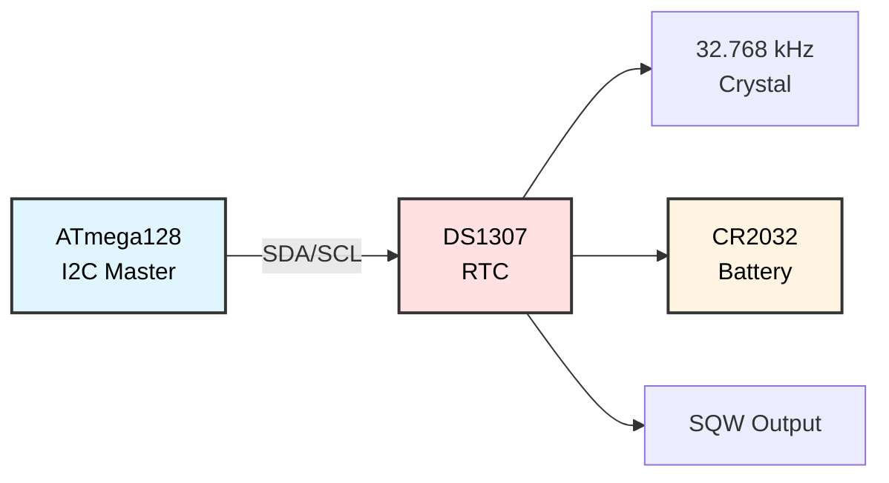

# DS1307 Real-Time Clock (I2C)
## ATmega128 Embedded Systems Course

**Reference**: [ATmega128 Datasheet](https://ww1.microchip.com/downloads/en/DeviceDoc/doc2467.pdf)

---

## Slide 1: Introduction to DS1307 RTC

### What is a Real-Time Clock?
- **Keeps track of time** (seconds, minutes, hours, date)
- **Battery-backed** (continues during power-off)
- **I2C interface** for communication
- Common in **data loggers, alarms, timestamps**

### DS1307 Features
```
Key Specifications:
- I2C Address: 0x68 (7-bit)
- Supply Voltage: 4.5-5.5V
- Backup: 3V coin cell (CR2032)
- Current: 1.5mA active, 500nA backup
- Accuracy: ±2 minutes/year (typical)
- SRAM: 56 bytes battery-backed
- Square Wave Output: 1Hz, 4kHz, 8kHz, 32kHz
```

### DS1307 Block Diagram


### Time Registers (BCD Format)
```
Register Map:
0x00: Seconds (00-59)  + CH (Clock Halt bit)
0x01: Minutes (00-59)
0x02: Hours (00-23 or 01-12 + AM/PM)
0x03: Day of week (1-7)
0x04: Date (01-31)
0x05: Month (01-12)
0x06: Year (00-99, 2000-2099)
0x07: Control register (SQW settings)
0x08-0x3F: 56 bytes of RAM
```

---

## Slide 2: Hardware Connection

### DS1307 Pinout
```
DS1307 (8-pin DIP or SOIC)

     ┌───────┐
  X1 │1    8│ VCC (5V)
  X2 │2    7│ SQW/OUT
 VBat│3    6│ SCL
 GND │4    5│ SDA
     └───────┘

X1, X2: 32.768 kHz crystal
VBat:   3V coin cell (CR2032)
```

### Wiring Diagram
```
ATmega128                DS1307
---------                ------
PD0 (SCL)  ───────4.7kΩ──┬──→ SCL (pin 6)
                         │
PD1 (SDA)  ───────4.7kΩ──┼──→ SDA (pin 5)
                         │
                       ──┴──
                        ═══  (pull-up resistors)
                        VCC

VCC (5V)   ──────────────────→ VCC (pin 8)
GND        ──────────────────→ GND (pin 4)

CR2032 (+) ──────────────────→ VBat (pin 3)
CR2032 (-) ──────────────────→ GND (pin 4)

32.768 kHz Crystal:
  Pin 1 ───── X1 (pin 1)
  Pin 2 ───── X2 (pin 2)
```

### Crystal Load Capacitors
```
Optional (usually internal):

X1 ─┬─ 12.5pF ─ GND
    │
   Crystal
    │
X2 ─┴─ 12.5pF ─ GND

Note: Some DS1307 modules have built-in caps
```

---

## Slide 3: I2C Communication with DS1307

### DS1307 I2C Address
```c
#define DS1307_ADDR  0x68  // 7-bit I2C address

// Full 8-bit addresses:
// Write: 0xD0 (0x68 << 1 | 0)
// Read:  0xD1 (0x68 << 1 | 1)
```

### Write to DS1307 Register
```c
void ds1307_write_byte(uint8_t reg, uint8_t data) {
    i2c_start();
    i2c_write(DS1307_ADDR << 1);  // Write mode
    i2c_write(reg);               // Register address
    i2c_write(data);              // Data to write
    i2c_stop();
}

// Example: Set seconds to 30
ds1307_write_byte(0x00, 0x30);  // BCD format: 0x30 = 30 seconds
```

### Read from DS1307 Register
```c
uint8_t ds1307_read_byte(uint8_t reg) {
    uint8_t data;
    
    // Set register pointer
    i2c_start();
    i2c_write(DS1307_ADDR << 1);   // Write mode
    i2c_write(reg);                // Register address
    
    // Read data
    i2c_start();                   // Repeated start
    i2c_write((DS1307_ADDR << 1) | 1);  // Read mode
    data = i2c_read_nack();        // Read with NACK
    i2c_stop();
    
    return data;
}

// Example: Read seconds
uint8_t seconds_bcd = ds1307_read_byte(0x00);
```

### Burst Read (All Time Registers)
```c
void ds1307_read_time(uint8_t *buffer) {
    // Read registers 0x00-0x06 (7 bytes) in one burst
    
    i2c_start();
    i2c_write(DS1307_ADDR << 1);   // Write mode
    i2c_write(0x00);               // Start at seconds register
    
    i2c_start();                   // Repeated start
    i2c_write((DS1307_ADDR << 1) | 1);  // Read mode
    
    for (uint8_t i = 0; i < 6; i++) {
        buffer[i] = i2c_read_ack();  // Read with ACK
    }
    buffer[6] = i2c_read_nack();     // Last byte with NACK
    
    i2c_stop();
}

// Usage:
uint8_t time_data[7];
ds1307_read_time(time_data);
// time_data[0] = seconds, [1] = minutes, [2] = hours, etc.
```

---

## Slide 4: BCD Conversion

### What is BCD (Binary-Coded Decimal)?
```
DS1307 stores time in BCD format
Each decimal digit = 4 bits

Example: 59 seconds
  Decimal: 59
  Binary:  0b00111011 (0x3B)
  BCD:     0b01011001 (0x59)
           ────┬──── ────┬────
           Tens = 5  Ones = 9
```

### BCD to Decimal Conversion
```c
uint8_t bcd_to_decimal(uint8_t bcd) {
    return ((bcd >> 4) * 10) + (bcd & 0x0F);
}

// Example:
uint8_t sec_bcd = 0x59;
uint8_t sec_dec = bcd_to_decimal(sec_bcd);  // Result: 59
```

### Decimal to BCD Conversion
```c
uint8_t decimal_to_bcd(uint8_t decimal) {
    return ((decimal / 10) << 4) | (decimal % 10);
}

// Example:
uint8_t min_dec = 45;
uint8_t min_bcd = decimal_to_bcd(min_dec);  // Result: 0x45
```

### Time Structure
```c
typedef struct {
    uint8_t second;   // 0-59
    uint8_t minute;   // 0-59
    uint8_t hour;     // 0-23
    uint8_t day;      // 1-7 (day of week)
    uint8_t date;     // 1-31
    uint8_t month;    // 1-12
    uint8_t year;     // 0-99 (2000-2099)
} rtc_time_t;
```

---

## Slide 5: Initialize and Set Time

### Initialize DS1307
```c
void ds1307_init(void) {
    i2c_init();
    
    // Check if clock is halted (CH bit in seconds register)
    uint8_t seconds = ds1307_read_byte(0x00);
    
    if (seconds & 0x80) {
        // Clock is halted, clear CH bit
        ds1307_write_byte(0x00, 0x00);  // Start clock at 0 seconds
    }
    
    // Set control register for 1Hz square wave output
    ds1307_write_byte(0x07, 0x10);  // SQW = 1Hz
}
```

### Set Time
```c
void ds1307_set_time(rtc_time_t *time) {
    // Convert to BCD and write to DS1307
    
    ds1307_write_byte(0x00, decimal_to_bcd(time->second) & 0x7F);  // Clear CH bit
    ds1307_write_byte(0x01, decimal_to_bcd(time->minute));
    ds1307_write_byte(0x02, decimal_to_bcd(time->hour));          // 24-hour mode
    ds1307_write_byte(0x03, decimal_to_bcd(time->day));
    ds1307_write_byte(0x04, decimal_to_bcd(time->date));
    ds1307_write_byte(0x05, decimal_to_bcd(time->month));
    ds1307_write_byte(0x06, decimal_to_bcd(time->year));
}

// Example: Set time to 2024-03-15 14:30:45 (Friday)
rtc_time_t time = {
    .second = 45,
    .minute = 30,
    .hour = 14,
    .day = 5,      // Friday (1=Sunday, 7=Saturday)
    .date = 15,
    .month = 3,
    .year = 24     // 2024
};

ds1307_set_time(&time);
```

---

## Slide 6: Read Time

### Read Current Time
```c
void ds1307_get_time(rtc_time_t *time) {
    uint8_t buffer[7];
    
    // Burst read all time registers
    ds1307_read_time(buffer);
    
    // Convert from BCD to decimal
    time->second = bcd_to_decimal(buffer[0] & 0x7F);  // Mask CH bit
    time->minute = bcd_to_decimal(buffer[1]);
    time->hour   = bcd_to_decimal(buffer[2] & 0x3F);  // Mask 12/24 and AM/PM bits
    time->day    = bcd_to_decimal(buffer[3]);
    time->date   = bcd_to_decimal(buffer[4]);
    time->month  = bcd_to_decimal(buffer[5]);
    time->year   = bcd_to_decimal(buffer[6]);
}

// Usage:
rtc_time_t current_time;
ds1307_get_time(&current_time);

printf("Time: %02d:%02d:%02d\n", 
       current_time.hour, current_time.minute, current_time.second);
printf("Date: 20%02d-%02d-%02d\n", 
       current_time.year, current_time.month, current_time.date);
```

---

## Slide 7: Display Time on LCD

### LCD Clock Display
```c
#include "_lcd.h"

void display_clock(void) {
    rtc_time_t time;
    char buffer[17];
    
    lcd_init();
    ds1307_init();
    
    while (1) {
        ds1307_get_time(&time);
        
        // Line 1: Time
        lcd_gotoxy(0, 0);
        sprintf(buffer, "Time: %02d:%02d:%02d", 
                time.hour, time.minute, time.second);
        lcd_puts(buffer);
        
        // Line 2: Date
        lcd_gotoxy(0, 1);
        sprintf(buffer, "Date: 20%02d/%02d/%02d", 
                time.year, time.month, time.date);
        lcd_puts(buffer);
        
        _delay_ms(500);  // Update every 0.5 seconds
    }
}
```

### Day of Week Display
```c
const char *day_names[] = {
    "???", "Sun", "Mon", "Tue", "Wed", "Thu", "Fri", "Sat"
};

void display_clock_with_day(void) {
    rtc_time_t time;
    char buffer[17];
    
    while (1) {
        ds1307_get_time(&time);
        
        // Line 1: Time + Day
        lcd_gotoxy(0, 0);
        sprintf(buffer, "%s %02d:%02d:%02d", 
                day_names[time.day], time.hour, time.minute, time.second);
        lcd_puts(buffer);
        
        // Line 2: Date
        lcd_gotoxy(0, 1);
        sprintf(buffer, "20%02d-%02d-%02d", 
                time.year, time.month, time.date);
        lcd_puts(buffer);
        
        _delay_ms(1000);
    }
}
```

---

## Slide 8: Alarm Functionality

### Simple Alarm
```c
typedef struct {
    uint8_t hour;
    uint8_t minute;
    uint8_t enabled;
} alarm_t;

alarm_t alarm = {7, 30, 1};  // 7:30 AM, enabled

void check_alarm(void) {
    rtc_time_t time;
    ds1307_get_time(&time);
    
    if (alarm.enabled) {
        if (time.hour == alarm.hour && time.minute == alarm.minute && time.second == 0) {
            // Trigger alarm
            buzzer_on();
            printf("ALARM! Wake up!\n");
            
            // Wait for button press to dismiss
            while (!button_pressed()) {
                _delay_ms(100);
            }
            
            buzzer_off();
        }
    }
}
```

### Set Alarm via Keypad
```c
void set_alarm_keypad(void) {
    char input[5];
    
    lcd_clear();
    lcd_puts("Set Alarm (HHMM):");
    
    // Enter 4 digits: HH MM
    for (uint8_t i = 0; i < 4; i++) {
        input[i] = keypad_getchar();
        lcd_putc(input[i]);
    }
    input[4] = '\0';
    
    // Parse HH:MM
    alarm.hour = (input[0] - '0') * 10 + (input[1] - '0');
    alarm.minute = (input[2] - '0') * 10 + (input[3] - '0');
    
    if (alarm.hour < 24 && alarm.minute < 60) {
        alarm.enabled = 1;
        
        lcd_clear();
        lcd_puts("Alarm set!");
        sprintf(input, "%02d:%02d", alarm.hour, alarm.minute);
        lcd_gotoxy(0, 1);
        lcd_puts(input);
    } else {
        lcd_clear();
        lcd_puts("Invalid time!");
    }
    
    _delay_ms(2000);
}
```

---

## Slide 9: Data Logger with Timestamp

### Temperature Logger
```c
#include "_eeprom.h"

typedef struct {
    uint8_t year, month, date;
    uint8_t hour, minute, second;
    int16_t temperature;  // °C × 10 (e.g., 235 = 23.5°C)
} log_entry_t;

#define MAX_LOG_ENTRIES 100
log_entry_t log_buffer[MAX_LOG_ENTRIES];
uint16_t log_count = 0;

void log_temperature(int16_t temp) {
    if (log_count >= MAX_LOG_ENTRIES) {
        log_count = 0;  // Wrap around (circular buffer)
    }
    
    rtc_time_t time;
    ds1307_get_time(&time);
    
    log_buffer[log_count].year = time.year;
    log_buffer[log_count].month = time.month;
    log_buffer[log_count].date = time.date;
    log_buffer[log_count].hour = time.hour;
    log_buffer[log_count].minute = time.minute;
    log_buffer[log_count].second = time.second;
    log_buffer[log_count].temperature = temp;
    
    log_count++;
    
    printf("Logged: 20%02d-%02d-%02d %02d:%02d:%02d  Temp: %d.%d°C\n",
           time.year, time.month, time.date,
           time.hour, time.minute, time.second,
           temp / 10, temp % 10);
}

// Periodic logging
int main(void) {
    ds1307_init();
    adc_init();
    uart_init();
    
    while (1) {
        int16_t temp = read_temperature();  // From sensor
        log_temperature(temp);
        
        _delay_ms(60000);  // Log every minute
    }
}
```

---

## Slide 10: Battery-Backed SRAM

### Use DS1307's 56-Byte RAM
```c
// DS1307 RAM: registers 0x08 to 0x3F (56 bytes)

void ds1307_write_ram(uint8_t addr, uint8_t data) {
    if (addr < 56) {
        ds1307_write_byte(0x08 + addr, data);
    }
}

uint8_t ds1307_read_ram(uint8_t addr) {
    if (addr < 56) {
        return ds1307_read_byte(0x08 + addr);
    }
    return 0;
}

// Store settings in battery-backed RAM
typedef struct {
    uint8_t alarm_hour;
    uint8_t alarm_minute;
    uint8_t alarm_enabled;
    uint8_t brightness;
} settings_t;

void save_settings(settings_t *settings) {
    uint8_t *ptr = (uint8_t *)settings;
    
    for (uint8_t i = 0; i < sizeof(settings_t); i++) {
        ds1307_write_ram(i, ptr[i]);
    }
}

void load_settings(settings_t *settings) {
    uint8_t *ptr = (uint8_t *)settings;
    
    for (uint8_t i = 0; i < sizeof(settings_t); i++) {
        ptr[i] = ds1307_read_ram(i);
    }
}
```

---

## Slide 11: Square Wave Output

### Configure SQW/OUT Pin
```c
// Control register (0x07):
// Bit 7: OUT (output level when SQW disabled)
// Bit 4: SQWE (square wave enable)
// Bit 1-0: RS1:RS0 (rate select)

#define SQW_1HZ    0x10  // 00: 1 Hz
#define SQW_4KHZ   0x11  // 01: 4.096 kHz
#define SQW_8KHZ   0x12  // 10: 8.192 kHz
#define SQW_32KHZ  0x13  // 11: 32.768 kHz

void ds1307_set_sqw(uint8_t mode) {
    ds1307_write_byte(0x07, mode);
}

// Example: 1Hz heartbeat LED
ds1307_set_sqw(SQW_1HZ);
// Connect SQW pin to LED → blinks at 1Hz
```

---

## Slide 12: Application - Digital Clock

### Full-Featured Digital Clock
```c
typedef enum {
    MODE_CLOCK,
    MODE_SET_TIME,
    MODE_SET_ALARM
} clock_mode_t;

clock_mode_t mode = MODE_CLOCK;

void digital_clock(void) {
    lcd_init();
    ds1307_init();
    keypad_init();
    
    rtc_time_t time;
    char key;
    
    while (1) {
        key = keypad_getchar_noblock();
        
        switch (mode) {
            case MODE_CLOCK:
                ds1307_get_time(&time);
                display_time(&time);
                check_alarm();
                
                if (key == 'A') mode = MODE_SET_TIME;
                if (key == 'B') mode = MODE_SET_ALARM;
                break;
                
            case MODE_SET_TIME:
                set_time_interactive();
                mode = MODE_CLOCK;
                break;
                
            case MODE_SET_ALARM:
                set_alarm_keypad();
                mode = MODE_CLOCK;
                break;
        }
        
        _delay_ms(100);
    }
}

void set_time_interactive(void) {
    lcd_clear();
    lcd_puts("Set Time:");
    
    // Enter time via keypad
    // (Implementation similar to set_alarm_keypad)
}
```

---

## Slide 13: Application - Attendance System

### RFID-Based Attendance Logger
```c
typedef struct {
    uint8_t year, month, date;
    uint8_t hour, minute;
    uint32_t rfid_tag;
    uint8_t type;  // 0=check-in, 1=check-out
} attendance_t;

void log_attendance(uint32_t rfid_tag, uint8_t type) {
    rtc_time_t time;
    ds1307_get_time(&time);
    
    attendance_t entry;
    entry.year = time.year;
    entry.month = time.month;
    entry.date = time.date;
    entry.hour = time.hour;
    entry.minute = time.minute;
    entry.rfid_tag = rfid_tag;
    entry.type = type;
    
    // Save to EEPROM or SD card
    save_attendance_entry(&entry);
    
    // Display on LCD
    lcd_clear();
    if (type == 0) {
        lcd_puts("Check-In:");
    } else {
        lcd_puts("Check-Out:");
    }
    
    lcd_gotoxy(0, 1);
    char buffer[17];
    sprintf(buffer, "%02d:%02d  ID:%08lX", 
            time.hour, time.minute, rfid_tag);
    lcd_puts(buffer);
}
```

---

## Slide 14: Troubleshooting

### Common Issues

| Problem | Cause | Solution |
|---------|-------|----------|
| **Time resets on power-off** | No battery or dead battery | Replace CR2032, check VBat connection |
| **Clock doesn't run** | CH bit set, or crystal issue | Clear CH bit, verify 32.768kHz crystal |
| **Wrong time** | Not set or drifting | Set time, calibrate (±2 min/year typical) |
| **I2C communication fails** | Missing pull-ups | Add 4.7kΩ pull-ups on SDA/SCL |
| **Fast/slow** | Wrong crystal frequency | Use 32.768 kHz crystal |
| **Erratic readings** | Noise on I2C | Shorten wires, add capacitors |

### Debug Code
```c
void ds1307_test(void) {
    uart_init();
    i2c_init();
    
    printf("DS1307 Test\n");
    printf("-----------\n");
    
    // Check I2C communication
    i2c_start();
    uint8_t ack = i2c_write(DS1307_ADDR << 1);
    i2c_stop();
    
    if (ack == 0) {
        printf("DS1307 detected at 0x%02X\n", DS1307_ADDR);
    } else {
        printf("ERROR: DS1307 not found!\n");
        return;
    }
    
    // Read all time registers
    printf("\nTime Registers (BCD):\n");
    for (uint8_t reg = 0; reg < 7; reg++) {
        uint8_t value = ds1307_read_byte(reg);
        printf("  Reg 0x%02X: 0x%02X (%d)\n", reg, value, bcd_to_decimal(value & 0x7F));
    }
    
    // Check CH bit
    uint8_t seconds = ds1307_read_byte(0x00);
    if (seconds & 0x80) {
        printf("\nWARNING: Clock is halted (CH bit set)\n");
    } else {
        printf("\nClock is running\n");
    }
}
```

---

## Slide 15: Summary

### Key Concepts

✓ **I2C address**: 0x68 (7-bit)  
✓ **BCD format**: Time stored as Binary-Coded Decimal  
✓ **Battery backup**: CR2032 keeps time during power-off  
✓ **Registers**: 0x00-0x06 (time), 0x07 (control), 0x08-0x3F (RAM)  
✓ **Burst read**: Read all time registers in one transaction  
✓ **Square wave**: 1Hz, 4kHz, 8kHz, 32kHz output  
✓ **56-byte RAM**: Battery-backed storage  

### Applications
- Digital clocks and timers
- Data loggers (timestamp sensor readings)
- Alarm systems
- Attendance/time tracking
- Scheduled automation
- Event timestamps

### BCD Conversion Summary
```c
// BCD → Decimal
decimal = (bcd >> 4) * 10 + (bcd & 0x0F);

// Decimal → BCD
bcd = ((decimal / 10) << 4) | (decimal % 10);
```

---

## Slide 16: Practice Exercises

### Exercise 1: Basic Clock
**Goal**: Display time on LCD
- Initialize DS1307 via I2C
- Set initial time
- Read and display time every second
- Format as HH:MM:SS

### Exercise 2: Alarm Clock
**Goal**: Implement alarm functionality
- Set alarm time via keypad
- Compare current time with alarm
- Trigger buzzer when alarm time reached
- Add snooze button (5-minute delay)

### Exercise 3: Data Logger
**Goal**: Log sensor readings with timestamp
- Read temperature every minute
- Store timestamp + temperature in EEPROM
- Display log on LCD
- Export via UART

### Exercise 4: Attendance System
**Goal**: Track check-in/check-out times
- Read RFID tag
- Log timestamp + tag ID
- Display last 10 entries
- Calculate total hours

### Exercise 5: Scheduled Tasks
**Goal**: Execute tasks at specific times
- Turn on lights at 18:00
- Turn off lights at 22:00
- Water plants at 08:00 and 18:00
- Display next scheduled task

---

## Slide 17: Additional Resources

### ATmega128 Documentation
- **[Official Datasheet (PDF)](https://ww1.microchip.com/downloads/en/DeviceDoc/doc2467.pdf)**
  - Section 19: Two-Wire Interface (TWI/I2C)

### DS1307 Resources
- DS1307 Datasheet (Maxim Integrated)
- I2C protocol specification
- BCD format explanation
- Crystal oscillator selection

### Related Topics
- I2C multi-device communication
- Battery management
- Time zone handling
- NTP synchronization (for network-connected systems)

### Applications
- Home automation timers
- Industrial process timestamping
- Environmental monitoring
- Access control systems

---

# End of Slides

**Questions?**

For more information, see:
- [ATmega128 Datasheet](https://ww1.microchip.com/downloads/en/DeviceDoc/doc2467.pdf)
- Project source code in `I2C_RTC_DS1307/`
- Shared libraries: `_i2c.h`, `_rtc.h`
