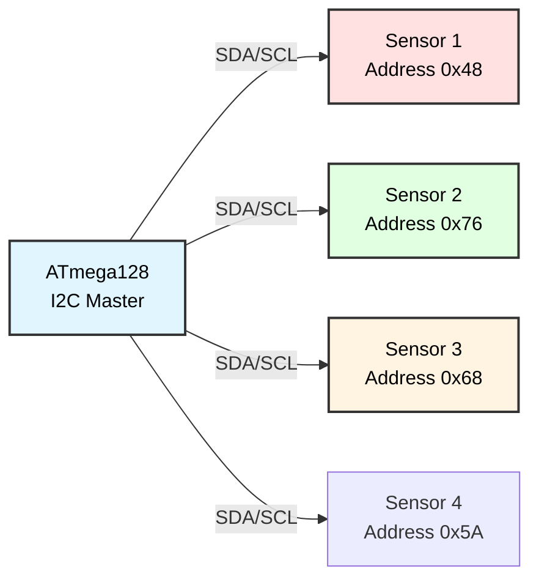

# Multiple I2C Sensors
## ATmega128 Embedded Systems Course

**Reference**: [ATmega128 Datasheet](https://ww1.microchip.com/downloads/en/DeviceDoc/doc2467.pdf)

---

## Slide 1: Introduction to Multi-Sensor Systems

### Why Multiple Sensors?
- **Comprehensive monitoring** (temperature + humidity + pressure)
- **Sensor fusion** (combine data for better accuracy)
- **Redundancy** (backup sensors)
- **Spatial awareness** (multiple locations)

### I2C Advantage for Multiple Sensors


### Common I2C Sensors
```
Temperature Sensors:
- LM75:    I2C address 0x48-0x4F (configurable)
- TMP102:  0x48-0x4B
- DS1621:  0x48-0x4F

Humidity Sensors:
- HTU21D:  0x40
- SHT31:   0x44-0x45

Pressure Sensors:
- BMP180:  0x77
- BMP280:  0x76-0x77

Accelerometers:
- ADXL345: 0x53 (or 0x1D)
- MPU6050: 0x68-0x69

Real-Time Clocks:
- DS1307:  0x68
- DS3231:  0x68

Light Sensors:
- BH1750:  0x23 (or 0x5C)
- APDS9960: 0x39
```

---

## Slide 2: I2C Address Management

### Understanding I2C Addresses
```
7-bit address format:
┌─┬─┬─┬─┬─┬─┬─┐
│A6│A5│A4│A3│A2│A1│A0│
└─┴─┴─┴─┴─┴─┴─┘

Example: LM75 = 0b1001000 = 0x48

In transmission:
┌─┬─┬─┬─┬─┬─┬─┬─┐
│A6│A5│A4│A3│A2│A1│A0│R/W│
└─┴─┴─┴─┴─┴─┴─┴─┘
 
8-bit format:
Write: 0x48 << 1 | 0 = 0x90
Read:  0x48 << 1 | 1 = 0x91
```

### Address Conflicts
```c
// CONFLICT: DS1307 and MPU6050 both use 0x68!
// Solutions:

// 1. Use sensors with different addresses
#define DS1307_ADDR  0x68
#define MPU6050_ADDR 0x69  // ALT address (tie AD0 high)

// 2. Use I2C multiplexer (TCA9548A)
#define MUX_ADDR     0x70
// Enable channel 0 for DS1307
// Enable channel 1 for MPU6050

// 3. Use software I2C on different pins
// Hardware I2C: PD0/PD1 for DS1307
// Software I2C: PC0/PC1 for MPU6050
```

### Sensor Address Table
```c
typedef struct {
    const char *name;
    uint8_t address;
    uint8_t active;
} i2c_device_t;

i2c_device_t sensors[] = {
    {"LM75 Temp",     0x48, 1},
    {"HTU21D RH/Temp", 0x40, 1},
    {"BMP280 Press",  0x76, 1},
    {"DS1307 RTC",    0x68, 1},
    {"BH1750 Light",  0x23, 1}
};

#define NUM_SENSORS (sizeof(sensors) / sizeof(i2c_device_t))
```

---

## Slide 3: I2C Bus Scanning

### Detect Connected Devices
```c
void i2c_scan(void) {
    uint8_t found_count = 0;
    
    printf("Scanning I2C bus...\n");
    printf("     0  1  2  3  4  5  6  7  8  9  A  B  C  D  E  F\n");
    
    for (uint8_t row = 0; row < 8; row++) {
        printf("%02X: ", row << 4);
        
        for (uint8_t col = 0; col < 16; col++) {
            uint8_t addr = (row << 4) | col;
            
            // Skip reserved addresses
            if (addr < 0x08 || addr > 0x77) {
                printf("   ");
                continue;
            }
            
            // Try to communicate with device
            i2c_start();
            uint8_t ack = i2c_write(addr << 1);
            i2c_stop();
            
            if (ack == 0) {
                // Device responded
                printf("%02X ", addr);
                found_count++;
            } else {
                printf("-- ");
            }
        }
        printf("\n");
    }
    
    printf("\nFound %d device(s)\n", found_count);
}
```

### Device Detection
```c
uint8_t i2c_device_present(uint8_t addr) {
    i2c_start();
    uint8_t ack = i2c_write(addr << 1);
    i2c_stop();
    
    return (ack == 0) ? 1 : 0;  // 1 if present
}

// Usage
if (i2c_device_present(0x48)) {
    printf("LM75 temperature sensor detected\n");
} else {
    printf("LM75 not found!\n");
}
```

---

## Slide 4: LM75 Temperature Sensor

### LM75 Features
```
- I2C Address: 0x48-0x4F (3 address pins)
- Resolution: 9-bit (0.5°C)
- Range: -55°C to +125°C
- Registers: Temperature, Configuration, Thyst, Tos
```

### LM75 Driver
```c
#define LM75_ADDR        0x48
#define LM75_REG_TEMP    0x00
#define LM75_REG_CONFIG  0x01

int16_t lm75_read_temperature(void) {
    uint8_t msb, lsb;
    
    // Set pointer to temperature register
    i2c_start();
    i2c_write(LM75_ADDR << 1);
    i2c_write(LM75_REG_TEMP);
    
    // Read 2 bytes
    i2c_start();  // Repeated start
    i2c_write((LM75_ADDR << 1) | 1);
    msb = i2c_read_ack();
    lsb = i2c_read_nack();
    i2c_stop();
    
    // Convert to temperature (9-bit, 0.5°C resolution)
    int16_t temp_raw = (int16_t)((msb << 8) | lsb);
    temp_raw >>= 7;  // Right-align 9-bit value
    
    // Result in °C × 2 (e.g., 50 = 25.0°C)
    return temp_raw;
}

// Usage
int16_t temp = lm75_read_temperature();
printf("Temperature: %d.%d°C\n", temp / 2, (temp % 2) * 5);
```

---

## Slide 5: HTU21D Humidity Sensor

### HTU21D Features
```
- I2C Address: 0x40 (fixed)
- Humidity: 0-100% RH, 0.04% resolution
- Temperature: -40 to +125°C, 0.01°C resolution
- Measurement time: 50ms (14-bit)
```

### HTU21D Driver
```c
#define HTU21D_ADDR           0x40
#define HTU21D_CMD_TRIG_TEMP  0xF3  // Trigger temp (no hold master)
#define HTU21D_CMD_TRIG_RH    0xF5  // Trigger RH (no hold master)

uint16_t htu21d_read_raw(uint8_t command) {
    // Trigger measurement
    i2c_start();
    i2c_write(HTU21D_ADDR << 1);
    i2c_write(command);
    i2c_stop();
    
    // Wait for measurement (max 50ms for 14-bit)
    _delay_ms(50);
    
    // Read result (2 bytes + CRC)
    i2c_start();
    i2c_write((HTU21D_ADDR << 1) | 1);
    uint8_t msb = i2c_read_ack();
    uint8_t lsb = i2c_read_ack();
    uint8_t crc = i2c_read_nack();  // CRC (not validated in this example)
    i2c_stop();
    
    return (msb << 8) | lsb;
}

int16_t htu21d_read_temperature(void) {
    uint16_t raw = htu21d_read_raw(HTU21D_CMD_TRIG_TEMP);
    
    // Temp = -46.85 + 175.72 × (raw / 65536)
    // Result in °C × 10
    int32_t temp = -4685 + ((17572L * raw) >> 16);
    
    return (int16_t)temp;
}

uint16_t htu21d_read_humidity(void) {
    uint16_t raw = htu21d_read_raw(HTU21D_CMD_TRIG_RH);
    
    // RH = -6 + 125 × (raw / 65536)
    // Result in % × 10
    int32_t rh = -60 + ((1250L * raw) >> 16);
    
    // Clamp to 0-1000 (0-100%)
    if (rh < 0) rh = 0;
    if (rh > 1000) rh = 1000;
    
    return (uint16_t)rh;
}

// Usage
int16_t temp = htu21d_read_temperature();
uint16_t rh = htu21d_read_humidity();

printf("Temp: %d.%d°C  RH: %d.%d%%\n",
       temp / 10, abs(temp % 10),
       rh / 10, rh % 10);
```

---

## Slide 6: BMP280 Pressure Sensor

### BMP280 Features
```
- I2C Address: 0x76 or 0x77 (SDO pin)
- Pressure: 300-1100 hPa
- Temperature: -40 to +85°C
- Resolution: 0.01 hPa
```

### BMP280 Driver (Simplified)
```c
#define BMP280_ADDR          0x76
#define BMP280_REG_CHIP_ID   0xD0
#define BMP280_REG_CTRL_MEAS 0xF4
#define BMP280_REG_PRESS_MSB 0xF7

void bmp280_init(void) {
    // Read chip ID (should be 0x58)
    i2c_start();
    i2c_write(BMP280_ADDR << 1);
    i2c_write(BMP280_REG_CHIP_ID);
    i2c_start();
    i2c_write((BMP280_ADDR << 1) | 1);
    uint8_t id = i2c_read_nack();
    i2c_stop();
    
    if (id != 0x58) {
        printf("BMP280 not found (ID: 0x%02X)\n", id);
        return;
    }
    
    // Configure: Normal mode, oversampling x16
    i2c_start();
    i2c_write(BMP280_ADDR << 1);
    i2c_write(BMP280_REG_CTRL_MEAS);
    i2c_write(0x57);  // osrs_t=x2, osrs_p=x16, mode=normal
    i2c_stop();
}

uint32_t bmp280_read_raw_pressure(void) {
    // Read pressure registers (20-bit value)
    i2c_start();
    i2c_write(BMP280_ADDR << 1);
    i2c_write(BMP280_REG_PRESS_MSB);
    
    i2c_start();
    i2c_write((BMP280_ADDR << 1) | 1);
    uint8_t msb = i2c_read_ack();
    uint8_t lsb = i2c_read_ack();
    uint8_t xlsb = i2c_read_nack();
    i2c_stop();
    
    uint32_t raw = ((uint32_t)msb << 12) | ((uint32_t)lsb << 4) | (xlsb >> 4);
    
    return raw;
}

// Note: Full pressure calculation requires compensation
// using calibration data from BMP280's internal registers
// See BMP280 datasheet for complete formula
```

---

## Slide 7: Multi-Sensor Read Loop

### Poll All Sensors
```c
typedef struct {
    int16_t lm75_temp;     // °C × 2
    int16_t htu_temp;      // °C × 10
    uint16_t htu_rh;       // % × 10
    uint32_t bmp_pressure; // Raw value
    uint16_t bh1750_lux;   // Lux
} sensor_data_t;

sensor_data_t sensors;

void read_all_sensors(void) {
    // LM75 Temperature
    sensors.lm75_temp = lm75_read_temperature();
    
    // HTU21D Temperature + Humidity
    sensors.htu_temp = htu21d_read_temperature();
    sensors.htu_rh = htu21d_read_humidity();
    
    // BMP280 Pressure
    sensors.bmp_pressure = bmp280_read_raw_pressure();
    
    // BH1750 Light (if connected)
    sensors.bh1750_lux = bh1750_read_lux();
}

void display_sensor_data(void) {
    printf("\n=== Sensor Readings ===\n");
    printf("LM75 Temp:  %d.%d°C\n", 
           sensors.lm75_temp / 2, (sensors.lm75_temp % 2) * 5);
    printf("HTU Temp:   %d.%d°C\n", 
           sensors.htu_temp / 10, abs(sensors.htu_temp % 10));
    printf("HTU RH:     %d.%d%%\n", 
           sensors.htu_rh / 10, sensors.htu_rh % 10);
    printf("BMP Press:  %lu (raw)\n", sensors.bmp_pressure);
    printf("Light:      %d lux\n", sensors.bh1750_lux);
}

int main(void) {
    i2c_init();
    uart_init();
    bmp280_init();
    
    while (1) {
        read_all_sensors();
        display_sensor_data();
        
        _delay_ms(2000);
    }
}
```

---

## Slide 8: Sensor Fusion

### Average Multiple Temperature Sensors
```c
int16_t get_averaged_temperature(void) {
    // LM75: °C × 2
    int16_t lm75 = lm75_read_temperature();
    lm75 *= 5;  // Convert to °C × 10
    
    // HTU21D: °C × 10
    int16_t htu = htu21d_read_temperature();
    
    // Average
    int16_t avg = (lm75 + htu) / 2;
    
    return avg;  // °C × 10
}
```

### Outlier Detection
```c
int16_t temp_readings[3];

int16_t get_temperature_with_outlier_rejection(void) {
    temp_readings[0] = lm75_read_temperature() * 5;
    temp_readings[1] = htu21d_read_temperature();
    temp_readings[2] = bmp280_read_temperature_compensated();
    
    // Sort readings
    for (uint8_t i = 0; i < 2; i++) {
        for (uint8_t j = i + 1; j < 3; j++) {
            if (temp_readings[i] > temp_readings[j]) {
                int16_t tmp = temp_readings[i];
                temp_readings[i] = temp_readings[j];
                temp_readings[j] = tmp;
            }
        }
    }
    
    // Return median (middle value)
    return temp_readings[1];
}
```

---

## Slide 9: Application - Weather Station

### Multi-Sensor Weather Station
```c
void weather_station(void) {
    lcd_init();
    i2c_init();
    bmp280_init();
    
    char line1[17], line2[17];
    
    while (1) {
        int16_t temp = htu21d_read_temperature();
        uint16_t rh = htu21d_read_humidity();
        uint32_t press = bmp280_read_raw_pressure();  // Simplified
        
        // Line 1: Temp + Humidity
        sprintf(line1, "T:%d.%d%cC RH:%d%%",
                temp / 10, abs(temp % 10), 0xDF,  // °C symbol
                rh / 10);
        
        // Line 2: Pressure
        sprintf(line2, "P:%lu hPa", press / 256);  // Rough conversion
        
        lcd_gotoxy(0, 0);
        lcd_puts(line1);
        lcd_gotoxy(0, 1);
        lcd_puts(line2);
        
        _delay_ms(5000);
    }
}
```

---

## Slide 10: Application - Data Logger

### Log Multiple Sensors to EEPROM
```c
typedef struct {
    uint8_t year, month, day, hour, minute;
    int16_t temp1;         // LM75
    int16_t temp2;         // HTU21D
    uint16_t humidity;     // HTU21D
    uint32_t pressure;     // BMP280
} multi_sensor_log_t;

#define LOG_ADDR 0x0100
uint16_t log_index = 0;

void log_multi_sensor(void) {
    multi_sensor_log_t entry;
    
    // Get timestamp from DS1307 RTC
    rtc_time_t time;
    ds1307_get_time(&time);
    
    entry.year = time.year;
    entry.month = time.month;
    entry.day = time.date;
    entry.hour = time.hour;
    entry.minute = time.minute;
    
    // Read all sensors
    entry.temp1 = lm75_read_temperature();
    entry.temp2 = htu21d_read_temperature();
    entry.humidity = htu21d_read_humidity();
    entry.pressure = bmp280_read_raw_pressure();
    
    // Write to EEPROM
    uint16_t addr = LOG_ADDR + (log_index * sizeof(multi_sensor_log_t));
    eeprom_write_buffer(addr, (uint8_t *)&entry, sizeof(entry));
    
    log_index++;
    
    printf("Logged: 20%02d-%02d-%02d %02d:%02d  Sensors: %d/%d/%d/%lu\n",
           entry.year, entry.month, entry.day,
           entry.hour, entry.minute,
           entry.temp1, entry.temp2, entry.humidity, entry.pressure);
}

int main(void) {
    i2c_init();
    uart_init();
    eeprom_init();
    ds1307_init();
    bmp280_init();
    
    while (1) {
        log_multi_sensor();
        _delay_ms(60000);  // Log every minute
    }
}
```

---

## Slide 11: I2C Multiplexer (TCA9548A)

### Expand I2C Bus
```
TCA9548A: 1-to-8 I2C multiplexer
- Address: 0x70-0x77 (configurable)
- 8 independent I2C channels
- Allows multiple devices with same address

                        ┌───────────┐
ATmega128 ──SDA/SCL──→  │ TCA9548A  │
                        │  (0x70)   │
                        └─────┬─────┘
                    ┌─────────┼─────────┐
                  CH0       CH1       CH2
                    │         │         │
                DS1307    DS1307    DS1307
                (0x68)    (0x68)    (0x68)
```

### TCA9548A Driver
```c
#define TCA9548A_ADDR 0x70

void tca9548a_select_channel(uint8_t channel) {
    // channel: 0-7
    // Send 1-byte to select channel (bit mask)
    
    uint8_t channel_mask = 1 << channel;
    
    i2c_start();
    i2c_write(TCA9548A_ADDR << 1);
    i2c_write(channel_mask);
    i2c_stop();
}

void tca9548a_disable_all(void) {
    i2c_start();
    i2c_write(TCA9548A_ADDR << 1);
    i2c_write(0x00);  // All channels off
    i2c_stop();
}

// Usage: Access multiple DS1307 RTCs
void read_all_rtcs(void) {
    rtc_time_t time;
    
    for (uint8_t ch = 0; ch < 3; ch++) {
        tca9548a_select_channel(ch);
        ds1307_get_time(&time);
        
        printf("RTC %d: %02d:%02d:%02d\n", 
               ch, time.hour, time.minute, time.second);
    }
    
    tca9548a_disable_all();
}
```

---

## Slide 12: Error Handling

### Detect Communication Errors
```c
typedef enum {
    SENSOR_OK,
    SENSOR_NOT_FOUND,
    SENSOR_TIMEOUT,
    SENSOR_CHECKSUM_ERROR
} sensor_error_t;

sensor_error_t lm75_read_with_error(int16_t *temp) {
    // Check if device present
    if (!i2c_device_present(LM75_ADDR)) {
        return SENSOR_NOT_FOUND;
    }
    
    // Try to read
    i2c_start();
    uint8_t ack = i2c_write(LM75_ADDR << 1);
    if (ack != 0) {
        i2c_stop();
        return SENSOR_TIMEOUT;
    }
    
    i2c_write(LM75_REG_TEMP);
    
    i2c_start();
    i2c_write((LM75_ADDR << 1) | 1);
    uint8_t msb = i2c_read_ack();
    uint8_t lsb = i2c_read_nack();
    i2c_stop();
    
    // Convert
    int16_t temp_raw = (int16_t)((msb << 8) | lsb);
    temp_raw >>= 7;
    
    *temp = temp_raw;
    
    return SENSOR_OK;
}

// Usage
int16_t temperature;
sensor_error_t err = lm75_read_with_error(&temperature);

switch (err) {
    case SENSOR_OK:
        printf("Temperature: %d.%d°C\n", temperature / 2, (temperature % 2) * 5);
        break;
    case SENSOR_NOT_FOUND:
        printf("ERROR: LM75 not found!\n");
        break;
    case SENSOR_TIMEOUT:
        printf("ERROR: LM75 timeout!\n");
        break;
    default:
        printf("ERROR: Unknown error\n");
}
```

---

## Slide 13: Troubleshooting

### Common Issues

| Problem | Cause | Solution |
|---------|-------|----------|
| **No devices detected** | Missing pull-ups | Add 4.7kΩ on SDA/SCL |
| **Some sensors work, others don't** | Address conflict | Check addresses, use mux |
| **Intermittent errors** | Noise, long wires | Shorten wires, add capacitors |
| **Slow response** | I2C clock too slow | Increase TWI bitrate (up to 400 kHz) |
| **Wrong readings** | Sensor not initialized | Call sensor init functions |
| **Bus lockup** | SDA/SCL stuck low | Power cycle, check for shorts |

### Debug Code
```c
void debug_i2c_sensors(void) {
    printf("I2C Sensor Diagnostics\n");
    printf("======================\n\n");
    
    // Check pull-ups
    printf("Pull-up check:\n");
    printf("  SDA (idle): %s\n", (PIND & (1 << PD1)) ? "HIGH (OK)" : "LOW (BAD)");
    printf("  SCL (idle): %s\n\n", (PIND & (1 << PD0)) ? "HIGH (OK)" : "LOW (BAD)");
    
    // Scan bus
    printf("Bus scan:\n");
    i2c_scan();
    
    // Test each sensor
    printf("\nSensor tests:\n");
    
    if (i2c_device_present(0x48)) {
        int16_t temp = lm75_read_temperature();
        printf("  LM75 (0x48): %d.%d°C\n", temp / 2, (temp % 2) * 5);
    } else {
        printf("  LM75 (0x48): NOT FOUND\n");
    }
    
    if (i2c_device_present(0x40)) {
        int16_t temp = htu21d_read_temperature();
        printf("  HTU21D (0x40): %d.%d°C\n", temp / 10, abs(temp % 10));
    } else {
        printf("  HTU21D (0x40): NOT FOUND\n");
    }
    
    // ... test other sensors
}
```

---

## Slide 14: Summary

### Key Concepts

✓ **Shared bus**: Multiple sensors on SDA/SCL  
✓ **Unique addresses**: Each device needs different address  
✓ **Polling**: Read sensors sequentially  
✓ **Sensor fusion**: Combine data for accuracy  
✓ **I2C mux**: Expand bus, resolve conflicts  
✓ **Error handling**: Detect missing/faulty sensors  

### Common Sensor Suite
```
Environmental Monitoring:
- LM75: Temperature (-55 to +125°C)
- HTU21D: Humidity + Temperature
- BMP280: Pressure (300-1100 hPa)
- BH1750: Light (1-65535 lux)

Motion/Orientation:
- ADXL345: Accelerometer
- MPU6050: Gyro + Accelerometer

Timekeeping:
- DS1307/DS3231: Real-time clock
```

### Applications
- Weather stations
- Environmental monitors
- HVAC control systems
- Smart agriculture
- Industrial automation
- Home automation

---

## Slide 15: Practice Exercises

### Exercise 1: Multi-Sensor Display
**Goal**: Show data from 3+ sensors on LCD
- Connect LM75, HTU21D, BMP280
- Read all sensors every 2 seconds
- Display rotating screens:
  - Screen 1: Temperature
  - Screen 2: Humidity
  - Screen 3: Pressure

### Exercise 2: Sensor Fusion
**Goal**: Improve accuracy with multiple sensors
- Use 2-3 temperature sensors
- Calculate average
- Implement outlier rejection (median filter)
- Compare individual vs. fused readings

### Exercise 3: Data Logger
**Goal**: Log multi-sensor data with timestamp
- Connect DS1307 RTC
- Log temp, humidity, pressure every minute
- Store in SPI EEPROM
- Display last 10 entries on LCD

### Exercise 4: I2C Bus Monitor
**Goal**: Diagnose I2C communication
- Scan bus for devices
- Display addresses found
- Test read/write to each device
- Report errors (not found, timeout)

### Exercise 5: I2C Multiplexer
**Goal**: Use TCA9548A to expand bus
- Connect 3+ sensors with same address
- Implement channel selection
- Read all sensors sequentially
- Display on LCD

---

## Slide 16: Additional Resources

### ATmega128 Documentation
- **[Official Datasheet (PDF)](https://ww1.microchip.com/downloads/en/DeviceDoc/doc2467.pdf)**
  - Section 19: Two-Wire Interface (TWI/I2C)

### Sensor Datasheets
- LM75 Temperature Sensor (TI)
- HTU21D Humidity Sensor (TE Connectivity)
- BMP280 Pressure Sensor (Bosch)
- BH1750 Light Sensor (ROHM)
- TCA9548A I2C Multiplexer (TI)

### I2C Resources
- I2C specification (NXP)
- I2C address list (standard addresses)
- Multi-master I2C
- Clock stretching

### Applications
- IoT sensor nodes
- Environmental monitoring
- Smart building systems
- Agricultural automation

---

# End of Slides

**Questions?**

For more information, see:
- [ATmega128 Datasheet](https://ww1.microchip.com/downloads/en/DeviceDoc/doc2467.pdf)
- Project source code in `I2C_Sensors_Multi/`
- Shared libraries: `_i2c.h`, sensor driver headers
