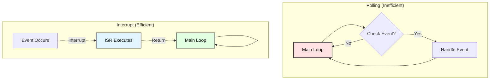
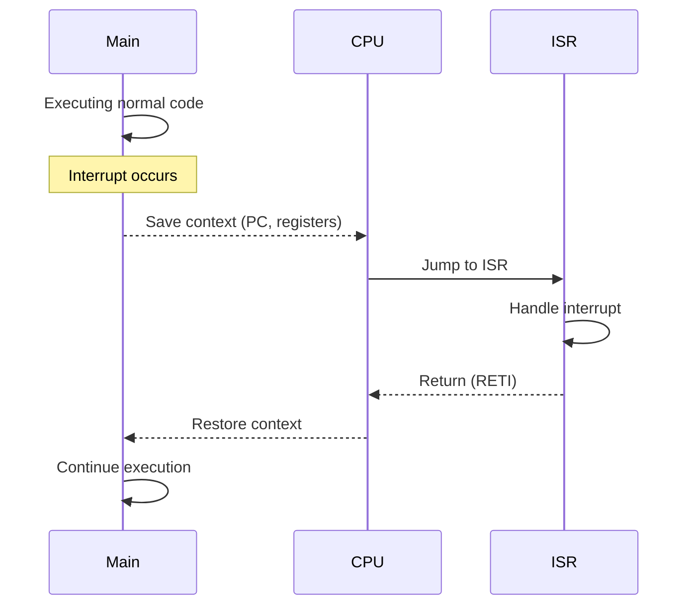
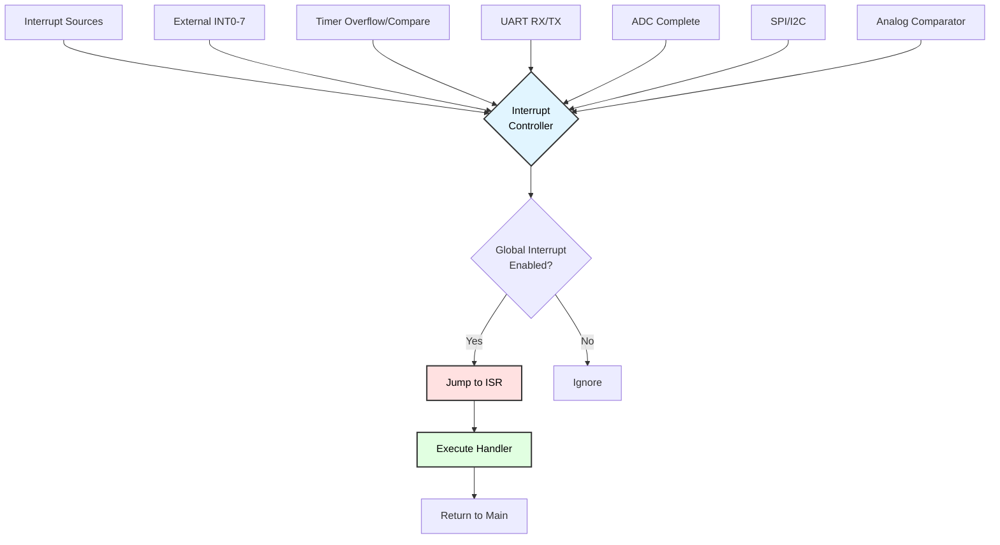
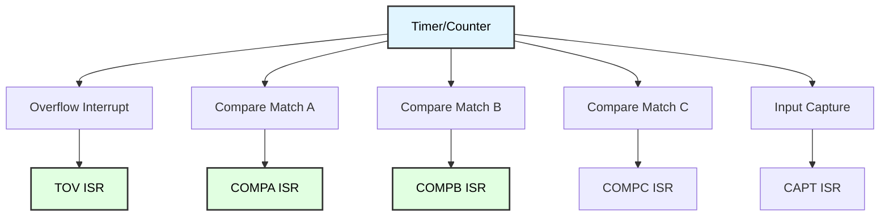
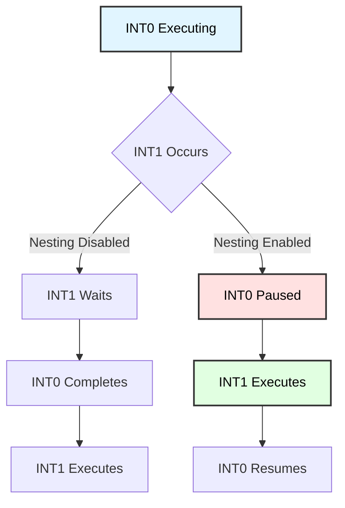

# Interrupt System Programming
## ATmega128 Embedded Systems Course

**Reference**: [ATmega128 Datasheet](https://ww1.microchip.com/downloads/en/DeviceDoc/doc2467.pdf)

---

## Slide 1: Introduction to Interrupts

### What are Interrupts?
- **Asynchronous events** that temporarily halt normal program execution
- CPU **automatically jumps** to specific handler function (ISR)
- After handling, program **resumes** where it left off
- Critical for **real-time** and **event-driven** systems

### Why Use Interrupts?
✓ **Immediate response** to critical events  
✓ **Efficient** - CPU can do other work while waiting  
✓ **Real-time** - Handle time-critical tasks  
✓ **Low power** - Sleep until interrupt occurs  
✓ **Simplify code** - Event-driven vs polling  

### Common Interrupt Sources
- External events (buttons, sensors)
- Timer overflows/compare matches
- Serial communication (UART RX/TX)
- ADC conversion complete
- SPI/I2C transactions

---

## Slide 2: Interrupt Concept

### Polling vs Interrupts


### Interrupt Flow


---

## Slide 3: ATmega128 Interrupt System

### Interrupt Architecture


### Interrupt Priority (Fixed)
1. **Reset** (highest priority)
2. **External INT0**
3. **External INT1**
4. **External INT2**
5. **External INT3**
6. **Timer/Counter Interrupts**
7. **USART Interrupts**
8. **ADC Complete**
... (35 interrupt sources total)

---

## Slide 4: Global Interrupt Control

### Enable/Disable Interrupts
```c
#include <avr/io.h>
#include <avr/interrupt.h>

// Enable global interrupts
void interrupts_enable(void) {
    sei();  // Set I-bit in SREG
}

// Disable global interrupts
void interrupts_disable(void) {
    cli();  // Clear I-bit in SREG
}

// Critical section example
void critical_operation(void) {
    uint8_t sreg = SREG;  // Save interrupt state
    cli();                 // Disable interrupts
    
    // Critical code here (won't be interrupted)
    PORTA = 0xFF;
    PORTB = 0x00;
    
    SREG = sreg;           // Restore interrupt state
}

// Atomic operation macro
#include <util/atomic.h>
void atomic_example(void) {
    ATOMIC_BLOCK(ATOMIC_RESTORESTATE) {
        // Atomic code block
        global_counter++;
    }
}
```

### Status Register (SREG)
```
Bit  7     6     5     4     3     2     1     0
   ┌─────┬─────┬─────┬─────┬─────┬─────┬─────┬─────┐
   │  I  │  T  │  H  │  S  │  V  │  N  │  Z  │  C  │
   └─────┴─────┴─────┴─────┴─────┴─────┴─────┴─────┘
     ↑
     Global Interrupt Enable (I-bit)
```

---

## Slide 5: External Interrupts INT0-INT3

### External Interrupt Pins
| Interrupt | Pin | Description |
|-----------|-----|-------------|
| **INT0** | PD0 | External Interrupt 0 |
| **INT1** | PD1 | External Interrupt 1 |
| **INT2** | PD2 | External Interrupt 2 |
| **INT3** | PD3 | External Interrupt 3 |

### EICRA - External Interrupt Control Register A
```
Bit     7      6      5      4      3      2      1      0
      ┌──────┬──────┬──────┬──────┬──────┬──────┬──────┬──────┐
EICRA │ ISC31│ ISC30│ ISC21│ ISC20│ ISC11│ ISC10│ ISC01│ ISC00│
      └──────┴──────┴──────┴──────┴──────┴──────┴──────┴──────┘
```

### Trigger Modes (ISCn1:ISCn0)
```
00 = Low level trigger
01 = Any logical change
10 = Falling edge
11 = Rising edge
```

---

## Slide 6: External Interrupt Configuration

### Basic Setup Example
```c
#include <avr/io.h>
#include <avr/interrupt.h>

// Configure INT0 for falling edge
void int0_init(void) {
    // Set INT0 trigger mode: falling edge
    EICRA |= (1 << ISC01);   // ISC01 = 1
    EICRA &= ~(1 << ISC00);  // ISC00 = 0
    
    // Enable INT0 interrupt
    EIMSK |= (1 << INT0);
    
    // Enable global interrupts
    sei();
}

// INT0 Interrupt Service Routine
ISR(INT0_vect) {
    // This code runs when INT0 is triggered
    PORTA ^= (1 << PA0);  // Toggle LED
}

// Configure INT1 for rising edge
void int1_init(void) {
    EICRA |= (1 << ISC11) | (1 << ISC10);  // Rising edge
    EIMSK |= (1 << INT1);
    sei();
}

ISR(INT1_vect) {
    // Handle INT1 interrupt
    button_pressed = 1;
}

int main(void) {
    DDRA |= (1 << PA0);  // LED output
    
    int0_init();
    
    while (1) {
        // Main loop can do other tasks
        // Interrupt handles button press
    }
}
```

---

## Slide 7: External Interrupts INT4-INT7

### Additional External Interrupts
| Interrupt | Pin | Notes |
|-----------|-----|-------|
| **INT4** | PE4 | Edge/level triggered |
| **INT5** | PE5 | Edge/level triggered |
| **INT6** | PE6 | Edge/level triggered |
| **INT7** | PE7 | Edge/level triggered |

### EICRB - External Interrupt Control Register B
```
Bit     7      6      5      4      3      2      1      0
      ┌──────┬──────┬──────┬──────┬──────┬──────┬──────┬──────┐
EICRB │ ISC71│ ISC70│ ISC61│ ISC60│ ISC51│ ISC50│ ISC41│ ISC40│
      └──────┴──────┴──────┴──────┴──────┴──────┴──────┴──────┘
```

### EIMSK - External Interrupt Mask Register
```
Bit     7      6      5      4      3      2      1      0
      ┌──────┬──────┬──────┬──────┬──────┬──────┬──────┬──────┐
EIMSK │ INT7 │ INT6 │ INT5 │ INT4 │ INT3 │ INT2 │ INT1 │ INT0 │
      └──────┴──────┴──────┴──────┴──────┴──────┴──────┴──────┘
```

### Example: INT4-7 Setup
```c
void int4_7_init(void) {
    // INT4: Rising edge
    EICRB |= (1 << ISC41) | (1 << ISC40);
    
    // INT5: Falling edge
    EICRB |= (1 << ISC51);
    EICRB &= ~(1 << ISC50);
    
    // Enable INT4 and INT5
    EIMSK |= (1 << INT4) | (1 << INT5);
    
    sei();
}

ISR(INT4_vect) {
    // Handle INT4
}

ISR(INT5_vect) {
    // Handle INT5
}
```

---

## Slide 8: Debouncing with Interrupts

### Hardware Debouncing
```
Button -> RC Filter -> MCU Pin
         (10kΩ + 0.1µF)
```

### Software Debouncing
```c
#include <util/delay.h>

volatile uint8_t button_flag = 0;

ISR(INT0_vect) {
    // Simple delay debounce
    _delay_ms(50);  // ⚠️ Not recommended in ISR!
    
    // Re-check button state
    if (!(PIND & (1 << PD0))) {
        button_flag = 1;
    }
}

// Better approach: Use timer for debouncing
volatile uint8_t debounce_active = 0;

ISR(INT0_vect) {
    if (!debounce_active) {
        button_flag = 1;
        debounce_active = 1;
        
        // Start timer for debounce period
        // Timer will clear debounce_active after 50ms
        start_debounce_timer();
    }
}

ISR(TIMER0_OVF_vect) {
    debounce_active = 0;
}
```

### State Machine Debounce
```c
typedef enum {
    BUTTON_IDLE,
    BUTTON_PRESSED,
    BUTTON_DEBOUNCE
} button_state_t;

volatile button_state_t button_state = BUTTON_IDLE;
volatile uint8_t debounce_count = 0;

ISR(INT0_vect) {
    if (button_state == BUTTON_IDLE) {
        button_state = BUTTON_DEBOUNCE;
        debounce_count = 0;
    }
}

// Called from timer ISR every 10ms
void button_debounce_update(void) {
    switch (button_state) {
        case BUTTON_DEBOUNCE:
            if (!(PIND & (1 << PD0))) {
                debounce_count++;
                if (debounce_count >= 5) {  // 50ms stable
                    button_state = BUTTON_PRESSED;
                    handle_button_press();
                }
            } else {
                button_state = BUTTON_IDLE;
            }
            break;
            
        case BUTTON_PRESSED:
            if (PIND & (1 << PD0)) {
                button_state = BUTTON_IDLE;
            }
            break;
            
        default:
            break;
    }
}
```

---

## Slide 9: Timer Interrupts

### Timer Interrupt Sources


### Timer0 Overflow Example
```c
// Generate 1ms interrupt with Timer0
// F_CPU = 16MHz, Prescaler = 64
// Timer count = 256 - (16000000 / (64 * 1000)) = 6

void timer0_init(void) {
    // CTC mode with OCR0
    TCCR0 = (1 << WGM01);
    
    // Set compare value for 1ms
    OCR0 = 249;  // (16MHz / 64kHz) - 1
    
    // Prescaler = 64
    TCCR0 |= (1 << CS01) | (1 << CS00);
    
    // Enable compare match interrupt
    TIMSK |= (1 << OCIE0);
    
    sei();
}

volatile uint32_t milliseconds = 0;

ISR(TIMER0_COMP_vect) {
    milliseconds++;
}

uint32_t millis(void) {
    uint32_t ms;
    uint8_t sreg = SREG;
    cli();
    ms = milliseconds;
    SREG = sreg;
    return ms;
}
```

---

## Slide 10: UART Interrupts

### UART Interrupt Sources
- **RXC**: Receive Complete
- **TXC**: Transmit Complete
- **UDRE**: Data Register Empty (ready to send)

### RX Interrupt Example
```c
#define BUFFER_SIZE 64
volatile char rx_buffer[BUFFER_SIZE];
volatile uint8_t rx_head = 0;
volatile uint8_t rx_tail = 0;

void uart_init_interrupt(void) {
    // Baud rate
    UBRR0 = 103;  // 9600 @ 16MHz
    
    // Enable RX, TX, and RX interrupt
    UCSR0B = (1 << RXEN0) | (1 << TXEN0) | (1 << RXCIE0);
    
    // 8N1
    UCSR0C = (1 << URSEL0) | (1 << UCSZ01) | (1 << UCSZ00);
    
    sei();
}

ISR(USART0_RX_vect) {
    uint8_t next = (rx_head + 1) % BUFFER_SIZE;
    
    if (next != rx_tail) {
        rx_buffer[rx_head] = UDR0;
        rx_head = next;
    }
}

uint8_t uart_available(void) {
    return (rx_head - rx_tail + BUFFER_SIZE) % BUFFER_SIZE;
}

char uart_getc(void) {
    while (rx_head == rx_tail);
    
    char c = rx_buffer[rx_tail];
    rx_tail = (rx_tail + 1) % BUFFER_SIZE;
    return c;
}
```

---

## Slide 11: ADC Interrupts

### ADC Conversion Complete Interrupt
```c
volatile uint16_t adc_result;
volatile uint8_t adc_ready = 0;

void adc_init_interrupt(void) {
    // AVCC reference
    ADMUX = (1 << REFS0);
    
    // Enable ADC, interrupt, prescaler = 128
    ADCSRA = (1 << ADEN) | (1 << ADIE) | 
             (1 << ADPS2) | (1 << ADPS1) | (1 << ADPS0);
    
    sei();
}

void adc_start(uint8_t channel) {
    // Select channel
    ADMUX = (ADMUX & 0xF0) | (channel & 0x0F);
    
    // Start conversion
    adc_ready = 0;
    ADCSRA |= (1 << ADSC);
}

ISR(ADC_vect) {
    adc_result = ADC;
    adc_ready = 1;
}

int main(void) {
    adc_init_interrupt();
    
    while (1) {
        adc_start(0);
        
        // Do other work while conversion happens
        process_data();
        
        // Wait for result
        while (!adc_ready);
        
        // Use adc_result
        display_value(adc_result);
    }
}
```

---

## Slide 12: Interrupt Best Practices

### ISR Design Rules
```c
// ✓ GOOD: Keep ISRs short and fast
ISR(INT0_vect) {
    flag = 1;  // Set flag
}

// ✗ BAD: Long operations in ISR
ISR(INT0_vect) {
    delay_ms(100);      // Never delay in ISR!
    lcd_print("Test"); // Avoid slow operations
    calculate_pi();    // No complex math
}

// ✓ GOOD: Volatile for shared variables
volatile uint8_t counter = 0;

ISR(TIMER0_OVF_vect) {
    counter++;
}

// ✓ GOOD: Atomic access to multi-byte variables
uint16_t read_counter(void) {
    uint16_t value;
    ATOMIC_BLOCK(ATOMIC_RESTORESTATE) {
        value = counter_16bit;
    }
    return value;
}

// ✗ BAD: Direct access to multi-byte variables
uint16_t value = counter_16bit;  // Race condition!
```

### Common Pitfalls
```c
// 1. Forgetting 'volatile' keyword
volatile uint8_t flag;  // ✓ Correct

// 2. Calling non-reentrant functions
ISR(INT0_vect) {
    printf("Test");  // ✗ printf is not ISR-safe
}

// 3. Enabling interrupts in ISR
ISR(INT0_vect) {
    sei();  // ✗ Usually not needed, can cause nesting
}

// 4. Not clearing interrupt flags (for some interrupts)
ISR(PCINT0_vect) {
    // Some interrupts auto-clear, others don't
    // Check datasheet!
}
```

---

## Slide 13: Interrupt Priority and Nesting

### Default Behavior
- **No nesting**: ISR execution disables global interrupts
- **Fixed priority**: Lower vector number = higher priority
- **Pending**: Multiple interrupts queued in order

### Enabling Interrupt Nesting
```c
ISR(INT0_vect) {
    sei();  // Re-enable interrupts (allow nesting)
    
    // Now higher priority interrupts can interrupt this ISR
    // ⚠️ Use with caution!
    
    handle_int0();
}

// Better: Use NONBLOCK attribute (AVR-GCC)
ISR(INT0_vect, ISR_NOBLOCK) {
    // Interrupts automatically re-enabled
    handle_int0();
}
```

### Priority Management


---

## Slide 14: Pin Change Interrupts (PCINT)

### PCINTs Overview
- **24 pin change interrupts** (3 groups of 8)
- Trigger on **any change** (rising or falling)
- Shared ISR per group

### PCINT Groups
| Group | Pins | ISR Vector |
|-------|------|------------|
| **PCINT0** | PB0-PB7 | PCINT0_vect |
| **PCINT1** | PE0-PE7 | PCINT1_vect |
| **PCINT2** | PJ0-PJ6, PK0 | PCINT2_vect |

### Configuration
```c
// Enable PCINT on PB0 and PB1
void pcint_init(void) {
    // Enable pin change interrupt for group 0
    PCICR |= (1 << PCIE0);
    
    // Enable PCINT0 and PCINT1
    PCMSK0 |= (1 << PCINT0) | (1 << PCINT1);
    
    sei();
}

ISR(PCINT0_vect) {
    // Check which pin changed
    static uint8_t last_portb = 0xFF;
    uint8_t current = PINB;
    uint8_t changed = current ^ last_portb;
    
    if (changed & (1 << PB0)) {
        // PB0 changed
        if (current & (1 << PB0)) {
            // Rising edge
        } else {
            // Falling edge
        }
    }
    
    if (changed & (1 << PB1)) {
        // PB1 changed
    }
    
    last_portb = current;
}
```

---

## Slide 15: Sleep Modes and Interrupts

### Power Saving with Interrupts


### Sleep Mode Example
```c
#include <avr/sleep.h>

void sleep_init(void) {
    // Configure sleep mode
    set_sleep_mode(SLEEP_MODE_IDLE);
    sleep_enable();
}

int main(void) {
    // Setup interrupts
    int0_init();
    timer0_init();
    
    sleep_init();
    
    while (1) {
        // Wait for interrupt
        sleep_cpu();
        
        // Wakes here when interrupt occurs
        // Process any flags set by ISR
        if (button_pressed) {
            handle_button();
            button_pressed = 0;
        }
    }
}

// Power-down mode (deep sleep)
void enter_power_down(void) {
    set_sleep_mode(SLEEP_MODE_PWR_DOWN);
    sleep_enable();
    sei();
    sleep_cpu();
    sleep_disable();
}
```

---

## Slide 16: Real-World Application Examples

### Example 1: Button-Triggered LED
```c
volatile uint8_t led_state = 0;

void setup(void) {
    DDRA |= (1 << PA0);  // LED output
    DDRD &= ~(1 << PD0); // Button input
    PORTD |= (1 << PD0); // Enable pull-up
    
    // INT0: Falling edge (button press)
    EICRA |= (1 << ISC01);
    EIMSK |= (1 << INT0);
    
    sei();
}

ISR(INT0_vect) {
    _delay_ms(50);  // Simple debounce
    led_state = !led_state;
    
    if (led_state) {
        PORTA |= (1 << PA0);
    } else {
        PORTA &= ~(1 << PA0);
    }
}

int main(void) {
    setup();
    
    while (1) {
        // Main loop free for other tasks
        sleep_cpu();
    }
}
```

---

## Slide 17: Example 2: Frequency Counter

### Using Input Capture Interrupt
```c
volatile uint16_t pulse_count = 0;
volatile uint32_t frequency = 0;

void timer1_ic_init(void) {
    // Input capture on rising edge
    TCCR1B |= (1 << ICES1);
    
    // Enable noise canceler
    TCCR1B |= (1 << ICNC1);
    
    // Prescaler = 1
    TCCR1B |= (1 << CS10);
    
    // Enable input capture interrupt
    TIMSK |= (1 << TICIE1);
    
    // Enable timer overflow interrupt
    TIMSK |= (1 << TOIE1);
    
    sei();
}

ISR(TIMER1_CAPT_vect) {
    pulse_count++;
}

ISR(TIMER1_OVF_vect) {
    static uint8_t overflow_count = 0;
    
    overflow_count++;
    if (overflow_count >= 61) {  // ~1 second @ 16MHz
        frequency = pulse_count;
        pulse_count = 0;
        overflow_count = 0;
    }
}

int main(void) {
    lcd_init();
    timer1_ic_init();
    
    while (1) {
        lcd_gotoxy(0, 0);
        printf("Freq: %lu Hz", frequency);
        _delay_ms(100);
    }
}
```

---

## Slide 18: Example 3: Rotary Encoder

### Quadrature Encoder with Interrupts
```c
volatile int16_t encoder_position = 0;

void encoder_init(void) {
    // Configure encoder pins as inputs with pull-ups
    DDRD &= ~((1 << PD0) | (1 << PD1));  // A and B
    PORTD |= (1 << PD0) | (1 << PD1);
    
    // Enable INT0 and INT1
    EICRA |= (1 << ISC01) | (1 << ISC00);  // INT0: Any change
    EICRA |= (1 << ISC11) | (1 << ISC10);  // INT1: Any change
    
    EIMSK |= (1 << INT0) | (1 << INT1);
    
    sei();
}

ISR(INT0_vect) {
    // Read both encoder pins
    uint8_t a = (PIND & (1 << PD0)) ? 1 : 0;
    uint8_t b = (PIND & (1 << PD1)) ? 1 : 0;
    
    static uint8_t last_a = 0;
    
    if (a != last_a) {
        if (a == b) {
            encoder_position++;  // Clockwise
        } else {
            encoder_position--;  // Counter-clockwise
        }
    }
    
    last_a = a;
}

ISR(INT1_vect) {
    // Similar handling for channel B
}

int main(void) {
    encoder_init();
    lcd_init();
    
    int16_t last_position = 0;
    
    while (1) {
        if (encoder_position != last_position) {
            lcd_gotoxy(0, 0);
            printf("Position: %d   ", encoder_position);
            last_position = encoder_position;
        }
    }
}
```

---

## Slide 19: Watchdog Timer Interrupt

### Watchdog as Safety Mechanism
```c
#include <avr/wdt.h>

// Watchdog timeout interrupt
ISR(WDT_vect) {
    // Called before reset
    // Save critical data to EEPROM
    eeprom_write_byte((uint8_t*)0, error_code);
    
    // LED flash to indicate WDT reset
    PORTA ^= (1 << PA0);
}

void watchdog_init(void) {
    // Enable watchdog interrupt mode (not reset mode)
    WDTCR = (1 << WDIE) | (1 << WDP2) | (1 << WDP1);  // ~1 second
    
    sei();
}

int main(void) {
    watchdog_init();
    
    while (1) {
        // Normal operation
        process_data();
        
        // Reset watchdog (feed the dog)
        wdt_reset();
        
        // If program hangs, watchdog interrupt fires
    }
}
```

---

## Slide 20: Interrupt Vector Table

### ATmega128 Interrupt Vectors
```c
// Partial list of interrupt vectors
/*
Vector  Address  Source           ISR Name
------  -------  --------------   ---------------------
1       0x0000   RESET            (not an ISR)
2       0x0002   INT0             INT0_vect
3       0x0004   INT1             INT1_vect
4       0x0006   INT2             INT2_vect
5       0x0008   INT3             INT3_vect
6       0x000A   INT4             INT4_vect
7       0x000C   INT5             INT5_vect
8       0x000E   INT6             INT6_vect
9       0x0010   INT7             INT7_vect
10      0x0012   TIMER2_COMP      TIMER2_COMP_vect
11      0x0014   TIMER2_OVF       TIMER2_OVF_vect
12      0x0016   TIMER1_CAPT      TIMER1_CAPT_vect
13      0x0018   TIMER1_COMPA     TIMER1_COMPA_vect
14      0x001A   TIMER1_COMPB     TIMER1_COMPB_vect
15      0x001C   TIMER1_COMPC     TIMER1_COMPC_vect
16      0x001E   TIMER1_OVF       TIMER1_OVF_vect
17      0x0020   TIMER0_COMP      TIMER0_COMP_vect
18      0x0022   TIMER0_OVF       TIMER0_OVF_vect
19      0x0024   SPI_STC          SPI_STC_vect
20      0x0026   USART0_RX        USART0_RX_vect
21      0x0028   USART0_UDRE      USART0_UDRE_vect
22      0x002A   USART0_TX        USART0_TX_vect
23      0x002C   ADC              ADC_vect
...
*/

// Custom ISR names (if needed)
void __vector_2(void) __attribute__((signal));
void __vector_2(void) {
    // Custom INT0 handler
}
```

---

## Slide 21: Debugging Interrupts

### Common Issues
```c
// Problem 1: ISR not firing
// Checklist:
// ✓ Global interrupts enabled? sei()
// ✓ Specific interrupt enabled? (EIMSK, TIMSK, etc.)
// ✓ ISR name correct? INT0_vect not INT0_ISR
// ✓ Interrupt condition met? (edge, level, etc.)

// Problem 2: Missing volatile
uint8_t flag = 0;  // ✗ Wrong

volatile uint8_t flag = 0;  // ✓ Correct

ISR(INT0_vect) {
    flag = 1;
}

// Problem 3: Race conditions
// ✗ Wrong
uint16_t timer_value = TCNT1;  // Can be corrupted!

// ✓ Correct
uint16_t read_timer(void) {
    uint16_t value;
    ATOMIC_BLOCK(ATOMIC_RESTORESTATE) {
        value = TCNT1;
    }
    return value;
}

// Debugging technique: Toggle pin in ISR
ISR(TIMER0_OVF_vect) {
    PORTA ^= (1 << PA0);  // Visual indicator
    
    // Rest of ISR code
}
```

---

## Slide 22: Performance Considerations

### Interrupt Latency


### Optimization Tips
```c
// 1. Keep ISRs short
ISR(INT0_vect) {
    flag = 1;  // Fast: ~10 cycles
}

// 2. Avoid function calls
ISR(TIMER0_OVF_vect) {
    counter++;  // Fast
    // process_data();  // Slow! Avoid if possible
}

// 3. Use inline functions
static inline void quick_toggle(void) {
    PORTA ^= (1 << PA0);
}

ISR(INT0_vect) {
    quick_toggle();  // Inlined, no call overhead
}

// 4. Compiler optimization for ISRs
ISR(TIMER0_OVF_vect) __attribute__((optimize("O3")));
ISR(TIMER0_OVF_vect) {
    // Time-critical code
}

// 5. Measure ISR execution time
ISR(TIMER0_OVF_vect) {
    PORTB |= (1 << PB0);   // Set pin HIGH
    
    // ISR code here
    critical_task();
    
    PORTB &= ~(1 << PB0);  // Set pin LOW
    // Measure pulse width with oscilloscope
}
```

---

## Slide 23: Advanced Techniques

### Software Interrupts (Events)
```c
// Simulate interrupt-driven event system
typedef void (*event_handler_t)(void);

#define MAX_EVENTS 8
volatile event_handler_t event_queue[MAX_EVENTS];
volatile uint8_t event_head = 0;
volatile uint8_t event_tail = 0;

void post_event(event_handler_t handler) {
    uint8_t next = (event_head + 1) % MAX_EVENTS;
    
    if (next != event_tail) {
        event_queue[event_head] = handler;
        event_head = next;
    }
}

void process_events(void) {
    while (event_head != event_tail) {
        event_handler_t handler = event_queue[event_tail];
        event_tail = (event_tail + 1) % MAX_EVENTS;
        
        handler();  // Execute event handler
    }
}

// Post event from ISR
ISR(INT0_vect) {
    post_event(handle_button_press);
}

int main(void) {
    while (1) {
        process_events();
        // Other tasks
    }
}
```

### Deferred Interrupt Handling
```c
// Heavy processing deferred to main loop
volatile uint8_t adc_ready = 0;
volatile uint16_t adc_value;

ISR(ADC_vect) {
    adc_value = ADC;  // Quick: just read value
    adc_ready = 1;
}

int main(void) {
    while (1) {
        if (adc_ready) {
            adc_ready = 0;
            
            // Heavy processing in main loop, not ISR
            float voltage = (adc_value * 5.0) / 1024.0;
            process_sensor_data(voltage);
            update_display();
        }
    }
}
```

---

## Slide 24: Multi-Interrupt System Design

### Coordinating Multiple Interrupts
```c
typedef struct {
    volatile uint8_t button_flag;
    volatile uint8_t timer_flag;
    volatile uint8_t uart_flag;
    volatile uint16_t adc_value;
    volatile uint32_t tick_count;
} system_state_t;

system_state_t system = {0};

// Button interrupt
ISR(INT0_vect) {
    system.button_flag = 1;
}

// 1ms timer tick
ISR(TIMER0_COMP_vect) {
    system.tick_count++;
    system.timer_flag = 1;
}

// UART receive
ISR(USART0_RX_vect) {
    char c = UDR0;
    uart_buffer_add(c);
    system.uart_flag = 1;
}

// ADC complete
ISR(ADC_vect) {
    system.adc_value = ADC;
}

int main(void) {
    system_init();
    
    while (1) {
        // Handle events in priority order
        if (system.button_flag) {
            system.button_flag = 0;
            handle_button();
        }
        
        if (system.timer_flag) {
            system.timer_flag = 0;
            update_tasks();
        }
        
        if (system.uart_flag) {
            system.uart_flag = 0;
            process_uart_data();
        }
    }
}
```

---

## Slide 25: Summary

### Key Takeaways

✓ **Interrupts** enable asynchronous, event-driven programming  
✓ **ISRs** should be short and fast  
✓ **Volatile** keyword required for ISR-modified variables  
✓ **Atomic access** needed for multi-byte shared data  
✓ **External interrupts** (INT0-7) for pins, PCINTs for more pins  
✓ **Timer interrupts** for periodic tasks  
✓ **Peripheral interrupts** (UART, ADC, SPI) for efficient I/O  
✓ **Sleep modes** + interrupts = low power operation  

### Best Practices Checklist
- ✓ Keep ISRs short (<10 µs if possible)
- ✓ Use volatile for shared variables
- ✓ Disable interrupts for critical sections
- ✓ Use atomic blocks for multi-byte access
- ✓ Avoid delays, printf, complex math in ISRs
- ✓ Set flags in ISR, process in main loop
- ✓ Debounce external interrupts
- ✓ Test with oscilloscope/logic analyzer

---

## Slide 26: Practice Exercises

### Exercise 1: Button Counter
**Goal**: Count button presses with interrupt
- Use INT0 for button
- Increment counter in ISR
- Display count on LCD/LED
- Implement debouncing

### Exercise 2: Periodic Task Scheduler
**Goal**: Multiple tasks at different rates
- Timer interrupt every 1ms
- Task 1: Toggle LED (500ms period)
- Task 2: Read ADC (100ms period)
- Task 3: Update display (1s period)

### Exercise 3: UART Echo with Buffer
**Goal**: Interrupt-driven UART
- RX interrupt fills buffer
- Main loop echoes data
- Implement circular buffer
- Handle buffer overflow

### Exercise 4: Frequency Meter
**Goal**: Measure external frequency
- Use input capture interrupt
- Calculate frequency in Hz
- Display on LCD
- Update every second

### Exercise 5: Rotary Encoder Menu
**Goal**: Navigate menu with encoder
- Use two external interrupts
- Detect rotation direction
- Update menu selection
- Button press to select

---

## Slide 27: Additional Resources

### ATmega128 Documentation
- **[Official Datasheet (PDF)](https://ww1.microchip.com/downloads/en/DeviceDoc/doc2467.pdf)**
  - Section 4: Interrupts
  - Section 7: External Interrupts
  - Pages 45-54: Complete interrupt documentation

### Application Notes
- AVR042: AVR Hardware Design Considerations
- AVR132: Using the Extended Interrupt Controller
- AVR134: Using Interrupts in C

### Online Resources
- Interrupt latency analysis
- Real-time scheduling with interrupts
- Interrupt priority management

### Tools
- Logic analyzer for interrupt debugging
- Oscilloscope for timing analysis
- Simulator for interrupt testing

---

# End of Slides

**Questions?**

For more information, see:
- [ATmega128 Datasheet](https://ww1.microchip.com/downloads/en/DeviceDoc/doc2467.pdf)
- Project source code in `Interrupt/`
- Shared libraries: `_interrupt.h`, `_interrupt.c`
