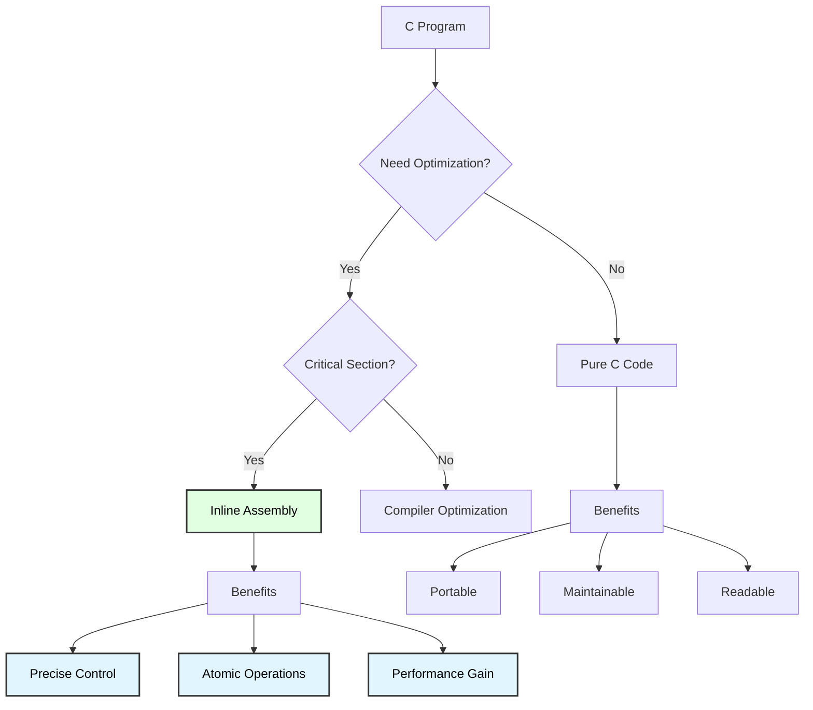
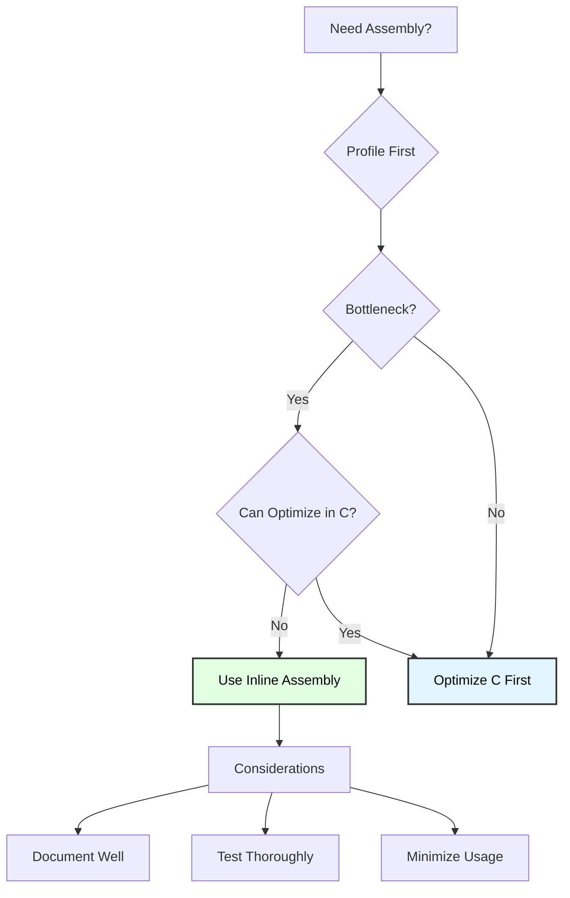

# Inline Assembly Programming
## Advanced C and Assembly Integration Techniques

**Reference**: [ATmega128 Datasheet](https://ww1.microchip.com/downloads/en/DeviceDoc/doc2467.pdf)

---

## Slide 1: Introduction to Inline Assembly

### What is Inline Assembly?
- **Assembly code embedded in C**: Mix high-level and low-level programming
- **GCC extended syntax**: `__asm__ volatile ("code" : outputs : inputs : clobbers)`
- **Direct hardware access**: Control specific CPU instructions
- **Performance optimization**: Critical sections in assembly, rest in C

### Why Use Inline Assembly?


### Inline Assembly Template
```c
__asm__ volatile (
    "instruction operands \n"    // Assembly code
    : "=r" (output_var)          // Output operands (optional)
    : "r" (input_var)            // Input operands (optional)
    : "r16", "r17"               // Clobber list (optional)
);

/*
 * volatile: Prevents compiler optimization (important!)
 * \n: Separate multiple instructions
 * Operands: %0, %1, %2 refer to outputs/inputs in order
 */
```

---

## Slide 2: Constraint Characters

### Input/Output Constraints
```c
/*
 * Output Constraints (first section):
 * =r   Write-only, any register
 * +r   Read-write, any register
 * =d   Write-only, upper registers (r16-r31)
 * =a   Write-only, r16-r23
 * =b   Write-only, r24-r31
 * =w   Write-only, r24-r31 (16-bit pairs)
 * =x   Write-only, X register (r26:r27)
 * =y   Write-only, Y register (r28:r29)
 * =z   Write-only, Z register (r30:r31)
 * =m   Write-only, memory location
 */

/*
 * Input Constraints (second section):
 * r    Any register (r0-r31)
 * d    Upper registers (r16-r31, for LDI)
 * a    r16-r23
 * b    r24-r31
 * I    6-bit constant (0-63, for I/O addresses)
 * M    8-bit constant (0-255)
 * L    Signed byte constant (-128 to 127)
 * i    Immediate integer
 * x, y, z  Specific pointer registers
 */

// Example: Add two numbers
uint8_t add_asm(uint8_t a, uint8_t b) {
    uint8_t result;
    __asm__ volatile (
        "ADD %0, %1"         // %0=result, %1=a, %2=b (implicit)
        : "=r" (result)      // Output: write to result
        : "r" (a), "0" (b)   // Inputs: a in reg, b same as output
    );
    return result;
}
```

---

## Slide 3: Basic Inline Assembly Examples

### Example 1: NOP Delay
```c
void nop_delay(uint8_t count) {
    for (uint8_t i = 0; i < count; i++) {
        __asm__ volatile ("NOP");  // 1 cycle per NOP
    }
}

// 10 NOPs = 10 cycles @ 16MHz = 625ns delay
```

### Example 2: Disable Interrupts
```c
void critical_section_start(void) {
    __asm__ volatile ("CLI");  // Clear interrupt flag (SEI to re-enable)
}

void critical_section_end(void) {
    __asm__ volatile ("SEI");  // Set interrupt flag
}

// Usage
void atomic_operation(void) {
    critical_section_start();
    // Critical code here (no interrupts)
    PORTB ^= 0xFF;
    critical_section_end();
}
```

### Example 3: Read/Write SREG
```c
uint8_t read_sreg(void) {
    uint8_t sreg;
    __asm__ volatile (
        "IN %0, __SREG__"    // Read status register
        : "=r" (sreg)
    );
    return sreg;
}

void write_sreg(uint8_t sreg) {
    __asm__ volatile (
        "OUT __SREG__, %0"   // Write status register
        :
        : "r" (sreg)
    );
}

// Save/restore interrupt state
void atomic_toggle(void) {
    uint8_t sreg = read_sreg();  // Save
    __asm__ volatile ("CLI");    // Disable
    PORTB ^= (1 << 0);           // Toggle
    write_sreg(sreg);            // Restore
}
```

---

## Slide 4: Arithmetic Operations

### Addition with Carry
```c
// 16-bit addition using two 8-bit adds with carry
uint16_t add16_asm(uint16_t a, uint16_t b) {
    uint16_t result;
    __asm__ volatile (
        "ADD %A0, %A1 \n"    // Add low bytes
        "ADC %B0, %B1 \n"    // Add high bytes with carry
        : "=r" (result)      // Output
        : "r" (a), "0" (b)   // Inputs (b in same reg as result)
    );
    return result;
}

/*
 * %A0 = low byte of operand 0
 * %B0 = high byte of operand 0
 */
```

### Multiplication (Hardware)
```c
uint16_t mul8_asm(uint8_t a, uint8_t b) {
    uint16_t result;
    __asm__ volatile (
        "MUL %1, %2 \n"      // Multiply (result in r1:r0)
        "MOVW %0, r0 \n"     // Move r1:r0 to result
        "CLR r1 \n"          // Clear r1 (compiler convention)
        : "=r" (result)
        : "r" (a), "r" (b)
        : "r0", "r1"         // Clobber: MUL uses r0:r1
    );
    return result;
}

/*
 * MUL instruction:
 * - Unsigned 8×8 = 16-bit result
 * - Result always in r1 (high) : r0 (low)
 * - 2 cycles
 * - Must clear r1 after (compiler expects it zero)
 */
```

---

## Slide 5: Bit Manipulation

### Set/Clear/Toggle Bits
```c
void set_bit_asm(volatile uint8_t *port, uint8_t bit) {
    __asm__ volatile (
        "LD r16, %a0 \n"       // Load from port address
        "ORI r16, %1 \n"       // OR with bit mask
        "ST %a0, r16 \n"       // Store back
        :
        : "z" (port), "M" (1 << bit)
        : "r16"
    );
}

void toggle_bit_asm(volatile uint8_t *port, uint8_t bit) {
    __asm__ volatile (
        "LD r16, %a0 \n"
        "LDI r17, %1 \n"
        "EOR r16, r17 \n"      // XOR (toggle)
        "ST %a0, r16 \n"
        :
        : "z" (port), "M" (1 << bit)
        : "r16", "r17"
    );
}

// Usage
toggle_bit_asm(&PORTB, 3);     // Toggle PB3
```

---

## Slide 6: Loop Optimization

### Unrolled Loop (Faster)
```c
// Standard C loop
void flash_led_c(uint8_t count) {
    for (uint8_t i = 0; i < count; i++) {
        PORTB ^= (1 << 0);
        _delay_us(10);
    }
}

// Assembly unrolled (4× faster for small counts)
void flash_led_asm(void) {
    __asm__ volatile (
        "SBI %0, 0 \n"    // LED on
        "CBI %0, 0 \n"    // LED off
        "SBI %0, 0 \n"
        "CBI %0, 0 \n"
        "SBI %0, 0 \n"
        "CBI %0, 0 \n"
        "SBI %0, 0 \n"
        "CBI %0, 0 \n"
        :
        : "I" (_SFR_IO_ADDR(PORTB))
    );
}

/*
 * Loop overhead eliminated:
 * - No counter increment
 * - No comparison
 * - No branch
 * Result: 8 instructions vs 40+ for C loop
 */
```

---

## Slide 7: Pointer Operations

### Indirect Memory Access
```c
// Write array using Z pointer
void write_array_asm(uint8_t *array, uint8_t value, uint8_t length) {
    __asm__ volatile (
        "MOVW r30, %0 \n"      // Load Z pointer (r31:r30)
        "1: \n"                // Local label
        "ST Z+, %1 \n"         // Store and post-increment
        "DEC %2 \n"            // Decrement counter
        "BRNE 1b \n"           // Branch if not zero (to label 1 backward)
        :
        : "r" ((uint16_t)array), "r" (value), "r" (length)
        : "r30", "r31"         // Clobber Z pointer
    );
}

// Usage
uint8_t buffer[10];
write_array_asm(buffer, 0xAA, 10);  // Fill with 0xAA
```

### LPM (Load Program Memory)
```c
// Read from PROGMEM using assembly
const uint8_t lookup_table[] PROGMEM = {10, 20, 30, 40, 50};

uint8_t read_progmem_asm(uint8_t index) {
    uint8_t result;
    __asm__ volatile (
        "LDI r30, lo8(%1) \n"   // Load Z low byte
        "LDI r31, hi8(%1) \n"   // Load Z high byte
        "ADD r30, %2 \n"        // Add index offset
        "ADC r31, __zero_reg__ \n"
        "LPM %0, Z \n"          // Load from program memory
        : "=r" (result)
        : "p" (lookup_table), "r" (index)
        : "r30", "r31"
    );
    return result;
}

// Usage
uint8_t value = read_progmem_asm(2);  // Returns 30
```

---

## Slide 8: Interrupt Service Routines

### Naked ISR (No Prologue/Epilogue)
```c
// Normal ISR (compiler adds context save/restore)
ISR(INT0_vect) {
    PORTB ^= (1 << 0);
}

// Naked ISR (manual context management)
ISR(INT1_vect, ISR_NAKED) {
    __asm__ volatile (
        "PUSH r16 \n"          // Save registers manually
        "IN r16, __SREG__ \n"
        "PUSH r16 \n"
        
        "SBI %0, 0 \n"         // Toggle LED (fast!)
        
        "POP r16 \n"           // Restore registers
        "OUT __SREG__, r16 \n"
        "POP r16 \n"
        "RETI \n"              // Return from interrupt
        :
        : "I" (_SFR_IO_ADDR(PORTB))
    );
}

/*
 * Naked ISR advantages:
 * - Minimal overhead (only save what you use)
 * - Faster response (critical for timing)
 * - Smaller code size
 * Warning: Must include RETI manually!
 */
```

---

## Slide 9: Atomic Operations

### Compare and Swap
```c
// Atomic test-and-set (for semaphores/locks)
uint8_t test_and_set_asm(volatile uint8_t *flag) {
    uint8_t old_value;
    __asm__ volatile (
        "CLI \n"               // Disable interrupts
        "LD %0, %a1 \n"        // Load old value
        "LDI r16, 1 \n"
        "ST %a1, r16 \n"       // Set to 1
        "SEI \n"               // Re-enable interrupts
        : "=r" (old_value)
        : "z" (flag)
        : "r16"
    );
    return old_value;  // Returns 0 if was clear, 1 if already set
}

// Usage (spinlock)
volatile uint8_t lock = 0;

void acquire_lock(void) {
    while (test_and_set_asm(&lock) != 0) {
        // Wait until lock available
    }
}

void release_lock(void) {
    lock = 0;
}
```

---

## Slide 10: Register Constraints Example

### Using Specific Registers
```c
// Force use of specific registers for optimization
void copy_array_fast(uint8_t *src, uint8_t *dst, uint8_t len) {
    __asm__ volatile (
        "MOVW r26, %0 \n"      // X = src (r27:r26)
        "MOVW r28, %1 \n"      // Y = dst (r29:r28)
        "1: \n"
        "LD r16, X+ \n"        // Load from src, post-inc
        "ST Y+, r16 \n"        // Store to dst, post-inc
        "DEC %2 \n"
        "BRNE 1b \n"
        :
        : "x" ((uint16_t)src), 
          "y" ((uint16_t)dst), 
          "r" (len)
        : "r16", "r26", "r27", "r28", "r29"
    );
}

/*
 * Constraints:
 * "x" forces X register (r26:r27)
 * "y" forces Y register (r28:r29)
 * "r" allows any register
 */
```

---

## Slide 11: Clobber Lists

### Why Clobber Lists Matter
```c
// BAD: No clobber list (undefined behavior!)
void bad_example(uint8_t value) {
    __asm__ volatile (
        "LDI r16, %0 \n"
        "OUT %1, r16 \n"
        :
        : "M" (value), "I" (_SFR_IO_ADDR(PORTB))
        // Missing: : "r16"
    );
    // Compiler doesn't know r16 was modified!
    // May reuse r16 assuming old value
}

// GOOD: Complete clobber list
void good_example(uint8_t value) {
    __asm__ volatile (
        "LDI r16, %0 \n"
        "OUT %1, r16 \n"
        :
        : "M" (value), "I" (_SFR_IO_ADDR(PORTB))
        : "r16"          // Tell compiler r16 was modified
    );
}

/*
 * Clobber list rules:
 * - List ALL modified registers (except outputs)
 * - Include "memory" if accessing memory
 * - Include "cc" if flags (SREG) modified
 */
```

### Memory Clobber
```c
void modify_memory_asm(volatile uint8_t *ptr) {
    __asm__ volatile (
        "LD r16, %a0 \n"
        "INC r16 \n"
        "ST %a0, r16 \n"
        :
        : "z" (ptr)
        : "r16", "memory"    // "memory" tells compiler memory changed
    );
}
```

---

## Slide 12: Performance Measurement

### Cycle-Accurate Timing
```c
// Measure execution cycles using Timer0
uint16_t measure_cycles_asm(void) {
    uint8_t start_low, end_low;
    
    // Start timer
    TCNT0 = 0;
    TCCR0 = (1 << CS00);  // No prescaler
    
    __asm__ volatile (
        "IN %0, %2 \n"        // Read start time
        
        // Code to measure
        "NOP \n"
        "NOP \n"
        "NOP \n"
        
        "IN %1, %2 \n"        // Read end time
        : "=r" (start_low), "=r" (end_low)
        : "I" (_SFR_IO_ADDR(TCNT0))
    );
    
    return (end_low - start_low);
}

// Result: 3 cycles (3 NOPs)
```

---

## Slide 13: Debugging Inline Assembly

### Common Errors and Solutions

| Error | Cause | Solution |
|-------|-------|----------|
| **"impossible constraint"** | Wrong register constraint | Use "r" for any, "d" for r16-r31 |
| **"operand out of range"** | Immediate too large | Use "M" for 8-bit, "I" for 6-bit |
| **Code doesn't execute** | Missing `volatile` | Always use `__asm__ volatile` |
| **Unexpected behavior** | Incomplete clobber list | List all modified registers |
| **r1 not zero** | Forgot to clear after MUL | Add `CLR r1` after MUL |
| **RETI missing** | Naked ISR without return | Add `RETI \n` at end |

### Viewing Generated Assembly
```bash
# Compile with assembly listing
avr-gcc -S -O2 main.c -o main.s

# Or view disassembly
avr-objdump -d main.elf > main.dis
```

---

## Slide 14: Best Practices

### When to Use Inline Assembly


### Guidelines

✓ **Use sparingly**: Only for critical sections  
✓ **Document extensively**: Explain what and why  
✓ **Test thoroughly**: Verify correctness and performance  
✓ **Complete clobber lists**: Tell compiler what changed  
✓ **Prefer volatile**: Prevent unwanted optimization  
✓ **Check generated code**: Use objdump to verify  
✓ **Consider alternatives**: Compiler intrinsics, attributes  

### Alternative: Compiler Intrinsics
```c
// Instead of inline assembly for NOP
#include <avr/cpufunc.h>
_NOP();  // Compiler intrinsic

// Instead of inline assembly for WDR
#include <avr/wdt.h>
wdt_reset();  // Macro that expands to asm

// Bit manipulation (may use SBI/CBI)
#include <util/atomic.h>
ATOMIC_BLOCK(ATOMIC_RESTORESTATE) {
    PORTB ^= (1 << 0);  // Atomic toggle
}
```

---

## Slide 15: Summary

### Key Concepts

✓ **Inline assembly syntax**: `__asm__ volatile ("code" : outputs : inputs : clobbers)`  
✓ **Constraints**: r (any), d (r16-r31), I (6-bit), M (8-bit), x/y/z (pointers)  
✓ **Clobber list**: Tell compiler which registers modified  
✓ **Atomic operations**: CLI/SEI for critical sections  
✓ **Performance**: Measure with timers, verify with objdump  
✓ **Best practice**: Use only when necessary, document well  

### Inline Assembly Checklist
```
☐ Added volatile keyword
☐ Newlines (\n) between instructions
☐ Output constraints use =
☐ All modified registers in clobber list
☐ Added "memory" if memory accessed
☐ Cleared r1 after MUL
☐ RETI in naked ISR
☐ Tested and profiled
☐ Documented purpose and constraints
```

---

## Slide 16: Practice Exercises

### Exercise 1: Simple Inline Assembly
**Goal**: Toggle LED using inline assembly
- Write function using SBI/CBI
- Configure DDRB inline
- Toggle PORTB bit 0
- Call from main loop

### Exercise 2: Arithmetic
**Goal**: Implement 16-bit subtraction with borrow
- Use SUB and SBC instructions
- Handle low and high bytes
- Return 16-bit result
- Test with various inputs

### Exercise 3: Bit Rotation
**Goal**: Rotate byte left using assembly
- Read PORTB value
- Rotate left (LSL + carry)
- Write back to PORTB
- Display on LEDs

### Exercise 4: Array Sum
**Goal**: Sum array using Z pointer
- Load array address to Z
- Loop through elements
- Accumulate sum
- Return result

### Exercise 5: Performance Test
**Goal**: Compare C vs assembly speed
- Implement same function in C and asm
- Use Timer0 to measure cycles
- Calculate speedup percentage
- Print results on UART

---

# End of Slides

**Questions?**

For more information, see:
- [ATmega128 Datasheet](https://ww1.microchip.com/downloads/en/DeviceDoc/doc2467.pdf) (Instruction Set: pages 321-334)
- GCC Inline Assembly Documentation
- Project source code in `Inline_Assembly/`
- `ASSEMBLY_FLOW_DIAGRAMS.md` for visual guides
