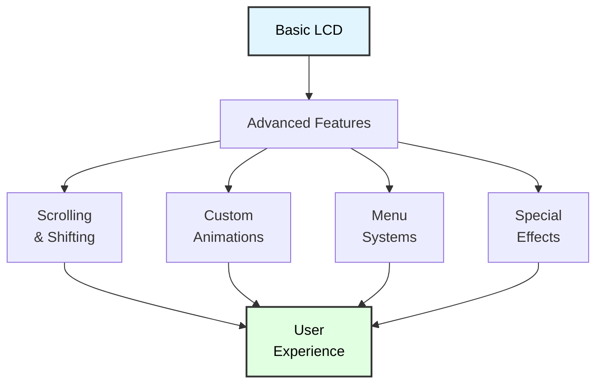
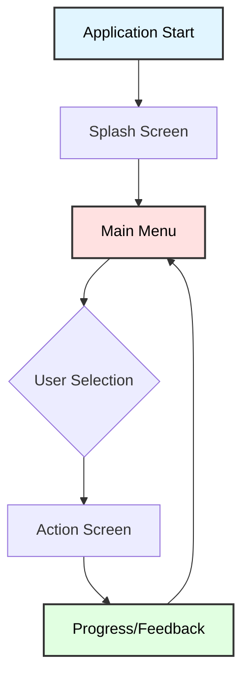

# LCD Advanced Features
## ATmega128 Embedded Systems Course

**Reference**: [ATmega128 Datasheet](https://ww1.microchip.com/downloads/en/DeviceDoc/doc2467.pdf)

---

## Slide 1: Introduction to Advanced LCD Features

### Beyond Basic LCD Control
This module builds on **LCD_Character_Basic** with:
- **Scrolling text** and marquees
- **Custom animations** and graphics
- **Multi-screen menus** and navigation
- **Special effects** (blinking, sliding)
- **Professional user interfaces**

### HD44780 Advanced Capabilities


### What We'll Cover
✓ Display shifting and scrolling  
✓ Custom character animations  
✓ Multi-page menus  
✓ Progress bars and gauges  
✓ Splash screens and transitions  
✓ Interactive interfaces  

---

## Slide 2: Display Shifting Commands

### Shift vs Cursor Movement
| Feature | Cursor Move | Display Shift |
|---------|-------------|---------------|
| **What moves** | Cursor position only | Entire display content |
| **Visible effect** | None (unless blinking) | Text slides left/right |
| **DDRAM** | Unchanged | Unchanged |
| **Use case** | Text entry | Scrolling marquee |

### Display Shift Commands
```c
// Command format: 0b00011S/C00
// S/C: 0 = Shift cursor, 1 = Shift display
// R/L: 0 = Left, 1 = Right

#define LCD_SHIFT_LEFT   0x18  // Shift entire display left
#define LCD_SHIFT_RIGHT  0x1C  // Shift entire display right

#define LCD_CURSOR_LEFT  0x10  // Move cursor left
#define LCD_CURSOR_RIGHT 0x14  // Move cursor right

void lcd_shift_left(void) {
    lcd_command(LCD_SHIFT_LEFT);
    _delay_us(40);
}

void lcd_shift_right(void) {
    lcd_command(LCD_SHIFT_RIGHT);
    _delay_us(40);
}
```

### How Display Shifting Works
```
Initial display (16 columns visible):
DDRAM: [H][e][l][l][o][ ][W][o][r][l][d][!][ ][ ][ ][ ]...
Screen: |Hello World!    |

After shift_left():
DDRAM: [H][e][l][l][o][ ][W][o][r][l][d][!][ ][ ][ ][ ]...
Screen: |ello World!     | (window shifted)

After 2× shift_left():
DDRAM: [H][e][l][l][o][ ][W][o][r][l][d][!][ ][ ][ ][ ]...
Screen: |llo World!      |
```

---

## Slide 3: Scrolling Text (Marquee)

### Simple Left-Scrolling Marquee
```c
void lcd_scroll_text_left(const char *text, uint16_t delay_ms) {
    uint8_t len = strlen(text);
    
    // Clear and write text
    lcd_clear();
    lcd_puts(text);
    _delay_ms(delay_ms * 2);
    
    // Scroll left until text disappears
    for (uint8_t i = 0; i < len + 16; i++) {
        lcd_shift_left();
        _delay_ms(delay_ms);
    }
}

// Usage
int main(void) {
    lcd_init();
    
    while (1) {
        lcd_scroll_text_left("Welcome to ATmega128!", 200);
        _delay_ms(1000);
    }
}
```

### Continuous Marquee (Infinite Loop)
```c
void lcd_marquee_continuous(const char *text) {
    uint8_t len = strlen(text);
    
    // Create padded string
    char buffer[80];
    snprintf(buffer, sizeof(buffer), "%s    ", text);  // Add spacing
    
    lcd_clear();
    
    while (1) {
        for (uint8_t i = 0; i < len + 4; i++) {
            lcd_gotoxy(0, 0);
            
            // Print substring with wrapping
            for (uint8_t j = 0; j < 16; j++) {
                uint8_t idx = (i + j) % (len + 4);
                lcd_putc(buffer[idx]);
            }
            
            _delay_ms(200);
        }
    }
}
```

---

## Slide 4: Bouncing Text Animation

### Text Bouncing Left and Right
```c
void lcd_bounce_text(const char *text, uint8_t bounces) {
    uint8_t len = strlen(text);
    
    if (len >= 16) {
        // Text too long to bounce
        lcd_puts(text);
        return;
    }
    
    lcd_clear();
    lcd_puts(text);
    _delay_ms(500);
    
    uint8_t shift_amount = 16 - len;
    
    for (uint8_t b = 0; b < bounces; b++) {
        // Bounce right
        for (uint8_t i = 0; i < shift_amount; i++) {
            lcd_shift_right();
            _delay_ms(100);
        }
        
        _delay_ms(300);
        
        // Bounce left
        for (uint8_t i = 0; i < shift_amount; i++) {
            lcd_shift_left();
            _delay_ms(100);
        }
        
        _delay_ms(300);
    }
}

// Usage
lcd_bounce_text("Hello!", 3);  // Bounce 3 times
```

---

## Slide 5: Custom Character Animations

### Animated Spinner
```c
// Spinner frames (rotating bar)
const uint8_t spinner[8][8] PROGMEM = {
    {0x00,0x00,0x00,0x1F,0x00,0x00,0x00,0x00},  // —
    {0x00,0x00,0x0E,0x00,0x00,0x00,0x00,0x00},  // ╱
    {0x04,0x04,0x04,0x04,0x04,0x04,0x04,0x04},  // │
    {0x00,0x00,0x00,0x00,0x1C,0x00,0x00,0x00},  // ╲
};

void lcd_create_spinner(uint8_t frame) {
    // Load spinner frame into CGRAM slot 0
    uint8_t pattern[8];
    
    for (uint8_t i = 0; i < 8; i++) {
        pattern[i] = pgm_read_byte(&spinner[frame % 4][i]);
    }
    
    lcd_create_char(0, pattern);
}

void lcd_show_spinner(uint8_t x, uint8_t y, uint16_t duration_ms) {
    uint32_t start = millis();
    uint8_t frame = 0;
    
    while (millis() - start < duration_ms) {
        lcd_create_spinner(frame);
        lcd_gotoxy(x, y);
        lcd_putc(0);  // Display custom char 0
        
        frame++;
        _delay_ms(100);
    }
}

// Usage
lcd_gotoxy(0, 0);
lcd_puts("Loading");
lcd_show_spinner(8, 0, 3000);  // Spin for 3 seconds
```

### Walking Character
```c
// Simple stick figure walking animation (2 frames)
const uint8_t walk[2][8] PROGMEM = {
    // Frame 0: left leg forward
    {
        0b00100,  //   █
        0b00100,  //   █
        0b01110,  //  ███
        0b10101,  // █ █ █
        0b00100,  //   █
        0b01010,  //  █ █
        0b10001,  // █   █
        0b00000
    },
    // Frame 1: right leg forward
    {
        0b00100,  //   █
        0b00100,  //   █
        0b01110,  //  ███
        0b10101,  // █ █ █
        0b00100,  //   █
        0b01010,  //  █ █
        0b10001,  // █   █
        0b00000
    }
};

void animate_walking(uint8_t position, uint8_t steps) {
    uint8_t pattern[8];
    
    for (uint8_t s = 0; s < steps; s++) {
        for (uint8_t frame = 0; frame < 2; frame++) {
            // Load animation frame
            for (uint8_t i = 0; i < 8; i++) {
                pattern[i] = pgm_read_byte(&walk[frame][i]);
            }
            lcd_create_char(0, pattern);
            
            // Display at current position
            lcd_gotoxy(position + s, 0);
            lcd_putc(0);
            
            _delay_ms(200);
        }
    }
}
```

---

## Slide 6: Progress Bar

### Horizontal Progress Bar
```c
// Custom characters for progress bar
const uint8_t progress_chars[5][8] PROGMEM = {
    {0x00,0x00,0x00,0x00,0x00,0x00,0x00,0x00},  // Empty
    {0x10,0x10,0x10,0x10,0x10,0x10,0x10,0x10},  // 1/5
    {0x18,0x18,0x18,0x18,0x18,0x18,0x18,0x18},  // 2/5
    {0x1C,0x1C,0x1C,0x1C,0x1C,0x1C,0x1C,0x1C},  // 3/5
    {0x1E,0x1E,0x1E,0x1E,0x1E,0x1E,0x1E,0x1E},  // 4/5
    {0x1F,0x1F,0x1F,0x1F,0x1F,0x1F,0x1F,0x1F},  // Full
};

void lcd_init_progressbar(void) {
    // Load progress characters into CGRAM
    uint8_t pattern[8];
    
    for (uint8_t ch = 0; ch < 5; ch++) {
        for (uint8_t i = 0; i < 8; i++) {
            pattern[i] = pgm_read_byte(&progress_chars[ch][i]);
        }
        lcd_create_char(ch, pattern);
    }
}

void lcd_progressbar(uint8_t x, uint8_t y, uint8_t width, uint8_t percent) {
    // Percent: 0-100
    if (percent > 100) percent = 100;
    
    // Calculate filled pixels (each char = 5 pixels wide)
    uint16_t total_pixels = (uint16_t)width * 5;
    uint16_t filled_pixels = (total_pixels * percent) / 100;
    
    lcd_gotoxy(x, y);
    
    for (uint8_t i = 0; i < width; i++) {
        uint16_t char_pixels = filled_pixels > 5 ? 5 : filled_pixels;
        
        if (char_pixels == 0) {
            lcd_putc(0);  // Empty
        } else if (char_pixels == 5) {
            lcd_putc(4);  // Full
        } else {
            lcd_putc(char_pixels);  // Partial
        }
        
        if (filled_pixels >= 5) {
            filled_pixels -= 5;
        } else {
            filled_pixels = 0;
        }
    }
}

// Example usage
int main(void) {
    lcd_init();
    lcd_init_progressbar();
    
    lcd_gotoxy(0, 0);
    lcd_puts("Progress:");
    
    for (uint8_t i = 0; i <= 100; i++) {
        lcd_progressbar(0, 1, 16, i);
        _delay_ms(50);
    }
}
```

---

## Slide 7: Multi-Page Menu System

### Menu Structure
```c
typedef struct {
    const char *title;
    void (*action)(void);
} menu_item_t;

typedef struct {
    const char *name;
    const menu_item_t *items;
    uint8_t item_count;
} menu_page_t;

// Menu actions
void menu_action_1(void) {
    lcd_clear();
    lcd_puts("Action 1");
    _delay_ms(2000);
}

void menu_action_2(void) {
    lcd_clear();
    lcd_puts("Action 2");
    _delay_ms(2000);
}

void menu_action_3(void) {
    lcd_clear();
    lcd_puts("Action 3");
    _delay_ms(2000);
}

// Define menu items
const menu_item_t main_menu_items[] = {
    {"1. Start", menu_action_1},
    {"2. Settings", menu_action_2},
    {"3. About", menu_action_3},
    {"4. Exit", NULL}
};

const menu_page_t main_menu = {
    .name = "Main Menu",
    .items = main_menu_items,
    .item_count = 4
};
```

### Menu Navigation
```c
void display_menu(const menu_page_t *menu, uint8_t selected) {
    lcd_clear();
    
    // Show menu title
    lcd_gotoxy(0, 0);
    lcd_puts(menu->name);
    
    // Show current and next item
    lcd_gotoxy(0, 1);
    lcd_putc('>');
    lcd_puts(menu->items[selected].title);
}

void menu_navigate(const menu_page_t *menu) {
    uint8_t selected = 0;
    
    display_menu(menu, selected);
    
    while (1) {
        // Read buttons (assuming button functions exist)
        if (button_up_pressed()) {
            if (selected > 0) {
                selected--;
                display_menu(menu, selected);
            }
            _delay_ms(200);
        }
        
        if (button_down_pressed()) {
            if (selected < menu->item_count - 1) {
                selected++;
                display_menu(menu, selected);
            }
            _delay_ms(200);
        }
        
        if (button_select_pressed()) {
            // Execute action
            if (menu->items[selected].action != NULL) {
                menu->items[selected].action();
                display_menu(menu, selected);
            } else {
                // Exit menu
                break;
            }
            _delay_ms(200);
        }
    }
}
```

---

## Slide 8: Sliding Transitions

### Slide In From Right
```c
void lcd_slide_in_right(const char *text) {
    uint8_t len = strlen(text);
    
    // Start with text off-screen to the right
    lcd_clear();
    
    for (int8_t pos = 16; pos >= 0; pos--) {
        lcd_gotoxy(0, 0);
        
        // Print spaces, then text
        for (uint8_t i = 0; i < 16; i++) {
            if (i < pos) {
                lcd_putc(' ');
            } else if (i - pos < len) {
                lcd_putc(text[i - pos]);
            } else {
                lcd_putc(' ');
            }
        }
        
        _delay_ms(50);
    }
}

// Slide out to left
void lcd_slide_out_left(void) {
    for (uint8_t i = 0; i < 16; i++) {
        lcd_shift_left();
        _delay_ms(50);
    }
}

// Combined transition
void lcd_transition_slide(const char *old_text, const char *new_text) {
    // Show old text
    lcd_clear();
    lcd_puts(old_text);
    _delay_ms(1000);
    
    // Slide old out
    lcd_slide_out_left();
    
    // Slide new in
    lcd_slide_in_right(new_text);
    _delay_ms(1000);
}
```

---

## Slide 9: Blinking Text Effect

### Software Blinking (Controlled)
```c
void lcd_blink_text(const char *text, uint8_t x, uint8_t y, uint8_t times) {
    for (uint8_t i = 0; i < times; i++) {
        // Show text
        lcd_gotoxy(x, y);
        lcd_puts(text);
        _delay_ms(500);
        
        // Clear text (overwrite with spaces)
        lcd_gotoxy(x, y);
        for (uint8_t j = 0; j < strlen(text); j++) {
            lcd_putc(' ');
        }
        _delay_ms(500);
    }
    
    // Show text finally
    lcd_gotoxy(x, y);
    lcd_puts(text);
}

// Blink with custom timing
void lcd_blink_custom(const char *text, uint8_t x, uint8_t y, 
                      uint16_t on_ms, uint16_t off_ms, uint8_t times) {
    for (uint8_t i = 0; i < times; i++) {
        lcd_gotoxy(x, y);
        lcd_puts(text);
        _delay_ms(on_ms);
        
        lcd_gotoxy(x, y);
        for (uint8_t j = 0; j < strlen(text); j++) {
            lcd_putc(' ');
        }
        _delay_ms(off_ms);
    }
}
```

### Hardware Cursor Blink
```c
// Enable cursor blink using LCD command
void lcd_cursor_blink_on(void) {
    // Display ON, Cursor ON, Blink ON
    lcd_command(0x0F);
}

void lcd_cursor_blink_off(void) {
    // Display ON, Cursor OFF, Blink OFF
    lcd_command(0x0C);
}

// Usage for attention-getting input
void get_input_with_blink(void) {
    lcd_clear();
    lcd_puts("Enter value:");
    lcd_gotoxy(0, 1);
    
    lcd_cursor_blink_on();
    
    // Get input...
    char input = wait_for_key();
    lcd_putc(input);
    
    lcd_cursor_blink_off();
}
```

---

## Slide 10: Splash Screen

### Professional Startup Display
```c
void show_splash_screen(void) {
    lcd_clear();
    
    // Line 1: Project name
    lcd_gotoxy(0, 0);
    lcd_puts("  ATmega128  ");
    
    // Line 2: Version
    lcd_gotoxy(0, 1);
    lcd_puts("   v1.0.0   ");
    
    _delay_ms(2000);
    
    // Fade out effect (simulate with clear)
    for (uint8_t i = 0; i < 3; i++) {
        lcd_clear();
        _delay_ms(100);
        
        lcd_gotoxy(0, 0);
        lcd_puts("  ATmega128  ");
        lcd_gotoxy(0, 1);
        lcd_puts("   v1.0.0   ");
        _delay_ms(100);
    }
    
    lcd_clear();
}

// Splash with progress bar
void splash_with_progress(void) {
    lcd_init_progressbar();
    
    lcd_clear();
    lcd_gotoxy(0, 0);
    lcd_puts("Initializing...");
    
    for (uint8_t i = 0; i <= 100; i += 5) {
        lcd_progressbar(0, 1, 16, i);
        _delay_ms(50);
    }
    
    _delay_ms(500);
    lcd_clear();
}
```

---

## Slide 11: Vertical Scrolling (Multi-Line)

### Scroll Text Up (Line by Line)
```c
void lcd_scroll_up(const char *line1, const char *line2, const char *new_line) {
    // Shift line 2 to line 1
    lcd_gotoxy(0, 0);
    lcd_puts(line2);
    
    // Add new line at line 2
    lcd_gotoxy(0, 1);
    lcd_puts(new_line);
    
    _delay_ms(500);
}

// Scroll through message array
void show_scrolling_messages(const char *messages[], uint8_t count) {
    if (count < 2) return;
    
    // Show first two lines
    lcd_clear();
    lcd_gotoxy(0, 0);
    lcd_puts(messages[0]);
    lcd_gotoxy(0, 1);
    lcd_puts(messages[1]);
    _delay_ms(2000);
    
    // Scroll through rest
    for (uint8_t i = 2; i < count; i++) {
        lcd_scroll_up(messages[i-2], messages[i-1], messages[i]);
        _delay_ms(1500);
    }
}

// Usage
const char *news[] = {
    "Breaking News",
    "ATmega128 rocks!",
    "LCD is awesome",
    "Learning is fun"
};

show_scrolling_messages(news, 4);
```

---

## Slide 12: Real-Time Clock Display

### Animated Clock
```c
void display_clock_animated(uint8_t hours, uint8_t minutes, uint8_t seconds) {
    static uint8_t last_seconds = 0;
    
    // Only update when seconds change
    if (seconds != last_seconds) {
        lcd_gotoxy(4, 0);
        printf("%02d:%02d:%02d", hours, minutes, seconds);
        
        // Blinking colon effect
        if (seconds % 2 == 0) {
            lcd_gotoxy(6, 0);
            lcd_putc(' ');
            lcd_gotoxy(9, 0);
            lcd_putc(' ');
        } else {
            lcd_gotoxy(6, 0);
            lcd_putc(':');
            lcd_gotoxy(9, 0);
            lcd_putc(':');
        }
        
        last_seconds = seconds;
    }
}

// Clock with progress bar for seconds
void clock_with_progress(uint8_t hours, uint8_t minutes, uint8_t seconds) {
    lcd_gotoxy(0, 0);
    printf("Time: %02d:%02d:%02d", hours, minutes, seconds);
    
    // Progress bar shows seconds (0-59 mapped to 0-100%)
    uint8_t percent = (seconds * 100) / 59;
    lcd_progressbar(0, 1, 16, percent);
}
```

---

## Slide 13: Bar Graph Display

### Vertical Bar Graph
```c
// Custom characters for bar graph (8 levels)
const uint8_t bar_levels[8][8] PROGMEM = {
    {0x00,0x00,0x00,0x00,0x00,0x00,0x00,0x1F},  // Level 1
    {0x00,0x00,0x00,0x00,0x00,0x00,0x1F,0x1F},  // Level 2
    {0x00,0x00,0x00,0x00,0x00,0x1F,0x1F,0x1F},  // Level 3
    {0x00,0x00,0x00,0x00,0x1F,0x1F,0x1F,0x1F},  // Level 4
    {0x00,0x00,0x00,0x1F,0x1F,0x1F,0x1F,0x1F},  // Level 5
    {0x00,0x00,0x1F,0x1F,0x1F,0x1F,0x1F,0x1F},  // Level 6
    {0x00,0x1F,0x1F,0x1F,0x1F,0x1F,0x1F,0x1F},  // Level 7
    {0x1F,0x1F,0x1F,0x1F,0x1F,0x1F,0x1F,0x1F},  // Level 8
};

void lcd_init_bargraph(void) {
    uint8_t pattern[8];
    
    for (uint8_t ch = 0; ch < 8; ch++) {
        for (uint8_t i = 0; i < 8; i++) {
            pattern[i] = pgm_read_byte(&bar_levels[ch][i]);
        }
        lcd_create_char(ch, pattern);
    }
}

void lcd_bargraph(uint8_t x, uint8_t y, uint8_t value) {
    // Value: 0-16 (2 rows × 8 levels)
    if (value > 16) value = 16;
    
    lcd_gotoxy(x, y);
    
    if (value >= 8) {
        lcd_putc(7);  // Full
    } else if (value > 0) {
        lcd_putc(value - 1);
    } else {
        lcd_putc(' ');
    }
    
    lcd_gotoxy(x, y + 1);
    
    if (value > 8) {
        lcd_putc(value - 9);
    } else {
        lcd_putc(' ');
    }
}

// Example: Display multiple values
void display_sensor_bars(uint8_t temp, uint8_t humidity, uint8_t light) {
    lcd_init_bargraph();
    
    lcd_gotoxy(0, 0);
    lcd_puts("T  H  L");
    
    lcd_bargraph(0, 1, temp / 6);       // 0-100 → 0-16
    lcd_bargraph(3, 1, humidity / 6);
    lcd_bargraph(6, 1, light / 6);
}
```

---

## Slide 14: Icon-Based Display

### Custom Icons
```c
// Define icons as custom characters
const uint8_t icon_battery_full[8] PROGMEM = {
    0b01110,
    0b11111,
    0b11111,
    0b11111,
    0b11111,
    0b11111,
    0b11111,
    0b00000
};

const uint8_t icon_battery_low[8] PROGMEM = {
    0b01110,
    0b10001,
    0b10001,
    0b10001,
    0b10001,
    0b11111,
    0b11111,
    0b00000
};

const uint8_t icon_thermometer[8] PROGMEM = {
    0b00100,
    0b01010,
    0b01010,
    0b01010,
    0b01010,
    0b10001,
    0b10001,
    0b01110
};

const uint8_t icon_water[8] PROGMEM = {
    0b00100,
    0b01010,
    0b10001,
    0b10001,
    0b10001,
    0b10001,
    0b01110,
    0b00000
};

#define ICON_BATTERY_FULL  0
#define ICON_BATTERY_LOW   1
#define ICON_THERMOMETER   2
#define ICON_WATER         3

void lcd_load_icons(void) {
    lcd_create_char(ICON_BATTERY_FULL, icon_battery_full);
    lcd_create_char(ICON_BATTERY_LOW, icon_battery_low);
    lcd_create_char(ICON_THERMOMETER, icon_thermometer);
    lcd_create_char(ICON_WATER, icon_water);
}

void display_status_icons(uint8_t battery_level, int8_t temperature, uint8_t humidity) {
    lcd_load_icons();
    
    lcd_clear();
    
    // Battery icon
    lcd_gotoxy(0, 0);
    if (battery_level > 20) {
        lcd_putc(ICON_BATTERY_FULL);
    } else {
        lcd_putc(ICON_BATTERY_LOW);
    }
    printf(" %d%%", battery_level);
    
    // Temperature icon
    lcd_gotoxy(0, 1);
    lcd_putc(ICON_THERMOMETER);
    printf(" %d C", temperature);
    
    // Humidity icon
    lcd_gotoxy(9, 1);
    lcd_putc(ICON_WATER);
    printf(" %d%%", humidity);
}
```

---

## Slide 15: Text Entry System

### Simple Character Entry
```c
char lcd_text_entry(uint8_t max_length) {
    char buffer[17];
    uint8_t index = 0;
    
    lcd_clear();
    lcd_puts("Enter text:");
    lcd_gotoxy(0, 1);
    lcd_cursor_blink_on();
    
    while (index < max_length) {
        char key = keypad_get_key();  // Assuming keypad
        
        if (key >= '0' && key <= '9') {
            buffer[index++] = key;
            lcd_putc(key);
            
        } else if (key == '*' && index > 0) {
            // Backspace
            index--;
            lcd_gotoxy(index, 1);
            lcd_putc(' ');
            lcd_gotoxy(index, 1);
            
        } else if (key == '#') {
            // Enter
            break;
        }
    }
    
    buffer[index] = '\0';
    lcd_cursor_blink_off();
    
    return buffer;
}
```

---

## Slide 16: Summary

### Advanced LCD Techniques Covered

✓ **Display shifting** for scrolling effects  
✓ **Custom animations** with CGRAM characters  
✓ **Progress bars** and visual feedback  
✓ **Multi-page menus** with navigation  
✓ **Sliding transitions** between screens  
✓ **Blinking effects** for attention  
✓ **Splash screens** and branding  
✓ **Bar graphs** for data visualization  
✓ **Icon-based** interfaces  

### Best Practices
- **Plan screen layouts** before coding
- **Use consistent timing** for animations
- **Limit custom characters** to 8 at a time
- **Provide visual feedback** for user actions
- **Test readability** in target environment
- **Optimize refresh rate** to avoid flicker

### Common Patterns


---

## Slide 17: Practice Exercises

### Exercise 1: Scrolling Marquee
**Goal**: Create smooth scrolling text
- Display long message on LCD
- Scroll continuously left
- Add spacing between loops
- Implement pause when button pressed

### Exercise 2: Loading Screen
**Goal**: Professional loading animation
- Show "Loading..." text
- Animated spinner
- Progress bar 0-100%
- Transition to main screen

### Exercise 3: Multi-Level Menu
**Goal**: Navigate nested menus
- Main menu with 4 items
- Each item has submenu
- Use buttons for navigation
- Show path (breadcrumb)

### Exercise 4: Data Dashboard
**Goal**: Display multiple sensors
- Show temperature, humidity, light
- Use icons and bar graphs
- Update values in real-time
- Add visual alerts for thresholds

### Exercise 5: Custom Animation
**Goal**: Create your own animation
- Design 4+ custom characters
- Animate in sequence
- Add smooth transitions
- Make it loop continuously

---

## Slide 18: Additional Resources

### ATmega128 Documentation
- **[Official Datasheet (PDF)](https://ww1.microchip.com/downloads/en/DeviceDoc/doc2467.pdf)**
  - Section 22: I/O Ports
  - Timing specifications

### HD44780 LCD Resources
- HD44780 controller datasheet
- CGRAM and DDRAM mapping
- Command reference
- Timing diagrams

### Design Resources
- LCD character generator tools
- Icon libraries
- Animation planning tools
- User interface design patterns

---

# End of Slides

**Questions?**

For more information, see:
- [ATmega128 Datasheet](https://ww1.microchip.com/downloads/en/DeviceDoc/doc2467.pdf)
- Project source code in `LCD_Advanced_Features/`
- Shared libraries: `_lcd.h`, `_lcd.c`
