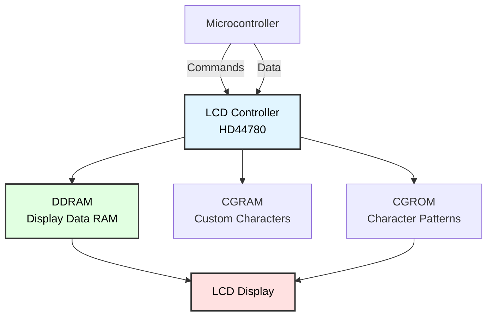
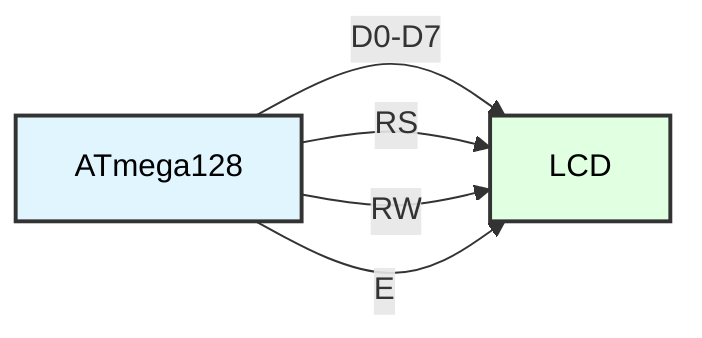
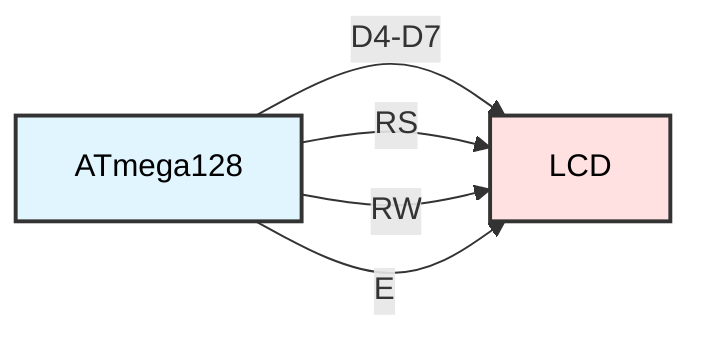

# LCD Character Display Programming
## ATmega128 Embedded Systems Course

**Reference**: [ATmega128 Datasheet](https://ww1.microchip.com/downloads/en/DeviceDoc/doc2467.pdf)

---

## Slide 1: Introduction to Character LCDs

### What is a Character LCD?
- **Alphanumeric display** module (16x2, 20x4 common sizes)
- **HD44780** controller (industry standard)
- Displays **ASCII characters** and **custom symbols**
- Built-in **character generator ROM** (CGROM)
- Programmable **custom characters** (CGRAM)

### Common LCD Sizes
| Size | Columns | Rows | Total Characters |
|------|---------|------|------------------|
| **16x2** | 16 | 2 | 32 |
| **16x4** | 16 | 4 | 64 |
| **20x2** | 20 | 2 | 40 |
| **20x4** | 20 | 4 | 80 |

### Applications
✓ **User interfaces** - Menus, settings  
✓ **Sensor displays** - Temperature, voltage  
✓ **Status indicators** - System state, errors  
✓ **Data logging** - Real-time values  
✓ **Calculators** - Input/output display  

---

## Slide 2: HD44780 LCD Controller

### Architecture Overview


### Memory Organization
- **DDRAM**: Display Data RAM (80 bytes)
  - Stores characters to display
  - Address maps to screen position
  
- **CGROM**: Character Generator ROM (fixed)
  - 208 5x8 dot patterns
  - Standard ASCII + Japanese characters
  
- **CGRAM**: Character Generator RAM (64 bytes)
  - 8 custom 5x8 characters
  - User-programmable

---

## Slide 3: LCD Pin Configuration

### 16-Pin LCD Interface
| Pin | Symbol | Function | Direction |
|-----|--------|----------|-----------|
| 1 | VSS | Ground | - |
| 2 | VDD | +5V Power | - |
| 3 | V0 | Contrast | - (pot) |
| 4 | RS | Register Select | Input |
| 5 | R/W | Read/Write | Input |
| 6 | E | Enable | Input |
| 7-14 | D0-D7 | Data Bus | I/O |
| 15 | A (LED+) | Backlight + | - |
| 16 | K (LED-) | Backlight - | - |

### Signal Functions
```
RS = 0: Instruction register (commands)
RS = 1: Data register (characters)

R/W = 0: Write to LCD
R/W = 1: Read from LCD

E: Enable signal (falling edge latches data)
```

---

## Slide 4: 4-Bit vs 8-Bit Mode

### 8-Bit Mode


- **11 I/O pins** total (8 data + 3 control)
- **Faster** communication
- **Simple** - one transaction per byte

### 4-Bit Mode (Recommended)


- **7 I/O pins** (4 data + 3 control)
- **Saves pins** (critical for small MCUs)
- **Slightly slower** - two nibbles per byte
- **Industry standard** for embedded systems

---

## Slide 5: LCD Initialization Sequence

### Power-On Timing

```mermaid
gantt
    title LCD Initialization Timeline
    dateFormat X
    axisFormat %L ms
    
    section Power
    VDD rises        :0, 15
    
    section Wait
    Power stabilize  :15, 40
    
    section Init
    Function Set 1   :40, 5
    Wait 4.1ms       :45, 5
    Function Set 2   :50, 1
    Wait 100us       :51, 1
    Function Set 3   :52, 1
    Configuration    :53, 5
```


### Initialization Code (4-bit)
```c
#include <avr/io.h>
#include <util/delay.h>

// LCD connections
#define LCD_RS  PA0
#define LCD_RW  PA1
#define LCD_E   PA2
#define LCD_D4  PA4
#define LCD_D5  PA5
#define LCD_D6  PA6
#define LCD_D7  PA7

#define LCD_DATA_PORT  PORTA
#define LCD_CTRL_PORT  PORTA
#define LCD_DATA_DDR   DDRA
#define LCD_CTRL_DDR   DDRA

void lcd_init(void) {
    // Configure pins as outputs
    LCD_DATA_DDR |= (1 << LCD_D4) | (1 << LCD_D5) | 
                    (1 << LCD_D6) | (1 << LCD_D7);
    LCD_CTRL_DDR |= (1 << LCD_RS) | (1 << LCD_RW) | (1 << LCD_E);
    
    // Wait for LCD to power up
    _delay_ms(50);
    
    // Initialize to 4-bit mode (special sequence)
    lcd_write_nibble(0x03);
    _delay_ms(5);
    
    lcd_write_nibble(0x03);
    _delay_us(150);
    
    lcd_write_nibble(0x03);
    lcd_write_nibble(0x02);  // Switch to 4-bit mode
    
    // Function Set: 4-bit, 2 lines, 5x8 font
    lcd_command(0x28);
    
    // Display ON, cursor OFF, blink OFF
    lcd_command(0x0C);
    
    // Clear display
    lcd_command(0x01);
    _delay_ms(2);
    
    // Entry mode: increment, no shift
    lcd_command(0x06);
}
```

---

## Slide 6: Low-Level LCD Functions

### Enable Pulse
```c
void lcd_enable_pulse(void) {
    LCD_CTRL_PORT |= (1 << LCD_E);   // E = 1
    _delay_us(1);                     // Minimum 450ns
    LCD_CTRL_PORT &= ~(1 << LCD_E);  // E = 0
    _delay_us(50);                    // Command execution time
}

void lcd_write_nibble(uint8_t nibble) {
    // Clear data pins
    LCD_DATA_PORT &= 0x0F;
    
    // Write nibble to D4-D7
    LCD_DATA_PORT |= (nibble << 4);
    
    // Pulse enable
    lcd_enable_pulse();
}

void lcd_write_byte(uint8_t byte) {
    // Send high nibble first
    lcd_write_nibble(byte >> 4);
    
    // Then low nibble
    lcd_write_nibble(byte & 0x0F);
}
```

### Command vs Data
```c
void lcd_command(uint8_t cmd) {
    LCD_CTRL_PORT &= ~(1 << LCD_RS);  // RS = 0 (command)
    LCD_CTRL_PORT &= ~(1 << LCD_RW);  // RW = 0 (write)
    
    lcd_write_byte(cmd);
}

void lcd_data(uint8_t data) {
    LCD_CTRL_PORT |= (1 << LCD_RS);   // RS = 1 (data)
    LCD_CTRL_PORT &= ~(1 << LCD_RW);  // RW = 0 (write)
    
    lcd_write_byte(data);
}
```

---

## Slide 7: LCD Commands Reference

### Common Commands
| Command | Hex Code | Function |
|---------|----------|----------|
| **Clear Display** | 0x01 | Clear screen, home cursor |
| **Return Home** | 0x02 | Cursor to (0,0) |
| **Entry Mode** | 0x04-0x07 | Cursor direction |
| **Display Control** | 0x08-0x0F | Display/cursor ON/OFF |
| **Cursor Shift** | 0x10-0x1F | Move cursor/display |
| **Function Set** | 0x20-0x3F | Interface/lines/font |
| **Set CGRAM** | 0x40-0x7F | Custom character address |
| **Set DDRAM** | 0x80-0xFF | Display position |

### Entry Mode (0x04 + options)
```c
#define LCD_ENTRY_INC       0x02  // Increment cursor
#define LCD_ENTRY_DEC       0x00  // Decrement cursor
#define LCD_ENTRY_SHIFT     0x01  // Shift display

// Example: Increment cursor, no shift
lcd_command(0x04 | LCD_ENTRY_INC);
```

### Display Control (0x08 + options)
```c
#define LCD_DISPLAY_ON      0x04
#define LCD_DISPLAY_OFF     0x00
#define LCD_CURSOR_ON       0x02
#define LCD_CURSOR_OFF      0x00
#define LCD_BLINK_ON        0x01
#define LCD_BLINK_OFF       0x00

// Example: Display ON, cursor ON, blink ON
lcd_command(0x08 | LCD_DISPLAY_ON | LCD_CURSOR_ON | LCD_BLINK_ON);
```

---

## Slide 8: Text Display Functions

### Basic Text Output
```c
void lcd_putc(char c) {
    lcd_data(c);
}

void lcd_puts(const char *str) {
    while (*str) {
        lcd_putc(*str++);
    }
}

void lcd_clear(void) {
    lcd_command(0x01);
    _delay_ms(2);  // Clear command is slow
}

void lcd_home(void) {
    lcd_command(0x02);
    _delay_ms(2);
}
```

### Example Usage
```c
int main(void) {
    lcd_init();
    
    lcd_puts("Hello, World!");
    
    while (1) {
        // Display stays on
    }
}
```

---

## Slide 9: Cursor Positioning

### DDRAM Address Mapping (16x2 LCD)
```
Row 0: 0x00 - 0x0F  (positions 0-15)
Row 1: 0x40 - 0x4F  (positions 16-31)

Visual:     0  1  2  3  4  5  6  7  8  9 10 11 12 13 14 15
Row 0:     00 01 02 03 04 05 06 07 08 09 0A 0B 0C 0D 0E 0F
Row 1:     40 41 42 43 44 45 46 47 48 49 4A 4B 4C 4D 4E 4F
```

### DDRAM Address Mapping (20x4 LCD)
```
Row 0: 0x00 - 0x13  (positions 0-19)
Row 1: 0x40 - 0x53  (positions 20-39)
Row 2: 0x14 - 0x27  (positions 40-59)
Row 3: 0x54 - 0x67  (positions 60-79)
```

### Positioning Functions
```c
void lcd_gotoxy(uint8_t x, uint8_t y) {
    uint8_t address;
    
    // Calculate DDRAM address
    switch (y) {
        case 0:  address = 0x00 + x; break;
        case 1:  address = 0x40 + x; break;
        case 2:  address = 0x14 + x; break;  // For 20x4
        case 3:  address = 0x54 + x; break;  // For 20x4
        default: address = 0x00;     break;
    }
    
    // Set DDRAM address (command 0x80 + address)
    lcd_command(0x80 | address);
}

// Example: Write to specific position
void example(void) {
    lcd_gotoxy(5, 0);   // Column 5, Row 0
    lcd_puts("Hello");
    
    lcd_gotoxy(0, 1);   // Column 0, Row 1
    lcd_puts("World!");
}
```

---

## Slide 10: Formatted Output with printf

### Using printf with LCD
```c
#include <stdio.h>

// Custom putc for printf redirection
int lcd_putchar(char c, FILE *stream) {
    lcd_data(c);
    return 0;
}

// Create FILE stream
FILE lcd_stream = FDEV_SETUP_STREAM(lcd_putchar, NULL, _FDEV_SETUP_WRITE);

void lcd_printf_init(void) {
    stdout = &lcd_stream;  // Redirect stdout to LCD
}

// Example usage
int main(void) {
    lcd_init();
    lcd_printf_init();
    
    int temperature = 25;
    float voltage = 3.14;
    
    lcd_clear();
    printf("Temp: %d C", temperature);
    
    lcd_gotoxy(0, 1);
    printf("V: %.2f V", voltage);
    
    while (1);
}
```

### sprintf Alternative
```c
#include <stdio.h>

void display_sensor(uint16_t adc_value) {
    char buffer[17];  // 16 chars + null
    
    float voltage = (adc_value * 5.0) / 1024.0;
    
    sprintf(buffer, "ADC: %4d", adc_value);
    lcd_gotoxy(0, 0);
    lcd_puts(buffer);
    
    sprintf(buffer, "V: %.3f V", voltage);
    lcd_gotoxy(0, 1);
    lcd_puts(buffer);
}
```

---

## Slide 11: Custom Characters

### Character Structure (5x8)
```
Each character is 8 rows of 5 pixels
Only lower 5 bits used per row

Example: Heart symbol
Row  Binary    Hex
0    00000    0x00
1    01010    0x0A
2    11111    0x1F
3    11111    0x1F
4    11111    0x1F
5    01110    0x0E
6    00100    0x04
7    00000    0x00
```

### Creating Custom Characters
```c
// Define custom character patterns
const uint8_t custom_chars[][8] = {
    // Character 0: Heart
    {0x00, 0x0A, 0x1F, 0x1F, 0x1F, 0x0E, 0x04, 0x00},
    
    // Character 1: Degree symbol
    {0x06, 0x09, 0x09, 0x06, 0x00, 0x00, 0x00, 0x00},
    
    // Character 2: Battery full
    {0x0E, 0x1F, 0x1F, 0x1F, 0x1F, 0x1F, 0x1F, 0x1F},
    
    // Character 3: Battery half
    {0x0E, 0x1B, 0x11, 0x11, 0x1F, 0x1F, 0x1F, 0x1F},
    
    // Character 4: Battery empty
    {0x0E, 0x1B, 0x11, 0x11, 0x11, 0x11, 0x11, 0x1F},
    
    // Character 5: Arrow up
    {0x04, 0x0E, 0x15, 0x04, 0x04, 0x04, 0x04, 0x00},
    
    // Character 6: Arrow down
    {0x04, 0x04, 0x04, 0x04, 0x15, 0x0E, 0x04, 0x00},
    
    // Character 7: Bell
    {0x04, 0x0E, 0x0E, 0x0E, 0x1F, 0x00, 0x04, 0x00}
};

void lcd_load_custom_chars(void) {
    uint8_t i, j;
    
    for (i = 0; i < 8; i++) {
        // Set CGRAM address (0x40 + character*8)
        lcd_command(0x40 + (i * 8));
        
        // Write 8 bytes for character pattern
        for (j = 0; j < 8; j++) {
            lcd_data(custom_chars[i][j]);
        }
    }
    
    // Return to DDRAM
    lcd_command(0x80);
}

// Display custom characters
void display_custom(void) {
    lcd_load_custom_chars();
    
    lcd_clear();
    lcd_puts("Custom: ");
    
    // Display custom characters 0-7
    for (uint8_t i = 0; i < 8; i++) {
        lcd_data(i);  // Character code 0-7
    }
}
```

---

## Slide 12: Progress Bar Example

### Animated Progress Bar
```c
// Custom characters for progress bar
const uint8_t progress_chars[][8] = {
    {0x00, 0x00, 0x00, 0x00, 0x00, 0x00, 0x00, 0x1F},  // 0: Empty
    {0x10, 0x10, 0x10, 0x10, 0x10, 0x10, 0x10, 0x1F},  // 1: 20%
    {0x18, 0x18, 0x18, 0x18, 0x18, 0x18, 0x18, 0x1F},  // 2: 40%
    {0x1C, 0x1C, 0x1C, 0x1C, 0x1C, 0x1C, 0x1C, 0x1F},  // 3: 60%
    {0x1E, 0x1E, 0x1E, 0x1E, 0x1E, 0x1E, 0x1E, 0x1F},  // 4: 80%
    {0x1F, 0x1F, 0x1F, 0x1F, 0x1F, 0x1F, 0x1F, 0x1F},  // 5: Full
};

void lcd_progress_bar(uint8_t row, uint8_t percent) {
    uint8_t full_chars = (percent * 16) / 100;
    uint8_t partial = ((percent * 16) % 100) / 20;
    
    lcd_gotoxy(0, row);
    
    // Draw full characters
    for (uint8_t i = 0; i < full_chars; i++) {
        lcd_data(5);  // Full block
    }
    
    // Draw partial character
    if (full_chars < 16) {
        lcd_data(partial);
    }
    
    // Draw empty characters
    for (uint8_t i = full_chars + 1; i < 16; i++) {
        lcd_data(0);  // Empty block
    }
}

// Example: Loading animation
int main(void) {
    lcd_init();
    lcd_load_progress_bar_chars();
    
    lcd_puts("Loading...");
    
    for (uint8_t i = 0; i <= 100; i++) {
        lcd_progress_bar(1, i);
        _delay_ms(50);
    }
    
    lcd_clear();
    lcd_puts("Complete!");
    
    while (1);
}
```

---

## Slide 13: Scrolling Text

### Horizontal Scrolling
```c
void lcd_scroll_left(void) {
    lcd_command(0x18);  // Scroll display left
}

void lcd_scroll_right(void) {
    lcd_command(0x1C);  // Scroll display right
}

// Marquee effect
void lcd_marquee(const char *text, uint8_t row) {
    uint8_t len = strlen(text);
    
    // Print text off-screen to the right
    lcd_gotoxy(16, row);
    lcd_puts(text);
    
    // Scroll text across display
    for (uint8_t i = 0; i < len + 16; i++) {
        lcd_scroll_left();
        _delay_ms(200);
    }
}

// Long text scrolling
void lcd_scroll_text(const char *text, uint8_t row) {
    uint8_t len = strlen(text);
    
    if (len <= 16) {
        lcd_gotoxy(0, row);
        lcd_puts(text);
        return;
    }
    
    // Scroll through long text
    for (uint8_t i = 0; i <= len - 16; i++) {
        lcd_gotoxy(0, row);
        
        for (uint8_t j = 0; j < 16; j++) {
            lcd_putc(text[i + j]);
        }
        
        _delay_ms(300);
    }
}
```

---

## Slide 14: Sensor Data Display

### Real-Time Sensor Dashboard
```c
void display_sensor_dashboard(void) {
    char buffer[17];
    
    // Read sensors
    uint16_t temp_adc = adc_read(0);
    uint16_t light_adc = adc_read(1);
    
    // Convert to physical units
    float temperature = (temp_adc * 5.0 * 100.0) / 1024.0;  // TMP36
    uint8_t light_percent = (light_adc * 100) / 1024;
    
    // Display temperature
    lcd_gotoxy(0, 0);
    sprintf(buffer, "Temp: %2.1f", temperature);
    lcd_puts(buffer);
    lcd_data(0);  // Degree symbol (custom char)
    lcd_putc('C');
    
    // Display light level
    lcd_gotoxy(0, 1);
    sprintf(buffer, "Light: %3d%%", light_percent);
    lcd_puts(buffer);
}

int main(void) {
    lcd_init();
    adc_init();
    lcd_load_custom_chars();
    
    while (1) {
        display_sensor_dashboard();
        _delay_ms(500);
    }
}
```

### Multi-Sensor Display
```c
typedef struct {
    float temperature;
    float humidity;
    uint16_t pressure;
    uint8_t battery_percent;
} sensor_data_t;

void display_multi_sensor(sensor_data_t *data) {
    char buffer[21];
    
    // 20x4 LCD layout
    // Row 0: Temperature
    lcd_gotoxy(0, 0);
    sprintf(buffer, "T:%2.1fC  H:%2.0f%%", 
            data->temperature, data->humidity);
    lcd_puts(buffer);
    
    // Row 1: Pressure
    lcd_gotoxy(0, 1);
    sprintf(buffer, "P:%4d hPa", data->pressure);
    lcd_puts(buffer);
    
    // Row 2: Battery with icon
    lcd_gotoxy(0, 2);
    lcd_puts("Batt:");
    display_battery_icon(data->battery_percent);
    sprintf(buffer, " %3d%%", data->battery_percent);
    lcd_puts(buffer);
    
    // Row 3: Timestamp
    lcd_gotoxy(0, 3);
    sprintf(buffer, "%02d:%02d:%02d", hours, minutes, seconds);
    lcd_puts(buffer);
}

void display_battery_icon(uint8_t percent) {
    if (percent > 75) {
        lcd_data(2);  // Full battery
    } else if (percent > 25) {
        lcd_data(3);  // Half battery
    } else {
        lcd_data(4);  // Empty battery
    }
}
```

---

## Slide 15: Menu System

### Simple Menu Navigation
```c
typedef struct {
    const char *text;
    void (*action)(void);
} menu_item_t;

const menu_item_t main_menu[] = {
    {"1. View Sensors", show_sensors},
    {"2. Settings", show_settings},
    {"3. About", show_about},
    {"4. Exit", exit_menu}
};

#define MENU_ITEMS 4
uint8_t menu_index = 0;

void display_menu(void) {
    lcd_clear();
    
    // Display current item
    lcd_gotoxy(0, 0);
    lcd_puts(main_menu[menu_index].text);
    
    // Display next item (if exists)
    if (menu_index + 1 < MENU_ITEMS) {
        lcd_gotoxy(0, 1);
        lcd_puts(main_menu[menu_index + 1].text);
    }
}

void menu_up(void) {
    if (menu_index > 0) {
        menu_index--;
        display_menu();
    }
}

void menu_down(void) {
    if (menu_index < MENU_ITEMS - 1) {
        menu_index++;
        display_menu();
    }
}

void menu_select(void) {
    main_menu[menu_index].action();
}

// Button handling
int main(void) {
    lcd_init();
    button_init();
    
    display_menu();
    
    while (1) {
        if (button_up_pressed()) {
            menu_up();
            _delay_ms(200);  // Debounce
        }
        
        if (button_down_pressed()) {
            menu_down();
            _delay_ms(200);
        }
        
        if (button_select_pressed()) {
            menu_select();
            _delay_ms(200);
        }
    }
}
```

---

## Slide 16: Busy Flag Checking

### Reading Busy Flag (Optional)
```c
uint8_t lcd_read_busy_flag(void) {
    uint8_t busy;
    
    // Set D4-D7 as inputs
    LCD_DATA_DDR &= 0x0F;
    
    // RS = 0 (command), RW = 1 (read)
    LCD_CTRL_PORT &= ~(1 << LCD_RS);
    LCD_CTRL_PORT |= (1 << LCD_RW);
    
    // Pulse enable and read high nibble
    LCD_CTRL_PORT |= (1 << LCD_E);
    _delay_us(1);
    busy = LCD_DATA_PIN & 0x80;  // BF is in D7
    LCD_CTRL_PORT &= ~(1 << LCD_E);
    
    _delay_us(1);
    
    // Pulse enable for low nibble (discarded)
    LCD_CTRL_PORT |= (1 << LCD_E);
    _delay_us(1);
    LCD_CTRL_PORT &= ~(1 << LCD_E);
    
    // Set D4-D7 back to outputs
    LCD_DATA_DDR |= 0xF0;
    LCD_CTRL_PORT &= ~(1 << LCD_RW);
    
    return busy;
}

void lcd_wait_busy(void) {
    while (lcd_read_busy_flag());
}

// Use instead of delays
void lcd_command_fast(uint8_t cmd) {
    lcd_wait_busy();
    lcd_command(cmd);
}
```

---

## Slide 17: LCD Timing Diagrams

### Write Operation Timing

```mermaid
gantt
    title LCD Write Cycle (4-bit mode)
    dateFormat X
    axisFormat %L us
    
    section Signals
    Setup RS/RW    :0, 1
    Setup Data     :1, 1
    E High         :2, 1
    Hold Time      :3, 1
    E Low          :4, 40
```


### Critical Timing Parameters
| Parameter | Symbol | Min | Typical | Max | Unit |
|-----------|--------|-----|---------|-----|------|
| Enable pulse width | tPW | 450 | - | - | ns |
| Enable cycle time | tC | 1000 | - | - | ns |
| Data setup time | tDSW | 195 | - | - | ns |
| Data hold time | tH | 10 | - | - | ns |
| Clear/Home command | - | 1.52 | - | - | ms |
| Other commands | - | 37 | - | - | µs |

---

## Slide 18: Error Handling and Debugging

### Common Issues and Solutions
```c
// Problem 1: No display
// - Check power (VDD, VSS)
// - Check contrast (V0 pin)
// - Verify initialization sequence
// - Check connections

// Problem 2: Garbage characters
// - Initialization failed
// - Wrong timing
// - Electrical noise
void lcd_test_init(void) {
    _delay_ms(100);  // Extra power-up delay
    
    // Multiple initialization attempts
    for (uint8_t i = 0; i < 3; i++) {
        lcd_init();
        _delay_ms(10);
    }
    
    // Test pattern
    lcd_clear();
    lcd_puts("LCD Init OK!");
}

// Problem 3: Flickering
// - Update only changed characters
// - Use cursor positioning
void lcd_update_value(uint8_t x, uint8_t y, int value) {
    static int last_value = -1;
    
    if (value != last_value) {
        char buffer[6];
        sprintf(buffer, "%4d", value);
        
        lcd_gotoxy(x, y);
        lcd_puts(buffer);
        
        last_value = value;
    }
}

// Debug helper
void lcd_test_pattern(void) {
    lcd_clear();
    
    // Test all characters
    for (uint8_t i = 0; i < 16; i++) {
        lcd_gotoxy(i, 0);
        lcd_data('0' + i);
    }
    
    for (uint8_t i = 0; i < 16; i++) {
        lcd_gotoxy(i, 1);
        lcd_data('A' + i);
    }
}
```

---

## Slide 19: Performance Optimization

### Reducing Write Time
```c
// Bad: Multiple character writes
void slow_display(int value) {
    lcd_gotoxy(0, 0);
    lcd_puts("Value: ");
    
    char buffer[6];
    sprintf(buffer, "%4d", value);
    lcd_puts(buffer);
}

// Good: Build string first
void fast_display(int value) {
    char buffer[17];
    sprintf(buffer, "Value: %4d", value);
    
    lcd_gotoxy(0, 0);
    lcd_puts(buffer);
}

// Optimization: Partial updates
void optimized_display(int value) {
    static int last = -1;
    
    if (value != last) {
        char buffer[5];
        sprintf(buffer, "%4d", value);
        
        // Only update changed digits
        lcd_gotoxy(7, 0);  // Skip "Value: " part
        lcd_puts(buffer);
        
        last = value;
    }
}

// Fast clear line
void lcd_clear_line(uint8_t row) {
    lcd_gotoxy(0, row);
    for (uint8_t i = 0; i < 16; i++) {
        lcd_putc(' ');
    }
    lcd_gotoxy(0, row);
}
```

---

## Slide 20: Advanced Features

### Backlight Control
```c
// Hardware PWM for brightness control
void lcd_backlight_init(void) {
    // Configure Timer2 for PWM on OC2 (PB7)
    DDRB |= (1 << PB7);
    
    // Fast PWM mode
    TCCR2 = (1 << WGM21) | (1 << WGM20);
    TCCR2 |= (1 << COM21);  // Non-inverting
    TCCR2 |= (1 << CS20);   // No prescaler
    
    OCR2 = 128;  // 50% brightness
}

void lcd_backlight(uint8_t brightness) {
    OCR2 = brightness;  // 0-255
}

// Auto-dimming
void lcd_backlight_timeout(void) {
    static uint32_t last_activity = 0;
    uint32_t now = millis();
    
    if (now - last_activity > 30000) {  // 30 seconds
        lcd_backlight(50);  // Dim
    } else {
        lcd_backlight(255);  // Bright
    }
}
```

### Sleep Mode Display
```c
void lcd_power_down(void) {
    // Turn off display
    lcd_command(0x08);
    
    // Turn off backlight
    lcd_backlight(0);
}

void lcd_power_up(void) {
    // Turn on display
    lcd_command(0x0C);
    
    // Turn on backlight
    lcd_backlight(255);
}
```

---

## Slide 21: I2C LCD Adapter

### PCF8574 I2C Backpack
```
LCD Pin    PCF8574 Pin    Function
D4         P4             Data 4
D5         P5             Data 5
D6         P6             Data 6
D7         P7             Data 7
RS         P0             Register Select
RW         P1             Read/Write (usually GND)
E          P2             Enable
BL         P3             Backlight (via transistor)
```

### I2C LCD Functions
```c
#include "i2c.h"

#define LCD_I2C_ADDR  0x27  // Common address

// Bit positions in PCF8574
#define RS_BIT  0
#define RW_BIT  1
#define E_BIT   2
#define BL_BIT  3

void lcd_i2c_write_nibble(uint8_t nibble, uint8_t rs) {
    uint8_t data = (nibble << 4) | (1 << BL_BIT);  // Backlight ON
    
    if (rs) data |= (1 << RS_BIT);
    
    // Send with E=1
    i2c_start();
    i2c_write(LCD_I2C_ADDR << 1);
    i2c_write(data | (1 << E_BIT));
    i2c_stop();
    
    _delay_us(1);
    
    // Send with E=0
    i2c_start();
    i2c_write(LCD_I2C_ADDR << 1);
    i2c_write(data);
    i2c_stop();
    
    _delay_us(50);
}

void lcd_i2c_command(uint8_t cmd) {
    lcd_i2c_write_nibble(cmd >> 4, 0);
    lcd_i2c_write_nibble(cmd & 0x0F, 0);
}

void lcd_i2c_data(uint8_t data) {
    lcd_i2c_write_nibble(data >> 4, 1);
    lcd_i2c_write_nibble(data & 0x0F, 1);
}
```

**Advantages**: Only 2 wires (SDA, SCL) instead of 6-11 pins!

---

## Slide 22: Complete LCD Library Structure

### lcd.h - Header File
```c
#ifndef LCD_H
#define LCD_H

#include <avr/io.h>
#include <util/delay.h>
#include <stdint.h>

// Configuration
#define LCD_COLS  16
#define LCD_ROWS  2

// Pin definitions
#define LCD_RS    PA0
#define LCD_E     PA2
#define LCD_D4    PA4
#define LCD_D5    PA5
#define LCD_D6    PA6
#define LCD_D7    PA7

// Function prototypes
void lcd_init(void);
void lcd_clear(void);
void lcd_home(void);
void lcd_gotoxy(uint8_t x, uint8_t y);
void lcd_putc(char c);
void lcd_puts(const char *str);
void lcd_command(uint8_t cmd);
void lcd_data(uint8_t data);
void lcd_create_char(uint8_t location, const uint8_t charmap[]);
void lcd_cursor_on(void);
void lcd_cursor_off(void);
void lcd_blink_on(void);
void lcd_blink_off(void);

#endif
```

---

## Slide 23: Application Example - Digital Clock

### Clock Display with LCD
```c
#include "lcd.h"
#include "rtc.h"  // RTC library (DS1307)

typedef struct {
    uint8_t hours;
    uint8_t minutes;
    uint8_t seconds;
} time_t;

typedef struct {
    uint8_t day;
    uint8_t month;
    uint16_t year;
} date_t;

void display_clock(void) {
    time_t time;
    date_t date;
    char buffer[17];
    
    while (1) {
        // Read time from RTC
        rtc_read_time(&time);
        rtc_read_date(&date);
        
        // Display time (centered)
        lcd_gotoxy(4, 0);
        sprintf(buffer, "%02d:%02d:%02d", 
                time.hours, time.minutes, time.seconds);
        lcd_puts(buffer);
        
        // Display date
        lcd_gotoxy(2, 1);
        sprintf(buffer, "%02d/%02d/%04d", 
                date.day, date.month, date.year);
        lcd_puts(buffer);
        
        _delay_ms(1000);
    }
}

int main(void) {
    lcd_init();
    rtc_init();
    
    lcd_clear();
    lcd_puts("   Digital Clock");
    _delay_ms(2000);
    lcd_clear();
    
    display_clock();
}
```

---

## Slide 24: Application Example - Thermometer

### Temperature Display with Graph
```c
#define SAMPLES 16  // Number of graph points

void display_temperature_graph(float temp_history[]) {
    char buffer[17];
    
    // Row 0: Current temperature
    lcd_gotoxy(0, 0);
    sprintf(buffer, "Temp: %.1f", temp_history[SAMPLES-1]);
    lcd_puts(buffer);
    lcd_data(0);  // Degree symbol
    lcd_putc('C');
    
    // Row 1: Bar graph of temperature trend
    lcd_gotoxy(0, 1);
    
    for (uint8_t i = 0; i < SAMPLES; i++) {
        uint8_t bar_height = (uint8_t)((temp_history[i] - 20.0) / 10.0 * 5.0);
        
        if (bar_height > 5) bar_height = 5;
        
        lcd_data(bar_height);  // Custom bar characters 0-5
    }
}

int main(void) {
    float temp_history[SAMPLES] = {0};
    uint8_t index = 0;
    
    lcd_init();
    adc_init();
    lcd_load_bar_chars();
    
    while (1) {
        // Read temperature sensor
        uint16_t adc = adc_read(0);
        float temp = (adc * 5.0 * 100.0) / 1024.0;  // TMP36
        
        // Update history
        temp_history[index] = temp;
        index = (index + 1) % SAMPLES;
        
        // Display
        display_temperature_graph(temp_history);
        
        _delay_ms(1000);
    }
}
```

---

## Slide 25: Best Practices

### LCD Programming Guidelines

✓ **Initialization**
- Always wait 50ms after power-up
- Follow HD44780 initialization sequence exactly
- Test initialization with known patterns

✓ **Timing**
- Use adequate delays (or busy flag checking)
- Clear command needs 1.52ms minimum
- Other commands need 37µs minimum

✓ **Code Organization**
- Create reusable LCD library
- Separate display logic from business logic
- Use helper functions (gotoxy, printf, etc.)

✓ **Performance**
- Only update changed characters
- Build strings before sending to LCD
- Use cursor positioning to skip unchanged parts

✓ **Power Saving**
- Turn off display when not needed
- Dim backlight after timeout
- Use sleep modes between updates

✓ **Debugging**
- Test with simple patterns first
- Verify connections with multimeter
- Use oscilloscope for timing issues

---

## Slide 26: Common Mistakes to Avoid

### Pitfalls and Solutions

```c
// ❌ WRONG: Insufficient delay after clear
lcd_clear();
lcd_puts("Hello");  // May not work!

// ✓ CORRECT: Proper delay
lcd_clear();
_delay_ms(2);
lcd_puts("Hello");

// ❌ WRONG: Forgetting to set position
lcd_puts("Line 1");
lcd_puts("Line 2");  // Overwrites line 1!

// ✓ CORRECT: Set position for each line
lcd_gotoxy(0, 0);
lcd_puts("Line 1");
lcd_gotoxy(0, 1);
lcd_puts("Line 2");

// ❌ WRONG: Buffer overflow
char buffer[16];  // No room for null terminator!
sprintf(buffer, "Temperature: %d", temp);

// ✓ CORRECT: Account for null terminator
char buffer[17];  // 16 chars + 1 null
sprintf(buffer, "Temperature: %d", temp);

// ❌ WRONG: Float without width specifier
sprintf(buffer, "%f", voltage);  // May exceed buffer!

// ✓ CORRECT: Limited precision
sprintf(buffer, "%.2f", voltage);  // Max 4-5 chars

// ❌ WRONG: No bounds checking
lcd_gotoxy(20, 5);  // Out of bounds!

// ✓ CORRECT: Validate coordinates
if (x < LCD_COLS && y < LCD_ROWS) {
    lcd_gotoxy(x, y);
}
```

---

## Slide 27: Practice Exercises

### Exercise 1: Basic Display
**Goal**: Display static text
- Initialize LCD
- Display "Hello, World!" on first line
- Display your name on second line
- Add a custom heart symbol

### Exercise 2: Counter Display
**Goal**: Count button presses
- Display count on LCD
- Update only when button pressed
- Reset with long press
- Show count in decimal and hex

### Exercise 3: Sensor Monitor
**Goal**: Multi-sensor display
- Read 2-3 analog sensors
- Display values with units
- Update every second
- Use custom degree/arrow symbols

### Exercise 4: Menu System
**Goal**: Navigate settings menu
- 3-4 menu items
- Up/down buttons to navigate
- Select button to enter
- Display current selection with arrow

### Exercise 5: Thermometer with Graph
**Goal**: Temperature trending
- Display current temperature
- Show 16-sample history graph
- Min/max indicators
- Custom bar graph characters

---

## Slide 28: Additional Resources

### ATmega128 Documentation
- **[Official Datasheet (PDF)](https://ww1.microchip.com/downloads/en/DeviceDoc/doc2467.pdf)**
  - Section 22: I/O Ports (for LCD connections)
  - GPIO configuration and timing

### HD44780 Resources
- HD44780U Datasheet (Hitachi)
- LCD command reference
- Timing diagrams and specifications

### Application Notes
- Character LCD interfacing
- Custom character generation
- I2C LCD adapter usage
- Power optimization for LCDs

### Online Tools
- Custom character generator
- LCD simulator
- Timing calculator

### Libraries
- LiquidCrystal (Arduino - reference)
- Peter Fleury's LCD library
- AVR-GCC LCD examples

---

# End of Slides

**Questions?**

For more information, see:
- [ATmega128 Datasheet](https://ww1.microchip.com/downloads/en/DeviceDoc/doc2467.pdf)
- Project source code in `LCD_Character_Basic/`
- Shared libraries: `_glcd.h`, `_glcd.c` (for graphics LCD variant)
