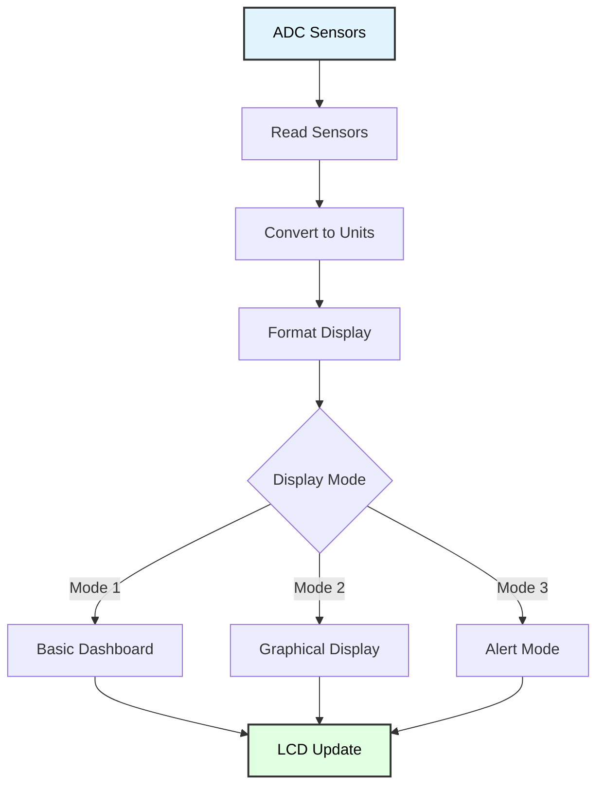

# LCD Sensor Dashboard
## ATmega128 Embedded Systems Course

**Reference**: [ATmega128 Datasheet](https://ww1.microchip.com/downloads/en/DeviceDoc/doc2467.pdf)

---

## Slide 1: Introduction to Sensor Dashboard

### Project Overview
- **Real-time multi-sensor display** on 16×2 LCD
- **Three ADC sensors**: Temperature, Light, Analog input
- **Efficient screen updates** (no flickering)
- **Rotating display modes** or split-screen layout
- **Visual indicators** (bargraphs, arrows, alerts)

### Dashboard Architecture


### Sensor Setup
```
Hardware Connections:
- ADC0 (PF0): LM35 Temperature sensor (10mV/°C)
- ADC1 (PF1): CDS Photocell (light sensor)
- ADC2 (PF2): Potentiometer (general input)

LCD: 16×2 Character Display (4-bit mode)
- RS, E, D4-D7 on PORTG
```

---

## Slide 2: Sensor Data Structure

### Sensor Readings
```c
typedef struct {
    uint16_t temperature;      // Raw ADC value (0-1023)
    uint16_t light;           // Raw ADC value (0-1023)
    uint16_t analog_input;    // Raw ADC value (0-1023)
    
    float temp_celsius;       // Converted temperature (°C)
    uint8_t light_percent;    // Light level (0-100%)
} sensor_data_t;

sensor_data_t sensors;
```

### Read All Sensors
```c
void read_sensors(void) {
    sensors.temperature = adc_read(0);
    sensors.light = adc_read(1);
    sensors.analog_input = adc_read(2);
    
    // Convert temperature (LM35: 10mV/°C, 5V ref, 10-bit ADC)
    // ADC = (Vin * 1024) / 5V
    // LM35: Vout = Temp(°C) * 10mV
    sensors.temp_celsius = (sensors.temperature * 5.0 * 100.0) / 1024.0;
    
    // Convert light to percentage
    sensors.light_percent = (sensors.light * 100) / 1023;
}
```

---

## Slide 3: Basic Dashboard Display

### Simple Two-Line Layout
```c
void demo1_basic_dashboard(void) {
    lcd_clear();
    
    while (1) {
        read_sensors();
        
        // Line 1: Temperature and Light percentage
        char buf[17];
        sprintf(buf, "T:%.1fC L:%u%%  ", 
                sensors.temp_celsius, 
                sensors.light_percent);
        lcd_puts_at(0, 0, buf);
        
        // Line 2: Analog input (raw and percentage)
        sprintf(buf, "A:%4u (%3u%%)  ",
                sensors.analog_input,
                (uint8_t)((sensors.analog_input * 100) / 1023));
        lcd_puts_at(1, 0, buf);
        
        _delay_ms(500);  // Update every 500ms
    }
}
```

### Display Output
```
LCD Screen:
┌────────────────┐
│T:25.3C L:68%   │  ← Line 1: Temp + Light
│A: 512 ( 50%)   │  ← Line 2: Analog input
└────────────────┘
```

---

## Slide 4: Rotating Display Modes

### Multi-Screen Dashboard
```c
uint8_t current_screen = 0;

void demo2_rotating_screens(void) {
    while (1) {
        read_sensors();
        
        switch (current_screen) {
            case 0:
                display_temperature_screen();
                break;
            case 1:
                display_light_screen();
                break;
            case 2:
                display_analog_screen();
                break;
            case 3:
                display_summary_screen();
                break;
        }
        
        _delay_ms(2000);  // Show each screen for 2 seconds
        
        current_screen = (current_screen + 1) % 4;  // Rotate
    }
}
```

### Individual Screen Functions
```c
void display_temperature_screen(void) {
    lcd_clear();
    lcd_puts_at(0, 0, "  Temperature");
    
    char buf[17];
    sprintf(buf, "   %.1f", sensors.temp_celsius);
    lcd_puts_at(1, 0, buf);
    lcd_data(0xDF);  // Degree symbol
    lcd_putc('C');
}

void display_light_screen(void) {
    lcd_clear();
    lcd_puts_at(0, 0, "  Light Level");
    
    char buf[17];
    sprintf(buf, "     %u%%", sensors.light_percent);
    lcd_puts_at(1, 0, buf);
}
```

---

## Slide 5: Graphical Bar Indicators

### Create Bargraph Characters
```c
// Custom characters for bargraph (5 levels)
const uint8_t BAR_EMPTY[8]  = {0x1F, 0x11, 0x11, 0x11, 0x11, 0x11, 0x11, 0x1F};
const uint8_t BAR_1[8]      = {0x1F, 0x11, 0x11, 0x11, 0x11, 0x11, 0x19, 0x1F};
const uint8_t BAR_2[8]      = {0x1F, 0x11, 0x11, 0x11, 0x11, 0x19, 0x19, 0x1F};
const uint8_t BAR_3[8]      = {0x1F, 0x11, 0x11, 0x11, 0x19, 0x19, 0x19, 0x1F};
const uint8_t BAR_4[8]      = {0x1F, 0x11, 0x11, 0x19, 0x19, 0x19, 0x19, 0x1F};
const uint8_t BAR_FULL[8]   = {0x1F, 0x11, 0x19, 0x19, 0x19, 0x19, 0x19, 0x1F};

void load_bargraph_chars(void) {
    lcd_create_char(0, BAR_EMPTY);
    lcd_create_char(1, BAR_1);
    lcd_create_char(2, BAR_2);
    lcd_create_char(3, BAR_3);
    lcd_create_char(4, BAR_4);
    lcd_create_char(5, BAR_FULL);
}
```

### Display Horizontal Bargraph
```c
void display_horizontal_bar(uint8_t row, uint8_t col, uint8_t value_percent) {
    // Display 10-character bargraph (0-100%)
    lcd_gotoxy(col, row);
    
    for (uint8_t i = 0; i < 10; i++) {
        uint8_t segment_value = (value_percent > i * 10) ? 
                                (value_percent - i * 10) : 0;
        
        if (segment_value >= 10) {
            lcd_data(5);  // Full bar
        } else if (segment_value >= 8) {
            lcd_data(4);
        } else if (segment_value >= 6) {
            lcd_data(3);
        } else if (segment_value >= 4) {
            lcd_data(2);
        } else if (segment_value >= 2) {
            lcd_data(1);
        } else {
            lcd_data(0);  // Empty bar
        }
    }
}
```

---

## Slide 6: Graphical Dashboard

### Dashboard with Bargraphs
```c
void demo3_graphical_dashboard(void) {
    load_bargraph_chars();
    
    lcd_clear();
    lcd_puts_at(0, 0, "Temp:");
    lcd_puts_at(1, 0, "Light:");
    
    while (1) {
        read_sensors();
        
        // Temperature bargraph (0-50°C range)
        uint8_t temp_percent = (sensors.temp_celsius > 50.0) ? 
                               100 : (uint8_t)(sensors.temp_celsius * 2.0);
        lcd_gotoxy(6, 0);
        display_horizontal_bar(0, 6, temp_percent);
        
        // Light bargraph
        lcd_gotoxy(6, 1);
        display_horizontal_bar(1, 6, sensors.light_percent);
        
        _delay_ms(300);
    }
}
```

### Display Output
```
LCD Screen:
┌────────────────┐
│Temp:░░░▓▓▓▓▓▓▓ │  ← Temperature bar (60%)
│Light:▓▓▓▓▓░░░░░│  ← Light bar (40%)
└────────────────┘
```

---

## Slide 7: Trend Arrows

### Create Arrow Custom Characters
```c
const uint8_t ARROW_UP[8]    = {0x04, 0x0E, 0x15, 0x04, 0x04, 0x04, 0x04, 0x00};
const uint8_t ARROW_DOWN[8]  = {0x04, 0x04, 0x04, 0x04, 0x15, 0x0E, 0x04, 0x00};
const uint8_t ARROW_FLAT[8]  = {0x00, 0x00, 0x00, 0x1F, 0x1F, 0x00, 0x00, 0x00};

void load_arrow_chars(void) {
    lcd_create_char(0, ARROW_UP);
    lcd_create_char(1, ARROW_DOWN);
    lcd_create_char(2, ARROW_FLAT);
}
```

### Trend Detection
```c
uint16_t last_temp = 0;
uint16_t last_light = 0;

void display_with_trends(void) {
    load_arrow_chars();
    
    while (1) {
        read_sensors();
        
        char buf[17];
        
        // Temperature with trend
        lcd_gotoxy(0, 0);
        sprintf(buf, "T:%.1fC ", sensors.temp_celsius);
        lcd_puts(buf);
        
        if (sensors.temperature > last_temp + 10) {
            lcd_data(0);  // Up arrow
        } else if (sensors.temperature < last_temp - 10) {
            lcd_data(1);  // Down arrow
        } else {
            lcd_data(2);  // Flat
        }
        
        // Light with trend
        lcd_gotoxy(0, 1);
        sprintf(buf, "L:%u%% ", sensors.light_percent);
        lcd_puts(buf);
        
        if (sensors.light > last_light + 50) {
            lcd_data(0);
        } else if (sensors.light < last_light - 50) {
            lcd_data(1);
        } else {
            lcd_data(2);
        }
        
        last_temp = sensors.temperature;
        last_light = sensors.light;
        
        _delay_ms(500);
    }
}
```

---

## Slide 8: Alert Thresholds

### Define Thresholds
```c
typedef struct {
    float temp_min;
    float temp_max;
    uint8_t light_min;
    uint8_t light_max;
} threshold_t;

threshold_t thresholds = {
    .temp_min = 18.0,   // °C
    .temp_max = 28.0,   // °C
    .light_min = 30,    // %
    .light_max = 80     // %
};
```

### Alert Dashboard
```c
void demo4_alert_dashboard(void) {
    uint8_t alert_active = 0;
    
    while (1) {
        read_sensors();
        
        alert_active = 0;
        
        lcd_clear();
        
        // Check temperature
        if (sensors.temp_celsius < thresholds.temp_min) {
            lcd_puts_at(0, 0, "! TEMP TOO LOW !");
            char buf[17];
            sprintf(buf, "  %.1fC < %.1fC", 
                    sensors.temp_celsius, thresholds.temp_min);
            lcd_puts_at(1, 0, buf);
            alert_active = 1;
        } else if (sensors.temp_celsius > thresholds.temp_max) {
            lcd_puts_at(0, 0, "! TEMP TOO HIGH!");
            char buf[17];
            sprintf(buf, "  %.1fC > %.1fC", 
                    sensors.temp_celsius, thresholds.temp_max);
            lcd_puts_at(1, 0, buf);
            alert_active = 1;
        }
        // Check light (only if no temp alert)
        else if (sensors.light_percent < thresholds.light_min) {
            lcd_puts_at(0, 0, "! LIGHT TOO LOW!");
            char buf[17];
            sprintf(buf, "   %u%% < %u%%", 
                    sensors.light_percent, thresholds.light_min);
            lcd_puts_at(1, 0, buf);
            alert_active = 1;
        } else if (sensors.light_percent > thresholds.light_max) {
            lcd_puts_at(0, 0, "!LIGHT TOO HIGH!");
            char buf[17];
            sprintf(buf, "   %u%% > %u%%", 
                    sensors.light_percent, thresholds.light_max);
            lcd_puts_at(1, 0, buf);
            alert_active = 1;
        }
        
        // Normal display if no alerts
        if (!alert_active) {
            lcd_puts_at(0, 0, "  All Normal");
            char buf[17];
            sprintf(buf, "T:%.1fC L:%u%%", 
                    sensors.temp_celsius, sensors.light_percent);
            lcd_puts_at(1, 0, buf);
        }
        
        _delay_ms(1000);
    }
}
```

---

## Slide 9: Statistics Tracking

### Statistical Data Structure
```c
typedef struct {
    uint16_t min;
    uint16_t max;
    uint32_t sum;
    uint16_t count;
    uint16_t average;
} stats_t;

stats_t temp_stats = {1023, 0, 0, 0, 0};
stats_t light_stats = {1023, 0, 0, 0, 0};
```

### Update Statistics
```c
void update_statistics(stats_t *stats, uint16_t value) {
    if (value < stats->min) stats->min = value;
    if (value > stats->max) stats->max = value;
    
    stats->sum += value;
    stats->count++;
    
    stats->average = stats->sum / stats->count;
}

void reset_statistics(stats_t *stats) {
    stats->min = 1023;
    stats->max = 0;
    stats->sum = 0;
    stats->count = 0;
    stats->average = 0;
}
```

### Display Statistics
```c
void display_statistics(void) {
    lcd_clear();
    lcd_puts_at(0, 0, "Temp Stats:");
    
    char buf[17];
    sprintf(buf, "Min:%.1f Max:%.1f",
            (temp_stats.min * 5.0 * 100.0) / 1024.0,
            (temp_stats.max * 5.0 * 100.0) / 1024.0);
    lcd_puts_at(1, 0, buf);
    
    _delay_ms(2000);
    
    lcd_clear();
    lcd_puts_at(0, 0, "Light Stats:");
    sprintf(buf, "Min:%u Max:%u",
            (light_stats.min * 100) / 1023,
            (light_stats.max * 100) / 1023);
    lcd_puts_at(1, 0, buf);
    
    _delay_ms(2000);
}
```

---

## Slide 10: Efficient Display Update

### Avoid Flickering
```c
// BAD: Causes flickering
void update_display_bad(void) {
    lcd_clear();  // Clears entire screen every time!
    sprintf(buf, "T:%.1fC", temp);
    lcd_puts_at(0, 0, buf);
}

// GOOD: Update only changed values
void update_display_good(void) {
    static float last_temp = -999.0;
    
    if (sensors.temp_celsius != last_temp) {
        lcd_gotoxy(2, 0);  // Position cursor
        
        char buf[10];
        sprintf(buf, "%.1f   ", sensors.temp_celsius);  // Spaces to clear old digits
        lcd_puts(buf);
        
        last_temp = sensors.temp_celsius;
    }
}
```

### Shadow Buffer Technique
```c
char lcd_shadow[2][17] = {{0}, {0}};  // Mirror of LCD contents

void lcd_puts_at_smart(uint8_t row, uint8_t col, const char *str) {
    // Only update if content changed
    if (strcmp(&lcd_shadow[row][col], str) != 0) {
        lcd_gotoxy(col, row);
        lcd_puts(str);
        
        strcpy(&lcd_shadow[row][col], str);
    }
}
```

---

## Slide 11: Data Logging Mode

### Log to UART
```c
void demo5_logging_mode(void) {
    puts_USART1("\r\n=== Sensor Data Logging ===\r\n");
    puts_USART1("Time(s),Temp(C),Light(%),Analog(raw)\r\n");
    
    uint16_t seconds = 0;
    
    lcd_clear();
    lcd_puts_at(0, 0, "Logging to UART");
    
    while (1) {
        read_sensors();
        
        // Log to UART (CSV format)
        char buf[50];
        sprintf(buf, "%u,%.1f,%u,%u\r\n",
                seconds,
                sensors.temp_celsius,
                sensors.light_percent,
                sensors.analog_input);
        puts_USART1(buf);
        
        // Update LCD
        sprintf(buf, "t=%u L=%u%%   ", seconds, sensors.light_percent);
        lcd_puts_at(1, 0, buf);
        
        _delay_ms(1000);
        seconds++;
    }
}
```

### Example UART Output
```
=== Sensor Data Logging ===
Time(s),Temp(C),Light(%),Analog(raw)
0,25.3,68,512
1,25.4,67,515
2,25.3,68,510
3,25.5,69,518
...
```

---

## Slide 12: Multi-Sensor UART Dashboard

### Rich UART Display
```c
void uart_dashboard(void) {
    char buf[100];
    
    // Clear screen (VT100 commands)
    puts_USART1("\033[2J\033[H");
    
    // Display header
    puts_USART1("╔════════════════════════════════════════════════════════╗\r\n");
    puts_USART1("║         MULTI-SENSOR MONITORING DASHBOARD             ║\r\n");
    puts_USART1("╠════════════════════════════════════════════════════════╣\r\n");
    
    // Temperature with bargraph
    sprintf(buf, "║ Temperature:    %.1f°C  [", sensors.temp_celsius);
    puts_USART1(buf);
    uint8_t temp_bar = (uint8_t)(sensors.temp_celsius * 2);  // 0-50°C → 0-100
    for (uint8_t i = 0; i < 20; i++) {
        puts_USART1((i < temp_bar / 5) ? "█" : "░");
    }
    puts_USART1("]  ║\r\n");
    
    // Light with bargraph
    sprintf(buf, "║ Light Level:    %3u%%   [", sensors.light_percent);
    puts_USART1(buf);
    for (uint8_t i = 0; i < 20; i++) {
        puts_USART1((i < sensors.light_percent / 5) ? "█" : "░");
    }
    puts_USART1("]  ║\r\n");
    
    // Analog input
    sprintf(buf, "║ Analog Input:   %4u   [", sensors.analog_input);
    puts_USART1(buf);
    uint8_t analog_bar = sensors.analog_input / 51;  // 0-1023 → 0-20
    for (uint8_t i = 0; i < 20; i++) {
        puts_USART1((i < analog_bar) ? "█" : "░");
    }
    puts_USART1("]  ║\r\n");
    
    puts_USART1("╚════════════════════════════════════════════════════════╝\r\n");
}
```

---

## Slide 13: Application - Environmental Monitor

### Complete Environmental System
```c
#define TEMP_THRESHOLD_LOW  18.0
#define TEMP_THRESHOLD_HIGH 28.0
#define LIGHT_THRESHOLD_LOW 30

void environmental_monitor(void) {
    uint8_t alarm_state = 0;
    
    // Configure alarm output (LED or buzzer)
    DDRC |= (1 << PC0);  // Alarm output
    
    load_arrow_chars();
    
    while (1) {
        read_sensors();
        update_statistics(&temp_stats, sensors.temperature);
        update_statistics(&light_stats, sensors.light);
        
        // Check thresholds
        alarm_state = 0;
        
        if (sensors.temp_celsius < TEMP_THRESHOLD_LOW ||
            sensors.temp_celsius > TEMP_THRESHOLD_HIGH ||
            sensors.light_percent < LIGHT_THRESHOLD_LOW) {
            alarm_state = 1;
            PORTC |= (1 << PC0);   // Activate alarm
        } else {
            PORTC &= ~(1 << PC0);  // Deactivate alarm
        }
        
        // Display current readings
        lcd_clear();
        
        char buf[17];
        sprintf(buf, "T:%.1f", sensors.temp_celsius);
        lcd_puts_at(0, 0, buf);
        lcd_data(0xDF);  // Degree symbol
        lcd_putc('C');
        
        if (alarm_state) {
            lcd_puts(" !");  // Alert indicator
        } else {
            lcd_puts("  ");
        }
        
        sprintf(buf, "L:%u%%", sensors.light_percent);
        lcd_puts_at(0, 10, buf);
        
        // Second line: Statistics
        sprintf(buf, "Avg:%.1f/%u%%",
                (temp_stats.average * 5.0 * 100.0) / 1024.0,
                (light_stats.average * 100) / 1023);
        lcd_puts_at(1, 0, buf);
        
        _delay_ms(500);
    }
}
```

---

## Slide 14: Troubleshooting

### Common Issues

| Problem | Cause | Solution |
|---------|-------|----------|
| **Display flickers** | Full lcd_clear() every update | Update only changed values, use shadow buffer |
| **Wrong values** | ADC not initialized | Call adc_init() before reading |
| **Temperature incorrect** | Wrong conversion formula | Check LM35: (ADC * 5.0 * 100.0) / 1024.0 |
| **Display garbled** | Buffer overflow | Ensure sprintf buffers are 17+ chars |
| **Slow updates** | Blocking delays | Use non-blocking timing (timer or millis) |
| **Custom chars lost** | LCD reinit clears CGRAM | Reload custom chars after lcd_init() |

### Debug Output
```c
void debug_sensors(void) {
    printf("\n=== Sensor Debug ===\n");
    printf("Temp raw:  %u (%.1f°C)\n", 
           sensors.temperature, sensors.temp_celsius);
    printf("Light raw: %u (%u%%)\n", 
           sensors.light, sensors.light_percent);
    printf("Analog:    %u\n", sensors.analog_input);
    printf("===================\n\n");
}
```

---

## Slide 15: Summary

### Key Concepts

✓ **Multi-sensor integration**: Read multiple ADC channels  
✓ **Unit conversion**: Raw ADC → Temperature (°C), Light (%)  
✓ **Display layout**: Efficient 16×2 character positioning  
✓ **Efficient updates**: Avoid flickering with partial updates  
✓ **Visual indicators**: Bargraphs, arrows, custom characters  
✓ **Alert thresholds**: Monitor and warn on out-of-range values  
✓ **Statistics tracking**: Min, max, average over time  
✓ **Data logging**: Output CSV to UART for analysis  

### Display Modes
- Basic dashboard (all sensors on one screen)
- Rotating screens (dedicated view per sensor)
- Graphical bargraphs (visual data representation)
- Alert mode (threshold warnings)
- Statistics view (min/max/avg)
- Logging mode (data export)

### Applications
- Environmental monitoring (temp/humidity/light)
- Industrial process control
- Agriculture (greenhouse automation)
- HVAC systems
- Laboratory instruments
- Weather stations

---

## Slide 16: Practice Exercises

### Exercise 1: Basic Dashboard
**Goal**: Display 3 sensors on 16×2 LCD
- Read temp (ADC0), light (ADC1), analog (ADC2)
- Line 1: "T:25.3C L:68%"
- Line 2: "A:512 (50%)"
- Update every 500ms without flickering

### Exercise 2: Rotating Screens
**Goal**: Cycle through sensor views
- Screen 1: Temperature (large text)
- Screen 2: Light level
- Screen 3: Analog input
- Screen 4: Summary (all sensors)
- Switch every 2 seconds

### Exercise 3: Graphical Bargraphs
**Goal**: Create visual indicators
- Load custom bargraph characters (0-5)
- Display horizontal bars for each sensor
- 10-character bars (0-100%)
- Update bars in real-time

### Exercise 4: Alert System
**Goal**: Monitor thresholds
- Set temp range (18-28°C)
- Set light range (30-80%)
- Display alert when out of range
- Flash LED or buzzer on alarm

### Exercise 5: Data Logger
**Goal**: Log to UART in CSV format
- Header: "Time,Temp,Light,Analog"
- Log every second
- Display logging status on LCD
- Capture data for Excel/Python analysis

---

# End of Slides

**Questions?**

For more information, see:
- [ATmega128 Datasheet](https://ww1.microchip.com/downloads/en/DeviceDoc/doc2467.pdf)
- Project source code in `LCD_Sensor_Dashboard/`
- Shared libraries: `_adc.h`, `_lcd.h`, `_uart.h`
