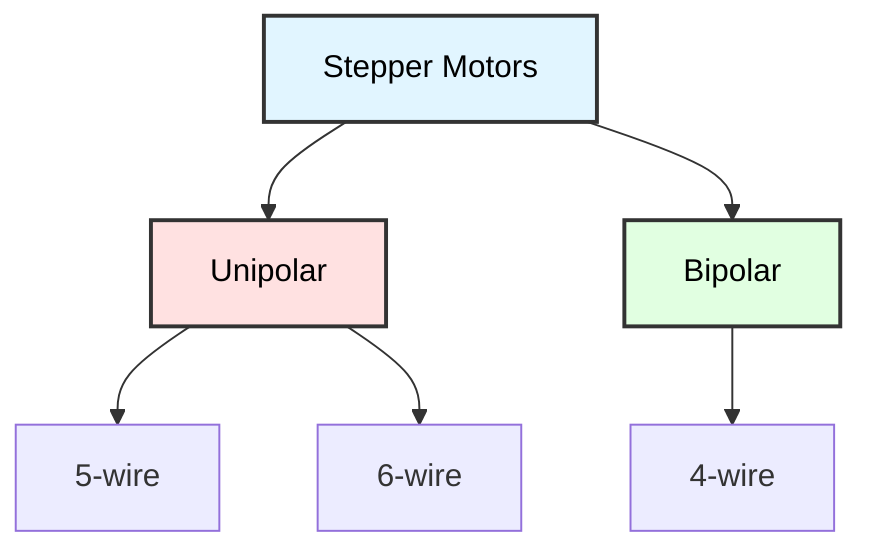

# Stepper Motor Control
## ATmega128 Embedded Systems Course

**Reference**: [ATmega128 Datasheet](https://ww1.microchip.com/downloads/aemDocuments/documents/OTH/ProductDocuments/DataSheets/2467S.pdf)

---

## Slide 1: Introduction to Stepper Motors

### What is a Stepper Motor?
- **Incremental rotation** in discrete steps
- **Open-loop control** (no feedback required)
- **Precise positioning** without encoders
- Common in **3D printers, CNC, robotics**

### Stepper Motor Types


### Stepper Motor Characteristics
```
Typical 28BYJ-48 Specifications:
- Type: Unipolar, 5-wire
- Rated Voltage: 5V DC
- Step Angle: 5.625° (internal)
- Gear Ratio: 64:1
- Steps per Revolution: 2048 (with gear)
- Phase: 4
- Holding Torque: ~300 g·cm
- Detent Torque: ~600 g·cm
```

### How It Works
```
Electromagnet coils energized in sequence
→ Rotor (permanent magnet) aligns with stator
→ Next coil energized → rotor moves one step
→ Repeat in sequence → continuous rotation

     Coil A    Coil B    Coil C    Coil D
       │         │         │         │
       ▼         ▼         ▼         ▼
    ┌─────────────────────────────────┐
    │        ╔═══╗                    │
    │        ║ N ║ ← Rotor            │
    │        ╚═══╝                    │
    └─────────────────────────────────┘
```

---

## Slide 2: Hardware Connection

### Unipolar Stepper (28BYJ-48) Pinout
```
28BYJ-48 with ULN2003 Driver

Stepper Wire Colors:
┌──────────────┐
│ Red    (COM) │ ← Common (+5V)
│ Orange (A)   │ ← Coil A
│ Yellow (B)   │ ← Coil B
│ Pink   (C)   │ ← Coil C
│ Blue   (D)   │ ← Coil D
└──────────────┘
```

### ULN2003 Darlington Driver
```
ATmega128         ULN2003        28BYJ-48
---------         -------        --------
PA0       ────→   IN1    OUT1 ──→ Orange (A)
PA1       ────→   IN2    OUT2 ──→ Yellow (B)
PA2       ────→   IN3    OUT3 ──→ Pink   (C)
PA3       ────→   IN4    OUT4 ──→ Blue   (D)
GND       ────→   GND    COM  ──→ +5V

+5V       ────────────────────→ Red (COM)
```

### Bipolar Stepper (4-wire) with L298N
```
ATmega128         L298N         Bipolar Stepper
---------         -----         ---------------
PA0       ────→   IN1           
PA1       ────→   IN2    OUT1 ──→ Coil A+
PA2       ────→   IN3    OUT2 ──→ Coil A-
PA3       ────→   IN4    OUT3 ──→ Coil B+
                         OUT4 ──→ Coil B-

External 5-12V ──→ +12V  (motor power)
GND ──────────────→ GND   (common ground)
```

---

## Slide 3: Stepping Sequences

### Full-Step Mode (Wave Drive)
```c
// One coil energized at a time
// 4 steps per sequence, lower torque

const uint8_t wave_drive[4] = {
    0b0001,  // Step 0: D
    0b0010,  // Step 1: C
    0b0100,  // Step 2: B
    0b1000   // Step 3: A
};

// Example for 28BYJ-48:
// 2048 steps per revolution (with 64:1 gear)
```

### Full-Step Mode (Full Drive)
```c
// Two coils energized, maximum torque
// 4 steps per sequence

const uint8_t full_step[4] = {
    0b0011,  // Step 0: D+C
    0b0110,  // Step 1: C+B
    0b1100,  // Step 2: B+A
    0b1001   // Step 3: A+D
};

// Double the holding torque of wave drive
```

### Half-Step Mode
```c
// Alternates between 1 and 2 coils
// 8 steps per sequence, smoother rotation

const uint8_t half_step[8] = {
    0b0001,  // Step 0: D
    0b0011,  // Step 1: D+C
    0b0010,  // Step 2: C
    0b0110,  // Step 3: C+B
    0b0100,  // Step 4: B
    0b1100,  // Step 5: B+A
    0b1000,  // Step 6: A
    0b1001   // Step 7: A+D
};

// 4096 steps per revolution (28BYJ-48)
// Smoother, but lower torque on single-coil steps
```

### Stepping Sequence Diagram
```mermaid
sequenceDiagram
    participant A as Coil A
    participant B as Coil B
    participant C as Coil C
    participant D as Coil D
    
    Note over A,D: Full-Step Sequence
    D->>D: ON
    C->>C: ON
    Note right of D: Step 0
    
    C->>C: ON
    B->>B: ON
    D->>D: OFF
    Note right of C: Step 1
    
    B->>B: ON
    A->>A: ON
    C->>C: OFF
    Note right of B: Step 2
    
    A->>A: ON
    D->>D: ON
    B->>B: OFF
    Note right of A: Step 3
    
    style A fill:#e1f5ff,stroke:#333,stroke-width:2px,color:#000
    style B fill:#ffe1e1,stroke:#333,stroke-width:2px,color:#000
    style C fill:#e1ffe1,stroke:#333,stroke-width:2px,color:#000
    style D fill:#fff3e1,stroke:#333,stroke-width:2px,color:#000
```

---

## Slide 4: Basic Stepper Control

### Initialize GPIO for Stepper
```c
#include <avr/io.h>
#include <util/delay.h>

// Motor connected to PORTA lower 4 bits
#define STEPPER_PORT PORTA
#define STEPPER_DDR  DDRA
#define STEPPER_MASK 0x0F  // PA3:PA0

// Full-step sequence
const uint8_t full_step[4] = {
    0b0011,  // D+C
    0b0110,  // C+B
    0b1100,  // B+A
    0b1001   // A+D
};

uint8_t step_index = 0;

void stepper_init(void) {
    // Set PA3:PA0 as outputs
    STEPPER_DDR |= STEPPER_MASK;
    
    // Initialize to first step
    STEPPER_PORT = (STEPPER_PORT & ~STEPPER_MASK) | (full_step[0] & STEPPER_MASK);
}

void stepper_step_cw(void) {
    // Clockwise: increment step index
    step_index++;
    if (step_index >= 4) step_index = 0;
    
    // Output step pattern
    STEPPER_PORT = (STEPPER_PORT & ~STEPPER_MASK) | (full_step[step_index] & STEPPER_MASK);
}

void stepper_step_ccw(void) {
    // Counter-clockwise: decrement step index
    if (step_index == 0) step_index = 3;
    else step_index--;
    
    // Output step pattern
    STEPPER_PORT = (STEPPER_PORT & ~STEPPER_MASK) | (full_step[step_index] & STEPPER_MASK);
}
```

---

## Slide 5: Speed Control

### Step Delay (Speed)
```c
// Delay between steps determines rotation speed
// Shorter delay = faster rotation

#define SPEED_SLOW    10   // 10ms per step
#define SPEED_MEDIUM  5    // 5ms per step
#define SPEED_FAST    2    // 2ms per step

void stepper_rotate_cw(uint16_t steps, uint8_t speed_ms) {
    for (uint16_t i = 0; i < steps; i++) {
        stepper_step_cw();
        _delay_ms(speed_ms);
    }
}

void stepper_rotate_ccw(uint16_t steps, uint8_t speed_ms) {
    for (uint16_t i = 0; i < steps; i++) {
        stepper_step_ccw();
        _delay_ms(speed_ms);
    }
}

// Example: Rotate 1 full revolution
// 28BYJ-48: 2048 steps/rev in full-step mode
stepper_rotate_cw(2048, SPEED_MEDIUM);
```

### RPM Calculation
```c
// Calculate delay for desired RPM

uint8_t rpm_to_delay_ms(uint8_t rpm, uint16_t steps_per_rev) {
    // RPM = (60 × 1000) / (steps_per_rev × delay_ms)
    // delay_ms = 60000 / (rpm × steps_per_rev)
    
    uint32_t delay_ms = 60000UL / ((uint32_t)rpm * steps_per_rev);
    
    if (delay_ms > 255) delay_ms = 255;  // Clamp to uint8_t
    if (delay_ms < 1) delay_ms = 1;      // Minimum 1ms
    
    return (uint8_t)delay_ms;
}

// Example: 10 RPM
uint8_t delay = rpm_to_delay_ms(10, 2048);
stepper_rotate_cw(2048, delay);
```

---

## Slide 6: Acceleration/Deceleration

### Smooth Speed Changes
```c
void stepper_rotate_accel(uint16_t steps, uint8_t start_delay, uint8_t end_delay) {
    uint16_t accel_steps = steps / 3;  // 1/3 accel, 1/3 const, 1/3 decel
    
    // Acceleration phase
    for (uint16_t i = 0; i < accel_steps; i++) {
        stepper_step_cw();
        
        uint8_t delay = start_delay - ((start_delay - end_delay) * i) / accel_steps;
        _delay_ms(delay);
    }
    
    // Constant speed phase
    for (uint16_t i = 0; i < accel_steps; i++) {
        stepper_step_cw();
        _delay_ms(end_delay);
    }
    
    // Deceleration phase
    for (uint16_t i = 0; i < accel_steps; i++) {
        stepper_step_cw();
        
        uint8_t delay = end_delay + ((start_delay - end_delay) * i) / accel_steps;
        _delay_ms(delay);
    }
}

// Example: Accelerate from 20ms to 2ms per step
stepper_rotate_accel(2048, 20, 2);
```

---

## Slide 7: Position Tracking

### Track Absolute Position
```c
int32_t stepper_position = 0;  // Current position in steps
int32_t stepper_target = 0;    // Target position

void stepper_set_position(int32_t pos) {
    stepper_position = pos;
}

void stepper_move_to(int32_t target, uint8_t speed_ms) {
    stepper_target = target;
    
    while (stepper_position != stepper_target) {
        if (stepper_position < stepper_target) {
            // Move clockwise
            stepper_step_cw();
            stepper_position++;
        } else {
            // Move counter-clockwise
            stepper_step_ccw();
            stepper_position--;
        }
        
        _delay_ms(speed_ms);
    }
}

void stepper_home(void) {
    // Move to home position (0)
    stepper_move_to(0, 5);
}

// Example: Move to specific positions
stepper_set_position(0);       // Initialize at home
stepper_move_to(1024, 5);      // Move to 1024 steps (180°)
stepper_move_to(2048, 5);      // Move to 2048 steps (360°)
stepper_home();                // Return to home
```

---

## Slide 8: Half-Step Mode

### Smoother Rotation with Half-Steps
```c
const uint8_t half_step[8] = {
    0b0001,  // D
    0b0011,  // D+C
    0b0010,  // C
    0b0110,  // C+B
    0b0100,  // B
    0b1100,  // B+A
    0b1000,  // A
    0b1001   // A+D
};

uint8_t half_step_index = 0;

void stepper_half_step_cw(void) {
    half_step_index++;
    if (half_step_index >= 8) half_step_index = 0;
    
    STEPPER_PORT = (STEPPER_PORT & ~STEPPER_MASK) | (half_step[half_step_index] & STEPPER_MASK);
}

void stepper_half_step_ccw(void) {
    if (half_step_index == 0) half_step_index = 7;
    else half_step_index--;
    
    STEPPER_PORT = (STEPPER_PORT & ~STEPPER_MASK) | (half_step[half_step_index] & STEPPER_MASK);
}

// 28BYJ-48: 4096 steps per revolution in half-step mode
void rotate_one_revolution_smooth(void) {
    for (uint16_t i = 0; i < 4096; i++) {
        stepper_half_step_cw();
        _delay_ms(2);
    }
}
```

---

## Slide 9: Application - CNC X-Y Plotter

### Two-Axis Stepper Control
```c
// X-axis on PORTA
// Y-axis on PORTC

int32_t x_position = 0;
int32_t y_position = 0;

void cnc_init(void) {
    DDRA |= 0x0F;  // X-axis steppers
    DDRC |= 0x0F;  // Y-axis steppers
}

void cnc_step_x(int8_t direction) {
    if (direction > 0) {
        // X clockwise
        step_index_x++;
        if (step_index_x >= 4) step_index_x = 0;
        x_position++;
    } else {
        // X counter-clockwise
        if (step_index_x == 0) step_index_x = 3;
        else step_index_x--;
        x_position--;
    }
    
    PORTA = (PORTA & 0xF0) | (full_step[step_index_x] & 0x0F);
}

void cnc_step_y(int8_t direction) {
    if (direction > 0) {
        step_index_y++;
        if (step_index_y >= 4) step_index_y = 0;
        y_position++;
    } else {
        if (step_index_y == 0) step_index_y = 3;
        else step_index_y--;
        y_position--;
    }
    
    PORTC = (PORTC & 0xF0) | (full_step[step_index_y] & 0x0F);
}

void cnc_move_to(int32_t target_x, int32_t target_y, uint8_t speed_ms) {
    while (x_position != target_x || y_position != target_y) {
        if (x_position < target_x) {
            cnc_step_x(1);
        } else if (x_position > target_x) {
            cnc_step_x(-1);
        }
        
        if (y_position < target_y) {
            cnc_step_y(1);
        } else if (y_position > target_y) {
            cnc_step_y(-1);
        }
        
        _delay_ms(speed_ms);
    }
}

// Draw a square
void cnc_draw_square(uint16_t size) {
    cnc_move_to(size, 0, 5);      // Right
    cnc_move_to(size, size, 5);   // Up
    cnc_move_to(0, size, 5);      // Left
    cnc_move_to(0, 0, 5);         // Down (home)
}
```

---

## Slide 10: Application - Automatic Curtain

### Stepper-Controlled Curtain Opener
```c
#define CURTAIN_OPEN_STEPS   4096   // Fully open
#define CURTAIN_CLOSED_STEPS 0      // Fully closed

typedef enum {
    CURTAIN_CLOSED,
    CURTAIN_OPENING,
    CURTAIN_OPEN,
    CURTAIN_CLOSING
} curtain_state_t;

curtain_state_t curtain_state = CURTAIN_CLOSED;

void curtain_open(void) {
    if (curtain_state == CURTAIN_CLOSED) {
        curtain_state = CURTAIN_OPENING;
        stepper_move_to(CURTAIN_OPEN_STEPS, 3);
        curtain_state = CURTAIN_OPEN;
    }
}

void curtain_close(void) {
    if (curtain_state == CURTAIN_OPEN) {
        curtain_state = CURTAIN_CLOSING;
        stepper_move_to(CURTAIN_CLOSED_STEPS, 3);
        curtain_state = CURTAIN_CLOSED;
    }
}

// Automatic curtain based on light sensor
void auto_curtain(void) {
    uint16_t light = adc_read(0);  // CdS sensor
    
    if (light > 800) {
        // Bright: close curtain
        curtain_close();
    } else if (light < 200) {
        // Dark: open curtain
        curtain_open();
    }
}
```

---

## Slide 11: Application - Rotating Display

### Circular LED Display
```c
// Rotate platform with LED display
// Persistence of vision creates image

#define STEPS_PER_REV 2048

void display_init(void) {
    stepper_init();
    // Initialize LED column on PORTB
    DDRB = 0xFF;
}

void display_image(const uint8_t *image, uint8_t columns) {
    // Rotate and display image column-by-column
    
    uint8_t steps_per_column = STEPS_PER_REV / columns;
    
    for (uint8_t col = 0; col < columns; col++) {
        // Display this column
        PORTB = image[col];
        
        // Rotate to next column position
        stepper_rotate_cw(steps_per_column, 2);
    }
}

// Example: 16-column smiley face
const uint8_t smiley[16] = {
    0b00111100,
    0b01000010,
    0b10100101,
    0b10000001,
    0b10100101,
    0b10011001,
    0b01000010,
    0b00111100,
    0b00000000,
    // ... (repeat for 360°)
};

int main(void) {
    display_init();
    
    while (1) {
        display_image(smiley, 16);
    }
}
```

---

## Slide 12: Application - Pan-Tilt Platform

### Stepper-Based Camera Mount
```c
// X-axis (pan): PORTA
// Y-axis (tilt): PORTC

int16_t pan_angle = 0;   // -180° to +180°
int16_t tilt_angle = 0;  // -90° to +90°

#define STEPS_PER_DEGREE 11  // 2048 steps / 180° ≈ 11

void pantilt_init(void) {
    stepper_init();
    
    // Center position
    pan_angle = 0;
    tilt_angle = 0;
}

void pantilt_set_angle(int16_t pan, int16_t tilt) {
    // Clamp angles
    if (pan < -180) pan = -180;
    if (pan > 180) pan = 180;
    if (tilt < -90) tilt = -90;
    if (tilt > 90) tilt = 90;
    
    // Calculate step difference
    int32_t pan_steps = pan * STEPS_PER_DEGREE;
    int32_t tilt_steps = tilt * STEPS_PER_DEGREE;
    
    // Move to position
    // (Use dual stepper control similar to CNC example)
    
    pan_angle = pan;
    tilt_angle = tilt;
}

// Scan pattern
void pantilt_scan(void) {
    for (int16_t pan = -90; pan <= 90; pan += 15) {
        for (int16_t tilt = -45; tilt <= 45; tilt += 15) {
            pantilt_set_angle(pan, tilt);
            _delay_ms(500);
            
            // Capture image / sensor reading here
        }
    }
}
```

---

## Slide 13: Microstepping (Advanced)

### Increase Resolution with PWM
```c
// Use PWM on coils for microstepping
// Allows fractional steps (1/8, 1/16, 1/32)

// Example: 1/4 microstep (quarter-step)
typedef struct {
    uint8_t coil_a_pwm;  // 0-255
    uint8_t coil_b_pwm;
    uint8_t coil_c_pwm;
    uint8_t coil_d_pwm;
} microstep_t;

const microstep_t quarter_step[16] = {
    {255, 0,   0,   0  },  // A full
    {255, 0,   0,   64 },  // A+D 25%
    {255, 0,   0,   128},  // A+D 50%
    {255, 0,   0,   192},  // A+D 75%
    {255, 0,   0,   255},  // A+D full
    {192, 0,   0,   255},  // ... continue pattern
    // ... (16 total microsteps)
};

// Requires PWM-capable driver (not ULN2003)
// Use dedicated stepper driver (e.g., A4988, DRV8825)
```

---

## Slide 14: Troubleshooting

### Common Issues

| Problem | Cause | Solution |
|---------|-------|----------|
| **Motor doesn't move** | Wrong sequence | Verify coil connections, check sequence |
| **Motor vibrates** | Steps too fast | Increase delay between steps |
| **Skipped steps** | Insufficient torque | Reduce speed, check load |
| **Overheating** | Continuous current | Use decay modes, reduce holding current |
| **Wrong direction** | Reversed sequence | Swap CW/CCW functions or reverse coil |
| **Noisy operation** | Resonance frequency | Change speed, use microstepping |

### Debugging Code
```c
void stepper_test(void) {
    stepper_init();
    uart_init();
    
    printf("Stepper Test\n");
    printf("------------\n");
    
    // Test each coil individually
    const char *coil_names[] = {"A", "B", "C", "D"};
    
    for (uint8_t i = 0; i < 4; i++) {
        printf("Testing coil %s...\n", coil_names[i]);
        
        STEPPER_PORT = (1 << i);
        _delay_ms(1000);
        
        STEPPER_PORT = 0;
        _delay_ms(500);
    }
    
    // Test rotation
    printf("\nRotating CW...\n");
    stepper_rotate_cw(100, 10);
    
    _delay_ms(1000);
    
    printf("Rotating CCW...\n");
    stepper_rotate_ccw(100, 10);
}
```

---

## Slide 15: Best Practices

### Stepper Motor Guidelines

✓ **Match driver to motor type**
```c
// Unipolar (5/6-wire) → ULN2003, ULN2803
// Bipolar (4-wire) → L298N, A4988, DRV8825
```

✓ **Limit speed**
```c
// Don't exceed motor's max step rate
// Typical: 500-1000 steps/sec max
if (delay_ms < 2) delay_ms = 2;  // Min 2ms
```

✓ **Add acceleration**
```c
// Gradual speed changes prevent skipped steps
stepper_rotate_accel(steps, 20, 2);
```

✓ **Use position tracking**
```c
// Track absolute position for repeatability
int32_t position = 0;
position += steps;  // Update on each step
```

✓ **Disable when idle**
```c
// Turn off coils to reduce power and heat
STEPPER_PORT &= ~STEPPER_MASK;
```

✓ **Add limit switches**
```c
// Detect mechanical limits and home position
if (limit_switch_hit()) {
    stepper_set_position(0);  // Reset home
}
```

---

## Slide 16: Summary

### Key Concepts

✓ **Stepping modes**: Wave, full-step, half-step  
✓ **Coil sequences**: 4-step or 8-step patterns  
✓ **Speed control**: Delay between steps  
✓ **Position tracking**: Absolute step counting  
✓ **Direction**: CW (increment) vs CCW (decrement)  
✓ **Acceleration**: Smooth speed ramps  
✓ **Drivers**: ULN2003 (unipolar), L298N (bipolar)  

### Applications
- 3D printers (X, Y, Z axes)
- CNC machines
- Camera pan-tilt mounts
- Automatic curtains/blinds
- Rotating displays
- Precision positioning

### Stepper Comparison
```
Unipolar (28BYJ-48):
+ Simple driver (ULN2003)
+ 5-wire connection
- Lower torque

Bipolar (NEMA 17):
+ Higher torque
+ Better efficiency
- More complex driver (H-bridge)
```

---

## Slide 17: Practice Exercises

### Exercise 1: Basic Stepping
**Goal**: Implement full-step control
- Initialize GPIO for 4 coils
- Create CW and CCW step functions
- Rotate 1 full revolution
- Add speed control

### Exercise 2: Position Control
**Goal**: Track absolute position
- Implement position counter
- Create `move_to()` function
- Add home position
- Display position on LCD

### Exercise 3: Half-Step Mode
**Goal**: Smoother rotation
- Implement 8-step sequence
- Compare smoothness vs full-step
- Measure steps per revolution
- Test with different speeds

### Exercise 4: CNC Plotter
**Goal**: Control 2-axis stepper system
- Implement X and Y steppers
- Create `move_to(x, y)` function
- Draw geometric shapes (square, circle)
- Add pen lift servo

### Exercise 5: Automatic Curtain
**Goal**: Light-activated curtain control
- Read light sensor (CdS)
- Open curtain when dark
- Close curtain when bright
- Add manual override buttons

---

## Slide 18: Additional Resources

### ATmega128 Documentation
- **[Official Datasheet (PDF)](https://ww1.microchip.com/downloads/aemDocuments/documents/OTH/ProductDocuments/DataSheets/2467S.pdf)**
  - GPIO configuration (PORTA, PORTC)
  - Timing considerations

### Stepper Motor Resources
- Motor datasheets (28BYJ-48, NEMA 17, etc.)
- Step sequences and coil configurations
- Torque-speed curves
- Driver ICs (ULN2003, L298N, A4988, DRV8825)

### Control Algorithms
- Acceleration/deceleration profiles
- Bresenham line algorithm (for CNC)
- Microstepping techniques
- Closed-loop stepper control

### Applications
- 3D printer firmware (Marlin, RepRap)
- CNC G-code interpreters
- Robotic arm kinematics
- Precision positioning systems

---

# End of Slides

**Questions?**

For more information, see:
- [ATmega128 Datasheet](https://ww1.microchip.com/downloads/aemDocuments/documents/OTH/ProductDocuments/DataSheets/2467S.pdf)
- Project source code in `PWM_Motor_Stepper/`
- Shared libraries: `_stepper.h`, `_stepper.c`
