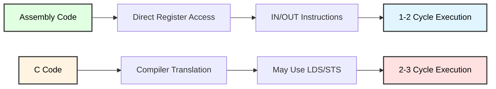
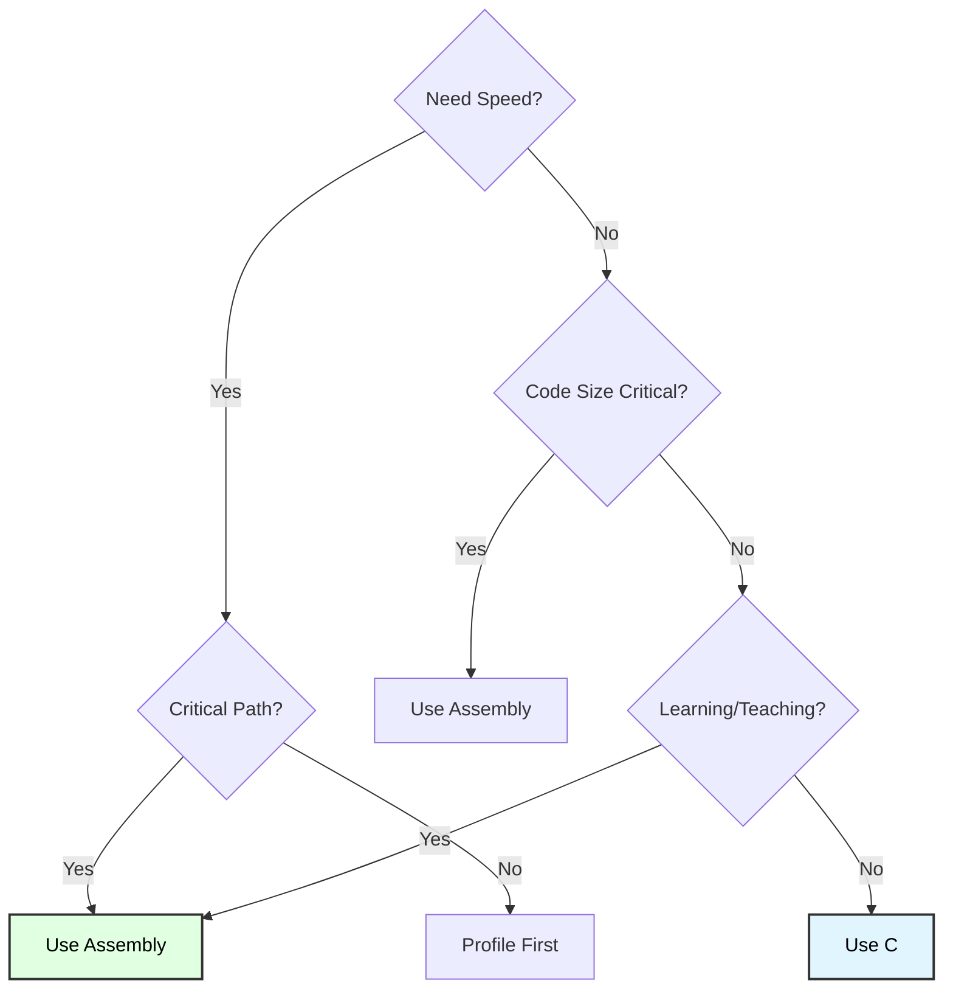

# Port Assembly Programming
## Direct Hardware Control with AVR Assembly Instructions

**Reference**: [ATmega128 Datasheet](https://ww1.microchip.com/downloads/en/DeviceDoc/doc2467.pdf)

---

## Slide 1: Introduction to Assembly Port Programming

### What is Assembly Language?
- **Low-level programming**: Direct control of hardware registers
- **Minimal abstraction**: One instruction per CPU operation
- **Maximum efficiency**: Optimized code size and speed
- **Educational value**: Understand how hardware actually works

### Why Learn Assembly for Ports?


### Essential Assembly Instructions
```
Instruction | Operation           | Cycles | Example
------------|---------------------|--------|------------------
IN          | Read I/O register   | 1      | IN r16, PINB
OUT         | Write I/O register  | 1      | OUT PORTB, r16
SBI         | Set bit in I/O      | 1-2    | SBI PORTB, 3
CBI         | Clear bit in I/O    | 1-2    | CBI PORTB, 5
SBIS        | Skip if bit set     | 1-3    | SBIS PINB, 2
SBIC        | Skip if bit clear   | 1-3    | SBIC PINB, 2
```

---

## Slide 2: AVR Register Architecture

### Register File (32 General Purpose Registers)
```
┌─────────────────────────────────────────────────────┐
│        ATmega128 Register File                      │
├─────────────────────────────────────────────────────┤
│ r0-r1   [××] Reserved (multiply, compiler temp)    │
│ r2-r15  [  ] Free for general use                   │
│ r16-r23 [  ] Upper registers (immediate ops)        │
│ r24-r25 [  ] Function return / first parameter      │
│ r26-r27 [XX] X pointer (XH:XL)                      │
│ r28-r29 [YY] Y pointer (YH:YL) / Frame pointer     │
│ r30-r31 [ZZ] Z pointer (ZH:ZL) / LPM/ELPM          │
└─────────────────────────────────────────────────────┘

Key constraints:
- Only r16-r31 support immediate values (LDI)
- r0-r15 require indirect loading
- X, Y, Z registers used for pointer operations
```

### I/O Register Addressing
```
ATmega128 I/O Space:

0x00-0x1F : Low I/O (use IN/OUT/SBI/CBI)
            - PORTB (0x18), DDRB (0x17), PINB (0x16)
            - Fast 1-cycle access

0x20-0x5F : Extended I/O (use LDS/STS)
            - PORTF, DDRG, etc.
            - Slower 2-cycle access

PORTB = 0x18  ← I/O address
DDRB  = 0x17
PINB  = 0x16
```

---

## Slide 3: IN and OUT Instructions

### Reading Input (IN Instruction)
```assembly
; Read entire PORTB into r16
IN r16, PINB          ; r16 = PINB (1 cycle)

; Example: Check all button states
main_loop:
    IN r16, PIND      ; Read all buttons from PORTD
    OUT PORTB, r16    ; Mirror to LEDs on PORTB
    RJMP main_loop
```

### Writing Output (OUT Instruction)
```assembly
; Set all LEDs on PORTB
LDI r16, 0xFF         ; Load immediate 0xFF into r16
OUT PORTB, r16        ; Write r16 to PORTB (all HIGH)

; Example: Binary counter on LEDs
LDI r16, 0x00         ; Start at 0
counter:
    OUT PORTB, r16    ; Display on LEDs
    INC r16           ; Increment
    RCALL delay       ; Wait
    RJMP counter      ; Loop
```

### Inline Assembly (C Integration)
```c
// Read PINB into C variable
uint8_t input;
__asm__ volatile (
    "IN %0, %1"       // IN rd, P
    : "=r" (input)    // Output: input variable
    : "I" (_SFR_IO_ADDR(PINB))  // Input: PINB I/O address
);

// Write C variable to PORTB
uint8_t output = 0xAA;
__asm__ volatile (
    "OUT %0, %1"      // OUT P, rr
    :                 // No outputs
    : "I" (_SFR_IO_ADDR(PORTB)), "r" (output)
);
```

---

## Slide 4: Bit Manipulation (SBI/CBI)

### Set Bit in I/O (SBI)
```assembly
; Set bit 3 in PORTB (PB3 = HIGH)
SBI PORTB, 3          ; PORTB |= (1 << 3) in 1-2 cycles

; Example: Turn on specific LEDs
SBI DDRB, 0           ; PB0 as output
SBI PORTB, 0          ; PB0 = HIGH (LED on)

SBI DDRB, 7           ; PB7 as output
SBI PORTB, 7          ; PB7 = HIGH

; Result: Only PB0 and PB7 LEDs are on
```

### Clear Bit in I/O (CBI)
```assembly
; Clear bit 5 in PORTB (PB5 = LOW)
CBI PORTB, 5          ; PORTB &= ~(1 << 5) in 1-2 cycles

; Example: Turn off LED
CBI PORTB, 0          ; PB0 = LOW (LED off)
```

### C Comparison
```c
// C code (multiple instructions)
PORTB |= (1 << 3);    // Set bit 3
                      // Compiles to: IN, ORI, OUT (3 instructions)

// Assembly (single instruction)
SBI PORTB, 3          // Set bit 3 (1 instruction)

/*
 * SBI/CBI advantages:
 * - Atomic operation (no interruption)
 * - Faster (1-2 cycles vs 3)
 * - Smaller code size (2 bytes vs 6)
 */
```

---

## Slide 5: Conditional Bit Testing (SBIS/SBIC)

### Skip if Bit Set (SBIS)
```assembly
; Skip next instruction if PINB bit 2 is HIGH
SBIS PINB, 2          ; Test PINB.2
RJMP button_released  ; Execute if bit clear
; (fall through if bit set)
button_pressed:
    SBI PORTB, 0      ; Turn on LED
    RJMP main_loop

button_released:
    CBI PORTB, 0      ; Turn off LED
    RJMP main_loop

/*
 * SBIS cycles:
 * - 1 cycle if bit clear (no skip)
 * - 2-3 cycles if bit set (skip)
 */
```

### Skip if Bit Clear (SBIC)
```assembly
; Skip next instruction if PINB bit 2 is LOW
SBIC PINB, 2          ; Test PINB.2
RJMP led_off          ; Execute if bit set
; (fall through if bit clear)
led_on:
    SBI PORTB, 0
    RJMP main_loop

led_off:
    CBI PORTB, 0
    RJMP main_loop
```

### Button Debounce with SBIC
```assembly
; Wait for button press (PINB.2)
wait_press:
    SBIC PINB, 2      ; Skip if button pressed (LOW)
    RJMP wait_press   ; Loop until pressed

; Wait for button release
wait_release:
    SBIS PINB, 2      ; Skip if button released (HIGH)
    RJMP wait_release ; Loop until released

; Button was pressed and released
SBI PORTB, 0          ; Turn on LED
```

---

## Slide 6: Port Direction Control (DDR)

### Setting Port Direction
```assembly
; Configure PORTB as all outputs
LDI r16, 0xFF         ; All bits = 1 (output)
OUT DDRB, r16         ; DDRB = 0xFF

; Configure PORTD as all inputs
LDI r16, 0x00         ; All bits = 0 (input)
OUT DDRD, r16         ; DDRD = 0x00

; Mixed configuration (PORTB)
; PB0-PB3: Output (LEDs)
; PB4-PB7: Input (buttons)
LDI r16, 0b00001111   ; Lower 4 bits output
OUT DDRB, r16
```

### Pull-Up Resistor Enable
```assembly
; Enable pull-up on PORTD inputs
LDI r16, 0x00         ; All inputs
OUT DDRD, r16

LDI r16, 0xFF         ; Enable all pull-ups
OUT PORTD, r16        ; Write 1 to PORT when DDR=0

/*
 * Pull-up behavior:
 * - When DDR bit = 0 (input):
 *   - PORT bit = 0 → high-impedance (floating)
 *   - PORT bit = 1 → pull-up enabled (~20kΩ)
 */
```

---

## Slide 7: Complete Assembly LED Program

### Blinking LED (Pure Assembly)
```assembly
; ATmega128 Blinker (Pure Assembly)
.INCLUDE "m128def.inc"  ; Device definitions

.CSEG                   ; Code segment
.ORG 0x0000
    RJMP main           ; Reset vector

main:
    ; Initialize stack pointer
    LDI r16, LOW(RAMEND)
    OUT SPL, r16
    LDI r16, HIGH(RAMEND)
    OUT SPH, r16

    ; Configure PB0 as output
    SBI DDRB, 0         ; PB0 = output

loop:
    SBI PORTB, 0        ; LED on
    RCALL delay
    CBI PORTB, 0        ; LED off
    RCALL delay
    RJMP loop

delay:
    ; Software delay (~500ms @ 16MHz)
    LDI r18, 41
delay_outer:
    LDI r17, 150
delay_middle:
    LDI r16, 200
delay_inner:
    DEC r16
    BRNE delay_inner
    DEC r17
    BRNE delay_middle
    DEC r18
    BRNE delay_outer
    RET
```

---

## Slide 8: Inline Assembly in C

### Inline Assembly Syntax
```c
__asm__ volatile (
    "assembly code"       // Assembly instructions
    : "=r" (output_var)   // Output operands (optional)
    : "r" (input_var)     // Input operands (optional)
    : "r16", "r17"        // Clobber list (optional)
);

/*
 * Constraint characters:
 * =   Write-only output
 * +   Read-write operand
 * r   Any register
 * d   Upper registers (r16-r31)
 * a   r16-r23
 * b   r24-r31
 * w   r24-r31 (pairs)
 * x   X register (r26:r27)
 * y   Y register (r28:r29)
 * z   Z register (r30:r31)
 * I   6-bit constant (0-63)
 * M   8-bit constant (0-255)
 */
```

### Example: Toggle LED
```c
void toggle_led_asm(void) {
    // Read current PORTB value
    uint8_t port_value;
    __asm__ volatile (
        "IN %0, %1"       // Read PORTB
        : "=r" (port_value)
        : "I" (_SFR_IO_ADDR(PORTB))
    );
    
    // Toggle bit 0
    port_value ^= (1 << 0);
    
    // Write back
    __asm__ volatile (
        "OUT %0, %1"      // Write PORTB
        :
        : "I" (_SFR_IO_ADDR(PORTB)), "r" (port_value)
    );
}

// Simpler version using SBI/CBI
void led_on_asm(void) {
    __asm__ volatile ("SBI %0, 0" :: "I" (_SFR_IO_ADDR(PORTB)));
}

void led_off_asm(void) {
    __asm__ volatile ("CBI %0, 0" :: "I" (_SFR_IO_ADDR(PORTB)));
}
```

---

## Slide 9: Performance Comparison

### C vs Assembly Cycle Count
```c
// C version (compiler-generated assembly)
PORTB |= (1 << 3);    // Set bit 3

/*
 * Generated assembly (typical):
 * IN  r16, PORTB     ; 1 cycle
 * ORI r16, 0x08      ; 1 cycle
 * OUT PORTB, r16     ; 1 cycle
 * Total: 3 cycles, 3 instructions (6 bytes)
 */

// Assembly version
__asm__ volatile ("SBI %0, 3" :: "I" (_SFR_IO_ADDR(PORTB)));

/*
 * Assembly:
 * SBI PORTB, 3       ; 1-2 cycles
 * Total: 1-2 cycles, 1 instruction (2 bytes)
 *
 * Result: 50-66% faster, 66% smaller code
 */
```

### Code Size Comparison Table
| Operation | C Code | Assembly | C Size | Asm Size | Speedup |
|-----------|--------|----------|--------|----------|---------|
| Set bit | `PORTB \|= (1<<3)` | `SBI PORTB, 3` | 6 bytes | 2 bytes | 1.5-3× |
| Clear bit | `PORTB &= ~(1<<3)` | `CBI PORTB, 3` | 6 bytes | 2 bytes | 1.5-3× |
| Read port | `val = PINB;` | `IN r16, PINB` | 4 bytes | 2 bytes | 1× |
| Write port | `PORTB = 0xFF;` | `LDI/OUT` | 4 bytes | 4 bytes | 1× |
| Test bit | `if (PINB & (1<<2))` | `SBIS PINB, 2` | 8+ bytes | 2 bytes | 2-4× |

---

## Slide 10: Button Input with Assembly

### Polling Button with SBIC
```c
void wait_for_button_press(void) {
    // Configure PORTD.2 as input with pull-up
    __asm__ volatile (
        "CBI %0, 2 \n"    // DDRD.2 = 0 (input)
        "SBI %1, 2 \n"    // PORTD.2 = 1 (pull-up enable)
        :
        : "I" (_SFR_IO_ADDR(DDRD)),
          "I" (_SFR_IO_ADDR(PORTD))
    );
    
    // Wait for button press (active LOW)
    __asm__ volatile (
        "wait_loop: \n"
        "SBIC %0, 2 \n"   // Skip if PIND.2 clear (button pressed)
        "RJMP wait_loop \n"
        :
        : "I" (_SFR_IO_ADDR(PIND))
    );
    
    printf("Button pressed!\n");
}
```

---

## Slide 11: Advanced Bit Operations

### Atomic Bit Toggle
```c
// Toggle multiple bits atomically
void toggle_pattern_asm(void) {
    __asm__ volatile (
        "IN r16, %0 \n"       // Read current value
        "LDI r17, 0b10101010 \n"  // Toggle pattern
        "EOR r16, r17 \n"     // XOR (toggle)
        "OUT %0, r16 \n"      // Write back
        :
        : "I" (_SFR_IO_ADDR(PORTB))
        : "r16", "r17"        // Clobber list
    );
}
```

### Bit Rotation
```assembly
; Rotate PORTB left (circular shift)
rotate_left:
    IN r16, PORTB         ; Read current
    LSL r16               ; Logical shift left
    BRCC no_carry         ; Branch if carry clear
    ORI r16, 0x01         ; Set bit 0 if carry was set
no_carry:
    OUT PORTB, r16        ; Write result
    RET
```

---

## Slide 12: Troubleshooting Assembly Code

### Common Mistakes

| Problem | Cause | Solution |
|---------|-------|----------|
| **Compilation error** | Wrong register constraint | Use "r" for r0-r31, "d" for r16-r31 |
| **Immediate load fails** | Using r0-r15 with LDI | LDI only works with r16-r31 |
| **SBI/CBI doesn't work** | Register not in low I/O | Use IN/ORI/OUT for extended I/O |
| **Wrong I/O address** | Used memory address | Use `_SFR_IO_ADDR()` macro |
| **Clobber list missing** | Modified registers not listed | Add all modified registers |
| **Incorrect cycles** | Branch taken/not taken | Remember SBIS/SBIC timing varies |

### Debugging Tips
```c
// Print register values
void debug_portb(void) {
    uint8_t ddr, port, pin;
    
    __asm__ volatile (
        "IN %0, %3 \n"
        "IN %1, %4 \n"
        "IN %2, %5 \n"
        : "=r" (ddr), "=r" (port), "=r" (pin)
        : "I" (_SFR_IO_ADDR(DDRB)),
          "I" (_SFR_IO_ADDR(PORTB)),
          "I" (_SFR_IO_ADDR(PINB))
    );
    
    printf("DDRB=0x%02X PORTB=0x%02X PINB=0x%02X\n", ddr, port, pin);
}
```

---

## Slide 13: Summary

### Key Assembly Instructions for Ports

✓ **IN Rd, P**: Read I/O register (1 cycle)  
✓ **OUT P, Rr**: Write I/O register (1 cycle)  
✓ **SBI P, b**: Set bit in I/O (1-2 cycles, atomic)  
✓ **CBI P, b**: Clear bit in I/O (1-2 cycles, atomic)  
✓ **SBIS P, b**: Skip if bit set (1-3 cycles)  
✓ **SBIC P, b**: Skip if bit clear (1-3 cycles)  

### Assembly vs C Decision Matrix


### When to Use Assembly
- **Time-critical** operations (interrupt handlers)
- **Atomic** bit manipulations (no interruption)
- **Minimal** code size requirements
- **Direct** hardware control needed
- **Educational** purposes (understand CPU)

---

## Slide 14: Practice Exercises

### Exercise 1: LED Blink (Pure Assembly)
**Goal**: Blink LED on PB0 using only assembly
- Configure PB0 as output (SBI DDRB, 0)
- Loop: Set high, delay, clear, delay
- Use software delay function

### Exercise 2: Button-Controlled LED
**Goal**: LED follows button state
- Configure PORTD.2 as input with pull-up
- Configure PORTB.0 as output
- Use SBIC to test button
- Mirror button state to LED

### Exercise 3: Binary Counter
**Goal**: Count 0-255 on 8 LEDs
- Configure PORTB as all outputs
- Start counter at 0
- Increment, display, delay, repeat
- Use IN/OUT instructions

### Exercise 4: Inline Assembly Toggle
**Goal**: Toggle LED using inline assembly in C
- Write toggle_led() function
- Use IN to read PORTB
- XOR to toggle bit 0
- Use OUT to write back

### Exercise 5: Performance Test
**Goal**: Compare C vs assembly speed
- Implement set_bit() in C and assembly
- Measure cycle count using timer
- Calculate speedup percentage
- Print results on UART

---

# End of Slides

**Questions?**

For more information, see:
- [ATmega128 Datasheet](https://ww1.microchip.com/downloads/en/DeviceDoc/doc2467.pdf) (Instruction Set: pages 321-334, I/O Ports: pages 62-75)
- Project source code in `Port_Assembly/`
- `Atmega128_Instructions/Instructions.md` (comprehensive instruction reference)
