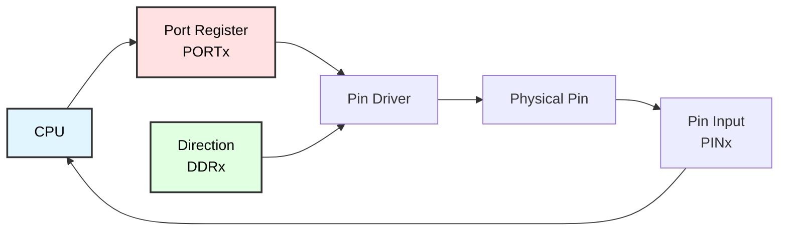
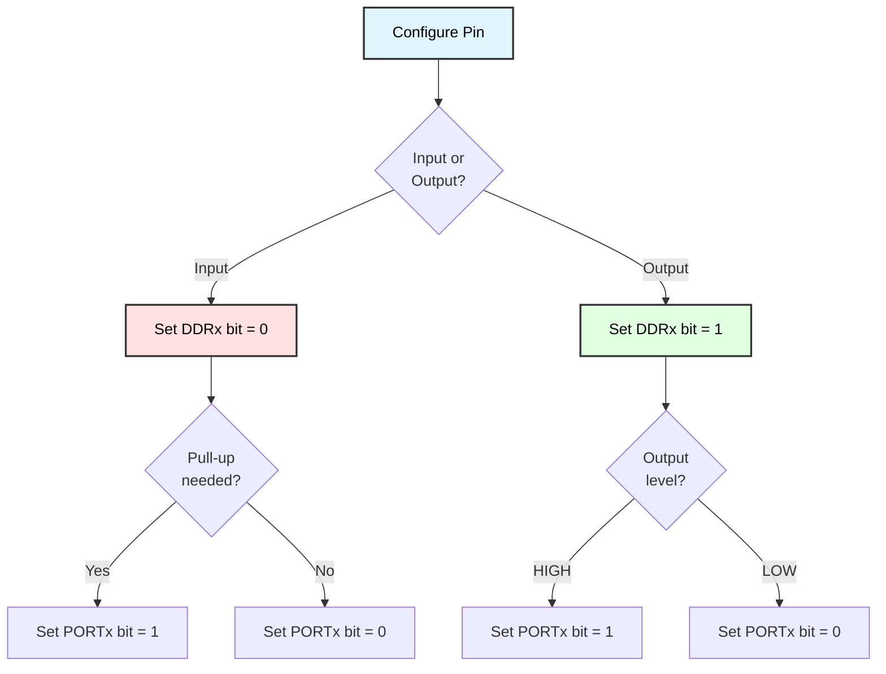

# GPIO Port Programming
## ATmega128 Embedded Systems Course

**Reference**: [ATmega128 Datasheet](https://ww1.microchip.com/downloads/en/DeviceDoc/doc2467.pdf)

---

## Slide 1: Introduction to GPIO

### What is GPIO?
- **General Purpose Input/Output**
- Digital pins that can be controlled by software
- Can be configured as **input** or **output**
- Foundation of embedded system interfacing

### ATmega128 GPIO Features
- **53 programmable I/O lines** (organized in ports)
- **8 ports**: PORTA to PORTG (8 bits each)
- Each pin individually configurable
- **Built-in pull-up resistors** (optional)
- **High current capability**: Up to 40mA per pin

### GPIO Architecture


---

## Slide 2: Port Registers

### Three Registers Per Port
Each port (A-G) has **3 registers**:

| Register | Name | Function |
|----------|------|----------|
| **DDRx** | Data Direction Register | 0=Input, 1=Output |
| **PORTx** | Port Data Register | Output: sets pin level<br/>Input: enables pull-up |
| **PINx** | Port Input Pins | Read current pin state |

### Register Addresses (Examples)
```c
// Port A (0x3A, 0x3B, 0x3C)
#define DDRA  _SFR_IO8(0x1A)
#define PORTA _SFR_IO8(0x1B)
#define PINA  _SFR_IO8(0x19)

// Port B (0x37, 0x38, 0x36)
#define DDRB  _SFR_IO8(0x17)
#define PORTB _SFR_IO8(0x18)
#define PINB  _SFR_IO8(0x16)

// Port C (0x34, 0x35, 0x33)
#define DDRC  _SFR_IO8(0x14)
#define PORTC _SFR_IO8(0x15)
#define PINC  _SFR_IO8(0x13)

// ... and so on for PORTD-PORTG
```

### Register Bit Layout
```
Bit:     7     6     5     4     3     2     1     0
       ┌─────┬─────┬─────┬─────┬─────┬─────┬─────┬─────┐
DDRx:  │ DD7 │ DD6 │ DD5 │ DD4 │ DD3 │ DD2 │ DD1 │ DD0 │
       └─────┴─────┴─────┴─────┴─────┴─────┴─────┴─────┘
       ┌─────┬─────┬─────┬─────┬─────┬─────┬─────┬─────┐
PORTx: │ P7  │ P6  │ P5  │ P4  │ P3  │ P2  │ P1  │ P0  │
       └─────┴─────┴─────┴─────┴─────┴─────┴─────┴─────┘
       ┌─────┬─────┬─────┬─────┬─────┬─────┬─────┬─────┐
PINx:  │PIN7 │PIN6 │PIN5 │PIN4 │PIN3 │PIN2 │PIN1 │PIN0 │
       └─────┴─────┴─────┴─────┴─────┴─────┴─────┴─────┘
```

---

## Slide 3: Pin Configuration

### Four Pin Modes
| DDRx | PORTx | Mode | Description |
|------|-------|------|-------------|
| 0 | 0 | **Hi-Z Input** | High impedance, floating |
| 0 | 1 | **Input with Pull-up** | Pull-up resistor enabled |
| 1 | 0 | **Output LOW** | Pin drives 0V |
| 1 | 1 | **Output HIGH** | Pin drives 5V |

### Configuration Flow


### Example Configurations
```c
// Configure PA0 as output, initially LOW
DDRA |= (1 << PA0);   // Set direction to output
PORTA &= ~(1 << PA0); // Set output to LOW

// Configure PB3 as input with pull-up
DDRB &= ~(1 << PB3);  // Set direction to input
PORTB |= (1 << PB3);  // Enable pull-up resistor

// Configure PC5 as output, initially HIGH
DDRC |= (1 << PC5);   // Set direction to output
PORTC |= (1 << PC5);  // Set output to HIGH

// Configure PD2 as floating input
DDRD &= ~(1 << PD2);  // Set direction to input
PORTD &= ~(1 << PD2); // Disable pull-up (Hi-Z)
```

---

## Slide 4: Basic Output Operations

### Setting a Pin HIGH
```c
// Method 1: Using bit-shift and OR
PORTB |= (1 << PB0);  // Set bit 0 HIGH

// Method 2: Using _BV macro (same as above)
PORTB |= _BV(PB0);

// Method 3: Direct bit manipulation (less portable)
PORTB |= 0b00000001;  // Set bit 0 HIGH

// Method 4: Using sbi() instruction (single instruction)
sbi(PORTB, PB0);      // Requires avr/sfr_defs.h
```

### Clearing a Pin LOW
```c
// Method 1: Using bit-shift and AND with complement
PORTB &= ~(1 << PB0);  // Clear bit 0 to LOW

// Method 2: Using _BV macro
PORTB &= ~_BV(PB0);

// Method 3: Using cbi() instruction
cbi(PORTB, PB0);       // Requires avr/sfr_defs.h
```

### Toggling a Pin
```c
// Method 1: XOR operation
PORTB ^= (1 << PB0);   // Toggle bit 0

// Method 2: Read-modify-write
if (PORTB & (1 << PB0)) {
    PORTB &= ~(1 << PB0);  // Was HIGH, make LOW
} else {
    PORTB |= (1 << PB0);   // Was LOW, make HIGH
}

// Method 3: Direct PIN write (ATmega specific)
PINB = (1 << PB0);     // Toggle PB0
```

### Example: Blinking LED
```c
#include <avr/io.h>
#include <util/delay.h>

int main(void) {
    // Configure PB0 as output
    DDRB |= (1 << PB0);
    
    while (1) {
        // Turn LED on
        PORTB |= (1 << PB0);
        _delay_ms(500);
        
        // Turn LED off
        PORTB &= ~(1 << PB0);
        _delay_ms(500);
        
        // Alternative: Toggle
        // PORTB ^= (1 << PB0);
        // _delay_ms(500);
    }
}
```

---

## Slide 5: Basic Input Operations

### Reading a Pin
```c
// Read single pin
if (PINB & (1 << PB3)) {
    // Pin PB3 is HIGH
} else {
    // Pin PB3 is LOW
}

// Store pin state in variable
uint8_t button_state = (PINB & (1 << PB3)) >> PB3;
// button_state = 1 if HIGH, 0 if LOW

// Check if pin is LOW (button pressed with pull-up)
if (!(PINB & (1 << PB3))) {
    // Button pressed
}
```

### Button with Pull-up
```c
#include <avr/io.h>
#include <util/delay.h>

int main(void) {
    // PB0 = LED output
    DDRB |= (1 << PB0);
    
    // PB3 = Button input with pull-up
    DDRB &= ~(1 << PB3);   // Input
    PORTB |= (1 << PB3);   // Enable pull-up
    
    while (1) {
        if (!(PINB & (1 << PB3))) {
            // Button pressed (pin LOW)
            PORTB |= (1 << PB0);   // LED ON
        } else {
            // Button released (pin HIGH)
            PORTB &= ~(1 << PB0);  // LED OFF
        }
    }
}
```

### Input with Debouncing
```c
uint8_t button_debounce(void) {
    if (!(PINB & (1 << PB3))) {
        // Button might be pressed
        _delay_ms(50);  // Wait for bounce to settle
        
        if (!(PINB & (1 << PB3))) {
            // Still pressed, confirmed
            return 1;
        }
    }
    
    return 0;
}

int main(void) {
    DDRB &= ~(1 << PB3);  // Input
    PORTB |= (1 << PB3);  // Pull-up
    DDRB |= (1 << PB0);   // Output
    
    while (1) {
        if (button_debounce()) {
            PORTB ^= (1 << PB0);  // Toggle LED
            
            // Wait for release
            while (!(PINB & (1 << PB3)));
            _delay_ms(50);
        }
    }
}
```

---

## Slide 6: Multi-Bit Operations

### Writing Multiple Pins
```c
// Set multiple pins at once
PORTB |= (1 << PB0) | (1 << PB2) | (1 << PB5);  // Set PB0, PB2, PB5

// Clear multiple pins
PORTB &= ~((1 << PB1) | (1 << PB3));  // Clear PB1, PB3

// Set lower nibble (bits 0-3) to 0b1010
PORTB = (PORTB & 0xF0) | 0x0A;

// Set upper nibble (bits 4-7) to 0b0101
PORTB = (PORTB & 0x0F) | 0x50;

// Replace entire port value
PORTB = 0b10101010;  // Set all pins at once
```

### Reading Multiple Pins
```c
// Read entire port
uint8_t port_value = PINB;

// Extract lower nibble
uint8_t lower = PINB & 0x0F;

// Extract upper nibble
uint8_t upper = (PINB & 0xF0) >> 4;

// Read specific bits
uint8_t bits_0_2 = PINB & 0b00000111;  // Read PB0, PB1, PB2
```

### Example: 7-Segment Display
```c
//     a
//   ┌───┐
// f │   │ b
//   ├─g─┤
// e │   │ c
//   └───┘
//     d    dp

const uint8_t digit_segments[10] = {
    0b00111111,  // 0 (a,b,c,d,e,f)
    0b00000110,  // 1 (b,c)
    0b01011011,  // 2 (a,b,d,e,g)
    0b01001111,  // 3 (a,b,c,d,g)
    0b01100110,  // 4 (b,c,f,g)
    0b01101101,  // 5 (a,c,d,f,g)
    0b01111101,  // 6 (a,c,d,e,f,g)
    0b00000111,  // 7 (a,b,c)
    0b01111111,  // 8 (all)
    0b01101111   // 9 (a,b,c,d,f,g)
};

void display_digit(uint8_t digit) {
    if (digit < 10) {
        PORTB = digit_segments[digit];
    }
}

int main(void) {
    DDRB = 0xFF;  // All outputs
    
    uint8_t count = 0;
    
    while (1) {
        display_digit(count);
        _delay_ms(1000);
        
        count++;
        if (count > 9) count = 0;
    }
}
```

---

## Slide 7: Port Masking

### Selective Pin Modification
```c
// Mask defines which bits to modify
#define LED_MASK 0b00001111  // Lower 4 bits

// Set only masked bits HIGH
PORTB |= LED_MASK;

// Clear only masked bits
PORTB &= ~LED_MASK;

// Toggle only masked bits
PORTB ^= LED_MASK;

// Set masked bits to specific value
uint8_t new_value = 0b00001010;
PORTB = (PORTB & ~LED_MASK) | (new_value & LED_MASK);
```

### Example: Traffic Light Control
```c
#define RED_LED     (1 << PB0)
#define YELLOW_LED  (1 << PB1)
#define GREEN_LED   (1 << PB2)
#define LIGHT_MASK  (RED_LED | YELLOW_LED | GREEN_LED)

void set_lights(uint8_t state) {
    // Clear all lights, then set new state
    PORTB = (PORTB & ~LIGHT_MASK) | (state & LIGHT_MASK);
}

int main(void) {
    DDRB |= LIGHT_MASK;  // Configure as outputs
    
    while (1) {
        set_lights(GREEN_LED);       // Green only
        _delay_ms(5000);
        
        set_lights(YELLOW_LED);      // Yellow only
        _delay_ms(2000);
        
        set_lights(RED_LED);         // Red only
        _delay_ms(5000);
        
        set_lights(RED_LED | YELLOW_LED);  // Red + Yellow
        _delay_ms(1000);
    }
}
```

---

## Slide 8: Efficient Bit Manipulation

### Macros for Readability
```c
// Define common operations as macros
#define SET_BIT(reg, bit)     ((reg) |= (1 << (bit)))
#define CLEAR_BIT(reg, bit)   ((reg) &= ~(1 << (bit)))
#define TOGGLE_BIT(reg, bit)  ((reg) ^= (1 << (bit)))
#define TEST_BIT(reg, bit)    ((reg) & (1 << (bit)))

// Usage examples
SET_BIT(PORTB, PB0);      // Turn on LED
CLEAR_BIT(PORTB, PB1);    // Turn off LED
TOGGLE_BIT(PORTB, PB2);   // Toggle LED

if (TEST_BIT(PINB, PB3)) {
    // Pin is HIGH
}

// Configure multiple pins
#define OUTPUT_PIN(port, pin) SET_BIT(DDR##port, P##port##pin)
#define INPUT_PIN(port, pin)  CLEAR_BIT(DDR##port, P##port##pin)

OUTPUT_PIN(B, 0);  // Expands to: SET_BIT(DDRB, PB0)
INPUT_PIN(B, 3);   // Expands to: CLEAR_BIT(DDRB, PB3)
```

### Assembly-Level Optimization
```c
// Single-instruction set/clear (SBI/CBI)
#include <avr/sfr_defs.h>

// These compile to single instructions (2 cycles)
sbi(PORTB, PB0);  // Set bit
cbi(PORTB, PB1);  // Clear bit

// Compared to C code (4-6 cycles)
PORTB |= (1 << PB0);
PORTB &= ~(1 << PB1);

// Note: sbi/cbi only work on I/O registers 0x00-0x1F
// Use for PORTA-PORTG, not for extended I/O
```

---

## Slide 9: Port Initialization Patterns

### Pattern 1: All Outputs
```c
void port_init_all_outputs(void) {
    DDRA = 0xFF;   // All pins as outputs
    PORTA = 0x00;  // All pins LOW initially
}
```

### Pattern 2: All Inputs with Pull-ups
```c
void port_init_all_inputs(void) {
    DDRA = 0x00;   // All pins as inputs
    PORTA = 0xFF;  // Enable all pull-ups
}
```

### Pattern 3: Mixed Configuration
```c
void port_init_mixed(void) {
    // Lower nibble: outputs (LEDs)
    // Upper nibble: inputs with pull-ups (buttons)
    
    DDRA = 0x0F;   // PA0-PA3 outputs, PA4-PA7 inputs
    PORTA = 0xF0;  // PA0-PA3 LOW, PA4-PA7 pull-ups enabled
}
```

### Pattern 4: Specific Pins
```c
void port_init_specific(void) {
    // PB0, PB2: outputs (LEDs)
    DDRB |= (1 << PB0) | (1 << PB2);
    PORTB &= ~((1 << PB0) | (1 << PB2));
    
    // PB1, PB3: inputs with pull-ups (buttons)
    DDRB &= ~((1 << PB1) | (1 << PB3));
    PORTB |= (1 << PB1) | (1 << PB3);
    
    // PB4: input without pull-up (analog sensor)
    DDRB &= ~(1 << PB4);
    PORTB &= ~(1 << PB4);
}
```

---

## Slide 10: Application - LED Patterns

### Knight Rider Effect
```c
void knight_rider(void) {
    DDRB = 0xFF;  // All outputs
    
    while (1) {
        // Move left to right
        for (uint8_t i = 0; i < 8; i++) {
            PORTB = (1 << i);
            _delay_ms(100);
        }
        
        // Move right to left
        for (int8_t i = 6; i >= 1; i--) {
            PORTB = (1 << i);
            _delay_ms(100);
        }
    }
}
```

### Binary Counter
```c
void binary_counter(void) {
    DDRB = 0xFF;  // All outputs
    uint8_t count = 0;
    
    while (1) {
        PORTB = count;
        _delay_ms(500);
        count++;
    }
}
```

### Random Blink
```c
#include <stdlib.h>

void random_blink(void) {
    DDRB = 0xFF;
    
    // Seed with timer or ADC noise
    srand(TCNT0);
    
    while (1) {
        PORTB = rand() & 0xFF;
        _delay_ms(200);
    }
}
```

### Chasing Pattern
```c
void chasing_pattern(void) {
    DDRB = 0xFF;
    uint8_t pattern = 0b00000111;  // 3 consecutive LEDs
    
    while (1) {
        PORTB = pattern;
        _delay_ms(100);
        
        // Rotate left
        pattern = (pattern << 1) | (pattern >> 7);
    }
}
```

---

## Slide 11: Application - Button Matrix

### 4-Button Input
```c
#define BTN_UP     (1 << PB0)
#define BTN_DOWN   (1 << PB1)
#define BTN_LEFT   (1 << PB2)
#define BTN_RIGHT  (1 << PB3)
#define BTN_MASK   (BTN_UP | BTN_DOWN | BTN_LEFT | BTN_RIGHT)

void button_matrix_init(void) {
    // Configure as inputs with pull-ups
    DDRB &= ~BTN_MASK;
    PORTB |= BTN_MASK;
}

uint8_t read_buttons(void) {
    // Read and invert (button press = LOW)
    return (~PINB) & BTN_MASK;
}

void handle_buttons(void) {
    uint8_t buttons = read_buttons();
    
    if (buttons & BTN_UP) {
        printf("UP pressed\n");
    }
    if (buttons & BTN_DOWN) {
        printf("DOWN pressed\n");
    }
    if (buttons & BTN_LEFT) {
        printf("LEFT pressed\n");
    }
    if (buttons & BTN_RIGHT) {
        printf("RIGHT pressed\n");
    }
}

int main(void) {
    button_matrix_init();
    uart_init();
    
    uint8_t last_state = 0;
    
    while (1) {
        uint8_t current = read_buttons();
        
        // Detect press (transition from 0 to 1)
        uint8_t pressed = current & ~last_state;
        
        if (pressed) {
            if (pressed & BTN_UP)    printf("UP\n");
            if (pressed & BTN_DOWN)  printf("DOWN\n");
            if (pressed & BTN_LEFT)  printf("LEFT\n");
            if (pressed & BTN_RIGHT) printf("RIGHT\n");
        }
        
        last_state = current;
        _delay_ms(50);  // Debounce delay
    }
}
```

---

## Slide 12: Application - Parallel Interface

### 8-Bit Data Bus
```c
// Write 8-bit data to parallel port
void parallel_write(uint8_t data) {
    PORTA = data;  // Put data on bus
    
    // Strobe write enable pin
    PORTB |= (1 << PB0);   // WR HIGH
    _delay_us(1);
    PORTB &= ~(1 << PB0);  // WR LOW
}

// Read 8-bit data from parallel port
uint8_t parallel_read(void) {
    // Trigger read
    PORTB |= (1 << PB1);   // RD HIGH
    _delay_us(1);
    
    uint8_t data = PINA;   // Read data bus
    
    PORTB &= ~(1 << PB1);  // RD LOW
    
    return data;
}

// Initialize parallel interface
void parallel_init(void) {
    // PORTA = data bus (bidirectional)
    DDRA = 0xFF;   // Start as output
    PORTA = 0x00;
    
    // PORTB = control signals
    DDRB |= (1 << PB0) | (1 << PB1);  // WR, RD as outputs
    PORTB &= ~((1 << PB0) | (1 << PB1));  // Both LOW
}

// Switch data bus direction
void parallel_set_direction(uint8_t is_output) {
    if (is_output) {
        DDRA = 0xFF;  // Output mode
    } else {
        DDRA = 0x00;  // Input mode
        PORTA = 0x00; // Disable pull-ups (external pull-ups assumed)
    }
}
```

---

## Slide 13: Application - Bit-Banging SPI

### Software SPI (Bit-Banging)
```c
// Pin definitions
#define MOSI  PB5
#define MISO  PB6
#define SCK   PB7
#define SS    PB4

void spi_init(void) {
    // MOSI, SCK, SS as outputs
    DDRB |= (1 << MOSI) | (1 << SCK) | (1 << SS);
    
    // MISO as input
    DDRB &= ~(1 << MISO);
    
    // Initial states
    PORTB |= (1 << SS);    // SS HIGH (inactive)
    PORTB &= ~(1 << SCK);  // SCK LOW
}

uint8_t spi_transfer(uint8_t data) {
    uint8_t received = 0;
    
    for (uint8_t i = 0; i < 8; i++) {
        // Set MOSI based on MSB of data
        if (data & 0x80) {
            PORTB |= (1 << MOSI);
        } else {
            PORTB &= ~(1 << MOSI);
        }
        
        // Clock HIGH
        PORTB |= (1 << SCK);
        _delay_us(1);
        
        // Read MISO
        received <<= 1;
        if (PINB & (1 << MISO)) {
            received |= 1;
        }
        
        // Clock LOW
        PORTB &= ~(1 << SCK);
        _delay_us(1);
        
        data <<= 1;  // Next bit
    }
    
    return received;
}

void spi_select(void) {
    PORTB &= ~(1 << SS);  // SS LOW (active)
}

void spi_deselect(void) {
    PORTB |= (1 << SS);   // SS HIGH (inactive)
}

// Example usage
int main(void) {
    spi_init();
    
    spi_select();
    uint8_t response = spi_transfer(0xAA);
    spi_deselect();
    
    printf("Received: 0x%02X\n", response);
}
```

---

## Slide 14: Timing Considerations

### Propagation Delay
```c
// GPIO operations are not instantaneous

// Write → Pin change delay: ~1-2 clock cycles
PORTB |= (1 << PB0);
// Pin is now HIGH (after ~62.5ns @ 16MHz)

// For fast operations, add explicit delays
PORTB |= (1 << PB0);
_delay_us(1);  // Ensure signal has stabilized
PORTB &= ~(1 << PB0);
```

### Setup and Hold Times
```c
// When interfacing with external devices
void write_with_timing(uint8_t data) {
    // Setup time: data must be stable before clock edge
    PORTA = data;
    _delay_us(1);  // Setup time
    
    // Clock pulse
    PORTB |= (1 << PB0);
    _delay_us(1);  // Hold time
    PORTB &= ~(1 << PB0);
}
```

### Maximum Toggle Frequency
```
Maximum GPIO toggle rate:
- With simple toggle: f_max ≈ F_CPU / 2
- At 16 MHz: ~8 MHz max toggle rate

Practical limit (with C code overhead):
- ~1-2 MHz typical
```

---

## Slide 15: Power Consumption

### Port Configuration Impact
```c
// High impedance input (worst for power)
DDRA &= ~(1 << PA0);  // Input
PORTA &= ~(1 << PA0); // No pull-up
// Pin floats → can oscillate → higher power

// Input with pull-up (better)
DDRA &= ~(1 << PA0);  // Input
PORTA |= (1 << PA0);  // Pull-up
// Stable HIGH → less power

// Output (best - defined state)
DDRA |= (1 << PA0);   // Output
PORTA &= ~(1 << PA0); // Defined state
// No oscillation → lowest power
```

### Unused Pin Configuration
```c
void configure_unused_pins(void) {
    // Method 1: Configure as outputs, drive LOW
    DDRB |= (1 << PB5) | (1 << PB6);  // Unused pins
    PORTB &= ~((1 << PB5) | (1 << PB6));
    
    // Method 2: Configure as inputs with pull-ups
    // (useful if pins might be connected later)
    DDRC &= ~((1 << PC0) | (1 << PC1));
    PORTC |= (1 << PC0) | (1 << PC1);
}

// Best practice: never leave pins floating
void init_all_ports(void) {
    // Configure all unused pins
    // Example: PORTF not used
    DDRF = 0xFF;   // All outputs
    PORTF = 0x00;  // All LOW
}
```

---

## Slide 16: Advanced - Port Multiplexing

### Sharing Pins for Multiple Functions
```c
typedef enum {
    MODE_LED,
    MODE_BUTTON,
    MODE_SENSOR
} port_mode_t;

port_mode_t current_mode = MODE_LED;

void set_port_mode(port_mode_t mode) {
    switch (mode) {
        case MODE_LED:
            DDRA = 0xFF;   // All outputs
            PORTA = 0x00;
            break;
            
        case MODE_BUTTON:
            DDRA = 0x00;   // All inputs
            PORTA = 0xFF;  // Pull-ups
            break;
            
        case MODE_SENSOR:
            DDRA = 0x00;   // All inputs
            PORTA = 0x00;  // No pull-ups
            break;
    }
    
    current_mode = mode;
}

// Time-multiplexed display (Charlieplexing concept)
void display_multiplex(void) {
    // Show digit 0 on position 0
    DDRA = 0xFF;
    PORTA = digit_segments[0];
    DDRB |= (1 << PB0);
    PORTB &= ~(1 << PB0);  // Enable position 0
    _delay_ms(5);
    
    // Show digit 1 on position 1
    PORTA = digit_segments[1];
    PORTB |= (1 << PB0);   // Disable position 0
    DDRB |= (1 << PB1);
    PORTB &= ~(1 << PB1);  // Enable position 1
    _delay_ms(5);
}
```

---

## Slide 17: Testing and Debugging

### Port Test Functions
```c
// Test all pins by toggling
void test_all_pins(void) {
    printf("Testing all pins on PORTB\n");
    
    DDRB = 0xFF;  // All outputs
    
    for (uint8_t pin = 0; pin < 8; pin++) {
        printf("Testing PB%d\n", pin);
        
        PORTB = 0x00;
        _delay_ms(500);
        
        PORTB = (1 << pin);
        _delay_ms(500);
    }
    
    PORTB = 0x00;
}

// Read and display port state
void debug_port_state(void) {
    printf("DDRB:  0x%02X (0b", DDRB);
    for (int8_t i = 7; i >= 0; i--) {
        printf("%d", (DDRB >> i) & 1);
    }
    printf(")\n");
    
    printf("PORTB: 0x%02X (0b", PORTB);
    for (int8_t i = 7; i >= 0; i--) {
        printf("%d", (PORTB >> i) & 1);
    }
    printf(")\n");
    
    printf("PINB:  0x%02X (0b", PINB);
    for (int8_t i = 7; i >= 0; i--) {
        printf("%d", (PINB >> i) & 1);
    }
    printf(")\n\n");
}

// Input test with live monitoring
void test_inputs(void) {
    DDRB = 0x00;   // All inputs
    PORTB = 0xFF;  // Pull-ups
    
    while (1) {
        debug_port_state();
        _delay_ms(500);
    }
}
```

---

## Slide 18: Best Practices

### GPIO Programming Guidelines

✓ **Always initialize ports** before use
```c
void init(void) {
    // Bad: Using port without initialization
    // PORTB |= (1 << PB0);  // ← May have unexpected state
    
    // Good: Initialize first
    DDRB |= (1 << PB0);   // Configure as output
    PORTB &= ~(1 << PB0); // Set initial state
}
```

✓ **Use meaningful names**
```c
// Bad
#define LED 0

// Good
#define LED_STATUS_PIN PB0
#define LED_STATUS_PORT PORTB
#define LED_STATUS_DDR DDRB

#define LED_ON()  (LED_STATUS_PORT |= (1 << LED_STATUS_PIN))
#define LED_OFF() (LED_STATUS_PORT &= ~(1 << LED_STATUS_PIN))
```

✓ **Configure unused pins**
```c
// Unused pins should not float
DDRF = 0xFF;   // All outputs
PORTF = 0x00;  // Drive LOW
```

✓ **Use atomic operations** for interrupt safety
```c
#include <util/atomic.h>

ATOMIC_BLOCK(ATOMIC_RESTORESTATE) {
    PORTB |= (1 << PB0);
    PORTB &= ~(1 << PB1);
}
```

✓ **Document pin assignments**
```c
/*
 * Pin Configuration:
 * PB0 - LED Status (output)
 * PB1 - LED Error (output)
 * PB2 - Button Reset (input, pull-up)
 * PB3 - Sensor Enable (output)
 * PB4-7 - Unused (configured as outputs, LOW)
 */
```

---

## Slide 19: Common Mistakes

### Mistake 1: Forgetting Direction Configuration
```c
// ❌ WRONG: Setting output without configuring DDR
PORTB |= (1 << PB0);  // May not work if PB0 is input!

// ✓ CORRECT
DDRB |= (1 << PB0);   // Configure as output first
PORTB |= (1 << PB0);  // Then set HIGH
```

### Mistake 2: Reading PORT Instead of PIN
```c
// ❌ WRONG: Reading PORT register
if (PORTB & (1 << PB3)) {  // Reads output latch, not pin state!

// ✓ CORRECT: Read PIN register
if (PINB & (1 << PB3)) {   // Reads actual pin state
```

### Mistake 3: Not Debouncing Inputs
```c
// ❌ WRONG: No debouncing
if (!(PINB & (1 << PB3))) {
    count++;  // Will count multiple times per press!
}

// ✓ CORRECT: With debouncing
if (!(PINB & (1 << PB3))) {
    _delay_ms(50);
    if (!(PINB & (1 << PB3))) {
        count++;
        while (!(PINB & (1 << PB3)));  // Wait for release
        _delay_ms(50);
    }
}
```

### Mistake 4: Unintended Bit Modification
```c
// ❌ WRONG: Affects other bits
PORTB = (1 << PB0);  // Sets PB0, but clears all others!

// ✓ CORRECT: Use bitwise OR
PORTB |= (1 << PB0);  // Sets only PB0
```

---

## Slide 20: Performance Comparison

### Operation Speed
```c
// Benchmark: Toggle PB0 1 million times

// Method 1: Bitwise XOR
start = micros();
for (uint32_t i = 0; i < 1000000; i++) {
    PORTB ^= (1 << PB0);
}
end = micros();
printf("XOR: %lu us\n", end - start);

// Method 2: If-else
start = micros();
for (uint32_t i = 0; i < 1000000; i++) {
    if (PORTB & (1 << PB0)) {
        PORTB &= ~(1 << PB0);
    } else {
        PORTB |= (1 << PB0);
    }
}
end = micros();
printf("If-else: %lu us\n", end - start);

// Method 3: PIN write (fastest)
start = micros();
for (uint32_t i = 0; i < 1000000; i++) {
    PINB = (1 << PB0);
}
end = micros();
printf("PIN write: %lu us\n", end - start);
```

### Typical Results @ 16MHz
```
Method          Cycles/Toggle    Time/Toggle
---------------------------------------------
XOR             ~6 cycles        375 ns
If-else         ~12 cycles       750 ns
PIN write       ~2 cycles        125 ns
sbi/cbi         ~2 cycles        125 ns
```

---

## Slide 21: Summary

### Key Concepts

✓ **Three registers per port**: DDRx (direction), PORTx (output/pull-up), PINx (input)  
✓ **Pin modes**: Hi-Z input, Input with pull-up, Output LOW, Output HIGH  
✓ **Bit manipulation**: Use `|=`, `&= ~`, `^=` for set, clear, toggle  
✓ **Read from PIN**, write to PORT  
✓ **Initialize before use** - don't leave pins floating  
✓ **Debounce inputs** for reliable button reading  
✓ **Use masks** for multi-bit operations  
✓ **Document pin assignments** clearly  

### GPIO Applications
- LED control and displays
- Button and switch input
- Parallel data buses
- Bit-banging communication protocols
- Sensor interfacing
- Motor and relay control

### Best Practices Checklist
- ✓ Initialize DDRx and PORTx on startup
- ✓ Configure unused pins (output LOW or input with pull-up)
- ✓ Use meaningful macro names for pins
- ✓ Read PIN register for inputs, not PORT
- ✓ Debounce mechanical switches
- ✓ Use atomic blocks when necessary
- ✓ Comment pin assignments in code

---

## Slide 22: Practice Exercises

### Exercise 1: LED Blink
**Goal**: Basic output control
- Configure PB0 as output
- Blink LED at 1 Hz (500ms on, 500ms off)
- Add second LED on PB1 blinking at 2 Hz

### Exercise 2: Button-Controlled LED
**Goal**: Basic input and output
- PB0 = LED output
- PB3 = Button input (with pull-up)
- LED on when button pressed
- Add debouncing

### Exercise 3: Binary Counter
**Goal**: Multi-bit output
- Use PORTB (8 LEDs)
- Count from 0 to 255
- Display binary value
- 500ms per count

### Exercise 4: Traffic Light
**Goal**: Sequential control
- 3 LEDs (Red, Yellow, Green)
- Proper traffic light sequence
- Realistic timing

### Exercise 5: Button Counter
**Goal**: Edge detection
- Button on PB3
- Count button presses
- Display count on 4 LEDs (binary)
- Proper debouncing required

---

## Slide 23: Additional Resources

### ATmega128 Documentation
- **[Official Datasheet (PDF)](https://ww1.microchip.com/downloads/en/DeviceDoc/doc2467.pdf)**
  - Section 4: I/O Ports
  - Section 29: Register Summary
  - Electrical Characteristics

### Port Programming
- GPIO fundamentals
- Pull-up/pull-down resistors
- Schmitt trigger inputs
- Current sourcing/sinking

### Advanced Topics
- Port multiplexing
- Charlieplexing for LEDs
- Interrupt on pin change
- Analog comparator on GPIO

### Tools
- Logic analyzer for debugging
- Oscilloscope for timing
- Multimeter for voltage checks

---

# End of Slides

**Questions?**

For more information, see:
- [ATmega128 Datasheet](https://ww1.microchip.com/downloads/en/DeviceDoc/doc2467.pdf)
- Project source code in `Port_Basic/`
- Shared libraries: `_port.h`, `_port.c`
