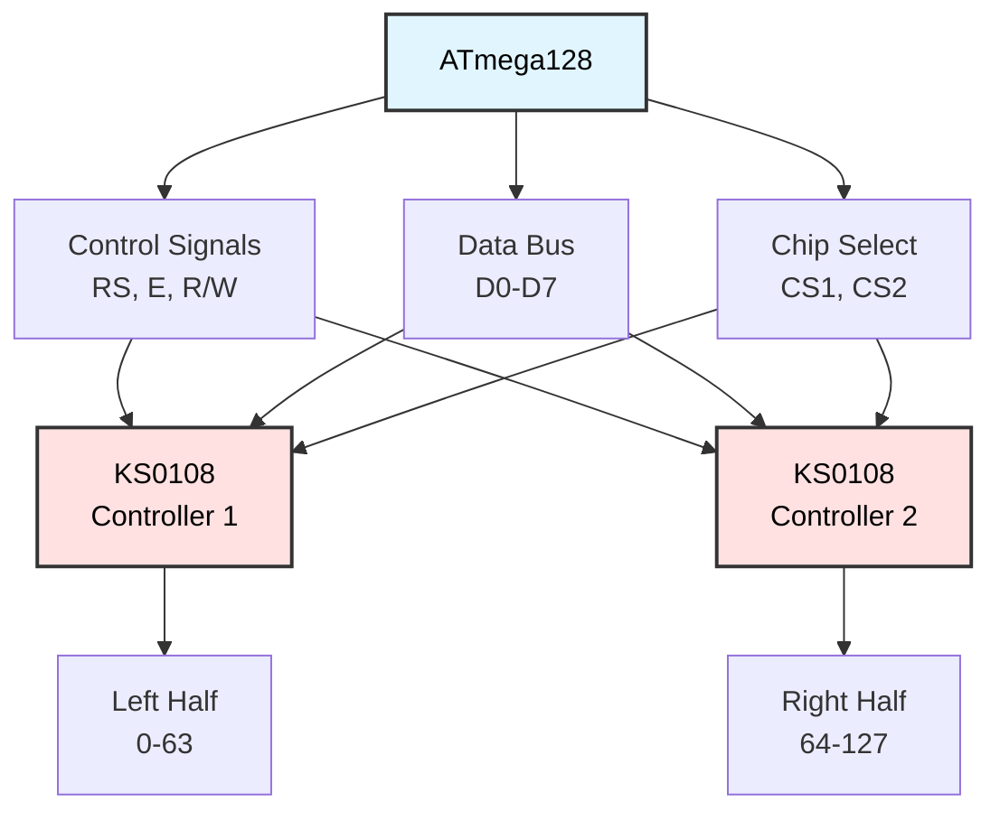

# Graphics LCD (GLCD) Programming
## ATmega128 Embedded Systems Course

**Reference**: [ATmega128 Datasheet](https://ww1.microchip.com/downloads/en/DeviceDoc/doc2467.pdf)

---

## Slide 1: Introduction to Graphics LCD

### What is a Graphics LCD (GLCD)?
- **Bitmap display** - control individual pixels
- **KS0108-based** 128×64 monochrome display
- **Dual controller** architecture (left/right halves)
- **Page-based memory** organization
- Can display **text, graphics, and images**

### GLCD vs Character LCD
| Feature | Character LCD | Graphics LCD |
|---------|---------------|--------------|
| **Resolution** | 16×2 characters | 128×64 pixels |
| **Control** | Fixed characters | Individual pixels |
| **Graphics** | Limited (custom chars) | Full graphics capability |
| **Complexity** | Simple | More complex |
| **Use cases** | Menus, status | Graphs, images, UI |

### GLCD Architecture


---

## Slide 2: Coordinate System

### Screen Layout
```
     0                          127 (Y-axis / columns)
   ┌─────────────────────────────────┐
 0 │░░░░░░░░░░░░░│                   │
   │             │                   │
   │   CS1       │      CS2          │
   │  (left)     │     (right)       │
   │             │                   │
   │             │                   │
63 │             │                   │
   └─────────────┴───────────────────┘
(X-axis / rows)         63│

Origin (0,0) = Top-left corner
X increases downward (rows)
Y increases rightward (columns)
```

### Dual Controller Split
```c
// Screen divided into two halves

CS1 (Controller 1):
  - Controls columns 0-63 (left half)
  - Activated when y < 64

CS2 (Controller 2):
  - Controls columns 64-127 (right half)
  - Activated when y >= 64

#define GLCD_CS1  PB0  // Left half chip select
#define GLCD_CS2  PB1  // Right half chip select
```

### Page-Based Memory
```
8 pages (0-7), each 8 pixels tall:

Page 0: Rows  0- 7    ┌───────────┐ ← Page 0
Page 1: Rows  8-15    │           │
Page 2: Rows 16-23    │           │
Page 3: Rows 24-31    │           │
Page 4: Rows 32-39    │           │
Page 5: Rows 40-47    │           │
Page 6: Rows 48-55    │           │
Page 7: Rows 56-63    └───────────┘ ← Page 7

Each page: 128 columns × 1 byte (8 bits vertical)

Writing 0xFF to Page 0, Column 10:
  Lights up 8 vertical pixels at x=0..7, y=10
```

---

## Slide 3: Hardware Connection

### Pin Connections
```
GLCD Pin        ATmega128
--------        ---------
DB0-DB7  ←→     PORTA (PA0-PA7) - Data bus
RS       ←      PC0              - Register Select
R/W      ←      PC1              - Read/Write
E        ←      PC2              - Enable
CS1      ←      PB0              - Chip Select 1 (left)
CS2      ←      PB1              - Chip Select 2 (right)
RST      ←      PB2              - Reset (active LOW)

VDD      ─      5V
VSS      ─      GND
VEE      ─      Contrast (variable)
```

### Control Signal Functions
```c
// RS - Register Select
#define GLCD_CMD   0  // RS=0: Command mode
#define GLCD_DATA  1  // RS=1: Data mode

// R/W - Read/Write
#define GLCD_WRITE 0  // R/W=0: Write to GLCD
#define GLCD_READ  1  // R/W=1: Read from GLCD

// E - Enable
// Pulse HIGH→LOW to latch data

// CS1/CS2 - Chip Select
// Only one active at a time
```

---

## Slide 4: Initialization

### GLCD Initialization Sequence
```c
#include <avr/io.h>
#include <util/delay.h>

// Pin definitions
#define GLCD_RS   PC0
#define GLCD_RW   PC1
#define GLCD_E    PC2
#define GLCD_CS1  PB0
#define GLCD_CS2  PB1
#define GLCD_RST  PB2

void glcd_init(void) {
    // Configure data port as output
    DDRA = 0xFF;
    PORTA = 0x00;
    
    // Configure control pins as outputs
    DDRC |= (1 << GLCD_RS) | (1 << GLCD_RW) | (1 << GLCD_E);
    DDRB |= (1 << GLCD_CS1) | (1 << GLCD_CS2) | (1 << GLCD_RST);
    
    // Reset GLCD (pulse LOW)
    PORTB &= ~(1 << GLCD_RST);
    _delay_ms(10);
    PORTB |= (1 << GLCD_RST);
    _delay_ms(10);
    
    // Initialize both controllers
    glcd_select_chip(GLCD_CS1);
    glcd_command(0x3F);  // Display ON
    glcd_command(0xC0);  // Start line = 0
    
    glcd_select_chip(GLCD_CS2);
    glcd_command(0x3F);  // Display ON
    glcd_command(0xC0);  // Start line = 0
    
    // Clear screen
    glcd_clear();
}

void glcd_select_chip(uint8_t chip) {
    if (chip == GLCD_CS1) {
        PORTB |= (1 << GLCD_CS1);
        PORTB &= ~(1 << GLCD_CS2);
    } else {
        PORTB &= ~(1 << GLCD_CS1);
        PORTB |= (1 << GLCD_CS2);
    }
}
```

---

## Slide 5: Basic Commands

### Send Command to GLCD
```c
void glcd_command(uint8_t cmd) {
    PORTC &= ~(1 << GLCD_RS);  // RS = 0 (command mode)
    PORTC &= ~(1 << GLCD_RW);  // R/W = 0 (write)
    
    PORTA = cmd;               // Put command on data bus
    
    // Pulse enable
    PORTC |= (1 << GLCD_E);
    _delay_us(1);
    PORTC &= ~(1 << GLCD_E);
    
    _delay_us(5);  // Command execution time
}

void glcd_data(uint8_t data) {
    PORTC |= (1 << GLCD_RS);   // RS = 1 (data mode)
    PORTC &= ~(1 << GLCD_RW);  // R/W = 0 (write)
    
    PORTA = data;              // Put data on data bus
    
    // Pulse enable
    PORTC |= (1 << GLCD_E);
    _delay_us(1);
    PORTC &= ~(1 << GLCD_E);
    
    _delay_us(5);  // Data write time
}

uint8_t glcd_read_data(void) {
    DDRA = 0x00;               // Data port as input
    
    PORTC |= (1 << GLCD_RS);   // RS = 1 (data mode)
    PORTC |= (1 << GLCD_RW);   // R/W = 1 (read)
    
    // Pulse enable
    PORTC |= (1 << GLCD_E);
    _delay_us(1);
    
    uint8_t data = PINA;       // Read data bus
    
    PORTC &= ~(1 << GLCD_E);
    
    DDRA = 0xFF;               // Data port back to output
    
    return data;
}
```

### GLCD Command Reference
```c
// Display ON/OFF
#define GLCD_ON   0x3F  // Display ON
#define GLCD_OFF  0x3E  // Display OFF

// Set Page (0-7)
#define GLCD_SET_PAGE(p)  (0xB8 | ((p) & 0x07))

// Set Column (0-63 per chip)
#define GLCD_SET_COL(c)   (0x40 | ((c) & 0x3F))

// Set Start Line (0-63)
#define GLCD_SET_LINE(l)  (0xC0 | ((l) & 0x3F))

// Example usage
glcd_command(GLCD_SET_PAGE(0));  // Select page 0
glcd_command(GLCD_SET_COL(10));  // Select column 10
glcd_data(0xFF);                 // Write 8 pixels (vertical bar)
```

---

## Slide 6: Pixel Operations

### Set Pixel
```c
void glcd_set_pixel(uint8_t x, uint8_t y) {
    if (x >= 64 || y >= 128) return;  // Out of bounds
    
    // Determine which chip and column
    uint8_t chip = (y < 64) ? GLCD_CS1 : GLCD_CS2;
    uint8_t col = (y < 64) ? y : (y - 64);
    
    // Determine page and bit position
    uint8_t page = x / 8;
    uint8_t bit = x % 8;
    
    // Select chip and position
    glcd_select_chip(chip);
    glcd_command(GLCD_SET_PAGE(page));
    glcd_command(GLCD_SET_COL(col));
    
    // Read current byte
    uint8_t dummy = glcd_read_data();  // Dummy read
    uint8_t data = glcd_read_data();   // Actual data
    
    // Set bit
    data |= (1 << bit);
    
    // Write back
    glcd_command(GLCD_SET_COL(col));   // Reset column
    glcd_data(data);
}

void glcd_clear_pixel(uint8_t x, uint8_t y) {
    if (x >= 64 || y >= 128) return;
    
    uint8_t chip = (y < 64) ? GLCD_CS1 : GLCD_CS2;
    uint8_t col = (y < 64) ? y : (y - 64);
    uint8_t page = x / 8;
    uint8_t bit = x % 8;
    
    glcd_select_chip(chip);
    glcd_command(GLCD_SET_PAGE(page));
    glcd_command(GLCD_SET_COL(col));
    
    uint8_t dummy = glcd_read_data();
    uint8_t data = glcd_read_data();
    
    // Clear bit
    data &= ~(1 << bit);
    
    glcd_command(GLCD_SET_COL(col));
    glcd_data(data);
}

void glcd_toggle_pixel(uint8_t x, uint8_t y) {
    if (x >= 64 || y >= 128) return;
    
    uint8_t chip = (y < 64) ? GLCD_CS1 : GLCD_CS2;
    uint8_t col = (y < 64) ? y : (y - 64);
    uint8_t page = x / 8;
    uint8_t bit = x % 8;
    
    glcd_select_chip(chip);
    glcd_command(GLCD_SET_PAGE(page));
    glcd_command(GLCD_SET_COL(col));
    
    uint8_t dummy = glcd_read_data();
    uint8_t data = glcd_read_data();
    
    // Toggle bit
    data ^= (1 << bit);
    
    glcd_command(GLCD_SET_COL(col));
    glcd_data(data);
}
```

---

## Slide 7: Drawing Lines

### Horizontal Line
```c
void glcd_line_horizontal(uint8_t x, uint8_t y1, uint8_t y2) {
    if (x >= 64) return;
    if (y1 > y2) {
        uint8_t temp = y1;
        y1 = y2;
        y2 = temp;
    }
    
    for (uint8_t y = y1; y <= y2 && y < 128; y++) {
        glcd_set_pixel(x, y);
    }
}

// Optimized horizontal line (same page)
void glcd_hline_fast(uint8_t x, uint8_t y1, uint8_t y2) {
    if (x >= 64 || y1 > y2) return;
    
    uint8_t page = x / 8;
    uint8_t bit = x % 8;
    uint8_t pattern = (1 << bit);
    
    // Draw on left chip if needed
    if (y1 < 64) {
        glcd_select_chip(GLCD_CS1);
        glcd_command(GLCD_SET_PAGE(page));
        
        uint8_t end = (y2 < 64) ? y2 : 63;
        
        for (uint8_t y = y1; y <= end; y++) {
            glcd_command(GLCD_SET_COL(y));
            
            uint8_t dummy = glcd_read_data();
            uint8_t data = glcd_read_data();
            
            glcd_command(GLCD_SET_COL(y));
            glcd_data(data | pattern);
        }
    }
    
    // Draw on right chip if needed
    if (y2 >= 64) {
        glcd_select_chip(GLCD_CS2);
        glcd_command(GLCD_SET_PAGE(page));
        
        uint8_t start = (y1 >= 64) ? (y1 - 64) : 0;
        uint8_t end = y2 - 64;
        
        for (uint8_t y = start; y <= end; y++) {
            glcd_command(GLCD_SET_COL(y));
            
            uint8_t dummy = glcd_read_data();
            uint8_t data = glcd_read_data();
            
            glcd_command(GLCD_SET_COL(y));
            glcd_data(data | pattern);
        }
    }
}
```

### Vertical Line
```c
void glcd_line_vertical(uint8_t x1, uint8_t x2, uint8_t y) {
    if (y >= 128) return;
    if (x1 > x2) {
        uint8_t temp = x1;
        x1 = x2;
        x2 = temp;
    }
    
    for (uint8_t x = x1; x <= x2 && x < 64; x++) {
        glcd_set_pixel(x, y);
    }
}
```

### Bresenham's Line Algorithm
```c
void glcd_line(int8_t x0, int8_t y0, int8_t x1, int8_t y1) {
    int8_t dx = abs(x1 - x0);
    int8_t dy = abs(y1 - y0);
    int8_t sx = (x0 < x1) ? 1 : -1;
    int8_t sy = (y0 < y1) ? 1 : -1;
    int8_t err = dx - dy;
    
    while (1) {
        glcd_set_pixel(x0, y0);
        
        if (x0 == x1 && y0 == y1) break;
        
        int8_t e2 = 2 * err;
        
        if (e2 > -dy) {
            err -= dy;
            x0 += sx;
        }
        
        if (e2 < dx) {
            err += dx;
            y0 += sy;
        }
    }
}
```

---

## Slide 8: Drawing Shapes

### Rectangle
```c
void glcd_rectangle(uint8_t x, uint8_t y, uint8_t width, uint8_t height) {
    // Top and bottom edges
    glcd_line_horizontal(x, y, y + width - 1);
    glcd_line_horizontal(x + height - 1, y, y + width - 1);
    
    // Left and right edges
    glcd_line_vertical(x, x + height - 1, y);
    glcd_line_vertical(x, x + height - 1, y + width - 1);
}

void glcd_rectangle_filled(uint8_t x, uint8_t y, uint8_t width, uint8_t height) {
    for (uint8_t i = 0; i < height; i++) {
        glcd_line_horizontal(x + i, y, y + width - 1);
    }
}
```

### Circle (Midpoint Algorithm)
```c
void glcd_circle(int8_t xc, int8_t yc, uint8_t radius) {
    int8_t x = 0;
    int8_t y = radius;
    int8_t d = 1 - radius;
    
    while (x <= y) {
        // Draw 8 octants
        glcd_set_pixel(xc + x, yc + y);
        glcd_set_pixel(xc - x, yc + y);
        glcd_set_pixel(xc + x, yc - y);
        glcd_set_pixel(xc - x, yc - y);
        glcd_set_pixel(xc + y, yc + x);
        glcd_set_pixel(xc - y, yc + x);
        glcd_set_pixel(xc + y, yc - x);
        glcd_set_pixel(xc - y, yc - x);
        
        if (d < 0) {
            d += 2 * x + 3;
        } else {
            d += 2 * (x - y) + 5;
            y--;
        }
        x++;
    }
}

void glcd_circle_filled(int8_t xc, int8_t yc, uint8_t radius) {
    for (int8_t y = -radius; y <= radius; y++) {
        for (int8_t x = -radius; x <= radius; x++) {
            if (x*x + y*y <= radius*radius) {
                glcd_set_pixel(xc + x, yc + y);
            }
        }
    }
}
```

---

## Slide 9: Text Display

### 5×7 Font Definition
```c
// 5×7 font (ASCII 32-127)
const uint8_t font5x7[][5] PROGMEM = {
    {0x00, 0x00, 0x00, 0x00, 0x00},  // ' ' (space)
    {0x00, 0x00, 0x5F, 0x00, 0x00},  // '!'
    {0x00, 0x07, 0x00, 0x07, 0x00},  // '"'
    // ... (full font table)
    {0x7C, 0x08, 0x04, 0x08, 0x7C},  // 'M'
    {0x7C, 0x04, 0x18, 0x20, 0x7C},  // 'N'
    {0x38, 0x44, 0x44, 0x44, 0x38},  // 'O'
    // ... (continues for all printable ASCII)
};

void glcd_putchar(uint8_t page, uint8_t col, char c) {
    if (c < 32 || c > 127) c = ' ';  // Invalid char
    
    uint8_t chip = (col < 64) ? GLCD_CS1 : GLCD_CS2;
    uint8_t actual_col = (col < 64) ? col : (col - 64);
    
    glcd_select_chip(chip);
    glcd_command(GLCD_SET_PAGE(page));
    glcd_command(GLCD_SET_COL(actual_col));
    
    // Write 5 columns of font data
    for (uint8_t i = 0; i < 5; i++) {
        uint8_t byte = pgm_read_byte(&font5x7[c - 32][i]);
        glcd_data(byte);
    }
    
    // Spacing column
    glcd_data(0x00);
}

void glcd_puts(uint8_t page, uint8_t col, const char *str) {
    while (*str) {
        glcd_putchar(page, col, *str++);
        col += 6;  // 5 pixels + 1 spacing
        
        if (col >= 128) break;  // Off screen
    }
}
```

### Text Grid System
```c
// Text positioning: 20 chars × 8 rows
#define GLCD_CHAR_WIDTH  6  // 5 + 1 spacing
#define GLCD_CHAR_HEIGHT 8  // 1 page

void glcd_xy(uint8_t row, uint8_t col, const char *str) {
    // row: 0-7 (pages)
    // col: 0-19 (character positions)
    
    if (row > 7 || col > 19) return;
    
    uint8_t page = row;
    uint8_t x = col * GLCD_CHAR_WIDTH;
    
    glcd_puts(page, x, str);
}

// Example usage
int main(void) {
    glcd_init();
    
    glcd_xy(0, 0, "Graphics LCD");
    glcd_xy(1, 0, "128x64 pixels");
    glcd_xy(3, 0, "Hello World!");
}
```

---

## Slide 10: Clear Screen

### Clear Entire Display
```c
void glcd_clear(void) {
    // Clear left half (CS1)
    glcd_select_chip(GLCD_CS1);
    for (uint8_t page = 0; page < 8; page++) {
        glcd_command(GLCD_SET_PAGE(page));
        glcd_command(GLCD_SET_COL(0));
        
        for (uint8_t col = 0; col < 64; col++) {
            glcd_data(0x00);
        }
    }
    
    // Clear right half (CS2)
    glcd_select_chip(GLCD_CS2);
    for (uint8_t page = 0; page < 8; page++) {
        glcd_command(GLCD_SET_PAGE(page));
        glcd_command(GLCD_SET_COL(0));
        
        for (uint8_t col = 0; col < 64; col++) {
            glcd_data(0x00);
        }
    }
}

// Clear specific area
void glcd_clear_area(uint8_t x, uint8_t y, uint8_t width, uint8_t height) {
    for (uint8_t i = 0; i < height; i++) {
        for (uint8_t j = 0; j < width; j++) {
            glcd_clear_pixel(x + i, y + j);
        }
    }
}
```

---

## Slide 11: Application - Oscilloscope Display

### Simple Waveform Display
```c
void glcd_plot_waveform(uint8_t *samples, uint8_t count) {
    glcd_clear();
    
    // Draw axes
    glcd_line_horizontal(32, 0, 127);  // X-axis
    glcd_line_vertical(0, 63, 64);     // Y-axis
    
    // Plot samples
    for (uint8_t i = 1; i < count && i < 128; i++) {
        uint8_t x1 = samples[i-1];
        uint8_t x2 = samples[i];
        
        // Clamp to screen bounds
        if (x1 > 63) x1 = 63;
        if (x2 > 63) x2 = 63;
        
        glcd_line(x1, i-1, x2, i);
    }
}

// Real-time ADC plotting
void oscilloscope_mode(void) {
    uint8_t buffer[128];
    
    while (1) {
        // Sample ADC (scaled to 0-63)
        for (uint8_t i = 0; i < 128; i++) {
            uint16_t adc = adc_read(0);
            buffer[i] = (adc * 63) / 1023;
            _delay_us(100);
        }
        
        glcd_plot_waveform(buffer, 128);
        _delay_ms(100);
    }
}
```

---

## Slide 12: Application - Bitmap Images

### Display Bitmap
```c
// Example: 16x16 icon
const uint8_t icon_battery[32] PROGMEM = {
    // 16x16 bitmap (2 pages × 16 columns)
    0x00,0xFE,0x82,0x82,0x82,0x82,0x82,0x82,
    0x82,0x82,0x82,0x82,0x82,0x82,0xFE,0x00,
    0x00,0x7F,0x41,0x5D,0x5D,0x5D,0x5D,0x5D,
    0x5D,0x5D,0x5D,0x5D,0x5D,0x41,0x7F,0x00
};

void glcd_draw_bitmap(uint8_t x, uint8_t y, 
                       const uint8_t *bitmap, 
                       uint8_t width, uint8_t height) {
    uint8_t pages = (height + 7) / 8;
    
    for (uint8_t p = 0; p < pages; p++) {
        uint8_t page = (x / 8) + p;
        
        for (uint8_t col = 0; col < width; col++) {
            uint8_t chip = ((y + col) < 64) ? GLCD_CS1 : GLCD_CS2;
            uint8_t actual_col = ((y + col) < 64) ? (y + col) : (y + col - 64);
            
            glcd_select_chip(chip);
            glcd_command(GLCD_SET_PAGE(page));
            glcd_command(GLCD_SET_COL(actual_col));
            
            uint8_t byte = pgm_read_byte(&bitmap[p * width + col]);
            glcd_data(byte);
        }
    }
}

// Usage
glcd_draw_bitmap(0, 0, icon_battery, 16, 16);
```

---

## Slide 13: Application - Menu System

### Graphical Menu
```c
void glcd_draw_menu(const char *title, const char *items[], uint8_t count, uint8_t selected) {
    glcd_clear();
    
    // Title bar
    glcd_rectangle_filled(0, 0, 128, 10);
    // Invert text (would need inverted font or custom drawing)
    glcd_xy(0, 2, title);
    
    // Menu items
    for (uint8_t i = 0; i < count && i < 6; i++) {
        uint8_t row = i + 2;
        
        if (i == selected) {
            // Highlight selected item
            glcd_putchar(row, 0, '>');
        }
        
        glcd_xy(row, 1, items[i]);
    }
}

// Example
const char *menu_items[] = {
    "Start",
    "Settings",
    "About",
    "Exit"
};

glcd_draw_menu("Main Menu", menu_items, 4, 0);
```

---

## Slide 14: Best Practices

### GLCD Programming Guidelines

✓ **Initialize properly**
```c
// Always reset and configure both controllers
glcd_init();
```

✓ **Handle chip boundaries**
```c
// Check which chip (CS1 or CS2) for y coordinate
if (y < 64) {
    glcd_select_chip(GLCD_CS1);
    col = y;
} else {
    glcd_select_chip(GLCD_CS2);
    col = y - 64;
}
```

✓ **Optimize for speed**
```c
// Use page-aligned operations when possible
// Batch writes to same page/column
// Avoid read-modify-write if not necessary
```

✓ **Respect timing**
```c
// Add delays after commands/data
_delay_us(5);  // After command
_delay_us(1);  // After enable pulse
```

✓ **Bounds checking**
```c
if (x >= 64 || y >= 128) return;  // Out of bounds
```

---

## Slide 15: Summary

### Key Concepts

✓ **Dual-controller** architecture (CS1/CS2)  
✓ **128×64 pixel** resolution  
✓ **Page-based** memory (8 pages × 128 columns)  
✓ **Coordinate system**: X (rows), Y (columns)  
✓ **Pixel-level** control for graphics  
✓ **Custom fonts** for text display  
✓ **Drawing primitives**: lines, shapes, circles  

### GLCD vs Character LCD
- **More complex** but **much more flexible**
- **Graphics capability** for charts, graphs, images
- **Custom UI** designs possible
- **Higher resolution** but slower updates

### Common Applications
- Oscilloscopes and data plotters
- Custom dashboards and gauges
- Bitmap image display
- Graphical menus and interfaces
- Games and animations
- Charts and graphs

---

## Slide 16: Practice Exercises

### Exercise 1: Basic Drawing
**Goal**: Draw shapes on GLCD
- Initialize GLCD
- Draw rectangle border
- Draw circle in center
- Draw diagonal lines

### Exercise 2: Text Display
**Goal**: Display multi-line text
- Show title on row 0
- Display 3 lines of info
- Update one line dynamically
- Implement text scrolling

### Exercise 3: Waveform Display
**Goal**: Plot ADC data in real-time
- Read ADC at regular intervals
- Plot as continuous waveform
- Add grid lines
- Implement auto-scaling

### Exercise 4: Graphical Menu
**Goal**: Create interactive menu
- Display menu with icons
- Highlight selected item
- Animate transitions
- Add status bar

### Exercise 5: Bitmap Display
**Goal**: Display custom images
- Create 32×32 bitmap
- Display at different positions
- Implement image scrolling
- Create simple animation

---

## Slide 17: Additional Resources

### ATmega128 Documentation
- **[Official Datasheet (PDF)](https://ww1.microchip.com/downloads/en/DeviceDoc/doc2467.pdf)**
  - Section 22: I/O Ports
  - Timing specifications

### KS0108 GLCD Resources
- KS0108 controller datasheet
- Page-based addressing explained
- Timing diagrams
- Dual-controller architecture

### Graphics Programming
- Bresenham's algorithms
- Font design and rendering
- Bitmap formats and display
- UI/UX design for small screens

### Tools
- GLCD bitmap converter tools
- Font editor for 5×7 fonts
- Simulator for testing
- Logic analyzer for debugging

---

# End of Slides

**Questions?**

For more information, see:
- [ATmega128 Datasheet](https://ww1.microchip.com/downloads/en/DeviceDoc/doc2467.pdf)
- Project source code in `Graphics_Display/`
- Shared libraries: `_glcd.h`, `_glcd.c`
