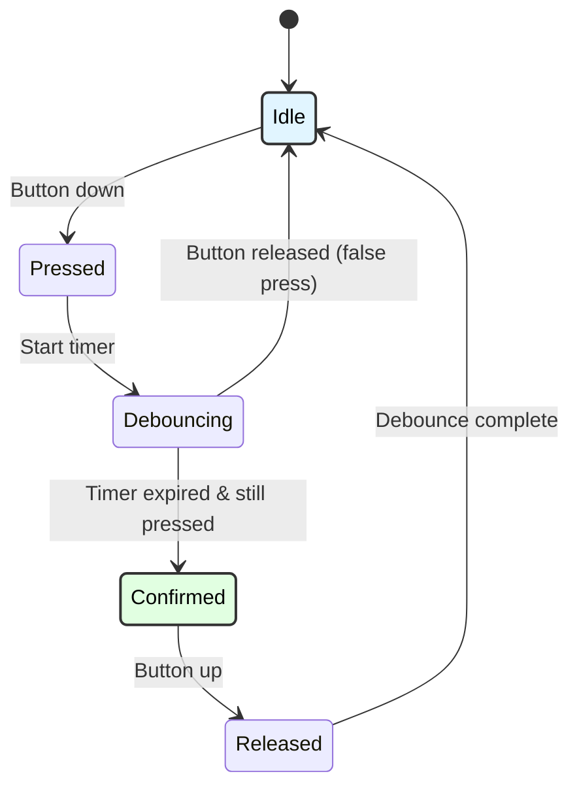

# Advanced Keypad Debouncing
## ATmega128 Embedded Systems Course

**Reference**: [ATmega128 Datasheet](https://ww1.microchip.com/downloads/en/DeviceDoc/doc2467.pdf)

---

## Slide 1: Introduction to Debouncing

### Why Debounce?
- **Mechanical switches bounce** (contacts vibrate)
- **Multiple triggers** from single press
- **Unreliable input** without debouncing
- **Critical for user interfaces**

### Switch Bounce Behavior
```
Ideal:
     ┌─────────────
  ───┘

Reality:
     ┌──┐┌┐┌──────
  ───┘  └┘└┘
     ↑
  Bounces (5-50ms)
```

### Bounce Characteristics
```
Typical button bounce:
- Duration: 5-50 ms
- Frequency: 100-1000 Hz
- Bounces per press: 2-10

Effects without debouncing:
- Single press → multiple characters
- Menu navigation skips items
- Counter increments too fast
- Unreliable state detection
```

---

## Slide 2: Simple Delay Debouncing

### Basic Delay Method
```c
#define DEBOUNCE_DELAY_MS 50

uint8_t button_pressed(void) {
    // Read button state
    if (!(PINA & (1 << PA0))) {  // Button pressed (active low)
        _delay_ms(DEBOUNCE_DELAY_MS);  // Wait for bounce to settle
        
        if (!(PINA & (1 << PA0))) {  // Still pressed?
            return 1;  // Valid press
        }
    }
    
    return 0;  // Not pressed or bouncing
}

// Wait for button release
void button_wait_release(void) {
    while (!(PINA & (1 << PA0)));  // Wait for release
    _delay_ms(DEBOUNCE_DELAY_MS);   // Debounce release
}

// Usage
if (button_pressed()) {
    printf("Button pressed!\n");
    button_wait_release();
}
```

### Limitations of Delay Debouncing
```
✗ Blocking (CPU can't do other tasks)
✗ Fixed delay (not adaptive)
✗ Wastes CPU cycles
✓ Simple to implement
✓ Works for basic applications
```

---

## Slide 3: State Machine Debouncing

### Debounce States


### State Machine Implementation
```c
typedef enum {
    BTN_STATE_IDLE,
    BTN_STATE_PRESSED,
    BTN_STATE_DEBOUNCING,
    BTN_STATE_CONFIRMED,
    BTN_STATE_RELEASED
} button_state_t;

button_state_t btn_state = BTN_STATE_IDLE;
uint16_t debounce_counter = 0;

#define DEBOUNCE_COUNT 5  // 5 consecutive stable readings

void button_update(void) {
    uint8_t button_raw = !(PINA & (1 << PA0));  // 1 = pressed
    
    switch (btn_state) {
        case BTN_STATE_IDLE:
            if (button_raw) {
                btn_state = BTN_STATE_PRESSED;
                debounce_counter = 0;
            }
            break;
            
        case BTN_STATE_PRESSED:
            btn_state = BTN_STATE_DEBOUNCING;
            break;
            
        case BTN_STATE_DEBOUNCING:
            if (button_raw) {
                debounce_counter++;
                if (debounce_counter >= DEBOUNCE_COUNT) {
                    btn_state = BTN_STATE_CONFIRMED;
                    // Trigger action here
                    printf("Button confirmed!\n");
                }
            } else {
                // False alarm, button released during debounce
                btn_state = BTN_STATE_IDLE;
            }
            break;
            
        case BTN_STATE_CONFIRMED:
            if (!button_raw) {
                btn_state = BTN_STATE_RELEASED;
                debounce_counter = 0;
            }
            break;
            
        case BTN_STATE_RELEASED:
            if (!button_raw) {
                debounce_counter++;
                if (debounce_counter >= DEBOUNCE_COUNT) {
                    btn_state = BTN_STATE_IDLE;
                }
            } else {
                // Button pressed again during release debounce
                btn_state = BTN_STATE_CONFIRMED;
            }
            break;
    }
}

// Call this from timer ISR or main loop (every 1-10ms)
int main(void) {
    while (1) {
        button_update();
        _delay_ms(10);  // 10ms polling interval
    }
}
```

---

## Slide 4: Sampling Debouncing

### Multi-Sample Voting
```c
#define SAMPLE_COUNT 8

uint8_t sample_buffer[SAMPLE_COUNT] = {0};
uint8_t sample_index = 0;

uint8_t button_debounced(void) {
    // Shift in new sample
    sample_buffer[sample_index] = !(PINA & (1 << PA0));
    sample_index = (sample_index + 1) % SAMPLE_COUNT;
    
    // Count '1's in buffer
    uint8_t count = 0;
    for (uint8_t i = 0; i < SAMPLE_COUNT; i++) {
        if (sample_buffer[i]) count++;
    }
    
    // Majority voting: if > 50% samples are '1', button is pressed
    return (count > (SAMPLE_COUNT / 2)) ? 1 : 0;
}

// Call every 1-5ms
ISR(TIMER0_COMP_vect) {
    static uint8_t btn_prev = 0;
    uint8_t btn_curr = button_debounced();
    
    // Detect edge (pressed event)
    if (btn_curr && !btn_prev) {
        // Button press detected
        // Set flag or increment counter
    }
    
    btn_prev = btn_curr;
}
```

---

## Slide 5: Integration Debouncing

### Integrator Counter Method
```c
#define INTEGRATOR_MAX    10
#define INTEGRATOR_MIN    0
#define INTEGRATOR_THRESHOLD 8

uint8_t integrator = 0;
uint8_t button_state = 0;

void button_integrator_update(void) {
    uint8_t button_raw = !(PINA & (1 << PA0));
    
    if (button_raw) {
        // Button pressed, increment integrator
        if (integrator < INTEGRATOR_MAX) {
            integrator++;
        }
    } else {
        // Button released, decrement integrator
        if (integrator > INTEGRATOR_MIN) {
            integrator--;
        }
    }
    
    // Update debounced state
    if (integrator >= INTEGRATOR_THRESHOLD) {
        button_state = 1;  // Pressed
    } else if (integrator <= (INTEGRATOR_MAX - INTEGRATOR_THRESHOLD)) {
        button_state = 0;  // Released
    }
}

uint8_t button_get_state(void) {
    return button_state;
}

// Call every 1-10ms
ISR(TIMER0_COMP_vect) {
    button_integrator_update();
}
```

---

## Slide 6: Matrix Keypad Debouncing

### 4×4 Keypad Scanning with Debounce
```c
#define ROW_PORT PORTA
#define COL_PORT PORTC
#define COL_PIN  PINC

#define ROWS 4
#define COLS 4

const char keymap[ROWS][COLS] = {
    {'1', '2', '3', 'A'},
    {'4', '5', '6', 'B'},
    {'7', '8', '9', 'C'},
    {'*', '0', '#', 'D'}
};

typedef struct {
    char key;
    uint8_t state;         // 0=idle, 1=pressed, 2=confirmed, 3=released
    uint8_t debounce_count;
} key_state_t;

key_state_t key_states[ROWS * COLS];

void keypad_debounce_update(void) {
    for (uint8_t row = 0; row < ROWS; row++) {
        // Drive row low
        ROW_PORT = ~(1 << row);
        _delay_us(10);  // Settling time
        
        for (uint8_t col = 0; col < COLS; col++) {
            uint8_t key_index = row * COLS + col;
            uint8_t pressed = !(COL_PIN & (1 << col));  // Column low = key pressed
            
            key_state_t *ks = &key_states[key_index];
            
            switch (ks->state) {
                case 0:  // Idle
                    if (pressed) {
                        ks->state = 1;
                        ks->debounce_count = 0;
                    }
                    break;
                    
                case 1:  // Pressed (debouncing)
                    if (pressed) {
                        ks->debounce_count++;
                        if (ks->debounce_count >= 3) {
                            ks->state = 2;  // Confirmed
                            ks->key = keymap[row][col];
                            // Trigger key press event
                            keypad_on_key_press(ks->key);
                        }
                    } else {
                        ks->state = 0;  // False alarm
                    }
                    break;
                    
                case 2:  // Confirmed (waiting for release)
                    if (!pressed) {
                        ks->state = 3;
                        ks->debounce_count = 0;
                    }
                    break;
                    
                case 3:  // Released (debouncing)
                    if (!pressed) {
                        ks->debounce_count++;
                        if (ks->debounce_count >= 3) {
                            ks->state = 0;  // Back to idle
                        }
                    } else {
                        ks->state = 2;  // Still pressed
                    }
                    break;
            }
        }
    }
}

void keypad_on_key_press(char key) {
    printf("Key pressed: %c\n", key);
}

// Call every 10ms
ISR(TIMER0_COMP_vect) {
    keypad_debounce_update();
}
```

---

## Slide 7: Adaptive Debouncing

### Dynamic Debounce Threshold
```c
typedef struct {
    uint8_t threshold;  // Current debounce threshold
    uint8_t false_presses;  // Count of false triggers
    uint8_t good_presses;   // Count of good presses
} adaptive_debounce_t;

adaptive_debounce_t debounce = {5, 0, 0};  // Start with threshold=5

void adaptive_debounce_update(uint8_t button_raw) {
    static uint8_t integrator = 0;
    static uint8_t prev_state = 0;
    static uint16_t press_duration = 0;
    
    if (button_raw) {
        integrator++;
    } else {
        if (integrator > 0) integrator--;
    }
    
    uint8_t curr_state = (integrator >= debounce.threshold) ? 1 : 0;
    
    // Detect press edge
    if (curr_state && !prev_state) {
        press_duration = 0;  // Start measuring
    }
    
    // Measure press duration
    if (curr_state) {
        press_duration++;
    }
    
    // Detect release edge
    if (!curr_state && prev_state) {
        // Analyze press duration
        if (press_duration < 3) {
            // Very short press (likely bounce)
            debounce.false_presses++;
            
            // Increase threshold to reduce false triggers
            if (debounce.false_presses > 5 && debounce.threshold < 15) {
                debounce.threshold++;
                debounce.false_presses = 0;
                printf("Increased debounce threshold to %d\n", debounce.threshold);
            }
        } else {
            // Good press
            debounce.good_presses++;
            
            // Decrease threshold for better responsiveness (if stable)
            if (debounce.good_presses > 20 && debounce.threshold > 3) {
                debounce.threshold--;
                debounce.good_presses = 0;
                printf("Decreased debounce threshold to %d\n", debounce.threshold);
            }
        }
    }
    
    prev_state = curr_state;
}
```

---

## Slide 8: Hardware Debouncing

### RC Filter Debouncing
```
Button with RC low-pass filter:

   Button (active low)
      │
      ├───── 10kΩ ─────┬──── To ATmega128 input
      │                │
     GND            100nF
                      │
                     GND

Time constant: τ = RC = 10kΩ × 100nF = 1ms
Bounce suppressed below ~5ms
```

### Schmitt Trigger Debouncing
```
Using 74HC14 Schmitt trigger inverter:

   Button ────┬──── 74HC14 ────→ ATmega128
              │         
             10kΩ
              │
             VCC

Hysteresis provides noise immunity
Typical thresholds: 1.6V (low), 3.4V (high)
```

---

## Slide 9: Application - Secure Keypad Entry

### Debounced PIN Entry
```c
#define PIN_LENGTH 4

char entered_pin[PIN_LENGTH + 1] = {0};
uint8_t pin_index = 0;

void secure_pin_entry(void) {
    lcd_init();
    keypad_init();
    
    lcd_puts("Enter PIN:");
    
    while (1) {
        char key = keypad_getchar_debounced();  // Blocks until key press
        
        if (key >= '0' && key <= '9') {
            // Digit entered
            if (pin_index < PIN_LENGTH) {
                entered_pin[pin_index++] = key;
                lcd_gotoxy(pin_index - 1, 1);
                lcd_putc('*');  // Display asterisk for security
            }
        } else if (key == '#') {
            // Submit PIN
            if (pin_index == PIN_LENGTH) {
                entered_pin[PIN_LENGTH] = '\0';
                
                if (verify_pin(entered_pin)) {
                    lcd_clear();
                    lcd_puts("Access Granted");
                    unlock_door();
                } else {
                    lcd_clear();
                    lcd_puts("Access Denied");
                }
                
                // Reset
                pin_index = 0;
                memset(entered_pin, 0, PIN_LENGTH + 1);
                _delay_ms(2000);
                
                lcd_clear();
                lcd_puts("Enter PIN:");
            }
        } else if (key == '*') {
            // Clear
            pin_index = 0;
            memset(entered_pin, 0, PIN_LENGTH + 1);
            lcd_gotoxy(0, 1);
            lcd_puts("    ");
        }
    }
}

char keypad_getchar_debounced(void) {
    static uint8_t last_key_states[16] = {0};
    
    while (1) {
        keypad_debounce_update();  // Update all key states
        
        // Check for newly confirmed press
        for (uint8_t i = 0; i < 16; i++) {
            if (key_states[i].state == 2 && last_key_states[i] != 2) {
                // New confirmed press
                last_key_states[i] = 2;
                return key_states[i].key;
            } else if (key_states[i].state == 0) {
                last_key_states[i] = 0;
            }
        }
        
        _delay_ms(10);
    }
}
```

---

## Slide 10: Performance Comparison

### Debounce Method Comparison
```
Method              | CPU Load | Response | Reliability | Complexity
--------------------|----------|----------|-------------|------------
Simple Delay        | High     | Slow     | Good        | Low
State Machine       | Low      | Fast     | Excellent   | Medium
Multi-Sample        | Medium   | Medium   | Excellent   | Medium
Integrator          | Low      | Fast     | Excellent   | Low
Adaptive            | Medium   | Variable | Excellent   | High
Hardware RC         | None     | Fast     | Good        | Low (HW)
Hardware Schmitt    | None     | Fast     | Excellent   | Low (HW)
```

### Recommended Configurations
```c
// For critical applications (door locks, alarms)
#define DEBOUNCE_SAMPLES    8
#define DEBOUNCE_THRESHOLD  7  // 87.5% agreement required

// For general UI (calculators, menus)
#define DEBOUNCE_SAMPLES    5
#define DEBOUNCE_THRESHOLD  4  // 80% agreement

// For high-speed input (gaming, data entry)
#define DEBOUNCE_SAMPLES    3
#define DEBOUNCE_THRESHOLD  3  // 100% agreement (fast but strict)
```

---

## Slide 11: Troubleshooting

### Common Issues

| Problem | Cause | Solution |
|---------|-------|----------|
| **Multiple characters per press** | No debouncing | Implement debounce algorithm |
| **Missed key presses** | Debounce too aggressive | Reduce threshold/delay |
| **Slow response** | Long debounce delay | Optimize debounce parameters |
| **Inconsistent behavior** | Mechanical wear | Replace button, increase threshold |
| **False triggers** | Electrical noise | Add hardware filter, shielding |
| **Works sometimes** | Polling too slow | Increase scan rate to 100-1000 Hz |

### Debug Code
```c
void debug_debounce(void) {
    uart_init();
    
    printf("Debounce Debug\n");
    printf("--------------\n");
    
    while (1) {
        uint8_t raw = !(PINA & (1 << PA0));
        uint8_t debounced = button_debounced();
        
        printf("Raw: %d  Debounced: %d  Integrator: %d\n",
               raw, debounced, integrator);
        
        _delay_ms(100);
    }
}
```

---

## Slide 12: Summary

### Key Concepts

✓ **Mechanical bounce**: Switches vibrate for 5-50ms  
✓ **Debouncing**: Filter out false triggers  
✓ **Methods**: Delay, state machine, sampling, integration  
✓ **Hardware**: RC filters, Schmitt triggers  
✓ **Matrix keypad**: Debounce each key individually  
✓ **Adaptive**: Adjust threshold based on behavior  

### Best Practices
- **Poll at 100-1000 Hz** for responsive input
- **State machine** for complex applications
- **Integration** for best balance of speed/reliability
- **Hardware filter** for electrically noisy environments
- **Test thoroughly** with actual hardware

### Applications
- Keypads and buttons
- User interfaces
- Security systems
- Industrial controls
- Gaming inputs

---

## Slide 13: Practice Exercises

### Exercise 1: Simple Debounce
**Goal**: Implement delay-based debouncing
- Connect button to PA0
- Detect press with 50ms delay
- Display count on LCD
- Compare with/without debounce

### Exercise 2: State Machine
**Goal**: Implement state-based debouncing
- Create state machine (idle/pressed/confirmed/released)
- Require 5 consecutive samples
- Measure response time
- Display state on LCD

### Exercise 3: Multi-Sample Voting
**Goal**: Implement majority voting debounce
- Use 8-sample buffer
- Calculate majority vote
- Detect press/release edges
- Compare with simple delay

### Exercise 4: Adaptive Debounce
**Goal**: Implement self-adjusting threshold
- Start with threshold=5
- Increase if false triggers detected
- Decrease if stable for long time
- Log threshold changes

### Exercise 5: Matrix Keypad
**Goal**: Debounce 4×4 keypad
- Scan rows sequentially
- Debounce each key separately
- Implement state machine per key
- Handle multiple simultaneous presses

---

# End of Slides

**Questions?**

For more information, see:
- [ATmega128 Datasheet](https://ww1.microchip.com/downloads/en/DeviceDoc/doc2467.pdf)
- Project source code in `Keypad_Advanced_Debounce/`
- Shared libraries: `_keypad.h`, `_debounce.h`
