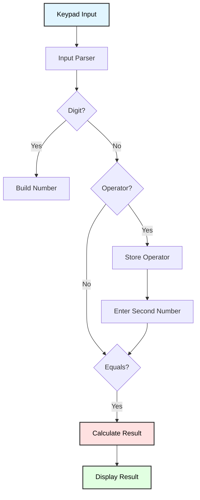
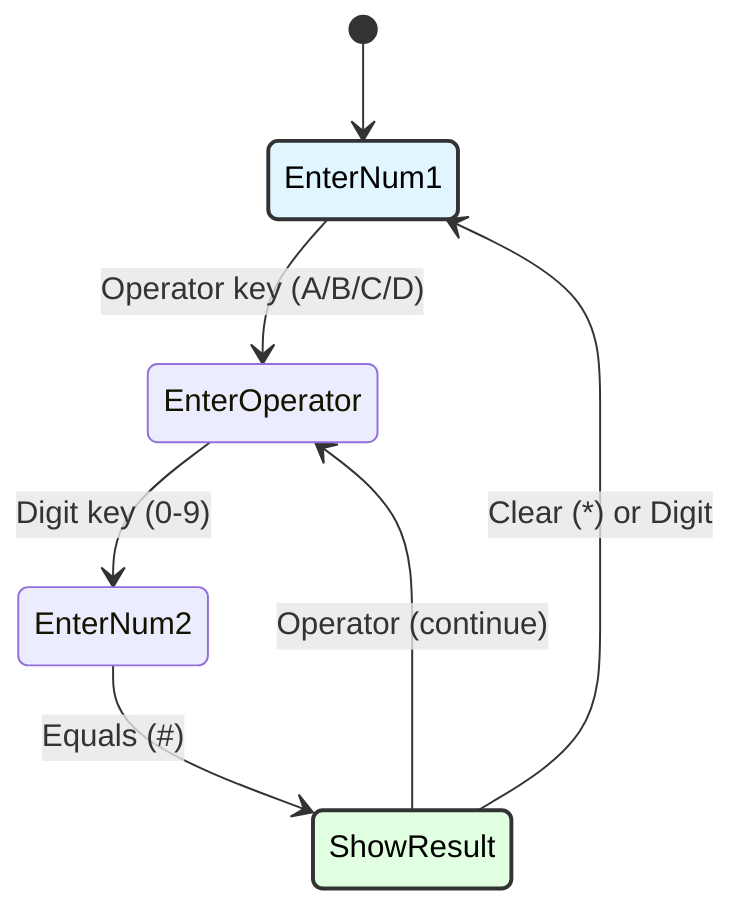

# Keypad Calculator Application
## ATmega128 Embedded Systems Course

**Reference**: [ATmega128 Datasheet](https://ww1.microchip.com/downloads/en/DeviceDoc/doc2467.pdf)

---

## Slide 1: Introduction to Calculator Application

### Project Overview
- **Full-featured calculator** using matrix keypad
- **LCD display** for input/output
- **Four arithmetic operations** (+, -, ×, ÷)
- **Error handling** (division by zero, overflow)
- **State-based input** processing

### Calculator Architecture


### Keypad Layout
```
Calculator Keypad (4×4):
┌───┬───┬───┬───┐
│ 1 │ 2 │ 3 │ A │  A = Add (+)
├───┼───┼───┼───┤
│ 4 │ 5 │ 6 │ B │  B = Subtract (-)
├───┼───┼───┼───┤
│ 7 │ 8 │ 9 │ C │  C = Multiply (×)
├───┼───┼───┼───┤
│ * │ 0 │ # │ D │  D = Divide (÷)
└───┴───┴───┴───┘

* = Clear (reset)
# = Equals (=)
```

---

## Slide 2: Calculator State Machine

### Operation States
```c
typedef enum {
    CALC_STATE_ENTER_NUM1,     // Entering first operand
    CALC_STATE_ENTER_OPERATOR, // Operator selected
    CALC_STATE_ENTER_NUM2,     // Entering second operand
    CALC_STATE_SHOW_RESULT     // Display result
} calc_state_t;

calc_state_t calc_state = CALC_STATE_ENTER_NUM1;
```

### State Transitions


---

## Slide 3: Basic Calculator Implementation

### Global Variables
```c
int32_t operand1 = 0;      // First number
int32_t operand2 = 0;      // Second number
int32_t result = 0;        // Calculation result
char operation = '\0';     // '+', '-', '*', '/'
uint8_t entering_second = 0;  // Flag: entering operand2
uint8_t show_result = 0;   // Flag: displaying result
```

### Main Calculator Loop
```c
void calculator_main(void) {
    lcd_init();
    keypad_init();
    
    lcd_clear();
    lcd_puts_at(0, 0, "Calculator");
    lcd_puts_at(1, 0, "0");
    
    while (1) {
        char key = keypad_getchar();  // Get debounced key
        
        if (key >= '0' && key <= '9') {
            handle_digit(key);
        } else if (key == 'A' || key == 'B' || key == 'C' || key == 'D') {
            handle_operator(key);
        } else if (key == '#') {
            handle_equals();
        } else if (key == '*') {
            handle_clear();
        }
    }
}
```

---

## Slide 4: Digit Entry

### Handle Digit Input
```c
void handle_digit(char key) {
    if (show_result) {
        // Start new calculation after showing result
        operand1 = 0;
        operand2 = 0;
        operation = '\0';
        entering_second = 0;
        show_result = 0;
    }
    
    if (!entering_second) {
        // Building first operand
        operand1 = operand1 * 10 + (key - '0');
        
        // Prevent overflow (limit to 4 digits)
        if (operand1 > 9999) {
            operand1 = 9999;
        }
        
        // Update display
        lcd_gotoxy(0, 1);
        char buf[17];
        sprintf(buf, "%ld       ", operand1);
        lcd_puts(buf);
    } else {
        // Building second operand
        operand2 = operand2 * 10 + (key - '0');
        
        if (operand2 > 9999) {
            operand2 = 9999;
        }
        
        // Update display (show: operand1 operator operand2)
        lcd_gotoxy(0, 1);
        char buf[17];
        sprintf(buf, "%ld%c%ld    ", operand1, operation, operand2);
        lcd_puts(buf);
    }
}
```

---

## Slide 5: Operator Handling

### Handle Operator Keys
```c
void handle_operator(char key) {
    if (show_result) {
        // Continue with previous result
        operand1 = result;
        operand2 = 0;
        show_result = 0;
    }
    
    // Map keypad letter to operator symbol
    switch (key) {
        case 'A': operation = '+'; break;
        case 'B': operation = '-'; break;
        case 'C': operation = '*'; break;
        case 'D': operation = '/'; break;
    }
    
    entering_second = 1;
    operand2 = 0;
    
    // Display: operand1 operator
    lcd_gotoxy(0, 1);
    char buf[17];
    sprintf(buf, "%ld%c       ", operand1, operation);
    lcd_puts(buf);
}
```

---

## Slide 6: Calculate Result

### Handle Equals Key
```c
void handle_equals(void) {
    if (operation == '\0' || !entering_second) {
        return;  // No operation selected
    }
    
    // Perform calculation
    switch (operation) {
        case '+':
            result = operand1 + operand2;
            break;
            
        case '-':
            result = operand1 - operand2;
            break;
            
        case '*':
            result = operand1 * operand2;
            break;
            
        case '/':
            if (operand2 == 0) {
                // Division by zero error
                lcd_clear();
                lcd_puts_at(0, 0, "Error!");
                lcd_puts_at(1, 0, "Divide by zero");
                _delay_ms(2000);
                
                handle_clear();
                return;
            }
            result = operand1 / operand2;
            break;
    }
    
    // Check for overflow (16-bit range)
    if (result > 9999 || result < -9999) {
        lcd_clear();
        lcd_puts_at(0, 0, "Error!");
        lcd_puts_at(1, 0, "Overflow");
        _delay_ms(2000);
        
        handle_clear();
        return;
    }
    
    // Display result
    lcd_gotoxy(0, 1);
    char buf[17];
    sprintf(buf, "=%ld      ", result);
    lcd_puts(buf);
    
    show_result = 1;
}
```

---

## Slide 7: Clear and Reset

### Handle Clear Key
```c
void handle_clear(void) {
    operand1 = 0;
    operand2 = 0;
    result = 0;
    operation = '\0';
    entering_second = 0;
    show_result = 0;
    
    lcd_clear();
    lcd_puts_at(0, 0, "Calculator");
    lcd_puts_at(1, 0, "0");
}
```

### Backspace Function
```c
void handle_backspace(void) {
    if (!entering_second) {
        operand1 /= 10;  // Remove last digit
        
        lcd_gotoxy(0, 1);
        char buf[17];
        sprintf(buf, "%ld       ", operand1);
        lcd_puts(buf);
    } else {
        operand2 /= 10;
        
        lcd_gotoxy(0, 1);
        char buf[17];
        sprintf(buf, "%ld%c%ld    ", operand1, operation, operand2);
        lcd_puts(buf);
    }
}
```

---

## Slide 8: Advanced Features - Multi-Digit Display

### Scrolling Long Numbers
```c
void display_number_scroll(int32_t number) {
    char buf[20];
    sprintf(buf, "%ld", number);
    
    uint8_t len = strlen(buf);
    
    if (len > 16) {
        // Scroll if number is too long for LCD
        for (uint8_t i = 0; i <= len - 16; i++) {
            lcd_gotoxy(0, 1);
            lcd_puts(&buf[i]);
            _delay_ms(500);
        }
    } else {
        lcd_gotoxy(0, 1);
        lcd_puts(buf);
    }
}
```

### Right-Aligned Display
```c
void display_number_right_align(int32_t number) {
    char buf[17];
    sprintf(buf, "%16ld", number);  // Right-aligned in 16 chars
    
    lcd_gotoxy(0, 1);
    lcd_puts(buf);
}
```

---

## Slide 9: Scientific Calculator Features

### Add Square Root
```c
#include <math.h>

void handle_square_root(void) {
    if (operand1 < 0) {
        lcd_clear();
        lcd_puts_at(0, 0, "Error!");
        lcd_puts_at(1, 0, "√ Negative");
        _delay_ms(2000);
        return;
    }
    
    result = (int32_t)sqrt((double)operand1);
    
    lcd_gotoxy(0, 1);
    char buf[17];
    sprintf(buf, "√%ld=%ld  ", operand1, result);
    lcd_puts(buf);
    
    show_result = 1;
}
```

### Add Power Function
```c
void handle_power(void) {
    result = 1;
    
    for (uint8_t i = 0; i < operand2; i++) {
        result *= operand1;
        
        if (result > 9999) {
            // Overflow
            lcd_clear();
            lcd_puts_at(0, 0, "Overflow!");
            _delay_ms(2000);
            handle_clear();
            return;
        }
    }
    
    lcd_gotoxy(0, 1);
    char buf[17];
    sprintf(buf, "%ld^%ld=%ld ", operand1, operand2, result);
    lcd_puts(buf);
    
    show_result = 1;
}
```

---

## Slide 10: Floating-Point Calculator

### Float Support
```c
float operand1_float = 0.0;
float operand2_float = 0.0;
float result_float = 0.0;

void calculate_float(void) {
    switch (operation) {
        case '+':
            result_float = operand1_float + operand2_float;
            break;
        case '-':
            result_float = operand1_float - operand2_float;
            break;
        case '*':
            result_float = operand1_float * operand2_float;
            break;
        case '/':
            if (operand2_float == 0.0) {
                lcd_clear();
                lcd_puts_at(0, 0, "Div by zero!");
                _delay_ms(2000);
                return;
            }
            result_float = operand1_float / operand2_float;
            break;
    }
    
    lcd_gotoxy(0, 1);
    char buf[17];
    sprintf(buf, "=%.2f   ", result_float);  // 2 decimal places
    lcd_puts(buf);
}
```

---

## Slide 11: Application - RPN Calculator

### Reverse Polish Notation
```
RPN (Reverse Polish Notation):
Standard:  3 + 4 = 7
RPN:       3 4 + = 7

Advantage: No parentheses needed
Example:   (3 + 4) × 5 = 35
RPN:       3 4 + 5 × = 35
```

### RPN Stack Implementation
```c
#define STACK_SIZE 8
int32_t stack[STACK_SIZE];
uint8_t stack_ptr = 0;

void stack_push(int32_t value) {
    if (stack_ptr < STACK_SIZE) {
        stack[stack_ptr++] = value;
    } else {
        lcd_clear();
        lcd_puts_at(0, 0, "Stack overflow!");
        _delay_ms(2000);
    }
}

int32_t stack_pop(void) {
    if (stack_ptr > 0) {
        return stack[--stack_ptr];
    } else {
        lcd_clear();
        lcd_puts_at(0, 0, "Stack underflow!");
        _delay_ms(2000);
        return 0;
    }
}

void rpn_calculate(char op) {
    int32_t b = stack_pop();
    int32_t a = stack_pop();
    int32_t result;
    
    switch (op) {
        case '+': result = a + b; break;
        case '-': result = a - b; break;
        case '*': result = a * b; break;
        case '/': 
            if (b == 0) {
                lcd_puts_at(0, 1, "Div by zero!");
                stack_push(a);  // Restore stack
                stack_push(b);
                return;
            }
            result = a / b;
            break;
    }
    
    stack_push(result);
    
    lcd_gotoxy(0, 1);
    char buf[17];
    sprintf(buf, "=%ld     ", result);
    lcd_puts(buf);
}
```

---

## Slide 12: Memory Functions

### Calculator Memory (M+, M-, MR, MC)
```c
int32_t memory = 0;
uint8_t memory_indicator = 0;  // Show 'M' on display if memory != 0

void memory_add(void) {
    memory += result;
    memory_indicator = 1;
    
    lcd_gotoxy(15, 0);
    lcd_putc('M');  // Show memory indicator
}

void memory_subtract(void) {
    memory -= result;
    memory_indicator = (memory != 0) ? 1 : 0;
    
    if (memory_indicator) {
        lcd_gotoxy(15, 0);
        lcd_putc('M');
    } else {
        lcd_gotoxy(15, 0);
        lcd_putc(' ');
    }
}

void memory_recall(void) {
    operand1 = memory;
    
    lcd_gotoxy(0, 1);
    char buf[17];
    sprintf(buf, "MR=%ld    ", memory);
    lcd_puts(buf);
}

void memory_clear(void) {
    memory = 0;
    memory_indicator = 0;
    
    lcd_gotoxy(15, 0);
    lcd_putc(' ');
}

// Example key mappings:
// Long press '1' = M+
// Long press '2' = M-
// Long press '3' = MR
// Long press '4' = MC
```

---

## Slide 13: Expression History

### Store Calculation History
```c
typedef struct {
    int32_t op1;
    char operator;
    int32_t op2;
    int32_t result;
} calc_history_t;

#define HISTORY_SIZE 10
calc_history_t history[HISTORY_SIZE];
uint8_t history_index = 0;

void add_to_history(int32_t a, char op, int32_t b, int32_t res) {
    history[history_index].op1 = a;
    history[history_index].operator = op;
    history[history_index].op2 = b;
    history[history_index].result = res;
    
    history_index = (history_index + 1) % HISTORY_SIZE;
}

void display_history(void) {
    lcd_clear();
    lcd_puts_at(0, 0, "History:");
    
    for (uint8_t i = 0; i < HISTORY_SIZE; i++) {
        uint8_t idx = (history_index + i) % HISTORY_SIZE;
        
        if (history[idx].operator == '\0') continue;  // Empty entry
        
        char buf[17];
        sprintf(buf, "%ld%c%ld=%ld",
                history[idx].op1,
                history[idx].operator,
                history[idx].op2,
                history[idx].result);
        
        lcd_gotoxy(0, 1);
        lcd_puts(buf);
        
        _delay_ms(2000);  // Show each entry for 2 seconds
    }
}
```

---

## Slide 14: Error Handling

### Comprehensive Error Checking
```c
typedef enum {
    CALC_ERROR_NONE,
    CALC_ERROR_DIV_ZERO,
    CALC_ERROR_OVERFLOW,
    CALC_ERROR_UNDERFLOW,
    CALC_ERROR_INVALID_OP
} calc_error_t;

calc_error_t last_error = CALC_ERROR_NONE;

void display_error(calc_error_t error) {
    lcd_clear();
    lcd_puts_at(0, 0, "Error!");
    
    switch (error) {
        case CALC_ERROR_DIV_ZERO:
            lcd_puts_at(1, 0, "Divide by zero");
            break;
        case CALC_ERROR_OVERFLOW:
            lcd_puts_at(1, 0, "Overflow");
            break;
        case CALC_ERROR_UNDERFLOW:
            lcd_puts_at(1, 0, "Underflow");
            break;
        case CALC_ERROR_INVALID_OP:
            lcd_puts_at(1, 0, "Invalid op");
            break;
        default:
            lcd_puts_at(1, 0, "Unknown");
    }
    
    _delay_ms(2000);
    handle_clear();
}

calc_error_t check_calculation(void) {
    // Check division by zero
    if (operation == '/' && operand2 == 0) {
        return CALC_ERROR_DIV_ZERO;
    }
    
    // Estimate result before calculating (prevent overflow)
    int32_t estimated_result;
    
    switch (operation) {
        case '+':
            estimated_result = operand1 + operand2;
            break;
        case '-':
            estimated_result = operand1 - operand2;
            break;
        case '*':
            // Check for potential overflow
            if (operand1 > 0 && operand2 > 0 && operand1 > (INT32_MAX / operand2)) {
                return CALC_ERROR_OVERFLOW;
            }
            estimated_result = operand1 * operand2;
            break;
        case '/':
            estimated_result = operand1 / operand2;
            break;
        default:
            return CALC_ERROR_INVALID_OP;
    }
    
    if (estimated_result > 9999) {
        return CALC_ERROR_OVERFLOW;
    }
    if (estimated_result < -9999) {
        return CALC_ERROR_UNDERFLOW;
    }
    
    return CALC_ERROR_NONE;
}
```

---

## Slide 15: Troubleshooting

### Common Issues

| Problem | Cause | Solution |
|---------|-------|----------|
| **Wrong results** | Operator precedence | Use state machine, calculate immediately |
| **Numbers don't appear** | LCD update issue | Call lcd_puts() after each change |
| **Overflow not caught** | No range checking | Check before calculation |
| **Division by zero crash** | No error handling | Check operand2 before divide |
| **Keys repeat** | No debouncing | Implement proper debounce |
| **Display garbled** | Buffer overflow | Limit number length to 16 chars |

### Debug Output
```c
void debug_calculator_state(void) {
    printf("\n=== Calculator State ===\n");
    printf("Operand 1: %ld\n", operand1);
    printf("Operator:  %c\n", operation ? operation : '?');
    printf("Operand 2: %ld\n", operand2);
    printf("Result:    %ld\n", result);
    printf("Entering 2nd: %d\n", entering_second);
    printf("Show result:  %d\n", show_result);
    printf("========================\n\n");
}
```

---

## Slide 16: Summary

### Key Concepts

✓ **State machine**: Track input stage (num1, operator, num2, result)  
✓ **Input parsing**: Distinguish digits, operators, equals, clear  
✓ **Number building**: Multiply by 10 and add digit  
✓ **Arithmetic**: Implement +, -, ×, ÷  
✓ **Error handling**: Division by zero, overflow  
✓ **Display formatting**: Right-align, scrolling, indicators  

### Enhancements
- Floating-point support
- Scientific functions (√, ^, sin, cos)
- RPN mode
- Memory functions (M+, M-, MR, MC)
- Calculation history
- Parentheses support
- Multi-line expressions

### Applications
- Embedded calculators
- POS systems
- Industrial control panels
- Scientific instruments
- Educational tools

---

## Slide 17: Practice Exercises

### Exercise 1: Basic Calculator
**Goal**: Implement 4-function calculator
- Enter first number (digits)
- Select operator (A/B/C/D)
- Enter second number
- Press # for result
- Handle clear with *

### Exercise 2: Error Handling
**Goal**: Add comprehensive error checking
- Detect division by zero
- Prevent overflow (>9999)
- Display error messages
- Auto-clear after error

### Exercise 3: Memory Functions
**Goal**: Add calculator memory
- M+ adds to memory
- M- subtracts from memory
- MR recalls memory
- MC clears memory
- Show 'M' indicator when memory active

### Exercise 4: RPN Calculator
**Goal**: Implement RPN (stack-based)
- Push numbers onto stack
- Pop two numbers for operations
- Push result back
- Display stack depth

### Exercise 5: Scientific Calculator
**Goal**: Add advanced functions
- Square root (√)
- Power (^)
- Percentage (%)
- Reciprocal (1/x)
- Display functions on LCD

---

# End of Slides

**Questions?**

For more information, see:
- [ATmega128 Datasheet](https://ww1.microchip.com/downloads/en/DeviceDoc/doc2467.pdf)
- Project source code in `Keypad_Calculator_App/`
- Shared libraries: `_keypad.h`, `_lcd.h`
