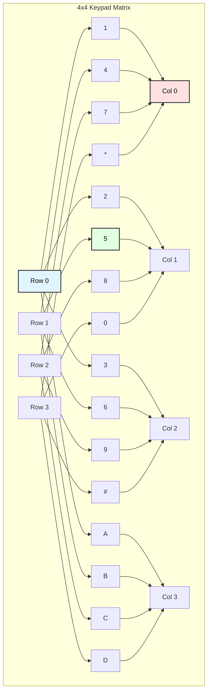
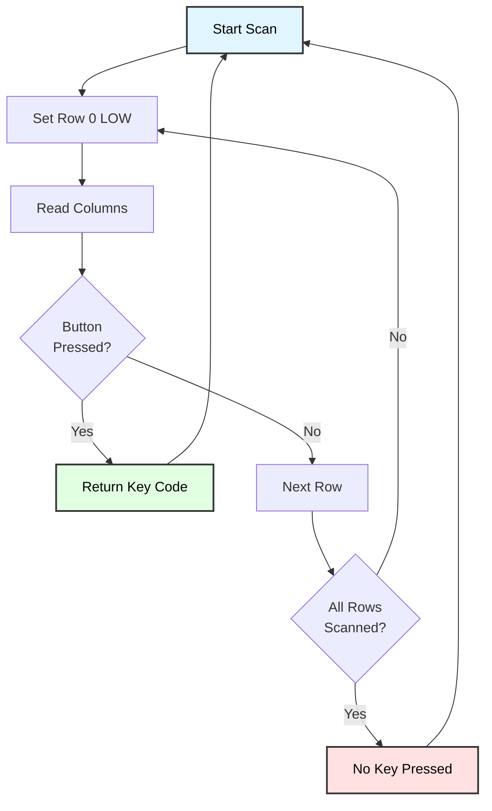
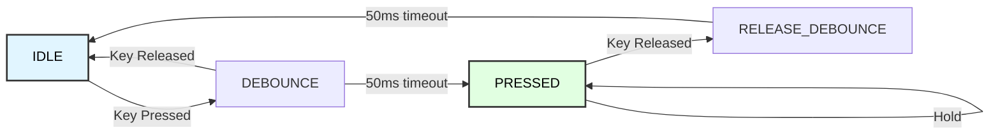

# Matrix Keypad Programming
## ATmega128 Embedded Systems Course

**Reference**: [ATmega128 Datasheet](https://ww1.microchip.com/downloads/en/DeviceDoc/doc2467.pdf)

---

## Slide 1: Introduction to Matrix Keypads

### What is a Matrix Keypad?
- **Array of buttons** arranged in rows and columns
- **Efficient scanning** - fewer pins than individual buttons
- Common sizes: **3x4** (12 keys), **4x4** (16 keys)
- Used for **numeric input**, **password entry**, **menu navigation**

### Matrix Keypad Structure


### Why Use Matrix Keypad?
✓ **Pin efficient**: 8 pins for 16 buttons (vs 16 pins)  
✓ **Cost effective**: Standard, readily available  
✓ **Easy interface**: Simple scanning algorithm  
✓ **Reliable**: Tactile feedback, long lifespan  

---

## Slide 2: Keypad Layout

### 4x4 Keypad Layout
```
     Col0  Col1  Col2  Col3
      │     │     │     │
Row0──┼─────┼─────┼─────┼───
      │  1  │  2  │  3  │ A
      │     │     │     │
Row1──┼─────┼─────┼─────┼───
      │  4  │  5  │  6  │ B
      │     │     │     │
Row2──┼─────┼─────┼─────┼───
      │  7  │  8  │  9  │ C
      │     │     │     │
Row3──┼─────┼─────┼─────┼───
      │  *  │  0  │  #  │ D
      │     │     │     │
```

### 3x4 Keypad Layout
```
     Col0  Col1  Col2
      │     │     │
Row0──┼─────┼─────┼───
      │  1  │  2  │  3
      │     │     │
Row1──┼─────┼─────┼───
      │  4  │  5  │  6
      │     │     │
Row2──┼─────┼─────┼───
      │  7  │  8  │  9
      │     │     │
Row3──┼─────┼─────┼───
      │  *  │  0  │  #
      │     │     │
```

### Electrical Connection
```
Each button connects one row to one column when pressed

Example: Pressing '5' connects Row1 to Col1

Row pins: Outputs (driven HIGH/LOW)
Column pins: Inputs (with pull-ups or pull-downs)
```

---

## Slide 3: Scanning Principle

### How Scanning Works
```
1. Drive one row LOW, others HIGH (or tri-state)
2. Read all column pins
3. If column is LOW, button at (row, col) is pressed
4. Move to next row
5. Repeat continuously
```

### Scanning Flow


### Example: Detecting '5' Press
```
Step 1: Row0 = LOW,  Cols = 111 (no press)
Step 2: Row1 = LOW,  Cols = 101 (Col1 is LOW!)
        → Key at (Row1, Col1) = '5' is pressed
```

---

## Slide 4: ATmega128 Pin Configuration

### Wiring Example (4x4 Keypad)
```
ATmega128          Keypad
---------          ------
PC0 (output) ───→  Row 0
PC1 (output) ───→  Row 1
PC2 (output) ───→  Row 2
PC3 (output) ───→  Row 3

PC4 (input)  ←───  Col 0
PC5 (input)  ←───  Col 1
PC6 (input)  ←───  Col 2
PC7 (input)  ←───  Col 3
```

### Pin Configuration
```c
#include <avr/io.h>

// Row pins (outputs)
#define ROW_PORT  PORTC
#define ROW_DDR   DDRC
#define ROW_MASK  0x0F  // PC0-PC3

// Column pins (inputs)
#define COL_PORT  PORTC
#define COL_DDR   DDRC
#define COL_PIN   PINC
#define COL_MASK  0xF0  // PC4-PC7

void keypad_init(void) {
    // Set rows as outputs
    ROW_DDR |= ROW_MASK;
    
    // Set columns as inputs with pull-ups
    COL_DDR &= ~COL_MASK;
    COL_PORT |= COL_MASK;  // Enable pull-ups
    
    // All rows HIGH initially
    ROW_PORT |= ROW_MASK;
}
```

---

## Slide 5: Basic Scanning Implementation

### Key Scanning Function
```c
#include <util/delay.h>

#define ROWS  4
#define COLS  4

// Keymap for 4x4 keypad
const char keymap[ROWS][COLS] = {
    {'1', '2', '3', 'A'},
    {'4', '5', '6', 'B'},
    {'7', '8', '9', 'C'},
    {'*', '0', '#', 'D'}
};

char keypad_scan(void) {
    for (uint8_t row = 0; row < ROWS; row++) {
        // Set all rows HIGH
        ROW_PORT |= ROW_MASK;
        
        // Set current row LOW
        ROW_PORT &= ~(1 << row);
        
        // Small delay for signal to settle
        _delay_us(5);
        
        // Read columns
        uint8_t col_state = (COL_PIN & COL_MASK) >> 4;
        
        // Check each column
        for (uint8_t col = 0; col < COLS; col++) {
            if (!(col_state & (1 << col))) {
                // Button pressed at (row, col)
                return keymap[row][col];
            }
        }
    }
    
    // No key pressed
    return '\0';
}

// Usage example
int main(void) {
    keypad_init();
    uart_init();
    
    while (1) {
        char key = keypad_scan();
        
        if (key != '\0') {
            printf("Key pressed: %c\n", key);
            _delay_ms(200);  // Simple debounce
        }
    }
}
```

---

## Slide 6: Debouncing

### Why Debounce?
```
Button press creates mechanical bounce:

Physical:  ┐ ┌┐┌┐  ┌────────
           └─┘└┘└──┘
           ↑
         Bounces

Want:      ┐  ┌──────────
           └──┘
           ↑
         Clean edge
```

### Software Debounce Methods
```c
// Method 1: Simple delay
char keypad_get_key_debounced(void) {
    char key = keypad_scan();
    
    if (key != '\0') {
        _delay_ms(50);  // Wait for bounce to settle
        
        // Confirm key still pressed
        char confirm = keypad_scan();
        if (confirm == key) {
            return key;
        }
    }
    
    return '\0';
}

// Method 2: Multi-sample
char keypad_get_key_stable(void) {
    char keys[5];
    
    // Read 5 times with small delays
    for (uint8_t i = 0; i < 5; i++) {
        keys[i] = keypad_scan();
        _delay_ms(10);
    }
    
    // Check if all samples are the same
    char first = keys[0];
    for (uint8_t i = 1; i < 5; i++) {
        if (keys[i] != first) {
            return '\0';  // Inconsistent
        }
    }
    
    return first;
}

// Method 3: State machine (see next slide)
```

---

## Slide 7: State Machine Debounce

### Debounce State Machine


### State Machine Implementation
```c
typedef enum {
    KEY_IDLE,
    KEY_DEBOUNCE,
    KEY_PRESSED,
    KEY_RELEASE_DEBOUNCE
} keypad_state_t;

keypad_state_t key_state = KEY_IDLE;
char last_key = '\0';
uint32_t debounce_timer = 0;

#define DEBOUNCE_TIME_MS  50

char keypad_get_key_sm(void) {
    char current_key = keypad_scan();
    char return_key = '\0';
    
    switch (key_state) {
        case KEY_IDLE:
            if (current_key != '\0') {
                last_key = current_key;
                debounce_timer = millis();
                key_state = KEY_DEBOUNCE;
            }
            break;
            
        case KEY_DEBOUNCE:
            if (current_key != last_key) {
                // False trigger
                key_state = KEY_IDLE;
            } else if (millis() - debounce_timer >= DEBOUNCE_TIME_MS) {
                // Stable press confirmed
                return_key = last_key;
                key_state = KEY_PRESSED;
            }
            break;
            
        case KEY_PRESSED:
            if (current_key != last_key) {
                // Key released
                debounce_timer = millis();
                key_state = KEY_RELEASE_DEBOUNCE;
            }
            break;
            
        case KEY_RELEASE_DEBOUNCE:
            if (current_key == last_key) {
                // Still pressed, return to PRESSED
                key_state = KEY_PRESSED;
            } else if (millis() - debounce_timer >= DEBOUNCE_TIME_MS) {
                // Release confirmed
                key_state = KEY_IDLE;
            }
            break;
    }
    
    return return_key;
}
```

---

## Slide 8: Wait for Key Press/Release

### Blocking Key Functions
```c
// Wait until a key is pressed
char keypad_wait_for_press(void) {
    char key;
    
    // Wait for no key
    while (keypad_scan() != '\0');
    
    // Wait for key press
    do {
        key = keypad_scan();
    } while (key == '\0');
    
    _delay_ms(50);  // Debounce
    
    return key;
}

// Wait for key to be released
void keypad_wait_for_release(void) {
    while (keypad_scan() != '\0');
    _delay_ms(50);  // Debounce
}

// Get single key press (press and release)
char keypad_get_single_key(void) {
    char key = keypad_wait_for_press();
    keypad_wait_for_release();
    return key;
}

// Example: Simple password entry
void enter_password(char *buffer, uint8_t max_len) {
    uint8_t index = 0;
    
    lcd_puts("Enter PIN:");
    lcd_gotoxy(0, 1);
    
    while (index < max_len) {
        char key = keypad_get_single_key();
        
        if (key >= '0' && key <= '9') {
            buffer[index++] = key;
            lcd_putc('*');  // Show asterisk
        } else if (key == '#') {
            break;  // Enter
        } else if (key == '*' && index > 0) {
            // Backspace
            index--;
            lcd_gotoxy(index, 1);
            lcd_putc(' ');
            lcd_gotoxy(index, 1);
        }
    }
    
    buffer[index] = '\0';
}
```

---

## Slide 9: Key Repeat (Auto-Repeat)

### Auto-Repeat Implementation
```c
#define REPEAT_DELAY_MS    500  // Initial delay before repeat
#define REPEAT_RATE_MS     100  // Repeat interval

typedef struct {
    char last_key;
    uint32_t press_time;
    uint32_t repeat_time;
    uint8_t is_repeating;
} keypad_repeat_t;

keypad_repeat_t repeat_state = {'\0', 0, 0, 0};

char keypad_get_key_with_repeat(void) {
    char current_key = keypad_scan();
    char return_key = '\0';
    uint32_t now = millis();
    
    if (current_key != '\0') {
        if (current_key != repeat_state.last_key) {
            // New key pressed
            repeat_state.last_key = current_key;
            repeat_state.press_time = now;
            repeat_state.repeat_time = now + REPEAT_DELAY_MS;
            repeat_state.is_repeating = 0;
            return_key = current_key;
            
        } else if (!repeat_state.is_repeating) {
            // Check if held long enough to start repeating
            if (now - repeat_state.press_time >= REPEAT_DELAY_MS) {
                repeat_state.is_repeating = 1;
                repeat_state.repeat_time = now + REPEAT_RATE_MS;
                return_key = current_key;
            }
            
        } else {
            // Already repeating
            if (now >= repeat_state.repeat_time) {
                repeat_state.repeat_time = now + REPEAT_RATE_MS;
                return_key = current_key;
            }
        }
        
    } else {
        // No key pressed
        repeat_state.last_key = '\0';
        repeat_state.is_repeating = 0;
    }
    
    return return_key;
}
```

---

## Slide 10: Multiple Key Detection

### Detecting Multiple Simultaneous Keys
```c
typedef struct {
    uint8_t count;
    char keys[16];  // Max 16 keys for 4x4 keypad
} keypad_multi_t;

keypad_multi_t keypad_scan_all(void) {
    keypad_multi_t result = {0};
    
    for (uint8_t row = 0; row < ROWS; row++) {
        ROW_PORT |= ROW_MASK;
        ROW_PORT &= ~(1 << row);
        _delay_us(5);
        
        uint8_t col_state = (COL_PIN & COL_MASK) >> 4;
        
        for (uint8_t col = 0; col < COLS; col++) {
            if (!(col_state & (1 << col))) {
                result.keys[result.count++] = keymap[row][col];
            }
        }
    }
    
    return result;
}

// Check for specific key combinations
uint8_t keypad_check_combo(const char *combo, uint8_t combo_len) {
    keypad_multi_t pressed = keypad_scan_all();
    
    if (pressed.count != combo_len) {
        return 0;
    }
    
    // Check if all combo keys are pressed
    for (uint8_t i = 0; i < combo_len; i++) {
        uint8_t found = 0;
        
        for (uint8_t j = 0; j < pressed.count; j++) {
            if (combo[i] == pressed.keys[j]) {
                found = 1;
                break;
            }
        }
        
        if (!found) {
            return 0;
        }
    }
    
    return 1;
}

// Example: Ctrl+C equivalent
int main(void) {
    keypad_init();
    
    const char combo[] = {'A', 'D'};  // Simultaneous A+D
    
    while (1) {
        if (keypad_check_combo(combo, 2)) {
            printf("Combo detected!\n");
            _delay_ms(500);
        }
    }
}
```

---

## Slide 11: Keypad Event System

### Event-Based Keypad Interface
```c
typedef enum {
    KEY_EVENT_NONE,
    KEY_EVENT_PRESS,
    KEY_EVENT_RELEASE,
    KEY_EVENT_HOLD
} keypad_event_type_t;

typedef struct {
    keypad_event_type_t type;
    char key;
    uint32_t duration_ms;  // For hold events
} keypad_event_t;

#define HOLD_THRESHOLD_MS  1000

keypad_event_t keypad_get_event(void) {
    static char last_key = '\0';
    static uint32_t press_time = 0;
    static uint8_t hold_reported = 0;
    
    keypad_event_t event = {KEY_EVENT_NONE, '\0', 0};
    char current_key = keypad_scan();
    uint32_t now = millis();
    
    if (current_key != '\0' && last_key == '\0') {
        // Key press event
        event.type = KEY_EVENT_PRESS;
        event.key = current_key;
        press_time = now;
        hold_reported = 0;
        
    } else if (current_key == '\0' && last_key != '\0') {
        // Key release event
        event.type = KEY_EVENT_RELEASE;
        event.key = last_key;
        event.duration_ms = now - press_time;
        hold_reported = 0;
        
    } else if (current_key != '\0' && current_key == last_key) {
        // Key held
        uint32_t hold_time = now - press_time;
        
        if (hold_time >= HOLD_THRESHOLD_MS && !hold_reported) {
            event.type = KEY_EVENT_HOLD;
            event.key = current_key;
            event.duration_ms = hold_time;
            hold_reported = 1;
        }
    }
    
    last_key = current_key;
    return event;
}

// Example usage
int main(void) {
    keypad_init();
    lcd_init();
    
    while (1) {
        keypad_event_t event = keypad_get_event();
        
        switch (event.type) {
            case KEY_EVENT_PRESS:
                lcd_clear();
                printf("Press: %c", event.key);
                break;
                
            case KEY_EVENT_RELEASE:
                printf("Release: %c (%lums)", 
                       event.key, event.duration_ms);
                break;
                
            case KEY_EVENT_HOLD:
                printf("Hold: %c", event.key);
                break;
                
            case KEY_EVENT_NONE:
            default:
                break;
        }
        
        _delay_ms(10);
    }
}
```

---

## Slide 12: Interrupt-Driven Keypad

### Using Pin Change Interrupts
```c
#include <avr/interrupt.h>

volatile char key_buffer[16];
volatile uint8_t key_buffer_head = 0;
volatile uint8_t key_buffer_tail = 0;

void keypad_init_interrupt(void) {
    keypad_init();
    
    // Enable pin change interrupt on column pins
    PCICR |= (1 << PCIE2);   // Enable PCINT16-23 (Port C)
    PCMSK2 |= 0xF0;           // Enable PCINT on PC4-PC7
    
    sei();
}

ISR(PCINT2_vect) {
    // Debounce delay
    _delay_ms(50);
    
    char key = keypad_scan();
    
    if (key != '\0') {
        // Add to buffer
        uint8_t next = (key_buffer_head + 1) % 16;
        
        if (next != key_buffer_tail) {
            key_buffer[key_buffer_head] = key;
            key_buffer_head = next;
        }
        
        // Wait for release
        while (keypad_scan() != '\0');
        _delay_ms(50);
    }
}

char keypad_get_buffered(void) {
    if (key_buffer_head == key_buffer_tail) {
        return '\0';  // Buffer empty
    }
    
    char key = key_buffer[key_buffer_tail];
    key_buffer_tail = (key_buffer_tail + 1) % 16;
    
    return key;
}

uint8_t keypad_available(void) {
    return (key_buffer_head - key_buffer_tail + 16) % 16;
}

// Example usage
int main(void) {
    keypad_init_interrupt();
    uart_init();
    
    printf("Keypad ready (interrupt mode)\n");
    
    while (1) {
        if (keypad_available()) {
            char key = keypad_get_buffered();
            printf("Key: %c\n", key);
        }
        
        // Main loop can do other tasks
        other_tasks();
    }
}
```

---

## Slide 13: Application - Calculator

### Simple Calculator
```c
typedef struct {
    int32_t operand1;
    int32_t operand2;
    char operator;
    uint8_t state;  // 0=first num, 1=operator, 2=second num
} calculator_t;

calculator_t calc = {0, 0, '\0', 0};

void calculator_process_key(char key) {
    if (key >= '0' && key <= '9') {
        // Digit input
        if (calc.state == 0 || calc.state == 1) {
            calc.operand1 = calc.operand1 * 10 + (key - '0');
            lcd_gotoxy(0, 0);
            printf("%ld", calc.operand1);
        } else {
            calc.operand2 = calc.operand2 * 10 + (key - '0');
            lcd_gotoxy(0, 1);
            printf("%ld", calc.operand2);
        }
        
    } else if (key == 'A' || key == 'B' || key == 'C' || key == 'D') {
        // Operator
        const char ops[] = {'+', '-', '*', '/'};
        calc.operator = ops[key - 'A'];
        calc.state = 2;
        
        lcd_gotoxy(8, 0);
        lcd_putc(calc.operator);
        
    } else if (key == '#') {
        // Calculate result
        int32_t result = 0;
        
        switch (calc.operator) {
            case '+': result = calc.operand1 + calc.operand2; break;
            case '-': result = calc.operand1 - calc.operand2; break;
            case '*': result = calc.operand1 * calc.operand2; break;
            case '/': 
                if (calc.operand2 != 0) {
                    result = calc.operand1 / calc.operand2;
                } else {
                    lcd_clear();
                    lcd_puts("Error: Div/0");
                    _delay_ms(2000);
                    result = 0;
                }
                break;
        }
        
        lcd_clear();
        printf("Result: %ld", result);
        _delay_ms(3000);
        
        // Reset
        calc.operand1 = 0;
        calc.operand2 = 0;
        calc.state = 0;
        lcd_clear();
        
    } else if (key == '*') {
        // Clear
        calc.operand1 = 0;
        calc.operand2 = 0;
        calc.operator = '\0';
        calc.state = 0;
        lcd_clear();
    }
}

int main(void) {
    keypad_init();
    lcd_init();
    
    lcd_puts("Calculator");
    _delay_ms(1000);
    lcd_clear();
    
    while (1) {
        char key = keypad_get_single_key();
        calculator_process_key(key);
    }
}
```

---

## Slide 14: Application - Door Lock

### Password-Protected Lock
```c
#define PASSWORD "1234"
#define MAX_ATTEMPTS 3

typedef enum {
    LOCK_LOCKED,
    LOCK_ENTERING,
    LOCK_UNLOCKED,
    LOCK_BLOCKED
} lock_state_t;

lock_state_t lock_state = LOCK_LOCKED;
char input_buffer[8];
uint8_t input_index = 0;
uint8_t failed_attempts = 0;

void lock_reset_input(void) {
    input_index = 0;
    memset(input_buffer, 0, sizeof(input_buffer));
}

void lock_process_key(char key) {
    switch (lock_state) {
        case LOCK_LOCKED:
            if (key == '#') {
                lock_state = LOCK_ENTERING;
                lock_reset_input();
                lcd_clear();
                lcd_puts("Enter PIN:");
                lcd_gotoxy(0, 1);
            }
            break;
            
        case LOCK_ENTERING:
            if (key >= '0' && key <= '9') {
                // Add digit
                if (input_index < 4) {
                    input_buffer[input_index++] = key;
                    lcd_putc('*');
                }
                
            } else if (key == '#') {
                // Check password
                input_buffer[input_index] = '\0';
                
                if (strcmp(input_buffer, PASSWORD) == 0) {
                    // Correct!
                    lock_state = LOCK_UNLOCKED;
                    failed_attempts = 0;
                    
                    lcd_clear();
                    lcd_puts("UNLOCKED");
                    
                    // Unlock relay/servo
                    PORTB |= (1 << PB0);
                    
                    // Auto-lock after 5 seconds
                    _delay_ms(5000);
                    
                    PORTB &= ~(1 << PB0);
                    lock_state = LOCK_LOCKED;
                    lcd_clear();
                    lcd_puts("LOCKED");
                    
                } else {
                    // Wrong!
                    failed_attempts++;
                    
                    if (failed_attempts >= MAX_ATTEMPTS) {
                        lock_state = LOCK_BLOCKED;
                        lcd_clear();
                        lcd_puts("BLOCKED!");
                        lcd_gotoxy(0, 1);
                        lcd_puts("Wait 30s");
                        
                        _delay_ms(30000);
                        
                        failed_attempts = 0;
                        lock_state = LOCK_LOCKED;
                        lcd_clear();
                        lcd_puts("LOCKED");
                        
                    } else {
                        lcd_clear();
                        printf("WRONG! %d/%d", 
                               failed_attempts, MAX_ATTEMPTS);
                        _delay_ms(2000);
                        
                        lock_state = LOCK_LOCKED;
                        lcd_clear();
                        lcd_puts("LOCKED");
                    }
                }
                
                lock_reset_input();
                
            } else if (key == '*') {
                // Cancel
                lock_state = LOCK_LOCKED;
                lock_reset_input();
                lcd_clear();
                lcd_puts("LOCKED");
            }
            break;
            
        default:
            break;
    }
}

int main(void) {
    keypad_init();
    lcd_init();
    
    DDRB |= (1 << PB0);  // Relay control
    
    lcd_puts("LOCKED");
    
    while (1) {
        char key = keypad_get_single_key();
        lock_process_key(key);
    }
}
```

---

## Slide 15: Application - Menu Navigation

### Menu System with Keypad
```c
typedef struct {
    const char *title;
    void (*action)(void);
} menu_item_t;

void menu_sensors(void) { lcd_puts("Sensors..."); _delay_ms(1000); }
void menu_settings(void) { lcd_puts("Settings..."); _delay_ms(1000); }
void menu_about(void) { lcd_puts("About..."); _delay_ms(1000); }
void menu_exit(void) { lcd_puts("Goodbye!"); _delay_ms(1000); }

const menu_item_t menu[] = {
    {"1. View Sensors", menu_sensors},
    {"2. Settings", menu_settings},
    {"3. About", menu_about},
    {"4. Exit", menu_exit}
};

#define MENU_ITEMS 4

void display_menu(uint8_t index) {
    lcd_clear();
    
    // Show current and next item
    if (index < MENU_ITEMS) {
        lcd_gotoxy(0, 0);
        lcd_putc('>');
        lcd_puts(menu[index].title);
    }
    
    if (index + 1 < MENU_ITEMS) {
        lcd_gotoxy(0, 1);
        lcd_putc(' ');
        lcd_puts(menu[index + 1].title);
    }
}

void menu_main(void) {
    uint8_t current = 0;
    
    display_menu(current);
    
    while (1) {
        char key = keypad_get_single_key();
        
        if (key == '2' || key == '8') {
            // Down
            if (current < MENU_ITEMS - 1) {
                current++;
                display_menu(current);
            }
            
        } else if (key == '4' || key == '6') {
            // Up (using 4 as up for demo)
            if (current > 0) {
                current--;
                display_menu(current);
            }
            
        } else if (key == '#' || key == '5') {
            // Select
            lcd_clear();
            menu[current].action();
            display_menu(current);
            
        } else if (key == '*') {
            // Back/Exit
            break;
        }
    }
}
```

---

## Slide 16: Custom Keymap

### Configurable Key Mapping
```c
// Different keypad layouts
const char keymap_standard[4][4] = {
    {'1', '2', '3', 'A'},
    {'4', '5', '6', 'B'},
    {'7', '8', '9', 'C'},
    {'*', '0', '#', 'D'}
};

const char keymap_phone[4][3] = {
    {'1', '2', '3'},
    {'4', '5', '6'},
    {'7', '8', '9'},
    {'*', '0', '#'}
};

const char keymap_hex[4][4] = {
    {'0', '1', '2', '3'},
    {'4', '5', '6', '7'},
    {'8', '9', 'A', 'B'},
    {'C', 'D', 'E', 'F'}
};

const char keymap_game[4][4] = {
    {'U', 'U', 'U', 'A'},  // Up, Up, Up, Action
    {'L', 'O', 'R', 'B'},  // Left, OK, Right, Back
    {'D', 'D', 'D', 'C'},  // Down, Down, Down, Cancel
    {'1', '2', '3', '4'}   // Function keys
};

// Function to get key with specific keymap
char keypad_scan_with_map(const char (*map)[4], uint8_t rows, uint8_t cols) {
    for (uint8_t row = 0; row < rows; row++) {
        ROW_PORT |= ROW_MASK;
        ROW_PORT &= ~(1 << row);
        _delay_us(5);
        
        uint8_t col_state = (COL_PIN & COL_MASK) >> 4;
        
        for (uint8_t col = 0; col < cols; col++) {
            if (!(col_state & (1 << col))) {
                return map[row][col];
            }
        }
    }
    
    return '\0';
}

// Example: Game controller
void game_controller(void) {
    while (1) {
        char key = keypad_scan_with_map(keymap_game, 4, 4);
        
        if (key == 'U') {
            move_player_up();
        } else if (key == 'D') {
            move_player_down();
        } else if (key == 'L') {
            move_player_left();
        } else if (key == 'R') {
            move_player_right();
        } else if (key == 'A') {
            player_action();
        }
        
        _delay_ms(50);
    }
}
```

---

## Slide 17: Performance Optimization

### Fast Scanning Techniques
```c
// Optimized scanning (no loop)
char keypad_scan_fast(void) {
    uint8_t col_state;
    
    // Row 0
    ROW_PORT = 0xFE;
    _delay_us(5);
    col_state = (COL_PIN & COL_MASK) >> 4;
    if (col_state != 0x0F) {
        if (!(col_state & 0x01)) return '1';
        if (!(col_state & 0x02)) return '2';
        if (!(col_state & 0x04)) return '3';
        if (!(col_state & 0x08)) return 'A';
    }
    
    // Row 1
    ROW_PORT = 0xFD;
    _delay_us(5);
    col_state = (COL_PIN & COL_MASK) >> 4;
    if (col_state != 0x0F) {
        if (!(col_state & 0x01)) return '4';
        if (!(col_state & 0x02)) return '5';
        if (!(col_state & 0x04)) return '6';
        if (!(col_state & 0x08)) return 'B';
    }
    
    // Row 2
    ROW_PORT = 0xFB;
    _delay_us(5);
    col_state = (COL_PIN & COL_MASK) >> 4;
    if (col_state != 0x0F) {
        if (!(col_state & 0x01)) return '7';
        if (!(col_state & 0x02)) return '8';
        if (!(col_state & 0x04)) return '9';
        if (!(col_state & 0x08)) return 'C';
    }
    
    // Row 3
    ROW_PORT = 0xF7;
    _delay_us(5);
    col_state = (COL_PIN & COL_MASK) >> 4;
    if (col_state != 0x0F) {
        if (!(col_state & 0x01)) return '*';
        if (!(col_state & 0x02)) return '0';
        if (!(col_state & 0x04)) return '#';
        if (!(col_state & 0x08)) return 'D';
    }
    
    return '\0';
}

// Lookup table approach
const char key_lookup[16] = {
    '1', '2', '3', 'A',
    '4', '5', '6', 'B',
    '7', '8', '9', 'C',
    '*', '0', '#', 'D'
};

char keypad_scan_lut(void) {
    for (uint8_t row = 0; row < 4; row++) {
        ROW_PORT = ~(1 << row) | ~ROW_MASK;
        _delay_us(5);
        
        uint8_t col_state = (COL_PIN & COL_MASK) >> 4;
        
        if (col_state != 0x0F) {
            for (uint8_t col = 0; col < 4; col++) {
                if (!(col_state & (1 << col))) {
                    return key_lookup[row * 4 + col];
                }
            }
        }
    }
    
    return '\0';
}
```

---

## Slide 18: Testing and Debugging

### Keypad Test Functions
```c
// Test all keys
void keypad_test_all(void) {
    lcd_clear();
    lcd_puts("Keypad Test");
    lcd_gotoxy(0, 1);
    lcd_puts("Press keys...");
    
    uint8_t tested[16] = {0};
    uint8_t total_tested = 0;
    
    while (total_tested < 16) {
        char key = keypad_get_single_key();
        
        // Find key in keymap
        for (uint8_t r = 0; r < 4; r++) {
            for (uint8_t c = 0; c < 4; c++) {
                if (keymap[r][c] == key) {
                    uint8_t index = r * 4 + c;
                    
                    if (!tested[index]) {
                        tested[index] = 1;
                        total_tested++;
                        
                        lcd_clear();
                        printf("Key '%c' OK", key);
                        printf(" (%d/16)", total_tested);
                        _delay_ms(500);
                    }
                }
            }
        }
    }
    
    lcd_clear();
    lcd_puts("All keys OK!");
}

// Display raw scan state
void keypad_debug_scan(void) {
    while (1) {
        lcd_clear();
        
        for (uint8_t row = 0; row < 4; row++) {
            ROW_PORT |= ROW_MASK;
            ROW_PORT &= ~(1 << row);
            _delay_us(5);
            
            uint8_t col_state = (COL_PIN & COL_MASK) >> 4;
            
            lcd_gotoxy(0, row % 2);
            printf("R%d:", row);
            
            for (uint8_t col = 0; col < 4; col++) {
                if (col_state & (1 << col)) {
                    lcd_putc('-');
                } else {
                    lcd_putc('X');
                }
            }
        }
        
        _delay_ms(100);
    }
}

// UART debug output
void keypad_debug_uart(void) {
    printf("Keypad Debug Mode\n");
    
    while (1) {
        char key = keypad_scan();
        
        if (key != '\0') {
            printf("Key: '%c' (0x%02X)\n", key, key);
            
            while (keypad_scan() != '\0');  // Wait for release
            printf("Released\n");
        }
        
        _delay_ms(10);
    }
}
```

---

## Slide 19: Common Issues and Solutions

### Troubleshooting Guide

| Problem | Possible Cause | Solution |
|---------|----------------|----------|
| **No keys detected** | Wrong pin config | Verify row/column assignments |
| | Missing pull-ups | Enable internal pull-ups |
| | Bad connections | Check wiring with multimeter |
| **Multiple keys at once** | Ghosting | Add diodes to each key |
| | Noise/bouncing | Improve debouncing |
| **Intermittent detection** | Poor contacts | Clean keypad membrane |
| | Timing too fast | Increase settle delay |
| **Wrong keys detected** | Incorrect keymap | Verify keymap matches layout |
| | Row/col swapped | Check pin connections |
| **Stuck keys** | Mechanical issue | Replace keypad |
| | Software issue | Check release detection |

### Debugging Code
```c
void keypad_diagnostic(void) {
    lcd_clear();
    lcd_puts("Diagnostics");
    _delay_ms(1000);
    
    // Test 1: Check pull-ups
    lcd_clear();
    lcd_puts("Pull-up test");
    ROW_PORT |= ROW_MASK;  // All rows HIGH
    _delay_ms(10);
    
    if ((COL_PIN & COL_MASK) == COL_MASK) {
        lcd_gotoxy(0, 1);
        lcd_puts("PASS");
    } else {
        lcd_gotoxy(0, 1);
        printf("FAIL: 0x%02X", COL_PIN & COL_MASK);
    }
    _delay_ms(2000);
    
    // Test 2: Row control
    lcd_clear();
    lcd_puts("Row test");
    
    for (uint8_t row = 0; row < 4; row++) {
        ROW_PORT = ~(1 << row) | ~ROW_MASK;
        _delay_ms(500);
        
        lcd_gotoxy(0, 1);
        printf("Row %d: 0x%02X", row, ROW_PORT & ROW_MASK);
        _delay_ms(500);
    }
}
```

---

## Slide 20: Best Practices

### Keypad Design Guidelines

✓ **Hardware**
- Use **internal pull-ups** or 10kΩ external resistors
- Add **diodes** (1N4148) to prevent ghosting in n-key rollover
- Keep wires **short** to reduce noise
- Use **shielded cable** for long distances

✓ **Software**
- Always **debounce** key presses (50ms typical)
- Implement **timeout** for long operations
- Use **state machines** for complex input
- Add **visual/audio feedback** for key presses

✓ **Scanning**
- Scan rate: **10-50 Hz** (every 20-100ms)
- Settle delay: **5-10 µs** after row change
- Don't scan faster than necessary (wastes CPU)

✓ **User Experience**
- Provide **immediate feedback** (beep, LED, display)
- Implement **auto-repeat** for navigation keys
- Support **long-press** for alternative functions
- Show **masked input** for passwords (*)

---

## Slide 21: Advanced Features

### N-Key Rollover (Anti-Ghosting)
```c
// Detect ghosting
uint8_t keypad_detect_ghost(void) {
    uint8_t active_rows = 0;
    uint8_t active_cols = 0;
    
    for (uint8_t row = 0; row < 4; row++) {
        ROW_PORT |= ROW_MASK;
        ROW_PORT &= ~(1 << row);
        _delay_us(5);
        
        uint8_t col_state = (COL_PIN & COL_MASK) >> 4;
        
        if (col_state != 0x0F) {
            active_rows++;
            active_cols |= (~col_state & 0x0F);
        }
    }
    
    // If more than 1 row and more than 1 col active,
    // potential ghosting
    uint8_t col_count = 0;
    for (uint8_t i = 0; i < 4; i++) {
        if (active_cols & (1 << i)) col_count++;
    }
    
    if (active_rows > 1 && col_count > 1) {
        return 1;  // Ghosting possible
    }
    
    return 0;
}
```

### Touch-and-Slide Detection
```c
typedef struct {
    char last_key;
    uint8_t last_row;
    uint8_t last_col;
} slide_state_t;

slide_state_t slide = {'\0', 0, 0};

void detect_slide_gesture(void) {
    char current = keypad_scan();
    
    if (current != '\0' && slide.last_key != '\0') {
        // Find current position
        for (uint8_t r = 0; r < 4; r++) {
            for (uint8_t c = 0; c < 4; c++) {
                if (keymap[r][c] == current) {
                    // Check slide direction
                    if (r == slide.last_row && c == slide.last_col + 1) {
                        printf("Slide RIGHT\n");
                    } else if (r == slide.last_row && c == slide.last_col - 1) {
                        printf("Slide LEFT\n");
                    } else if (c == slide.last_col && r == slide.last_row + 1) {
                        printf("Slide DOWN\n");
                    } else if (c == slide.last_col && r == slide.last_row - 1) {
                        printf("Slide UP\n");
                    }
                    
                    slide.last_row = r;
                    slide.last_col = c;
                }
            }
        }
    }
    
    slide.last_key = current;
}
```

---

## Slide 22: Summary

### Key Takeaways

✓ **Matrix keypad** uses rows and columns for efficient scanning  
✓ **Scanning** sequentially drives rows and reads columns  
✓ **Debouncing** essential for reliable key detection (50ms typical)  
✓ **State machines** provide robust input handling  
✓ **Event system** enables press/release/hold detection  
✓ **Interrupts** allow background key detection  
✓ **Custom keymaps** support different layouts  

### Common Applications
- Numeric input (calculators, phones)
- Password entry (door locks, safes)
- Menu navigation
- Game controllers
- Industrial control panels
- Access control systems

### Design Checklist
- ✓ Proper pull-up resistors
- ✓ Adequate debouncing
- ✓ Clear visual feedback
- ✓ Timeout handling
- ✓ Diodes for anti-ghosting (if needed)
- ✓ Interrupt-driven for responsiveness

---

## Slide 23: Practice Exercises

### Exercise 1: Basic Keypad Input
**Goal**: Read and display key presses
- Initialize 4x4 keypad
- Scan for key presses
- Display on LCD or UART
- Implement debouncing

### Exercise 2: PIN Entry System
**Goal**: Password-protected access
- 4-digit PIN code
- Masked display (**** )
- 3 attempts before lockout
- Success/failure indication

### Exercise 3: Calculator Application
**Goal**: Simple arithmetic calculator
- Support +, -, *, / operations
- Two operands
- Display intermediate values
- Show result on #

### Exercise 4: Menu System
**Goal**: Navigate multi-level menu
- 3-4 menu items
- Select with # key
- Back with * key
- Visual cursor (>)

### Exercise 5: Reaction Time Game
**Goal**: Measure reaction speed
- Display random number
- User enters number on keypad
- Measure time taken
- Display reaction time

---

## Slide 24: Additional Resources

### ATmega128 Documentation
- **[Official Datasheet (PDF)](https://ww1.microchip.com/downloads/en/DeviceDoc/doc2467.pdf)**
  - Section 22: I/O Ports
  - Section 10: External Interrupts (for interrupt mode)
  - GPIO configuration and pin change interrupts

### Keypad Resources
- Matrix keypad theory
- Debouncing techniques
- Anti-ghosting with diodes
- N-key rollover implementation

### Application Notes
- Human interface design
- Password security best practices
- Menu system design patterns
- Input validation techniques

### Hardware
- 4x4 membrane keypad datasheet
- Pull-up resistor selection
- Diode anti-ghosting circuits
- Keypad to MCU interfacing

---

# End of Slides

**Questions?**

For more information, see:
- [ATmega128 Datasheet](https://ww1.microchip.com/downloads/en/DeviceDoc/doc2467.pdf)
- Project source code in `Keypad_Matrix_Basic/`
- Shared libraries: `_keypad.h`, `_keypad.c`
