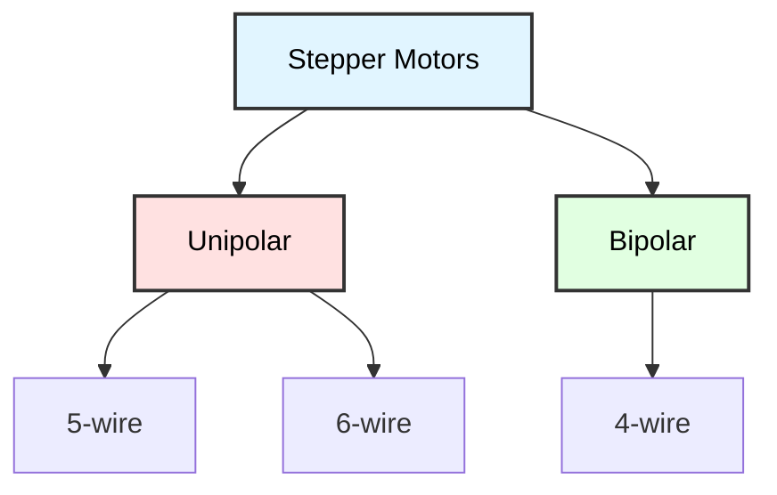
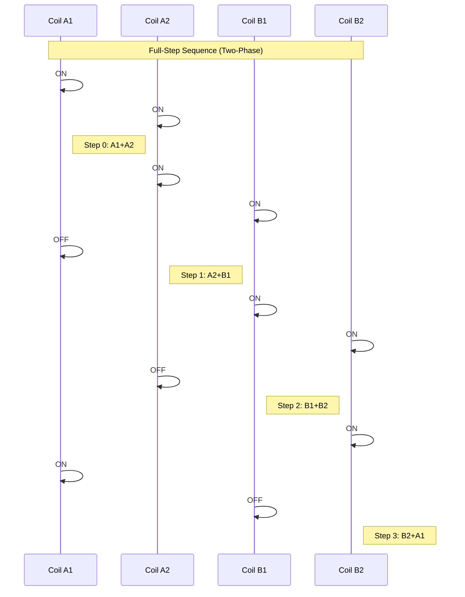

# Stepper Motor Control
## ATmega128 Embedded Systems Course

**Reference**: [ATmega128 Datasheet](https://ww1.microchip.com/downloads/en/DeviceDoc/doc2467.pdf)

**Project**: `Motor_Stepper/` - Stepper motor control with PORTB (coils + LEDs)

---

## Slide 1: Introduction to Stepper Motors

### What is a Stepper Motor?
- **Incremental rotation** in discrete steps
- **Open-loop control** (no feedback required)
- **Precise positioning** without encoders
- Common in **3D printers, CNC, robotics**

### Stepper Motor Types


### Stepper Motor Characteristics
```
Standard Stepper Motor Specifications:
- Type: Bipolar, 4-wire (2-phase)
- Step Angle: 1.8° per step
- Steps per Revolution: 200 (full-step mode)
- Steps per Revolution: 400 (half-step mode)
- Phase: 2 (A and B coils)
- Holding Torque: Varies by motor model
- Typical Voltage: 5-12V DC
```

### How It Works
```
Electromagnet coils energized in sequence
→ Rotor (permanent magnet) aligns with stator
→ Next coil energized → rotor moves one step
→ Repeat in sequence → continuous rotation

     Coil A    Coil B    Coil C    Coil D
       │         │         │         │
       ▼         ▼         ▼         ▼
    ┌─────────────────────────────────┐
    │        ╔═══╗                    │
    │        ║ N ║ ← Rotor            │
    │        ╚═══╝                    │
    └─────────────────────────────────┘
```

---

## Slide 2: Hardware Connection

### PORTB Pin Assignment
```
ATmega128 PORTB Configuration:

PB7 ────→ LED7 (active low) ┐
PB6 ────→ LED6 (active low) │ Upper nibble: LEDs
PB5 ────→ LED5 (active low) │ (Status indicators)
PB4 ────→ LED4 (active low) ┘
─────────────────────────────
PB3 ────→ Coil B2 (Stepper) ┐
PB2 ────→ Coil B1 (Stepper) │ Lower nibble: Stepper coils
PB1 ────→ Coil A2 (Stepper) │ (Motor control)
PB0 ────→ Coil A1 (Stepper) ┘
```

### Bipolar Stepper (4-wire) Connection
```
ATmega128 PORTB    Driver IC      Stepper Motor
------------       ---------      -------------
PB0 (A1) ────→     IN1    OUT1 ──→ Coil A1
PB1 (A2) ────→     IN2    OUT2 ──→ Coil A2
PB2 (B1) ────→     IN3    OUT3 ──→ Coil B1
PB3 (B2) ────→     IN4    OUT4 ──→ Coil B2

PB4-PB7 ────→      LEDs (active low)

External 5-12V ──→ Motor Power Supply
GND ──────────────→ Common Ground
```

### Important Notes
- **PORTB lower nibble (PB0-PB3)**: Stepper motor coils
- **PORTB upper nibble (PB4-PB7)**: Status LEDs (active low)
- **Bit masking**: Coil updates preserve LED states
- **LEDs active low**: LOW (0) = ON, HIGH (1) = OFF
- **SimulIDE Configuration**: Set "Steps per Rotation" to 200 in stepper motor component
- **F_CPU**: 16MHz (consistent across all projects)

---

## Slide 3: Stepping Sequences

### Full-Step Mode (Wave Drive)
```c
// One coil energized at a time
// 4 steps per sequence, lower torque
// Used in Demo 5 for comparison

const uint8_t full_step_sequence_wave[4] = {
    0b0001,  // Step 0: A1
    0b0010,  // Step 1: A2
    0b0100,  // Step 2: B1
    0b1000   // Step 3: B2
};

// Standard stepper: 200 steps per revolution
```

### Full-Step Mode (Full Drive)
```c
// Two coils energized, maximum torque
// 4 steps per sequence (default mode)

const uint8_t full_step_sequence[4] = {
    0b0011,  // Step 0: A1 + A2
    0b0110,  // Step 1: A2 + B1
    0b1100,  // Step 2: B1 + B2
    0b1001   // Step 3: B2 + A1
};

// Double the holding torque of wave drive
// Standard stepper: 200 steps per revolution
```

### Half-Step Mode
```c
// Alternates between 1 and 2 coils
// 8 steps per sequence, smoother rotation

const uint8_t half_step_sequence[8] = {
    0b0001,  // Step 0: A1
    0b0011,  // Step 1: A1 + A2
    0b0010,  // Step 2: A2
    0b0110,  // Step 3: A2 + B1
    0b0100,  // Step 4: B1
    0b1100,  // Step 5: B1 + B2
    0b1000,  // Step 6: B2
    0b1001   // Step 7: B2 + A1
};

// Standard stepper: 400 steps per revolution (double resolution)
// Smoother, but lower torque on single-coil steps
```

### Stepping Sequence Diagram


---

## Slide 4: Basic Stepper Control

### Initialize GPIO for Stepper (PORTB)
```c
#include <avr/io.h>
#include <util/delay.h>

// Motor connected to PORTB lower 4 bits
// LEDs on PORTB upper 4 bits (active low)
#define STEPPER_PORT PORTB
#define STEPPER_DDR  DDRB
#define COIL_A1 (1 << PB0)
#define COIL_A2 (1 << PB1)
#define COIL_B1 (1 << PB2)
#define COIL_B2 (1 << PB3)

// Full-step sequence (two-phase on, higher torque)
const uint8_t full_step_sequence[4] = {
    0b0011,  // A1 + A2
    0b0110,  // A2 + B1
    0b1100,  // B1 + B2
    0b1001   // B2 + A1
};

uint8_t current_step_index = 0;

void stepper_init(void) {
    // Set PORTB as output (coils + LEDs)
    STEPPER_DDR = 0xFF;
    // Initialize: coils OFF, LEDs OFF (active low: HIGH = OFF)
    STEPPER_PORT = 0xF0;  // Upper nibble HIGH = LEDs OFF
}

void stepper_set_coils(uint8_t coil_pattern) {
    // Update only lower nibble (coils), preserve upper nibble (LEDs)
    STEPPER_PORT = (STEPPER_PORT & 0xF0) | (coil_pattern & 0x0F);
}

void stepper_step_forward(void) {
    // Forward: increment step index
    current_step_index = (current_step_index + 1) % 4;
    stepper_set_coils(full_step_sequence[current_step_index]);
}

void stepper_step_backward(void) {
    // Backward: decrement step index
    if (current_step_index == 0) {
        current_step_index = 3;
    } else {
        current_step_index--;
    }
    stepper_set_coils(full_step_sequence[current_step_index]);
}
```

---

## Slide 5: Speed Control

### Step Delay (Speed)
```c
// Delay between steps determines rotation speed
// Shorter delay = faster rotation
// NOTE: _delay_ms() requires compile-time constants
// Use loop for variable delays

#define SPEED_SLOW    10   // 10ms per step
#define SPEED_MEDIUM  5    // 5ms per step
#define SPEED_FAST    2    // 2ms per step

void stepper_rotate_cw(uint16_t steps, uint16_t speed_ms) {
    for (uint16_t i = 0; i < steps; i++) {
        stepper_step_cw();
        // Variable delay using busy wait loop
        for (uint16_t d = 0; d < speed_ms; d++) {
            _delay_ms(1);
        }
    }
}

void stepper_rotate_ccw(uint16_t steps, uint16_t speed_ms) {
    for (uint16_t i = 0; i < steps; i++) {
        stepper_step_ccw();
        // Variable delay using busy wait loop
        for (uint16_t d = 0; d < speed_ms; d++) {
            _delay_ms(1);
        }
    }
}

// Example: Rotate 1 full revolution
// Standard stepper: 200 steps/rev in full-step mode
stepper_rotate_cw(200, SPEED_MEDIUM);
```

### RPM Calculation
```c
// Calculate delay for desired RPM

uint8_t rpm_to_delay_ms(uint8_t rpm, uint16_t steps_per_rev) {
    // RPM = (60 × 1000) / (steps_per_rev × delay_ms)
    // delay_ms = 60000 / (rpm × steps_per_rev)
    
    uint32_t delay_ms = 60000UL / ((uint32_t)rpm * steps_per_rev);
    
    if (delay_ms > 255) delay_ms = 255;  // Clamp to uint8_t
    if (delay_ms < 1) delay_ms = 1;      // Minimum 1ms
    
    return (uint8_t)delay_ms;
}

// Example: 10 RPM
uint8_t delay = rpm_to_delay_ms(10, 200);
stepper_rotate_cw(200, delay);
```

---

## Slide 6: Acceleration/Deceleration

### Smooth Speed Changes
```c
void stepper_rotate_accel(uint16_t steps, uint8_t start_delay, uint8_t end_delay) {
    uint16_t accel_steps = steps / 3;  // 1/3 accel, 1/3 const, 1/3 decel
    
    // Acceleration phase
    for (uint16_t i = 0; i < accel_steps; i++) {
        stepper_step_cw();
        
        uint8_t delay = start_delay - ((start_delay - end_delay) * i) / accel_steps;
        _delay_ms(delay);
    }
    
    // Constant speed phase
    for (uint16_t i = 0; i < accel_steps; i++) {
        stepper_step_cw();
        _delay_ms(end_delay);
    }
    
    // Deceleration phase
    for (uint16_t i = 0; i < accel_steps; i++) {
        stepper_step_cw();
        
        uint8_t delay = end_delay + ((start_delay - end_delay) * i) / accel_steps;
        _delay_ms(delay);
    }
}

// Example: Accelerate from 20ms to 2ms per step
stepper_rotate_accel(200, 20, 2);
```

---

## Slide 7: Position Tracking

### Track Absolute Position
```c
int32_t stepper_position = 0;  // Current position in steps
int32_t stepper_target = 0;    // Target position

void stepper_set_position(int32_t pos) {
    stepper_position = pos;
}

void stepper_move_to(int32_t target, uint8_t speed_ms) {
    stepper_target = target;
    
    while (stepper_position != stepper_target) {
        if (stepper_position < stepper_target) {
            // Move clockwise
            stepper_step_cw();
            stepper_position++;
        } else {
            // Move counter-clockwise
            stepper_step_ccw();
            stepper_position--;
        }
        
        _delay_ms(speed_ms);
    }
}

void stepper_home(void) {
    // Move to home position (0)
    stepper_move_to(0, 5);
}

// Example: Move to specific positions
stepper_set_position(0);       // Initialize at home
stepper_move_to(100, 5);       // Move to 100 steps (180°)
stepper_move_to(200, 5);       // Move to 200 steps (360°)
stepper_home();                // Return to home
```

---

## Slide 8: Half-Step Mode

### Smoother Rotation with Half-Steps
```c
const uint8_t half_step[8] = {
    0b0001,  // D
    0b0011,  // D+C
    0b0010,  // C
    0b0110,  // C+B
    0b0100,  // B
    0b1100,  // B+A
    0b1000,  // A
    0b1001   // A+D
};

uint8_t half_step_index = 0;

void stepper_half_step_cw(void) {
    half_step_index++;
    if (half_step_index >= 8) half_step_index = 0;
    
    // Update coils, preserve LEDs
    STEPPER_PORT = (STEPPER_PORT & 0xF0) | (half_step_sequence[half_step_index] & 0x0F);
}

void stepper_half_step_ccw(void) {
    if (half_step_index == 0) half_step_index = 7;
    else half_step_index--;
    
    // Update coils, preserve LEDs
    STEPPER_PORT = (STEPPER_PORT & 0xF0) | (half_step_sequence[half_step_index] & 0x0F);
}

// Standard stepper: 400 steps per revolution in half-step mode
void rotate_one_revolution_smooth(void) {
    for (uint16_t i = 0; i < 400; i++) {
        stepper_half_step_cw();
        _delay_ms(2);
    }
}
```

---

## Slide 9: Project Demos

### Demo Functions Available

**Demo 1: Basic Forward/Backward Stepping**
- Forward 50 steps, backward 50 steps
- Forward 100 steps, backward 100 steps
- Demonstrates basic step control

**Demo 2: Continuous Rotation at Different Speeds**
- Tests 5 different speeds (20ms, 10ms, 5ms, 2ms, 1ms per step)
- One full revolution at each speed
- Shows speed vs smoothness trade-off

**Demo 3: Position Control - Move to Specific Angles**
- Moves to angles: 0°, 90°, 180°, 270°, 360°, etc.
- Demonstrates precise angular positioning
- Uses degree-to-step conversion

**Demo 4: Full-Step vs Half-Step Comparison**
- Full-step mode: 200 steps per revolution
- Half-step mode: 400 steps per revolution
- Compares smoothness and resolution

**Demo 5: Wave Drive vs Two-Phase Drive**
- Wave drive: one coil at a time (lower torque)
- Two-phase drive: two coils at a time (higher torque)
- Demonstrates torque differences

**Demo 6: Random Rotation**
- Random movements in random directions
- Random speeds (5-30ms per step)
- 10 random movements, then return home

**Demo 7: Sinusoidal Motion**
- Smooth sine wave motion pattern
- Variable speed following cosine profile
- Oscillates ±50 steps (≈±90°)
- 3 complete sine wave cycles

### Application - CNC X-Y Plotter

### Two-Axis Stepper Control
```c
// X-axis on PORTB
// Y-axis on PORTC

int32_t x_position = 0;
int32_t y_position = 0;

void cnc_init(void) {
    DDRB |= 0x0F;  // X-axis steppers (lower nibble)
    DDRC |= 0x0F;  // Y-axis steppers
}

void cnc_step_x(int8_t direction) {
    if (direction > 0) {
        // X clockwise
        step_index_x++;
        if (step_index_x >= 4) step_index_x = 0;
        x_position++;
    } else {
        // X counter-clockwise
        if (step_index_x == 0) step_index_x = 3;
        else step_index_x--;
        x_position--;
    }
    
    PORTB = (PORTB & 0xF0) | (full_step[step_index_x] & 0x0F);
}

void cnc_step_y(int8_t direction) {
    if (direction > 0) {
        step_index_y++;
        if (step_index_y >= 4) step_index_y = 0;
        y_position++;
    } else {
        if (step_index_y == 0) step_index_y = 3;
        else step_index_y--;
        y_position--;
    }
    
    PORTC = (PORTC & 0xF0) | (full_step[step_index_y] & 0x0F);
}

void cnc_move_to(int32_t target_x, int32_t target_y, uint8_t speed_ms) {
    while (x_position != target_x || y_position != target_y) {
        if (x_position < target_x) {
            cnc_step_x(1);
        } else if (x_position > target_x) {
            cnc_step_x(-1);
        }
        
        if (y_position < target_y) {
            cnc_step_y(1);
        } else if (y_position > target_y) {
            cnc_step_y(-1);
        }
        
        _delay_ms(speed_ms);
    }
}

// Draw a square
void cnc_draw_square(uint16_t size) {
    cnc_move_to(size, 0, 5);      // Right
    cnc_move_to(size, size, 5);   // Up
    cnc_move_to(0, size, 5);      // Left
    cnc_move_to(0, 0, 5);         // Down (home)
}
```

---

## Slide 10: Application - Automatic Curtain

### Stepper-Controlled Curtain Opener
```c
#define CURTAIN_OPEN_STEPS   200    // Fully open (1 revolution)
#define CURTAIN_CLOSED_STEPS 0      // Fully closed

typedef enum {
    CURTAIN_CLOSED,
    CURTAIN_OPENING,
    CURTAIN_OPEN,
    CURTAIN_CLOSING
} curtain_state_t;

curtain_state_t curtain_state = CURTAIN_CLOSED;

void curtain_open(void) {
    if (curtain_state == CURTAIN_CLOSED) {
        curtain_state = CURTAIN_OPENING;
        stepper_move_to(CURTAIN_OPEN_STEPS, 3);
        curtain_state = CURTAIN_OPEN;
    }
}

void curtain_close(void) {
    if (curtain_state == CURTAIN_OPEN) {
        curtain_state = CURTAIN_CLOSING;
        stepper_move_to(CURTAIN_CLOSED_STEPS, 3);
        curtain_state = CURTAIN_CLOSED;
    }
}

// Automatic curtain based on light sensor
void auto_curtain(void) {
    uint16_t light = adc_read(0);  // CdS sensor
    
    if (light > 800) {
        // Bright: close curtain
        curtain_close();
    } else if (light < 200) {
        // Dark: open curtain
        curtain_open();
    }
}
```

---

## Slide 11: Application - Rotating Display

### Circular LED Display
```c
// Rotate platform with LED display
// Persistence of vision creates image

#define STEPS_PER_REV 200

void display_init(void) {
    stepper_init();
    // Initialize LED column on PORTB
    DDRB = 0xFF;
}

void display_image(const uint8_t *image, uint8_t columns) {
    // Rotate and display image column-by-column
    
    uint8_t steps_per_column = STEPS_PER_REV / columns;
    
    for (uint8_t col = 0; col < columns; col++) {
        // Display this column
        PORTB = image[col];
        
        // Rotate to next column position
        stepper_rotate_cw(steps_per_column, 2);
    }
}

// Example: 16-column smiley face
const uint8_t smiley[16] = {
    0b00111100,
    0b01000010,
    0b10100101,
    0b10000001,
    0b10100101,
    0b10011001,
    0b01000010,
    0b00111100,
    0b00000000,
    // ... (repeat for 360°)
};

int main(void) {
    display_init();
    
    while (1) {
        display_image(smiley, 16);
    }
}
```

---

## Slide 12: Application - Pan-Tilt Platform

### Stepper-Based Camera Mount
```c
// X-axis (pan): PORTA
// Y-axis (tilt): PORTC

int16_t pan_angle = 0;   // -180° to +180°
int16_t tilt_angle = 0;  // -90° to +90°

#define STEPS_PER_DEGREE 1   // 200 steps / 360° ≈ 0.56 steps/degree
// For 180°: 200 steps / 360° × 180° = 100 steps

void pantilt_init(void) {
    stepper_init();
    
    // Center position
    pan_angle = 0;
    tilt_angle = 0;
}

void pantilt_set_angle(int16_t pan, int16_t tilt) {
    // Clamp angles
    if (pan < -180) pan = -180;
    if (pan > 180) pan = 180;
    if (tilt < -90) tilt = -90;
    if (tilt > 90) tilt = 90;
    
    // Calculate step difference
    int32_t pan_steps = pan * STEPS_PER_DEGREE;
    int32_t tilt_steps = tilt * STEPS_PER_DEGREE;
    
    // Move to position
    // (Use dual stepper control similar to CNC example)
    
    pan_angle = pan;
    tilt_angle = tilt;
}

// Scan pattern
void pantilt_scan(void) {
    for (int16_t pan = -90; pan <= 90; pan += 15) {
        for (int16_t tilt = -45; tilt <= 45; tilt += 15) {
            pantilt_set_angle(pan, tilt);
            _delay_ms(500);
            
            // Capture image / sensor reading here
        }
    }
}
```

---

## Slide 13: Microstepping (Advanced)

### Increase Resolution with PWM
```c
// Use PWM on coils for microstepping
// Allows fractional steps (1/8, 1/16, 1/32)

// Example: 1/4 microstep (quarter-step)
typedef struct {
    uint8_t coil_a_pwm;  // 0-255
    uint8_t coil_b_pwm;
    uint8_t coil_c_pwm;
    uint8_t coil_d_pwm;
} microstep_t;

const microstep_t quarter_step[16] = {
    {255, 0,   0,   0  },  // A full
    {255, 0,   0,   64 },  // A+D 25%
    {255, 0,   0,   128},  // A+D 50%
    {255, 0,   0,   192},  // A+D 75%
    {255, 0,   0,   255},  // A+D full
    {192, 0,   0,   255},  // ... continue pattern
    // ... (16 total microsteps)
};

// Requires PWM-capable driver (not ULN2003)
// Use dedicated stepper driver (e.g., A4988, DRV8825)
```

---

## Slide 14: Troubleshooting

### Common Issues

| Problem | Cause | Solution |
|---------|-------|----------|
| **Motor doesn't move** | Wrong sequence | Verify coil connections, check sequence |
| **Motor vibrates** | Steps too fast | Increase delay between steps |
| **Skipped steps** | Insufficient torque | Reduce speed, check load |
| **Overheating** | Continuous current | Use decay modes, reduce holding current |
| **Wrong direction** | Reversed sequence | Swap CW/CCW functions or reverse coil |
| **Noisy operation** | Resonance frequency | Change speed, use microstepping |

### Debugging Code
```c
void stepper_test(void) {
    stepper_init();
    uart_init();
    
    printf("Stepper Test\n");
    printf("------------\n");
    
    // Test each coil individually
    const char *coil_names[] = {"A", "B", "C", "D"};
    
    for (uint8_t i = 0; i < 4; i++) {
        printf("Testing coil %s...\n", coil_names[i]);
        
        STEPPER_PORT = (1 << i);
        _delay_ms(1000);
        
        STEPPER_PORT = 0;
        _delay_ms(500);
    }
    
    // Test rotation
    printf("\nRotating CW...\n");
    stepper_rotate_cw(100, 10);
    
    _delay_ms(1000);
    
    printf("Rotating CCW...\n");
    stepper_rotate_ccw(100, 10);
}
```

---

## Slide 15: Best Practices

### Stepper Motor Guidelines

✓ **Match driver to motor type**
```c
// Bipolar (4-wire) → L298N, A4988, DRV8825
// Use PORTB lower nibble for coil control
```

✓ **Limit speed**
```c
// Don't exceed motor's max step rate
// Typical: 500-1000 steps/sec max
// Minimum delay: 1ms per step
if (delay_ms < 1) delay_ms = 1;
```

✓ **Use variable delay loops**
```c
// _delay_ms() requires compile-time constants
// Use loop for variable delays:
for (uint16_t d = 0; d < delay_ms; d++) {
    _delay_ms(1);
}
```

✓ **Add acceleration**
```c
// Gradual speed changes prevent skipped steps
stepper_rotate_accel(steps, 20, 2);
```

✓ **Use position tracking**
```c
// Track absolute position for repeatability
int32_t position = 0;
position += steps;  // Update on each step
```

✓ **Disable when idle**
```c
// Turn off coils to reduce power and heat
// Preserve LED states
STEPPER_PORT = STEPPER_PORT & 0xF0;  // Clear coils, keep LEDs
```

✓ **Preserve LED states**
```c
// When updating coils, preserve LEDs:
STEPPER_PORT = (STEPPER_PORT & 0xF0) | (coil_pattern & 0x0F);
```

---

## Slide 16: Summary

### Key Concepts

✓ **Stepping modes**: Wave, full-step, half-step  
✓ **Coil sequences**: 4-step or 8-step patterns  
✓ **Speed control**: Delay between steps  
✓ **Position tracking**: Absolute step counting  
✓ **Direction**: CW (increment) vs CCW (decrement)  
✓ **Acceleration**: Smooth speed ramps  
✓ **Drivers**: ULN2003 (unipolar), L298N (bipolar)  

### Applications
- 3D printers (X, Y, Z axes)
- CNC machines
- Camera pan-tilt mounts
- Automatic curtains/blinds
- Rotating displays
- Precision positioning

### Stepper Comparison
```
Full-Step Mode:
+ Higher torque (two coils on)
+ Faster operation
+ 200 steps per revolution
- Audible stepping noise

Half-Step Mode:
+ Smoother motion
+ Finer resolution (400 steps/rev)
+ Quieter operation
- Lower torque on single-coil steps
- Slower maximum speed
```

### Project Implementation
- **Port**: PORTB (lower nibble: coils, upper nibble: LEDs)
- **LEDs**: Active low (PB4-PB7)
- **Steps per Revolution**: 200 (full-step), 400 (half-step)
- **Clock Frequency**: 16MHz
- **7 Demo Functions**: Cover all stepping modes and applications

---

## Slide 17: Practice Exercises

### Exercise 1: Basic Stepping
**Goal**: Implement full-step control
- Initialize GPIO for 4 coils on PORTB
- Create forward and backward step functions
- Rotate 1 full revolution (200 steps)
- Add speed control with variable delays
- Use LED indicators for status

### Exercise 2: Position Control
**Goal**: Track absolute position
- Implement position counter (int32_t)
- Create `move_to()` function
- Add home position (position = 0)
- Convert degrees to steps
- Use LEDs to show position index

### Exercise 3: Half-Step Mode
**Goal**: Smoother rotation
- Implement 8-step sequence
- Compare smoothness vs full-step
- Verify 400 steps per revolution (vs 200 full-step)
- Test with different speeds
- Observe torque differences

### Exercise 4: Advanced Motion Patterns
**Goal**: Implement complex motion patterns
- Random rotation (Demo 6)
- Sinusoidal motion (Demo 7)
- Create custom motion profiles
- Implement acceleration/deceleration curves

### Exercise 5: LED Integration
**Goal**: Combine stepper control with LED feedback
- Use PORTB upper nibble for LEDs
- Implement active-low LED control
- Show demo status on LEDs
- Display step patterns visually
- Preserve LED states during coil updates

---

## Slide 18: Additional Resources

### ATmega128 Documentation
- **[Official Datasheet (PDF)](https://ww1.microchip.com/downloads/en/DeviceDoc/doc2467.pdf)**
  - GPIO configuration (PORTB)
  - Timing considerations
  - Bit manipulation techniques

### Stepper Motor Resources
- Motor datasheets (28BYJ-48, NEMA 17, etc.)
- Step sequences and coil configurations
- Torque-speed curves
- Driver ICs (ULN2003, L298N, A4988, DRV8825)

### Control Algorithms
- Acceleration/deceleration profiles
- Bresenham line algorithm (for CNC)
- Microstepping techniques
- Closed-loop stepper control

### Applications
- 3D printer firmware (Marlin, RepRap)
- CNC G-code interpreters
- Robotic arm kinematics
- Precision positioning systems

---

# End of Slides

**Questions?**

For more information, see:
- [ATmega128 Datasheet](https://ww1.microchip.com/downloads/en/DeviceDoc/doc2467.pdf)
- Project source code in `Motor_Stepper/`
- **Main.c**: Contains 7 demo functions
- **config.h**: Project configuration (F_CPU = 16MHz)
- **build.bat**: Build script using tools folder

### Code Structure
```
Motor_Stepper/
├── Main.c          # Main code with 7 demos
├── config.h        # Configuration header
├── build.bat       # Build script
└── Slide.md        # This documentation
```

### Key Features
- ✅ PORTB integration (coils + LEDs)
- ✅ Active-low LED control
- ✅ Full-step and half-step modes
- ✅ Position tracking
- ✅ Speed control
- ✅ Multiple demo applications
- ✅ SimulIDE compatible (200 steps/rev)
