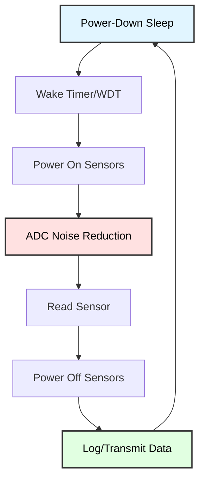

# Low-Power Sensor Applications
## Battery-Optimized Data Acquisition

**Reference**: [ATmega128 Datasheet](https://ww1.microchip.com/downloads/en/DeviceDoc/doc2467.pdf)

---

## Slide 1: Introduction to Low-Power Sensors

### Project Overview
- **Minimize power** in sensor monitoring applications
- **ADC Noise Reduction** sleep mode for clean readings
- **Periodic wake-up** strategies (watchdog, timer)
- **Sensor power control** (enable/disable sensors)
- **Battery life optimization** (months to years)

### Low-Power Sensor Architecture


### Power Consumption Goals
```
Typical battery-powered sensor:
- Active (sensing): 15 mA for 50 ms = 0.21 µAh
- Sleep: 2 µA for 59.95 sec = 33 µAh
- Total per minute: 33.21 µAh
- CR2032 battery (220 mAh): 6600 hours = 9 months!

With optimization:
- Active: 5 mA for 20 ms = 0.028 µAh
- Sleep: 1 µA for 59.98 sec = 16.66 µAh
- Total per minute: 16.69 µAh
- CR2032 battery: 13,200 hours = 18 months!
```

---

## Slide 2: ADC Power Considerations

### ADC Power Consumption
```
ADC Operating Modes (ATmega128):
- Active conversion: ~230 µA
- Conversion time: 13 ADC clocks (min)
- At 125 kHz ADC clock: 104 µs per conversion
- Energy per conversion: 230 µA × 104 µs = 0.024 µAh

ADC Noise Reduction Mode Benefits:
- CPU stopped → reduced electrical noise
- Better signal-to-noise ratio (SNR)
- More stable readings (±1 LSB vs ±3 LSB)
- Slightly lower power (~3 mA vs ~5 mA total system)
```

### ADC Clock Optimization
```c
/*
 * ADC Prescaler Selection
 * ADC clock should be 50-200 kHz for 10-bit resolution
 * 
 * System Clock | Prescaler | ADC Clock | Conversion Time
 * -------------|-----------|-----------|----------------
 * 8 MHz        | 64        | 125 kHz   | 104 µs (ideal)
 * 8 MHz        | 128       | 62.5 kHz  | 208 µs
 * 1 MHz        | 8         | 125 kHz   | 104 µs (best power!)
 */

// For 8 MHz system clock:
ADCSRA = (1 << ADEN) | (1 << ADIE) | 
         (1 << ADPS2) | (1 << ADPS1) | (1 << ADPS0);  // Prescaler 128
```

---

## Slide 3: ADC with Sleep Mode

### ADC Noise Reduction Implementation
```c
#include <avr/sleep.h>
#include <avr/interrupt.h>

volatile uint16_t adc_result = 0;
volatile uint8_t adc_complete = 0;

// ADC Conversion Complete ISR
ISR(ADC_vect) {
    adc_result = ADC;
    adc_complete = 1;
}

void adc_init_low_power(void) {
    // AVCC reference, right-adjusted
    ADMUX = (1 << REFS0);
    
    // Enable ADC, enable interrupt, prescaler 128
    // At 7.3728 MHz: ADC clock = 57.6 kHz (ideal range)
    ADCSRA = (1 << ADEN) | (1 << ADIE) |
             (1 << ADPS2) | (1 << ADPS1) | (1 << ADPS0);
}

uint16_t adc_read_sleep(uint8_t channel) {
    // Select channel
    ADMUX = (ADMUX & 0xE0) | (channel & 0x1F);
    
    // Set ADC Noise Reduction sleep mode
    set_sleep_mode(SLEEP_MODE_ADC);
    
    adc_complete = 0;
    
    // Start conversion
    ADCSRA |= (1 << ADSC);
    
    // Sleep during conversion (reduces noise!)
    sleep_enable();
    sei();
    sleep_cpu();
    sleep_disable();
    
    // Conversion complete (woken by ADC interrupt)
    while (!adc_complete);
    
    return adc_result;
}
```

---

## Slide 4: Sensor Power Control

### Hardware Power Switching
```
Sensor Power Control Circuit:
         Vcc
          │
          │
         ┌┴┐
         │ │ 10kΩ (pull-up)
         └┬┘
          │
          ├─── PB7 (Sensor Enable Pin)
          │
       ┌──┴──┐
       │2N7000│ N-Channel MOSFET
       │  or  │
       │BC547 │ NPN Transistor
       └──┬──┘
          │
          ├─── Sensor Vcc
          │
       [SENSOR]
          │
         GND
```

### Software Control
```c
#define SENSOR_ENABLE_PIN 7  // PB7

void sensor_power_init(void) {
    DDRB |= (1 << SENSOR_ENABLE_PIN);   // Output
    PORTB &= ~(1 << SENSOR_ENABLE_PIN); // Off initially
}

void sensor_power_on(void) {
    PORTB |= (1 << SENSOR_ENABLE_PIN);
    _delay_ms(10);  // Sensor stabilization time
}

void sensor_power_off(void) {
    PORTB &= ~(1 << SENSOR_ENABLE_PIN);
}

uint16_t read_sensor_low_power(uint8_t channel) {
    sensor_power_on();
    
    uint16_t reading = adc_read_sleep(channel);
    
    sensor_power_off();
    
    return reading;
}

/*
 * Power savings:
 * - Sensor off: 0 µA
 * - Sensor on for 20 ms: avg ~0.1 µA over 60 sec
 * - Continuous sensor: 500 µA (example LM35)
 * - Savings: 99.98%!
 */
```

---

## Slide 5: Periodic Wake-Up with Watchdog

### Watchdog Timer Wake-Up
```c
#include <avr/wdt.h>

volatile uint8_t wdt_wake = 0;

// Watchdog Timer ISR
ISR(WDT_vect) {
    wdt_wake = 1;
}

void watchdog_init(uint8_t timeout) {
    /*
     * Watchdog Timeout Values:
     * WDTO_15MS, WDTO_30MS, WDTO_60MS, WDTO_120MS,
     * WDTO_250MS, WDTO_500MS, WDTO_1S, WDTO_2S,
     * WDTO_4S, WDTO_8S
     */
    
    wdt_enable(timeout);
    WDTCR |= (1 << WDTIE);  // Interrupt mode (not reset)
}

void demo_watchdog_sensor(void) {
    adc_init_low_power();
    sensor_power_init();
    
    watchdog_init(WDTO_8S);  // Wake every 8 seconds
    
    sei();
    set_sleep_mode(SLEEP_MODE_PWR_DOWN);
    
    while (1) {
        if (wdt_wake) {
            wdt_wake = 0;
            
            // Read sensor
            uint16_t temp = read_sensor_low_power(0);
            
            // Process/log data (brief activity)
            printf("Temp: %u\n", temp);
            
            // Back to sleep
        }
        
        sleep_enable();
        sleep_cpu();
        sleep_disable();
    }
}
```

---

## Slide 6: Timer2 Asynchronous Wake-Up

### Timer2 with 32.768 kHz Crystal
```c
#include <avr/sleep.h>

volatile uint16_t timer2_ticks = 0;

ISR(TIMER2_OVF_vect) {
    timer2_ticks++;
}

void timer2_init_async(void) {
    // Enable asynchronous mode with 32.768 kHz crystal
    ASSR = (1 << AS2);
    
    // Wait for registers to update
    while (ASSR & ((1<<TCN2UB)|(1<<OCR2UB)|(1<<TCR2UB)));
    
    // Prescaler 128: 32768 / 128 = 256 Hz
    // Overflow every 256 counts = 1 Hz
    TCCR2 = (1 << CS22) | (1 << CS20);
    TCNT2 = 0;
    
    // Enable overflow interrupt
    TIMSK |= (1 << TOIE2);
}

void demo_timer2_sensor(void) {
    adc_init_low_power();
    sensor_power_init();
    timer2_init_async();
    
    sei();
    set_sleep_mode(SLEEP_MODE_PWR_SAVE);  // Timer2 runs in Power-Save
    
    while (1) {
        if (timer2_ticks >= 60) {  // 60 seconds
            timer2_ticks = 0;
            
            // Read sensor every minute
            uint16_t temp = read_sensor_low_power(0);
            uint16_t light = read_sensor_low_power(1);
            
            // Log data
            printf("T:%u L:%u\n", temp, light);
        }
        
        sleep_enable();
        sleep_cpu();
        sleep_disable();
    }
}
```

---

## Slide 7: Multi-Sensor Low-Power System

### Three-Sensor Logger
```c
typedef struct {
    uint16_t temperature;
    uint16_t light;
    uint16_t humidity;
    uint32_t timestamp;
} sensor_reading_t;

sensor_reading_t readings[100];  // Circular buffer
uint8_t reading_index = 0;

void log_sensors(void) {
    sensor_reading_t *r = &readings[reading_index];
    
    // Power on all sensors
    sensor_power_on();
    
    // Read all channels with ADC NR mode
    r->temperature = adc_read_sleep(0);
    r->light = adc_read_sleep(1);
    r->humidity = adc_read_sleep(2);
    
    // Power off sensors
    sensor_power_off();
    
    // Timestamp (seconds since start)
    static uint32_t seconds = 0;
    r->timestamp = seconds;
    seconds += 60;  // Assuming 60-second interval
    
    // Advance circular buffer
    reading_index = (reading_index + 1) % 100;
}

void multi_sensor_logger(void) {
    adc_init_low_power();
    sensor_power_init();
    watchdog_init(WDTO_8S);  // Wake every 8 seconds
    
    sei();
    set_sleep_mode(SLEEP_MODE_PWR_DOWN);
    
    uint8_t wake_count = 0;
    
    while (1) {
        if (wdt_wake) {
            wdt_wake = 0;
            wake_count++;
            
            // Log every 60 seconds (8s × 7.5 = 60s)
            if (wake_count >= 8) {
                wake_count = 0;
                log_sensors();
            }
        }
        
        sleep_enable();
        sleep_cpu();
        sleep_disable();
    }
}
```

---

## Slide 8: Disable Unused Peripherals

### Power Reduction Register (PRR)
```c
#include <avr/power.h>

void minimize_power(void) {
    // Disable all unused peripherals
    power_spi_disable();       // SPI not needed
    power_twi_disable();       // I2C not needed
    power_timer0_disable();    // Timer0 not needed
    power_timer1_disable();    // Timer1 not needed
    power_usart0_disable();    // UART not needed (after init)
    
    // Keep enabled: ADC, Timer2 (if using async wake)
    
    // Savings: ~0.5-1 mA per peripheral
}

void enable_uart_briefly(void) {
    power_usart0_enable();
    
    printf("Data logged\n");
    _delay_ms(10);  // Ensure transmission complete
    
    power_usart0_disable();  // Save ~0.5 mA
}
```

### Additional Power Optimizations
```c
void optimize_pins(void) {
    // Set unused pins as inputs with pull-ups
    // (prevents floating inputs which waste power)
    
    // Example: Unused pins on PORTC
    DDRC = 0x00;   // All inputs
    PORTC = 0xFF;  // Enable pull-ups
    
    // Savings: ~50 µA per floating pin
}

void disable_analog_comparator(void) {
    // Analog comparator uses ~150 µA
    ACSR = (1 << ACD);  // Disable
}

void disable_brown_out_detector(void) {
    // BOD uses ~20-25 µA
    // Must be done in sleep (BODS bit in MCUCR)
    // Or permanently via fuse settings
    
    // During sleep:
    MCUCR |= (1 << BODS) | (1 << BODSE);
    MCUCR = (MCUCR & ~(1 << BODSE)) | (1 << BODS);
    // Must execute SLEEP within 4 cycles
}
```

---

## Slide 9: Application - Weather Station

### Battery-Powered Weather Logger
```c
typedef struct {
    float temperature;   // °C
    uint8_t humidity;    // %
    uint16_t pressure;   // hPa (if BMP sensor)
    uint8_t light;       // %
} weather_data_t;

void weather_station(void) {
    adc_init_low_power();
    sensor_power_init();
    timer2_init_async();  // 1 Hz tick
    
    minimize_power();
    
    sei();
    set_sleep_mode(SLEEP_MODE_PWR_SAVE);
    
    uint16_t minutes = 0;
    
    while (1) {
        if (timer2_ticks >= 60) {  // 1 minute
            timer2_ticks = 0;
            minutes++;
            
            // Log every 5 minutes
            if (minutes >= 5) {
                minutes = 0;
                
                weather_data_t data;
                
                sensor_power_on();
                
                // Read temperature (LM35: 10mV/°C)
                uint16_t temp_raw = adc_read_sleep(0);
                data.temperature = (temp_raw * 5.0 * 100.0) / 1024.0;
                
                // Read humidity (example sensor)
                uint16_t hum_raw = adc_read_sleep(1);
                data.humidity = (hum_raw * 100) / 1023;
                
                // Read light
                uint16_t light_raw = adc_read_sleep(2);
                data.light = (light_raw * 100) / 1023;
                
                sensor_power_off();
                
                // Brief UART transmission
                power_usart0_enable();
                printf("T:%.1f H:%u L:%u\n", 
                       data.temperature, data.humidity, data.light);
                _delay_ms(10);
                power_usart0_disable();
                
                // Or log to EEPROM for later retrieval
            }
        }
        
        sleep_enable();
        sleep_cpu();
        sleep_disable();
    }
}

/*
 * Power Analysis:
 * - Sleep (299 sec): 2 µA × 299 = 0.166 mAh
 * - Sensing (1 sec): 5 mA × 1 = 0.001 mAh
 * - Total per 5 min: 0.167 mAh
 * - Per day: 0.167 × 288 = 48 mAh/day
 * - CR2032 (220 mAh): 4.6 days
 * - 2× AA (2000 mAh): 42 days
 * - 4× AA (4000 mAh): 83 days
 */
```

---

## Slide 10: Data Logging to EEPROM

### Low-Power EEPROM Logger
```c
#include <avr/eeprom.h>

#define EEPROM_LOG_START 0
#define EEPROM_LOG_SIZE 512  // 512 bytes for logs

uint16_t eeprom_log_index = 0;

void eeprom_log_sensor(uint16_t temp, uint16_t light) {
    uint16_t addr = EEPROM_LOG_START + (eeprom_log_index * 4);
    
    if (addr + 4 > EEPROM_LOG_START + EEPROM_LOG_SIZE) {
        eeprom_log_index = 0;  // Wrap around (circular buffer)
        addr = EEPROM_LOG_START;
    }
    
    eeprom_write_word((uint16_t*)addr, temp);
    eeprom_write_word((uint16_t*)(addr + 2), light);
    
    eeprom_log_index++;
}

void eeprom_dump_logs(void) {
    power_usart0_enable();
    
    printf("\n=== EEPROM Data Log ===\n");
    
    for (uint16_t i = 0; i < eeprom_log_index && i < 128; i++) {
        uint16_t addr = EEPROM_LOG_START + (i * 4);
        
        uint16_t temp = eeprom_read_word((uint16_t*)addr);
        uint16_t light = eeprom_read_word((uint16_t*)(addr + 2));
        
        printf("%u: T=%u L=%u\n", i, temp, light);
    }
    
    printf("=======================\n");
    
    _delay_ms(100);
    power_usart0_disable();
}

/*
 * EEPROM vs SRAM:
 * - EEPROM retains data in power-down
 * - No battery needed for data retention
 * - Slower write (3.3 ms vs instant)
 * - Limited endurance (100k writes)
 * - Ideal for infrequent logging (hourly/daily)
 */
```

---

## Slide 11: Battery Life Calculation

### Power Budget Example
```c
/*
 * Battery-Powered Sensor Node
 * 
 * Power Budget:
 * - Sleep (power-down): 2 µA
 * - Wake-up (10 times/hour): 
 *   - ADC conversion: 5 mA for 20 ms = 0.028 µAh each
 *   - Total per hour: 0.028 × 10 = 0.28 µAh
 * - Sleep per hour: 2 µA × 1 hr = 2 µAh
 * - Total per hour: 2.28 µAh
 * 
 * Battery Capacity:
 * - CR2032: 220 mAh = 220,000 µAh
 * - Lifetime: 220,000 / 2.28 / 24 = 4019 days = 11 years!
 * 
 * With UART logging (1 min):
 * - UART: 10 mA for 100 ms = 0.278 µAh
 * - Total per hour: 2 + 0.28 + 16.67 = 18.95 µAh
 * - Lifetime: 220,000 / 18.95 / 24 = 483 days = 1.3 years
 */

void calculate_battery_life(void) {
    float sleep_current_ua = 2.0;
    float active_current_ma = 5.0;
    float active_time_ms = 20.0;
    uint16_t wakes_per_hour = 10;
    
    float sleep_charge_uah = sleep_current_ua * 1.0;  // 1 hour
    float active_charge_uah = (active_current_ma * 1000.0) * 
                              (active_time_ms / 3600000.0) * 
                              wakes_per_hour;
    
    float total_per_hour_uah = sleep_charge_uah + active_charge_uah;
    
    float battery_capacity_uah = 220000.0;  // CR2032
    float lifetime_hours = battery_capacity_uah / total_per_hour_uah;
    float lifetime_days = lifetime_hours / 24.0;
    
    printf("Battery life: %.1f days (%.1f years)\n", 
           lifetime_days, lifetime_days / 365.0);
}
```

---

## Slide 12: Troubleshooting Low-Power Systems

### Common Issues

| Problem | Cause | Solution |
|---------|-------|----------|
| **High sleep current** | Peripherals not disabled | Check PRR, disable unused modules |
| **Sensor always on** | Power control not working | Verify MOSFET/transistor circuit |
| **ADC noisy readings** | Not using ADC NR mode | Use set_sleep_mode(SLEEP_MODE_ADC) |
| **Doesn't wake** | Interrupt not configured | Enable wake source interrupt |
| **Short battery life** | Frequent wake-ups | Increase sleep duration |
| **Floating pins** | Unused pins not configured | Enable pull-ups on unused inputs |

### Power Measurement Setup
```c
void debug_power_states(void) {
    printf("Active mode - measure current\n");
    _delay_ms(5000);
    
    printf("Disabling peripherals\n");
    minimize_power();
    _delay_ms(5000);
    
    printf("Entering power-down\n");
    _delay_ms(100);
    
    set_sleep_mode(SLEEP_MODE_PWR_DOWN);
    sleep_enable();
    sleep_cpu();
    sleep_disable();
    
    printf("Woke up\n");
}

/*
 * Expected current measurements:
 * - Active (all peripherals): ~15 mA
 * - Active (minimal peripherals): ~8 mA
 * - Power-down (optimized): ~2 µA
 * 
 * If higher than expected:
 * - Check for LEDs (1-10 mA each)
 * - Check for pull-down resistors (I = V/R)
 * - Verify all peripherals disabled
 * - Check for floating inputs
 */
```

---

## Slide 13: Summary

### Key Concepts

✓ **ADC Noise Reduction**: Use SLEEP_MODE_ADC for cleaner readings  
✓ **Sensor power control**: Enable sensors only during measurement  
✓ **Periodic wake-up**: Watchdog (15ms-8s) or Timer2 async (RTC)  
✓ **Disable peripherals**: PRR register saves ~0.5-1 mA per module  
✓ **Optimize pins**: Pull-ups on unused inputs, disable comparator  
✓ **Battery life**: 2 µA sleep + brief active = months to years  

### Power Optimization Checklist
```
□ Use ADC Noise Reduction mode for ADC readings
□ Control sensor power with GPIO + MOSFET
□ Select appropriate wake interval (longer = better)
□ Disable unused peripherals (PRR register)
□ Configure unused pins as inputs with pull-ups
□ Disable analog comparator (ACSR)
□ Use lowest clock frequency acceptable
□ Consider disabling BOD in sleep (fuses)
□ Log to EEPROM instead of UART when possible
□ Measure actual current consumption
```

### Applications
- Environmental monitoring (temperature, humidity, pressure)
- Remote sensor nodes (IoT, wireless sensor networks)
- Data loggers (agriculture, industrial, scientific)
- Wildlife tracking (battery life critical)
- Weather stations
- Smart home sensors

---

## Slide 14: Practice Exercises

### Exercise 1: ADC Noise Reduction
**Goal**: Compare ADC readings with/without sleep
- Read temperature sensor in normal mode (10× samples)
- Read with ADC Noise Reduction mode (10× samples)
- Calculate standard deviation for both
- Observe noise reduction improvement

### Exercise 2: Sensor Power Control
**Goal**: Implement power switching
- Add MOSFET circuit for sensor power
- Control with GPIO pin
- Measure current with sensor on/off
- Calculate power savings

### Exercise 3: Watchdog Wake Logger
**Goal**: Periodic sensor logging
- Wake every 8 seconds (watchdog)
- Read temp + light sensors
- Log to EEPROM every 10 wake-ups
- Display log count on LCD

### Exercise 4: Battery Life Estimator
**Goal**: Calculate operational lifetime
- Measure sleep current (multimeter)
- Measure active current during sensing
- Input battery capacity (mAh)
- Calculate and display lifetime in days

### Exercise 5: Low-Power Weather Station
**Goal**: Complete multi-sensor system
- Wake every 5 minutes (Timer2 async)
- Read 3 sensors (temp, humidity, light)
- Log to EEPROM (circular buffer)
- UART dump on button press
- Goal: <10 µA average current

---

# End of Slides

**Questions?**

For more information, see:
- [ATmega128 Datasheet](https://ww1.microchip.com/downloads/en/DeviceDoc/doc2467.pdf) (ADC: pages 206-230, Sleep: pages 36-40)
- Project source code in `Power_LowPower_Sensors/`
- Shared libraries: `_adc.h`, `_uart.h`
