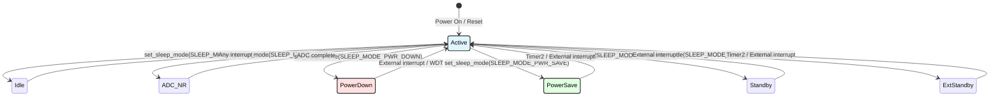
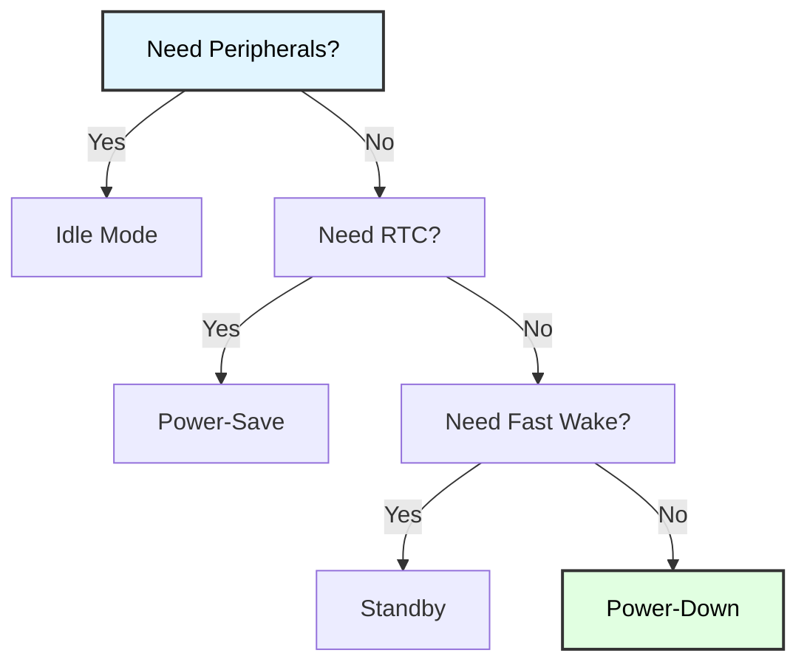

# ATmega128 Sleep Modes
## Power Management & Low-Power Operation

**Reference**: [ATmega128 Datasheet](https://ww1.microchip.com/downloads/en/DeviceDoc/doc2467.pdf)

---

## Slide 1: Introduction to Sleep Modes

### Why Power Management?
- **Battery-powered devices**: Extend operational lifetime
- **Energy efficiency**: Reduce power bill, heat generation
- **Environmental**: Lower carbon footprint
- **Design constraints**: Smaller batteries, thermal management

### Power Consumption Overview
```
ATmega128 Power Consumption (5V, 8MHz):
- Active mode: ~15 mA
- Idle mode: ~5 mA (67% savings)
- Power-save: ~10 µA (99.93% savings!)
- Power-down: ~1-2 µA (99.99% savings!)
```

### Sleep Mode Architecture


---

## Slide 2: Sleep Modes Comparison

### ATmega128 Sleep Modes

| Mode | CPU | Flash | RAM | Oscillators | Wake Sources | Current (5V, 8MHz) |
|------|-----|-------|-----|-------------|--------------|-------------------|
| **Idle** | ✗ | ✓ | ✓ | Main running | Any interrupt | ~5 mA |
| **ADC Noise Reduction** | ✗ | ✗ | ✓ | Main running | ADC, Ext INT, Timer2 | ~3 mA |
| **Power-down** | ✗ | ✗ | ✓ | All stopped | Ext INT, WDT | ~1-2 µA |
| **Power-save** | ✗ | ✗ | ✓ | Timer2 async | Ext INT, WDT, Timer2 | ~5-10 µA |
| **Standby** | ✗ | ✗ | ✓ | External osc | Ext INT | ~0.6 mA |
| **Extended Standby** | ✗ | ✗ | ✓ | Ext osc + Timer2 | Ext INT, Timer2 | ~0.6 mA |

✓ = Active, ✗ = Stopped

### Selection Criteria
- **Idle**: Quick wake, peripherals needed
- **ADC Noise Reduction**: ADC sampling with low noise
- **Power-down**: Lowest power, external wake only
- **Power-save**: RTC applications (Timer2 + 32.768 kHz crystal)
- **Standby/Extended Standby**: Fast wake-up from external oscillator

---

## Slide 3: Sleep Mode Configuration

### Sleep Control Register (MCUCR)
```c
/*
 * MCUCR (MCU Control Register)
 * Bits 5:3 (SM2:SM0) - Sleep Mode Select
 * Bit 2 (SE) - Sleep Enable
 */

// Sleep mode selection bits
SM2 SM1 SM0 | Mode
 0   0   0  | Idle
 0   0   1  | ADC Noise Reduction
 0   1   0  | Power-down
 0   1   1  | Power-save
 1   0   0  | Reserved
 1   0   1  | Reserved
 1   1   0  | Standby
 1   1   1  | Extended Standby
```

### Using avr/sleep.h Library
```c
#include <avr/sleep.h>

// Set desired sleep mode
set_sleep_mode(SLEEP_MODE_PWR_DOWN);

// Enable sleep mode
sleep_enable();

// Enter sleep (wakes on interrupt)
sleep_cpu();

// Disable sleep after wake
sleep_disable();
```

### Manual Register Configuration
```c
// Example: Power-down mode
MCUCR = (MCUCR & ~((1<<SM2)|(1<<SM1)|(1<<SM0))) | (1<<SM1);  // SM2:0 = 010
MCUCR |= (1 << SE);  // Enable sleep
__asm__ __volatile__("sleep");  // Execute SLEEP instruction
MCUCR &= ~(1 << SE);  // Disable sleep after wake
```

---

## Slide 4: Idle Mode

### Idle Mode Characteristics
- **CPU stopped**, all peripherals running
- **Lowest wake-up latency** (~5 clock cycles)
- **Any interrupt** can wake the CPU
- **Power savings**: ~67% (15 mA → 5 mA)

### Idle Mode Implementation
```c
#include <avr/sleep.h>
#include <avr/interrupt.h>

volatile uint8_t wake_flag = 0;

// Timer0 overflow interrupt (wake source)
ISR(TIMER0_OVF_vect) {
    wake_flag = 1;
}

void demo_idle_mode(void) {
    // Configure Timer0 (wake every ~32ms at 8MHz)
    TCCR0 = (1 << CS02) | (1 << CS00);  // Prescaler 1024
    TIMSK |= (1 << TOIE0);  // Enable overflow interrupt
    
    sei();  // Enable global interrupts
    
    set_sleep_mode(SLEEP_MODE_IDLE);
    
    while (1) {
        if (wake_flag) {
            wake_flag = 0;
            
            // Do work (e.g., read sensor, toggle LED)
            PORTB ^= (1 << PB0);
        }
        
        sleep_enable();
        sleep_cpu();
        sleep_disable();
    }
}
```

### When to Use Idle Mode
- **Short sleep durations** (milliseconds)
- **Need peripherals active** (UART, SPI, I2C, timers)
- **Frequent wake-ups** (timer-driven tasks)
- **Moderate power savings** acceptable

---

## Slide 5: ADC Noise Reduction Mode

### ADC Noise Reduction Characteristics
- **CPU and I/O stopped** during ADC conversion
- **Main oscillator continues** for ADC clock
- **Reduces electrical noise** for cleaner ADC readings
- **Wake sources**: ADC conversion complete, Timer2, External INT

### ADC Noise Reduction Implementation
```c
#include <avr/sleep.h>
#include <avr/interrupt.h>

volatile uint16_t adc_result = 0;
volatile uint8_t adc_complete = 0;

// ADC Conversion Complete ISR
ISR(ADC_vect) {
    adc_result = ADC;
    adc_complete = 1;
}

void adc_init_sleep(void) {
    // AVCC reference, right-adjusted
    ADMUX = (1 << REFS0);
    
    // Enable ADC, enable interrupt, prescaler 128
    ADCSRA = (1 << ADEN) | (1 << ADIE) | 
             (1 << ADPS2) | (1 << ADPS1) | (1 << ADPS0);
}

uint16_t adc_read_with_sleep(uint8_t channel) {
    // Select channel
    ADMUX = (ADMUX & 0xE0) | (channel & 0x1F);
    
    // Set ADC Noise Reduction mode
    set_sleep_mode(SLEEP_MODE_ADC);
    
    adc_complete = 0;
    
    // Start conversion
    ADCSRA |= (1 << ADSC);
    
    // Sleep during conversion (reduces noise!)
    sleep_enable();
    sei();
    sleep_cpu();
    sleep_disable();
    
    // Wait for completion (should already be done)
    while (!adc_complete);
    
    return adc_result;
}
```

### Benefits
- **Improved ADC accuracy** (lower noise floor)
- **Power savings during conversion** (~3 mA vs ~5 mA active)
- **Ideal for sensor applications**

---

## Slide 6: Power-Down Mode

### Power-Down Characteristics
- **Lowest power consumption** (~1-2 µA)
- **All oscillators stopped**
- **Wake sources**: External interrupts (INT0-7), Watchdog Timer
- **Longest wake-up time** (65-1000 clock cycles depending on oscillator)

### Power-Down Implementation
```c
#include <avr/sleep.h>
#include <avr/interrupt.h>

volatile uint8_t button_pressed = 0;

// External Interrupt 0 (wake source)
ISR(INT0_vect) {
    button_pressed = 1;
}

void demo_power_down(void) {
    // Configure INT0 (falling edge, button press)
    EICRA = (1 << ISC01);  // Falling edge
    EIMSK = (1 << INT0);   // Enable INT0
    
    sei();
    
    printf("Entering power-down mode...\n");
    _delay_ms(100);  // Let UART finish
    
    set_sleep_mode(SLEEP_MODE_PWR_DOWN);
    
    while (1) {
        if (button_pressed) {
            button_pressed = 0;
            
            printf("Woke up from power-down!\n");
            
            // Do work
            PORTB ^= (1 << PB0);
            
            _delay_ms(100);  // Debounce
        }
        
        sleep_enable();
        sleep_cpu();
        sleep_disable();
    }
}
```

### Use Cases
- **Battery-powered devices** with infrequent activity
- **Wake on button press** or external event
- **RTC alarm wake-up** (with watchdog or external RTC)
- **Years of battery life** (coin cell applications)

---

## Slide 7: Power-Save Mode

### Power-Save Characteristics
- **Timer2 continues running** (asynchronous from 32.768 kHz crystal)
- **All other functions stopped**
- **Ideal for RTC applications**
- **Wake sources**: External INT, Timer2, Watchdog
- **Power consumption**: ~5-10 µA

### Timer2 Asynchronous Operation
```c
// Enable Timer2 asynchronous mode with 32.768 kHz crystal
ASSR = (1 << AS2);  // Asynchronous Timer2

// Wait for registers to update
while (ASSR & ((1<<TCN2UB)|(1<<OCR2UB)|(1<<TCR2UB)));

// Configure Timer2 for 1-second interrupt
TCCR2 = (1 << CS22) | (1 << CS21) | (1 << CS20);  // Prescaler 1024
TCNT2 = 0;
OCR2 = 31;  // 32768 Hz / 1024 / 32 ≈ 1 Hz
TIMSK |= (1 << OCIE2);  // Compare match interrupt
```

### Power-Save Mode Implementation
```c
#include <avr/sleep.h>

volatile uint8_t seconds = 0;

ISR(TIMER2_COMP_vect) {
    seconds++;
}

void demo_power_save_rtc(void) {
    // Initialize Timer2 async mode (see above)
    
    sei();
    
    set_sleep_mode(SLEEP_MODE_PWR_SAVE);
    
    while (1) {
        if (seconds >= 60) {
            seconds = 0;
            
            // One minute elapsed
            printf("1 minute passed\n");
        }
        
        sleep_enable();
        sleep_cpu();
        sleep_disable();
    }
}
```

### Applications
- **Real-time clock** (RTC)
- **Data loggers** with periodic sampling
- **Alarms and timers**
- **Event schedulers**

---

## Slide 8: Standby and Extended Standby Modes

### Standby Mode
- **External oscillator keeps running**
- **Fast wake-up** (6 clock cycles)
- **Wake sources**: External interrupts
- **Current**: ~0.6 mA (depends on oscillator)

### Extended Standby Mode
- **External oscillator + Timer2 async**
- **Combines RTC with fast wake**
- **Wake sources**: External INT, Timer2
- **Current**: ~0.6 mA

### Configuration
```c
// Standby mode
set_sleep_mode(SLEEP_MODE_STANDBY);

// Extended Standby mode
set_sleep_mode(SLEEP_MODE_EXT_STANDBY);
```

### When to Use
- **Need fast wake-up** but can't afford active oscillator power
- **External oscillator already present** for timing accuracy
- **Combination of RTC and external events**

---

## Slide 9: Wake-Up Sources

### External Interrupts (INT0-7)
```c
// Configure INT0 for low level
EICRA = 0;  // Low level triggers INT0
EIMSK = (1 << INT0);

// Configure INT1 for falling edge
EICRA = (1 << ISC11);
EIMSK |= (1 << INT1);
```

### Watchdog Timer Wake
```c
#include <avr/wdt.h>

// Enable watchdog with 2-second timeout
wdt_enable(WDTO_2S);
WDTCR |= (1 << WDTIE);  // Interrupt mode (not reset)

ISR(WDT_vect) {
    // Periodic wake-up every 2 seconds
}
```

### Timer2 Asynchronous
```c
// See Power-Save mode example (Slide 7)
ISR(TIMER2_COMP_vect) {
    // RTC tick
}
```

### ADC Conversion Complete
```c
// See ADC Noise Reduction mode (Slide 5)
ISR(ADC_vect) {
    // ADC reading ready
}
```

---

## Slide 10: Application - Battery-Powered Sensor

### Low-Power Sensor Node
```c
#include <avr/sleep.h>
#include <avr/interrupt.h>
#include <avr/wdt.h>

volatile uint8_t wake_flag = 0;

ISR(WDT_vect) {
    wake_flag = 1;
}

void sensor_node_main(void) {
    // Initialize ADC
    adc_init_sleep();
    
    // Configure watchdog for 8-second wake
    wdt_enable(WDTO_8S);
    WDTCR |= (1 << WDTIE);
    
    sei();
    
    set_sleep_mode(SLEEP_MODE_PWR_DOWN);
    
    while (1) {
        if (wake_flag) {
            wake_flag = 0;
            
            // Read sensor
            uint16_t temp = adc_read_with_sleep(0);
            
            // Log data or transmit
            // ... (brief activity)
            
            // Back to sleep
        }
        
        sleep_enable();
        sleep_cpu();
        sleep_disable();
    }
}

/*
 * Power consumption:
 * - Active (read + log): 15 mA for ~10 ms = 0.042 mAh
 * - Sleep: 2 µA for 7990 ms = 0.0044 mAh
 * - Total per 8 sec: 0.0464 mAh
 * - Daily: 0.0464 * (86400/8) = 500 mAh/day
 * - CR2032 battery (220 mAh): ~5 months operation!
 */
```

---

## Slide 11: Disabling Unused Peripherals

### Power Reduction Register (PRR)
```c
#include <avr/power.h>

// Disable all unused peripherals
power_adc_disable();      // ADC
power_spi_disable();      // SPI
power_twi_disable();      // I2C/TWI
power_timer0_disable();   // Timer0
power_timer1_disable();   // Timer1
power_timer2_disable();   // Timer2 (if not using async)
power_usart0_disable();   // UART0
power_usart1_disable();   // UART1

// Later, re-enable as needed
power_adc_enable();
```

### Manual PRR Configuration
```c
// PRR (Power Reduction Register) - ATmega128
PRR = (1 << PRADC)   |  // Disable ADC
      (1 << PRSPI)   |  // Disable SPI
      (1 << PRTWI)   |  // Disable TWI
      (1 << PRTIM0)  |  // Disable Timer0
      (1 << PRTIM1)  |  // Disable Timer1
      (1 << PRUSART0);  // Disable USART0
```

### Additional Savings
- **Disable BOD** (Brown-Out Detection) in sleep (fuse setting or MCUCR)
- **Use internal pull-ups** instead of external resistors
- **Turn off unused GPIO** (set as inputs with pull-ups disabled)
- **Lower clock frequency** (1 MHz vs 16 MHz = 16× power reduction)

---

## Slide 12: Measuring Power Consumption

### Hardware Setup
```
┌──────────┐      ┌──────────┐      ┌─────────────┐
│  Battery │──────│Multimeter│──────│  ATmega128  │
│          │      │ (µA mode)│      │             │
└──────────┘      └──────────┘      └─────────────┘

Measure current in series with Vcc
```

### Software Instrumentation
```c
void measure_sleep_current(void) {
    printf("Active mode - measure now\n");
    _delay_ms(5000);
    
    printf("Entering idle mode - measure now\n");
    _delay_ms(100);  // Let UART finish
    
    set_sleep_mode(SLEEP_MODE_IDLE);
    sleep_enable();
    sleep_cpu();
    sleep_disable();
    
    printf("Entering power-down mode - measure now\n");
    _delay_ms(100);
    
    set_sleep_mode(SLEEP_MODE_PWR_DOWN);
    sleep_enable();
    sleep_cpu();
    sleep_disable();
    
    printf("Measurements complete\n");
}
```

### Typical Results (ATmega128, 5V, 8MHz)
```
Mode             | Expected  | Measured
-----------------|-----------|---------
Active           | 15 mA     | ______ mA
Idle             | 5 mA      | ______ mA
ADC NR           | 3 mA      | ______ mA
Power-save       | 10 µA     | ______ µA
Power-down       | 2 µA      | ______ µA
```

---

## Slide 13: Troubleshooting

### Common Issues

| Problem | Cause | Solution |
|---------|-------|----------|
| **Doesn't wake up** | No interrupt enabled | Enable global interrupts (sei()) |
| **High sleep current** | Peripherals still running | Disable unused peripherals (PRR) |
| **Wake immediately** | Interrupt already pending | Clear interrupt flags before sleep |
| **Unpredictable wake** | Floating inputs | Enable pull-ups on unused pins |
| **ADC noisy** | Not using ADC NR mode | Use SLEEP_MODE_ADC for conversions |
| **Timer2 stops** | Wrong sleep mode | Use Power-save for Timer2 async |

### Debug Checklist
```c
// 1. Verify sleep mode set correctly
set_sleep_mode(SLEEP_MODE_PWR_DOWN);

// 2. Enable sleep
sleep_enable();

// 3. Enable interrupts
sei();

// 4. Ensure wake source configured
EIMSK = (1 << INT0);  // Example: External INT0

// 5. Clear any pending interrupts
EIFR = (1 << INTF0);

// 6. Enter sleep
sleep_cpu();

// 7. Disable sleep after wake
sleep_disable();
```

---

## Slide 14: Summary

### Key Concepts

✓ **Six sleep modes**: Idle, ADC NR, Power-down, Power-save, Standby, Extended Standby  
✓ **Power savings**: 67% (Idle) to 99.99% (Power-down)  
✓ **Wake sources**: External INT, timers, watchdog, ADC  
✓ **Mode selection**: Based on power needs, peripherals, wake latency  
✓ **Optimization**: Disable unused peripherals, lower clock, use async timers  

### Sleep Mode Selection Guide


### Applications
- Battery-powered sensors (months/years on coin cell)
- Data loggers (periodic sampling)
- Real-time clocks
- Event-driven systems
- Remote monitoring nodes
- Energy harvesting devices

---

## Slide 15: Practice Exercises

### Exercise 1: Idle Mode LED Blink
**Goal**: Blink LED using Idle mode + Timer
- Configure Timer0 overflow interrupt (~61 Hz)
- Enter Idle mode
- Toggle LED on each wake
- Measure power consumption

### Exercise 2: Button Wake from Power-Down
**Goal**: Ultra-low power with external wake
- Enter Power-Down mode
- Configure INT0 for button (falling edge)
- Wake on button press
- Display wake count on LCD
- Return to power-down

### Exercise 3: ADC Noise Reduction
**Goal**: Clean ADC readings with sleep
- Read temperature sensor in ADC NR mode
- Compare noise with/without sleep
- Display average of 16 readings
- Calculate standard deviation

### Exercise 4: RTC with Power-Save
**Goal**: Real-time clock application
- Configure Timer2 async (32.768 kHz)
- Enter Power-Save mode
- Wake every second
- Display time on LCD (HH:MM:SS)
- Update every minute

### Exercise 5: Battery-Powered Logger
**Goal**: Minimize power in sensor logger
- Wake every 60 seconds (watchdog)
- Read temp + light sensors
- Log to EEPROM
- Display battery estimate
- Goal: <20 µA average current

---

# End of Slides

**Questions?**

For more information, see:
- [ATmega128 Datasheet](https://ww1.microchip.com/downloads/en/DeviceDoc/doc2467.pdf) (Sleep Modes: pages 36-40)
- Project source code in `Power_Sleep_Modes/`
- Shared libraries: `_uart.h`
