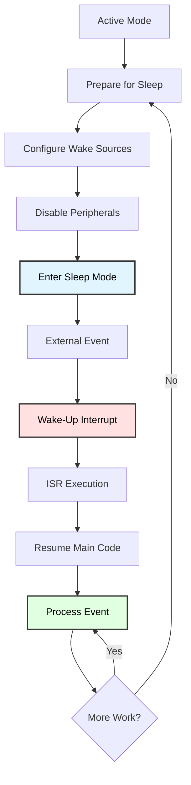

# Wake-Up Optimization
## Advanced Power Management Techniques

**Reference**: [ATmega128 Datasheet](https://ww1.microchip.com/downloads/en/DeviceDoc/doc2467.pdf)

---

## Slide 1: Introduction to Wake-Up Optimization

### Project Overview
- **Master all wake-up sources** (8 external INT, timers, peripherals)
- **Minimize wake-up latency** for responsive systems
- **Optimize power during transitions** (sleep ↔ active)
- **Event-driven architecture** (respond only when needed)
- **Intelligent wake source selection**

### Wake-Up Lifecycle


### Wake-Up Latency Comparison
```
Sleep Mode      | Wake Latency    | Use Case
----------------|-----------------|---------------------------
Idle            | 4-6 cycles      | Fast response (<1 µs)
ADC NR          | 6 cycles        | ADC with minimal delay
Power-save      | 1000 cycles*    | RTC, moderate latency
Power-down      | 1000 cycles*    | Lowest power, slow wake
Standby         | 6 cycles        | Fast wake with ext osc
Ext Standby     | 6 cycles        | RTC + fast wake

* Depends on oscillator startup time
```

---

## Slide 2: External Interrupts (INT0-INT7)

### ATmega128 External Interrupts
```
ATmega128 has 8 external interrupts:
- INT0 (PD0): Can wake from all sleep modes
- INT1 (PD1): Can wake from all sleep modes
- INT2 (PD2): Can wake from all sleep modes
- INT3 (PD3): Can wake from all sleep modes
- INT4 (PE4): Can wake from Power-down, Power-save
- INT5 (PE5): Can wake from Power-down, Power-save
- INT6 (PE6): Can wake from Power-down, Power-save
- INT7 (PE7): Can wake from Power-down, Power-save
```

### External Interrupt Configuration
```c
#include <avr/interrupt.h>

// INT0 ISR (wake source)
ISR(INT0_vect) {
    // Handle wake-up event
}

void config_int0_wakeup(uint8_t trigger) {
    /*
     * Trigger modes:
     * - Low level:     ISC01=0, ISC00=0
     * - Any edge:      ISC01=0, ISC00=1
     * - Falling edge:  ISC01=1, ISC00=0
     * - Rising edge:   ISC01=1, ISC00=1
     */
    
    // Example: Falling edge (button press)
    EICRA = (1 << ISC01);  // Falling edge on INT0
    EIMSK = (1 << INT0);   // Enable INT0
    
    // Clear any pending interrupt
    EIFR = (1 << INTF0);
    
    sei();  // Enable global interrupts
}
```

---

## Slide 3: Multi-Source Wake-Up

### Wake Source Tracking
```c
typedef enum {
    WAKE_NONE,
    WAKE_INT0,
    WAKE_INT1,
    WAKE_TIMER0,
    WAKE_TIMER2,
    WAKE_UART,
    WAKE_ADC,
    WAKE_WDT
} wake_source_t;

volatile wake_source_t last_wake_source = WAKE_NONE;
uint16_t wake_count[8] = {0};

ISR(INT0_vect) {
    last_wake_source = WAKE_INT0;
    wake_count[WAKE_INT0]++;
}

ISR(INT1_vect) {
    last_wake_source = WAKE_INT1;
    wake_count[WAKE_INT1]++;
}

ISR(TIMER2_OVF_vect) {
    last_wake_source = WAKE_TIMER2;
    wake_count[WAKE_TIMER2]++;
}
```

### Multi-Source System
```c
void multi_source_system(void) {
    // Configure multiple wake sources
    EICRA = (1 << ISC01) | (1 << ISC11);  // Falling edge INT0, INT1
    EIMSK = (1 << INT0) | (1 << INT1);
    
    TIMSK |= (1 << TOIE2);  // Timer2 overflow
    
    sei();
    
    set_sleep_mode(SLEEP_MODE_PWR_SAVE);
    
    while (1) {
        last_wake_source = WAKE_NONE;
        
        sleep_enable();
        sleep_cpu();
        sleep_disable();
        
        // Process wake event
        switch (last_wake_source) {
            case WAKE_INT0:
                printf("Button 1 pressed\n");
                break;
            case WAKE_INT1:
                printf("Button 2 pressed\n");
                break;
            case WAKE_TIMER2:
                printf("Timer tick\n");
                break;
            default:
                break;
        }
    }
}
```

---

## Slide 4: Timer Wake-Up

### Timer0 Periodic Wake
```c
volatile uint16_t timer0_overflows = 0;

ISR(TIMER0_OVF_vect) {
    timer0_overflows++;
}

void config_timer0_wakeup(void) {
    // Prescaler 1024: 7.3728 MHz / 1024 / 256 = 28.125 Hz (~35.6 ms)
    TCCR0 = (1 << CS02) | (1 << CS00);
    TIMSK |= (1 << TOIE0);
    TCNT0 = 0;
}

void demo_timer0_wake(void) {
    config_timer0_wakeup();
    sei();
    
    set_sleep_mode(SLEEP_MODE_IDLE);  // Timer0 works in Idle mode
    
    while (1) {
        if (timer0_overflows >= 28) {  // ~1 second
            timer0_overflows = 0;
            
            printf("1 second elapsed\n");
        }
        
        sleep_enable();
        sleep_cpu();
        sleep_disable();
    }
}
```

### Timer2 RTC Wake (32.768 kHz crystal)
```c
volatile uint8_t rtc_seconds = 0;

ISR(TIMER2_COMP_vect) {
    rtc_seconds++;
}

void config_timer2_rtc(void) {
    // Asynchronous mode with 32.768 kHz crystal
    ASSR = (1 << AS2);
    
    // Wait for registers to update
    while (ASSR & ((1<<TCN2UB)|(1<<OCR2UB)|(1<<TCR2UB)));
    
    // CTC mode, prescaler 128
    TCCR2 = (1 << WGM21) | (1 << CS22) | (1 << CS20);
    OCR2 = 255;  // 32768 / 128 / 256 ≈ 1 Hz
    
    TIMSK |= (1 << OCIE2);
}

void demo_rtc_wake(void) {
    config_timer2_rtc();
    sei();
    
    set_sleep_mode(SLEEP_MODE_PWR_SAVE);  // Timer2 async works here
    
    while (1) {
        if (rtc_seconds >= 60) {
            rtc_seconds = 0;
            printf("1 minute passed\n");
        }
        
        sleep_enable();
        sleep_cpu();
        sleep_disable();
    }
}
```

---

## Slide 5: Watchdog Timer Wake-Up

### Watchdog Configuration
```c
#include <avr/wdt.h>

volatile uint8_t wdt_fired = 0;

ISR(WDT_vect) {
    wdt_fired = 1;
}

void config_watchdog_wakeup(uint8_t timeout) {
    /*
     * Timeout values:
     * WDTO_15MS, WDTO_30MS, WDTO_60MS, WDTO_120MS,
     * WDTO_250MS, WDTO_500MS, WDTO_1S, WDTO_2S, 
     * WDTO_4S, WDTO_8S
     */
    
    wdt_enable(timeout);
    WDTCR |= (1 << WDTIE);  // Interrupt mode (not system reset)
}

void demo_watchdog_wake(void) {
    config_watchdog_wakeup(WDTO_2S);  // Wake every 2 seconds
    
    sei();
    set_sleep_mode(SLEEP_MODE_PWR_DOWN);  // Watchdog works in power-down
    
    uint16_t wake_count = 0;
    
    while (1) {
        if (wdt_fired) {
            wdt_fired = 0;
            wake_count++;
            
            printf("WDT wake #%u\n", wake_count);
            
            // Do brief work
        }
        
        sleep_enable();
        sleep_cpu();
        sleep_disable();
    }
}
```

---

## Slide 6: UART Wake-Up

### UART RX Wake
```c
volatile uint8_t uart_rx_flag = 0;
volatile char uart_rx_char = 0;

ISR(USART1_RX_vect) {
    uart_rx_char = UDR1;
    uart_rx_flag = 1;
}

void demo_uart_wake(void) {
    // Initialize UART
    UBRR1H = 0;
    UBRR1L = 47;  // 9600 baud at 7.3728 MHz
    UCSR1B = (1 << RXEN1) | (1 << TXEN1) | (1 << RXCIE1);  // Enable RX interrupt
    
    sei();
    set_sleep_mode(SLEEP_MODE_IDLE);  // UART works in Idle mode
    
    printf("Send any character to wake\n");
    
    while (1) {
        if (uart_rx_flag) {
            uart_rx_flag = 0;
            
            printf("Received: %c\n", uart_rx_char);
            
            // Process command
            if (uart_rx_char == 'q') {
                break;
            }
        }
        
        sleep_enable();
        sleep_cpu();
        sleep_disable();
    }
}
```

---

## Slide 7: Wake-Up Latency Optimization

### Fast Wake-Up Techniques
```c
// BAD: Slow wake-up (1000+ cycles from power-down)
void slow_wake(void) {
    set_sleep_mode(SLEEP_MODE_PWR_DOWN);
    sleep_cpu();
    
    // 1000+ cycles to start oscillator
    // Then execute code
}

// GOOD: Fast wake-up (6 cycles from standby)
void fast_wake(void) {
    set_sleep_mode(SLEEP_MODE_STANDBY);  // External osc stays on
    sleep_cpu();
    
    // Only 6 cycles to wake!
}

// BEST: Use appropriate mode for application
void optimized_wake(uint8_t need_fast_response) {
    if (need_fast_response) {
        set_sleep_mode(SLEEP_MODE_IDLE);  // 4-6 cycles
    } else {
        set_sleep_mode(SLEEP_MODE_PWR_DOWN);  // Lowest power
    }
    
    sleep_cpu();
}
```

### Minimize Active Time
```c
void efficient_wake_processing(void) {
    sei();
    set_sleep_mode(SLEEP_MODE_PWR_DOWN);
    
    while (1) {
        sleep_enable();
        sleep_cpu();
        sleep_disable();
        
        // Wake-up occurred
        
        // Do ONLY essential work
        uint16_t sensor_value = ADC;  // Fast read
        
        if (sensor_value > threshold) {
            PORTB |= (1 << PB0);  // Quick LED on
        }
        
        // Back to sleep immediately
    }
}

/*
 * Active time: <10 µs
 * Sleep time: 999,990 µs (1 second)
 * Duty cycle: 0.001%
 * Power savings: 99.999%
 */
```

---

## Slide 8: BOD (Brown-Out Detector) Optimization

### BOD Power Consumption
```
Brown-Out Detector (BOD):
- Purpose: Reset MCU if voltage drops below threshold
- Power consumption: ~20-25 µA (always on)
- Can be disabled in software during sleep
- Fuse settings for permanent configuration
```

### Disable BOD in Sleep
```c
#include <avr/sleep.h>

void sleep_with_bod_disable(void) {
    set_sleep_mode(SLEEP_MODE_PWR_DOWN);
    
    cli();  // Disable interrupts
    
    // Disable BOD (must be done within 4 cycles before SLEEP)
    sleep_enable();
    sleep_bod_disable();  // Macro that disables BOD
    
    sei();  // Enable interrupts
    sleep_cpu();  // Must execute within 4 cycles of BOD disable
    sleep_disable();
}

/*
 * Power savings:
 * - Normal power-down: ~2 µA + 20 µA (BOD) = 22 µA
 * - With BOD disabled: ~2 µA
 * - Savings: 90%!
 */
```

### BOD Fuse Settings
```
# Fuse configuration (avrdude)
# Permanently disable BOD:
avrdude -p m128 -c <programmer> -U efuse:w:0xFF:m

# Enable BOD at 4.0V:
avrdude -p m128 -c <programmer> -U efuse:w:0xFB:m
```

---

## Slide 9: Pin Configuration for Low Power

### Floating Pins Waste Power
```c
// BAD: Floating inputs waste ~50 µA each
void bad_pin_config(void) {
    // Pins left as inputs with no pull-up
    DDRC = 0x00;   // All inputs
    PORTC = 0x00;  // No pull-ups → FLOATING!
}

// GOOD: Enable pull-ups on unused inputs
void good_pin_config(void) {
    DDRC = 0x00;   // All inputs
    PORTC = 0xFF;  // Pull-ups enabled → defined logic level
}

// BEST: Set unused pins as outputs (lowest power)
void best_pin_config(void) {
    DDRC = 0xFF;   // All outputs
    PORTC = 0x00;  // Logic low (or high, doesn't matter)
}

/*
 * Power savings (8 pins):
 * - Floating: 8 × 50 µA = 400 µA
 * - Pull-ups: 8 × 10 µA = 80 µA (small pull-up current)
 * - Outputs: 8 × 0 µA = 0 µA
 * - Savings: 400 µA!
 */
```

---

## Slide 10: Clock Prescaler Optimization

### Dynamic Clock Scaling
```c
#include <avr/power.h>

void set_clock_prescaler(uint8_t prescaler) {
    /*
     * Prescaler values:
     * 0: 1 (no division)
     * 1: 2
     * 2: 4
     * 3: 8
     * 4: 16
     * 5: 32
     * 6: 64
     * 7: 128
     * 8: 256
     */
    
    cli();
    CLKPR = (1 << CLKPCE);  // Enable prescaler change
    CLKPR = prescaler;       // Set new prescaler
    sei();
}

void demo_dynamic_clock(void) {
    // Full speed for critical operations
    set_clock_prescaler(0);  // 7.3728 MHz
    
    // ... fast processing ...
    
    // Slow clock for low-power monitoring
    set_clock_prescaler(8);  // 7.3728 MHz / 256 = 28.8 kHz
    
    // ... slow sensor reading ...
    
    /*
     * Power consumption proportional to frequency:
     * - 7.3728 MHz: ~15 mA
     * - 28.8 kHz: ~60 µA
     * - Savings: 99.6%!
     */
}
```

---

## Slide 11: Event-Driven Architecture

### Polling vs Event-Driven
```c
// BAD: Polling wastes power
void polling_approach(void) {
    while (1) {
        // Always active, checking conditions
        if (PIND & (1 << PD0)) {
            handle_button();
        }
        
        if (ADC > threshold) {
            handle_sensor();
        }
        
        // CPU never sleeps!
        // Power: ~15 mA continuously
    }
}

// GOOD: Event-driven approach
void event_driven_approach(void) {
    // Configure interrupts
    EIMSK = (1 << INT0);
    ADCSRA |= (1 << ADIE);
    
    sei();
    set_sleep_mode(SLEEP_MODE_PWR_DOWN);
    
    while (1) {
        sleep_enable();
        sleep_cpu();
        sleep_disable();
        
        // Wakes ONLY on events
        // Power: ~2 µA in sleep, brief active bursts
        // Average: <100 µA
    }
}

ISR(INT0_vect) {
    handle_button();
}

ISR(ADC_vect) {
    if (ADC > threshold) {
        handle_sensor();
    }
}
```

---

## Slide 12: Application - Responsive Sensor Node

### Multi-Source Intelligent Wake
```c
typedef struct {
    uint16_t wake_events;
    uint16_t int0_wakes;
    uint16_t timer_wakes;
    uint16_t uart_wakes;
    uint32_t total_sleep_ms;
    uint32_t total_active_ms;
} power_stats_t;

power_stats_t stats = {0};

void intelligent_sensor_node(void) {
    // Configure wake sources
    EICRA = (1 << ISC01);  // INT0 falling edge (urgent event)
    EIMSK = (1 << INT0);
    
    config_timer2_rtc();    // Periodic sampling (1 Hz)
    
    UCSR1B |= (1 << RXCIE1);  // UART commands
    
    // Optimize power
    ACSR |= (1 << ACD);  // Disable comparator
    
    sei();
    set_sleep_mode(SLEEP_MODE_PWR_SAVE);
    
    while (1) {
        uint32_t sleep_start = millis();
        
        sleep_enable();
        sleep_cpu();
        sleep_disable();
        
        stats.total_sleep_ms += millis() - sleep_start;
        uint32_t active_start = millis();
        
        stats.wake_events++;
        
        // Process wake source
        if (last_wake_source == WAKE_INT0) {
            stats.int0_wakes++;
            handle_urgent_event();  // Fastest response
            
        } else if (last_wake_source == WAKE_TIMER2) {
            stats.timer_wakes++;
            periodic_sensor_read();  // Routine sampling
            
        } else if (last_wake_source == WAKE_UART) {
            stats.uart_wakes++;
            handle_command();  // Remote control
        }
        
        stats.total_active_ms += millis() - active_start;
    }
}

void print_power_stats(void) {
    uint32_t total_time = stats.total_sleep_ms + stats.total_active_ms;
    float duty_cycle = (stats.total_active_ms * 100.0) / total_time;
    
    printf("Power Statistics:\n");
    printf("  Wake events: %u\n", stats.wake_events);
    printf("  INT0: %u  Timer: %u  UART: %u\n",
           stats.int0_wakes, stats.timer_wakes, stats.uart_wakes);
    printf("  Sleep time: %lu ms\n", stats.total_sleep_ms);
    printf("  Active time: %lu ms\n", stats.total_active_ms);
    printf("  Duty cycle: %.3f%%\n", duty_cycle);
}
```

---

## Slide 13: Troubleshooting Wake-Up Issues

### Common Problems

| Problem | Cause | Solution |
|---------|-------|----------|
| **Doesn't wake** | Interrupts not enabled | Call sei() before sleep |
| **Wake immediately** | Interrupt flag set | Clear EIFR before sleep |
| **Wrong wake source** | Multiple interrupts pending | Check flags in ISR |
| **Slow wake** | Using power-down + internal osc | Use Standby or Idle mode |
| **High sleep current** | BOD enabled | Disable BOD in sleep |
| **Unstable wake** | Floating pins | Enable pull-ups or set as outputs |
| **Timer doesn't wake** | Wrong sleep mode | Use Idle/Power-save for timers |

### Debug Wake Sources
```c
void debug_wake_sources(void) {
    printf("Interrupt flags:\n");
    printf("  EIFR: 0x%02X\n", EIFR);    // External interrupts
    printf("  TIFR: 0x%02X\n", TIFR);    // Timers
    printf("  UCSR1A: 0x%02X\n", UCSR1A);  // UART
    
    printf("Interrupt enables:\n");
    printf("  EIMSK: 0x%02X\n", EIMSK);
    printf("  TIMSK: 0x%02X\n", TIMSK);
    printf("  UCSR1B: 0x%02X\n", UCSR1B);
    
    printf("Sleep mode: 0x%02X\n", MCUCR & 0x38);
    printf("Global interrupts: %s\n", (SREG & 0x80) ? "ON" : "OFF");
}
```

---

## Slide 14: Summary

### Key Concepts

✓ **Wake sources**: INT0-7, Timers, UART, ADC, Watchdog  
✓ **Latency optimization**: Idle (6 cycles) vs Power-down (1000 cycles)  
✓ **Event-driven**: Sleep until interrupt, minimize active time  
✓ **BOD disable**: Save ~20 µA during sleep  
✓ **Pin configuration**: Pull-ups or outputs on unused pins  
✓ **Clock scaling**: Slow clock for low-power tasks  
✓ **Multi-source**: Track and prioritize different wake events  

### Wake Source Selection
```
Application           | Best Wake Source       | Sleep Mode
----------------------|------------------------|------------------
Button press          | External INT           | Power-down
Periodic sampling     | Timer2 (32.768 kHz)    | Power-save
UART commands         | USART RX               | Idle
ADC conversion        | ADC complete           | ADC Noise Reduction
Timeout/failsafe      | Watchdog               | Power-down
Fast response (<1ms)  | Timer0/1 or External   | Idle
Long intervals (>8s)  | Multiple WDT cycles    | Power-down
```

### Applications
- Responsive sensor nodes (urgent events + periodic sampling)
- Battery-powered input devices (button + timeout)
- Remote monitoring (UART commands + scheduled readings)
- Low-latency control systems (fast wake from standby)
- Energy harvesting devices (maximize sleep time)

---

## Slide 15: Practice Exercises

### Exercise 1: Multi-Button Wake
**Goal**: Wake from multiple external interrupts
- Configure INT0, INT1, INT2 (3 buttons)
- Enter power-down mode
- Wake on any button press
- Display which button woke the system
- Track wake count per button

### Exercise 2: Timer + Button Hybrid
**Goal**: Combine periodic and event-driven wake
- Timer2: Wake every 5 seconds (periodic sampling)
- INT0: Wake on button (urgent event)
- Prioritize button over timer
- Display wake source and statistics

### Exercise 3: UART Command System
**Goal**: Low-power command interpreter
- Sleep in Idle mode
- Wake on UART RX
- Parse commands ('s'=status, 'r'=reset, 'q'=sleep forever)
- Execute command and return to sleep

### Exercise 4: BOD Disable
**Goal**: Minimize sleep current
- Measure current in power-down (BOD enabled)
- Implement sleep_bod_disable()
- Measure current again
- Calculate power savings

### Exercise 5: Intelligent Wake Scheduler
**Goal**: Optimize wake frequency based on events
- Start with 1 Hz wake (Timer2)
- If urgent event (INT0): increase to 10 Hz
- If idle for 60 sec: decrease to 0.1 Hz (watchdog)
- Display current wake interval and power estimate

---

# End of Slides

**Questions?**

For more information, see:
- [ATmega128 Datasheet](https://ww1.microchip.com/downloads/en/DeviceDoc/doc2467.pdf) (Interrupts: pages 76-81, Sleep: pages 36-40)
- Project source code in `Power_Wakeup_Optimization/`
- Shared libraries: `_uart.h`
