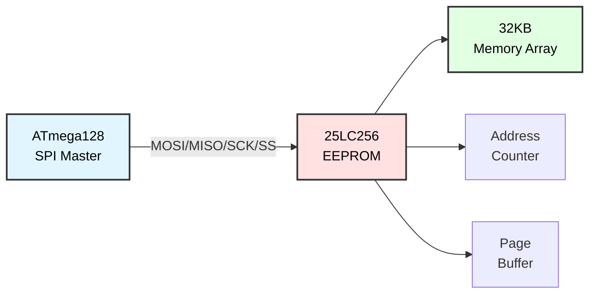

# SPI EEPROM Memory (25LC256)
## ATmega128 Embedded Systems Course

**Reference**: [ATmega128 Datasheet](https://ww1.microchip.com/downloads/en/DeviceDoc/doc2467.pdf)

---

## Slide 1: Introduction to SPI EEPROM

### What is EEPROM?
- **Electrically Erasable Programmable ROM**
- **Non-volatile** storage (retains data without power)
- **Byte-addressable** (read/write individual bytes)
- Common for **configuration, calibration, logs**

### 25LC256 Features
```
Key Specifications:
- Capacity: 32KB (256 Kbit)
- Organization: 32,768 × 8 bits
- Interface: SPI (Mode 0 or Mode 3)
- Supply Voltage: 2.5V - 5.5V
- SPI Clock: Up to 20 MHz (5V), 10 MHz (2.5V)
- Write Time: 5ms typical per page
- Page Size: 64 bytes
- Endurance: 1,000,000 write cycles per byte
- Data Retention: 200 years
```

### SPI EEPROM Architecture


### Memory Organization
```
Address Range: 0x0000 - 0x7FFF (32KB)

┌─────────────────────────────┐
│ Page 0   (0x0000-0x003F)    │ 64 bytes
│ Page 1   (0x0040-0x007F)    │ 64 bytes
│ Page 2   (0x0080-0x00BF)    │ 64 bytes
│ ...                         │
│ Page 511 (0x7FC0-0x7FFF)    │ 64 bytes
└─────────────────────────────┘
Total: 512 pages × 64 bytes = 32KB
```

---

## Slide 2: Hardware Connection

### 25LC256 Pinout
```
25LC256 (8-pin DIP or SOIC)

     ┌───────┐
  CS │1    8│ VCC (5V)
  SO │2    7│ HOLD (pull high)
  WP │3    6│ SCK
 GND │4    5│ SI
     └───────┘

CS:   Chip Select (active low)
SO:   Serial Out (MISO)
SI:   Serial In (MOSI)
SCK:  Serial Clock
WP:   Write Protect (pull high to disable)
HOLD: Hold (pull high to disable)
```

### Wiring Diagram
```
ATmega128                   25LC256
---------                   -------
PB0 (SS)   ───────────────→ CS   (pin 1)
PB1 (SCK)  ───────────────→ SCK  (pin 6)
PB2 (MOSI) ───────────────→ SI   (pin 5)
PB3 (MISO) ←───────────────  SO   (pin 2)

VCC (5V)   ───────────────→ VCC  (pin 8)
VCC (5V)   ─┬─────────────→ HOLD (pin 7)
            └─────────────→ WP   (pin 3)

GND        ───────────────→ GND  (pin 4)
```

### Multiple EEPROM Devices
```
// Use different CS pins for each EEPROM

PB0 ──→ EEPROM 1 CS  (32KB)
PB4 ──→ EEPROM 2 CS  (32KB)
PB5 ──→ EEPROM 3 CS  (32KB)
         ↓
Total: 96KB external storage

// Share MOSI, MISO, SCK
```

---

## Slide 3: SPI Commands

### 25LC256 Instruction Set
```c
// Instruction opcodes
#define EEPROM_CMD_READ   0x03  // Read data from memory
#define EEPROM_CMD_WRITE  0x02  // Write data to memory
#define EEPROM_CMD_WREN   0x06  // Set write enable latch
#define EEPROM_CMD_WRDI   0x04  // Reset write enable latch
#define EEPROM_CMD_RDSR   0x05  // Read status register
#define EEPROM_CMD_WRSR   0x01  // Write status register

// Status register bits
#define EEPROM_SR_WIP     0x01  // Write in progress
#define EEPROM_SR_WEL     0x02  // Write enable latch
#define EEPROM_SR_BP0     0x04  // Block protect bit 0
#define EEPROM_SR_BP1     0x08  // Block protect bit 1
```

### Command Sequences
```mermaid
sequenceDiagram
    participant M as ATmega128
    participant E as 25LC256
    
    Note over M,E: Write Enable
    M->>E: CS Low
    M->>E: WREN (0x06)
    M->>E: CS High
    
    Note over M,E: Write Byte
    M->>E: CS Low
    M->>E: WRITE (0x02)
    M->>E: Address High
    M->>E: Address Low
    M->>E: Data Byte
    M->>E: CS High
    
    Note over M,E: Read Byte
    M->>E: CS Low
    M->>E: READ (0x03)
    M->>E: Address High
    M->>E: Address Low
    E->>M: Data Byte
    M->>E: CS High
    
    style M fill:#e1f5ff,stroke:#333,stroke-width:2px,color:#000
    style E fill:#ffe1e1,stroke:#333,stroke-width:2px,color:#000
```

---

## Slide 4: Basic EEPROM Functions

### Initialize SPI for EEPROM
```c
void eeprom_init(void) {
    // Initialize SPI in master mode
    spi_init_master();
    
    // Set SS (CS) as output and pull high
    DDRB |= (1 << PB0);    // SS as output
    PORTB |= (1 << PB0);   // CS high (deselect)
}

// Chip select control
void eeprom_select(void) {
    PORTB &= ~(1 << PB0);  // CS low
}

void eeprom_deselect(void) {
    PORTB |= (1 << PB0);   // CS high
}
```

### Read Status Register
```c
uint8_t eeprom_read_status(void) {
    uint8_t status;
    
    eeprom_select();
    spi_transfer(EEPROM_CMD_RDSR);
    status = spi_transfer(0x00);  // Dummy byte to read
    eeprom_deselect();
    
    return status;
}

// Wait until write operation completes
void eeprom_wait_ready(void) {
    while (eeprom_read_status() & EEPROM_SR_WIP) {
        _delay_us(10);
    }
}
```

### Write Enable
```c
void eeprom_write_enable(void) {
    eeprom_select();
    spi_transfer(EEPROM_CMD_WREN);
    eeprom_deselect();
}

void eeprom_write_disable(void) {
    eeprom_select();
    spi_transfer(EEPROM_CMD_WRDI);
    eeprom_deselect();
}
```

---

## Slide 5: Read and Write Bytes

### Write Single Byte
```c
void eeprom_write_byte(uint16_t address, uint8_t data) {
    // Enable writes
    eeprom_write_enable();
    
    // Send write command
    eeprom_select();
    spi_transfer(EEPROM_CMD_WRITE);
    spi_transfer((uint8_t)(address >> 8));    // Address high byte
    spi_transfer((uint8_t)(address & 0xFF));  // Address low byte
    spi_transfer(data);                       // Data byte
    eeprom_deselect();
    
    // Wait for write to complete (~5ms)
    eeprom_wait_ready();
}

// Example: Write 0x42 to address 0x1234
eeprom_write_byte(0x1234, 0x42);
```

### Read Single Byte
```c
uint8_t eeprom_read_byte(uint16_t address) {
    uint8_t data;
    
    eeprom_select();
    spi_transfer(EEPROM_CMD_READ);
    spi_transfer((uint8_t)(address >> 8));    // Address high byte
    spi_transfer((uint8_t)(address & 0xFF));  // Address low byte
    data = spi_transfer(0x00);                // Read data byte
    eeprom_deselect();
    
    return data;
}

// Example: Read from address 0x1234
uint8_t value = eeprom_read_byte(0x1234);
```

### Sequential Read
```c
void eeprom_read_bytes(uint16_t address, uint8_t *buffer, uint16_t length) {
    eeprom_select();
    spi_transfer(EEPROM_CMD_READ);
    spi_transfer((uint8_t)(address >> 8));
    spi_transfer((uint8_t)(address & 0xFF));
    
    for (uint16_t i = 0; i < length; i++) {
        buffer[i] = spi_transfer(0x00);
    }
    
    eeprom_deselect();
}

// Example: Read 10 bytes starting from 0x0000
uint8_t buffer[10];
eeprom_read_bytes(0x0000, buffer, 10);
```

---

## Slide 6: Page Write

### Why Page Write?
```
Single-byte write: 5ms per byte
Page write: 5ms per 64 bytes

Example: Write 128 bytes
  Byte-by-byte: 128 × 5ms = 640ms
  Page write:   2 × 5ms = 10ms  (64× faster!)
```

### Page Write Function
```c
#define EEPROM_PAGE_SIZE 64

void eeprom_write_page(uint16_t page_address, uint8_t *data, uint8_t length) {
    // Clamp length to page size
    if (length > EEPROM_PAGE_SIZE) {
        length = EEPROM_PAGE_SIZE;
    }
    
    // Ensure address is page-aligned
    page_address &= 0xFFC0;  // Mask lower 6 bits (64-byte boundary)
    
    // Enable writes
    eeprom_write_enable();
    
    // Send write command
    eeprom_select();
    spi_transfer(EEPROM_CMD_WRITE);
    spi_transfer((uint8_t)(page_address >> 8));
    spi_transfer((uint8_t)(page_address & 0xFF));
    
    // Write data
    for (uint8_t i = 0; i < length; i++) {
        spi_transfer(data[i]);
    }
    
    eeprom_deselect();
    
    // Wait for write to complete
    eeprom_wait_ready();
}

// Example: Write 64 bytes to page 0
uint8_t page_data[64] = {0, 1, 2, ..., 63};
eeprom_write_page(0x0000, page_data, 64);
```

### Write Buffer (Multi-Page)
```c
void eeprom_write_buffer(uint16_t address, uint8_t *data, uint16_t length) {
    uint16_t offset = 0;
    
    while (length > 0) {
        // Calculate bytes to write in this page
        uint16_t page_start = address & 0xFFC0;  // Page boundary
        uint16_t page_offset = address & 0x003F; // Offset within page
        uint16_t bytes_in_page = EEPROM_PAGE_SIZE - page_offset;
        
        if (bytes_in_page > length) {
            bytes_in_page = length;
        }
        
        // Write this chunk
        eeprom_write_enable();
        
        eeprom_select();
        spi_transfer(EEPROM_CMD_WRITE);
        spi_transfer((uint8_t)(address >> 8));
        spi_transfer((uint8_t)(address & 0xFF));
        
        for (uint16_t i = 0; i < bytes_in_page; i++) {
            spi_transfer(data[offset + i]);
        }
        
        eeprom_deselect();
        eeprom_wait_ready();
        
        // Update for next page
        address += bytes_in_page;
        offset += bytes_in_page;
        length -= bytes_in_page;
    }
}
```

---

## Slide 7: Application - Configuration Storage

### Store System Settings
```c
typedef struct {
    uint8_t brightness;      // 0-255
    uint8_t contrast;        // 0-255
    uint8_t alarm_hour;      // 0-23
    uint8_t alarm_minute;    // 0-59
    uint8_t alarm_enabled;   // 0 or 1
    uint16_t checksum;       // For validation
} config_t;

#define CONFIG_ADDR 0x0000

uint16_t calculate_checksum(config_t *config) {
    uint16_t sum = 0;
    uint8_t *ptr = (uint8_t *)config;
    
    for (uint8_t i = 0; i < sizeof(config_t) - 2; i++) {  // Exclude checksum itself
        sum += ptr[i];
    }
    
    return sum;
}

void save_config(config_t *config) {
    config->checksum = calculate_checksum(config);
    
    eeprom_write_buffer(CONFIG_ADDR, (uint8_t *)config, sizeof(config_t));
    
    printf("Config saved to EEPROM\n");
}

void load_config(config_t *config) {
    eeprom_read_bytes(CONFIG_ADDR, (uint8_t *)config, sizeof(config_t));
    
    uint16_t checksum = calculate_checksum(config);
    
    if (checksum == config->checksum) {
        printf("Config loaded successfully\n");
    } else {
        printf("Config corrupted! Using defaults.\n");
        
        // Set defaults
        config->brightness = 128;
        config->contrast = 128;
        config->alarm_hour = 7;
        config->alarm_minute = 0;
        config->alarm_enabled = 0;
    }
}
```

---

## Slide 8: Application - Data Logging

### Circular Buffer Logger
```c
typedef struct {
    uint8_t year, month, day;
    uint8_t hour, minute, second;
    int16_t temperature;  // °C × 10
    uint16_t humidity;    // % × 10
} log_entry_t;

#define LOG_START_ADDR  0x0100
#define LOG_MAX_ENTRIES 200  // (32KB - 256 bytes) / sizeof(log_entry_t)

uint16_t log_write_index = 0;

void log_sensor_data(int16_t temp, uint16_t humidity) {
    log_entry_t entry;
    
    // Get current time from RTC
    rtc_time_t time;
    ds1307_get_time(&time);
    
    entry.year = time.year;
    entry.month = time.month;
    entry.day = time.date;
    entry.hour = time.hour;
    entry.minute = time.minute;
    entry.second = time.second;
    entry.temperature = temp;
    entry.humidity = humidity;
    
    // Calculate EEPROM address
    uint16_t addr = LOG_START_ADDR + (log_write_index * sizeof(log_entry_t));
    
    // Write entry
    eeprom_write_buffer(addr, (uint8_t *)&entry, sizeof(log_entry_t));
    
    // Update index (circular buffer)
    log_write_index++;
    if (log_write_index >= LOG_MAX_ENTRIES) {
        log_write_index = 0;
    }
    
    printf("Logged: 20%02d-%02d-%02d %02d:%02d  Temp:%d.%d°C  Humidity:%d.%d%%\n",
           entry.year, entry.month, entry.day,
           entry.hour, entry.minute,
           temp / 10, abs(temp % 10),
           humidity / 10, humidity % 10);
}

void read_log_entry(uint16_t index, log_entry_t *entry) {
    uint16_t addr = LOG_START_ADDR + (index * sizeof(log_entry_t));
    eeprom_read_bytes(addr, (uint8_t *)entry, sizeof(log_entry_t));
}

void display_log_history(void) {
    log_entry_t entry;
    
    printf("\n=== Data Log History ===\n");
    
    for (uint16_t i = 0; i < LOG_MAX_ENTRIES; i++) {
        read_log_entry(i, &entry);
        
        // Check if entry is valid (year != 0xFF indicates empty)
        if (entry.year == 0xFF) break;
        
        printf("%3d: 20%02d-%02d-%02d %02d:%02d  Temp:%d.%d°C  RH:%d.%d%%\n",
               i,
               entry.year, entry.month, entry.day,
               entry.hour, entry.minute,
               entry.temperature / 10, abs(entry.temperature % 10),
               entry.humidity / 10, entry.humidity % 10);
    }
}
```

---

## Slide 9: Application - Waveform Storage

### Store ADC Samples
```c
#define WAVEFORM_ADDR 0x4000
#define WAVEFORM_SAMPLES 1000

void capture_waveform(void) {
    uint16_t samples[WAVEFORM_SAMPLES];
    
    printf("Capturing waveform...\n");
    
    // Capture ADC samples at high speed
    for (uint16_t i = 0; i < WAVEFORM_SAMPLES; i++) {
        samples[i] = adc_read(0);
        _delay_us(100);  // 10 kHz sampling
    }
    
    printf("Saving to EEPROM...\n");
    
    // Save to EEPROM (2 bytes per sample)
    eeprom_write_buffer(WAVEFORM_ADDR, (uint8_t *)samples, WAVEFORM_SAMPLES * 2);
    
    printf("Done!\n");
}

void replay_waveform(void) {
    uint16_t samples[WAVEFORM_SAMPLES];
    
    printf("Loading waveform from EEPROM...\n");
    
    eeprom_read_bytes(WAVEFORM_ADDR, (uint8_t *)samples, WAVEFORM_SAMPLES * 2);
    
    printf("Replaying via DAC/PWM...\n");
    
    // Output via PWM or external DAC
    for (uint16_t i = 0; i < WAVEFORM_SAMPLES; i++) {
        pwm_set_duty(samples[i] >> 2);  // Scale 10-bit to 8-bit
        _delay_us(100);
    }
    
    printf("Done!\n");
}
```

---

## Slide 10: Write Protection

### Block Protection
```c
// Status register BP1:BP0 bits
// 00: No protection
// 01: 0x6000-0x7FFF protected (upper 1/4)
// 10: 0x4000-0x7FFF protected (upper 1/2)
// 11: 0x0000-0x7FFF protected (all)

void eeprom_set_protection(uint8_t level) {
    // level: 0-3
    
    eeprom_write_enable();
    
    eeprom_select();
    spi_transfer(EEPROM_CMD_WRSR);
    spi_transfer(level << 2);  // Set BP1:BP0
    eeprom_deselect();
    
    eeprom_wait_ready();
}

// Example: Protect upper half
eeprom_set_protection(2);  // BP1:BP0 = 10

// Hardware write protect (WP pin)
// Pull WP pin low to freeze status register
```

---

## Slide 11: EEPROM Chip Erase

### Erase Entire EEPROM
```c
void eeprom_chip_erase(void) {
    printf("Erasing EEPROM (32KB)...\n");
    
    uint8_t empty_page[EEPROM_PAGE_SIZE];
    memset(empty_page, 0xFF, EEPROM_PAGE_SIZE);  // Fill with 0xFF (erased state)
    
    // Erase all 512 pages
    for (uint16_t page = 0; page < 512; page++) {
        uint16_t addr = page * EEPROM_PAGE_SIZE;
        
        eeprom_write_page(addr, empty_page, EEPROM_PAGE_SIZE);
        
        // Progress indicator
        if ((page % 50) == 0) {
            printf("  Page %d/512\n", page);
        }
    }
    
    printf("Erase complete!\n");
}

// Fast erase (write 0xFF to all addresses)
void eeprom_fast_erase(void) {
    uint8_t erase_byte = 0xFF;
    
    for (uint32_t addr = 0; addr < 32768; addr++) {
        if ((addr % EEPROM_PAGE_SIZE) == 0) {
            // New page, enable write
            eeprom_write_enable();
            
            eeprom_select();
            spi_transfer(EEPROM_CMD_WRITE);
            spi_transfer((uint8_t)(addr >> 8));
            spi_transfer((uint8_t)(addr & 0xFF));
        }
        
        spi_transfer(erase_byte);
        
        if ((addr % EEPROM_PAGE_SIZE) == (EEPROM_PAGE_SIZE - 1)) {
            // End of page, deselect and wait
            eeprom_deselect();
            eeprom_wait_ready();
        }
    }
}
```

---

## Slide 12: EEPROM Test Functions

### Memory Test
```c
void eeprom_memory_test(void) {
    printf("EEPROM Memory Test\n");
    printf("------------------\n");
    
    // Test 1: Write and read single byte
    printf("Test 1: Single byte...\n");
    eeprom_write_byte(0x0000, 0xAA);
    uint8_t val = eeprom_read_byte(0x0000);
    
    if (val == 0xAA) {
        printf("  PASS (0xAA)\n");
    } else {
        printf("  FAIL (got 0x%02X)\n", val);
    }
    
    // Test 2: Page write
    printf("Test 2: Page write...\n");
    uint8_t test_page[64];
    for (uint8_t i = 0; i < 64; i++) {
        test_page[i] = i;
    }
    
    eeprom_write_page(0x0100, test_page, 64);
    
    uint8_t read_page[64];
    eeprom_read_bytes(0x0100, read_page, 64);
    
    uint8_t errors = 0;
    for (uint8_t i = 0; i < 64; i++) {
        if (read_page[i] != i) {
            errors++;
        }
    }
    
    if (errors == 0) {
        printf("  PASS\n");
    } else {
        printf("  FAIL (%d errors)\n", errors);
    }
    
    // Test 3: Address wraparound
    printf("Test 3: Address range...\n");
    eeprom_write_byte(0x0000, 0x00);
    eeprom_write_byte(0x7FFF, 0xFF);
    
    uint8_t start = eeprom_read_byte(0x0000);
    uint8_t end = eeprom_read_byte(0x7FFF);
    
    if (start == 0x00 && end == 0xFF) {
        printf("  PASS\n");
    } else {
        printf("  FAIL\n");
    }
    
    printf("\nTest complete!\n");
}
```

---

## Slide 13: Troubleshooting

### Common Issues

| Problem | Cause | Solution |
|---------|-------|----------|
| **No response** | SPI not initialized | Check spi_init(), CS pin config |
| **Wrong data read** | Timing issue | Reduce SPI clock, add delays |
| **Write fails** | No WREN before write | Call eeprom_write_enable() first |
| **Slow writes** | Not using page write | Use page write for bulk data |
| **Corrupted data** | Write during read | Wait for WIP to clear |
| **All 0xFF** | Erased or faulty EEPROM | Test with known good chip |

### Debug Code
```c
void eeprom_debug(void) {
    uart_init();
    eeprom_init();
    
    printf("EEPROM Debug\n");
    printf("------------\n");
    
    // Read status register
    uint8_t status = eeprom_read_status();
    printf("Status: 0x%02X\n", status);
    printf("  WIP: %d (write in progress)\n", (status & EEPROM_SR_WIP) ? 1 : 0);
    printf("  WEL: %d (write enable latch)\n", (status & EEPROM_SR_WEL) ? 1 : 0);
    printf("  BP:  %d (block protect)\n", (status >> 2) & 0x03);
    
    // Read first 16 bytes
    printf("\nFirst 16 bytes:\n");
    for (uint8_t i = 0; i < 16; i++) {
        uint8_t data = eeprom_read_byte(i);
        printf("  0x%04X: 0x%02X (%d)\n", i, data, data);
    }
}
```

---

## Slide 14: Best Practices

### EEPROM Usage Guidelines

✓ **Wait for write completion**
```c
eeprom_write_byte(addr, data);
eeprom_wait_ready();  // ALWAYS wait!
```

✓ **Use page writes for bulk data**
```c
// 64× faster than byte-by-byte
eeprom_write_page(addr, buffer, 64);
```

✓ **Validate with checksums**
```c
// Detect data corruption
uint16_t checksum = calculate_checksum(data);
```

✓ **Limit write cycles**
```c
// 1,000,000 cycles per byte
// Avoid frequent writes to same address
```

✓ **Use wear leveling**
```c
// Distribute writes across addresses
uint16_t write_addr = (counter % 1000) * sizeof(data);
```

✓ **Initialize to known state**
```c
// On first boot, erase or set defaults
if (eeprom_read_byte(0) == 0xFF) {
    initialize_eeprom();
}
```

---

## Slide 15: Summary

### Key Concepts

✓ **Capacity**: 32KB (25LC256)  
✓ **Page size**: 64 bytes  
✓ **Write time**: 5ms per page  
✓ **Endurance**: 1,000,000 write cycles  
✓ **Interface**: SPI (MOSI, MISO, SCK, CS)  
✓ **Commands**: READ, WRITE, WREN, RDSR  
✓ **Protection**: Block protect, WP pin  

### Applications
- Configuration storage
- Calibration data
- Data logging (circular buffers)
- Waveform capture/replay
- Event history
- User preferences

### Performance
```
Single byte write: 5ms
Page write (64 bytes): 5ms
Sequential read: limited by SPI speed

Recommended: Use page writes whenever possible
```

---

## Slide 16: Practice Exercises

### Exercise 1: Basic Read/Write
**Goal**: Store and retrieve data
- Initialize SPI and EEPROM
- Write 10 bytes to EEPROM
- Read back and verify
- Display on LCD or UART

### Exercise 2: Configuration Manager
**Goal**: Non-volatile settings
- Define settings structure
- Implement save/load functions
- Add checksum validation
- Restore defaults if corrupted

### Exercise 3: Data Logger
**Goal**: Log sensor readings
- Create timestamped log entries
- Implement circular buffer
- Display last 10 entries
- Export via UART

### Exercise 4: Waveform Recorder
**Goal**: Capture and replay signals
- Sample ADC at 10 kHz
- Store 1000 samples in EEPROM
- Replay via PWM or DAC
- Display waveform on LCD

### Exercise 5: Wear Leveling
**Goal**: Extend EEPROM lifetime
- Implement wear leveling algorithm
- Track write count per page
- Distribute writes evenly
- Monitor EEPROM health

---

## Slide 17: Additional Resources

### ATmega128 Documentation
- **[Official Datasheet (PDF)](https://ww1.microchip.com/downloads/en/DeviceDoc/doc2467.pdf)**
  - Section 18: Serial Peripheral Interface (SPI)

### 25LC256 Resources
- 25LC256 Datasheet (Microchip)
- SPI protocol specification
- Page write timing diagrams
- Write protection features

### Related Topics
- SPI multi-device communication
- External memory management
- Wear leveling algorithms
- Data integrity (CRC, checksums)

### Applications
- Industrial data logging
- Configuration backup
- Firmware parameter storage
- Calibration data retention

---

# End of Slides

**Questions?**

For more information, see:
- [ATmega128 Datasheet](https://ww1.microchip.com/downloads/en/DeviceDoc/doc2467.pdf)
- Project source code in `SPI_EEPROM_Memory/`
- Shared libraries: `_spi.h`, `_eeprom_spi.h`
