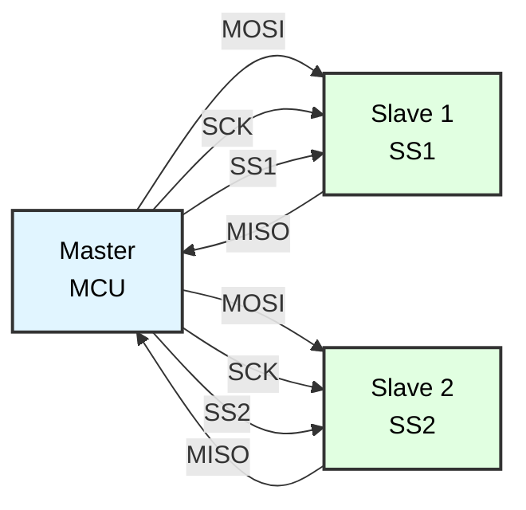
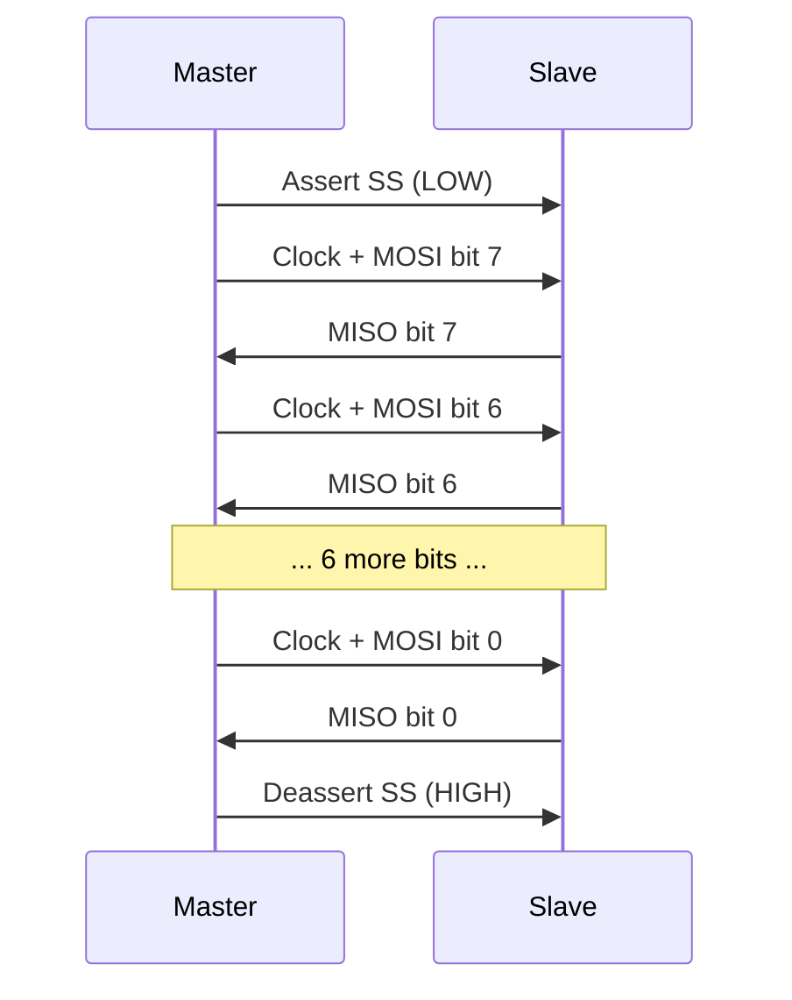

# SPI Master Communication
## ATmega128 Embedded Systems Course

**Reference**: [ATmega128 Datasheet](https://ww1.microchip.com/downloads/en/DeviceDoc/doc2467.pdf)

---

## Slide 1: Introduction to SPI

### What is SPI?
- **Serial Peripheral Interface**
- **Synchronous** serial communication protocol
- Developed by Motorola
- **Full-duplex** communication (simultaneous TX/RX)
- **Master-slave** architecture

### SPI Bus Structure


### Key Features
✓ **4-wire interface**: MOSI, MISO, SCK, SS  
✓ **Full-duplex**: Simultaneous send/receive  
✓ **High speed**: 1 MHz to 50+ MHz  
✓ **Simple protocol**: No addressing, no ACK  
✓ **Flexible**: Multiple modes and configurations  

---

## Slide 2: SPI Signal Lines

### Four-Wire Interface
| Signal | Name | Direction | Function |
|--------|------|-----------|----------|
| **MOSI** | Master Out Slave In | Master → Slave | Data from master |
| **MISO** | Master In Slave Out | Slave → Master | Data from slave |
| **SCK** | Serial Clock | Master → Slave | Clock signal |
| **SS** | Slave Select | Master → Slave | Chip select (active LOW) |

**Alternative Names:**
- MOSI = SDO (Serial Data Out), SI (Serial In), DI (Data In)
- MISO = SDI (Serial Data In), SO (Serial Out), DO (Data Out)
- SS = CS (Chip Select), NSS (Not Slave Select)

### ATmega128 SPI Pins
```
ATmega128 SPI Pins:
- MOSI: PB2 (Port B, Pin 2)
- MISO: PB3 (Port B, Pin 3)
- SCK:  PB1 (Port B, Pin 1)
- SS:   PB0 (Port B, Pin 0) - Can use any GPIO for slave select
```

---

## Slide 3: SPI Communication

### Full-Duplex Operation
```
Master and Slave each have shift register
Data shifts out while data shifts in simultaneously

Master Shift Register:  [7 6 5 4 3 2 1 0]
                         ↓ MOSI      MISO ↑
Slave Shift Register:   [7 6 5 4 3 2 1 0]

Clock: Master generates SCK
Each clock pulse shifts one bit
```

### SPI Transaction


### Timing Diagram
```
SS   ‾‾‾‾\_______________________________/‾‾‾‾

SCK  ______/‾\_/‾\_/‾\_/‾\_/‾\_/‾\_/‾\_/‾\____

MOSI ------<D7><D6><D5><D4><D3><D2><D1><D0>---

MISO ------<D7><D6><D5><D4><D3><D2><D1><D0>---
```

---

## Slide 4: SPI Modes (Clock Polarity and Phase)

### CPOL and CPHA
| Mode | CPOL | CPHA | Idle Clock | Sample Edge |
|------|------|------|------------|-------------|
| **0** | 0 | 0 | LOW | Rising (leading) |
| **1** | 0 | 1 | LOW | Falling (trailing) |
| **2** | 1 | 0 | HIGH | Falling (leading) |
| **3** | 1 | 1 | HIGH | Rising (trailing) |

**CPOL** (Clock Polarity):
- 0: Clock idle state is LOW
- 1: Clock idle state is HIGH

**CPHA** (Clock Phase):
- 0: Sample on leading edge, shift on trailing edge
- 1: Shift on leading edge, sample on trailing edge

### Mode 0 Timing (Most Common)
```
CPOL=0, CPHA=0

SCK  ___/‾\_/‾\_/‾\_/‾\_/‾\_/‾\_/‾\_/‾\___
       ↑ sample     ↑ sample
       
Data setup on falling edge, sampled on rising edge
```

### Mode 3 Timing
```
CPOL=1, CPHA=1

SCK  ‾‾‾\_/‾\_/‾\_/‾\_/‾\_/‾\_/‾\_/‾\_/‾‾‾
         ↑ sample     ↑ sample
```

---

## Slide 5: ATmega128 SPI Registers

### SPI Control Register (SPCR)
```
Bit     7      6      5      4      3      2      1      0
      ┌──────┬──────┬──────┬──────┬──────┬──────┬──────┬──────┐
SPCR  │ SPIE │ SPE  │ DORD │ MSTR │ CPOL │ CPHA │ SPR1 │ SPR0 │
      └──────┴──────┴──────┴──────┴──────┴──────┴──────┴──────┘
```

**Bit Descriptions:**
- **SPIE**: SPI Interrupt Enable
- **SPE**: SPI Enable
- **DORD**: Data Order (0=MSB first, 1=LSB first)
- **MSTR**: Master/Slave Select (1=Master)
- **CPOL**: Clock Polarity
- **CPHA**: Clock Phase
- **SPR1:SPR0**: SPI Clock Rate Select

### SPI Status Register (SPSR)
```
Bit     7      6      5      4      3      2      1      0
      ┌──────┬──────┬──────┬──────┬──────┬──────┬──────┬──────┐
SPSR  │ SPIF │ WCOL │   -  │   -  │   -  │   -  │   -  │ SPI2X│
      └──────┴──────┴──────┴──────┴──────┴──────┴──────┴──────┘
```

**Bit Descriptions:**
- **SPIF**: SPI Interrupt Flag (set when transfer complete)
- **WCOL**: Write Collision Flag
- **SPI2X**: Double SPI Speed

### SPI Data Register (SPDR)
```
SPDR: Read/write data register
- Write to SPDR starts transmission
- Read from SPDR gets received data
```

---

## Slide 6: SPI Clock Frequency

### Clock Rate Selection
```
SPI_CLK = F_CPU / Prescaler

Prescaler options (SPR1, SPR0, SPI2X):
```

| SPI2X | SPR1 | SPR0 | Prescaler | SPI Clock @ 16MHz |
|-------|------|------|-----------|-------------------|
| 0 | 0 | 0 | 4 | 4 MHz |
| 0 | 0 | 1 | 16 | 1 MHz |
| 0 | 1 | 0 | 64 | 250 kHz |
| 0 | 1 | 1 | 128 | 125 kHz |
| 1 | 0 | 0 | 2 | 8 MHz |
| 1 | 0 | 1 | 8 | 2 MHz |
| 1 | 1 | 0 | 32 | 500 kHz |
| 1 | 1 | 1 | 64 | 250 kHz |

### Example Calculations
```c
// F_CPU = 16 MHz

// 4 MHz: SPR1=0, SPR0=0, SPI2X=0
#define SPI_CLOCK_DIV4   0x00

// 1 MHz: SPR1=0, SPR0=1, SPI2X=0
#define SPI_CLOCK_DIV16  0x01

// 8 MHz: SPR1=0, SPR0=0, SPI2X=1 (fastest)
#define SPI_CLOCK_DIV2   0x04
```

---

## Slide 7: SPI Initialization

### Master Mode Initialization
```c
#include <avr/io.h>

void spi_master_init(void) {
    // Set MOSI, SCK, and SS as outputs
    DDRB |= (1 << PB2) | (1 << PB1) | (1 << PB0);
    
    // Set MISO as input
    DDRB &= ~(1 << PB3);
    
    // Enable SPI, Master mode, Clock = F_CPU/16 (1 MHz @ 16MHz)
    // Mode 0: CPOL=0, CPHA=0
    SPCR = (1 << SPE) | (1 << MSTR) | (1 << SPR0);
}

// Faster SPI (4 MHz)
void spi_master_init_fast(void) {
    DDRB |= (1 << PB2) | (1 << PB1) | (1 << PB0);
    DDRB &= ~(1 << PB3);
    
    // Clock = F_CPU/4 = 4 MHz
    SPCR = (1 << SPE) | (1 << MSTR);
}

// SPI Mode selection
void spi_set_mode(uint8_t mode) {
    switch (mode) {
        case 0:  // CPOL=0, CPHA=0
            SPCR &= ~((1 << CPOL) | (1 << CPHA));
            break;
        case 1:  // CPOL=0, CPHA=1
            SPCR &= ~(1 << CPOL);
            SPCR |= (1 << CPHA);
            break;
        case 2:  // CPOL=1, CPHA=0
            SPCR |= (1 << CPOL);
            SPCR &= ~(1 << CPHA);
            break;
        case 3:  // CPOL=1, CPHA=1
            SPCR |= (1 << CPOL) | (1 << CPHA);
            break;
    }
}
```

---

## Slide 8: SPI Transfer Functions

### Basic Transfer
```c
uint8_t spi_transfer(uint8_t data) {
    // Start transmission
    SPDR = data;
    
    // Wait for transmission complete
    while (!(SPSR & (1 << SPIF)));
    
    // Return received data
    return SPDR;
}

// Write only (ignore received data)
void spi_write(uint8_t data) {
    SPDR = data;
    while (!(SPSR & (1 << SPIF)));
    (void)SPDR;  // Dummy read to clear SPIF
}

// Read only (send dummy byte)
uint8_t spi_read(void) {
    SPDR = 0xFF;  // Dummy byte
    while (!(SPSR & (1 << SPIF)));
    return SPDR;
}

// Multi-byte transfer
void spi_transfer_bytes(uint8_t *tx_data, uint8_t *rx_data, uint16_t length) {
    for (uint16_t i = 0; i < length; i++) {
        rx_data[i] = spi_transfer(tx_data[i]);
    }
}

// Write buffer
void spi_write_bytes(const uint8_t *data, uint16_t length) {
    for (uint16_t i = 0; i < length; i++) {
        spi_write(data[i]);
    }
}

// Read buffer
void spi_read_bytes(uint8_t *buffer, uint16_t length) {
    for (uint16_t i = 0; i < length; i++) {
        buffer[i] = spi_read();
    }
}
```

---

## Slide 9: Slave Select (Chip Select)

### Managing Multiple Slaves
```c
// Define slave select pins
#define SS_DEVICE_1  PB0
#define SS_DEVICE_2  PB4
#define SS_DEVICE_3  PB5

void spi_init_multi_slave(void) {
    // Set SS pins as outputs
    DDRB |= (1 << SS_DEVICE_1) | (1 << SS_DEVICE_2) | (1 << SS_DEVICE_3);
    
    // Deselect all devices (SS HIGH)
    PORTB |= (1 << SS_DEVICE_1) | (1 << SS_DEVICE_2) | (1 << SS_DEVICE_3);
    
    spi_master_init();
}

// Select device
void spi_select(uint8_t device_pin) {
    PORTB &= ~(1 << device_pin);  // Pull LOW to select
}

// Deselect device
void spi_deselect(uint8_t device_pin) {
    PORTB |= (1 << device_pin);   // Pull HIGH to deselect
}

// Transaction with device
void spi_transaction(uint8_t device_pin, uint8_t *tx, uint8_t *rx, uint16_t len) {
    spi_select(device_pin);
    spi_transfer_bytes(tx, rx, len);
    spi_deselect(device_pin);
}

// Example usage
int main(void) {
    spi_init_multi_slave();
    
    uint8_t tx_data[3] = {0x01, 0x02, 0x03};
    uint8_t rx_data[3];
    
    // Communicate with device 1
    spi_transaction(SS_DEVICE_1, tx_data, rx_data, 3);
    
    // Communicate with device 2
    spi_transaction(SS_DEVICE_2, tx_data, rx_data, 3);
    
    while (1);
}
```

---

## Slide 10: Example - 25LC256 EEPROM

### SPI EEPROM (25LC256)
```
Capacity: 256 Kbit (32 KB)
Page size: 64 bytes
Max clock: 10 MHz
SPI Mode: 0,0 or 1,1

Commands:
  0x03: READ
  0x02: WRITE
  0x06: WREN (Write Enable)
  0x04: WRDI (Write Disable)
  0x05: RDSR (Read Status)
  0x01: WRSR (Write Status)
```

### 25LC256 Driver
```c
#define EEPROM_SS  PB0

// Command codes
#define EEPROM_CMD_READ   0x03
#define EEPROM_CMD_WRITE  0x02
#define EEPROM_CMD_WREN   0x06
#define EEPROM_CMD_WRDI   0x04
#define EEPROM_CMD_RDSR   0x05

void eeprom_init(void) {
    spi_master_init();
    
    // SS as output, HIGH (deselected)
    DDRB |= (1 << EEPROM_SS);
    PORTB |= (1 << EEPROM_SS);
}

uint8_t eeprom_read_status(void) {
    uint8_t status;
    
    spi_select(EEPROM_SS);
    spi_write(EEPROM_CMD_RDSR);
    status = spi_read();
    spi_deselect(EEPROM_SS);
    
    return status;
}

void eeprom_write_enable(void) {
    spi_select(EEPROM_SS);
    spi_write(EEPROM_CMD_WREN);
    spi_deselect(EEPROM_SS);
}

void eeprom_wait_ready(void) {
    while (eeprom_read_status() & 0x01);  // Wait for WIP bit clear
}

uint8_t eeprom_read_byte(uint16_t address) {
    uint8_t data;
    
    spi_select(EEPROM_SS);
    spi_write(EEPROM_CMD_READ);
    spi_write(address >> 8);    // Address high byte
    spi_write(address & 0xFF);  // Address low byte
    data = spi_read();
    spi_deselect(EEPROM_SS);
    
    return data;
}

void eeprom_write_byte(uint16_t address, uint8_t data) {
    eeprom_write_enable();
    
    spi_select(EEPROM_SS);
    spi_write(EEPROM_CMD_WRITE);
    spi_write(address >> 8);
    spi_write(address & 0xFF);
    spi_write(data);
    spi_deselect(EEPROM_SS);
    
    eeprom_wait_ready();
}

void eeprom_read_bytes(uint16_t address, uint8_t *buffer, uint16_t length) {
    spi_select(EEPROM_SS);
    spi_write(EEPROM_CMD_READ);
    spi_write(address >> 8);
    spi_write(address & 0xFF);
    spi_read_bytes(buffer, length);
    spi_deselect(EEPROM_SS);
}

void eeprom_write_page(uint16_t address, uint8_t *data, uint8_t length) {
    if (length > 64) length = 64;
    
    eeprom_write_enable();
    
    spi_select(EEPROM_SS);
    spi_write(EEPROM_CMD_WRITE);
    spi_write(address >> 8);
    spi_write(address & 0xFF);
    spi_write_bytes(data, length);
    spi_deselect(EEPROM_SS);
    
    eeprom_wait_ready();
}
```

---

## Slide 11: Example - MCP3008 ADC

### MCP3008 8-Channel 10-bit ADC
```
Channels: 8 single-ended or 4 differential
Resolution: 10-bit
Sample rate: 200 ksps
SPI Mode: 0,0 or 1,1
Max clock: 3.6 MHz @ 5V
```

### MCP3008 Communication Protocol
```
Start bit + Single/Diff + Channel (3 bits) + ... = Result (10 bits)

Command format: [Start][SGL/DIFF][D2][D1][D0]
```

### MCP3008 Driver
```c
#define MCP3008_SS  PB4

void mcp3008_init(void) {
    spi_master_init();
    
    DDRB |= (1 << MCP3008_SS);
    PORTB |= (1 << MCP3008_SS);
}

uint16_t mcp3008_read(uint8_t channel) {
    if (channel > 7) channel = 7;
    
    uint8_t command = 0x18 | channel;  // Start + Single-ended + channel
    
    spi_select(MCP3008_SS);
    
    spi_write(0x01);             // Start bit
    uint8_t high = spi_write(command << 4);
    uint8_t low = spi_read();
    
    spi_deselect(MCP3008_SS);
    
    // Combine result (10 bits)
    uint16_t result = ((high & 0x03) << 8) | low;
    
    return result;
}

// Read differential (channel 0-3)
uint16_t mcp3008_read_diff(uint8_t channel) {
    if (channel > 3) channel = 3;
    
    uint8_t command = 0x10 | channel;  // Start + Differential + channel
    
    spi_select(MCP3008_SS);
    
    spi_write(0x01);
    uint8_t high = spi_write(command << 4);
    uint8_t low = spi_read();
    
    spi_deselect(MCP3008_SS);
    
    uint16_t result = ((high & 0x03) << 8) | low;
    
    return result;
}

// Example usage
int main(void) {
    spi_init();
    mcp3008_init();
    lcd_init();
    
    while (1) {
        uint16_t adc_ch0 = mcp3008_read(0);
        uint16_t adc_ch1 = mcp3008_read(1);
        
        lcd_gotoxy(0, 0);
        printf("CH0: %4d", adc_ch0);
        
        lcd_gotoxy(0, 1);
        printf("CH1: %4d", adc_ch1);
        
        _delay_ms(100);
    }
}
```

---

## Slide 12: Example - NRF24L01 Wireless

### NRF24L01+ 2.4GHz Transceiver
```
Frequency: 2.4 GHz ISM band
Data rate: 250kbps, 1Mbps, 2Mbps
Range: 10-100m (depending on power/antenna)
SPI Mode: 0,0
Max clock: 10 MHz
```

### NRF24L01 Basic Commands
```c
#define NRF24_SS   PB0
#define NRF24_CE   PB4  // Chip Enable (TX/RX mode)

// Command codes
#define NRF24_CMD_R_REGISTER    0x00
#define NRF24_CMD_W_REGISTER    0x20
#define NRF24_CMD_R_RX_PAYLOAD  0x61
#define NRF24_CMD_W_TX_PAYLOAD  0xA0
#define NRF24_CMD_FLUSH_TX      0xE1
#define NRF24_CMD_FLUSH_RX      0xE2
#define NRF24_CMD_NOP           0xFF

// Register addresses
#define NRF24_REG_CONFIG      0x00
#define NRF24_REG_STATUS      0x07
#define NRF24_REG_TX_ADDR     0x10
#define NRF24_REG_RX_ADDR_P0  0x0A

void nrf24_init(void) {
    spi_master_init();
    
    // SS and CE as outputs
    DDRB |= (1 << NRF24_SS) | (1 << NRF24_CE);
    PORTB |= (1 << NRF24_SS);
    PORTB &= ~(1 << NRF24_CE);
    
    _delay_ms(100);  // Power-on delay
}

uint8_t nrf24_read_register(uint8_t reg) {
    uint8_t value;
    
    spi_select(NRF24_SS);
    spi_write(NRF24_CMD_R_REGISTER | reg);
    value = spi_read();
    spi_deselect(NRF24_SS);
    
    return value;
}

void nrf24_write_register(uint8_t reg, uint8_t value) {
    spi_select(NRF24_SS);
    spi_write(NRF24_CMD_W_REGISTER | reg);
    spi_write(value);
    spi_deselect(NRF24_SS);
}

void nrf24_write_tx_payload(uint8_t *data, uint8_t length) {
    spi_select(NRF24_SS);
    spi_write(NRF24_CMD_W_TX_PAYLOAD);
    spi_write_bytes(data, length);
    spi_deselect(NRF24_SS);
}

void nrf24_read_rx_payload(uint8_t *buffer, uint8_t length) {
    spi_select(NRF24_SS);
    spi_write(NRF24_CMD_R_RX_PAYLOAD);
    spi_read_bytes(buffer, length);
    spi_deselect(NRF24_SS);
}

void nrf24_transmit(uint8_t *data, uint8_t length) {
    nrf24_write_tx_payload(data, length);
    
    // Pulse CE to start transmission
    PORTB |= (1 << NRF24_CE);
    _delay_us(15);
    PORTB &= ~(1 << NRF24_CE);
    
    // Wait for TX complete (check STATUS register)
    _delay_ms(1);
}
```

---

## Slide 13: Example - MAX7219 LED Matrix

### MAX7219 LED Driver
```
Features:
  - 8 digits of 7-segment or 8x8 LED matrix
  - Multiplexed display
  - SPI interface
  - Internal oscillator
  - SPI Mode: 0,0
  - Max clock: 10 MHz
```

### MAX7219 Driver
```c
#define MAX7219_SS  PB0

// Register addresses
#define MAX7219_REG_NOOP        0x00
#define MAX7219_REG_DIGIT0      0x01
#define MAX7219_REG_DIGIT7      0x08
#define MAX7219_REG_DECODE      0x09
#define MAX7219_REG_INTENSITY   0x0A
#define MAX7219_REG_SCANLIMIT   0x0B
#define MAX7219_REG_SHUTDOWN    0x0C
#define MAX7219_REG_DISPTEST    0x0F

void max7219_write(uint8_t reg, uint8_t data) {
    spi_select(MAX7219_SS);
    spi_write(reg);
    spi_write(data);
    spi_deselect(MAX7219_SS);
}

void max7219_init(void) {
    spi_master_init();
    
    DDRB |= (1 << MAX7219_SS);
    PORTB |= (1 << MAX7219_SS);
    
    // Display test off
    max7219_write(MAX7219_REG_DISPTEST, 0x00);
    
    // Scan limit: all 8 digits
    max7219_write(MAX7219_REG_SCANLIMIT, 0x07);
    
    // Decode: No decode for LED matrix
    max7219_write(MAX7219_REG_DECODE, 0x00);
    
    // Intensity: Medium brightness
    max7219_write(MAX7219_REG_INTENSITY, 0x08);
    
    // Shutdown: Normal operation
    max7219_write(MAX7219_REG_SHUTDOWN, 0x01);
    
    // Clear display
    max7219_clear();
}

void max7219_clear(void) {
    for (uint8_t i = 1; i <= 8; i++) {
        max7219_write(i, 0x00);
    }
}

void max7219_set_row(uint8_t row, uint8_t data) {
    if (row < 8) {
        max7219_write(row + 1, data);
    }
}

// Display pattern on 8x8 matrix
void max7219_display_pattern(const uint8_t *pattern) {
    for (uint8_t row = 0; row < 8; row++) {
        max7219_set_row(row, pattern[row]);
    }
}

// Example: Smiley face
const uint8_t smiley[8] = {
    0b00111100,
    0b01000010,
    0b10100101,
    0b10000001,
    0b10100101,
    0b10011001,
    0b01000010,
    0b00111100
};

int main(void) {
    max7219_init();
    max7219_display_pattern(smiley);
    
    while (1);
}
```

---

## Slide 14: SPI with DMA (Interrupts)

### Interrupt-Driven SPI
```c
volatile uint8_t spi_busy = 0;
volatile uint8_t *spi_tx_ptr;
volatile uint8_t *spi_rx_ptr;
volatile uint16_t spi_length;
volatile uint16_t spi_index;

void spi_init_interrupt(void) {
    spi_master_init();
    
    // Enable SPI interrupt
    SPCR |= (1 << SPIE);
    sei();
}

ISR(SPI_STC_vect) {
    // Read received byte
    if (spi_rx_ptr) {
        spi_rx_ptr[spi_index] = SPDR;
    } else {
        (void)SPDR;  // Dummy read
    }
    
    spi_index++;
    
    if (spi_index < spi_length) {
        // Send next byte
        if (spi_tx_ptr) {
            SPDR = spi_tx_ptr[spi_index];
        } else {
            SPDR = 0xFF;  // Dummy byte
        }
    } else {
        // Transfer complete
        spi_busy = 0;
    }
}

void spi_transfer_async(uint8_t *tx, uint8_t *rx, uint16_t length) {
    while (spi_busy);  // Wait for previous transfer
    
    spi_tx_ptr = tx;
    spi_rx_ptr = rx;
    spi_length = length;
    spi_index = 0;
    spi_busy = 1;
    
    // Start first byte
    if (tx) {
        SPDR = tx[0];
    } else {
        SPDR = 0xFF;
    }
}

// Example usage
int main(void) {
    spi_init_interrupt();
    
    uint8_t tx_data[10] = {1,2,3,4,5,6,7,8,9,10};
    uint8_t rx_data[10];
    
    spi_select(DEVICE_SS);
    spi_transfer_async(tx_data, rx_data, 10);
    
    // Do other work while transfer happens
    while (spi_busy) {
        // Other tasks
    }
    
    spi_deselect(DEVICE_SS);
    
    // Process received data
    
    while (1);
}
```

---

## Slide 15: SPI vs I2C Comparison

### Performance Comparison
| Feature | **SPI** | **I2C** |
|---------|---------|---------|
| **Wires** | 4 (MOSI, MISO, SCK, SS) | 2 (SDA, SCL) |
| **Speed** | 1-50 MHz | 100 kHz - 1 MHz |
| **Full-duplex** | Yes | No |
| **Multi-master** | No (typically) | Yes |
| **Addressing** | Dedicated SS per slave | 7/10-bit address |
| **Protocol** | No protocol (raw data) | Start/Stop/ACK |
| **Hardware** | Simple shift register | More complex |
| **Pin count** | High (1 SS per device) | Low (shared bus) |

### When to Use SPI?
✓ **High-speed** data transfer (displays, SD cards)  
✓ **Full-duplex** communication needed  
✓ **Simple, reliable** protocol  
✓ **Continuous data** streaming  
✓ **Few devices** (<4 slaves)  

### When to Use I2C?
✓ **Many devices** on one bus  
✓ **Limited pins** available  
✓ **Moderate speed** sufficient  
✓ **Addressable slaves**  
✓ **Standardized** sensors/peripherals  

---

## Slide 16: Common SPI Devices

### Memory Devices
- **25LC256**: SPI EEPROM (32 KB)
- **W25Q32**: SPI Flash (4 MB)
- **SD Card**: Mass storage

### Displays
- **MAX7219**: LED matrix driver
- **ST7735**: Color TFT LCD
- **ILI9341**: TFT LCD controller
- **SSD1306**: OLED (also I2C)

### Sensors
- **MCP3008**: 10-bit ADC
- **BME280**: Temp/Humidity/Pressure (also I2C)
- **MPU6000**: IMU (also I2C as MPU6050)

### Communication
- **NRF24L01**: 2.4 GHz wireless
- **LoRa SX1278**: Long-range wireless
- **W5500**: Ethernet controller

### DAC/ADC
- **MCP4921**: 12-bit DAC
- **ADS1118**: 16-bit ADC

---

## Slide 17: Debugging SPI

### Common Issues and Solutions
```c
// 1. Check SPI signals
void debug_spi_pins(void) {
    printf("MOSI: %d\n", (PORTB & (1 << PB2)) ? 1 : 0);
    printf("MISO: %d\n", (PINB & (1 << PB3)) ? 1 : 0);
    printf("SCK:  %d\n", (PORTB & (1 << PB1)) ? 1 : 0);
    printf("SS:   %d\n", (PORTB & (1 << PB0)) ? 1 : 0);
}

// 2. Test loopback (connect MOSI to MISO)
void spi_loopback_test(void) {
    printf("SPI Loopback Test\n");
    
    for (uint8_t i = 0; i < 10; i++) {
        uint8_t sent = i * 17;
        uint8_t received = spi_transfer(sent);
        
        if (sent == received) {
            printf("PASS: 0x%02X\n", sent);
        } else {
            printf("FAIL: Sent 0x%02X, Got 0x%02X\n", sent, received);
        }
    }
}

// 3. Verify clock frequency with oscilloscope
void spi_clock_test(void) {
    // Send continuous data for scope measurement
    while (1) {
        spi_transfer(0xAA);  // Alternating pattern
    }
}

// 4. Check device communication
void spi_device_test(uint8_t ss_pin) {
    spi_select(ss_pin);
    
    uint8_t response = spi_transfer(0x00);  // Read status or ID
    
    spi_deselect(ss_pin);
    
    printf("Device response: 0x%02X\n", response);
}
```

### Debugging Checklist
- ✓ Verify pin connections (MOSI, MISO, SCK, SS)
- ✓ Check SPI mode matches device requirements
- ✓ Confirm clock frequency within device limits
- ✓ Ensure SS is controlled properly
- ✓ Verify power supply to slave device
- ✓ Check for proper pull-up/pull-down resistors
- ✓ Use logic analyzer or oscilloscope

---

## Slide 18: Best Practices

### SPI Design Guidelines

✓ **Hardware**
- Keep traces short (<6 inches for high speeds)
- Use ground plane for noise reduction
- Add decoupling caps (0.1µF) near each device
- Match impedance for high-speed signals (>10 MHz)

✓ **Software**
- Always deselect (SS HIGH) when idle
- Check SPI mode compatibility with device
- Add delays if device requires setup time
- Implement error checking where possible

✓ **Performance**
- Use fastest clock rate device supports
- Minimize SS toggling overhead
- Use interrupt/DMA for large transfers
- Batch multiple bytes in one transaction

✓ **Reliability**
- Add timeout mechanisms
- Implement retry logic for critical operations
- Verify data with checksums when possible
- Handle write collision errors

---

## Slide 19: Performance Optimization

### High-Speed SPI
```c
// 1. Use maximum safe clock rate
void spi_init_max_speed(void) {
    // F_CPU/2 = 8 MHz @ 16 MHz
    DDRB |= (1 << PB2) | (1 << PB1) | (1 << PB0);
    DDRB &= ~(1 << PB3);
    
    SPCR = (1 << SPE) | (1 << MSTR);
    SPSR |= (1 << SPI2X);
}

// 2. Inline transfer for speed
static inline uint8_t spi_transfer_fast(uint8_t data) {
    SPDR = data;
    while (!(SPSR & (1 << SPIF)));
    return SPDR;
}

// 3. Unrolled loop for fixed-size transfers
void spi_write_4_bytes(uint8_t *data) {
    SPDR = data[0];
    while (!(SPSR & (1 << SPIF)));
    
    SPDR = data[1];
    while (!(SPSR & (1 << SPIF)));
    
    SPDR = data[2];
    while (!(SPSR & (1 << SPIF)));
    
    SPDR = data[3];
    while (!(SPSR & (1 << SPIF)));
    
    (void)SPDR;  // Clear SPIF
}

// 4. DMA-style with interrupts (see Slide 14)

// 5. Minimize SS toggling
void spi_burst_write_efficient(uint8_t ss, uint8_t *data, uint16_t length) {
    spi_select(ss);
    
    // Write all bytes in one transaction
    for (uint16_t i = 0; i < length; i++) {
        spi_write(data[i]);
    }
    
    spi_deselect(ss);
}
```

---

## Slide 20: Summary

### Key Takeaways

✓ **SPI** is a 4-wire (MOSI, MISO, SCK, SS) protocol  
✓ **Full-duplex**: Simultaneous send and receive  
✓ **Master-slave**: Master controls clock  
✓ **High-speed**: Up to 8 MHz on ATmega128 (SPI2X mode)  
✓ **Simple protocol**: No addressing, no ACK  
✓ **Four modes**: Determined by CPOL and CPHA  
✓ **Slave select**: Active LOW, one per device  
✓ **Flexible**: Works with many device types  

### Common Applications
- Flash/EEPROM memory
- SD cards
- Displays (LCD, LED matrix, OLED)
- Sensors (ADC, IMU, pressure)
- Wireless modules (NRF24, LoRa)
- DAC/ADC converters

### Design Checklist
- ✓ Set correct SPI mode for device
- ✓ Choose appropriate clock frequency
- ✓ Control SS pin properly
- ✓ Short PCB traces for high speeds
- ✓ Decoupling capacitors
- ✓ Error handling and timeouts

---

## Slide 21: Practice Exercises

### Exercise 1: SPI Loopback
**Goal**: Test SPI hardware
- Connect MOSI to MISO
- Send test patterns
- Verify received = sent
- Test different clock speeds

### Exercise 2: 25LC256 EEPROM
**Goal**: Read/write SPI EEPROM
- Initialize 25LC256
- Write data to addresses
- Read back and verify
- Implement page write

### Exercise 3: MCP3008 ADC
**Goal**: Read analog sensors via SPI ADC
- Connect sensors to MCP3008
- Read 8 channels
- Display values on LCD
- Calculate voltages

### Exercise 4: MAX7219 LED Matrix
**Goal**: Control 8x8 LED matrix
- Initialize MAX7219
- Display patterns
- Animate scrolling text
- Control brightness

### Exercise 5: Multi-Device SPI
**Goal**: Multiple SPI devices
- Connect EEPROM, ADC, and display
- Unique SS for each
- Read ADC, store to EEPROM
- Display on MAX7219

---

## Slide 22: Additional Resources

### ATmega128 Documentation
- **[Official Datasheet (PDF)](https://ww1.microchip.com/downloads/en/DeviceDoc/doc2467.pdf)**
  - Section 18: Serial Peripheral Interface (SPI)
  - Pages 145-153: Complete SPI documentation
  - Register descriptions and timing

### SPI Device Datasheets
- 25LC256: SPI EEPROM (Microchip)
- MCP3008: 10-bit ADC (Microchip)
- MAX7219: LED driver (Maxim)
- NRF24L01+: 2.4GHz transceiver (Nordic)
- W25Q32: SPI Flash (Winbond)

### Application Notes
- SPI clock frequency selection
- Multi-slave SPI systems
- High-speed SPI layout guidelines

### Tools
- Logic analyzer for SPI debugging
- Oscilloscope for signal verification
- SPI protocol analyzers

---

# End of Slides

**Questions?**

For more information, see:
- [ATmega128 Datasheet](https://ww1.microchip.com/downloads/en/DeviceDoc/doc2467.pdf)
- Project source code in `SPI_Master_Basic/`
- Shared libraries: `_spi.h`, `_spi.c`
