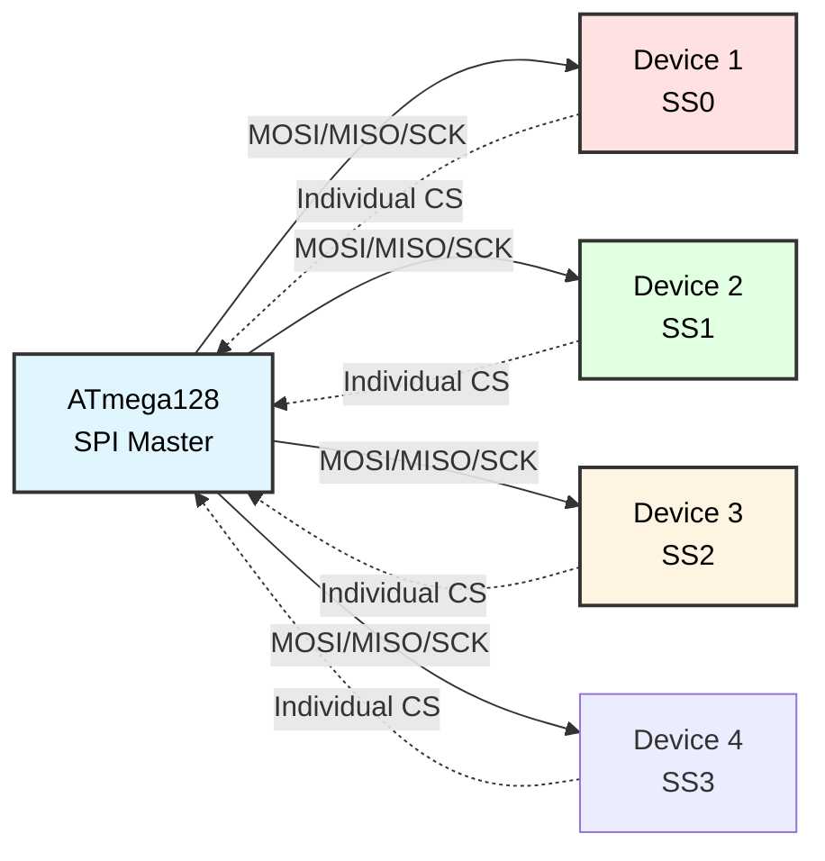

# Multiple SPI Devices
## ATmega128 Embedded Systems Course

**Reference**: [ATmega128 Datasheet](https://ww1.microchip.com/downloads/en/DeviceDoc/doc2467.pdf)

---

## Slide 1: Introduction to Multi-SPI Systems

### Why Multiple SPI Devices?
- **Expand functionality** (EEPROM + SD card + display)
- **Modular design** (add/remove peripherals)
- **Separate data storage** (config + logs + media)
- **Mixed interfaces** (memory, sensors, displays)

### SPI Multi-Device Architecture


### Common SPI Devices
```
Memory:
- 25LC256:  EEPROM (32KB)
- W25Q128:  Flash (16MB)
- 23LC1024: SRAM (128KB)

Storage:
- SD/microSD cards (FAT16/FAT32)

Displays:
- MAX7219:  8-digit 7-segment LED
- ILI9341:  320×240 TFT LCD
- ST7735:   128×160 TFT LCD

Sensors:
- BME280:   Temp/Humidity/Pressure
- MPU9250:  9-DOF IMU

Communication:
- NRF24L01: 2.4GHz wireless
- ENC28J60: Ethernet controller
```

---

## Slide 2: Chip Select Management

### Understanding Chip Select (CS)
```
SPI devices share MOSI, MISO, SCK
Each device has unique CS (active low)

Only ONE device active at a time!

     MOSI ──┬───────┬───────┬───────
            │       │       │
     MISO ──┼───────┼───────┼───────
            │       │       │
     SCK  ──┼───────┼───────┼───────
            │       │       │
     CS0  ──┴───────┘       │       (EEPROM active)
     CS1  ──────────┴───────┘       (SD Card active)
     CS2  ──────────────────┴─────  (Display active)
```

### Chip Select Pin Assignment
```c
// CS pins on PORTB (or other ports)
#define CS_EEPROM  PB0   // 25LC256
#define CS_SD      PB4   // SD Card
#define CS_DISPLAY PB5   // MAX7219
#define CS_SENSOR  PB6   // BME280

#define CS_PORT    PORTB
#define CS_DDR     DDRB

void cs_init(void) {
    // Set all CS pins as outputs, pull high (inactive)
    CS_DDR |= (1 << CS_EEPROM) | (1 << CS_SD) | (1 << CS_DISPLAY) | (1 << CS_SENSOR);
    CS_PORT |= (1 << CS_EEPROM) | (1 << CS_SD) | (1 << CS_DISPLAY) | (1 << CS_SENSOR);
}

// Select/deselect functions
void cs_eeprom_select(void)   { CS_PORT &= ~(1 << CS_EEPROM); }
void cs_eeprom_deselect(void) { CS_PORT |= (1 << CS_EEPROM); }

void cs_sd_select(void)       { CS_PORT &= ~(1 << CS_SD); }
void cs_sd_deselect(void)     { CS_PORT |= (1 << CS_SD); }

void cs_display_select(void)  { CS_PORT &= ~(1 << CS_DISPLAY); }
void cs_display_deselect(void){ CS_PORT |= (1 << CS_DISPLAY); }

void cs_sensor_select(void)   { CS_PORT &= ~(1 << CS_SENSOR); }
void cs_sensor_deselect(void) { CS_PORT |= (1 << CS_SENSOR); }
```

---

## Slide 3: SPI Initialization

### Initialize SPI Master Mode
```c
void spi_init_master(void) {
    // Set MOSI, SCK, SS as outputs
    DDRB |= (1 << PB2) | (1 << PB1) | (1 << PB0);
    
    // Set MISO as input
    DDRB &= ~(1 << PB3);
    
    // Enable SPI, Master mode, Clock = F_CPU/16
    // SPI Mode 0: CPOL=0, CPHA=0
    SPCR = (1 << SPE) | (1 << MSTR) | (1 << SPR0);
    
    // Initialize all CS pins
    cs_init();
}

uint8_t spi_transfer(uint8_t data) {
    SPDR = data;
    while (!(SPSR & (1 << SPIF)));  // Wait for transfer complete
    return SPDR;
}
```

### SPI Mode Configuration
```c
// Different devices may need different SPI modes

void spi_set_mode(uint8_t mode) {
    uint8_t spcr = SPCR & ~((1 << CPOL) | (1 << CPHA));
    
    switch (mode) {
        case 0: /* CPOL=0, CPHA=0 */ break;
        case 1: spcr |= (1 << CPHA); break;
        case 2: spcr |= (1 << CPOL); break;
        case 3: spcr |= (1 << CPOL) | (1 << CPHA); break;
    }
    
    SPCR = spcr;
}

// Usage:
// 25LC256 EEPROM:  Mode 0 or 3
// SD Card:         Mode 0
// MAX7219:         Mode 0
// BME280:          Mode 0 or 3
```

---

## Slide 4: Device Abstraction Layer

### Device Structure
```c
typedef struct {
    const char *name;
    uint8_t cs_pin;
    uint8_t spi_mode;
    void (*select)(void);
    void (*deselect)(void);
} spi_device_t;

spi_device_t spi_devices[] = {
    {"EEPROM",  CS_EEPROM,  0, cs_eeprom_select,  cs_eeprom_deselect},
    {"SD Card", CS_SD,      0, cs_sd_select,      cs_sd_deselect},
    {"Display", CS_DISPLAY, 0, cs_display_select, cs_display_deselect},
    {"Sensor",  CS_SENSOR,  0, cs_sensor_select,  cs_sensor_deselect}
};

#define NUM_SPI_DEVICES (sizeof(spi_devices) / sizeof(spi_device_t))
```

### Device Communication Wrapper
```c
uint8_t spi_device_transfer(spi_device_t *dev, uint8_t data) {
    // Set SPI mode if needed
    spi_set_mode(dev->spi_mode);
    
    // Select device
    dev->select();
    
    // Transfer data
    uint8_t result = spi_transfer(data);
    
    // Deselect device
    dev->deselect();
    
    return result;
}

// Usage:
uint8_t data = spi_device_transfer(&spi_devices[0], 0x05);  // Read EEPROM status
```

---

## Slide 5: EEPROM Driver

### 25LC256 EEPROM Functions
```c
#define EEPROM_CMD_READ  0x03
#define EEPROM_CMD_WRITE 0x02
#define EEPROM_CMD_WREN  0x06

void eeprom_write_enable(void) {
    cs_eeprom_select();
    spi_transfer(EEPROM_CMD_WREN);
    cs_eeprom_deselect();
}

void eeprom_write_byte(uint16_t addr, uint8_t data) {
    eeprom_write_enable();
    
    cs_eeprom_select();
    spi_transfer(EEPROM_CMD_WRITE);
    spi_transfer((uint8_t)(addr >> 8));
    spi_transfer((uint8_t)(addr & 0xFF));
    spi_transfer(data);
    cs_eeprom_deselect();
    
    _delay_ms(5);  // Wait for write to complete
}

uint8_t eeprom_read_byte(uint16_t addr) {
    uint8_t data;
    
    cs_eeprom_select();
    spi_transfer(EEPROM_CMD_READ);
    spi_transfer((uint8_t)(addr >> 8));
    spi_transfer((uint8_t)(addr & 0xFF));
    data = spi_transfer(0x00);
    cs_eeprom_deselect();
    
    return data;
}
```

---

## Slide 6: MAX7219 LED Driver

### MAX7219 Features
```
- 8-digit 7-segment display (or 8×8 LED matrix)
- SPI interface (Mode 0)
- Internal BCD decoder
- Brightness control (16 levels)
- Scan limit, shutdown mode
```

### MAX7219 Driver
```c
#define MAX7219_REG_DECODE_MODE 0x09
#define MAX7219_REG_INTENSITY   0x0A
#define MAX7219_REG_SCAN_LIMIT  0x0B
#define MAX7219_REG_SHUTDOWN    0x0C
#define MAX7219_REG_TEST        0x0F

void max7219_write(uint8_t reg, uint8_t data) {
    cs_display_select();
    spi_transfer(reg);
    spi_transfer(data);
    cs_display_deselect();
}

void max7219_init(void) {
    // Exit test mode
    max7219_write(MAX7219_REG_TEST, 0x00);
    
    // Set decode mode (BCD for all digits)
    max7219_write(MAX7219_REG_DECODE_MODE, 0xFF);
    
    // Set scan limit (8 digits)
    max7219_write(MAX7219_REG_SCAN_LIMIT, 0x07);
    
    // Set brightness (medium)
    max7219_write(MAX7219_REG_INTENSITY, 0x08);
    
    // Turn on display
    max7219_write(MAX7219_REG_SHUTDOWN, 0x01);
    
    // Clear display
    for (uint8_t digit = 1; digit <= 8; digit++) {
        max7219_write(digit, 0x0F);  // Blank
    }
}

void max7219_display_number(uint32_t number) {
    for (uint8_t digit = 1; digit <= 8; digit++) {
        uint8_t value = number % 10;
        max7219_write(digit, value);
        number /= 10;
        
        if (number == 0) {
            // Blank leading digits
            for (uint8_t d = digit + 1; d <= 8; d++) {
                max7219_write(d, 0x0F);
            }
            break;
        }
    }
}

// Usage
max7219_init();
max7219_display_number(12345678);
```

---

## Slide 7: SD Card Basics

### SD Card SPI Mode
```
SD cards support SPI mode (slower than native SD mode)
- CS active low
- SPI Mode 0
- Initial clock: < 400 kHz
- After init: up to 25 MHz
```

### SD Card Initialization (Simplified)
```c
#define CMD0   0   // GO_IDLE_STATE
#define CMD8   8   // SEND_IF_COND
#define CMD55  55  // APP_CMD
#define ACMD41 41  // SD_SEND_OP_COND

uint8_t sd_send_command(uint8_t cmd, uint32_t arg) {
    cs_sd_select();
    
    // Send command packet (6 bytes)
    spi_transfer(0x40 | cmd);
    spi_transfer((uint8_t)(arg >> 24));
    spi_transfer((uint8_t)(arg >> 16));
    spi_transfer((uint8_t)(arg >> 8));
    spi_transfer((uint8_t)(arg));
    spi_transfer(0x95);  // CRC (valid for CMD0)
    
    // Wait for response
    uint8_t response;
    uint8_t timeout = 10;
    
    do {
        response = spi_transfer(0xFF);
        timeout--;
    } while ((response & 0x80) && timeout);
    
    return response;
}

uint8_t sd_init(void) {
    // Send 80 clock pulses with CS high
    cs_sd_deselect();
    for (uint8_t i = 0; i < 10; i++) {
        spi_transfer(0xFF);
    }
    
    // CMD0: Reset card
    uint8_t r1 = sd_send_command(CMD0, 0);
    cs_sd_deselect();
    
    if (r1 != 0x01) {
        return 0;  // Failed
    }
    
    // CMD8: Check voltage range (for SDHC)
    cs_sd_select();
    r1 = sd_send_command(CMD8, 0x1AA);
    // ... (read R7 response)
    cs_sd_deselect();
    
    // ACMD41: Initialize card
    // ... (full initialization sequence)
    
    return 1;  // Success
}
```

---

## Slide 8: Arbitration and Conflict Prevention

### Never Select Multiple Devices!
```c
// WRONG - will cause bus contention!
cs_eeprom_select();
cs_sd_select();  // Both driving MISO = conflict!
spi_transfer(0x00);

// CORRECT - deselect before selecting next
cs_eeprom_select();
spi_transfer(0x00);
cs_eeprom_deselect();  // Release bus

cs_sd_select();
spi_transfer(0x00);
cs_sd_deselect();
```

### Safe Device Switch
```c
void spi_safe_device_switch(spi_device_t *from, spi_device_t *to) {
    // Deselect current device
    if (from != NULL) {
        from->deselect();
        _delay_us(1);  // Small delay for device to release MISO
    }
    
    // Set SPI mode for new device
    if (to != NULL) {
        spi_set_mode(to->spi_mode);
        _delay_us(1);
        to->select();
    }
}
```

---

## Slide 9: Application - Multi-Device Data Logger

### Log to EEPROM and SD Card
```c
typedef struct {
    uint8_t year, month, day, hour, minute, second;
    int16_t temperature;
    uint16_t humidity;
} log_entry_t;

void log_sensor_data(int16_t temp, uint16_t humidity) {
    log_entry_t entry;
    
    // Get timestamp (from DS1307 via I2C)
    rtc_time_t time;
    ds1307_get_time(&time);
    
    entry.year = time.year;
    entry.month = time.month;
    entry.day = time.date;
    entry.hour = time.hour;
    entry.minute = time.minute;
    entry.second = time.second;
    entry.temperature = temp;
    entry.humidity = humidity;
    
    // Write to EEPROM (fast, limited capacity)
    uint16_t eeprom_addr = 0x0100;  // Example address
    cs_eeprom_select();
    // ... write entry to EEPROM
    cs_eeprom_deselect();
    
    // Write to SD card (slow, large capacity)
    cs_sd_select();
    // ... write entry to SD card file
    cs_sd_deselect();
    
    // Display on MAX7219
    cs_display_select();
    max7219_display_number((uint32_t)temp);
    cs_display_deselect();
}
```

---

## Slide 10: Application - Sensor Dashboard

### Display Sensor Data on 7-Segment
```c
typedef enum {
    DISPLAY_TEMP,
    DISPLAY_HUMIDITY,
    DISPLAY_PRESSURE
} display_mode_t;

display_mode_t mode = DISPLAY_TEMP;

void sensor_dashboard(void) {
    cs_display_select();
    max7219_init();
    cs_display_deselect();
    
    while (1) {
        // Read sensor (BME280 via SPI)
        cs_sensor_select();
        int16_t temp = bme280_read_temperature();
        uint16_t humidity = bme280_read_humidity();
        uint32_t pressure = bme280_read_pressure();
        cs_sensor_deselect();
        
        // Display based on mode
        cs_display_select();
        
        switch (mode) {
            case DISPLAY_TEMP:
                max7219_display_number((uint32_t)temp);
                break;
            case DISPLAY_HUMIDITY:
                max7219_display_number((uint32_t)humidity);
                break;
            case DISPLAY_PRESSURE:
                max7219_display_number(pressure / 100);  // hPa
                break;
        }
        
        cs_display_deselect();
        
        // Check button to cycle mode
        if (button_pressed()) {
            mode = (mode + 1) % 3;
        }
        
        _delay_ms(1000);
    }
}
```

---

## Slide 11: SPI Bus Performance

### Clock Speed Considerations
```c
// Different devices have different max SPI clocks

// Slow devices (initialization, SD card init)
void spi_set_slow_clock(void) {
    // F_CPU / 128 = 16MHz / 128 = 125 kHz
    SPCR |= (1 << SPR1) | (1 << SPR0);
    SPSR &= ~(1 << SPI2X);
}

// Fast devices (EEPROM, sensors)
void spi_set_fast_clock(void) {
    // F_CPU / 4 = 16MHz / 4 = 4 MHz
    SPCR &= ~((1 << SPR1) | (1 << SPR0));
    SPSR |= (1 << SPI2X);
}

// Usage
spi_set_slow_clock();
sd_init();  // SD card requires slow clock during init

spi_set_fast_clock();
eeprom_read_byte(0x0000);  // EEPROM can handle fast clock
```

### Burst Transfers
```c
void eeprom_read_burst(uint16_t addr, uint8_t *buffer, uint16_t length) {
    cs_eeprom_select();
    spi_transfer(EEPROM_CMD_READ);
    spi_transfer((uint8_t)(addr >> 8));
    spi_transfer((uint8_t)(addr & 0xFF));
    
    for (uint16_t i = 0; i < length; i++) {
        buffer[i] = spi_transfer(0x00);
    }
    
    cs_eeprom_deselect();
}

// Much faster than byte-by-byte with repeated CS toggling
```

---

## Slide 12: Debugging Multi-SPI Systems

### Debug Functions
```c
void spi_debug(void) {
    printf("SPI Debug\n");
    printf("---------\n");
    
    // Check SPI configuration
    printf("SPCR: 0x%02X\n", SPCR);
    printf("SPSR: 0x%02X\n", SPSR);
    printf("  SPE:   %d (SPI Enable)\n", (SPCR & (1 << SPE)) ? 1 : 0);
    printf("  MSTR:  %d (Master mode)\n", (SPCR & (1 << MSTR)) ? 1 : 0);
    printf("  CPOL:  %d\n", (SPCR & (1 << CPOL)) ? 1 : 0);
    printf("  CPHA:  %d\n", (SPCR & (1 << CPHA)) ? 1 : 0);
    
    // Check CS pin states
    printf("\nCS Pin States:\n");
    printf("  EEPROM (PB%d):  %s\n", CS_EEPROM, 
           (CS_PORT & (1 << CS_EEPROM)) ? "HIGH (inactive)" : "LOW (active)");
    printf("  SD (PB%d):      %s\n", CS_SD,
           (CS_PORT & (1 << CS_SD)) ? "HIGH (inactive)" : "LOW (active)");
    printf("  Display (PB%d): %s\n", CS_DISPLAY,
           (CS_PORT & (1 << CS_DISPLAY)) ? "HIGH (inactive)" : "LOW (active)");
    
    // Test each device
    printf("\nDevice Tests:\n");
    
    // Test EEPROM
    eeprom_write_byte(0x0000, 0xAA);
    uint8_t val = eeprom_read_byte(0x0000);
    printf("  EEPROM: %s (wrote 0xAA, read 0x%02X)\n", 
           (val == 0xAA) ? "OK" : "FAIL", val);
    
    // Test MAX7219
    cs_display_select();
    max7219_write(MAX7219_REG_TEST, 0x01);  // Enter test mode (all LEDs on)
    cs_display_deselect();
    _delay_ms(1000);
    cs_display_select();
    max7219_write(MAX7219_REG_TEST, 0x00);  // Exit test mode
    cs_display_deselect();
    printf("  MAX7219: Display test complete (check LEDs)\n");
}
```

---

## Slide 13: Troubleshooting

### Common Issues

| Problem | Cause | Solution |
|---------|-------|----------|
| **Wrong data from device** | CS not controlled | Check CS select/deselect |
| **Bus contention** | Multiple CS low | Ensure only one device selected |
| **Slow transfer** | Low SPI clock | Increase clock (check device limits) |
| **Device doesn't respond** | Wrong SPI mode | Verify CPOL/CPHA settings |
| **Intermittent errors** | CS timing | Add small delay after CS toggle |
| **SD card init fails** | Clock too fast | Use slow clock (<400kHz) for init |

### Debugging Checklist
```c
void spi_troubleshoot_checklist(void) {
    printf("SPI Troubleshooting Checklist:\n");
    printf("==============================\n\n");
    
    // 1. Check pin configuration
    printf("1. Pin Configuration:\n");
    printf("   DDRB (should be 0b0000_0111): 0x%02X\n", DDRB & 0x0F);
    printf("   MOSI (PB2): %s\n", (DDRB & (1 << PB2)) ? "OUTPUT (OK)" : "INPUT (BAD)");
    printf("   MISO (PB3): %s\n", (DDRB & (1 << PB3)) ? "OUTPUT (BAD)" : "INPUT (OK)");
    printf("   SCK  (PB1): %s\n", (DDRB & (1 << PB1)) ? "OUTPUT (OK)" : "INPUT (BAD)");
    
    // 2. Check SPI enabled
    printf("\n2. SPI Enable:\n");
    printf("   SPE bit: %s\n", (SPCR & (1 << SPE)) ? "ENABLED (OK)" : "DISABLED (BAD)");
    
    // 3. Check master mode
    printf("\n3. Master Mode:\n");
    printf("   MSTR bit: %s\n", (SPCR & (1 << MSTR)) ? "MASTER (OK)" : "SLAVE (BAD)");
    
    // 4. Check CS pins
    printf("\n4. CS Pins (should all be HIGH when idle):\n");
    for (uint8_t i = 0; i < NUM_SPI_DEVICES; i++) {
        uint8_t cs_state = (CS_PORT & (1 << spi_devices[i].cs_pin)) ? 1 : 0;
        printf("   %s (PB%d): %s\n", 
               spi_devices[i].name, 
               spi_devices[i].cs_pin,
               cs_state ? "HIGH (OK)" : "LOW (active?)");
    }
    
    // 5. Loopback test
    printf("\n5. Loopback Test:\n");
    printf("   Connect MOSI to MISO and run test...\n");
    // ... (actual loopback test code)
}
```

---

## Slide 14: Best Practices

### SPI Multi-Device Guidelines

✓ **One device at a time**
```c
cs_device1_select();
// ... communicate with device1
cs_device1_deselect();  // Always deselect before next device

cs_device2_select();
// ... communicate with device2
cs_device2_deselect();
```

✓ **Initialize CS pins properly**
```c
// All CS outputs, all HIGH (inactive)
CS_DDR |= (1 << CS1) | (1 << CS2) | (1 << CS3);
CS_PORT |= (1 << CS1) | (1 << CS2) | (1 << CS3);
```

✓ **Match SPI mode to device**
```c
spi_set_mode(0);  // For EEPROM
cs_eeprom_select();
// ... communicate
cs_eeprom_deselect();

spi_set_mode(3);  // For different device
cs_other_select();
// ... communicate
cs_other_deselect();
```

✓ **Adjust clock speed as needed**
```c
spi_set_slow_clock();
sd_init();  // Slow for SD card init

spi_set_fast_clock();
eeprom_read();  // Fast for EEPROM
```

✓ **Add small delays for timing**
```c
cs_device_deselect();
_delay_us(1);  // Allow device to release MISO
cs_next_device_select();
```

---

## Slide 15: Summary

### Key Concepts

✓ **Shared bus**: MOSI, MISO, SCK shared among all devices  
✓ **Unique CS**: Each device has individual chip select  
✓ **One active**: Only one device selected at a time  
✓ **SPI modes**: Configure CPOL/CPHA per device  
✓ **Clock speed**: Adjust for device capabilities  
✓ **Arbitration**: Careful CS management prevents conflicts  

### Common Device Combinations
```
Data Logger:
- EEPROM (config)
- SD Card (logs)
- RTC (I2C)

Sensor System:
- EEPROM (calibration)
- BME280 (sensors)
- MAX7219 (display)

Communication Hub:
- EEPROM (settings)
- NRF24L01 (wireless)
- ENC28J60 (Ethernet)
```

### Applications
- Data logging systems
- Multi-sensor platforms
- Display + storage + communication
- Modular embedded systems
- Industrial controllers

---

## Slide 16: Practice Exercises

### Exercise 1: Dual Storage
**Goal**: Use EEPROM and SD card together
- Initialize both EEPROM and SD card
- Write config to EEPROM
- Write logs to SD card
- Switch between devices correctly

### Exercise 2: Sensor + Display
**Goal**: Read sensor, show on LED display
- Connect BME280 sensor (SPI)
- Connect MAX7219 display (SPI)
- Read temperature from sensor
- Display value on 7-segment
- Cycle through temp/humidity/pressure

### Exercise 3: Multi-Device Logger
**Goal**: Log to EEPROM, backup to SD
- Read sensor data (I2C or SPI)
- Write to EEPROM first (fast)
- Periodically copy to SD card (backup)
- Handle device switching correctly

### Exercise 4: SPI Bus Monitor
**Goal**: Debug multi-device communication
- Scan for SPI devices
- Test each device individually
- Verify CS pin states
- Report errors

### Exercise 5: Speed Comparison
**Goal**: Measure performance of SPI vs I2C
- Write 1KB to SPI EEPROM
- Write 1KB to I2C EEPROM
- Compare transfer times
- Analyze results

---

# End of Slides

**Questions?**

For more information, see:
- [ATmega128 Datasheet](https://ww1.microchip.com/downloads/en/DeviceDoc/doc2467.pdf)
- Project source code in `SPI_Multi_Device/`
- Shared libraries: `_spi.h`, device driver headers
