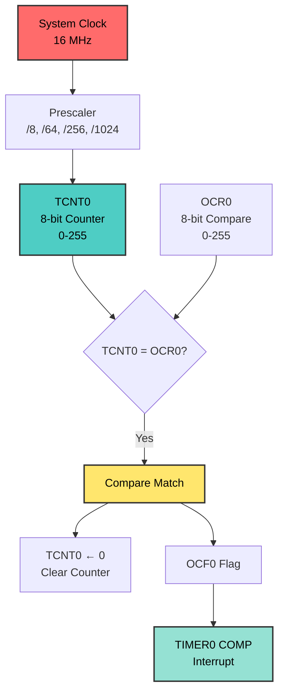

# Timer0 CTC Mode - Precision Timing
## ATmega128 Embedded Systems Course

**Reference**: [ATmega128 Datasheet](https://ww1.microchip.com/downloads/en/DeviceDoc/doc2467.pdf)

---

## Slide 1: Introduction to Timer0 CTC Mode

### What is Timer0?
- **8-bit timer** (counts 0-255)
- **Simpler** than Timer1 (16-bit)
- **Faster** ISR execution
- **Perfect** for kHz-range frequencies

### Timer0 CTC Mode
- **CTC** = Clear Timer on Compare Match
- Timer counts up to **OCR0** (0-255)
- **Automatically resets** to 0 on match
- Generates **precise high frequencies**

### Why Use Timer0 CTC?
✓ **Fast timing** - kHz range (1-100 kHz)  
✓ **Millisecond precision** - perfect for millis()  
✓ **Simple 8-bit** - easier to understand  
✓ **Low overhead** - faster than Timer1  
✓ **Free Timer1** - save 16-bit timer for Hz range  

### Timer0 vs Timer1
| Feature | Timer0 | Timer1 |
|---------|--------|--------|
| **Bits** | 8-bit (0-255) | 16-bit (0-65535) |
| **OCR Register** | OCR0 | OCR1A |
| **Best For** | kHz (1-100 kHz) | Hz (0.1-1000 Hz) |
| **Prescaler** | /8, /64, /256, /1024 | /1, /8, /64, /256, /1024 |
| **Use Case** | millis(), fast PWM | seconds, RTC |

---

## Slide 2: Timer0 Hardware Overview

### Timer0 Architecture (8-bit)


### Timer0 Resources
| Register | Description | Bits |
|----------|-------------|------|
| **TCNT0** | Counter value | 8-bit (0-255) |
| **OCR0** | Compare value | 8-bit (0-255) |
| **TCCR0** | Control register | 8-bit |
| **TIMSK** | Interrupt mask (OCIE0) | 8-bit |
| **TIFR** | Interrupt flags (OCF0) | 8-bit |

**Note:** Timer0 has only **ONE** control register (TCCR0), unlike Timer1 (TCCR1A/B)

---

## Slide 3: Timer0 CTC Configuration

### TCCR0 - Timer0 Control Register
```
Bit     7      6      5      4      3      2      1      0
      ┌──────┬──────┬──────┬──────┬──────┬──────┬──────┬──────┐
TCCR0 │ FOC0 │ WGM00│COM01 │COM00 │ WGM01│ CS02 │ CS01 │ CS00 │
      └──────┴──────┴──────┴──────┴──────┴──────┴──────┴──────┘
```

| Bit | Name | For CTC Mode |
|-----|------|--------------|
| **WGM01** | Waveform Gen Mode bit 1 | **1** (CTC) |
| **WGM00** | Waveform Gen Mode bit 0 | **0** (CTC) |
| **CS02:00** | Clock Select | Prescaler bits |

### Waveform Generation Mode
```
WGM01 WGM00 | Mode | Description | TOP
────────────┼──────┼─────────────┼─────
  1     0   | CTC  | Clear on OCR0 | OCR0
```

**For CTC Mode: WGM01=1, WGM00=0**

---

## Slide 4: Prescaler Selection (Timer0)

### CS02:00 - Clock Select Bits
```
CS02 CS01 CS00 | Prescaler | Timer Clock @ 16MHz
───────────────┼───────────┼────────────────────
  0    0    0  | Stop      | -
  0    0    1  | None      | Not available for Timer0!
  0    1    0  | /8        | 2 MHz
  0    1    1  | /64       | 250 kHz ⭐ (Best for kHz)
  1    0    0  | /256      | 62.5 kHz
  1    0    1  | /1024     | 15.625 kHz
```

**Important:** Timer0 does **NOT** have /1 prescaler (unlike Timer1)!

### Frequency Calculation Formula
```
F_output = F_CPU / (Prescaler × (OCR0 + 1))

Rearranged:
OCR0 = (F_CPU / (Prescaler × F_output)) - 1

⚠️ OCR0 must be ≤ 255 (8-bit limit)
```

---

## Slide 5: Example Calculations

### Example 1: Generate 1 kHz (1ms period)
```
Target: 1000 Hz
F_CPU = 16,000,000 Hz

Try Prescaler = 64:
OCR0 = (16,000,000 / (64 × 1000)) - 1
     = 250 - 1
     = 249 ✓ (< 255, perfect!)

Verify:
F_output = 16,000,000 / (64 × 250) = 1000 Hz ✓
```

**Code:**
```c
TCCR0 = (1 << WGM01) | (1 << CS01) | (1 << CS00);  // CTC, /64
OCR0 = 249;  // 1 kHz
```

### Example 2: Generate 2 kHz (0.5ms period)
```
OCR0 = (16,000,000 / (64 × 2000)) - 1 = 124 ✓
```

### Example 3: Generate 4 kHz (0.25ms period)
```
OCR0 = (16,000,000 / (64 × 4000)) - 1 = 62 ✓
```

### Example 4: Generate 8 kHz (0.125ms period)
```
OCR0 = (16,000,000 / (64 × 8000)) - 1 = 31 ✓
```

---

## Slide 6: 8-Bit Limitations

### What Happens if OCR0 > 255?

**Example: Try 100 Hz with prescaler 64**
```
OCR0 = (16,000,000 / (64 × 100)) - 1
     = 2500 - 1
     = 2499 ❌ OVERFLOW! (> 255)
```

### Solutions:
1. **Use larger prescaler:**
```c
// Try /256:
OCR0 = (16,000,000 / (256 × 100)) - 1 = 624 ❌ Still > 255!

// Try /1024:
OCR0 = (16,000,000 / (1024 × 100)) - 1 = 155 ✓ Works!
```

2. **Use Timer1 instead** (recommended for Hz range)

### Frequency Range Summary

| Prescaler | Min Freq | Max Freq | Best For |
|-----------|----------|----------|----------|
| **/8** | 7.8 kHz | 2 MHz | Very high freq |
| **/64** | **976 Hz** | **250 kHz** | **kHz range** ⭐ |
| **/256** | 244 Hz | 62.5 kHz | Medium freq |
| **/1024** | 61 Hz | 15.6 kHz | Low freq |

**Rule of Thumb:** Use Timer0 for ≥ 1 kHz, Timer1 for < 1 kHz

---

## Slide 7: Polling Implementation

### Method 1: Polling Compare Flag
```c
void demo_polling_1khz(void) {
    uint16_t tick_count = 0;
    
    // Setup Timer0 CTC Mode
    TCCR0 = 0x00;       // Stop timer
    TCNT0 = 0;          // Clear counter
    TIFR = (1 << OCF0); // Clear flag
    
    // CTC mode, prescaler 64
    TCCR0 = (1 << WGM01) | (1 << CS01) | (1 << CS00);
    
    // 1 kHz: OCR0 = 249
    OCR0 = 249;
    
    while(1) {
        // Poll compare match flag
        if (TIFR & (1 << OCF0)) {
            TIFR = (1 << OCF0);  // Clear flag
            tick_count++;
            
            // Toggle LED every 500ms (500 ticks)
            if (tick_count >= 500) {
                PORTB ^= 0x01;
                tick_count = 0;
            }
        }
    }
}
```

**Pros:** Simple, predictable  
**Cons:** CPU blocked, can't multitask

---

## Slide 8: Interrupt Implementation

### Method 2: Interrupt-Driven
```c
volatile uint16_t milliseconds = 0;

ISR(TIMER0_COMP_vect) {
    milliseconds++;  // Increment every 1ms
}

void demo_interrupt_1khz(void) {
    // Setup Timer0 CTC Mode
    TCCR0 = (1 << WGM01) | (1 << CS01) | (1 << CS00);  // CTC, /64
    OCR0 = 249;  // 1 kHz
    
    // Enable compare match interrupt
    TIMSK |= (1 << OCIE0);
    sei();  // Global interrupts
    
    while(1) {
        // Main loop FREE!
        
        // Toggle LED every 500ms
        if (milliseconds >= 500) {
            PORTB ^= 0x01;
            milliseconds = 0;
        }
        
        // Can do other work here
    }
}
```

**Pros:** CPU free, multitasking  
**Cons:** Slightly more complex, ISR overhead

---

## Slide 9: Practical Application - millis() Function

### Implementation
```c
volatile uint32_t milliseconds = 0;

ISR(TIMER0_COMP_vect) {
    milliseconds++;
}

void timer0_millis_init(void) {
    TCCR0 = (1 << WGM01) | (1 << CS01) | (1 << CS00);  // CTC, /64
    OCR0 = 249;                                         // 1 kHz
    TIMSK |= (1 << OCIE0);                             // Enable interrupt
    sei();
}

uint32_t millis(void) {
    uint32_t m;
    cli();
    m = milliseconds;
    sei();
    return m;
}

// Usage example
int main(void) {
    timer0_millis_init();
    
    while(1) {
        if (millis() % 1000 == 0) {
            // Do something every second
        }
    }
}
```

---

## Slide 10: Multiple Frequencies Demo

### Cycling Through Frequencies
```c
void demo_multi_frequency(void) {
    const uint8_t ocr_values[] = {
        249, // 1 kHz
        124, // 2 kHz
        62,  // 4 kHz
        31   // 8 kHz
    };
    
    uint8_t freq_index = 0;
    
    while(1) {
        // Set frequency (all use prescaler 64)
        TCCR0 = (1 << WGM01) | (1 << CS01) | (1 << CS00);
        OCR0 = ocr_values[freq_index];
        
        // Blink for 2 seconds at this frequency
        for (uint8_t i = 0; i < 4; i++) {
            // Wait and toggle
            // (polling or interrupt based)
        }
        
        // Next frequency
        freq_index++;
        if (freq_index >= 4) freq_index = 0;
    }
}
```

---

## Slide 11: Accuracy and Precision

### Testing Timer Accuracy
```c
void precision_test(void) {
    uint32_t match_count = 0;
    
    // Setup 1 kHz
    TCCR0 = (1 << WGM01) | (1 << CS01) | (1 << CS00);
    OCR0 = 249;
    
    // Count matches for 10 seconds
    // Expected: 1000 Hz × 10s = 10,000 matches
    while (match_count < 10000) {
        if (TIFR & (1 << OCF0)) {
            TIFR = (1 << OCF0);
            match_count++;
        }
    }
    
    // Test complete
    // In real app: send match_count via UART
    // Error% = (actual - expected) / expected × 100
}
```

### Expected Accuracy
- **Crystal oscillator:** ±50 ppm (0.005%)
- **Internal RC:** ±10% (not recommended for precision)
- **Over 10 seconds:** < 1ms error with crystal

---

## Slide 12: When to Use Timer0 vs Timer1

### Use Timer0 When:
✓ **Frequency ≥ 1 kHz**  
✓ Need **millisecond timing**  
✓ Implementing **millis()** function  
✓ **Fast PWM** (20 kHz for LED, 4+ kHz for audio)  
✓ **High-speed sampling** (ADC at kHz rates)  
✓ Timer1 is **busy** with other tasks  
✓ Want **faster ISR** execution  

### Use Timer1 When:
✓ **Frequency < 1 kHz**  
✓ Need **second-range** periods  
✓ Building **real-time clock** (RTC)  
✓ **16-bit resolution** required  
✓ Need **/1 prescaler**  
✓ More **flexibility** needed  

---

## Slide 13: Common Pitfalls and Solutions

### Pitfall 1: OCR0 Overflow
```c
// ❌ WRONG - OCR0 > 255
OCR0 = (16000000 / (64 × 100)) - 1;  // 2499, overflow!

// ✅ CORRECT - Use Timer1 for low frequencies
OCR1A = (16000000 / (64 × 100)) - 1;  // 2499, OK for Timer1
```

### Pitfall 2: Forgetting to Clear Flag
```c
// ❌ WRONG - Flag not cleared
if (TIFR & (1 << OCF0)) {
    PORTB ^= 0x01;
    // Oops! Flag still set, loops immediately
}

// ✅ CORRECT - Clear flag
if (TIFR & (1 << OCF0)) {
    TIFR = (1 << OCF0);  // Clear by writing 1
    PORTB ^= 0x01;
}
```

### Pitfall 3: Wrong Prescaler Bits
```c
// ❌ WRONG - Trying /1 prescaler
TCCR0 = (1 << WGM01) | (1 << CS00);  // Timer0 doesn't have /1!

// ✅ CORRECT - Use /8 (smallest for Timer0)
TCCR0 = (1 << WGM01) | (1 << CS01);  // /8 prescaler
```

---

## Slide 14: Advanced Applications

### Application 1: High-Speed ADC Sampling
```c
// Sample ADC at 10 kHz
ISR(TIMER0_COMP_vect) {
    ADCSRA |= (1 << ADSC);  // Start conversion
}

void setup_10khz_sampling(void) {
    // OCR0 = (16MHz / 64 / 10kHz) - 1 = 24
    TCCR0 = (1 << WGM01) | (1 << CS01) | (1 << CS00);
    OCR0 = 24;
    TIMSK |= (1 << OCIE0);
}
```

### Application 2: Audio Tone Generator
```c
// Generate 440 Hz (A note)
void setup_440hz_tone(void) {
    // OCR0 = (16MHz / 64 / 880) - 1 = 283 ❌ > 255
    // Use /256: OCR0 = (16MHz / 256 / 880) - 1 = 70 ✓
    TCCR0 = (1 << WGM01) | (1 << CS02);  // CTC, /256
    OCR0 = 70;
    TIMSK |= (1 << OCIE0);
}

ISR(TIMER0_COMP_vect) {
    PORTB ^= (1 << PB0);  // Toggle speaker pin at 880 Hz
                          // = 440 Hz square wave
}
```

### Application 3: Watchdog Kick
```c
// Kick watchdog every 10ms
ISR(TIMER0_COMP_vect) {
    static uint8_t count = 0;
    count++;
    if (count >= 10) {  // 10ms × 10 = 100ms
        wdt_reset();
        count = 0;
    }
}
```

---

## Slide 15: Summary and Key Takeaways

### Timer0 CTC Mode Essentials
✓ **8-bit timer** (0-255) vs Timer1 16-bit (0-65535)  
✓ **Best for kHz range** (1-100 kHz)  
✓ **Prescaler /64** ideal for kHz frequencies  
✓ **No /1 prescaler** (Timer0 limitation)  
✓ **OCR0 ≤ 255** always check this!  

### Critical Formulas
```
OCR0 = (F_CPU / (Prescaler × F_output)) - 1

F_output = F_CPU / (Prescaler × (OCR0 + 1))

Period = 1 / F_output
```

### Register Configuration
```c
TCCR0 = (1 << WGM01) | (prescaler_bits);  // CTC mode
OCR0 = calculated_value;                   // Max 255
TIMSK |= (1 << OCIE0);                    // Enable interrupt
```

### Common Use Cases
- **millis()** - Millisecond timekeeping
- **Fast PWM** - 20+ kHz for flicker-free LEDs
- **ADC triggering** - Regular sampling at kHz rates
- **Audio tones** - Generate musical notes
- **Comm timing** - UART/SPI/I2C helpers

---

## Slide 16: Comparison Table

### Timer0 vs Timer1 Feature Matrix

| Feature | Timer0 | Timer1 |
|---------|--------|--------|
| **Bit Width** | 8-bit (0-255) | 16-bit (0-65535) |
| **OCR Register** | OCR0 | OCR1A, OCR1B, OCR1C |
| **Control Regs** | TCCR0 (1 reg) | TCCR1A, TCCR1B (2 regs) |
| **Prescalers** | /8, /64, /256, /1024 | /1, /8, /64, /256, /1024 |
| **Min Freq** | ~61 Hz | ~0.24 Hz |
| **Max Freq** | ~2 MHz | ~8 MHz |
| **Best Range** | 1-100 kHz | 0.1-1000 Hz |
| **ISR Speed** | Faster (8-bit) | Slower (16-bit) |
| **Typical Use** | millis(), fast PWM | Seconds, RTC, slow timing |
| **Interrupt** | TIMER0_COMP_vect | TIMER1_COMPA_vect |

### Project Selection Guide
```
Need < 1 Hz?        → Timer1
Need 1-100 Hz?      → Timer1 (better resolution)
Need 100-1000 Hz?   → Either (Timer1 preferred)
Need 1-10 kHz?      → Timer0 ⭐
Need > 10 kHz?      → Timer0 ⭐
```

---

## References and Resources

### Documentation
- [ATmega128 Datasheet - Section 17: 8-bit Timer/Counter0](https://ww1.microchip.com/downloads/en/DeviceDoc/doc2467.pdf)
- Timer0 CTC Mode: Pages 148-150
- Timer0 Registers: Pages 151-153

### Related Projects
- `Timer0_Overflow_Blink` - Basic Timer0 overflow mode
- `Timer1_CTC_Precision` - 16-bit CTC comparison
- `Timer_Stopwatch` - Practical timing application
- `PWM_Fast_Mode` - Timer0 Fast PWM

### Key Takeaways
1. Timer0 is **8-bit**: OCR0 max = 255
2. Best for **kHz frequencies** (1-100 kHz)
3. No **/1 prescaler** available
4. **Prescaler 64** sweet spot for kHz range
5. Use **Timer1** for frequencies < 1 kHz
6. Perfect for **millis()** implementation
7. **Faster ISR** than Timer1 (8-bit comparison)
