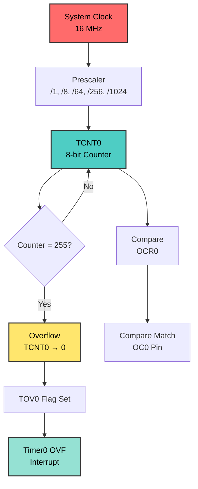

# Timer0 Overflow - LED Blinking
## ATmega128 Embedded Systems Course

**Reference**: [ATmega128 Datasheet](https://ww1.microchip.com/downloads/en/DeviceDoc/doc2467.pdf)

---

## Slide 1: Introduction to Timer0 Overflow

### What is Timer Overflow?
- **Overflow** occurs when timer counts from MAX back to 0
- **Timer0** is an 8-bit counter (0-255)
- Overflow happens every **256 clock ticks** after prescaling
- Can generate **interrupt** for periodic tasks

### Why Use Timer Overflow?
✓ **Simple periodic interrupts** without compare registers  
✓ **Free-running timer** for background tasks  
✓ **LED blinking** without delay loops  
✓ **Multitasking** - CPU free during timing  

### Applications
- LED animation and patterns
- Periodic sensor sampling
- Simple time bases
- Background task scheduling

---

## Slide 2: Timer0 Hardware Overview

### Timer0 Architecture


### Timer0 Resources
| Register | Description |
|----------|-------------|
| **TCNT0** | 8-bit Counter Register (0-255) |
| **OCR0** | Output Compare Register |
| **TCCR0** | Timer Control Register |
| **TIMSK** | Interrupt Mask Register |
| **TIFR** | Interrupt Flag Register |

---

## Slide 3: Timer0 Control Registers

### TCCR0 - Timer/Counter Control Register
```
Bit     7      6      5      4      3      2      1      0
      ┌──────┬──────┬──────┬──────┬──────┬──────┬──────┬──────┐
TCCR0 │ FOC0 │ WGM00│ COM01│ COM00│ WGM01│ CS02 │ CS01 │ CS00 │
      └──────┴──────┴──────┴──────┴──────┴──────┴──────┴──────┘
```

| Bits | Name | Description |
|------|------|-------------|
| **CS02:00** | Clock Select | Prescaler configuration |
| **WGM01:00** | Waveform Generation Mode | Operating mode selection |
| **COM01:00** | Compare Output Mode | OC0 pin behavior |
| **FOC0** | Force Output Compare | Force compare match (non-PWM modes) |

### Clock Select (CS02:00) - Prescaler Options
```
CS02 CS01 CS00 | Prescaler | Overflow Frequency @ 16MHz
───────────────┼───────────┼──────────────────────────
  0    0    0  | Stop      | -
  0    0    1  | /1        | 62.5 kHz (every 16 µs)
  0    1    0  | /8        | 7.8 kHz (every 128 µs)
  0    1    1  | /64       | 977 Hz (every 1.024 ms)
  1    0    0  | /256      | 244 Hz (every 4.096 ms)
  1    0    1  | /1024     | 61 Hz (every 16.384 ms)
```

**Calculation:**
```
Overflow Frequency = F_CPU / (Prescaler × 256)
Overflow Period = (Prescaler × 256) / F_CPU

Example @ /1024:
Frequency = 16,000,000 / (1024 × 256) = 61 Hz
Period = (1024 × 256) / 16,000,000 = 16.384 ms
```

---

## Slide 4: Interrupt Configuration

### TIMSK - Timer Interrupt Mask Register
```
Bit     7      6      5      4      3      2      1      0
      ┌──────┬──────┬──────┬──────┬──────┬──────┬──────┬──────┐
TIMSK │ OCIE2│ TOIE2│ TICIE1│OCIE1A│OCIE1B│ TOIE1│ OCIE0│ TOIE0│
      └──────┴──────┴──────┴──────┴──────┴──────┴──────┴──────┘
```

| Bit | Name | Description |
|-----|------|-------------|
| **TOIE0** | Timer0 Overflow Interrupt Enable | Enable overflow interrupt |
| **OCIE0** | Output Compare Interrupt Enable | Enable compare match interrupt |

### TIFR - Timer Interrupt Flag Register
```
Bit     7      6      5      4      3      2      1      0
      ┌──────┬──────┬──────┬──────┬──────┬──────┬──────┬──────┐
TIFR  │ OCF2 │ TOV2 │ ICF1 │ OCF1A│ OCF1B│ TOV1 │ OCF0 │ TOV0 │
      └──────┴──────┴──────┴──────┴──────┴──────┴──────┴──────┘
```

| Bit | Name | Description |
|-----|------|-------------|
| **TOV0** | Timer0 Overflow Flag | Set when overflow occurs |
| **OCF0** | Output Compare Flag | Set on compare match |

**Note:** Flags are **automatically cleared** when ISR executes, or can be cleared manually by writing 1.

---

## Slide 5: Polling vs Interrupt Methods

### Method 1: Polling (Software Check)
```c
// Simple but CPU-intensive
TCCR0 = 0x05;  // Prescaler /1024
TCNT0 = 0;     // Reset counter

while(1) {
    if (TIFR & (1 << TOV0)) {  // Check overflow flag
        TIFR |= (1 << TOV0);   // Clear flag (write 1)
        PORTB ^= 0x01;         // Toggle LED
    }
    // CPU is blocked waiting!
}
```

**Pros:** Simple, no interrupt overhead  
**Cons:** CPU blocked, can't do other work

### Method 2: Interrupt (Hardware Event)
```c
// Efficient - CPU free until interrupt
TCCR0 = 0x05;  // Prescaler /1024
TIMSK |= (1 << TOIE0);  // Enable overflow interrupt
sei();  // Global interrupt enable

ISR(TIMER0_OVF_vect) {
    // Automatically called on overflow
    PORTB ^= 0x01;  // Toggle LED
    // Flag cleared automatically
}

int main(void) {
    // ... setup ...
    while(1) {
        // CPU can do other work here!
    }
}
```

**Pros:** CPU free, efficient, multitasking  
**Cons:** Slightly more complex, interrupt overhead

---

## Slide 6: Timing Calculations

### Overflow Frequency Calculation
```
Overflow Period = (Prescaler × 256) / F_CPU
Number of Overflows = Desired_Delay / Overflow_Period
```

### Example: 1 Hz Blink (500ms ON, 500ms OFF) @ 16 MHz

**Prescaler /1024:**
```
Overflow Period = (1024 × 256) / 16,000,000 = 0.016384 s = 16.384 ms
Overflows for 500ms = 500 / 16.384 ≈ 31 overflows
```

**Implementation:**
```c
volatile uint8_t overflow_count = 0;

ISR(TIMER0_OVF_vect) {
    overflow_count++;
    if (overflow_count >= 31) {  // ~508ms
        overflow_count = 0;
        PORTB ^= 0x01;  // Toggle LED every 508ms
    }
}
```

### Prescaler Selection Guide
| Desired Frequency | Recommended Prescaler |
|-------------------|----------------------|
| > 1 kHz | /8 or /64 |
| 100 Hz - 1 kHz | /256 |
| < 100 Hz | /1024 |

---

## Slide 7: Complete Example - LED Blinking

### Hardware Setup
```
ATmega128:
- PB0-PB7: LEDs (Active LOW)
- LEDs ON when port = 0
- LEDs OFF when port = 1
```

### Full Code Example
```c
#include <avr/io.h>
#include <avr/interrupt.h>

#define F_CPU 16000000UL

// Global counter
volatile uint8_t overflow_count = 0;

// Overflow ISR
ISR(TIMER0_OVF_vect) {
    overflow_count++;
    if (overflow_count >= 31) {  // ~500ms
        overflow_count = 0;
        PORTB ^= 0xFF;  // Toggle all LEDs
    }
}

int main(void) {
    // Configure Port B as output
    DDRB = 0xFF;
    PORTB = 0xFF;  // LEDs OFF (active low)
    
    // Configure Timer0
    TCCR0 = (1 << CS02) | (1 << CS00);  // Prescaler /1024
    TCNT0 = 0;  // Reset counter
    
    // Enable overflow interrupt
    TIMSK |= (1 << TOIE0);
    
    // Enable global interrupts
    sei();
    
    // Main loop - CPU free!
    while(1) {
        // Can do other work here
    }
    
    return 0;
}
```

---

## Slide 8: Advanced Patterns

### Multi-Speed Blinking
```c
ISR(TIMER0_OVF_vect) {
    static uint8_t count1 = 0, count2 = 0, count3 = 0;
    
    count1++;
    count2++;
    count3++;
    
    if (count1 >= 15) {  // Fast: ~250ms
        count1 = 0;
        PORTB ^= 0x01;  // LED 0
    }
    
    if (count2 >= 31) {  // Medium: ~500ms
        count2 = 0;
        PORTB ^= 0x02;  // LED 1
    }
    
    if (count3 >= 61) {  // Slow: ~1s
        count3 = 0;
        PORTB ^= 0x04;  // LED 2
    }
}
```

### Multitasking Example
```c
volatile uint8_t task_flag = 0;

ISR(TIMER0_OVF_vect) {
    static uint8_t count = 0;
    count++;
    
    if (count >= 61) {  // Every ~1 second
        count = 0;
        task_flag = 1;  // Signal main loop
    }
}

int main(void) {
    // ... setup ...
    
    while(1) {
        if (task_flag) {
            task_flag = 0;
            // Do periodic work here
            read_sensors();
            update_display();
        }
        
        // Other continuous work
        check_buttons();
    }
}
```

---

## Slide 9: Common Pitfalls and Solutions

### Problem 1: Incorrect Overflow Count
```c
// ❌ WRONG - Integer division loses precision
uint8_t count = 500 / 16.384;  // = 30 (should be 31)

// ✅ CORRECT - Use proper rounding
uint8_t count = (500 + 16.384/2) / 16.384;  // = 31
// or
uint8_t count = 31;  // Pre-calculated
```

### Problem 2: Flag Not Cleared (Polling Mode)
```c
// ❌ WRONG - Flag never cleared
while(1) {
    if (TIFR & (1 << TOV0)) {
        PORTB ^= 0x01;
        // Flag still set - triggers continuously!
    }
}

// ✅ CORRECT - Clear flag by writing 1
while(1) {
    if (TIFR & (1 << TOV0)) {
        TIFR |= (1 << TOV0);  // Clear flag
        PORTB ^= 0x01;
    }
}
```

### Problem 3: Forgot Global Interrupts
```c
// ❌ WRONG - ISR never called
TIMSK |= (1 << TOIE0);
// Missing sei()!

// ✅ CORRECT
TIMSK |= (1 << TOIE0);
sei();  // Enable global interrupts
```

### Problem 4: Volatile Variables
```c
// ❌ WRONG - Compiler may optimize away
uint8_t overflow_count = 0;

// ✅ CORRECT - Volatile prevents optimization
volatile uint8_t overflow_count = 0;
```

---

## Slide 10: Summary and Key Takeaways

### Timer0 Overflow Key Concepts
✓ **8-bit counter** counts from 0 to 255  
✓ **Overflow** occurs at 256, resets to 0  
✓ **Prescaler** divides system clock (/1, /8, /64, /256, /1024)  
✓ **Overflow frequency** = F_CPU / (Prescaler × 256)  
✓ **Two methods**: Polling (simple) vs Interrupt (efficient)  

### Register Summary
| Register | Purpose |
|----------|---------|
| **TCCR0** | Configure prescaler and mode |
| **TCNT0** | Current counter value |
| **TIMSK** | Enable interrupts (TOIE0) |
| **TIFR** | Check/clear flags (TOV0) |

### Best Practices
1. **Use interrupts** for efficient CPU usage
2. **Declare ISR variables as volatile**
3. **Calculate overflow counts** for precise timing
4. **Keep ISRs short** - set flags, do work in main loop
5. **Always enable global interrupts** with `sei()`

### Next Steps
- Learn **Timer1 CTC mode** for exact frequencies
- Explore **PWM modes** for motor control
- Study **Input Capture** for frequency measurement
- Combine **multiple timers** for complex timing

---

## References and Resources

### Documentation
- [ATmega128 Datasheet - Section 17: 8-bit Timer/Counter0](https://ww1.microchip.com/downloads/en/DeviceDoc/doc2467.pdf)
- Timer0 registers: Pages 115-119
- Interrupt vectors: Page 64-65

### Related Projects
- `Timer_Programming` - Comprehensive timer examples
- `Timer1_CTC_Precision` - CTC mode for exact timing
- `Timer_Stopwatch` - Complex timing application

### Further Reading
- AVR Timer/Counter tutorials
- Interrupt programming best practices
- Real-time operating system (RTOS) basics
