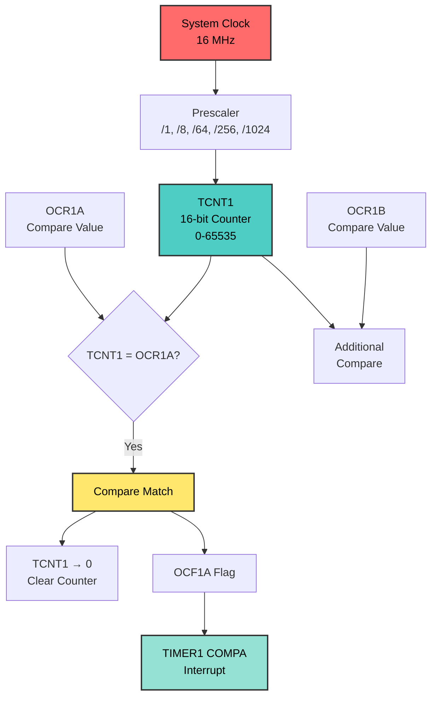

# Timer1 CTC Mode - Precision Timing
## ATmega128 Embedded Systems Course

**Reference**: [ATmega128 Datasheet](https://ww1.microchip.com/downloads/aemDocuments/documents/OTH/ProductDocuments/DataSheets/2467S.pdf)

---

## Slide 1: Introduction to CTC Mode

### What is CTC (Clear Timer on Compare)?
- **CTC** = Clear Timer on Compare Match
- Timer counts up to a **programmable value** (OCR1A)
- **Automatically resets** to 0 on match
- Generates **precise frequencies** without overflow counting

### Why Use CTC Mode?
✓ **Exact frequencies** - no accumulation error  
✓ **Simple programming** - set one register  
✓ **Wide frequency range** - 1 Hz to MHz  
✓ **Hardware precision** - no software calculation needed  

### CTC vs Normal Mode
| Feature | Normal (Overflow) | CTC |
|---------|-------------------|-----|
| **Max Count** | Fixed (255 or 65535) | Programmable (OCR1A) |
| **Precision** | Requires counting overflows | Exact match |
| **Frequency Range** | Limited | Wide |
| **Complexity** | Medium | Simple |

---

## Slide 2: Timer1 Hardware Overview

### Timer1 Architecture (16-bit)


### Timer1 Resources
| Register | Description | Bits |
|----------|-------------|------|
| **TCNT1H/L** | Counter value | 16-bit |
| **OCR1AH/L** | Compare value A | 16-bit |
| **OCR1BH/L** | Compare value B | 16-bit |
| **OCR1CH/L** | Compare value C | 16-bit |
| **TCCR1A/B** | Control registers | 8-bit each |
| **TIMSK** | Interrupt mask | 8-bit |
| **TIFR** | Interrupt flags | 8-bit |

---

## Slide 3: CTC Mode Configuration

### TCCR1A - Timer1 Control Register A
```
Bit     7      6      5      4      3      2      1      0
      ┌──────┬──────┬──────┬──────┬──────┬──────┬──────┬──────┐
TCCR1A│COM1A1│COM1A0│COM1B1│COM1B0│COM1C1│COM1C0│ WGM11│ WGM10│
      └──────┴──────┴──────┴──────┴──────┴──────┴──────┴──────┘
```

### TCCR1B - Timer1 Control Register B
```
Bit     7      6      5      4      3      2      1      0
      ┌──────┬──────┬──────┬──────┬──────┬──────┬──────┬──────┐
TCCR1B│ ICNC1│ ICES1│  -   │ WGM13│ WGM12│ CS12 │ CS11 │ CS10 │
      └──────┴──────┴──────┴──────┴──────┴──────┴──────┴──────┘
```

### Waveform Generation Mode (WGM13:10)
```
WGM13 WGM12 WGM11 WGM10 | Mode | Description | TOP
──────────────────────┼──────┼─────────────┼─────
  0     1     0     0  | CTC  | Clear on OCR1A | OCR1A
```

**For CTC Mode:**
- WGM12 = 1 (CTC bit)
- WGM13, WGM11, WGM10 = 0

---

## Slide 4: Prescaler and Clock Select

### CS12:10 - Clock Select Bits
```
CS12 CS11 CS10 | Prescaler | Timer Clock @ 16MHz
───────────────┼───────────┼────────────────────
  0    0    0  | Stop      | -
  0    0    1  | /1        | 16 MHz
  0    1    0  | /8        | 2 MHz
  0    1    1  | /64       | 250 kHz
  1    0    0  | /256      | 62.5 kHz
  1    0    1  | /1024     | 15.625 kHz
```

### Frequency Calculation Formula
```
F_output = F_CPU / (Prescaler × (1 + OCR1A))

Rearranged:
OCR1A = (F_CPU / (Prescaler × F_output)) - 1
```

### Example: Generate 1 Hz (1 second period)
```
Target: 1 Hz
F_CPU = 16,000,000 Hz
Try Prescaler = 256:

OCR1A = (16,000,000 / (256 × 1)) - 1
      = 62,500 - 1
      = 62,499

Verify:
F_output = 16,000,000 / (256 × 62,500) = 1 Hz ✓
```

---

## Slide 5: CTC Programming Examples

### Example 1: 1 Hz Precision Timer
```c
void setup_1hz_ctc(void) {
    // CTC mode: WGM12 = 1
    TCCR1B = (1 << WGM12);
    
    // Prescaler /256
    TCCR1B |= (1 << CS12);
    
    // OCR1A = 62,499 for 1 Hz
    OCR1A = 62499;
    
    // Enable compare match interrupt
    TIMSK |= (1 << OCIE1A);
    
    sei();  // Global interrupts
}

ISR(TIMER1_COMPA_vect) {
    // Called exactly every 1 second
    PORTB ^= 0x01;  // Toggle LED
}
```

### Example 2: 10 Hz Timer
```c
// OCR1A = (16,000,000 / (256 × 10)) - 1 = 6,249
OCR1A = 6249;

ISR(TIMER1_COMPA_vect) {
    // Called 10 times per second
    static uint8_t count = 0;
    count++;
    if (count >= 10) {  // 10 × 100ms = 1 second
        count = 0;
        PORTB ^= 0x01;
    }
}
```

---

## Slide 6: Frequency Range and Prescaler Selection

### Achievable Frequency Ranges @ 16 MHz

| Prescaler | Min Frequency | Max Frequency | Best For |
|-----------|---------------|---------------|----------|
| **/1** | 244 Hz | 8 MHz | High freq (kHz-MHz) |
| **/8** | 31 Hz | 1 MHz | Medium-high (100Hz-100kHz) |
| **/64** | 4 Hz | 125 kHz | Medium (10Hz-10kHz) |
| **/256** | 1 Hz | 31.25 kHz | Low (1Hz-1kHz) |
| **/1024** | 0.24 Hz | 7.8 kHz | Very low (< 1Hz) |

**Calculation:**
```
Min Freq = F_CPU / (Prescaler × 65536)
Max Freq = F_CPU / (Prescaler × 2)
```

### Prescaler Selection Guide
1. **Start with target frequency**
2. **Try smallest prescaler** that gives OCR1A < 65536
3. **Verify precision** with formula
4. **Adjust if needed** for better resolution

### Example: 100 Hz
```
Try /1:   OCR1A = 16,000,000 / (1 × 100) - 1 = 159,999 ❌ > 65535
Try /8:   OCR1A = 16,000,000 / (8 × 100) - 1 = 19,999 ✓
Try /64:  OCR1A = 16,000,000 / (64 × 100) - 1 = 2,499 ✓ (better resolution)
```

---

## Slide 7: Polling vs Interrupt Implementation

### Method 1: Polling (Check Flag)
```c
void setup_ctc_polling(void) {
    TCCR1B = (1 << WGM12) | (1 << CS12);  // CTC, /256
    OCR1A = 62499;  // 1 Hz
    TCNT1 = 0;
}

int main(void) {
    DDRB = 0xFF;
    setup_ctc_polling();
    
    while(1) {
        // Wait for compare match flag
        if (TIFR & (1 << OCF1A)) {
            TIFR |= (1 << OCF1A);  // Clear flag
            PORTB ^= 0x01;          // Toggle LED
        }
        // CPU is blocked waiting!
    }
}
```

**Pros:** Simple, no interrupt overhead  
**Cons:** CPU can't do other work

### Method 2: Interrupt (Hardware Event)
```c
void setup_ctc_interrupt(void) {
    TCCR1B = (1 << WGM12) | (1 << CS12);  // CTC, /256
    OCR1A = 62499;  // 1 Hz
    TIMSK |= (1 << OCIE1A);  // Enable interrupt
    sei();
}

ISR(TIMER1_COMPA_vect) {
    PORTB ^= 0x01;  // Toggle LED
}

int main(void) {
    DDRB = 0xFF;
    setup_ctc_interrupt();
    
    while(1) {
        // CPU free for other tasks!
    }
}
```

**Pros:** CPU free, efficient, multitasking  
**Cons:** Interrupt overhead, more complex

---

## Slide 8: Multi-Frequency Generation

### Using Single Timer for Multiple Frequencies
```c
volatile uint8_t counter_10hz = 0;
volatile uint8_t counter_1hz = 0;

// Base frequency: 100 Hz
void setup_multi_freq(void) {
    TCCR1B = (1 << WGM12) | (1 << CS12) | (1 << CS10);  // CTC, /1024
    OCR1A = 155;  // ~100 Hz
    TIMSK |= (1 << OCIE1A);
    sei();
}

ISR(TIMER1_COMPA_vect) {
    counter_10hz++;
    counter_1hz++;
    
    if (counter_10hz >= 10) {  // 100Hz / 10 = 10Hz
        counter_10hz = 0;
        PORTB ^= 0x01;  // LED0: 10 Hz
    }
    
    if (counter_1hz >= 100) {  // 100Hz / 100 = 1Hz
        counter_1hz = 0;
        PORTB ^= 0x02;  // LED1: 1 Hz
    }
}
```

### Standard Frequencies Table @ 16 MHz

| Frequency | Prescaler | OCR1A | Actual Freq | Error |
|-----------|-----------|-------|-------------|-------|
| **1 Hz** | /256 | 62,499 | 1.000 Hz | 0.000% |
| **10 Hz** | /256 | 6,249 | 10.000 Hz | 0.000% |
| **100 Hz** | /64 | 2,499 | 100.000 Hz | 0.000% |
| **1 kHz** | /8 | 1,999 | 1.000 kHz | 0.000% |
| **10 kHz** | /1 | 1,599 | 10.000 kHz | 0.000% |

**Perfect accuracy** with proper prescaler choice!

---

## Slide 9: Advanced CTC Techniques

### Technique 1: Variable Frequency
```c
void set_frequency(uint16_t freq_hz) {
    // Disable interrupts during update
    cli();
    
    // Calculate OCR1A for 10 Hz - 1 kHz range
    // Using prescaler /64
    OCR1A = (F_CPU / (64UL * freq_hz)) - 1;
    
    sei();
}

// Usage
set_frequency(100);  // Change to 100 Hz
_delay_ms(5000);
set_frequency(500);  // Change to 500 Hz
```

### Technique 2: Precision Test
```c
ISR(TIMER1_COMPA_vect) {
    static uint32_t total_ticks = 0;
    static uint16_t seconds = 0;
    
    total_ticks++;
    
    if (total_ticks >= 1) {  // For 1 Hz timer
        seconds++;
        total_ticks = 0;
        
        // Display elapsed time
        printf("Time: %u seconds\r\n", seconds);
    }
}
```

### Technique 3: Software PWM
```c
#define PWM_PERIOD 100  // 100 steps

volatile uint8_t pwm_duty = 50;  // 50% duty cycle

ISR(TIMER1_COMPA_vect) {
    static uint8_t pwm_count = 0;
    
    pwm_count++;
    if (pwm_count >= PWM_PERIOD) {
        pwm_count = 0;
    }
    
    if (pwm_count < pwm_duty) {
        PORTB |= 0x01;   // LED ON
    } else {
        PORTB &= ~0x01;  // LED OFF
    }
}
```

---

## Slide 10: Common Pitfalls and Best Practices

### Pitfall 1: OCR1A Out of Range
```c
// ❌ WRONG - OCR1A too large
OCR1A = 100000;  // > 65535, overflow!

// ✅ CORRECT - Check prescaler
// Use larger prescaler or lower frequency
```

### Pitfall 2: 16-bit Register Access
```c
// ❌ WRONG - Race condition possible
OCR1A = 62499;  // May be interrupted mid-write

// ✅ CORRECT - Atomic access
uint16_t value = 62499;
cli();
OCR1A = value;
sei();

// Or use compiler support
OCR1A = 62499;  // AVR-GCC handles it atomically
```

### Pitfall 3: Forgetting to Clear Flag (Polling)
```c
// ❌ WRONG
if (TIFR & (1 << OCF1A)) {
    // Flag not cleared - triggers continuously
}

// ✅ CORRECT
if (TIFR & (1 << OCF1A)) {
    TIFR |= (1 << OCF1A);  // Clear by writing 1
}
```

### Best Practices
✓ **Use formula** to calculate OCR1A  
✓ **Verify** actual frequency with calculation  
✓ **Choose prescaler** for best resolution  
✓ **Protect 16-bit** register writes  
✓ **Keep ISRs short** - set flags, do work in main  

---

## Slide 11: Summary and Key Takeaways

### CTC Mode Advantages
✓ **Exact frequencies** without counting  
✓ **Simple programming** - one register  
✓ **Wide range** - 0.24 Hz to 8 MHz  
✓ **No error accumulation**  
✓ **Hardware precision**  

### Critical Formulas
```
Frequency:  F = F_CPU / (Prescaler × (1 + OCR1A))
OCR1A:      OCR1A = (F_CPU / (Prescaler × F)) - 1
Period:     T = (Prescaler × (1 + OCR1A)) / F_CPU
```

### Register Summary
| Register | CTC Configuration |
|----------|-------------------|
| **TCCR1B** | WGM12=1, CS12:10 for prescaler |
| **OCR1A** | Compare value (determines frequency) |
| **TIMSK** | OCIE1A=1 for interrupt |
| **TIFR** | OCF1A flag (polling mode) |

### When to Use CTC
- Need **exact frequencies** (1Hz, 10Hz, 100Hz, etc.)
- **Periodic tasks** (sampling, updates)
- **Multitasking** with precise timing
- **Frequency generation** on OC1A pin

### Next Steps
- Learn **PWM modes** for motor control
- Explore **Input Capture** for measurement
- Study **Phase Correct PWM** for audio
- Combine **multiple compare channels** (A, B, C)

---

## References and Resources

### Documentation
- [ATmega128 Datasheet - Section 16: Timer/Counter1](https://ww1.microchip.com/downloads/aemDocuments/documents/OTH/ProductDocuments/DataSheets/2467S.pdf)
- Timer1 registers: Pages 120-145
- CTC mode details: Pages 124-125

### Related Projects
- `Timer_Programming` - Comprehensive examples
- `Timer0_Overflow_Blink` - Basic overflow mode
- `Timer_Stopwatch` - CTC application example
- `Timer1_Input_Capture` - Advanced Timer1 features

### Frequency Calculator
```
Online tool: Calculate OCR1A values
https://eleccelerator.com/avr-timer-calculator/
```
