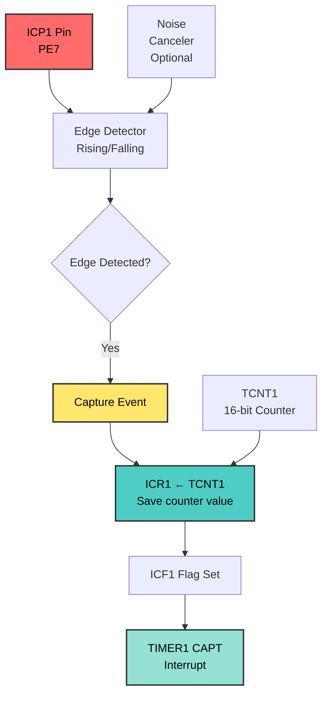

# Timer1 Input Capture - Frequency and Pulse Measurement
## ATmega128 Embedded Systems Course

**Reference**: [ATmega128 Datasheet](https://ww1.microchip.com/downloads/aemDocuments/documents/OTH/ProductDocuments/DataSheets/2467S.pdf)

---

## Slide 1: Introduction to Input Capture

### What is Input Capture?
- **Hardware feature** that captures timer value on external event
- **ICP1 pin** (PE7 on ATmega128) triggers capture
- **Saves TCNT1** value to ICR1 register automatically
- Used for **precise timing** of external events

### Why Use Input Capture?
✓ **Hardware precision** - no software delay  
✓ **Microsecond accuracy** - captures exact timer value  
✓ **Frequency measurement** - measure signal periods  
✓ **Pulse width measurement** - measure duty cycles  
✓ **RPM sensing** - rotary encoders, wheel speed  

### Applications
- Frequency counter
- Tachometer (RPM measurement)
- Ultrasonic distance (echo timing)
- IR remote decoding
- Pulse width measurement

---

## Slide 2: Input Capture Hardware

### Timer1 Input Capture Architecture

```mermaid
graph TB
    A[ICP1 Pin<br/>PE7] --> B[Edge Detector<br/>Rising/Falling]
    B --> C{Edge Detected?}
    C -->|Yes| D[Capture Event]
    D --> E[ICR1 ← TCNT1<br/>Save counter value]
    E --> F[ICF1 Flag Set]
    F --> G[TIMER1 CAPT<br/>Interrupt]
    
    H[TCNT1<br/>16-bit Counter] --> E
    I[Noise<br/>Canceler<br/>Optional] --> B
    
    style A fill:#ff6b6b,stroke:#333,stroke-width:2px,color:#000
    style D fill:#ffe66d,stroke:#333,stroke-width:2px,color:#000
    style E fill:#4ecdc4,stroke:#333,stroke-width:2px,color:#000
    style G fill:#95e1d3,stroke:#333,stroke-width:2px,color:#000
```

### Input Capture Resources
| Register | Description |
|----------|-------------|
| **ICR1H/L** | Input Capture Register (captured timer value) |
| **TCNT1H/L** | Timer Counter (free-running) |
| **TCCR1B** | Control register (edge select, noise canceler) |
| **TIMSK** | Interrupt mask (TICIE1) |
| **TIFR** | Interrupt flag (ICF1) |

### Pin Assignment
| Timer | ICP Pin | ATmega128 Port |
|-------|---------|----------------|
| Timer1 | ICP1 | PE7 |
| Timer3 | ICP3 | PE4 |

---

## Slide 3: Input Capture Configuration

### TCCR1B - Control Register (IC bits)
```
Bit     7      6      5      4      3      2      1      0
      ┌──────┬──────┬──────┬──────┬──────┬──────┬──────┬──────┐
TCCR1B│ ICNC1│ ICES1│  -   │ WGM13│ WGM12│ CS12 │ CS11 │ CS10 │
      └──────┴──────┴──────┴──────┴──────┴──────┴──────┴──────┘
```

| Bit | Name | Description |
|-----|------|-------------|
| **ICES1** | Input Capture Edge Select | 1=Rising, 0=Falling |
| **ICNC1** | Input Capture Noise Canceler | 1=Enable (4-clock delay) |
| **CS12:10** | Clock Select | Prescaler setting |

### Basic Configuration
```c
// Configure ICP1 as input
DDRE &= ~(1 << PE7);   // PE7 as input
PORTE |= (1 << PE7);   // Enable pull-up (optional)

// Configure Timer1 for input capture
TCCR1B = (1 << ICES1);  // Capture on rising edge
TCCR1B |= (1 << CS11);  // Prescaler /8 (for 16MHz: 2MHz timer clock)

// Enable input capture interrupt
TIMSK |= (1 << TICIE1);
sei();
```

### Edge Selection
```c
// Rising edge
TCCR1B |= (1 << ICES1);

// Falling edge
TCCR1B &= ~(1 << ICES1);

// Toggle edge (for both edges)
TCCR1B ^= (1 << ICES1);
```

---

## Slide 4: Frequency Measurement Principles

### Method: Period Measurement
```
Signal:  ┌─────┐     ┌─────┐     ┌─────┐
         │     │     │     │     │     │
    ─────┘     └─────┘     └─────┘     └─────
         ↑           ↑           ↑
      Capture1   Capture2   Capture3
         │←─ Period ─→│
         
Period = Capture2 - Capture1
Frequency = 1 / Period
```

### Calculation Formula
```
Timer frequency after prescaler:
  F_timer = F_CPU / Prescaler
  
Ticks between edges:
  Ticks = ICR1_new - ICR1_old
  
Signal frequency:
  F_signal = F_timer / Ticks
  
Example @ 16 MHz, Prescaler /8:
  F_timer = 16,000,000 / 8 = 2,000,000 Hz
  Ticks = 2000
  F_signal = 2,000,000 / 2000 = 1,000 Hz
```

---

## Slide 5: Frequency Measurement Implementation

### ISR-based Frequency Counter
```c
#define F_CPU 16000000UL
#define PRESCALER 8
#define TIMER_FREQ (F_CPU / PRESCALER)  // 2 MHz

volatile uint16_t last_capture = 0;
volatile uint32_t frequency = 0;

ISR(TIMER1_CAPT_vect) {
    uint16_t current_capture = ICR1;
    
    // Calculate ticks (handles overflow)
    uint16_t ticks = current_capture - last_capture;
    last_capture = current_capture;
    
    // Calculate frequency
    if (ticks > 0) {
        frequency = TIMER_FREQ / ticks;
    }
}

int main(void) {
    // Setup ICP1 pin
    DDRE &= ~(1 << PE7);
    
    // Timer1: Normal mode, /8 prescaler, rising edge
    TCCR1B = (1 << ICES1) | (1 << CS11);
    
    // Enable capture interrupt
    TIMSK |= (1 << TICIE1);
    sei();
    
    while(1) {
        // Display frequency
        printf("Frequency: %lu Hz\r\n", frequency);
        _delay_ms(500);
    }
}
```

### Handling Timer Overflow
```c
volatile uint8_t overflow_count = 0;

ISR(TIMER1_OVF_vect) {
    overflow_count++;
}

ISR(TIMER1_CAPT_vect) {
    uint32_t current_capture = ((uint32_t)overflow_count << 16) | ICR1;
    static uint32_t last_capture = 0;
    
    uint32_t ticks = current_capture - last_capture;
    last_capture = current_capture;
    
    if (ticks > 0) {
        frequency = TIMER_FREQ / ticks;
    }
    overflow_count = 0;
}
```

---

## Slide 6: Pulse Width Measurement

### Method: Capture Both Edges
```
Signal:  ┌───────────────┐
         │               │
    ─────┘               └─────────────
         ↑               ↑
    Rising Edge    Falling Edge
    Capture1       Capture2
         │← Pulse Width →│
         
Pulse Width = Capture2 - Capture1
Duty Cycle = (Pulse Width / Period) × 100%
```

### Implementation
```c
volatile uint16_t pulse_start = 0;
volatile uint16_t pulse_width = 0;
volatile uint8_t edge_state = 0;  // 0=waiting for rising, 1=waiting for falling

ISR(TIMER1_CAPT_vect) {
    if (edge_state == 0) {
        // Rising edge - start of pulse
        pulse_start = ICR1;
        edge_state = 1;
        
        // Switch to falling edge detection
        TCCR1B &= ~(1 << ICES1);
    }
    else {
        // Falling edge - end of pulse
        uint16_t pulse_end = ICR1;
        pulse_width = pulse_end - pulse_start;
        edge_state = 0;
        
        // Switch back to rising edge
        TCCR1B |= (1 << ICES1);
    }
}

// Calculate pulse width in microseconds
uint32_t get_pulse_width_us(void) {
    // For prescaler /8: each tick = 0.5 µs
    return (pulse_width * PRESCALER) / (F_CPU / 1000000UL);
}
```

---

## Slide 7: Prescaler Selection and Range

### Frequency Measurement Ranges @ 16 MHz

| Prescaler | Timer Freq | Min Freq (Hz) | Max Freq (Hz) | Resolution |
|-----------|------------|---------------|---------------|------------|
| **/1** | 16 MHz | 244 Hz | 8 MHz | 62.5 ns |
| **/8** | 2 MHz | 31 Hz | 1 MHz | 500 ns |
| **/64** | 250 kHz | 4 Hz | 125 kHz | 4 µs |
| **/256** | 62.5 kHz | 1 Hz | 31.25 kHz | 16 µs |
| **/1024** | 15.625 kHz | 0.24 Hz | 7.8 kHz | 64 µs |

**Calculation:**
```
Min Freq = Timer_Freq / 65536  (max ticks)
Max Freq = Timer_Freq / 2      (min ticks)
Resolution = 1 / Timer_Freq
```

### Prescaler Selection Guide
```
High frequency (> 10 kHz):  Use /1 or /8
Medium (100 Hz - 10 kHz):   Use /8 or /64
Low frequency (< 100 Hz):   Use /64 or /256
Very low (< 1 Hz):          Use /1024
```

---

## Slide 8: Noise Canceler

### Purpose
- Filters out **short glitches** on ICP pin
- Uses **4-clock sampling** window
- Reduces **false triggers**

### Configuration
```c
// Enable noise canceler
TCCR1B |= (1 << ICNC1);

// Disable noise canceler (more responsive)
TCCR1B &= ~(1 << ICNC1);
```

### Trade-offs
| Feature | ICNC1 = 0 (Off) | ICNC1 = 1 (On) |
|---------|-----------------|----------------|
| **Response** | Immediate | 4 clocks delay |
| **Noise** | Sensitive | Filtered |
| **Use Case** | Clean signals | Noisy environments |

### When to Use
✓ **Enable** for: Long cables, motors, switches  
✗ **Disable** for: High-speed signals, short pulses  

---

## Slide 9: Polling vs Interrupt Methods

### Method 1: Polling
```c
uint16_t measure_frequency_polling(void) {
    uint16_t capture1, capture2;
    
    // Wait for first edge
    while (!(TIFR & (1 << ICF1)));
    TIFR |= (1 << ICF1);  // Clear flag
    capture1 = ICR1;
    
    // Wait for second edge
    while (!(TIFR & (1 << ICF1)));
    TIFR |= (1 << ICF1);
    capture2 = ICR1;
    
    // Calculate frequency
    uint16_t ticks = capture2 - capture1;
    return (uint32_t)TIMER_FREQ / ticks;
}
```

**Pros:** Simple, blocking until measurement complete  
**Cons:** CPU locked, can't do other work

### Method 2: Interrupt
```c
volatile uint16_t frequency = 0;
volatile uint8_t measurement_ready = 0;

ISR(TIMER1_CAPT_vect) {
    static uint16_t last_capture = 0;
    uint16_t current = ICR1;
    
    uint16_t ticks = current - last_capture;
    last_capture = current;
    
    if (ticks > 0) {
        frequency = (uint32_t)TIMER_FREQ / ticks;
        measurement_ready = 1;
    }
}

int main(void) {
    // ... setup ...
    
    while(1) {
        if (measurement_ready) {
            measurement_ready = 0;
            printf("Freq: %u Hz\r\n", frequency);
        }
        
        // Can do other work here
    }
}
```

**Pros:** CPU free, multitasking  
**Cons:** Slightly more complex

---

## Slide 10: Advanced Applications

### Application 1: Tachometer (RPM Measurement)
```c
// Sensor: 1 pulse per revolution
ISR(TIMER1_CAPT_vect) {
    static uint16_t last_capture = 0;
    uint16_t current = ICR1;
    
    uint16_t ticks = current - last_capture;
    last_capture = current;
    
    // RPM = (60 × Timer_Freq) / (Ticks × Pulses_per_Rev)
    uint32_t rpm = (60UL * TIMER_FREQ) / ticks;
    
    display_rpm(rpm);
}
```

### Application 2: Ultrasonic Distance Sensor
```c
// Measure echo pulse width
volatile uint16_t distance_cm = 0;

ISR(TIMER1_CAPT_vect) {
    static uint16_t pulse_start = 0;
    static uint8_t state = 0;
    
    if (state == 0) {  // Rising edge
        pulse_start = ICR1;
        TCCR1B &= ~(1 << ICES1);  // Switch to falling
        state = 1;
    }
    else {  // Falling edge
        uint16_t pulse_width = ICR1 - pulse_start;
        
        // Distance = (pulse_width × speed_of_sound) / 2
        // Speed = 343 m/s = 0.0343 cm/µs
        // Each tick @ /8 = 0.5 µs
        distance_cm = (pulse_width * 0.5 * 0.0343) / 2;
        
        TCCR1B |= (1 << ICES1);  // Switch to rising
        state = 0;
    }
}
```

### Application 3: IR Remote Decoder
```c
// Decode IR pulses (e.g., NEC protocol)
ISR(TIMER1_CAPT_vect) {
    static uint16_t last_time = 0;
    uint16_t current_time = ICR1;
    
    uint16_t pulse_length = current_time - last_time;
    last_time = current_time;
    
    // Decode based on pulse length
    if (pulse_length > 13500 && pulse_length < 13900) {
        // Start bit detected
    }
    else if (pulse_length > 1000 && pulse_length < 1300) {
        // Logic '0'
    }
    else if (pulse_length > 2000 && pulse_length < 2300) {
        // Logic '1'
    }
    
    TCCR1B ^= (1 << ICES1);  // Toggle edge
}
```

---

## Slide 11: Common Pitfalls and Solutions

### Pitfall 1: Division by Zero
```c
// ❌ WRONG - may crash if ticks = 0
frequency = TIMER_FREQ / ticks;

// ✅ CORRECT - check first
if (ticks > 0) {
    frequency = TIMER_FREQ / ticks;
}
```

### Pitfall 2: Integer Overflow
```c
// ❌ WRONG - overflow if frequency high
uint16_t freq = TIMER_FREQ / ticks;  // Max 65535

// ✅ CORRECT - use 32-bit
uint32_t freq = (uint32_t)TIMER_FREQ / ticks;
```

### Pitfall 3: Forgetting Edge Toggle
```c
// ❌ WRONG - stuck on one edge
ISR(TIMER1_CAPT_vect) {
    // Measure pulse, but never toggle edge!
}

// ✅ CORRECT - alternate edges
ISR(TIMER1_CAPT_vect) {
    // ... measurement ...
    TCCR1B ^= (1 << ICES1);  // Toggle edge
}
```

### Best Practices
✓ **Choose prescaler** for expected frequency range  
✓ **Check for zero** before division  
✓ **Use 32-bit** for frequency calculations  
✓ **Toggle edge** for pulse width measurement  
✓ **Enable noise canceler** for noisy signals  

---

## Slide 12: Summary and Key Takeaways

### Input Capture Key Concepts
✓ **Hardware precision** - captures exact timer value  
✓ **ICP1 pin** (PE7) triggers capture on edge  
✓ **ICR1 register** stores captured TCNT1 value  
✓ **Edge selection** - rising, falling, or both  
✓ **Noise canceler** - optional 4-clock filter  

### Critical Formulas
```
Frequency = F_timer / (Capture2 - Capture1)
Pulse Width = (Falling_Capture - Rising_Capture) × tick_period
F_timer = F_CPU / Prescaler
```

### Register Summary
| Register | Purpose |
|----------|---------|
| **ICR1** | Captured timer value |
| **TCCR1B** | Edge select (ICES1), Noise cancel (ICNC1) |
| **TIMSK** | Enable interrupt (TICIE1) |
| **TIFR** | Check/clear flag (ICF1) |

### Applications
- **Frequency counter** - measure unknown signals
- **Tachometer** - RPM measurement
- **Ultrasonic sensor** - distance measurement
- **IR decoder** - remote control
- **Servo input** - read PWM signals

### Next Steps
- Combine with **USART** for data logging
- Use **multiple captures** for averaging
- Implement **timeout detection**
- Build **complete measurement system**

---

## References and Resources

### Documentation
- [ATmega128 Datasheet - Section 16.8: Input Capture Unit](https://ww1.microchip.com/downloads/aemDocuments/documents/OTH/ProductDocuments/DataSheets/2467S.pdf)
- Input Capture pages: 134-136
- Noise canceler: Page 135

### Related Projects
- `Timer_Programming` - Basic timer examples
- `Timer1_CTC_Precision` - CTC mode
- `Timer_Stopwatch` - Timer applications

### Application Notes
- AVR Frequency meter design
- Ultrasonic sensor interfacing
- IR remote decoding techniques
