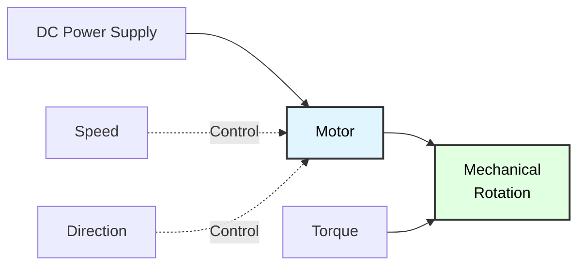
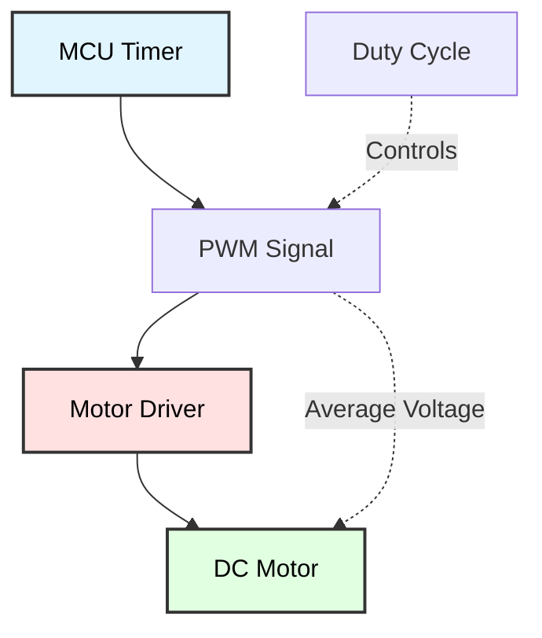
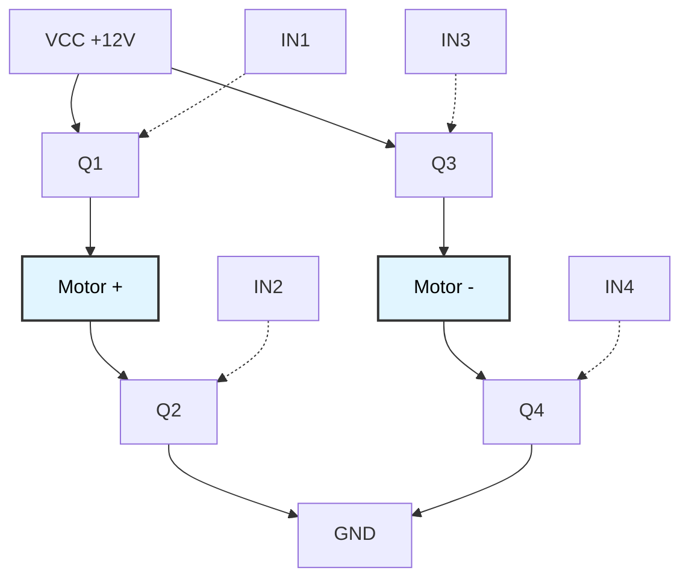
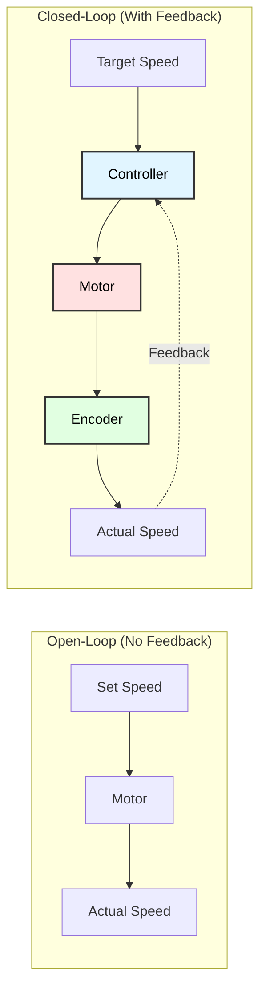
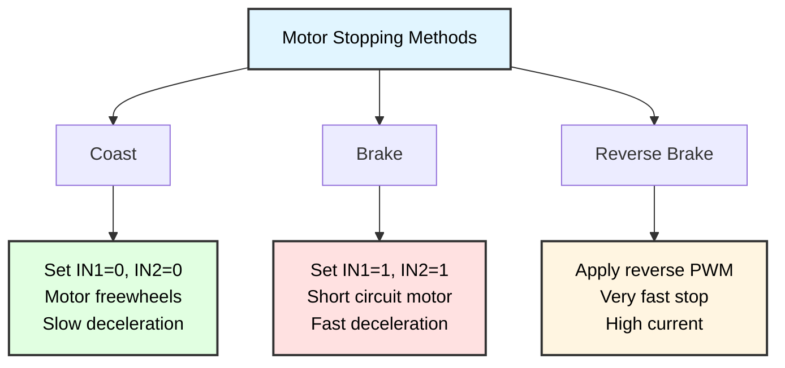

# DC Motor Control with PWM
## ATmega128 Embedded Systems Course

**Reference**: [ATmega128 Datasheet](https://ww1.microchip.com/downloads/en/DeviceDoc/doc2467.pdf)

---

## Slide 1: Introduction to DC Motors

### What is a DC Motor?
- **Electromechanical device** that converts electrical energy to mechanical rotation
- Consists of **stator** (stationary) and **rotor** (rotating armature)
- Speed controlled by **voltage/current**
- Direction controlled by **polarity**

### DC Motor Characteristics


### Key Parameters
| Parameter | Symbol | Typical Range |
|-----------|--------|---------------|
| **Voltage** | V | 3V - 24V |
| **Current** | I | 100mA - 5A |
| **Speed** | RPM | 100 - 10,000 RPM |
| **Torque** | τ | 0.1 - 10 kg·cm |

### Applications
✓ **Robotics** - Wheels, arms, grippers  
✓ **Appliances** - Fans, pumps, mixers  
✓ **Toys** - RC cars, drones  
✓ **Automation** - Conveyors, actuators  

---

## Slide 2: PWM Speed Control Concept

### Why PWM for Motor Control?
- **Efficient**: Minimal power loss (transistor fully ON or OFF)
- **Precise**: Fine speed control with digital signals
- **Simple**: Easy to implement with microcontroller timers
- **Variable**: Can adjust speed without changing voltage source

### PWM Principle


### Duty Cycle vs Speed
```
Duty Cycle = (T_ON / T_PERIOD) × 100%

Average Voltage = V_SUPPLY × Duty_Cycle

Speed ∝ Average Voltage

Examples:
10% duty cycle  → Low speed    (0.5V @ 5V supply)
50% duty cycle  → Medium speed (2.5V @ 5V supply)
90% duty cycle  → High speed   (4.5V @ 5V supply)
```

---

## Slide 3: PWM Waveforms

### PWM Signal Examples
```
Frequency = 1kHz (Period = 1ms)

10% Duty Cycle:
    ┌──┐          ┌──┐          ┌──┐
    │  │          │  │          │  │
────┘  └──────────┘  └──────────┘  └────
    0.1ms  0.9ms

50% Duty Cycle:
    ┌─────┐     ┌─────┐     ┌─────┐
    │     │     │     │     │     │
────┘     └─────┘     └─────┘     └────
     0.5ms 0.5ms

90% Duty Cycle:
    ┌─────────┐ ┌─────────┐ ┌─────────┐
    │         │ │         │ │         │
────┘         └─┘         └─┘         └─
      0.9ms  0.1ms
```

### Frequency Selection
| Frequency | Effect | Use Case |
|-----------|--------|----------|
| **< 100 Hz** | Audible noise, jerky motion | ❌ Avoid |
| **1-10 kHz** | Smooth, quiet operation | ✓ Most DC motors |
| **10-20 kHz** | Very quiet, moderate loss | Servo/stepper motors |
| **> 20 kHz** | Ultrasonic (inaudible), higher switching loss | Audio-sensitive applications |

---

## Slide 4: Motor Driver Basics

### Why Use a Motor Driver?
- **MCU cannot** drive motors directly (limited current ~20mA)
- Motors require **high current** (100mA - several amps)
- Need **bidirectional** control (forward/reverse)
- **Protection** for MCU (back EMF, noise)

### H-Bridge Configuration


### H-Bridge Truth Table (L298N)
| IN1 | IN2 | IN3 | IN4 | Motor State |
|-----|-----|-----|-----|-------------|
| 1 | 0 | 0 | 1 | **Forward** (current flows A→B) |
| 0 | 1 | 1 | 0 | **Reverse** (current flows B→A) |
| 0 | 0 | 0 | 0 | **Coast** (high-impedance, freewheel) |
| 1 | 1 | 1 | 1 | **Brake** (both terminals shorted) |
| 1 | 1 | 0 | 0 | ❌ **Shoot-through!** (short circuit) |

---

## Slide 5: Common Motor Drivers

### L298N Dual H-Bridge
```
Specifications:
- Voltage: 5V - 35V
- Current: Up to 2A per channel (4A peak)
- Two DC motors or one stepper
- Built-in protection diodes
- Enable pins for PWM control
```

### L293D/SN754410 (Low Power)
```
Specifications:
- Voltage: 4.5V - 36V
- Current: 600mA per channel (1.2A peak)
- Quad half-H driver
- Thermal shutdown
- Good for small motors
```

### DRV8833 (Modern, Efficient)
```
Specifications:
- Voltage: 2.7V - 10.8V
- Current: 1.2A per channel (2A peak)
- Low RDS(on) = efficient
- Integrated protection
- Small package
```

---

## Slide 6: Hardware Setup - L298N

### Connections
```
ATmega128          L298N Module           DC Motor
---------          ------------           --------
OC1A (PB5) ────→   ENA (PWM Enable A)
OC1B (PB6) ────→   ENB (PWM Enable B)
PD0        ────→   IN1 (Direction)        Motor A (+)
PD1        ────→   IN2 (Direction)            │
PD2        ────→   IN3 (Direction)        Motor A (-)
PD3        ────→   IN4 (Direction)            │
                                      Motor B (+)
                                          │
                                      Motor B (-)
GND        ────────┬─ GND
                   │
+12V       ────→   +12V (Motor supply, 5-35V)

Note: Keep motor power and logic ground connected but use separate supplies
```

### Schematic Concept
```
         ┌──────────────┐
PWM  ────┤ ENA      OUT1├───┐
IN1  ────┤ IN1           │   │ Motor A
IN2  ────┤ IN2      OUT2├───┘
         │              │
PWM  ────┤ ENB      OUT3├───┐
IN3  ────┤ IN3           │   │ Motor B
IN4  ────┤ IN4      OUT4├───┘
         │              │
+12V ────┤ +12V     GND ├─── GND
         └──────────────┘
```

---

## Slide 7: ATmega128 Timer PWM Setup

### Timer1 Fast PWM Configuration
```c
#include <avr/io.h>

// Motor A: OC1A (PB5)
// Motor B: OC1B (PB6)

void timer1_pwm_init(void) {
    // Set OC1A and OC1B as outputs
    DDRB |= (1 << PB5) | (1 << PB6);
    
    // Fast PWM, 10-bit (WGM13:0 = 0111, TOP = 0x03FF = 1023)
    TCCR1A = (1 << WGM11) | (1 << WGM10);
    TCCR1B = (1 << WGM12);
    
    // Non-inverting mode for both channels
    // Clear OC1A/OC1B on compare match, set at BOTTOM
    TCCR1A |= (1 << COM1A1) | (1 << COM1B1);
    
    // Prescaler = 8 (CS12:0 = 010)
    // PWM frequency = F_CPU / (prescaler * (1 + TOP))
    // = 16MHz / (8 * 1024) ≈ 1.953 kHz
    TCCR1B |= (1 << CS11);
    
    // Start with 0% duty cycle
    OCR1A = 0;
    OCR1B = 0;
}

void motor_set_speed(uint16_t speed) {
    // speed: 0-1023 (0% - 100% duty cycle)
    // Note: Clamping prevents overflow in 10-bit PWM
    if (speed > 1023) speed = 1023;
    
    OCR1A = speed;  // Motor A duty cycle
    OCR1B = speed;  // Motor B duty cycle
}

// Example usage:
// motor_set_speed(512);   // 50% duty cycle
// motor_set_speed(1023);  // 100% duty cycle (full speed)
```

---

## Slide 8: Direction Control

### Direction Pin Setup
```c
// Direction control pins
#define MOTOR_A_IN1  PD0
#define MOTOR_A_IN2  PD1
#define MOTOR_B_IN1  PD2
#define MOTOR_B_IN2  PD3

void motor_pins_init(void) {
    // Set direction pins as outputs
    DDRD |= (1 << MOTOR_A_IN1) | (1 << MOTOR_A_IN2) |
            (1 << MOTOR_B_IN1) | (1 << MOTOR_B_IN2);
    
    // Initialize all LOW
    PORTD &= ~((1 << MOTOR_A_IN1) | (1 << MOTOR_A_IN2) |
               (1 << MOTOR_B_IN1) | (1 << MOTOR_B_IN2));
}

typedef enum {
    MOTOR_STOP,
    MOTOR_FORWARD,
    MOTOR_REVERSE,
    MOTOR_BRAKE
} motor_dir_t;

void motor_a_direction(motor_dir_t dir) {
    switch (dir) {
        case MOTOR_FORWARD:
            // IN1=1, IN2=0 → Current flows +→-
            PORTD |= (1 << MOTOR_A_IN1);
            PORTD &= ~(1 << MOTOR_A_IN2);
            break;
            
        case MOTOR_REVERSE:
            // IN1=0, IN2=1 → Current flows -→+
            PORTD &= ~(1 << MOTOR_A_IN1);
            PORTD |= (1 << MOTOR_A_IN2);
            break;
            
        case MOTOR_BRAKE:
            // IN1=1, IN2=1 → Active brake (short circuit)
            PORTD |= (1 << MOTOR_A_IN1) | (1 << MOTOR_A_IN2);
            break;
            
        case MOTOR_STOP:
        default:
            // IN1=0, IN2=0 → Coast (high impedance)
            PORTD &= ~((1 << MOTOR_A_IN1) | (1 << MOTOR_A_IN2));
            break;
    }
}

void motor_b_direction(motor_dir_t dir) {
    switch (dir) {
        case MOTOR_FORWARD:
            PORTD |= (1 << MOTOR_B_IN1);
            PORTD &= ~(1 << MOTOR_B_IN2);
            break;
            
        case MOTOR_REVERSE:
            PORTD &= ~(1 << MOTOR_B_IN1);
            PORTD |= (1 << MOTOR_B_IN2);
            break;
            
        case MOTOR_BRAKE:
            PORTD |= (1 << MOTOR_B_IN1) | (1 << MOTOR_B_IN2);
            break;
            
        case MOTOR_STOP:
        default:
            PORTD &= ~((1 << MOTOR_B_IN1) | (1 << MOTOR_B_IN2));
            break;
    }
}
```

---

## Slide 9: Complete Motor Control API

### High-Level Motor Functions
```c
typedef struct {
    motor_dir_t direction;
    uint16_t speed;  // 0-100 (percentage)
} motor_t;

motor_t motor_a = {MOTOR_STOP, 0};
motor_t motor_b = {MOTOR_STOP, 0};

void motor_init(void) {
    timer1_pwm_init();
    motor_pins_init();
}

void motor_a_set(motor_dir_t dir, uint8_t speed_percent) {
    // Clamp speed to 0-100
    if (speed_percent > 100) speed_percent = 100;
    
    // Convert percentage to PWM value (0-1023)
    uint16_t pwm_value = (speed_percent * 1023UL) / 100;
    
    // Set direction
    motor_a_direction(dir);
    
    // Set speed
    OCR1A = pwm_value;
    
    // Update state
    motor_a.direction = dir;
    motor_a.speed = speed_percent;
}

void motor_b_set(motor_dir_t dir, uint8_t speed_percent) {
    if (speed_percent > 100) speed_percent = 100;
    
    uint16_t pwm_value = (speed_percent * 1023UL) / 100;
    
    motor_b_direction(dir);
    OCR1B = pwm_value;
    
    motor_b.direction = dir;
    motor_b.speed = speed_percent;
}

void motor_stop_all(void) {
    motor_a_set(MOTOR_STOP, 0);
    motor_b_set(MOTOR_STOP, 0);
}

void motor_brake_all(void) {
    motor_a_set(MOTOR_BRAKE, 0);
    motor_b_set(MOTOR_BRAKE, 0);
}
```

---

## Slide 10: Example - Speed Ramp

### Smooth Speed Changes
```c
#include <util/delay.h>

void motor_ramp_speed(uint8_t start_pct, uint8_t end_pct, uint16_t duration_ms) {
    // Calculate number of steps (10ms per step for smooth transition)
    uint16_t steps = (duration_ms / 10);
    if (steps == 0) steps = 1;  // Minimum one step
    
    // Calculate speed increment per step
    int16_t delta = end_pct - start_pct;
    float increment = (float)delta / steps;
    
    // Gradually change speed from start to end
    for (uint16_t i = 0; i <= steps; i++) {
        uint8_t current_speed = start_pct + (uint8_t)(increment * i);
        motor_a_set(MOTOR_FORWARD, current_speed);
        _delay_ms(10);
    }
}

// Example: Gradual acceleration
int main(void) {
    motor_init();
    
    // Accelerate from 0% to 100% over 2 seconds
    motor_ramp_speed(0, 100, 2000);
    
    // Run at full speed
    _delay_ms(3000);
    
    // Decelerate from 100% to 0% over 2 seconds
    motor_ramp_speed(100, 0, 2000);
    
    motor_stop_all();
    
    while (1);
}
```

---

## Slide 11: Robot Movement Patterns

### Differential Drive Robot
```c
void robot_forward(uint8_t speed) {
    motor_a_set(MOTOR_FORWARD, speed);
    motor_b_set(MOTOR_FORWARD, speed);
}

void robot_reverse(uint8_t speed) {
    motor_a_set(MOTOR_REVERSE, speed);
    motor_b_set(MOTOR_REVERSE, speed);
}

void robot_turn_left(uint8_t speed) {
    motor_a_set(MOTOR_REVERSE, speed);
    motor_b_set(MOTOR_FORWARD, speed);
}

void robot_turn_right(uint8_t speed) {
    motor_a_set(MOTOR_FORWARD, speed);
    motor_b_set(MOTOR_REVERSE, speed);
}

void robot_arc_left(uint8_t speed) {
    // Left motor slower than right
    motor_a_set(MOTOR_FORWARD, speed / 2);
    motor_b_set(MOTOR_FORWARD, speed);
}

void robot_arc_right(uint8_t speed) {
    // Right motor slower than left
    motor_a_set(MOTOR_FORWARD, speed);
    motor_b_set(MOTOR_FORWARD, speed / 2);
}

void robot_stop(void) {
    motor_stop_all();
}

// Movement sequence
void robot_demo(void) {
    robot_forward(70);
    _delay_ms(2000);
    
    robot_turn_right(50);
    _delay_ms(500);
    
    robot_forward(70);
    _delay_ms(2000);
    
    robot_turn_left(50);
    _delay_ms(500);
    
    robot_reverse(50);
    _delay_ms(1000);
    
    robot_stop();
}
```

---

## Slide 12: Speed Feedback Control

### Open-Loop vs Closed-Loop


### Encoder Integration
```c
// Optical encoder: 20 pulses per revolution
#define PULSES_PER_REV  20

volatile uint16_t encoder_pulses = 0;
volatile int16_t motor_rpm = 0;

// External interrupt for encoder
ISR(INT0_vect) {
    encoder_pulses++;
}

void encoder_init(void) {
    // INT0 on rising edge
    EICRA |= (1 << ISC01) | (1 << ISC00);
    EIMSK |= (1 << INT0);
    sei();
}

// Calculate RPM (called every 100ms by timer)
void calculate_rpm(void) {
    // pulses in 100ms -> pulses/sec -> revolutions/sec -> RPM
    motor_rpm = (encoder_pulses * 10 * 60) / PULSES_PER_REV;
    encoder_pulses = 0;
}
```

---

## Slide 13: PID Speed Control

### PID Controller
```c
typedef struct {
    float Kp;  // Proportional gain
    float Ki;  // Integral gain
    float Kd;  // Derivative gain
    
    float setpoint;
    float integral;
    float last_error;
} pid_t;

pid_t motor_pid = {
    .Kp = 2.0,
    .Ki = 0.5,
    .Kd = 0.1,
    .setpoint = 0,
    .integral = 0,
    .last_error = 0
};

float pid_update(pid_t *pid, float measured_value, float dt) {
    // Calculate error
    float error = pid->setpoint - measured_value;
    
    // Proportional term
    float P = pid->Kp * error;
    
    // Integral term with anti-windup
    pid->integral += error * dt;
    // Clamp integral to prevent windup
    if (pid->integral > 100.0 / pid->Ki) pid->integral = 100.0 / pid->Ki;
    if (pid->integral < -100.0 / pid->Ki) pid->integral = -100.0 / pid->Ki;
    float I = pid->Ki * pid->integral;
    
    // Derivative term (rate of change of error)
    float derivative = (error - pid->last_error) / dt;
    float D = pid->Kd * derivative;
    
    pid->last_error = error;
    
    // Calculate PID output
    float output = P + I + D;
    
    // Clamp output to valid range (0-100%)
    if (output > 100.0) output = 100.0;
    if (output < 0.0) output = 0.0;
    
    return output;
}

// Main control loop
void speed_control_loop(void) {
    motor_pid.setpoint = 500;  // Target: 500 RPM
    
    while (1) {
        calculate_rpm();  // Update motor_rpm from encoder
        
        float control = pid_update(&motor_pid, motor_rpm, 0.1);
        
        motor_a_set(MOTOR_FORWARD, (uint8_t)control);
        
        _delay_ms(100);  // 10 Hz control loop
    }
}
```

---

## Slide 14: Current Sensing

### Why Measure Motor Current?
✓ **Overload detection** - Prevent motor damage  
✓ **Stall detection** - Detect blocked motor  
✓ **Power monitoring** - Battery life estimation  
✓ **Torque estimation** - Current ≈ Torque  

### ACS712 Current Sensor
```c
// ACS712-05B: 185 mV/A sensitivity, centered at VCC/2 (2.5V)
// Measurement range: ±5A
// ADC reading -> Current (Amperes)

float read_motor_current(uint8_t adc_channel) {
    uint16_t adc = adc_read(adc_channel);
    
    // Convert ADC to voltage (0-5V range)
    float voltage = (adc * 5.0) / 1024.0;
    
    // Calculate current using ACS712 formula:
    // I(A) = (V_out - V_zero) / Sensitivity
    // V_zero = 2.5V (zero current output)
    // Sensitivity = 0.185 V/A for ACS712-05B
    float current = (voltage - 2.5) / 0.185;
    
    return current;  // Returns negative for reverse current
}

void monitor_current(void) {
    float current = read_motor_current(0);
    
    if (current > 2.0) {  // Over 2A
        motor_stop_all();
        lcd_puts("OVERCURRENT!");
    }
}

// Stall detection
uint8_t detect_stall(uint8_t motor_speed, float current) {
    // High current + low speed = stall
    if (motor_speed > 50 && current > 1.5) {
        return 1;  // Stalled
    }
    return 0;
}
```

---

## Slide 15: Soft Start and Stop

### Why Soft Start/Stop?
- **Reduce mechanical stress** on gears and drivetrain
- **Prevent current spikes** (gentler on power supply)
- **Smoother motion** for robotics applications
- **Extend motor lifespan**

### Implementation
```c
void motor_soft_start(uint8_t target_speed, uint16_t ramp_time_ms) {
    uint16_t steps = ramp_time_ms / 20;  // 20ms per step
    uint8_t step_size = target_speed / steps;
    
    for (uint8_t speed = 0; speed < target_speed; speed += step_size) {
        motor_a_set(MOTOR_FORWARD, speed);
        _delay_ms(20);
    }
    
    motor_a_set(MOTOR_FORWARD, target_speed);
}

void motor_soft_stop(uint16_t ramp_time_ms) {
    uint8_t current_speed = motor_a.speed;
    uint16_t steps = ramp_time_ms / 20;
    uint8_t step_size = current_speed / steps;
    
    for (uint8_t speed = current_speed; speed > step_size; speed -= step_size) {
        motor_a_set(motor_a.direction, speed);
        _delay_ms(20);
    }
    
    motor_a_set(MOTOR_STOP, 0);
}

// Example
int main(void) {
    motor_init();
    
    motor_soft_start(80, 1000);  // Ramp to 80% over 1 second
    _delay_ms(3000);              // Run for 3 seconds
    motor_soft_stop(1000);        // Ramp down over 1 second
    
    while (1);
}
```

---

## Slide 16: Braking Methods

### Coast vs Brake


### Braking Implementation
```c
void motor_coast_stop(void) {
    // Coast: Both inputs LOW
    motor_a_set(MOTOR_STOP, 0);
    
    // Motor will slowly decelerate
}

void motor_active_brake(void) {
    // Brake: Both inputs HIGH
    motor_a_set(MOTOR_BRAKE, 0);
    
    // Motor stops quickly
}

void motor_reverse_brake(uint8_t brake_strength, uint16_t duration_ms) {
    // Apply reverse PWM briefly
    motor_dir_t original_dir = motor_a.direction;
    
    if (original_dir == MOTOR_FORWARD) {
        motor_a_set(MOTOR_REVERSE, brake_strength);
    } else {
        motor_a_set(MOTOR_FORWARD, brake_strength);
    }
    
    _delay_ms(duration_ms);
    
    // Then active brake
    motor_active_brake();
}

// Example: Emergency stop
void emergency_stop(void) {
    motor_reverse_brake(100, 100);  // Full reverse for 100ms
    _delay_ms(50);
    motor_active_brake();            // Then brake
}
```

---

## Slide 17: Joystick Control

### Analog Joystick Input
```c
#define JOYSTICK_X_CHANNEL  0
#define JOYSTICK_Y_CHANNEL  1
#define JOYSTICK_DEADZONE   50  // ADC units

typedef struct {
    int16_t x;  // -512 to +512
    int16_t y;  // -512 to +512
} joystick_t;

joystick_t read_joystick(void) {
    joystick_t js;
    
    // Read raw ADC values (0-1023)
    uint16_t x_raw = adc_read(JOYSTICK_X_CHANNEL);
    uint16_t y_raw = adc_read(JOYSTICK_Y_CHANNEL);
    
    // Center at 0 (range: -512 to +512)
    js.x = (int16_t)x_raw - 512;
    js.y = (int16_t)y_raw - 512;
    
    // Apply deadzone to eliminate drift from center position
    if (abs(js.x) < JOYSTICK_DEADZONE) js.x = 0;
    if (abs(js.y) < JOYSTICK_DEADZONE) js.y = 0;
    
    return js;
}

void robot_joystick_control(void) {
    joystick_t js = read_joystick();
    
    // Y-axis: forward/reverse
    // X-axis: turn left/right
    
    // Tank drive mixing
    int16_t left_motor = js.y + js.x;
    int16_t right_motor = js.y - js.x;
    
    // Clamp to -512 to +512
    if (left_motor > 512) left_motor = 512;
    if (left_motor < -512) left_motor = -512;
    if (right_motor > 512) right_motor = 512;
    if (right_motor < -512) right_motor = -512;
    
    // Convert to speed (0-100) and direction
    uint8_t left_speed = abs(left_motor) * 100 / 512;
    uint8_t right_speed = abs(right_motor) * 100 / 512;
    
    motor_dir_t left_dir = (left_motor >= 0) ? MOTOR_FORWARD : MOTOR_REVERSE;
    motor_dir_t right_dir = (right_motor >= 0) ? MOTOR_FORWARD : MOTOR_REVERSE;
    
    motor_a_set(left_dir, left_speed);
    motor_b_set(right_dir, right_speed);
}

int main(void) {
    motor_init();
    adc_init();
    
    while (1) {
        robot_joystick_control();
        _delay_ms(50);  // 20 Hz update rate
    }
}
```

---

## Slide 18: Line Following Robot

### Sensor Array
```c
// 3-sensor line follower
#define LEFT_SENSOR    0
#define CENTER_SENSOR  1
#define RIGHT_SENSOR   2
#define THRESHOLD      500

typedef enum {
    LINE_CENTER,
    LINE_LEFT,
    LINE_RIGHT,
    LINE_LOST
} line_position_t;

line_position_t read_line_position(void) {
    uint16_t left = adc_read(LEFT_SENSOR);
    uint16_t center = adc_read(CENTER_SENSOR);
    uint16_t right = adc_read(RIGHT_SENSOR);
    
    uint8_t l = (left < THRESHOLD);
    uint8_t c = (center < THRESHOLD);
    uint8_t r = (right < THRESHOLD);
    
    if (l && !c && !r) return LINE_LEFT;
    if (!l && c && !r) return LINE_CENTER;
    if (!l && !c && r) return LINE_RIGHT;
    
    return LINE_LOST;
}

void line_follow(void) {
    line_position_t pos = read_line_position();
    
    const uint8_t BASE_SPEED = 60;  // Forward speed when on track
    const uint8_t TURN_SPEED = 40;  // Reduced speed for turning wheel
    
    switch (pos) {
        case LINE_CENTER:
            // Line centered: drive straight at base speed
            motor_a_set(MOTOR_FORWARD, BASE_SPEED);
            motor_b_set(MOTOR_FORWARD, BASE_SPEED);
            break;
            
        case LINE_LEFT:
            // Line to left: slow down left motor to turn left
            motor_a_set(MOTOR_FORWARD, TURN_SPEED);
            motor_b_set(MOTOR_FORWARD, BASE_SPEED);
            break;
            
        case LINE_RIGHT:
            // Line to right: slow down right motor to turn right
            motor_a_set(MOTOR_FORWARD, BASE_SPEED);
            motor_b_set(MOTOR_FORWARD, TURN_SPEED);
            break;
            
        case LINE_LOST:
            // Line not detected: stop and search
            motor_stop_all();
            // TODO: Implement search pattern
            break;
    }
}

int main(void) {
    motor_init();
    adc_init();
    
    while (1) {
        line_follow();
        _delay_ms(20);
    }
}
```

---

## Slide 19: Obstacle Avoidance

### Ultrasonic Distance Measurement
```c
#include "hcsr04.h"  // Ultrasonic sensor library

#define SAFE_DISTANCE  30  // cm

void obstacle_avoidance(void) {
    uint16_t distance = hcsr04_measure();
    
    if (distance > SAFE_DISTANCE) {
        // Path clear: go forward
        robot_forward(70);
        
    } else if (distance > 15) {
        // Obstacle close: slow down
        robot_forward(30);
        
    } else {
        // Obstacle too close: avoid
        motor_stop_all();
        _delay_ms(500);
        
        // Back up
        robot_reverse(50);
        _delay_ms(800);
        
        // Turn (random direction)
        if (rand() & 1) {
            robot_turn_left(60);
        } else {
            robot_turn_right(60);
        }
        _delay_ms(600);
    }
}

int main(void) {
    motor_init();
    hcsr04_init();
    
    while (1) {
        obstacle_avoidance();
        _delay_ms(100);
    }
}
```

---

## Slide 20: Battery Monitoring

### Voltage Measurement
```c
// Voltage divider: Vbat --[10k]--+--[10k]-- GND
//                                |
//                               ADC

float read_battery_voltage(uint8_t adc_channel) {
    uint16_t adc = adc_read(adc_channel);
    
    // ADC voltage (with 2:1 divider)
    float voltage = (adc * 5.0 / 1024.0) * 2.0;
    
    return voltage;
}

void battery_protection(void) {
    static uint32_t last_check = 0;
    uint32_t now = millis();
    
    // Check battery every second
    if (now - last_check > 1000) {
        float vbat = read_battery_voltage(7);
        
        // LiPo 3S battery levels:
        // - Full: 12.6V (4.2V per cell)
        // - Nominal: 11.1V (3.7V per cell)
        // - Low: 10.5V (3.5V per cell)
        // - Critical: 9.9V (3.3V per cell)
        // - Damage threshold: 9.0V (3.0V per cell)
        
        if (vbat < 10.5) {
            // Low battery warning: reduce speed to 50%
            motor_a_set(motor_a.direction, motor_a.speed / 2);
            motor_b_set(motor_b.direction, motor_b.speed / 2);
            
            lcd_gotoxy(0, 1);
            lcd_puts("LOW BATTERY!");
        }
        
        if (vbat < 9.9) {
            // Critical battery: stop all motors immediately
            motor_stop_all();
            
            lcd_clear();
            lcd_puts("BAT CRITICAL!");
            lcd_gotoxy(0, 1);
            lcd_puts("SHUTTING DOWN");
            
            while (1);  // Halt system to prevent battery damage
        }
        
        last_check = now;
    }
}
```

---

## Slide 21: Motor Debugging

### Debug Output
```c
void motor_debug_info(void) {
    char buffer[20];
    
    lcd_gotoxy(0, 0);
    sprintf(buffer, "MA:%s %3d%%", 
            motor_a.direction == MOTOR_FORWARD ? "FWD" : "REV",
            motor_a.speed);
    lcd_puts(buffer);
    
    lcd_gotoxy(0, 1);
    sprintf(buffer, "MB:%s %3d%%", 
            motor_b.direction == MOTOR_FORWARD ? "FWD" : "REV",
            motor_b.speed);
    lcd_puts(buffer);
    
    // UART output
    printf("Motor A: %s %d%%, OCR1A=%u\n", 
           motor_a.direction == MOTOR_FORWARD ? "FWD" : "REV",
           motor_a.speed, OCR1A);
}

// PWM signal verification
void test_pwm_output(void) {
    // Generate test pattern on oscilloscope
    for (uint8_t i = 0; i <= 100; i += 10) {
        motor_a_set(MOTOR_FORWARD, i);
        printf("Testing %d%% duty cycle\n", i);
        _delay_ms(2000);
    }
}

// Direction test
void test_directions(void) {
    motor_a_set(MOTOR_FORWARD, 50);
    _delay_ms(2000);
    
    motor_a_set(MOTOR_STOP, 0);
    _delay_ms(1000);
    
    motor_a_set(MOTOR_REVERSE, 50);
    _delay_ms(2000);
    
    motor_a_set(MOTOR_BRAKE, 0);
}
```

---

## Slide 22: Common Issues and Solutions

### Troubleshooting Guide

| Problem | Possible Cause | Solution |
|---------|----------------|----------|
| **Motor doesn't spin** | No power to driver | Check power supply, LED indicators, measure voltage |
| | Wrong wiring | Verify IN1/IN2/ENA connections with multimeter |
| | Insufficient PWM | Increase duty cycle >20%, verify OCR1A value |
| | Dead zone | Motor requires minimum PWM to overcome friction |
| **Jittery motion** | Low PWM frequency | Increase frequency to 1-10 kHz range |
| | Mechanical binding | Check for obstructions, bearing issues |
| | Unstable power supply | Add bulk capacitors (100-1000µF) near driver |
| | Loose connections | Check all wire connections, terminal blocks |
| **Wrong direction** | Swapped IN1/IN2 | Swap control pins in code or motor wires |
| | Incorrect H-bridge logic | Review truth table, verify driver type |
| **Overheating** | Continuous overcurrent | Check motor current rating vs actual draw |
| | Continuous stall | Add stall detection and timeout protection |
| | Inadequate cooling | Add heatsink, improve ventilation |
| **Erratic behavior** | EMI from motor brushes | Add ceramic caps (0.1µF) across motor terminals |
| | Ground loop issues | Use common ground for MCU, driver, and power |
| | Back EMF spikes | Verify flyback diodes present in driver |

### Protection Measures
```c
void motor_protection_init(void) {
    // 1. Current limiting
    // 2. Thermal monitoring
    // 3. Stall detection
    // 4. Overcurrent shutdown
    
    // Enable watchdog timer
    wdt_enable(WDTO_2S);
}

void motor_safe_operation(void) {
    // Check all safety conditions
    if (detect_stall(motor_a.speed, read_motor_current(0))) {
        motor_stop_all();
        log_error("Motor A stalled!");
    }
    
    wdt_reset();  // Pet the watchdog
}
```

---

## Slide 23: Best Practices

### Motor Control Guidelines

**Essential practices for reliable and efficient motor control systems**

✓ **Power Supply**
- Use separate power supplies for motors and MCU logic
- Add bulk capacitors (100-1000µF) near motor driver for transient suppression
- Include ceramic bypass capacitors (0.1µF) on all VCC pins

✓ **PWM Configuration**
- Frequency: 1-10 kHz for most DC motors
- Resolution: 8-10 bits sufficient (256-1024 levels)
- Avoid very low frequencies (audible noise)

✓ **Direction Changes**
- Always stop or slow down before reversing
- Add delay between direction changes (10-50ms)
- Use braking to prevent coasting

✓ **Software**
- Implement soft start/stop for mechanical longevity
- Add current monitoring for safety
- Use ramp functions instead of instant changes
- Include timeout/watchdog protection

✓ **Mechanical**
- Secure all motor mounts (vibration causes issues)
- Check for binding or excessive load
- Use proper wire gauge for current requirements
- Add heatsinks if motors run warm

---

## Slide 24: Performance Optimization

### Efficient Motor Control
```c
// 1. Use hardware PWM (not software)
// ✓ Timer-based PWM is efficient and precise
// ✗ Avoid bit-banging PWM in software

// 2. Minimize direction changes
void efficient_turn(uint8_t angle) {
    // Calculate shortest rotation
    if (angle > 180) {
        robot_turn_left(360 - angle);
    } else {
        robot_turn_right(angle);
    }
}

// 3. Optimize control loop frequency
// Too fast: Wastes CPU cycles
// Too slow: Poor response
void motor_control_loop(void) {
    while (1) {
        update_sensors();          // ~5ms
        calculate_control();       // ~2ms
        apply_motor_commands();    // <1ms
        
        _delay_ms(13);  // Total = 20ms (50 Hz)
    }
}

// 4. Use interrupts for encoder counting
// Don't poll in main loop

// 5. Batch ADC conversions
void read_all_sensors(void) {
    ADMUX = (ADMUX & 0xF0) | 0;
    ADCSRA |= (1 << ADSC);
    while (ADCSRA & (1 << ADSC));
    sensor[0] = ADC;
    
    ADMUX = (ADMUX & 0xF0) | 1;
    ADCSRA |= (1 << ADSC);
    while (ADCSRA & (1 << ADSC));
    sensor[1] = ADC;
    
    // ... etc
}
```

---

## Slide 25: Advanced: Motor Characterization

### Measuring Motor Parameters

**Understanding your motor's characteristics is essential for optimal control**

```c
// Dead zone: Minimum PWM to overcome static friction
// This varies by motor load, bearing friction, and voltage
uint8_t find_dead_zone(void) {
    for (uint8_t pwm = 0; pwm < 100; pwm++) {
        motor_a_set(MOTOR_FORWARD, pwm);
        _delay_ms(500);  // Wait for motor to stabilize
        
        if (encoder_pulses > 0) {
            return pwm;  // Motor started moving at this PWM
        }
    }
    return 0;  // Motor never moved (mechanical issue?)
}

// Speed vs PWM curve
void characterize_motor(void) {
    printf("PWM,RPM\n");
    
    for (uint8_t pwm = 0; pwm <= 100; pwm += 10) {
        motor_a_set(MOTOR_FORWARD, pwm);
        _delay_ms(2000);  // Let speed stabilize
        
        encoder_pulses = 0;
        _delay_ms(1000);  // Measure for 1 second
        
        uint16_t rpm = (encoder_pulses * 60) / PULSES_PER_REV;
        printf("%d,%d\n", pwm, rpm);
    }
    
    motor_stop_all();
}

// Estimate motor resistance and Kv
// V = I*R + Kv*ω
void estimate_motor_constants(void) {
    // Run at known speeds, measure current and voltage
    // Plot and calculate linear regression
}
```

---

## Slide 26: Summary

### Key Takeaways

✓ **PWM** controls motor speed efficiently via duty cycle  
✓ **H-Bridge** (L298N, DRV8833) enables bidirectional control  
✓ **Timer1** generates hardware PWM on OC1A/OC1B  
✓ **Direction control** via IN1/IN2 pins (forward/reverse/brake/coast)  
✓ **Soft start/stop** reduces mechanical stress and current spikes  
✓ **Current sensing** enables protection and torque estimation  
✓ **Encoders** provide speed feedback for closed-loop control  
✓ **PID control** maintains precise speed despite load changes  

### Design Checklist
- ✓ Separate motor and MCU power supplies
- ✓ Adequate decoupling capacitors
- ✓ Current monitoring and protection
- ✓ Soft start/stop implementation
- ✓ Proper PWM frequency (1-10 kHz)
- ✓ Dead zone compensation
- ✓ Battery voltage monitoring
- ✓ Thermal protection

---

## Slide 27: Practice Exercises

### Exercise 1: Basic Motor Control
**Goal**: Control single motor with buttons
- Button 1: Increase speed
- Button 2: Decrease speed
- Button 3: Toggle direction
- Display speed on LCD

### Exercise 2: Speed Ramping
**Goal**: Smooth acceleration/deceleration
- Implement linear ramp function
- Test with different ramp times
- Observe current draw differences
- Add emergency stop button

### Exercise 3: Differential Drive Robot
**Goal**: Control two-motor robot
- Implement forward, reverse, turn functions
- Add joystick control
- Create autonomous square path
- Add LED status indicators

### Exercise 4: Line Following Robot
**Goal**: Follow black line on white surface
- Use 3-5 IR sensors
- Implement proportional steering
- Adjust for different line widths
- Add speed control based on line detection

### Exercise 5: PID Speed Control
**Goal**: Maintain constant speed
- Add optical encoder
- Implement PID controller
- Test with varying loads
- Tune Kp, Ki, Kd parameters

---

## Slide 28: Additional Resources

### ATmega128 Documentation
- **[Official Datasheet (PDF)](https://ww1.microchip.com/downloads/en/DeviceDoc/doc2467.pdf)**
  - Section 14: Timer/Counter1 (16-bit PWM)
  - Section 22: I/O Ports
  - PWM modes and configuration

### Motor Driver Datasheets
- L298N Dual H-Bridge datasheet
- DRV8833 Dual Motor Driver
- L293D Quadruple Half-H Driver

### Application Notes
- Motor control fundamentals
- PWM frequency selection
- PID tuning guide
- Encoder interfacing

### Online Resources
- DC motor theory and equations
- Robot kinematics (differential drive)
- Battery selection for robotics
- EMI/noise reduction techniques

---

# End of Slides

**Questions?**

For more information, see:
- [ATmega128 Datasheet](https://ww1.microchip.com/downloads/en/DeviceDoc/doc2467.pdf)
- Project source code in `PWM_Motor_DC/`
- Shared libraries: `_pwm.h`, `_pwm.c`
