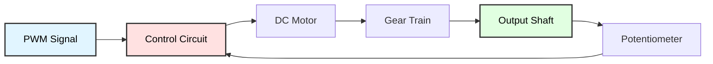

# Servo Motor Control with PWM
## ATmega128 Embedded Systems Course

**Reference**: [ATmega128 Datasheet](https://ww1.microchip.com/downloads/en/DeviceDoc/doc2467.pdf)

---

## Slide 1: Introduction to Servo Motors

### What is a Servo Motor?
- **Position-controlled** motor (not speed-controlled)
- **Built-in feedback** system with potentiometer
- **PWM-controlled** angle (typically 0-180°)
- Common in **robotics, RC models, automation**

### Servo Motor Components


### Servo Motor Characteristics
```
Typical Specifications (e.g., SG90):
- Operating Voltage: 4.8V - 6V
- Stall Torque: 1.8 kg·cm @ 4.8V
- Operating Speed: 0.1 s/60° @ 4.8V
- Rotation: 0° to 180° (±90° from center)
- Pulse Width: 1ms to 2ms (center: 1.5ms)
- PWM Period: 20ms (50 Hz)
```

### PWM Signal for Servo Control
```
     ┌─┐                   ┌─┐
     │ │                   │ │
  ───┘ └───────────────────┘ └───
     
     └─┬─┘                       
   Pulse Width              Period (20ms)
  
  1.0ms  → 0°   (full left)
  1.5ms  → 90°  (center)
  2.0ms  → 180° (full right)
```

---

## Slide 2: Hardware Connection

### Servo Pinout
```
Servo Wire Colors (standard):
┌────────────┐
│  Brown/Black  │ ← GND
│  Red          │ ← VCC (4.8-6V)
│  Orange/Yellow│ ← PWM Signal
└────────────┘

Note: Power servo from separate 5-6V supply
      NOT from ATmega128's 5V pin (insufficient current)
```

### Wiring Diagram
```
ATmega128           Servo Motor
---------           -----------
PB5 (OC1A)   ────→  PWM Signal (Orange)
GND          ────→  GND (Brown)

External 5V Supply
------------------
+5V          ────→  VCC (Red)
GND          ────┬→  GND (Brown)
                 └→  ATmega128 GND (common ground!)
```

### Multiple Servos
```c
// Can control multiple servos with different OC pins

PB5 (OC1A) → Servo 1 (Pan)
PB6 (OC1B) → Servo 2 (Tilt)
PB7 (OC1C) → Servo 3 (Gripper)

// Or use software PWM for more servos
```

---

## Slide 3: Timer1 PWM Configuration

### Initialize Timer1 for Servo Control
```c
#include <avr/io.h>

// PWM constants for servo
#define SERVO_MIN  1000   // 1ms  = 0°
#define SERVO_MID  1500   // 1.5ms = 90°
#define SERVO_MAX  2000   // 2ms  = 180°

void servo_init(void) {
    // Set PB5 (OC1A) as output
    DDRB |= (1 << PB5);
    
    /*
     * Timer1 Configuration:
     * - Mode 14: Fast PWM, TOP = ICR1
     * - Prescaler: 8
     * - Non-inverting mode on OC1A
     * 
     * F_PWM = F_CPU / (Prescaler × (1 + TOP))
     * 50 Hz = 16MHz / (8 × (1 + 39999))
     * TOP = 39999 (gives exactly 20ms period)
     */
    
    // Set TOP value for 20ms period
    ICR1 = 39999;  // (16MHz / 8) / 50Hz - 1
    
    // Timer1 Control Register A:
    // COM1A1:0 = 10 (Clear OC1A on compare match, non-inverting)
    // WGM11:0 = 10 (part of Mode 14)
    TCCR1A = (1 << WGM11) | (1 << COM1A1);
    
    // Timer1 Control Register B:
    // WGM13:2 = 11 (part of Mode 14)
    // CS12:0 = 010 (prescaler = 8)
    TCCR1B = (1 << WGM13) | (1 << WGM12) | (1 << CS11);
    
    // Set initial position to center
    OCR1A = SERVO_MID;
}
```

---

## Slide 4: Servo Position Control

### Set Servo Angle
```c
void servo_set_angle(uint8_t angle) {
    // Clamp angle to 0-180°
    if (angle > 180) angle = 180;
    
    // Map angle to pulse width (1000-2000 µs)
    uint16_t pulse = SERVO_MIN + ((uint32_t)(SERVO_MAX - SERVO_MIN) * angle) / 180;
    
    // Set compare value
    OCR1A = pulse;
}

// Alternative: Set pulse width directly
void servo_set_pulse(uint16_t pulse_us) {
    // Clamp to safe range
    if (pulse_us < 500) pulse_us = 500;
    if (pulse_us > 2500) pulse_us = 2500;
    
    OCR1A = pulse_us;
}

// Example usage
int main(void) {
    servo_init();
    
    while (1) {
        // Sweep from 0° to 180°
        for (uint8_t angle = 0; angle <= 180; angle++) {
            servo_set_angle(angle);
            _delay_ms(15);
        }
        
        _delay_ms(500);
        
        // Sweep back from 180° to 0°
        for (uint8_t angle = 180; angle > 0; angle--) {
            servo_set_angle(angle);
            _delay_ms(15);
        }
        
        _delay_ms(500);
    }
}
```

---

## Slide 5: Controlling Multiple Servos

### Two Servos (Pan-Tilt)
```c
void servo_init_dual(void) {
    // PB5 (OC1A) = Pan servo
    // PB6 (OC1B) = Tilt servo
    DDRB |= (1 << PB5) | (1 << PB6);
    
    ICR1 = 39999;  // 20ms period
    
    // Configure OC1A and OC1B for non-inverting PWM
    TCCR1A = (1 << WGM11) | (1 << COM1A1) | (1 << COM1B1);
    TCCR1B = (1 << WGM13) | (1 << WGM12) | (1 << CS11);
    
    // Set both to center
    OCR1A = SERVO_MID;
    OCR1B = SERVO_MID;
}

void servo_set_pan(uint8_t angle) {
    if (angle > 180) angle = 180;
    OCR1A = SERVO_MIN + ((uint32_t)(SERVO_MAX - SERVO_MIN) * angle) / 180;
}

void servo_set_tilt(uint8_t angle) {
    if (angle > 180) angle = 180;
    OCR1B = SERVO_MIN + ((uint32_t)(SERVO_MAX - SERVO_MIN) * angle) / 180;
}

// Example: Pan-Tilt control
int main(void) {
    servo_init_dual();
    
    while (1) {
        // Scan horizontally
        for (uint8_t pan = 0; pan <= 180; pan += 10) {
            servo_set_pan(pan);
            _delay_ms(100);
        }
        
        // Tilt up/down
        servo_set_tilt(45);
        _delay_ms(500);
        servo_set_tilt(135);
        _delay_ms(500);
        servo_set_tilt(90);
    }
}
```

---

## Slide 6: Smooth Movement

### Linear Interpolation
```c
uint16_t current_pulse = SERVO_MID;

void servo_move_smooth(uint16_t target_pulse, uint16_t duration_ms) {
    uint16_t start = current_pulse;
    uint32_t start_time = millis();
    
    while (millis() - start_time < duration_ms) {
        uint32_t elapsed = millis() - start_time;
        
        // Linear interpolation
        current_pulse = start + ((target_pulse - start) * elapsed) / duration_ms;
        
        OCR1A = current_pulse;
        _delay_ms(10);
    }
    
    current_pulse = target_pulse;
    OCR1A = target_pulse;
}

void servo_move_angle_smooth(uint8_t target_angle, uint16_t duration_ms) {
    uint16_t target = SERVO_MIN + ((uint32_t)(SERVO_MAX - SERVO_MIN) * target_angle) / 180;
    servo_move_smooth(target, duration_ms);
}

// Usage
servo_move_angle_smooth(0, 1000);    // Move to 0° in 1 second
_delay_ms(500);
servo_move_angle_smooth(180, 1000);  // Move to 180° in 1 second
```

### Speed Control
```c
#define SERVO_SPEED_SLOW   5   // degrees per step
#define SERVO_SPEED_MEDIUM 10
#define SERVO_SPEED_FAST   20

void servo_move_at_speed(uint8_t target_angle, uint8_t speed) {
    uint8_t current_angle = ((OCR1A - SERVO_MIN) * 180) / (SERVO_MAX - SERVO_MIN);
    
    if (current_angle < target_angle) {
        // Move forward
        while (current_angle < target_angle) {
            current_angle += speed;
            if (current_angle > target_angle) current_angle = target_angle;
            
            servo_set_angle(current_angle);
            _delay_ms(50);
        }
    } else {
        // Move backward
        while (current_angle > target_angle) {
            current_angle -= speed;
            if (current_angle < target_angle) current_angle = target_angle;
            
            servo_set_angle(current_angle);
            _delay_ms(50);
        }
    }
}
```

---

## Slide 7: Application - Joystick Control

### Joystick-Controlled Servo
```c
#include "_adc.h"

#define JOY_X_CHANNEL 0
#define JOY_Y_CHANNEL 1

void servo_joystick_control(void) {
    servo_init_dual();
    adc_init();
    
    while (1) {
        // Read joystick
        uint16_t joy_x = adc_read(JOY_X_CHANNEL);
        uint16_t joy_y = adc_read(JOY_Y_CHANNEL);
        
        // Map ADC (0-1023) to servo angle (0-180)
        uint8_t pan = (joy_x * 180) / 1023;
        uint8_t tilt = (joy_y * 180) / 1023;
        
        // Set servo positions
        servo_set_pan(pan);
        servo_set_tilt(tilt);
        
        _delay_ms(20);
    }
}
```

---

## Slide 8: Application - Robotic Arm

### Simple 3-DOF Arm
```c
typedef struct {
    uint8_t base;      // 0-180°
    uint8_t shoulder;  // 0-180°
    uint8_t elbow;     // 0-180°
} arm_position_t;

arm_position_t arm_pos = {90, 90, 90};

void arm_init(void) {
    // Use Timer1 for 3 servos (OC1A, OC1B, OC1C)
    DDRB |= (1 << PB5) | (1 << PB6) | (1 << PB7);
    
    ICR1 = 39999;
    TCCR1A = (1 << WGM11) | (1 << COM1A1) | (1 << COM1B1) | (1 << COM1C1);
    TCCR1B = (1 << WGM13) | (1 << WGM12) | (1 << CS11);
    
    // Initialize to home position
    arm_set_position(&arm_pos);
}

void arm_set_position(arm_position_t *pos) {
    // Clamp angles
    if (pos->base > 180) pos->base = 180;
    if (pos->shoulder > 180) pos->shoulder = 180;
    if (pos->elbow > 180) pos->elbow = 180;
    
    // Calculate pulse widths
    uint16_t base_pulse = SERVO_MIN + ((uint32_t)(SERVO_MAX - SERVO_MIN) * pos->base) / 180;
    uint16_t shoulder_pulse = SERVO_MIN + ((uint32_t)(SERVO_MAX - SERVO_MIN) * pos->shoulder) / 180;
    uint16_t elbow_pulse = SERVO_MIN + ((uint32_t)(SERVO_MAX - SERVO_MIN) * pos->elbow) / 180;
    
    // Set servos
    OCR1A = base_pulse;
    OCR1B = shoulder_pulse;
    OCR1C = elbow_pulse;
}

// Predefined poses
void arm_pose_home(void) {
    arm_pos.base = 90;
    arm_pos.shoulder = 90;
    arm_pos.elbow = 90;
    arm_set_position(&arm_pos);
}

void arm_pose_reach(void) {
    arm_pos.base = 90;
    arm_pos.shoulder = 45;
    arm_pos.elbow = 135;
    arm_set_position(&arm_pos);
}

void arm_pose_up(void) {
    arm_pos.base = 90;
    arm_pos.shoulder = 135;
    arm_pos.elbow = 45;
    arm_set_position(&arm_pos);
}

// Demo sequence
int main(void) {
    arm_init();
    
    while (1) {
        arm_pose_home();
        _delay_ms(2000);
        
        arm_pose_reach();
        _delay_ms(2000);
        
        arm_pose_up();
        _delay_ms(2000);
    }
}
```

---

## Slide 9: Application - Camera Gimbal

### 2-Axis Stabilized Camera Mount
```c
typedef struct {
    uint8_t pan;    // Horizontal rotation
    uint8_t tilt;   // Vertical tilt
} gimbal_t;

gimbal_t gimbal = {90, 90};

void gimbal_init(void) {
    servo_init_dual();
    
    // Start at center
    servo_set_pan(90);
    servo_set_tilt(90);
}

void gimbal_track_object(uint8_t object_x, uint8_t object_y) {
    // object_x, object_y: position in image (0-255)
    
    // Calculate error from center
    int16_t error_x = object_x - 128;
    int16_t error_y = object_y - 128;
    
    // Proportional control
    #define KP 0.1
    
    gimbal.pan += (int8_t)(error_x * KP);
    gimbal.tilt += (int8_t)(error_y * KP);
    
    // Clamp to limits
    if (gimbal.pan < 0) gimbal.pan = 0;
    if (gimbal.pan > 180) gimbal.pan = 180;
    if (gimbal.tilt < 45) gimbal.tilt = 45;    // Limit tilt
    if (gimbal.tilt > 135) gimbal.tilt = 135;
    
    // Apply to servos
    servo_set_pan(gimbal.pan);
    servo_set_tilt(gimbal.tilt);
}

// Smooth scanning pattern
void gimbal_scan(void) {
    // Horizontal scan
    for (uint8_t pan = 0; pan <= 180; pan += 5) {
        servo_set_pan(pan);
        _delay_ms(100);
        
        // Check for object at each position
        // (camera processing code here)
    }
    
    // Return to center
    servo_move_angle_smooth(90, 1000);
}
```

---

## Slide 10: Application - Door Lock Mechanism

### Servo-Based Lock
```c
#define LOCK_ANGLE    0     // Locked position
#define UNLOCK_ANGLE  90    // Unlocked position

typedef enum {
    LOCK_STATE_LOCKED,
    LOCK_STATE_UNLOCKED
} lock_state_t;

lock_state_t lock_state = LOCK_STATE_LOCKED;

void lock_init(void) {
    servo_init();
    lock_door();
}

void lock_door(void) {
    servo_move_angle_smooth(LOCK_ANGLE, 500);
    lock_state = LOCK_STATE_LOCKED;
    printf("Door LOCKED\n");
}

void unlock_door(void) {
    servo_move_angle_smooth(UNLOCK_ANGLE, 500);
    lock_state = LOCK_STATE_UNLOCKED;
    printf("Door UNLOCKED\n");
    
    // Auto-lock after 5 seconds
    _delay_ms(5000);
    lock_door();
}

// Password-controlled lock
void smart_lock(void) {
    char password[5];
    
    lock_init();
    keypad_init();
    lcd_init();
    
    while (1) {
        lcd_gotoxy(0, 0);
        lcd_puts("Enter PIN:");
        
        enter_password(password, 4);
        
        if (strcmp(password, "1234") == 0) {
            lcd_gotoxy(0, 1);
            lcd_puts("Access Granted ");
            unlock_door();
        } else {
            lcd_gotoxy(0, 1);
            lcd_puts("Access Denied  ");
            _delay_ms(2000);
        }
    }
}
```

---

## Slide 11: Calibration

### Why Calibrate?
- Servos have **mechanical variations**
- **Pulse width ranges** differ between models
- **Center position** may not be exactly 90°
- **End stops** may not align with 0° and 180°

### Calibration Procedure
```c
typedef struct {
    uint16_t min_pulse;    // Pulse for 0°
    uint16_t max_pulse;    // Pulse for 180°
    uint16_t center_pulse; // Pulse for 90°
} servo_cal_t;

servo_cal_t cal = {
    .min_pulse = 1000,
    .max_pulse = 2000,
    .center_pulse = 1500
};

void servo_calibrate(void) {
    printf("Servo Calibration\n");
    printf("-----------------\n");
    
    // Find minimum
    printf("Finding minimum position...\n");
    for (uint16_t pulse = 500; pulse <= 1500; pulse += 10) {
        OCR1A = pulse;
        _delay_ms(100);
        
        printf("Pulse: %d us  (press button at limit)\n", pulse);
        
        if (button_pressed()) {
            cal.min_pulse = pulse;
            break;
        }
    }
    
    _delay_ms(1000);
    
    // Find maximum
    printf("Finding maximum position...\n");
    for (uint16_t pulse = 1500; pulse <= 2500; pulse += 10) {
        OCR1A = pulse;
        _delay_ms(100);
        
        printf("Pulse: %d us  (press button at limit)\n", pulse);
        
        if (button_pressed()) {
            cal.max_pulse = pulse;
            break;
        }
    }
    
    // Calculate center
    cal.center_pulse = (cal.min_pulse + cal.max_pulse) / 2;
    
    printf("\nCalibration complete:\n");
    printf("Min:    %d us\n", cal.min_pulse);
    printf("Center: %d us\n", cal.center_pulse);
    printf("Max:    %d us\n", cal.max_pulse);
    
    // Save to EEPROM
    eeprom_write_block(&cal, (void*)0, sizeof(cal));
}

// Use calibrated values
void servo_set_angle_calibrated(uint8_t angle) {
    if (angle > 180) angle = 180;
    
    uint16_t pulse = cal.min_pulse + 
                     ((uint32_t)(cal.max_pulse - cal.min_pulse) * angle) / 180;
    
    OCR1A = pulse;
}
```

---

## Slide 12: Troubleshooting

### Common Issues

| Problem | Cause | Solution |
|---------|-------|----------|
| **Servo jitters** | Insufficient power | Use external 5-6V supply, add capacitor |
| **No movement** | Wrong PWM frequency | Verify 50 Hz (20ms period) |
| **Limited range** | Pulse width too narrow | Calibrate min/max pulses |
| **Servo burns out** | Stalled against obstruction | Add current limiting, timeout |
| **Erratic behavior** | Noise on signal line | Add 100Ω resistor, shorten wires |
| **Slow response** | PWM period too long | Verify Timer1 settings |

### Debugging Code
```c
void servo_test(void) {
    servo_init();
    uart_init();
    
    printf("Servo Test\n");
    printf("----------\n");
    
    // Test different pulse widths
    uint16_t pulses[] = {500, 1000, 1500, 2000, 2500};
    
    for (uint8_t i = 0; i < 5; i++) {
        printf("Pulse: %d us\n", pulses[i]);
        OCR1A = pulses[i];
        _delay_ms(2000);
    }
    
    // Sweep test
    printf("\nSweep test...\n");
    for (uint8_t angle = 0; angle <= 180; angle += 10) {
        printf("Angle: %d°\n", angle);
        servo_set_angle(angle);
        _delay_ms(500);
    }
}
```

---

## Slide 13: Best Practices

### Servo Control Guidelines

✓ **External power supply**
```c
// NEVER power servo from ATmega128's 5V pin!
// Use separate 5-6V supply with common ground
```

✓ **Add decoupling capacitor**
```c
// 100-470µF capacitor across servo power
// Prevents voltage drops during movement
```

✓ **Soft start**
```c
// Move to target gradually, not instantly
servo_move_smooth(target, 1000);  // 1 second transition
```

✓ **Limit PWM range**
```c
// Avoid extreme pulse widths (< 500µs or > 2500µs)
if (pulse < 500) pulse = 500;
if (pulse > 2500) pulse = 2500;
```

✓ **Disable when not in use**
```c
// Stop PWM to reduce power and jitter
TCCR1A &= ~(1 << COM1A1);  // Disconnect OC1A
```

✓ **Monitor current**
```c
// Servos draw 100-500mA when moving
// More when stalled → add overcurrent protection
```

---

## Slide 14: Summary

### Key Concepts

✓ **PWM control**: 1-2ms pulses at 50 Hz  
✓ **Position feedback**: Internal potentiometer  
✓ **Timer1 configuration**: Fast PWM mode, ICR1 = TOP  
✓ **Angle mapping**: 0-180° → 1000-2000µs  
✓ **Multiple servos**: Use OC1A, OC1B, OC1C  
✓ **Smooth movement**: Linear interpolation  
✓ **Calibration**: Adjust for mechanical variations  

### Applications
- Pan-tilt camera platforms
- Robotic arms and grippers
- Door locks and actuators
- RC vehicles (steering)
- Animatronics
- Solar panel tracking

### Timer1 PWM Summary
```
Mode: Fast PWM (Mode 14)
TOP: ICR1 = 39999 (20ms period @ 16MHz/8)
OCR1A/B/C: 1000-2000 (1-2ms pulse width)
Frequency: 50 Hz
Resolution: 0.5µs per count
```

---

## Slide 15: Practice Exercises

### Exercise 1: Basic Servo Control
**Goal**: Control servo with buttons
- Initialize Timer1 PWM
- Set servo to 0°, 90°, 180°
- Use buttons to control position
- Display angle on LCD

### Exercise 2: Smooth Sweeping
**Goal**: Create smooth servo movements
- Implement linear interpolation
- Sweep from 0° to 180° in 2 seconds
- Add ease-in/ease-out acceleration
- Display position in real-time

### Exercise 3: Pan-Tilt with Joystick
**Goal**: Control 2 servos with joystick
- Read analog joystick X and Y
- Map to pan (0-180°) and tilt (0-180°)
- Implement deadzone at center
- Add smoothing filter

### Exercise 4: Robotic Gripper
**Goal**: Build servo-controlled gripper
- Use 1 servo for open/close
- Map pressure sensor to grip strength
- Add open/close buttons
- Display state on LCD

### Exercise 5: Automated Door Lock
**Goal**: Password-controlled lock
- Use servo as lock mechanism
- Keypad for PIN entry
- LCD feedback
- Auto-lock after timeout

---

## Slide 16: Additional Resources

### ATmega128 Documentation
- **[Official Datasheet (PDF)](https://ww1.microchip.com/downloads/en/DeviceDoc/doc2467.pdf)**
  - Section 15: 16-bit Timer/Counter1
  - PWM modes and configuration
  - Output Compare Units

### Servo Motor Resources
- Servo motor datasheets (SG90, MG996R, etc.)
- PWM signal specifications
- Torque and speed characteristics
- Power requirements

### Control Algorithms
- PID control for servos
- Inverse kinematics for robotic arms
- Trajectory planning
- Smooth motion profiles

### Applications
- Pan-tilt mechanisms
- Robotic arm design
- Camera stabilization
- RC servo applications

---

# End of Slides

**Questions?**

For more information, see:
- [ATmega128 Datasheet](https://ww1.microchip.com/downloads/en/DeviceDoc/doc2467.pdf)
- Project source code in `PWM_Motor_Servo/`
- Shared libraries: `_servo.h`, `_servo.c`
