# Timer Programming for ATmega128
## Embedded Systems Course

**Reference**: [ATmega128 Datasheet](https://ww1.microchip.com/downloads/aemDocuments/documents/OTH/ProductDocuments/DataSheets/2467S.pdf)

---

## Slide 1: Introduction to Timers

### What is a Timer?
- **Hardware peripheral** that counts clock pulses
- Operates **independently** of CPU execution
- Provides precise timing for:
  - Delays
  - Event counting
  - Waveform generation (PWM)
  - Time measurement

### Why Use Timers?
✓ **Accurate timing** without blocking CPU  
✓ **Low power consumption** - CPU can sleep  
✓ **Multitasking** - handle multiple time-based events  
✓ **Precise PWM** for motor control, LED dimming  

---

## Slide 2: ATmega128 Timer Overview

### Timer Resources
The ATmega128 has **4 timer/counter units**:

| Timer | Type | Bit Width | Features |
|-------|------|-----------|----------|
| **Timer0** | 8-bit | 8 bits | Simple, PWM capable |
| **Timer1** | 16-bit | 16 bits | Advanced, Input Capture, 3 compare channels |
| **Timer2** | 8-bit | 8 bits | Asynchronous operation (RTC) |
| **Timer3** | 16-bit | 16 bits | Same as Timer1 |

### Timer System Architecture
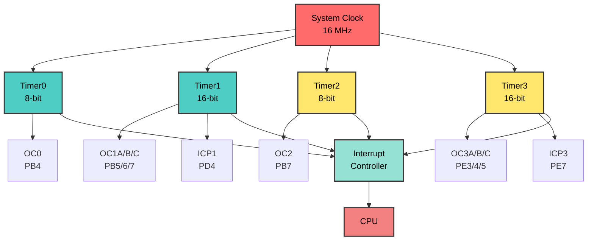

### Common Applications
- **Timer0/2**: Simple delays, basic PWM
- **Timer1/3**: Servo control, frequency measurement, advanced PWM

---

## Slide 3: Timer Operation Modes

### Basic Operation
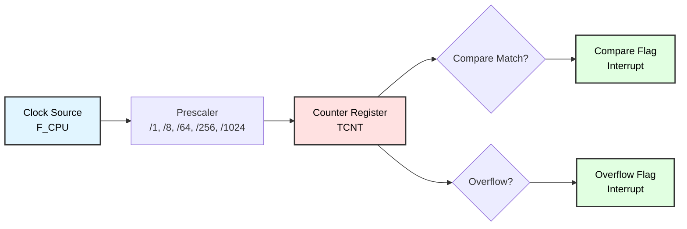

### Operating Modes (All Timers)
1. **Normal Mode** - Count up, overflow at MAX
2. **CTC (Clear Timer on Compare)** - Count up, clear at compare match
3. **Fast PWM** - Count up, fast PWM generation
4. **Phase Correct PWM** - Count up/down, symmetric PWM

### Mode Selection
Controlled by **Waveform Generation Mode (WGM)** bits

---

## Slide 4: Clock Sources and Prescaler

### Clock Source Options
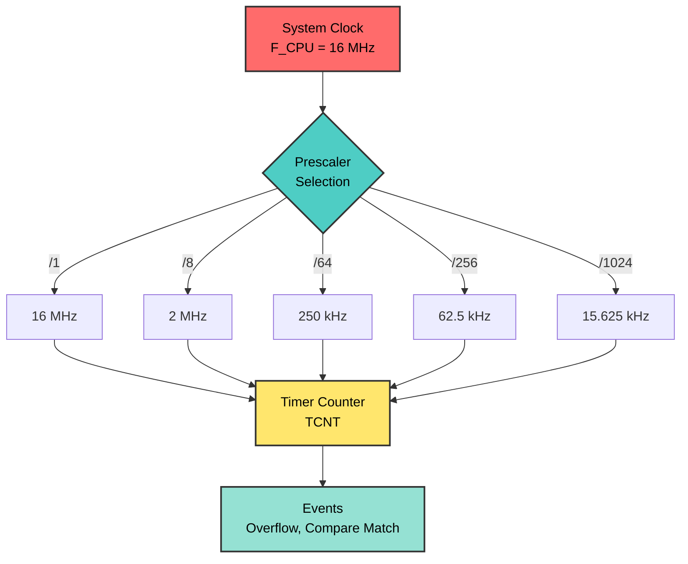

### Prescaler Values
Divides the system clock to slow down counting:

| Prescaler | Timer0/1/3 | Timer2 |
|-----------|------------|--------|
| OFF | 0 | 0 |
| /1 | CLK | CLK |
| /8 | CLK/8 | CLK/8 |
| /64 | CLK/64 | CLK/32 |
| /256 | CLK/256 | CLK/64 |
| /1024 | CLK/1024 | CLK/128 |

**Formula**: Timer Frequency = F_CPU / Prescaler

---

## Slide 5: Timer0 Architecture (8-bit)

### Block Diagram
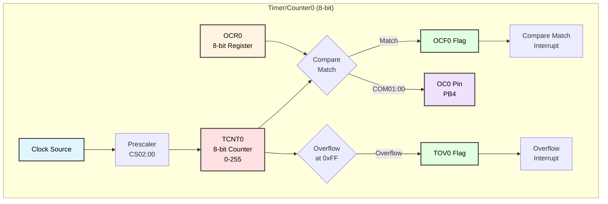

### Key Registers
- **TCNT0** - Counter value (0-255)
- **OCR0** - Output Compare Register
- **TCCR0** - Timer Control Register

---

## Slide 6: Timer0 Control Register (TCCR0)

### Register Layout
```
Bit     7      6      5      4      3      2      1      0
      ┌──────┬──────┬──────┬──────┬──────┬──────┬──────┬──────┐
TCCR0 │ FOC0 │ WGM00│ COM01│ COM00│ WGM01│ CS02 │ CS01 │ CS00 │
      └──────┴──────┴──────┴──────┴──────┴──────┴──────┴──────┘
```

### Bit Functions

| Bits | Name | Function |
|------|------|----------|
| **CS02:00** | Clock Select | Prescaler configuration |
| **WGM01:00** | Waveform Gen Mode | Operating mode selection |
| **COM01:00** | Compare Output Mode | OC0 pin behavior |
| **FOC0** | Force Output Compare | Manual compare match trigger |

### Clock Select (CS02:00)
```
000 = No clock (timer stopped)
001 = CLK/1 (no prescaling)
010 = CLK/8
011 = CLK/64
100 = CLK/256
101 = CLK/1024
110 = External clock (falling edge)
111 = External clock (rising edge)
```

---

## Slide 7: Timer0 Waveform Generation Modes

### Mode Configuration (WGM01:00)

| WGM01 | WGM00 | Mode | Description | TOP | Update OCR0 |
|-------|-------|------|-------------|-----|-------------|
| 0 | 0 | **Normal** | Count to 0xFF | 0xFF | Immediate |
| 0 | 1 | **Phase Correct PWM** | Count up/down | 0xFF | TOP |
| 1 | 0 | **CTC** | Clear on compare | OCR0 | Immediate |
| 1 | 1 | **Fast PWM** | Count to 0xFF | 0xFF | BOTTOM |

### Visual Representation
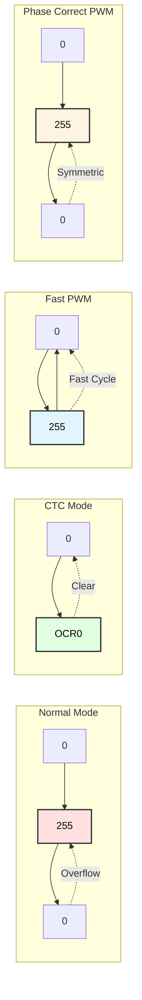

---

## Slide 8: Timer0 Interrupt Flags (TIFR)

### Register Layout
```
Bit     7      6      5      4      3      2      1      0
      ┌──────┬──────┬──────┬──────┬──────┬──────┬──────┬──────┐
TIFR  │ OCF2 │ TOV2 │ ICF1 │ OCF1A│ OCF1B│ TOV1 │ OCF0 │ TOV0 │
      └──────┴──────┴──────┴──────┴──────┴──────┴──────┴──────┘
                                                    ↑      ↑
                                              Timer0 Flags
```

### Timer0 Flags
- **TOV0 (Bit 0)** - Timer0 Overflow Flag
  - Set when TCNT0 overflows (0xFF → 0x00)
  - Cleared by writing 1 or by ISR execution
  
- **OCF0 (Bit 1)** - Output Compare Flag 0
  - Set when TCNT0 = OCR0
  - Cleared by writing 1 or by ISR execution

---

## Slide 9: Timer0 Interrupt Enable (TIMSK)

### Register Layout
```
Bit     7      6      5      4      3      2      1      0
      ┌──────┬──────┬──────┬──────┬──────┬──────┬──────┬──────┐
TIMSK │ OCIE2│ TOIE2│ TICIE1│OCIE1A│OCIE1B│ TOIE1│ OCIE0│ TOIE0│
      └──────┴──────┴──────┴──────┴──────┴──────┴──────┴──────┘
                                                    ↑      ↑
                                              Timer0 Enables
```

### Timer0 Interrupt Enables
- **TOIE0 (Bit 0)** - Timer0 Overflow Interrupt Enable
  - Enables interrupt on overflow
  - ISR: `TIMER0_OVF_vect`
  
- **OCIE0 (Bit 1)** - Output Compare Interrupt Enable 0
  - Enables interrupt on compare match
  - ISR: `TIMER0_COMP_vect`

---

## Slide 10: Timer1/3 Architecture (16-bit)

### Block Diagram
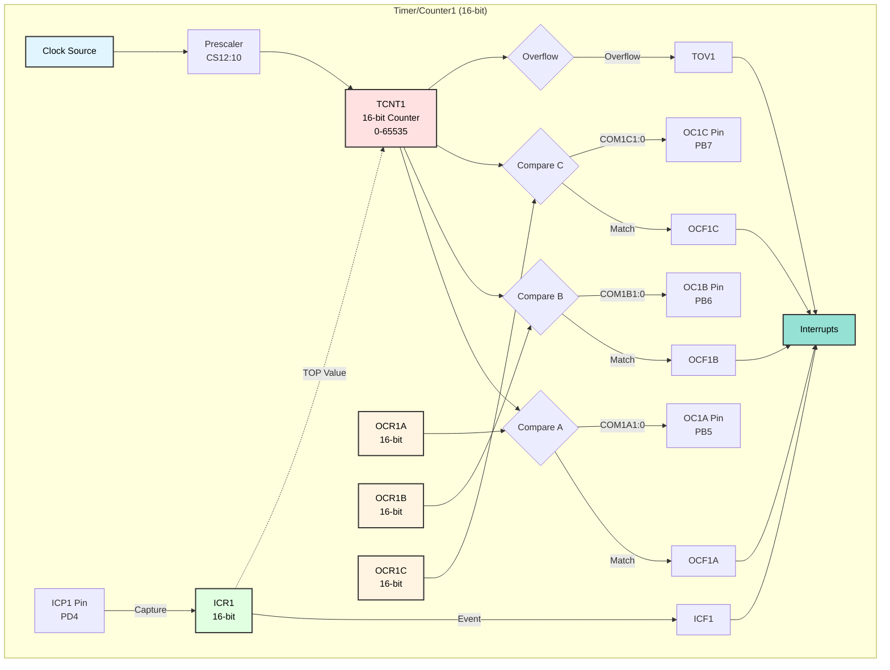

---

## Slide 11: Timer1 Control Registers

### TCCR1A - Timer/Counter1 Control Register A
```
Bit     7      6      5      4      3      2      1      0
      ┌──────┬──────┬──────┬──────┬──────┬──────┬──────┬──────┐
TCCR1A│COM1A1│COM1A0│COM1B1│COM1B0│COM1C1│COM1C0│WGM11 │WGM10 │
      └──────┴──────┴──────┴──────┴──────┴──────┴──────┴──────┘
```

### TCCR1B - Timer/Counter1 Control Register B
```
Bit     7      6      5      4      3      2      1      0
      ┌──────┬──────┬──────┬──────┬──────┬──────┬──────┬──────┐
TCCR1B│ ICNC1│ ICES1│  -   │WGM13 │WGM12 │ CS12 │ CS11 │ CS10 │
      └──────┴──────┴──────┴──────┴──────┴──────┴──────┴──────┘
```

### TCCR1C - Timer/Counter1 Control Register C
```
Bit     7      6      5      4      3      2      1      0
      ┌──────┬──────┬──────┬──────┬──────┬──────┬──────┬──────┐
TCCR1C│ FOC1A│ FOC1B│ FOC1C│  -   │  -   │  -   │  -   │  -   │
      └──────┴──────┴──────┴──────┴──────┴──────┴──────┴──────┘
```

---

## Slide 12: Timer1 Waveform Generation Modes

### Mode Selection (WGM13:10)

| Mode | WGM13:10 | Name | TOP | Update OCR1x | TOV1 Flag |
|------|----------|------|-----|--------------|-----------|
| 0 | 0000 | Normal | 0xFFFF | Immediate | MAX |
| 4 | 0100 | CTC | OCR1A | Immediate | MAX |
| 12 | 1100 | CTC | ICR1 | Immediate | MAX |
| 5 | 0101 | Fast PWM (8-bit) | 0x00FF | BOTTOM | TOP |
| 6 | 0110 | Fast PWM (9-bit) | 0x01FF | BOTTOM | TOP |
| 7 | 0111 | Fast PWM (10-bit) | 0x03FF | BOTTOM | TOP |
| 14 | 1110 | Fast PWM | ICR1 | BOTTOM | TOP |
| 15 | 1111 | Fast PWM | OCR1A | BOTTOM | TOP |

### Common Modes
- **Mode 0**: Simple counting/timing
- **Mode 4**: Precise frequency generation
- **Mode 14**: Variable frequency PWM (servo control)

---

## Slide 13: Timer1 Compare Output Modes

### COM1A1:0, COM1B1:0, COM1C1:0

#### Non-PWM Modes
| COM1x1 | COM1x0 | Description |
|--------|--------|-------------|
| 0 | 0 | Normal port operation, OC1x disconnected |
| 0 | 1 | Toggle OC1x on compare match |
| 1 | 0 | Clear OC1x on compare match |
| 1 | 1 | Set OC1x on compare match |

#### Fast PWM Mode
| COM1x1 | COM1x0 | Description |
|--------|--------|-------------|
| 0 | 0 | Normal port operation |
| 1 | 0 | Clear on match, set at BOTTOM (non-inverting) |
| 1 | 1 | Set on match, clear at BOTTOM (inverting) |

#### Phase Correct PWM Mode
| COM1x1 | COM1x0 | Description |
|--------|--------|-------------|
| 0 | 0 | Normal port operation |
| 1 | 0 | Clear on up-count, set on down-count |
| 1 | 1 | Set on up-count, clear on down-count |

---

## Slide 14: Timer Calculations

### Basic Formulas

#### Overflow Frequency
```
F_overflow = F_CPU / (Prescaler × (TOP + 1))
```

#### Overflow Period
```
T_overflow = (Prescaler × (TOP + 1)) / F_CPU
```

#### CTC Mode Frequency
```
F_CTC = F_CPU / (2 × Prescaler × (OCR + 1))
```

### Example Calculation
**Goal**: 1 Hz (1 second) interrupt with F_CPU = 16 MHz, Timer1

```
Required counts = F_CPU / (Prescaler × Frequency)
                = 16,000,000 / (256 × 1)
                = 62,500

Use: Prescaler = 256, OCR1A = 62,499
```

---

## Slide 15: PWM Generation

### Fast PWM Principle
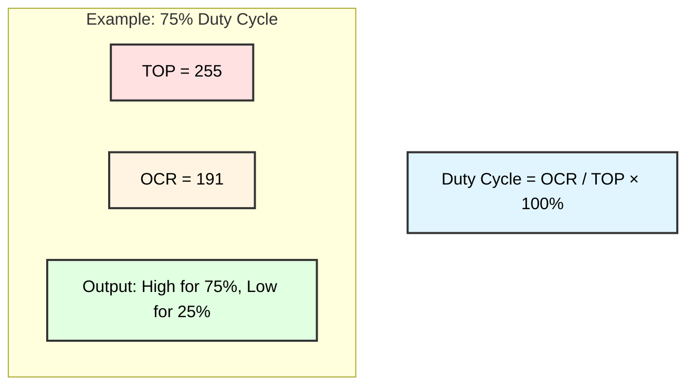

### Fast PWM Waveform
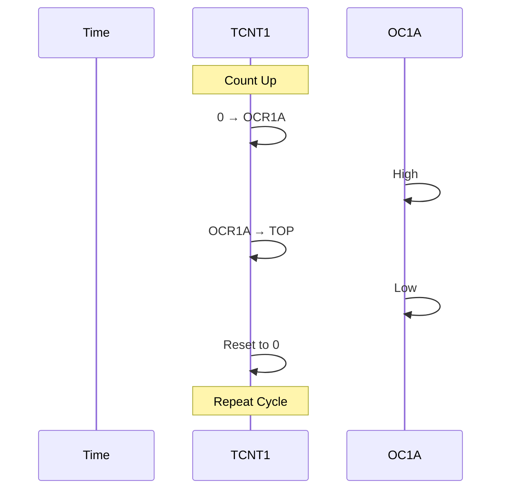

### Timing Diagram
```mermaid
gantt
    title Fast PWM Cycle (Duty = 60%)
    dateFormat X
    axisFormat %L
    
    section Counter
    Count 0-OCR   :0, 60
    Count OCR-TOP :60, 40
    
    section Output
    High          :0, 60
    Low           :60, 40
```

### PWM Frequency
```
F_PWM = F_CPU / (Prescaler × (TOP + 1))
```

**Example**: 16 MHz / (1 × 256) = 62.5 kHz

---

## Slide 16: Practical Example - 1 Second Timer

### Code Example: Timer1 CTC Mode
```c
#include <avr/io.h>
#include <avr/interrupt.h>

void timer1_init(void) {
    // CTC mode, OCR1A as TOP
    TCCR1B |= (1 << WGM12);
    
    // Prescaler = 256
    TCCR1B |= (1 << CS12);
    
    // Set compare value for 1 Hz
    // F_CPU = 16MHz
    // OCR1A = (16,000,000 / 256 / 1) - 1 = 62,499
    OCR1A = 62499;
    
    // Enable compare match interrupt
    TIMSK |= (1 << OCIE1A);
    
    // Enable global interrupts
    sei();
}

// Interrupt Service Routine
ISR(TIMER1_COMPA_vect) {
    // This runs every 1 second
    PORTA ^= (1 << PA0);  // Toggle LED
}

int main(void) {
    DDRA |= (1 << PA0);   // Set PA0 as output
    timer1_init();
    
    while(1) {
        // Main loop can do other tasks
    }
    return 0;
}
```

---

## Slide 17: Practical Example - PWM Motor Control

### Code Example: 50 Hz Servo PWM
```c
#include <avr/io.h>

#define F_CPU 16000000UL

void timer1_pwm_init(void) {
    // Set OC1A as output (PB5)
    DDRB |= (1 << PB5);
    
    // Fast PWM, TOP = ICR1
    TCCR1A |= (1 << WGM11);
    TCCR1B |= (1 << WGM13) | (1 << WGM12);
    
    // Non-inverting mode on OC1A
    TCCR1A |= (1 << COM1A1);
    
    // Prescaler = 8
    TCCR1B |= (1 << CS11);
    
    // Set frequency to 50 Hz
    // ICR1 = F_CPU / (Prescaler × Frequency) - 1
    // ICR1 = 16,000,000 / (8 × 50) - 1 = 39,999
    ICR1 = 39999;
    
    // Set initial pulse width (1.5ms = neutral position)
    // OCR1A = (Pulse_width × F_CPU) / Prescaler
    // OCR1A = (0.0015 × 16,000,000) / 8 = 3000
    OCR1A = 3000;
}

void set_servo_angle(uint8_t angle) {
    // Map angle (0-180°) to pulse width (1-2ms)
    // 1ms = 2000, 2ms = 4000
    uint16_t pulse = 2000 + (angle * 2000UL / 180);
    OCR1A = pulse;
}

int main(void) {
    timer1_pwm_init();
    
    set_servo_angle(90);  // Move to center
    
    while(1) {
        // Servo position controlled by OCR1A
    }
    return 0;
}
```

---

## Slide 18: Input Capture Unit (Timer1/3)

### Input Capture Principle
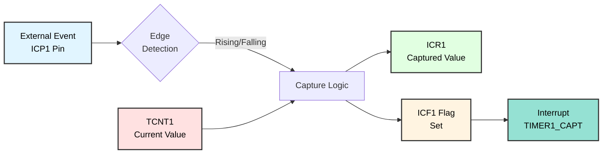

### Timing Diagram
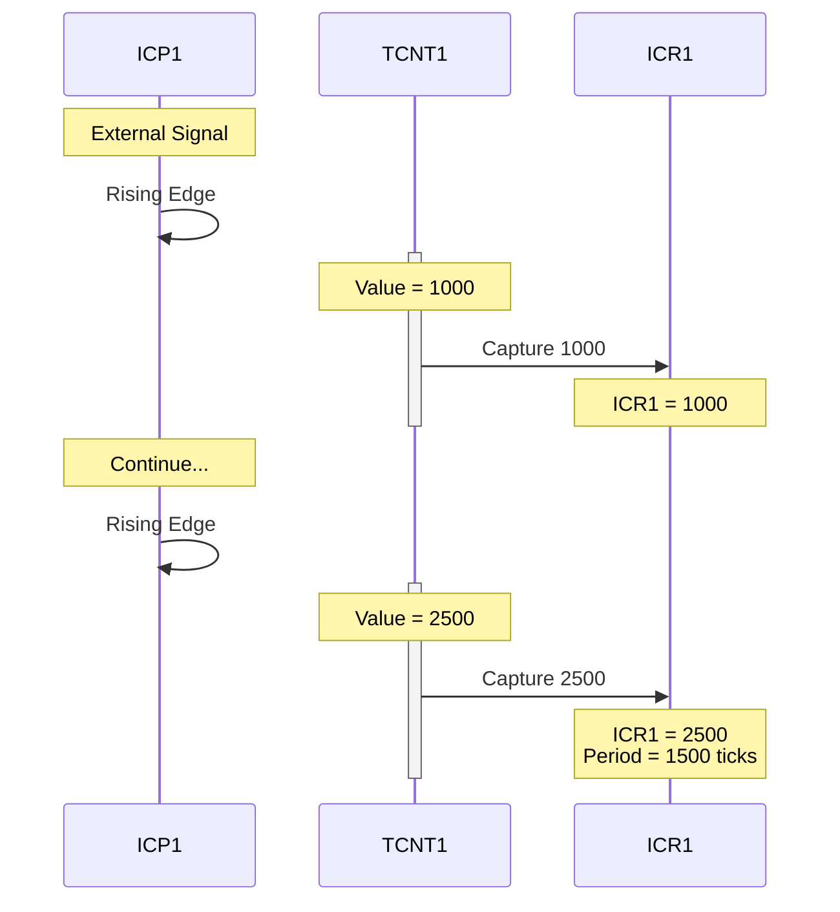

### Applications
- **Frequency measurement**
- **Pulse width measurement**
- **Event timestamping**
- **Encoder reading**

### Configuration
```c
// Enable input capture
TCCR1B |= (1 << ICES1);  // Capture on rising edge
// TCCR1B &= ~(1 << ICES1); // Capture on falling edge

// Enable noise canceler (optional)
TCCR1B |= (1 << ICNC1);

// Enable input capture interrupt
TIMSK |= (1 << TICIE1);
```

---

## Slide 19: Practical Example - Frequency Measurement

### Code Example: Measure External Signal
```c
#include <avr/io.h>
#include <avr/interrupt.h>

volatile uint16_t capture1 = 0;
volatile uint16_t capture2 = 0;
volatile uint8_t edge_count = 0;
volatile uint32_t frequency = 0;

void timer1_input_capture_init(void) {
    // Normal mode
    TCCR1A = 0;
    TCCR1B = 0;
    
    // Prescaler = 1
    TCCR1B |= (1 << CS10);
    
    // Capture on rising edge
    TCCR1B |= (1 << ICES1);
    
    // Enable noise canceler
    TCCR1B |= (1 << ICNC1);
    
    // Enable input capture interrupt
    TIMSK |= (1 << TICIE1);
    
    sei();
}

ISR(TIMER1_CAPT_vect) {
    if (edge_count == 0) {
        capture1 = ICR1;
        edge_count = 1;
    } else {
        capture2 = ICR1;
        
        // Calculate period (in timer ticks)
        uint16_t period = capture2 - capture1;
        
        // Calculate frequency
        // F = F_CPU / period
        frequency = (uint32_t)F_CPU / period;
        
        edge_count = 0;
    }
}

int main(void) {
    timer1_input_capture_init();
    
    while(1) {
        // frequency variable contains measured frequency
    }
    return 0;
}
```

---

## Slide 20: Timer Best Practices

### Design Guidelines

#### 1. Choose the Right Timer
- **8-bit (Timer0/2)**: Simple delays, basic PWM
- **16-bit (Timer1/3)**: Precise timing, servo control, frequency measurement

#### 2. Calculate Carefully
```c
// Use 32-bit arithmetic for large calculations
uint32_t ocr_value = ((uint32_t)F_CPU / (prescaler * frequency)) - 1;
OCR1A = (uint16_t)ocr_value;
```

#### 3. Atomic Access for 16-bit Registers
```c
// WRONG - Can be interrupted between bytes
uint16_t temp = TCNT1;

// RIGHT - Atomic read
uint16_t temp;
uint8_t sreg = SREG;
cli();
temp = TCNT1;
SREG = sreg;
```

#### 4. Clear Flags Before Enabling Interrupts
```c
TIFR |= (1 << TOV1);     // Clear flag
TIMSK |= (1 << TOIE1);   // Enable interrupt
```

---

## Slide 21: Common Timer Applications

### Application Summary

| Application | Timer | Mode | Prescaler | Registers |
|-------------|-------|------|-----------|-----------|
| **1 Second Delay** | Timer1 | CTC | 256 | OCR1A = 62499 |
| **1ms Interrupt** | Timer1 | CTC | 8 | OCR1A = 1999 |
| **LED PWM (1kHz)** | Timer0 | Fast PWM | 64 | OCR0 = 0-255 |
| **Servo Control (50Hz)** | Timer1 | Fast PWM | 8 | ICR1 = 39999 |
| **Frequency Counter** | Timer1 | Normal + IC | 1 | ICR1 (capture) |
| **Event Counter** | Timer0 | Normal | External | TCNT0 |

### Typical Frequencies
- **Servo PWM**: 50 Hz (20ms period)
- **LED PWM**: 500 Hz - 10 kHz
- **Audio PWM**: 20 kHz - 40 kHz
- **System Tick**: 100 Hz - 1 kHz

---

## Slide 22: Debugging Timer Issues

### Common Problems and Solutions

#### Problem 1: Timer Not Starting
```c
// Check clock select bits
TCCR1B |= (1 << CS10);  // Must set CS bits!
```

#### Problem 2: Interrupt Not Firing
```c
// Checklist:
TIMSK |= (1 << OCIE1A);  // ✓ Enable interrupt
sei();                    // ✓ Enable global interrupts
ISR(TIMER1_COMPA_vect) {} // ✓ Define ISR
```

#### Problem 3: Wrong Frequency
```c
// Verify calculation
uint32_t actual_freq = F_CPU / (prescaler * (OCR + 1));
// Use oscilloscope or logic analyzer to measure
```

#### Problem 4: Jittery PWM
```c
// Update OCR during correct phase
// Fast PWM: Update at BOTTOM (TOV flag)
// Phase Correct: Update at TOP
```

---

## Slide 23: Advanced Techniques

### 1. Timer Chaining
```c
// Use Timer0 overflow to increment software counter
volatile uint32_t millis_counter = 0;

ISR(TIMER0_OVF_vect) {
    millis_counter++;  // Overflows every 256 ticks
}

uint32_t get_millis(void) {
    uint32_t m;
    uint8_t sreg = SREG;
    cli();
    m = millis_counter;
    SREG = sreg;
    return m;
}
```

### 2. Phase-Locked PWM
```c
// Synchronize multiple timers for multi-phase output
GTCCR |= (1 << TSM);      // Halt all timers
GTCCR |= (1 << PSRSYNC);  // Reset prescalers
// Configure timers...
GTCCR &= ~(1 << TSM);     // Start synchronized
```

### 3. Dual-Slope PWM for Audio
```c
// Phase-correct PWM for lower noise
TCCR1A |= (1 << WGM11);
TCCR1A |= (1 << COM1A1);
TCCR1B |= (1 << CS10);
ICR1 = 255;  // 8-bit resolution
```

---

## Slide 24: Timer Register Quick Reference

### Timer0 (8-bit)
```
TCCR0  - Control Register
TCNT0  - Counter Value (0-255)
OCR0   - Output Compare Register
TIMSK  - Interrupt Mask (TOIE0, OCIE0)
TIFR   - Interrupt Flags (TOV0, OCF0)
```

### Timer1 (16-bit)
```
TCCR1A - Control Register A
TCCR1B - Control Register B
TCCR1C - Control Register C
TCNT1H/L - Counter Value (0-65535)
OCR1AH/L - Output Compare Register A
OCR1BH/L - Output Compare Register B
OCR1CH/L - Output Compare Register C
ICR1H/L  - Input Capture Register
TIMSK    - Interrupt Mask (TOIE1, OCIE1A/B/C, TICIE1)
TIFR     - Interrupt Flags (TOV1, OCF1A/B/C, ICF1)
```

### Timer2 (8-bit, Asynchronous)
```
TCCR2  - Control Register
TCNT2  - Counter Value (0-255)
OCR2   - Output Compare Register
ASSR   - Asynchronous Status Register
TIMSK  - Interrupt Mask (TOIE2, OCIE2)
TIFR   - Interrupt Flags (TOV2, OCF2)
```

---

## Slide 25: Practice Exercises

### Exercise 1: Basic Timer
**Goal**: Create a 500ms blinking LED using Timer1
- Use CTC mode
- Calculate OCR1A value
- Toggle LED in ISR

### Exercise 2: PWM Breathing LED
**Goal**: Create breathing effect (fade in/out)
- Use Fast PWM mode
- Vary duty cycle from 0-100%
- Update OCR value in main loop

### Exercise 3: Servo Sweep
**Goal**: Sweep servo from 0° to 180° and back
- 50 Hz PWM using Timer1
- Map angle to pulse width (1-2ms)
- Smooth movement

### Exercise 4: Frequency Meter
**Goal**: Measure frequency of external signal
- Input capture on ICP1 pin
- Calculate period between edges
- Display frequency in Hz

---

## Slide 26: Summary

### Key Takeaways

✓ **Timers** provide accurate, CPU-independent timing  
✓ **ATmega128** has 4 timers: two 8-bit, two 16-bit  
✓ **Modes**: Normal, CTC, Fast PWM, Phase Correct PWM  
✓ **Prescaler** divides clock for different time scales  
✓ **Interrupts** allow event-driven programming  
✓ **PWM** generates analog-like output for motor/LED control  
✓ **Input Capture** measures external events precisely  

### Timer Selection Guide
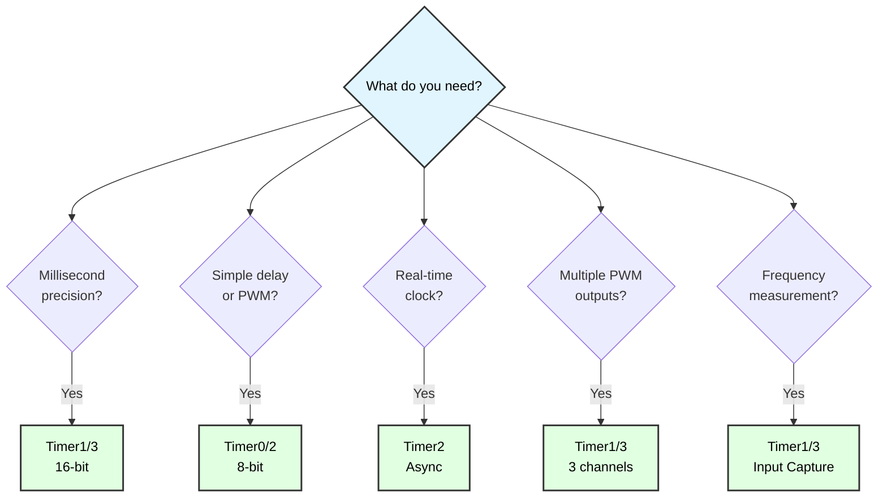

---

## Slide 27: Additional Resources

### ATmega128 Documentation
- **[Official Datasheet (PDF)](https://ww1.microchip.com/downloads/aemDocuments/documents/OTH/ProductDocuments/DataSheets/2467S.pdf)**
  - Section 15: 8-bit Timer/Counter0 with PWM
  - Section 16: 16-bit Timer/Counter1 and Timer/Counter3
  - Section 17: 8-bit Timer/Counter2 with PWM and Asynchronous Operation
  
- **Application Notes**:
  - AVR130: Setup and Use of AVR Timers
  - AVR131: Using Timer Capture to Measure PWM Duty Cycle

### Online Calculators
- Timer Calculator: `cticz.nl/avr-timer-calculator`
- PWM Frequency Calculator
- Prescaler selection tools

### Example Code Patterns
```c
// Basic delay loop replacement
void delay_ms(uint16_t ms);

// PWM duty cycle control
void set_pwm_duty(uint8_t percent);

// Frequency measurement
uint32_t measure_frequency(void);

// Software millisecond counter
uint32_t millis(void);
```

### Next Steps
- Implement timer library for common functions
- Combine timers with other peripherals (ADC, UART)
- Explore advanced PWM techniques
- Build real-time operating system (RTOS) tick

---

## Slide 28: Lab Exercise - Complete Project

### Project: Digital Tachometer (RPM Meter)

#### Requirements
1. Measure rotation speed using IR sensor
2. Display RPM on LCD
3. Update every 500ms
4. Handle 0-10,000 RPM range

#### Hardware Needed
- IR sensor on ICP1 pin (PD4)
- LCD display on PORTC
- ATmega128 @ 16 MHz

#### Implementation Hints
```c
// Timer1: Input capture for frequency measurement
// Timer0: 500ms update interval for display

// Calculate RPM:
// RPM = (60 × F_CPU) / (pulses_per_rev × period_ticks)

// Steps:
// 1. Initialize Timer1 for input capture
// 2. Initialize Timer0 for 500ms CTC interrupt
// 3. In IC ISR: capture timestamps, calculate period
// 4. In Timer0 ISR: update LCD with RPM value
// 5. Handle edge cases (zero speed, overflow)
```

**Bonus Challenge**: Add overspeed alarm using PWM buzzer!

---

# End of Slides

**Questions?**

For more information, see:
- [ATmega128 Datasheet](https://ww1.microchip.com/downloads/aemDocuments/documents/OTH/ProductDocuments/DataSheets/2467S.pdf)
- Project source code in `Timer_Programming/`
- Shared libraries: `_init.h`, `_interrupt.h`
