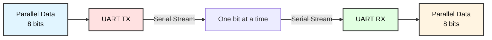
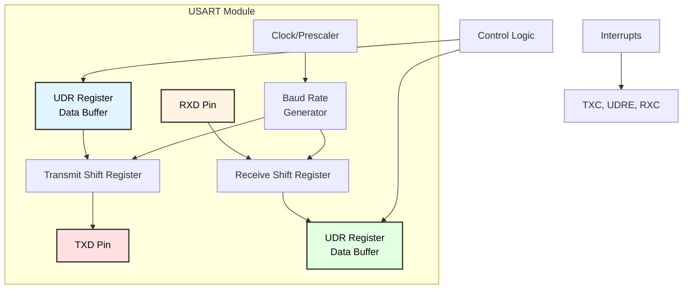
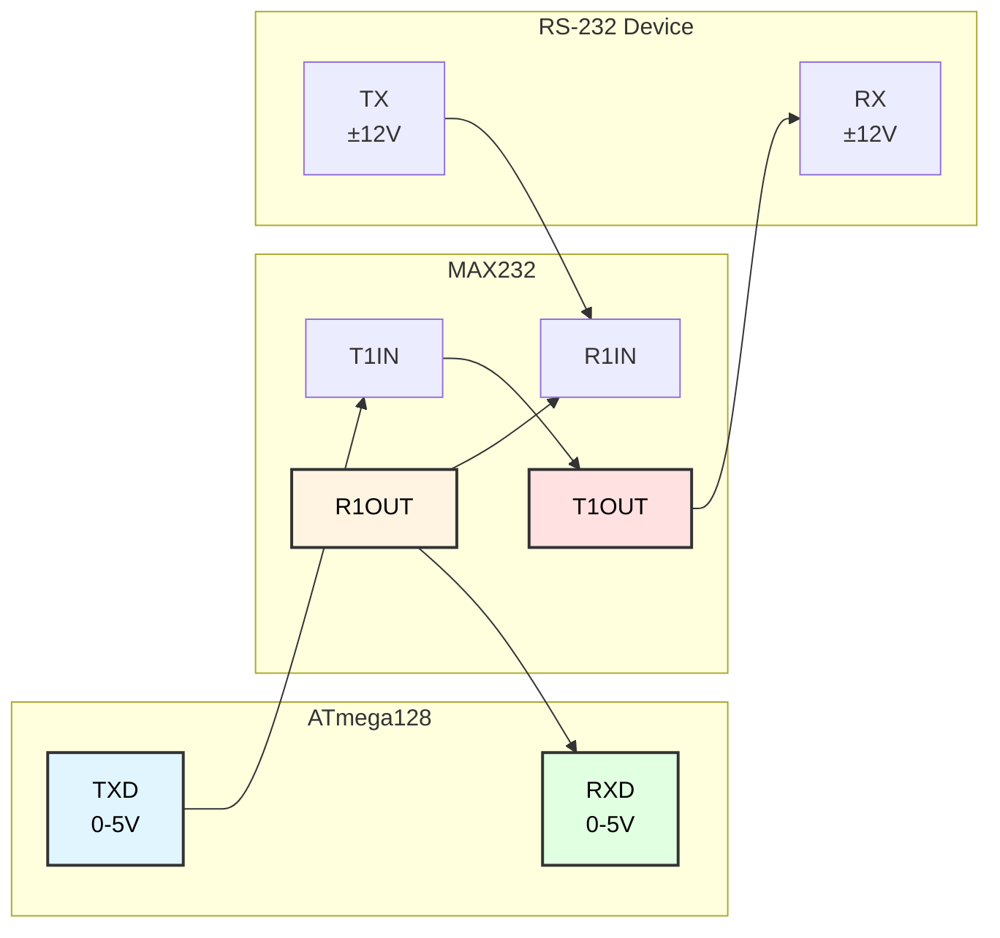
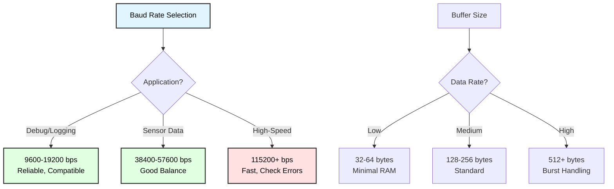

# Serial Communications (UART)
## ATmega128 Embedded Systems Course

**Reference**: [ATmega128 Datasheet](https://ww1.microchip.com/downloads/en/DeviceDoc/doc2467.pdf)

---

## Slide 1: Introduction to Serial Communication

### What is UART?
- **Universal Asynchronous Receiver/Transmitter**
- **Serial communication** protocol - sends data one bit at a time
- **Asynchronous** - no shared clock signal between devices
- Most common interface for microcontroller communication

### Why Use UART?
✓ **Simple** - Only 2 wires (TX, RX) + ground  
✓ **Universal** - Supported by almost all microcontrollers  
✓ **Flexible** - Configurable baud rate and format  
✓ **Long distance** - RS-232/RS-485 for industrial use  
✓ **PC communication** - USB-to-serial adapters  

### Common Applications
- PC debugging and data logging
- GPS module communication
- Bluetooth/WiFi module control
- Sensor data transmission
- Inter-microcontroller communication

---

## Slide 2: UART Communication Basics

### Serial Data Transmission


### Frame Format
```
     Start  D0  D1  D2  D3  D4  D5  D6  D7  Stop
Idle ─┐  ┌──┬──┬──┬──┬──┬──┬──┬──┬──────── Idle
      └──┘  Data bits (LSB first)
      
Common formats:
• 8N1: 8 data bits, No parity, 1 stop bit
• 8E1: 8 data bits, Even parity, 1 stop bit
• 8O1: 8 data bits, Odd parity, 1 stop bit
```

### Key Parameters
- **Baud Rate**: Bits per second (9600, 19200, 38400, 57600, 115200)
- **Data Bits**: Usually 5-9 bits (most common: 8)
- **Parity**: None, Even, or Odd
- **Stop Bits**: 1 or 2 bits

---

## Slide 3: ATmega128 UART Hardware

### UART Resources
ATmega128 has **2 USART** (Universal Synchronous/Asynchronous Receiver/Transmitter):

| USART | TX Pin | RX Pin | XCK Pin |
|-------|--------|--------|---------|
| **USART0** | PE1 (TXD0) | PE0 (RXD0) | PE2 (XCK0) |
| **USART1** | PD3 (TXD1) | PD2 (RXD1) | PD5 (XCK1) |

### Block Diagram


---

## Slide 4: UART Control Registers

### UCSRA - USART Control and Status Register A
```
Bit     7      6      5      4      3      2      1      0
      ┌──────┬──────┬──────┬──────┬──────┬──────┬──────┬──────┐
UCSRA │ RXC  │ TXC  │ UDRE │  FE  │  DOR │  PE  │ U2X  │ MPCM │
      └──────┴──────┴──────┴──────┴──────┴──────┴──────┴──────┘
```

| Bit | Name | Description |
|-----|------|-------------|
| **RXC** | RX Complete | Set when data received |
| **TXC** | TX Complete | Set when transmission complete |
| **UDRE** | Data Register Empty | Set when ready to send |
| **FE** | Frame Error | Framing error detected |
| **DOR** | Data OverRun | Data lost (not read in time) |
| **PE** | Parity Error | Parity check failed |
| **U2X** | Double Speed | Doubles USART transmission speed |
| **MPCM** | Multi-processor | Communication mode |

---

## Slide 5: UART Control Registers (continued)

### UCSRB - USART Control and Status Register B
```
Bit     7      6      5      4      3      2      1      0
      ┌──────┬──────┬──────┬──────┬──────┬──────┬──────┬──────┐
UCSRB │ RXCIE│ TXCIE│ UDRIE│ RXEN │ TXEN │UCSZ2 │ RXB8 │ TXB8 │
      └──────┴──────┴──────┴──────┴──────┴──────┴──────┴──────┘
```

| Bit | Name | Description |
|-----|------|-------------|
| **RXCIE** | RX Complete Interrupt Enable | Enable RX interrupt |
| **TXCIE** | TX Complete Interrupt Enable | Enable TX complete interrupt |
| **UDRIE** | Data Register Empty Interrupt | Enable TX ready interrupt |
| **RXEN** | Receiver Enable | Enable receiver |
| **TXEN** | Transmitter Enable | Enable transmitter |
| **UCSZ2** | Character Size bit 2 | With UCSZ1:0, sets data bits |
| **RXB8/TXB8** | 9th data bit | For 9-bit mode |

### UCSRC - USART Control and Status Register C
```
Bit     7      6      5      4      3      2      1      0
      ┌──────┬──────┬──────┬──────┬──────┬──────┬──────┬──────┐
UCSRC │URSEL │ UMSEL│ UPM1 │ UPM0 │ USBS │UCSZ1 │UCSZ0 │ UCPOL│
      └──────┴──────┴──────┴──────┴──────┴──────┴──────┴──────┘
```

---

## Slide 6: Baud Rate Configuration

### Baud Rate Calculation
```
UBRR = (F_CPU / (16 × BAUD)) - 1     // Normal mode
UBRR = (F_CPU / (8 × BAUD)) - 1      // Double speed mode (U2X=1)
```

### UBRR - USART Baud Rate Register (16-bit)
```
UBRRH (High byte) : UBRRL (Low byte)
```

### Common Baud Rates @ 16 MHz

| Baud Rate | UBRR (U2X=0) | UBRR (U2X=1) | Error % |
|-----------|--------------|--------------|---------|
| 2400 | 416 | 832 | 0.0 |
| 4800 | 207 | 416 | 0.0 |
| 9600 | 103 | 207 | 0.0 |
| 14400 | 68 | 138 | 0.0 |
| 19200 | 51 | 103 | 0.0 |
| 38400 | 25 | 51 | 0.0 |
| 57600 | 16 | 34 | 2.1 / 0.0 |
| 115200 | 8 | 16 | -3.5 / 2.1 |

---

## Slide 7: UART Initialization

### Basic UART Setup
```c
#include <avr/io.h>
#define F_CPU 16000000UL
#define BAUD 9600
#define UBRR_VALUE ((F_CPU / (16UL * BAUD)) - 1)

void uart_init(void) {
    // Set baud rate
    UBRR0H = (uint8_t)(UBRR_VALUE >> 8);
    UBRR0L = (uint8_t)UBRR_VALUE;
    
    // Enable receiver and transmitter
    UCSR0B = (1 << RXEN0) | (1 << TXEN0);
    
    // Set frame format: 8 data bits, 1 stop bit, no parity
    UCSR0C = (1 << URSEL0) | (1 << UCSZ01) | (1 << UCSZ00);
}

// For USART1
void uart1_init(void) {
    UBRR1H = (uint8_t)(UBRR_VALUE >> 8);
    UBRR1L = (uint8_t)UBRR_VALUE;
    UCSR1B = (1 << RXEN1) | (1 << TXEN1);
    UCSR1C = (1 << URSEL1) | (1 << UCSZ11) | (1 << UCSZ10);
}
```

### Configuration Options
```c
// Double speed mode (better accuracy for some baud rates)
UCSR0A |= (1 << U2X0);
UBRR0 = (F_CPU / (8UL * BAUD)) - 1;

// 9-bit mode
UCSR0C |= (1 << UCSZ02) | (1 << UCSZ01) | (1 << UCSZ00);

// Even parity
UCSR0C |= (1 << UPM01);

// 2 stop bits
UCSR0C |= (1 << USBS0);
```

---

## Slide 8: Transmitting Data

### Sending a Single Character
```c
void uart_putc(char c) {
    // Wait for empty transmit buffer
    while (!(UCSR0A & (1 << UDRE0)));
    
    // Put data into buffer, sends the data
    UDR0 = c;
}

// With timeout
uint8_t uart_putc_timeout(char c, uint16_t timeout) {
    uint16_t count = 0;
    
    while (!(UCSR0A & (1 << UDRE0))) {
        if (count++ > timeout) {
            return 0;  // Timeout
        }
        _delay_us(1);
    }
    
    UDR0 = c;
    return 1;  // Success
}
```

### Sending a String
```c
void uart_puts(const char *str) {
    while (*str) {
        uart_putc(*str++);
    }
}

// From program memory (Flash)
void uart_puts_P(const char *str) {
    char c;
    while ((c = pgm_read_byte(str++))) {
        uart_putc(c);
    }
}
```

---

## Slide 9: Receiving Data

### Receiving a Single Character
```c
char uart_getc(void) {
    // Wait for data to be received
    while (!(UCSR0A & (1 << RXC0)));
    
    // Get and return received data
    return UDR0;
}

// Non-blocking receive
int16_t uart_getc_nowait(void) {
    if (UCSR0A & (1 << RXC0)) {
        return UDR0;
    }
    return -1;  // No data available
}

// With error checking
uint16_t uart_getc_error(void) {
    uint8_t status, data;
    
    // Wait for data
    while (!(UCSR0A & (1 << RXC0)));
    
    // Get status and data
    status = UCSR0A;
    data = UDR0;
    
    // Check for errors
    if (status & ((1 << FE0) | (1 << DOR0) | (1 << PE0))) {
        return 0xFFFF;  // Error occurred
    }
    
    return data;
}
```

---

## Slide 10: Buffered Communication

### Circular Buffer Implementation
```c
#define UART_RX_BUFFER_SIZE 128
#define UART_TX_BUFFER_SIZE 128

// RX buffer
volatile char rx_buffer[UART_RX_BUFFER_SIZE];
volatile uint8_t rx_head = 0;
volatile uint8_t rx_tail = 0;

// TX buffer
volatile char tx_buffer[UART_TX_BUFFER_SIZE];
volatile uint8_t tx_head = 0;
volatile uint8_t tx_tail = 0;

void uart_init_buffered(void) {
    // Set baud rate
    UBRR0H = (uint8_t)(UBRR_VALUE >> 8);
    UBRR0L = (uint8_t)UBRR_VALUE;
    
    // Enable RX, TX, and RX interrupt
    UCSR0B = (1 << RXEN0) | (1 << TXEN0) | (1 << RXCIE0);
    
    // 8N1 format
    UCSR0C = (1 << URSEL0) | (1 << UCSZ01) | (1 << UCSZ00);
    
    sei();
}

// RX interrupt
ISR(USART0_RX_vect) {
    uint8_t next_head = (rx_head + 1) % UART_RX_BUFFER_SIZE;
    
    if (next_head != rx_tail) {
        rx_buffer[rx_head] = UDR0;
        rx_head = next_head;
    }
    // else buffer overflow - data lost
}

uint8_t uart_available(void) {
    return (rx_head - rx_tail + UART_RX_BUFFER_SIZE) % UART_RX_BUFFER_SIZE;
}

char uart_getc_buffered(void) {
    while (rx_head == rx_tail);  // Wait for data
    
    char c = rx_buffer[rx_tail];
    rx_tail = (rx_tail + 1) % UART_RX_BUFFER_SIZE;
    return c;
}
```

---

## Slide 11: Buffered Transmission

### TX Buffer with Interrupts
```c
void uart_putc_buffered(char c) {
    uint8_t next_head = (tx_head + 1) % UART_TX_BUFFER_SIZE;
    
    // Wait if buffer is full
    while (next_head == tx_tail);
    
    tx_buffer[tx_head] = c;
    tx_head = next_head;
    
    // Enable UDRE interrupt
    UCSR0B |= (1 << UDRIE0);
}

// TX Data Register Empty interrupt
ISR(USART0_UDRE_vect) {
    if (tx_head != tx_tail) {
        // Send next byte
        UDR0 = tx_buffer[tx_tail];
        tx_tail = (tx_tail + 1) % UART_TX_BUFFER_SIZE;
    } else {
        // Buffer empty, disable interrupt
        UCSR0B &= ~(1 << UDRIE0);
    }
}

void uart_flush(void) {
    // Wait until all data transmitted
    while (tx_head != tx_tail);
    
    // Wait for transmission complete
    while (!(UCSR0A & (1 << TXC0)));
}
```

---

## Slide 12: Formatted Output

### printf() Support
```c
#include <stdio.h>

// Link putchar to UART
int uart_putchar(char c, FILE *stream) {
    if (c == '\n') {
        uart_putc('\r');  // Add carriage return
    }
    uart_putc(c);
    return 0;
}

// Create stream
static FILE uart_stdout = FDEV_SETUP_STREAM(uart_putchar, NULL, _FDEV_SETUP_WRITE);

void uart_init_printf(void) {
    uart_init();
    stdout = &uart_stdout;  // Redirect stdout to UART
}

// Now you can use printf()
int main(void) {
    uart_init_printf();
    
    int value = 42;
    float temp = 23.5;
    
    printf("Value: %d\n", value);
    printf("Temperature: %.1f°C\n", temp);
    printf("Hex: 0x%02X\n", value);
    
    while(1);
}
```

---

## Slide 13: Parsing Received Data

### Simple Command Parser
```c
#define CMD_BUFFER_SIZE 64
char cmd_buffer[CMD_BUFFER_SIZE];
uint8_t cmd_index = 0;

void process_uart_input(void) {
    if (uart_available()) {
        char c = uart_getc_buffered();
        
        if (c == '\n' || c == '\r') {
            // End of command
            cmd_buffer[cmd_index] = '\0';
            
            if (cmd_index > 0) {
                parse_command(cmd_buffer);
            }
            
            cmd_index = 0;
        } else if (cmd_index < CMD_BUFFER_SIZE - 1) {
            cmd_buffer[cmd_index++] = c;
        }
    }
}

void parse_command(char *cmd) {
    if (strcmp(cmd, "LED ON") == 0) {
        PORTA |= (1 << PA0);
        uart_puts("LED turned ON\n");
    } else if (strcmp(cmd, "LED OFF") == 0) {
        PORTA &= ~(1 << PA0);
        uart_puts("LED turned OFF\n");
    } else if (strncmp(cmd, "SET ", 4) == 0) {
        int value = atoi(cmd + 4);
        OCR0 = value;
        printf("PWM set to %d\n", value);
    } else {
        uart_puts("Unknown command\n");
    }
}
```

---

## Slide 14: Binary Data Transmission

### Sending Binary Data
```c
void uart_write_bytes(const uint8_t *data, uint16_t len) {
    for (uint16_t i = 0; i < len; i++) {
        uart_putc(data[i]);
    }
}

// Send 16-bit value
void uart_put_uint16(uint16_t value) {
    uart_putc(value >> 8);    // High byte
    uart_putc(value & 0xFF);  // Low byte
}

// Send 32-bit value
void uart_put_uint32(uint32_t value) {
    uart_putc(value >> 24);
    uart_putc(value >> 16);
    uart_putc(value >> 8);
    uart_putc(value & 0xFF);
}

// Send float
void uart_put_float(float value) {
    union {
        float f;
        uint8_t bytes[4];
    } data;
    
    data.f = value;
    uart_write_bytes(data.bytes, 4);
}
```

### Receiving Binary Data
```c
uint16_t uart_get_uint16(void) {
    uint16_t value;
    value = (uint16_t)uart_getc() << 8;
    value |= uart_getc();
    return value;
}

float uart_get_float(void) {
    union {
        float f;
        uint8_t bytes[4];
    } data;
    
    for (uint8_t i = 0; i < 4; i++) {
        data.bytes[i] = uart_getc();
    }
    
    return data.f;
}
```

---

## Slide 15: Protocol Design

### Simple Packet Protocol
```c
// Packet structure:
// [START] [LEN] [TYPE] [DATA...] [CHECKSUM] [END]

#define PKT_START  0xAA
#define PKT_END    0x55

typedef struct {
    uint8_t start;
    uint8_t length;
    uint8_t type;
    uint8_t data[64];
    uint8_t checksum;
    uint8_t end;
} packet_t;

void send_packet(uint8_t type, const uint8_t *data, uint8_t len) {
    packet_t pkt;
    
    pkt.start = PKT_START;
    pkt.length = len;
    pkt.type = type;
    memcpy(pkt.data, data, len);
    
    // Calculate checksum
    pkt.checksum = 0;
    for (uint8_t i = 0; i < len; i++) {
        pkt.checksum += data[i];
    }
    pkt.checksum = ~pkt.checksum + 1;  // Two's complement
    
    pkt.end = PKT_END;
    
    // Send packet
    uart_putc(pkt.start);
    uart_putc(pkt.length);
    uart_putc(pkt.type);
    uart_write_bytes(pkt.data, len);
    uart_putc(pkt.checksum);
    uart_putc(pkt.end);
}

uint8_t receive_packet(packet_t *pkt) {
    // Wait for start byte
    while (uart_getc() != PKT_START);
    
    pkt->length = uart_getc();
    pkt->type = uart_getc();
    
    // Read data
    for (uint8_t i = 0; i < pkt->length; i++) {
        pkt->data[i] = uart_getc();
    }
    
    pkt->checksum = uart_getc();
    pkt->end = uart_getc();
    
    // Verify checksum
    uint8_t calc_checksum = 0;
    for (uint8_t i = 0; i < pkt->length; i++) {
        calc_checksum += pkt->data[i];
    }
    calc_checksum = ~calc_checksum + 1;
    
    // Verify end marker
    if (pkt->end != PKT_END || calc_checksum != pkt->checksum) {
        return 0;  // Error
    }
    
    return 1;  // Success
}
```

---

## Slide 16: Flow Control (Software)

### XON/XOFF Flow Control
```c
#define XON  0x11   // Resume transmission
#define XOFF 0x13   // Pause transmission

volatile uint8_t tx_paused = 0;

ISR(USART0_RX_vect) {
    char c = UDR0;
    
    if (c == XOFF) {
        tx_paused = 1;
    } else if (c == XON) {
        tx_paused = 0;
    } else {
        // Normal data reception
        uint8_t next_head = (rx_head + 1) % UART_RX_BUFFER_SIZE;
        
        if (next_head != rx_tail) {
            rx_buffer[rx_head] = c;
            rx_head = next_head;
            
            // Check if buffer getting full
            if (uart_available() > (UART_RX_BUFFER_SIZE * 3 / 4)) {
                uart_putc(XOFF);  // Ask sender to pause
            }
        }
    }
}

void uart_putc_flowcontrol(char c) {
    while (tx_paused);  // Wait if paused
    uart_putc(c);
}

// Resume reception when buffer has space
void check_buffer_level(void) {
    if (uart_available() < (UART_RX_BUFFER_SIZE / 4)) {
        uart_putc(XON);  // Resume transmission
    }
}
```

---

## Slide 17: Multi-Device Communication

### Addressing Scheme
```c
#define MY_ADDRESS 0x01

typedef struct {
    uint8_t dest_addr;
    uint8_t src_addr;
    uint8_t command;
    uint8_t data[16];
    uint8_t checksum;
} message_t;

void send_message(uint8_t dest, uint8_t cmd, const uint8_t *data, uint8_t len) {
    message_t msg;
    
    msg.dest_addr = dest;
    msg.src_addr = MY_ADDRESS;
    msg.command = cmd;
    memcpy(msg.data, data, len);
    
    // Calculate checksum
    msg.checksum = msg.dest_addr + msg.src_addr + msg.command;
    for (uint8_t i = 0; i < len; i++) {
        msg.checksum += msg.data[i];
    }
    
    // Send message
    uart_putc(0xFF);  // Sync byte
    uart_putc(msg.dest_addr);
    uart_putc(msg.src_addr);
    uart_putc(msg.command);
    uart_write_bytes(msg.data, len);
    uart_putc(msg.checksum);
}

uint8_t receive_message(message_t *msg) {
    // Wait for sync
    while (uart_getc() != 0xFF);
    
    msg->dest_addr = uart_getc();
    
    // Check if message is for us
    if (msg->dest_addr != MY_ADDRESS && msg->dest_addr != 0xFF) {
        return 0;  // Not for us
    }
    
    msg->src_addr = uart_getc();
    msg->command = uart_getc();
    
    // Read data (assume fixed length for simplicity)
    for (uint8_t i = 0; i < 16; i++) {
        msg->data[i] = uart_getc();
    }
    
    msg->checksum = uart_getc();
    
    // Verify checksum
    uint8_t calc = msg->dest_addr + msg->src_addr + msg->command;
    for (uint8_t i = 0; i < 16; i++) {
        calc += msg->data[i];
    }
    
    return (calc == msg->checksum);
}
```

---

## Slide 18: Data Logging Example

### SD Card Data Logger
```c
#include <stdio.h>
#include "rtc.h"  // Real-time clock functions

typedef struct {
    uint32_t timestamp;
    float temperature;
    float humidity;
    uint16_t light;
} sensor_log_t;

void log_sensor_data(void) {
    sensor_log_t log;
    
    log.timestamp = rtc_get_timestamp();
    log.temperature = read_temperature();
    log.humidity = read_humidity();
    log.light = read_light_sensor();
    
    // Send as CSV
    printf("%lu,%.2f,%.2f,%u\n", 
           log.timestamp,
           log.temperature,
           log.humidity,
           log.light);
}

// Or binary format for efficiency
void log_sensor_binary(void) {
    sensor_log_t log;
    
    log.timestamp = rtc_get_timestamp();
    log.temperature = read_temperature();
    log.humidity = read_humidity();
    log.light = read_light_sensor();
    
    // Send binary packet
    uart_putc(0xAA);  // Start marker
    uart_put_uint32(log.timestamp);
    uart_put_float(log.temperature);
    uart_put_float(log.humidity);
    uart_put_uint16(log.light);
    uart_putc(0x55);  // End marker
}

int main(void) {
    uart_init_printf();
    sensors_init();
    
    // Send CSV header
    printf("Timestamp,Temperature,Humidity,Light\n");
    
    while (1) {
        log_sensor_data();
        _delay_ms(1000);  // Log every second
    }
}
```

---

## Slide 19: GPS Module Communication

### NMEA Sentence Parsing
```c
// GPS sends NMEA sentences like:
// $GPGGA,123519,4807.038,N,01131.000,E,1,08,0.9,545.4,M,46.9,M,,*47

typedef struct {
    uint8_t hour, minute, second;
    float latitude;
    char lat_dir;
    float longitude;
    char lon_dir;
    uint8_t fix_quality;
    uint8_t num_satellites;
    float altitude;
} gps_data_t;

gps_data_t gps;

void parse_gga_sentence(char *sentence) {
    // Example: $GPGGA,123519,4807.038,N,01131.000,E,1,08,0.9,545.4,M,46.9,M,,*47
    char *token = strtok(sentence, ",");
    uint8_t field = 0;
    
    while (token != NULL) {
        switch (field) {
            case 0:  // $GPGGA
                break;
            case 1:  // Time (HHMMSS.sss)
                gps.hour = (token[0] - '0') * 10 + (token[1] - '0');
                gps.minute = (token[2] - '0') * 10 + (token[3] - '0');
                gps.second = (token[4] - '0') * 10 + (token[5] - '0');
                break;
            case 2:  // Latitude (DDMM.MMMM)
                gps.latitude = atof(token);
                break;
            case 3:  // N/S
                gps.lat_dir = token[0];
                break;
            case 4:  // Longitude (DDDMM.MMMM)
                gps.longitude = atof(token);
                break;
            case 5:  // E/W
                gps.lon_dir = token[0];
                break;
            case 6:  // Fix quality
                gps.fix_quality = atoi(token);
                break;
            case 7:  // Number of satellites
                gps.num_satellites = atoi(token);
                break;
            case 9:  // Altitude
                gps.altitude = atof(token);
                break;
        }
        token = strtok(NULL, ",");
        field++;
    }
}

void process_gps_data(void) {
    static char nmea_buffer[128];
    static uint8_t buffer_index = 0;
    
    while (uart_available()) {
        char c = uart_getc_buffered();
        
        if (c == '$') {
            buffer_index = 0;
        }
        
        nmea_buffer[buffer_index++] = c;
        
        if (c == '\n' && buffer_index > 10) {
            nmea_buffer[buffer_index] = '\0';
            
            if (strncmp(nmea_buffer, "$GPGGA", 6) == 0) {
                parse_gga_sentence(nmea_buffer);
            }
            
            buffer_index = 0;
        }
        
        if (buffer_index >= sizeof(nmea_buffer) - 1) {
            buffer_index = 0;  // Buffer overflow protection
        }
    }
}
```

---

## Slide 20: Bluetooth Module (HC-05/HC-06)

### AT Command Configuration
```c
// HC-05 uses AT commands for configuration
void bluetooth_init(void) {
    uart1_init();  // Use UART1 for Bluetooth
    _delay_ms(1000);
}

void bt_send_at_command(const char *cmd) {
    uart1_puts(cmd);
    uart1_puts("\r\n");
    _delay_ms(100);
}

void bt_configure(void) {
    // Enter AT mode (KEY pin HIGH, or default for HC-06)
    
    bt_send_at_command("AT");              // Test
    bt_send_at_command("AT+NAME=MyDevice"); // Set name
    bt_send_at_command("AT+PIN=1234");     // Set PIN
    bt_send_at_command("AT+BAUD=9600");    // Set baud rate
    
    // Response usually "OK"
}

// Normal operation
void bt_send_data(const char *data) {
    uart1_puts(data);
}

void bt_receive_data(void) {
    if (uart1_available()) {
        char c = uart1_getc_buffered();
        // Process received data
        process_bluetooth_command(c);
    }
}
```

---

## Slide 21: RS-232 Level Conversion

### MAX232 Interface


### Why RS-232?
- **Industrial standard** for long-distance serial communication
- **±12V signals** - better noise immunity
- **Longer cables** - up to 15 meters
- **Hardware flow control** - RTS/CTS pins available

---

## Slide 22: Debugging Techniques

### Debug Output Functions
```c
// Debug levels
#define DEBUG_NONE  0
#define DEBUG_ERROR 1
#define DEBUG_WARN  2
#define DEBUG_INFO  3
#define DEBUG_VERBOSE 4

uint8_t debug_level = DEBUG_INFO;

void debug_print(uint8_t level, const char *msg) {
    if (level <= debug_level) {
        const char *prefix[] = {"", "[ERROR] ", "[WARN]  ", "[INFO]  ", "[DEBUG] "};
        uart_puts(prefix[level]);
        uart_puts(msg);
        uart_puts("\n");
    }
}

void debug_printf(uint8_t level, const char *fmt, ...) {
    if (level <= debug_level) {
        va_list args;
        char buffer[128];
        
        va_start(args, fmt);
        vsnprintf(buffer, sizeof(buffer), fmt, args);
        va_end(args);
        
        debug_print(level, buffer);
    }
}

// Usage
debug_printf(DEBUG_INFO, "System initialized");
debug_printf(DEBUG_WARN, "Temperature high: %.1f", temp);
debug_printf(DEBUG_ERROR, "Sensor read failed: %d", error_code);
```

### Memory Dump
```c
void uart_hexdump(const uint8_t *data, uint16_t len) {
    for (uint16_t i = 0; i < len; i++) {
        if (i % 16 == 0) {
            printf("\n%04X: ", i);
        }
        printf("%02X ", data[i]);
        
        if (i % 16 == 15 || i == len - 1) {
            // Print ASCII representation
            uint16_t start = i - (i % 16);
            printf(" | ");
            for (uint16_t j = start; j <= i; j++) {
                char c = data[j];
                printf("%c", (c >= 32 && c <= 126) ? c : '.');
            }
        }
    }
    printf("\n");
}
```

---

## Slide 23: Performance Considerations

### Transmission Speed


### Optimization Tips
```c
// 1. Use interrupts for RX (don't poll)
// 2. Use buffered TX for non-blocking sends
// 3. Choose appropriate baud rate (error < 2%)
// 4. Enable double-speed mode (U2X) for better accuracy
// 5. Use DMA if available (not in ATmega128)

// Measure throughput
void benchmark_uart(void) {
    uint32_t start_time = millis();
    const uint16_t test_bytes = 1000;
    
    for (uint16_t i = 0; i < test_bytes; i++) {
        uart_putc('A');
    }
    uart_flush();
    
    uint32_t elapsed = millis() - start_time;
    uint32_t bytes_per_sec = (test_bytes * 1000UL) / elapsed;
    
    printf("Throughput: %lu bytes/sec\n", bytes_per_sec);
}
```

---

## Slide 24: Common Issues and Solutions

### Problem 1: Garbage Characters
```c
// Cause: Baud rate mismatch
// Solution: Verify both sides use same baud rate
// Check: Calculate actual baud rate from UBRR
uint32_t actual_baud = F_CPU / (16 * (UBRR0 + 1));
printf("Actual baud: %lu\n", actual_baud);

// Use U2X mode for better accuracy
UCSR0A |= (1 << U2X0);
UBRR0 = (F_CPU / (8UL * BAUD)) - 1;
```

### Problem 2: Data Loss
```c
// Cause: Buffer overflow, no RX interrupt
// Solution: Use buffered RX with interrupts
// Increase buffer size if needed
#define UART_RX_BUFFER_SIZE 256

// Check for overruns
if (UCSR0A & (1 << DOR0)) {
    debug_print(DEBUG_ERROR, "Data overrun!");
}
```

### Problem 3: No Data Received
```c
// Checklist:
// 1. RX/TX crossed? (TX->RX, RX->TX)
// 2. Common ground connected?
// 3. UART enabled? (RXEN bit set)
// 4. Baud rate correct?
// 5. Voltage levels compatible?

// Test loopback
void uart_loopback_test(void) {
    // Connect TX to RX physically
    uart_putc('A');
    _delay_ms(10);
    if (uart_available()) {
        char c = uart_getc();
        printf("Loopback OK: %c\n", c);
    } else {
        printf("Loopback FAILED\n");
    }
}
```

---

## Slide 25: Complete Application Example

### Wireless Sensor Node
```c
#include <avr/io.h>
#include <avr/interrupt.h>
#include <stdio.h>
#include <string.h>

#define NODE_ID 1

typedef struct {
    uint8_t node_id;
    uint32_t timestamp;
    float temperature;
    float humidity;
    uint16_t battery;
} sensor_packet_t;

void send_sensor_packet(void) {
    sensor_packet_t pkt;
    
    pkt.node_id = NODE_ID;
    pkt.timestamp = millis();
    pkt.temperature = read_temperature();
    pkt.humidity = read_humidity();
    pkt.battery = read_battery_voltage();
    
    // Send as JSON
    printf("{\"id\":%d,\"time\":%lu,\"temp\":%.1f,\"hum\":%.1f,\"bat\":%u}\n",
           pkt.node_id,
           pkt.timestamp,
           pkt.temperature,
           pkt.humidity,
           pkt.battery);
}

void process_commands(void) {
    static char cmd[32];
    static uint8_t idx = 0;
    
    while (uart_available()) {
        char c = uart_getc_buffered();
        
        if (c == '\n') {
            cmd[idx] = '\0';
            
            if (strcmp(cmd, "READ") == 0) {
                send_sensor_packet();
            } else if (strcmp(cmd, "STATUS") == 0) {
                printf("Node %d: OK\n", NODE_ID);
            } else if (strncmp(cmd, "SET_INTERVAL ", 13) == 0) {
                uint16_t interval = atoi(cmd + 13);
                set_sample_interval(interval);
                printf("Interval set to %u ms\n", interval);
            }
            
            idx = 0;
        } else if (idx < sizeof(cmd) - 1) {
            cmd[idx++] = c;
        }
    }
}

int main(void) {
    uart_init_buffered();
    uart_init_printf();
    sensors_init();
    
    printf("Sensor Node %d Ready\n", NODE_ID);
    
    uint32_t last_send = 0;
    uint16_t send_interval = 5000;  // 5 seconds
    
    while (1) {
        process_commands();
        
        if (millis() - last_send > send_interval) {
            send_sensor_packet();
            last_send = millis();
        }
    }
}
```

---

## Slide 26: Summary

### Key Takeaways

✓ **UART** is simple, universal serial communication  
✓ **ATmega128** has 2 independent USART modules  
✓ **Baud rate** must match on both sides (check error %)  
✓ **Interrupts + buffers** enable non-blocking operation  
✓ **Frame format** typically 8N1 (8 data, no parity, 1 stop)  
✓ **Protocols** add structure for reliable communication  
✓ **Error checking** (parity, checksum) improves reliability  

### Best Practices Checklist
- ✓ Use interrupt-driven buffered I/O
- ✓ Implement timeout on receive operations
- ✓ Add error checking and handling
- ✓ Choose appropriate baud rate (<2% error)
- ✓ Use protocols for structured data
- ✓ Add checksums for critical data
- ✓ Cross RX/TX correctly, common ground
- ✓ Document communication protocol

---

## Slide 27: Practice Exercises

### Exercise 1: Echo Server
**Goal**: Create a UART echo program
- Receive characters from PC
- Echo them back immediately
- Add line buffer for complete lines
- Convert to uppercase

### Exercise 2: Command Interface
**Goal**: Implement command parser
- LED control (ON/OFF)
- PWM control (SET value)
- ADC reading (READ channel)
- Status query (STATUS)

### Exercise 3: Data Logger
**Goal**: Log sensor data to PC
- Sample sensors every second
- Send CSV format data
- Include timestamp
- Implement START/STOP commands

### Exercise 4: Binary Protocol
**Goal**: Create efficient binary protocol
- Define packet structure
- Add start/end markers
- Implement checksum
- Parse received packets

### Exercise 5: Wireless Communication
**Goal**: Two ATmega128 communicating
- Wireless modules on UART
- Send messages between nodes
- Acknowledge receipt
- Handle transmission errors

---

## Slide 28: Additional Resources

### ATmega128 Documentation
- **[Official Datasheet (PDF)](https://ww1.microchip.com/downloads/en/DeviceDoc/doc2467.pdf)**
  - Section 18: USART
  - Pages 145-168: Complete USART documentation

### Application Notes
- AVR306: Using the AVR UART in C
- AVR304: Half Duplex Interrupt Driven Software UART
- AVR274: UART Boot Loader Implementation

### Online Tools
- Baud rate calculator
- Serial terminal programs (PuTTY, Tera Term, minicom)
- Logic analyzer for debugging

### Communication Standards
- RS-232 specification
- NMEA 0183 (GPS)
- Modbus RTU protocol
- JSON format

---

# End of Slides

**Questions?**

For more information, see:
- [ATmega128 Datasheet](https://ww1.microchip.com/downloads/en/DeviceDoc/doc2467.pdf)
- Project source code in `Serial_Communications/`
- Shared libraries: `uart.h`, `uart.c`
