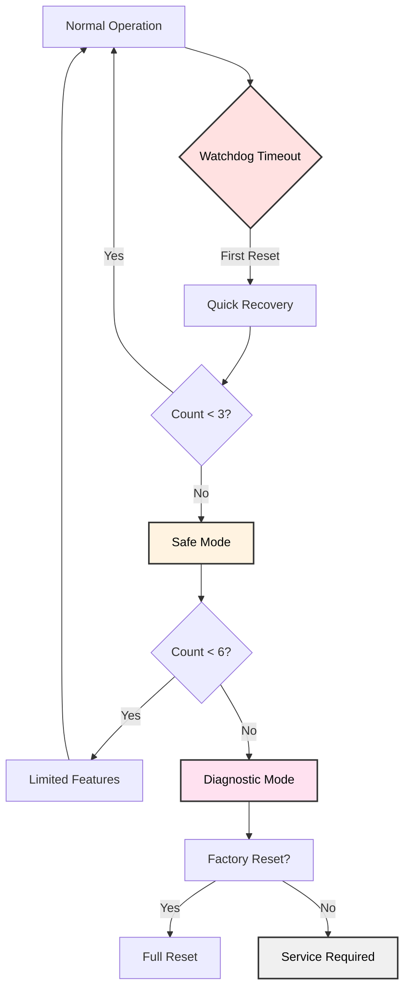
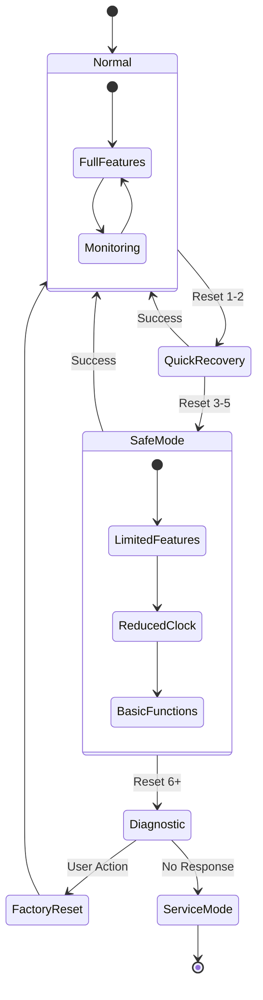
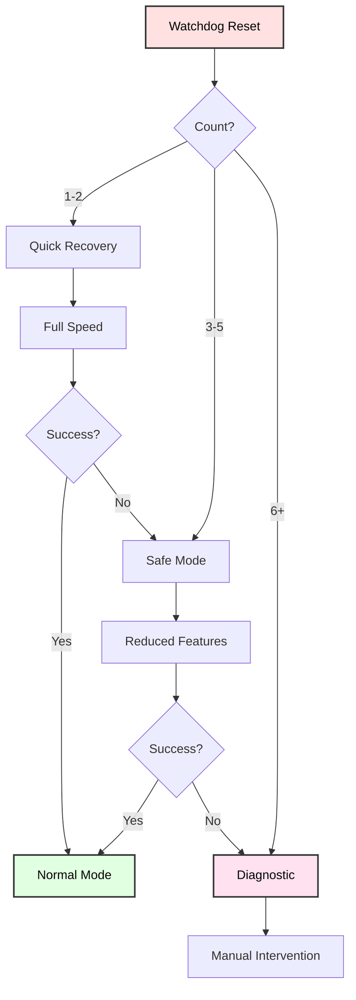

# Watchdog Timer Fail-Safe Systems
## Advanced Recovery and Safety Strategies

**Reference**: [ATmega128 Datasheet](https://ww1.microchip.com/downloads/en/DeviceDoc/doc2467.pdf)

---

## Slide 1: Introduction to Fail-Safe Systems

### What is a Fail-Safe System?
- **Multiple recovery levels** for persistent failures
- **Degrades gracefully** instead of complete failure
- **Tracks failure history** to detect patterns
- **Automatic escalation** when simple recovery fails

### Recovery Hierarchy


### Recovery Levels
```
Level 0: Normal Operation
  - All features enabled
  - Standard watchdog timeout (1 second)
  - Full performance

Level 1: Quick Recovery (after 1 reset)
  - Restart normally
  - Log reset event
  - Continue monitoring

Level 2: Safe Mode (after 3 resets)
  - Longer watchdog timeout (2 seconds)
  - Disable non-essential features
  - Reduce clock speed
  - Basic functionality only

Level 3: Diagnostic Mode (after 6 resets)
  - Report error codes
  - Flash diagnostic LEDs
  - UART debug output
  - Wait for user intervention

Level 4: Factory Reset
  - Clear EEPROM settings
  - Reset to defaults
  - Clear error counters
```

---

## Slide 2: Persistent Reset Tracking

### .noinit Section Variables
```c
// Variables that survive reset
volatile uint8_t reset_count __attribute__((section(".noinit")));
volatile uint32_t total_resets __attribute__((section(".noinit")));
volatile uint32_t uptime_seconds __attribute__((section(".noinit")));
volatile uint8_t recovery_level __attribute__((section(".noinit")));

// Timestamp of last reset
volatile uint32_t last_reset_time __attribute__((section(".noinit")));

void init_reset_tracking(void) {
    if (MCUCSR & (1 << PORF)) {
        // Power-on reset: initialize all counters
        reset_count = 0;
        total_resets = 0;
        uptime_seconds = 0;
        recovery_level = 0;
        last_reset_time = 0;
    }
    
    if (MCUCSR & (1 << WDRF)) {
        // Watchdog reset: increment counters
        reset_count++;
        total_resets++;
        
        printf("Watchdog reset #%u (total: %lu)\n", 
               reset_count, total_resets);
    }
    
    // Clear all reset flags
    MCUCSR = 0;
}
```

---

## Slide 3: Progressive Timeout Strategy

### Increase Timeout After Failures
```c
uint8_t get_watchdog_timeout(void) {
    switch (recovery_level) {
        case 0:  // Normal
            return WDTO_1S;
            
        case 1:  // Quick recovery
            return WDTO_1S;  // Same timeout
            
        case 2:  // Safe mode
            return WDTO_2S;  // Longer timeout
            
        case 3:  // Diagnostic
            return WDTO_4S;  // Very long
            
        default:
            return WDTO_2S;
    }
}

void adaptive_watchdog_enable(void) {
    uint8_t timeout = get_watchdog_timeout();
    
    wdt_enable(timeout);
    
    printf("Watchdog: %u second timeout (level %u)\n",
           (timeout == WDTO_1S) ? 1 : 
           (timeout == WDTO_2S) ? 2 : 4,
           recovery_level);
}
```

---

## Slide 4: Safe Mode Implementation

### Safe Mode Features
```c
void enter_safe_mode(void) {
    printf("\n*** ENTERING SAFE MODE ***\n");
    
    recovery_level = 2;
    
    // Disable non-essential peripherals
    power_spi_disable();
    power_twi_disable();
    
    // Reduce clock speed (lower power, more margin)
    CLKPR = (1 << CLKPCE);  // Enable prescaler change
    CLKPR = (1 << CLKPS1);  // Divide by 4
    
    // Visual indication (slow LED blink)
    while (1) {
        PORTB |= (1 << PB0);
        _delay_ms(1000);
        PORTB &= ~(1 << PB0);
        _delay_ms(1000);
        
        wdt_reset();  // Longer timeout (2 seconds)
    }
}
```

### Safe Mode Criteria
```c
void check_safe_mode(void) {
    if (reset_count >= 3 && reset_count < 6) {
        enter_safe_mode();
    }
}
```

---

## Slide 5: Consecutive Reset Detection

### Time-Based Reset Filtering
```c
#define RESET_WINDOW_SECONDS  60  // 1 minute window

void smart_reset_tracking(void) {
    uint32_t current_time = get_system_uptime();
    
    if (MCUCSR & (1 << WDRF)) {
        uint32_t time_since_last = current_time - last_reset_time;
        
        if (time_since_last < RESET_WINDOW_SECONDS) {
            // Recent reset: increment counter
            reset_count++;
            printf("Consecutive reset #%u\n", reset_count);
        } else {
            // Long time passed: reset counter
            reset_count = 1;
            printf("First reset in %lu seconds\n", time_since_last);
        }
        
        last_reset_time = current_time;
        
        // Escalate recovery level
        if (reset_count >= 6) {
            recovery_level = 3;  // Diagnostic
        } else if (reset_count >= 3) {
            recovery_level = 2;  // Safe mode
        } else {
            recovery_level = 1;  // Quick recovery
        }
    }
}
```

---

## Slide 6: Error Code System

### Error Logging
```c
#define ERROR_CODE_WATCHDOG      0x01
#define ERROR_CODE_BROWNOUT      0x02
#define ERROR_CODE_EXTERNAL      0x04
#define ERROR_CODE_STACK_OVERFLOW 0x08
#define ERROR_CODE_ASSERT_FAIL   0x10

typedef struct {
    uint8_t code;
    uint32_t timestamp;
    uint8_t reset_count_at_error;
} error_log_t;

#define ERROR_LOG_SIZE 10
error_log_t error_log[ERROR_LOG_SIZE] __attribute__((section(".noinit")));
volatile uint8_t error_log_index __attribute__((section(".noinit")));

void log_error(uint8_t code) {
    error_log[error_log_index].code = code;
    error_log[error_log_index].timestamp = get_system_uptime();
    error_log[error_log_index].reset_count_at_error = reset_count;
    
    error_log_index = (error_log_index + 1) % ERROR_LOG_SIZE;
}

void print_error_log(void) {
    printf("\n=== ERROR LOG ===\n");
    for (uint8_t i = 0; i < ERROR_LOG_SIZE; i++) {
        if (error_log[i].code != 0) {
            printf("%u: Code=0x%02X Time=%lu Resets=%u\n",
                   i, error_log[i].code, 
                   error_log[i].timestamp,
                   error_log[i].reset_count_at_error);
        }
    }
}
```

---

## Slide 7: Diagnostic Mode

### Full System Diagnostics
```c
void diagnostic_mode(void) {
    printf("\n");
    printf("╔══════════════════════════════════╗\n");
    printf("║   DIAGNOSTIC MODE ACTIVATED     ║\n");
    printf("╚══════════════════════════════════╝\n");
    
    // System information
    printf("\nSystem Status:\n");
    printf("  Reset count: %u\n", reset_count);
    printf("  Total resets: %lu\n", total_resets);
    printf("  Uptime: %lu seconds\n", uptime_seconds);
    printf("  Recovery level: %u\n", recovery_level);
    
    // Reset source
    printf("\nLast Reset Source:\n");
    if (MCUCSR & (1 << WDRF))  printf("  ✗ Watchdog\n");
    if (MCUCSR & (1 << BORF))  printf("  ✗ Brown-out\n");
    if (MCUCSR & (1 << EXTRF)) printf("  ✗ External\n");
    if (MCUCSR & (1 << PORF))  printf("  ✓ Power-on\n");
    
    // Error log
    print_error_log();
    
    // Flash diagnostic pattern
    printf("\nFlashing diagnostic LEDs...\n");
    while (1) {
        // Flash reset count in binary on LEDs
        PORTB = reset_count;
        _delay_ms(500);
        PORTB = 0x00;
        _delay_ms(500);
        
        wdt_reset();
    }
}
```

---

## Slide 8: Self-Test on Boot

### Power-On Self Test (POST)
```c
typedef struct {
    const char* name;
    uint8_t (*test_func)(void);
} test_t;

uint8_t test_ram(void) {
    // Simple RAM test
    volatile uint8_t test = 0xAA;
    if (test != 0xAA) return 0;
    test = 0x55;
    if (test != 0x55) return 0;
    return 1;
}

uint8_t test_eeprom(void) {
    // Read/write test byte
    uint8_t original = eeprom_read_byte((uint8_t*)0);
    eeprom_write_byte((uint8_t*)0, 0xAA);
    uint8_t read = eeprom_read_byte((uint8_t*)0);
    eeprom_write_byte((uint8_t*)0, original);
    return (read == 0xAA) ? 1 : 0;
}

uint8_t test_uart(void) {
    // Loopback test if available
    return 1;  // Assume OK
}

const test_t tests[] = {
    {"RAM", test_ram},
    {"EEPROM", test_eeprom},
    {"UART", test_uart},
};

void run_self_test(void) {
    printf("\n=== POWER-ON SELF TEST ===\n");
    
    uint8_t failures = 0;
    
    for (uint8_t i = 0; i < sizeof(tests)/sizeof(tests[0]); i++) {
        printf("Testing %s... ", tests[i].name);
        
        if (tests[i].test_func()) {
            printf("✓ PASS\n");
        } else {
            printf("✗ FAIL\n");
            failures++;
        }
        
        wdt_reset();
    }
    
    if (failures > 0) {
        printf("\n%u test(s) FAILED!\n", failures);
        enter_safe_mode();
    }
}
```

---

## Slide 9: Graceful Degradation

### Feature Escalation Matrix
```c
typedef struct {
    const char* name;
    uint8_t min_recovery_level;  // Disabled at this level
} feature_t;

const feature_t features[] = {
    {"Graphics Display", 3},  // Disable in diagnostic
    {"PWM Motors", 2},        // Disable in safe mode
    {"I2C Sensors", 2},
    {"SPI Peripherals", 2},
    {"Advanced Logging", 2},
    {"UART Output", 0},       // Always enabled
    {"Basic LED", 0},
};

uint8_t feature_enabled(const char* name) {
    for (uint8_t i = 0; i < sizeof(features)/sizeof(features[0]); i++) {
        if (strcmp(features[i].name, name) == 0) {
            return (recovery_level < features[i].min_recovery_level);
        }
    }
    return 1;  // Unknown features default enabled
}

void main_loop_with_degradation(void) {
    while (1) {
        // Essential functions (always)
        wdt_reset();
        update_leds();
        
        // Optional functions (based on recovery level)
        if (feature_enabled("I2C Sensors")) {
            read_i2c_sensors();
        }
        
        if (feature_enabled("Graphics Display")) {
            update_display();
        }
        
        if (feature_enabled("Advanced Logging")) {
            log_detailed_data();
        }
        
        _delay_ms(100);
    }
}
```

---

## Slide 10: EEPROM Configuration Backup

### Save/Restore Critical Settings
```c
#define EEPROM_CONFIG_ADDR  0x00
#define CONFIG_MAGIC        0xAA55

typedef struct {
    uint16_t magic;
    uint8_t recovery_level;
    uint8_t reset_count;
    uint32_t total_resets;
    // Add other persistent config...
} config_t;

void save_config(void) {
    config_t cfg;
    cfg.magic = CONFIG_MAGIC;
    cfg.recovery_level = recovery_level;
    cfg.reset_count = reset_count;
    cfg.total_resets = total_resets;
    
    eeprom_write_block(&cfg, (void*)EEPROM_CONFIG_ADDR, sizeof(cfg));
    
    printf("Configuration saved to EEPROM\n");
}

void load_config(void) {
    config_t cfg;
    eeprom_read_block(&cfg, (void*)EEPROM_CONFIG_ADDR, sizeof(cfg));
    
    if (cfg.magic == CONFIG_MAGIC) {
        // Valid config found
        recovery_level = cfg.recovery_level;
        reset_count = cfg.reset_count;
        total_resets = cfg.total_resets;
        
        printf("Configuration loaded from EEPROM\n");
    } else {
        // First boot or corrupted
        printf("No valid config - using defaults\n");
        recovery_level = 0;
        reset_count = 0;
        total_resets = 0;
    }
}

void factory_reset(void) {
    printf("Performing factory reset...\n");
    
    // Clear EEPROM
    for (uint16_t i = 0; i < E2END; i++) {
        eeprom_write_byte((uint8_t*)i, 0xFF);
    }
    
    // Reset all counters
    reset_count = 0;
    total_resets = 0;
    recovery_level = 0;
    
    printf("Factory reset complete. Restarting...\n");
    _delay_ms(1000);
    
    // Force watchdog reset
    wdt_enable(WDTO_15MS);
    while (1);
}
```

---

## Slide 11: Heartbeat Monitoring

### External Heartbeat Output
```c
void heartbeat_task(void) {
    static uint32_t last_heartbeat = 0;
    uint32_t now = millis();
    
    if (now - last_heartbeat >= 500) {
        // Toggle heartbeat LED/pin
        PORTB ^= (1 << PB0);
        
        last_heartbeat = now;
        
        // Also reset watchdog
        wdt_reset();
    }
}

/*
 * External monitoring system can watch heartbeat:
 * - If heartbeat stops: system hung
 * - If watchdog resets: automatic recovery
 * - If heartbeat irregular: performance issue
 */
```

---

## Slide 12: Recovery State Machine

### State-Based Recovery


---

## Slide 13: Production Watchdog Strategy

### Best Practices for Deployment
```c
void production_init(void) {
    // 1. Initialize reset tracking
    init_reset_tracking();
    
    // 2. Load configuration
    load_config();
    
    // 3. Run self-test
    run_self_test();
    
    // 4. Check recovery level
    if (reset_count >= 6) {
        diagnostic_mode();  // Doesn't return
    } else if (reset_count >= 3) {
        printf("Safe mode: limited features\n");
        recovery_level = 2;
    }
    
    // 5. Enable adaptive watchdog
    adaptive_watchdog_enable();
    
    // 6. Log startup
    printf("System started (level %u)\n", recovery_level);
    log_error(ERROR_CODE_WATCHDOG);
    
    // 7. Save config periodically
    // (in main loop every 60 seconds)
}

void production_main_loop(void) {
    static uint32_t last_save = 0;
    
    while (1) {
        // Essential tasks
        wdt_reset();
        heartbeat_task();
        
        // Application logic
        if (feature_enabled("Sensors")) {
            read_sensors();
        }
        
        // Periodic config save
        if (millis() - last_save >= 60000) {
            save_config();
            last_save = millis();
        }
    }
}
```

---

## Slide 14: Summary

### Fail-Safe Architecture

✓ **Progressive recovery**: Normal → Quick → Safe → Diagnostic → Factory  
✓ **Persistent tracking**: Reset counters survive power cycles  
✓ **Adaptive timeout**: Increase watchdog period at higher levels  
✓ **Graceful degradation**: Disable features, not entire system  
✓ **Error logging**: Track failure history  
✓ **Self-test**: Verify hardware on boot  
✓ **EEPROM backup**: Persistent configuration  
✓ **Heartbeat monitoring**: External system supervision  

### Recovery Decision Flow


### When to Use Fail-Safe
- **Unattended systems** (remote sensors, industrial control)
- **Safety-critical** applications (medical devices, automotive)
- **High-reliability** requirements (>99.9% uptime)
- **Field deployment** (difficult to service physically)

---

## Slide 15: Practice Exercises

### Exercise 1: Progressive Timeout
**Goal**: Implement adaptive watchdog timeout
- Track consecutive resets
- Level 0: 1 second timeout
- Level 1: 2 second timeout  
- Level 2: 4 second timeout
- Print current level on UART

### Exercise 2: Safe Mode
**Goal**: Enter safe mode after 3 resets
- Disable I2C and SPI peripherals
- Reduce clock to 1 MHz
- Blink LED slowly (1 Hz)
- Longer watchdog timeout

### Exercise 3: Error Logger
**Goal**: Log last 10 errors to .noinit array
- Store error code, timestamp, reset count
- Display log on UART at boot
- Include watchdog, brownout, external resets

### Exercise 4: Self-Test
**Goal**: Run POST before main application
- Test RAM (write/read patterns)
- Test EEPROM (write/read byte)
- Test UART (character echo)
- Enter safe mode if any test fails

### Exercise 5: Factory Reset
**Goal**: Complete configuration reset
- Button press → factory reset
- Clear all EEPROM
- Reset all counters
- Force watchdog reset to restart

---

# End of Slides

**Questions?**

For more information, see:
- [ATmega128 Datasheet](https://ww1.microchip.com/downloads/en/DeviceDoc/doc2467.pdf) (Watchdog: pages 43-47)
- Project source code in `Watchdog_Fail_Safe/`
- Shared libraries: `_uart.h`, `_eeprom.h`
