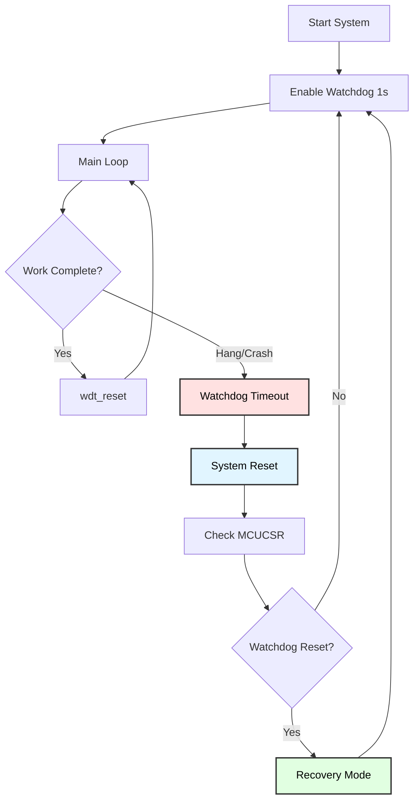
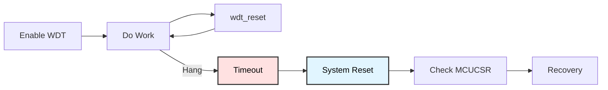

# Watchdog Timer System Reset
## Automatic Crash Detection and Recovery

**Reference**: [ATmega128 Datasheet](https://ww1.microchip.com/downloads/en/DeviceDoc/doc2467.pdf)

---

## Slide 1: Introduction to Watchdog Timer

### What is a Watchdog Timer?
- **Independent hardware timer** (~1 MHz RC oscillator)
- **Monitors software execution** for crashes/hangs
- **Automatically resets system** if not periodically cleared
- **Fail-safe mechanism** for reliability

### Watchdog Architecture


### Watchdog Timeout Periods
```
WDP2 WDP1 WDP0 | Timeout    | Cycles (1 MHz osc)
---------------|------------|-------------------
 0    0    0   | 16.3 ms    | 16K cycles
 0    0    1   | 32.5 ms    | 32K cycles
 0    1    0   | 65 ms      | 64K cycles
 0    1    1   | 0.13 s     | 128K cycles
 1    0    0   | 0.26 s     | 256K cycles
 1    0    1   | 0.52 s     | 512K cycles
 1    1    0   | 1.0 s      | 1M cycles
 1    1    1   | 2.1 s      | 2M cycles
```

---

## Slide 2: WDTCR Register

### Watchdog Timer Control Register
```
WDTCR (Watchdog Timer Control Register)
Bit:   7    6    5    4    3    2    1    0
Name:  -    -    -   WDCE  WDE  WDP2 WDP1 WDP0

WDCE (Watchdog Change Enable):
  - Must be set with WDE to change settings
  - Auto-clears after 4 clock cycles
  - TIMING CRITICAL!

WDE (Watchdog Enable):
  - 1 = Watchdog enabled
  - 0 = Watchdog disabled (only if WDCE=1)

WDP2:WDP0 (Watchdog Prescaler):
  - Select timeout period (see table)
```

---

## Slide 3: Enabling Watchdog

### Enable Watchdog (1 Second Timeout)
```c
#include <avr/wdt.h>
#include <avr/interrupt.h>

void watchdog_enable_1s(void) {
    cli();  // Disable interrupts (critical timing)
    
    wdt_reset();  // Reset watchdog first
    
    // Timed sequence (MUST complete within 4 cycles!)
    WDTCR = (1 << WDCE) | (1 << WDE);  // Enable change mode
    WDTCR = (1 << WDE) | (1 << WDP2) | (1 << WDP1);  // 1 second timeout
    
    sei();  // Re-enable interrupts
}
```

### Using wdt.h Library
```c
#include <avr/wdt.h>

void demo_enable(void) {
    /*
     * Timeout macros:
     * WDTO_15MS, WDTO_30MS, WDTO_60MS, WDTO_120MS,
     * WDTO_250MS, WDTO_500MS, WDTO_1S, WDTO_2S,
     * WDTO_4S (not all AVRs), WDTO_8S (not all AVRs)
     */
    
    wdt_enable(WDTO_1S);  // Enable with 1 second timeout
    
    printf("Watchdog enabled (1 second)\n");
}
```

---

## Slide 4: Resetting the Watchdog

### Prevent System Reset (wdt_reset)
```c
void main_loop_with_watchdog(void) {
    wdt_enable(WDTO_1S);
    
    while (1) {
        // Do work (MUST complete within 1 second!)
        read_sensors();
        process_data();
        update_display();
        
        // Reset watchdog timer (CRITICAL!)
        wdt_reset();  // Prevents system reset
        
        _delay_ms(500);  // Safe delay (< 1000ms timeout)
    }
}
```

### Manual Reset (Without Library)
```c
void reset_watchdog_manual(void) {
    __asm__ __volatile__ ("wdr");  // WDR instruction
}
```

---

## Slide 5: Disabling the Watchdog

### Safe Watchdog Disable
```c
void watchdog_disable(void) {
    cli();  // Disable interrupts
    
    wdt_reset();  // Reset watchdog timer
    
    // Clear Watchdog Reset Flag (important!)
    MCUCSR &= ~(1 << WDRF);
    
    // Timed sequence to disable
    WDTCR = (1 << WDCE) | (1 << WDE);  // Enable change
    WDTCR = 0x00;  // Clear WDE and prescaler
    
    sei();  // Re-enable interrupts
}
```

### Using wdt.h
```c
wdt_disable();  // Automatically handles timing
```

**Warning**: If watchdog was enabled by fuse, cannot disable in software!

---

## Slide 6: Detecting Watchdog Reset

### MCUCSR Register
```
MCUCSR (MCU Control and Status Register)
Bit:   7    6    5    4    3    2    1    0
Name:  -    -    -    -   WDRF BORF EXTRF PORF

WDRF (Watchdog Reset Flag):
  - Set by hardware if watchdog caused reset
  - Must be manually cleared by software
  - Read before clearing to detect reset source

BORF: Brown-out Reset Flag
EXTRF: External Reset Flag  
PORF: Power-on Reset Flag
```

### Check Reset Source
```c
const char* get_reset_source(void) {
    uint8_t mcucsr = MCUCSR;
    
    if (mcucsr & (1 << WDRF)) {
        return "Watchdog Reset";
    } else if (mcucsr & (1 << BORF)) {
        return "Brown-out Reset";
    } else if (mcucsr & (1 << EXTRF)) {
        return "External Reset";
    } else if (mcucsr & (1 << PORF)) {
        return "Power-on Reset";
    } else {
        return "Unknown";
    }
}

void main(void) {
    // Check why system reset
    const char* reason = get_reset_source();
    printf("Reset reason: %s\n", reason);
    
    // Clear reset flags
    MCUCSR = 0;
    
    // Continue initialization...
}
```

---

## Slide 7: Application - Watchdog Protected Loop

### Basic Watchdog Protection
```c
void protected_main_loop(void) {
    uart_init();
    
    wdt_enable(WDTO_2S);  // 2 second timeout
    
    printf("Watchdog enabled\n");
    
    uint32_t iteration = 0;
    
    while (1) {
        iteration++;
        
        // Do essential work
        printf("Iteration: %lu\n", iteration);
        
        // Blink LED to show activity
        PORTB ^= (1 << PB0);
        
        _delay_ms(500);
        
        // Reset watchdog (prevents system reset)
        wdt_reset();
    }
}

/*
 * If system hangs in any function:
 * - Watchdog will timeout after 2 seconds
 * - System automatically resets
 * - Program restarts from main()
 * - MCUCSR will show watchdog reset
 */
```

---

## Slide 8: Crash Detection Demo

### Intentional Hang (Testing)
```c
void demo_intentional_hang(void) {
    printf("Enabling watchdog (1 second)...\n");
    
    wdt_enable(WDTO_1S);
    
    printf("Entering infinite loop WITHOUT wdt_reset...\n");
    printf("System should reset in 1 second!\n");
    
    _delay_ms(100);  // Let UART finish
    
    // Intentionally hang (no wdt_reset!)
    while (1) {
        // Simulated crash/hang
        PORTC = 0xFF;  // All LEDs on
        _delay_ms(100);
        PORTC = 0x00;
        _delay_ms(100);
        
        // NOTE: wdt_reset() is NOT called!
    }
    
    // This code is unreachable - system will reset
}
```

---

## Slide 9: Reset Recovery System

### Persistent Reset Counter
```c
// Variable survives reset (stored in .noinit section)
volatile uint8_t reset_count __attribute__((section(".noinit")));

void main(void) {
    uart_init();
    
    // Check reset source
    if (MCUCSR & (1 << WDRF)) {
        printf("*** WATCHDOG RESET DETECTED ***\n");
        reset_count++;
        printf("Reset count: %u\n", reset_count);
        
        // Clear watchdog flag
        MCUCSR &= ~(1 << WDRF);
        
        // Recovery actions
        if (reset_count >= 3) {
            printf("Too many resets! Entering safe mode...\n");
            safe_mode();
        }
    } else {
        // Normal startup
        reset_count = 0;
        printf("Normal boot\n");
    }
    
    // Disable watchdog during init
    wdt_disable();
    
    // Initialize system...
    
    // Re-enable watchdog for normal operation
    wdt_enable(WDTO_1S);
    
    while (1) {
        main_loop();
        wdt_reset();
    }
}
```

---

## Slide 10: Long-Running Tasks

### Watchdog Reset During Delays
```c
// BAD: Long delay exceeds watchdog timeout
void bad_long_task(void) {
    wdt_enable(WDTO_1S);
    
    _delay_ms(2000);  // Exceeds 1 second → RESET!
    
    // Unreachable
}

// GOOD: Reset watchdog within long tasks
void good_long_task(void) {
    wdt_enable(WDTO_1S);
    
    for (uint8_t i = 0; i < 4; i++) {
        _delay_ms(500);  // Safe (< 1000ms)
        wdt_reset();      // Reset every 500ms
    }
    
    // Total 2 seconds, but watchdog reset every 500ms
}

// BEST: Watchdog-aware delay function
void delay_with_wdt(uint16_t ms) {
    while (ms > 500) {
        _delay_ms(500);
        wdt_reset();
        ms -= 500;
    }
    _delay_ms(ms);
}
```

---

## Slide 11: Troubleshooting

### Common Issues

| Problem | Cause | Solution |
|---------|-------|----------|
| **System resets repeatedly** | Watchdog timeout too short | Increase timeout or add more wdt_reset() calls |
| **Can't disable watchdog** | Enabled by fuse | Check fuse settings (WDTON fuse) |
| **Reset source unknown** | MCUCSR not checked early | Read MCUCSR at start of main() |
| **Reset flag not set** | Cleared before reading | Check MCUCSR before clearing |
| **Watchdog doesn't work** | Not enabled correctly | Follow timed sequence precisely |
| **System resets during init** | Watchdog enabled from fuse | Disable or reset watchdog early in main() |

### Debug Reset Loops
```c
void debug_reset_loop(void) {
    // Preserve reset count across resets
    static uint8_t boot_count __attribute__((section(".noinit")));
    
    boot_count++;
    
    printf("\n=== BOOT #%u ===\n", boot_count);
    printf("Reset reason: 0x%02X\n", MCUCSR);
    
    if (boot_count > 10) {
        printf("ERROR: Too many resets! Halting.\n");
        wdt_disable();
        while (1);  // Stop
    }
}
```

---

## Slide 12: Summary

### Key Concepts

✓ **Watchdog timer**: Independent RC oscillator monitors software  
✓ **Timeout periods**: 16ms to 2.1 seconds  
✓ **wdt_reset()**: Must call before timeout to prevent reset  
✓ **WDRF flag**: Detect watchdog-caused resets in MCUCSR  
✓ **Fail-safe**: Automatically recover from crashes/hangs  
✓ **Critical timing**: Enable/disable requires precise sequence  
✓ **Reset counter**: Track recovery attempts  

### Watchdog Workflow


### Applications
- Autonomous systems (remote sensors, dataloggers)
- Safety-critical embedded systems
- Unattended operation (no manual reset available)
- Error recovery (automatic restart after crash)
- Watchdog as wake-up source (low-power applications)

---

## Slide 13: Practice Exercises

### Exercise 1: Basic Watchdog
**Goal**: Enable and reset watchdog in main loop
- Enable watchdog with 1 second timeout
- Blink LED every 500ms
- Call wdt_reset() after each blink
- Verify system doesn't reset

### Exercise 2: Timeout Test
**Goal**: Intentionally trigger watchdog reset
- Enable watchdog (1 second)
- Enter loop WITHOUT calling wdt_reset()
- Observe system reset
- Check MCUCSR for WDRF flag

### Exercise 3: Reset Counter
**Goal**: Track watchdog resets
- Use .noinit variable for reset count
- Increment on watchdog reset
- Display count on UART
- Reset counter on normal boot

### Exercise 4: Long Task Protection
**Goal**: Reset watchdog during long operations
- Simulate 5-second processing task
- Enable watchdog (1 second)
- Reset watchdog every 500ms within task
- Verify no system reset occurs

### Exercise 5: Safe Mode Recovery
**Goal**: Implement failsafe after multiple resets
- Track consecutive watchdog resets
- After 3 resets: enter safe mode
- Safe mode: disable non-essential features
- Display diagnostic info on LCD

---

# End of Slides

**Questions?**

For more information, see:
- [ATmega128 Datasheet](https://ww1.microchip.com/downloads/en/DeviceDoc/doc2467.pdf) (Watchdog: pages 43-47)
- Project source code in `Watchdog_System_Reset/`
- Shared libraries: `_uart.h`
