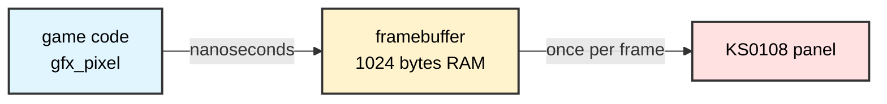
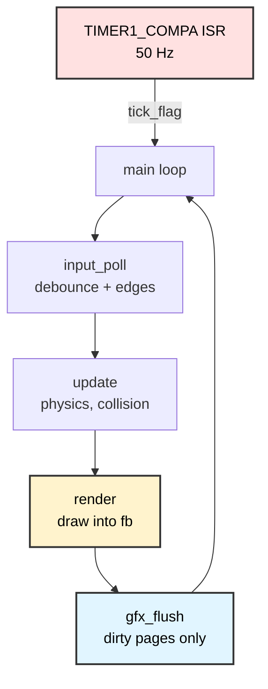

# Building a Game Engine on the GLCD
## ATmega128 Embedded Systems Course

**Reference**: [ATmega128 Datasheet](https://ww1.microchip.com/downloads/en/DeviceDoc/doc2467.pdf)

---

## Slide 1: Why this lesson exists

Lesson 18 drew shapes on the GLCD. Every one of them appeared instantly, because
nothing was moving.

A game moves. It must redraw the whole screen 30 to 60 times a second, take input
that feels immediate, and never stutter. The library you already have cannot do
that — and the reason why is the most useful thing in this lesson.

### What you will build
- A **framebuffer**: the screen kept in RAM instead of on the panel
- **Dirty-page flushing**: push only what changed
- A **fixed-timestep loop** driven by a timer interrupt
- **Edge-detected input** so a button press fires exactly once

### What you will learn
> On a small machine you buy speed with memory,
> and you must know exactly what you spent.

---

## Slide 2: The problem, in one function

This is the bus write inside `shared_libs/_glcd.c`, stripped to its delays:

```c
static void ks0108_write_byte(uint8_t data, uint8_t rs, uint8_t controller)
{
    /* ... put data on the bus, select the controller ... */
    _delay_us(KS0108_DELAY_SETUP);    //  1 us
    KS0108_CONTROL_PORT |=  (1 << KS0108_E_BIT);
    _delay_us(KS0108_DELAY_ENABLE);   //  1 us
    KS0108_CONTROL_PORT &= ~(1 << KS0108_E_BIT);
    _delay_us(KS0108_DELAY_HOLD);     //  2 us
    /* ... deselect ... */
    _delay_us(KS0108_DELAY_COMMAND);  // 10 us
}
```

**Add them up: 14 µs for one byte.**

---

## Slide 3: What 14 µs costs you

The screen is 128 × 64 pixels. Eight vertically-stacked pixels share one byte,
so the whole screen is:

```
128 columns × 8 pages = 1024 bytes
```

| | |
|---|---|
| Bytes in one full screen | 1024 |
| Cost per byte through `_glcd.c` | 14 µs |
| **Cost of one full repaint** | **~14.3 ms** |
| Frame budget at 50 frames/second | 20 ms |
| **Share of the budget spent pushing pixels** | **~72%** |

That leaves 5.7 ms for physics, collision, input and sound — and any overrun
shows up as visible stutter. This is why the game feels broken before you have
written any game.

---

## Slide 4: A true story about that 10 µs

The KS0108 datasheet says the settling time is required **after a command** —
after you retarget the page or column pointer. It says nothing about needing it
between consecutive data bytes, which should proceed at the bus cycle time.

`_glcd.c` applies it after *every* byte. That looks like a general-purpose
library being conservative, so the first version of this engine dropped it for
data writes and ran the bus at **4 µs per byte instead of 14**.

### The result was a completely blank screen

Not a glitch. Not a corrupted corner. Nothing at all — while the firmware
compiled cleanly, produced valid hex, reported sensible section sizes, and
passed every automated check in the repository.

The delay is back:

```c
#ifndef PANEL_SETTLE_US
#define PANEL_SETTLE_US 10      /* matches _glcd.c, which demonstrably works */
#endif
```

### Why this is the most useful slide in the deck

The datasheet argument was sound. The board disagreed. When those two conflict,
**the board wins** — and the correct order of work is: match the implementation
that is known to work, then optimise with a measurement in your hand.

> An optimisation you have not measured on the real system
> is a guess wearing a lab coat.

Lowering `PANEL_SETTLE_US` is now Exercise 3, with the flush time on screen so
you can see what you are buying and exactly where it breaks.

---

## Slide 5: The framebuffer

Keep the whole screen in RAM. Drawing becomes plain memory writes — no bus, no
delays. Only at the end of the frame do you push it to the panel.

```c
static uint8_t fb[GFX_PAGES][GFX_W];   /* 8 × 128 = 1024 bytes */
```



Drawing the same pixel a hundred times now costs a hundred memory writes instead
of a hundred bus transactions. Overlapping sprites become free.

---

## Slide 6: What it cost — the honest number

The ATmega128 has **4096 bytes of SRAM**. The framebuffer is **1024** of them.

```
+--------------------------------------------------+ 4096 bytes SRAM
|############################|                     |
|  framebuffer 1024 (25%)    |  everything else    |
+--------------------------------------------------+
```

**One quarter of the machine's memory is a single array.**

That is the trade. You did not make the program faster by being clever; you made
it faster by spending memory you will never get back. On a desktop nobody would
notice. Here it is a quarter of everything you have.

> Every optimisation is a trade. Name what you paid.

---

## Slide 7: How a pixel maps to a byte

The KS0108 stores pixels in **pages**: one byte holds eight pixels stacked
*vertically*.

```
        x=0   x=1   x=2  ...
page 0   b0    b0    b0     <- y=0   bit 0 of fb[0][x]
         b1    b1    b1     <- y=1
         ...
         b7    b7    b7     <- y=7   bit 7 of fb[0][x]
page 1   b0    b0    b0     <- y=8
```

So the pixel at `(x, y)` lives at:

```c
uint8_t page = y >> 3;              /* y / 8  */
uint8_t bit  = 1 << (y & 7);        /* y % 8  */
fb[page][x] |= bit;                 /* set it */
```

Two shifts and a mask — no division, which an 8-bit AVR has no instruction for.

---

## Slide 8: Set, clear, invert

```c
void gfx_pixel(uint8_t x, uint8_t y, uint8_t mode)
{
    if (x >= GFX_W || y >= GFX_H)
        return;                     /* clip, do not wrap */

    uint8_t page = y >> 3;
    uint8_t bit  = 1 << (y & 7);
    uint8_t before = fb[page][x];

    if      (mode == GFX_ON)  fb[page][x] = before |  bit;
    else if (mode == GFX_OFF) fb[page][x] = before & ~bit;
    else                      fb[page][x] = before ^  bit;   /* XOR */

    if (fb[page][x] != before)
        fb_dirty |= (1 << page);    /* remember this page changed */
}
```

**Clipping, not wrapping.** A sprite half off the left edge should vanish, not
reappear on the right. One `return` buys that.

**XOR mode** draws a sprite and erases it with the identical call — the classic
trick when you cannot afford to store what was underneath.

---

## Slide 9: Dirty pages

Most frames change very little. A ball moving three pixels touches one or two
pages out of eight; the other six are already correct on the panel.

```c
static uint8_t fb_dirty;            /* one bit per page */
```

```c
uint16_t gfx_flush(void)
{
    uint16_t written = 0;
    for (uint8_t page = 0; page < GFX_PAGES; page++)
        if (fb_dirty & (1 << page))
            written += flush_page(page);
    fb_dirty = 0;
    return written;
}
```

A single `uint8_t` — eight bits for eight pages — typically cuts the bytes sent
by **four times or more**.

---

## Slide 10: One more trick — auto-increment

The KS0108 advances its own column counter after each data write. So you set the
address **once per page per controller**, then stream:

```c
static uint16_t flush_page(uint8_t page)
{
    panel_cmd(CMD_SET_PAGE | page, CS_BOTH);

    panel_cmd(CMD_SET_Y | 0, CS_LEFT);
    for (uint8_t x = 0; x < 64; x++)
        bus_write(fb[page][x], 1, CS_LEFT);      /* left half  */

    panel_cmd(CMD_SET_Y | 0, CS_RIGHT);
    for (uint8_t x = 64; x < 128; x++)
        bus_write(fb[page][x], 1, CS_RIGHT);     /* right half */

    return 128;
}
```

Two controllers, remember: CS1 owns columns 0–63, CS2 owns 64–127.

Without auto-increment every byte would need its own address command — **three
bus transactions per byte instead of one.**

---

## Slide 11: The pin the comment forgot

`shared_libs/_glcd.h` opens with a pin table. One line of it is wrong:

```
 * PIN CONNECTIONS (ATmega128):
 * - RS:     PE4 (Register Select: 0=Command, 1=Data)
 * - R/W:    GND (Read/Write: tied to ground for write-only)   <-- not on this board
```

Trace the circuit file instead of believing the comment:

```
Ks0108-237-PinRW   ->   mega128-20-PORTG1
```

R/W goes to **PG1**. And `_glcd.c` never drives it — not once, anywhere.

### So why does lesson 18 work?

By accident. It also links `_port.c`, whose `Port_init()` contains:

```c
DDRG  = 0xFF;   // configure PORTG as output
PORTG = 0x00;   // initialize all outputs LOW
```

That blanket initialisation has nothing to do with the display, but it leaves
R/W low — the write state — as a side effect.

### Why this engine had to fix it

Lesson 23 links only `_game`. Nothing sets PG1, so it stays an input with no
pull-up, floating. The panel reads R/W as a *read* request, never accepts a
byte, and **the screen stays blank** — with no error reported anywhere.

```c
PANEL_RW_DDR  |=  (1 << RW_BIT);   /* PG1 becomes an output   */
PANEL_RW_PORT &= ~(1 << RW_BIT);   /* held low: we only write */
```

The older `_glcd_legacy.c` had this right all along:
`ClrBit(PORTG, PORTG1); // RW = 0 (write mode)`.

> A comment is not evidence. The netlist is.
> This one cost a blank screen, and only a wiring trace found it.

---

## Slide 12: Measure it yourself

Do not take any of this on trust. The program reports its own cost.

`Timer3` free-runs at prescaler 8 → 2 MHz → **one count is half a microsecond**,
and the 16-bit counter spans 32.7 ms, so a 20 ms frame can never silently wrap.

```c
static inline void     profile_start(void) { TCNT3 = 0; }
static inline uint16_t profile_us(void)    { return TCNT3 >> 1; }
```

```c
profile_start();
last_bytes = flush_dirty_only ? gfx_flush() : gfx_flush_all();
last_us    = profile_us();
```

**Press button A (PD0)** to switch between the two, and read the bottom line.
The ratio you see is the whole lesson, measured on your own board.

---

## Slide 13: Why the status line is redrawn twice a second

A detail worth catching. Look at `render()`:

```c
uint8_t redraw_stats = ((game_ticks() % (TICK_HZ / 2)) == 0);
```

The status text sits in page 0 and the profile line in page 7. Rewriting them
**every** frame would mark both pages dirty every frame — and the saving from
dirty-page flushing would quietly collapse from 8 pages down to 4, not down to 2.

> The optimisation is only as good as the sloppiest thing you draw.

Try it: change `TICK_HZ / 2` to `1` and watch the byte count climb.

---

## Slide 14: The fixed-timestep loop

The wrong way, which every beginner writes first:

```c
for (;;) {
    update();
    render();
    _delay_ms(20);          /* WRONG */
}
```

The frame is then `20 ms + however long the work took` — so the game runs at
different speeds on different days, and physics tied to frame count drifts.

The right way — the timer decides, not the work:

```c
for (;;) {
    if (!game_tick_ready())
        continue;           /* nothing to do until the timer says so */
    input_poll();
    update();
    render(redraw_stats);
    gfx_flush();
}
```

---

## Slide 15: The tick, and what to do when you miss one

```c
ISR(TIMER1_COMPA_vect)
{
    if (tick_flag)          /* previous tick never consumed */
        tick_overrun = 1;
    tick_flag = 1;
    tick_count++;
}
```

The ISR does almost nothing — set a flag, bump a counter. All the work happens in
the main loop, so interrupts stay short.

**The missed tick is dropped, not queued.** That is a deliberate design choice:

| Policy | Behaviour when a frame overruns |
|---|---|
| Queue the missed ticks | Game lurches forward to catch up |
| **Drop them** (what we do) | Game slows down smoothly |

For a game, slowing down is far less unpleasant than teleporting. `game_overrun()`
reports it so you can see it happening — the demo lights all eight LEDs.

---

## Slide 16: Timer1 in CTC mode

```c
TCCR1A = 0;
TCCR1B = (1 << WGM12) | (1 << CS12);   /* CTC, prescaler 256 */
OCR1A  = (62500UL / hz) - 1;
TIMSK |= (1 << OCIE1A);
sei();
```

At 16 MHz with prescaler 256 the counter runs at **62 500 Hz**, so:

| Rate | `OCR1A` |
|---|---|
| 10 Hz | 6249 |
| 50 Hz | 1249 |
| 200 Hz | 311 |

All comfortably inside 16 bits. One prescaler covers the whole useful range.

> **Linking note.** `_game.c` defines `TIMER1_COMPA_vect` (`__vector_12`) — and so
> does `shared_libs/_timer.c`. A lesson may link one or the other, never both.
> That is why `build.bat` says `set LIBS=_game` and nothing else.

---

## Slide 17: Input that feels right

The board wires six buttons to PORT D, each with a pull-up, so **pressed reads
LOW**. PD2 and PD3 are missing from the list on purpose: they are RXD1/TXD1.

```c
uint8_t raw = (~PIND) & BTN_MASK;      /* invert: now 1 = pressed */

if (raw == btn_raw_last) {             /* two samples agree = settled */
    btn_prev   = btn_stable;
    btn_stable = raw;
    btn_edge   = btn_stable & ~btn_prev;   /* newly pressed */
}
btn_raw_last = raw;
```

Two ideas in five lines:

- **Debounce** — a bounce must survive a whole tick to count. The tick rate *is*
  the debounce window: at 50 Hz, 20 ms.
- **Edge detection** — `stable & ~prev` is true only on the tick a button went
  down. `btn_held()` is for movement; `btn_pressed()` is for menus and toggles.

---

## Slide 18: The font goes in flash

`_glcd.c` declares its font like this:

```c
static const uint8_t ks0108_font[95][5] = { ... };   /* no PROGMEM! */
```

On AVR, `const` alone is not enough. The table is copied into SRAM at startup.
Build lesson 18 and look:

```
$ avr-size -A 18_GLCD_Graphics/Main.elf
.data     476      <- 95 glyphs x 5 bytes, sitting in RAM
.text    1200
.bss        9
```

**476 bytes — 11.6% of SRAM — spent on a font before the program does anything.**

The engine uses `PROGMEM` and reads glyphs with `pgm_read_byte()`:

```c
static const uint8_t font5x7[59][5] PROGMEM = { ... };
uint8_t bits = pgm_read_byte(&glyph[col]);
```

---

## Slide 19: The two builds, side by side

```
18_GLCD_Graphics                 23_Game_Engine_GLCD
----------------                 -------------------
.data     476                    .data      30
.text    1200                    .text    3110
.bss        9                    .bss     1047
        -----                            -----
SRAM      485                    SRAM     1077
```

Read it carefully — both directions matter:

- **`.data` fell 476 → 30.** The font moved to flash. Free memory, no downside.
- **`.bss` rose 9 → 1047.** That is the framebuffer. You chose to spend it.
- **`.text` rose 1200 → 3110.** More code: flush logic, input, timer, sound, font.

Total SRAM is **1077 of 4096 — 26%**, and about 3 KB stays free for the game.

> Flash is plentiful (128 KB). SRAM is precious (4 KB).
> Put constants in flash and spend RAM only where it buys you something.

---

## Slide 20: Randomness without `rand()`

`rand()` from the C library drags in a lot of code and does a division. A 16-bit
**xorshift** does the same job in three shifts and three XORs:

```c
uint16_t game_rand(void)
{
    rng_state ^= rng_state << 7;
    rng_state ^= rng_state >> 9;
    rng_state ^= rng_state << 8;
    return rng_state;
}
```

It visits all 65 535 non-zero values before repeating — and it can never reach
zero, which is why the seed is forced to 1 if you pass 0.

**Deterministic on purpose.** Same seed, same sequence, every run. That is what
lets you reproduce a bug — and, in later lessons, score everyone's robot on
exactly the same course.

---

## Slide 21: Putting it together



Every game you write from here follows this shape. Only `update()` and `render()`
change.

### Controls in the demo
| Button | Pin | Action |
|---|---|---|
| Left / Right | PD4 / PD5 | Move the paddle |
| A | PD0 | Toggle dirty-page flushing |
| B | PD1 | Reset the miss counter |

---

## Slide 22: Exercises

1. **Measure the claim.** Note the `US` reading in both flush modes. What is the
   ratio? Does it match the 4× you would predict from pages touched?

2. **Break the optimisation.** Redraw the status line every frame instead of
   twice a second. Explain the new byte count.

3. **Push the bus.** Lower `PANEL_SETTLE_US` in `_game.h` from 10 towards 0,
   rebuild, and watch the `US` reading fall. At what value does the display
   first corrupt, and what does it look like when it does? Slide 4 explains why
   this is an exercise and not the default.

4. **Find the cliff.** Raise `TICK_HZ` until the overrun LEDs light. What is the
   highest frame rate this engine sustains? What limits it — the flush, or
   `update()`?

5. **Spend less memory.** The field only occupies pages 1–6. Could the
   framebuffer be 6 pages instead of 8? What breaks, and how much do you save?

6. **XOR the ball.** Redraw the ball with `GFX_XOR` and skip clearing the field.
   What goes wrong when it crosses the border, and why?

7. **Add a second ball.** Where does the frame budget go first — flush time, or
   collision checks?

---

## Slide 23: What you built

- A **framebuffer** that trades 1024 bytes of SRAM for freedom from bus delays
- **Dirty-page flushing**, and the discipline not to undermine it
- A **fixed-timestep loop** that keeps time even when frames vary
- **Debounced, edge-detected input** in five lines
- A font in **flash**, not RAM — 476 bytes reclaimed
- A **deterministic** random generator you will need again

### The habit worth keeping
> You did not optimise this by guessing.
> You read the delays, computed the cost, measured the result on the board,
> and the program now reports its own performance in microseconds.

**Next:** `24_Game_Arcade` — Pong, Snake and Breakout on this engine, plus sound.
