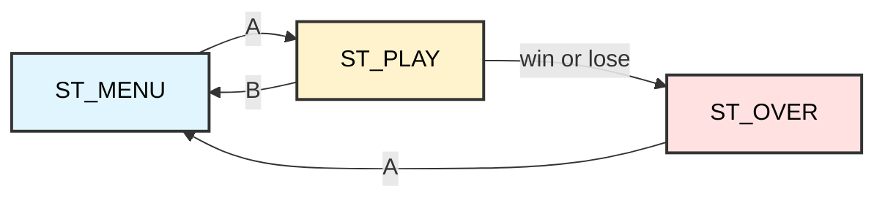

# Pong, Snake and Breakout
## ATmega128 Embedded Systems Course

**Reference**: [ATmega128 Datasheet](https://ww1.microchip.com/downloads/en/DeviceDoc/doc2467.pdf)

---

## Slide 1: Three games, one engine

Lesson 23 built the machinery: a framebuffer, dirty-page flushing, a fixed
timestep, debounced input. None of it was a game.

This lesson spends it. Three complete games share one engine, one menu and one
main loop — and each one teaches a different way to represent a world in a few
hundred bytes.

| Game | The idea it teaches |
|---|---|
| **Pong** | Continuous motion, and an opponent that must be beatable |
| **Snake** | A grid world, and a body that outgrows naive storage |
| **Breakout** | Packing state into bits, and collision by arithmetic |

### The whole program is one state machine


---

## Slide 2: The shape of the loop

Every frame does the same five things, no matter which state or game is active:

```c
for (;;) {
    if (!game_tick_ready()) continue;   /* the timer sets the pace   */
    input_poll();                       /* debounce + edges          */

    /* ... dispatch update() by state and game ... */

    gfx_clear();
    /* ... dispatch render() by state and game ... */
    gfx_flush();
}
```

**Update and render are separate on purpose.** Update changes the world; render
only reads it. Keeping them apart means you can skip a render without breaking
the physics, draw the same state twice, or — in later lessons — run the update
with no screen at all so a robot can be scored headlessly.

> Never let drawing code change the game state.
> The bug it causes is invisible until you draw twice.

---

## Slide 3: Pong — bounce off the walls

Motion is integer pixels per tick. No floating point, no trigonometry.

```c
pg_bx += pg_vx;
pg_by += pg_vy;

if (pg_bx <= 0)              { pg_bx = 0;           pg_vx = -pg_vx; }
if (pg_bx >= 128 - PONG_BALL){ pg_bx = 128-PONG_BALL; pg_vx = -pg_vx; }
```

**Clamp, then reverse.** Setting the position back to the wall before flipping
the velocity matters: without it a fast ball can end up *outside* the wall, test
true again next frame, and flip back and forth forever — stuck, vibrating in the
edge. That bug is common enough to have a name: tunnelling.

---

## Slide 4: Pong — collision only while approaching

```c
if (pg_vy > 0 && pg_by + PONG_BALL >= PONG_PLAYER_Y && ...)
```

The `pg_vy > 0` is the important part. Without it, a ball that has already
slipped past the paddle keeps overlapping it and gets batted **upward from
underneath**, which looks like the ball passing through solid matter.

Testing the direction of travel as well as the overlap costs one comparison and
removes a whole class of glitch.

> Overlap is not collision.
> Collision is overlap *plus* moving towards each other.

---

## Slide 5: Pong — an opponent you can actually beat

```c
#define PONG_AI_SPEED 2   /* the ball also moves 2 px per tick */

if (ai_centre < pg_bx && ...) pg_ai += PONG_AI_SPEED;
else if (ai_centre > pg_bx)   pg_ai -= PONG_AI_SPEED;
```

The AI is three lines: move towards the ball, capped in speed.

Cap it *below* the ball's horizontal speed and a sharp angle outruns it. Remove
the cap — `pg_ai = pg_bx` — and the AI becomes perfect, never misses, and the
game becomes unplayable.

**A perfect opponent is not a hard game. It is a broken one.**

---

## Slide 6: Snake — a grid world

Pong works in pixels. Snake works in **cells**, which makes every collision an
equality test instead of an overlap test.

```c
#define CELL   4          /* 4 x 4 pixels          */
#define GRID_W 32         /* 128 / 4               */
#define GRID_H 14         /* (64 - 8 HUD) / 4      */
```

```
 x=0  1   2   3  ...  31      <- 32 columns
+---+---+---+---+   +---+
|   |###|###|   |   |   |     y=0
+---+---+---+---+   +---+
|   |###| o |   |   |   |     y=1     ### snake   o food
+---+---+---+---+   +---+
```

Rendering multiplies back up: `gfx_fill_rect(x * CELL, FIELD_TOP + y * CELL, ...)`.
Cell size 3 rather than 4 leaves a one-pixel gap, so the segments read as a
chain instead of a solid bar.

---

## Slide 7: Snake — where the body lives

The obvious representation is one entry per segment. The question is how many,
and how wide.

| Choice | Cost | Verdict |
|---|---|---|
| Every cell of the board, `uint16_t` | 448 × 2 = 896 B | Too much beside a 1 KB framebuffer |
| Capped at 120 segments, packed index | 120 × 2 = 240 B | Works |
| **Capped at 120, two byte arrays** | **120 + 120 = 240 B** | **Same cost, readable** |

```c
static uint8_t sn_x[SNAKE_MAX], sn_y[SNAKE_MAX];   /* 240 bytes */
```

Packing `x` and `y` into one 16-bit index saves nothing here — both come to 240
bytes — so take the version you can read. The cap is the real decision: reaching
120 segments counts as winning.

> Pack bits when it buys you something.
> Packing for its own sake costs clarity and buys nothing.

---

## Slide 8: Snake — steering every frame, moving every sixth

```c
if (btn_pressed(BTN_LEFT) && sn_dir != BTN_RIGHT) sn_dir = BTN_LEFT;
/* ... the other three ... */

if (++sn_wait < SNAKE_TICKS) return;    /* 6 frames: ~8 moves a second */
sn_wait = 0;
```

Input is read at the full 50 Hz; the snake only steps every sixth frame. If you
read input only when the snake moves, a quick tap between steps is silently
dropped and the game feels broken even though the code is "correct".

**The `sn_dir != BTN_RIGHT` test** stops the snake reversing straight into its
own neck, which would be an instant, baffling death.

---

## Slide 9: Snake — the tail cell that is not there

```c
for (uint8_t i = 0; i + 1 < sn_len; i++)      /* note: i + 1 < sn_len */
    if (sn_x[i] == nx && sn_y[i] == ny)
        /* ... dead ... */
```

Why skip the last segment?

Because by the time the head arrives, the tail has already moved out of that
cell. Test the full body and the snake dies every time it follows its own tail
round a tight corner — a bug that looks like random unfair deaths, and is
miserable to find by staring at the code.

```
   step N          step N+1
   H . .           . H .          the head is entering the cell
   . . T           . . T'         the tail is leaving it
```

---

## Slide 10: Snake — placing food without hanging

The tempting version:

```c
do { fx = rand() % GRID_W; fy = rand() % GRID_H; } while (on_snake(fx, fy));
```

This works beautifully — until the snake covers most of the board. Then almost
every guess collides, and the loop can spin for an unbounded time **inside a
20 ms frame**. The game freezes at exactly the moment the player is doing well.

The version in the lesson bounds the gamble and then falls back to certainty:

```c
for (attempt = 0; attempt < 40; attempt++) { /* random guess */ }
for (fy = 0; fy < GRID_H; fy++)
    for (fx = 0; fx < GRID_W; fx++) { /* first free cell, guaranteed */ }
```

> Any loop inside a frame needs a bound you can state out loud.

---

## Slide 11: Breakout — 24 bricks in 3 bytes

```c
static uint8_t brk_rows[BRK_ROWS];   /* one bit per column */
```

Eight columns, three rows, one bit each: **24 bricks in 3 bytes**. An array of
`uint8_t` flags would be 24 bytes, a struct per brick far more.

```c
brk_rows[r] & (1 << c)          /* is this brick still there? */
brk_rows[r] &= ~(1 << c);       /* knock it out               */
```

And "are they all gone?" costs three comparisons instead of a loop over 24:

```c
if (!brk_rows[0] && !brk_rows[1] && !brk_rows[2])   /* cleared */
```

---

## Slide 12: Breakout — collision without searching

The bricks sit on a regular grid, so you do not search for the one that was hit.
You **compute** it:

```c
uint8_t row = (bk_y - BRK_TOP) / BRK_H;
uint8_t col =  bk_x / BRK_W;

if (row < BRK_ROWS && col < BRK_COLS && (brk_rows[row] & (1 << col))) { ... }
```

| Approach | Work per frame |
|---|---|
| Loop over every brick | 24 rectangle overlap tests |
| **Index arithmetic** | **two divisions and a bit test** |

With 24 bricks the difference is small. With 240 it is the whole frame budget.
Recognising that a regular layout makes lookup arithmetic is a habit worth
forming early.

---

## Slide 13: The bounce that makes it a game

Both Pong and Breakout steer the ball by **where it lands on the paddle**:

```c
int16_t hit = bk_x + 1 - (bk_pad + BRK_PAD_W / 2);   /* offset from centre */
bk_vx = (hit < -6) ? -2 : (hit > 6) ? 2 : bk_vx;
```

A paddle that only reverses `vy` is a wall — the ball follows a fixed path and
the player is a spectator. Letting the contact point set the horizontal velocity
turns the paddle into a *control*: aim with the edges, deaden with the middle.

**Three lines are the difference between a demo and a game.**

---

## Slide 14: Sound that does not stop the game

`shared_libs/_buzzer.c` makes tones by busy-waiting:

```c
void Sound(unsigned int ch, unsigned int time) { /* ... blocking delays ... */ }
```

At 50 frames a second a 100 ms note would burn **five entire frames**. The game
would freeze every time the ball hit anything.

So the engine toggles the pin from a timer interrupt instead:

```c
ISR(TIMER2_COMP_vect)
{
    if (tone_toggles) { SPEAKER_PORT ^= (1 << SPEAKER_BIT); tone_toggles--; }
    else              { SPEAKER_PORT &= ~(1 << SPEAKER_BIT);
                        TIMSK &= ~(1 << OCIE2); }
}
```

`sound_tone(hz, ms)` sets the period and a toggle count, then **returns
immediately**. The note plays while the game keeps running.

---

## Slide 15: Working out the tone

There is no hardware path from a timer to PG4 — `OC2` is PB7 — so the wave is
made in software, and the arithmetic has to fit an 8-bit compare register.

Timer2 at prescaler 256: 16 MHz / 256 = **62 500 Hz**.

```
f = 62500 / (2 * (OCR2 + 1))        so    OCR2 = 62500 / (2f) - 1
```

| Tone | `OCR2` |
|---|---|
| 200 Hz | 155 |
| 440 Hz | 70 |
| 1000 Hz | 30 |
| 4000 Hz | 6 |

Below about 123 Hz `OCR2` overflows 255, so `sound_tone()` clamps. Duration is a
toggle count: `toggles = 2 * hz * ms / 1000`.

> **On the board:** PG4 reaches the speaker through a slide switch.
> If a tone plays and nothing is heard, check the switch before the code.

---

## Slide 16: Strings belong in flash too

The menu labels never change, so they have no business in SRAM:

```c
static const char label_pong[] PROGMEM = "PONG";
static const char *const menu_labels[G_COUNT] PROGMEM = { label_pong, ... };
```

Note the **two** levels: the strings are in flash, and so is the array of
pointers to them. Reading it back needs the matching accessor:

```c
const char *label = (const char *)pgm_read_word(&menu_labels[i]);
```

`pgm_read_word` for the pointer, `pgm_read_byte` for each character. Get this
wrong — declare `PROGMEM` but read it as a normal pointer — and the AVR happily
fetches from the *same numeric address in RAM* and prints rubbish. It does not
crash, which is what makes the bug so hard to see.

---

## Slide 17: Clearing the screen, cheaply

Lesson 23 only cleared the playfield. These games clear everything and redraw,
which is far simpler — but a naive `gfx_clear()` would mark all eight pages
dirty and throw away the whole dirty-page optimisation.

So `gfx_clear()` skips pages that are already blank:

```c
for (page = 0; page < GFX_PAGES; page++) {
    for (x = 0; x < GFX_W; x++) if (row[x]) { used = 1; break; }
    if (used) { memset(row, 0, GFX_W); fb_dirty |= (1 << page); }
}
```

Scanning 1024 bytes of RAM costs tens of microseconds. Flushing one page that
did not need it costs 128 bus writes — about half a millisecond. **The scan is
cheaper by more than an order of magnitude.**

In Snake, the pages holding no snake stay blank, stay clean, and are never sent.

---

## Slide 18: What it all costs

```
23_Game_Engine_GLCD              24_Game_Arcade
-------------------              --------------
.data      30                    .data      66
.text    3088                    .text    5402
.bss     1047                    .bss     1306
        -----                            -----
SRAM     1077                    SRAM     1372
```

**SRAM: 1372 of 4096 — 33%**, up 295 bytes from lesson 23. Ask the linker where
they went rather than guessing:

```
$ avr-nm -S --size-sort -td Main.elf | grep ' b '
...
08388938 00000003 b brk_rows      <- 24 bricks
08389066 00000120 b sn_x          <- snake body
08388946 00000120 b sn_y
08389212 00001024 b fb            <- the framebuffer, still the giant
```

| | Bytes |
|---|---|
| Snake body, `sn_x` + `sn_y` | 240 |
| Pong, Breakout and menu state | 16 |
| Breakout bricks (24 of them) | 3 |
| **`.bss` growth** | **259** |
| `.data` growth (runtime support) | 36 |

Three complete games cost **259 bytes** of game state. The framebuffer is still,
by a wide margin, the most expensive thing in the program.

> Flash grew by 2314 bytes and nobody cares — there is 128 KB of it.
> RAM grew by 259 and that is the number worth watching.

---

## Slide 19: Exercises

1. **Break the AI.** Set `PONG_AI_SPEED` to 3, above the ball's speed. Can you
   still score? What does that tell you about difficulty tuning?

2. **Reintroduce the tail bug.** Change `i + 1 < sn_len` to `i < sn_len` and
   play until it kills you. Describe exactly the move that does it.

3. **Fill the board.** Lower `SNAKE_MAX` to 12 and win. Does the food placement
   fall through to the linear scan? Add a counter and find out.

4. **Measure the clear.** Print the bytes returned by `gfx_flush()` on the HUD.
   Compare the menu, Snake early on, and Snake at 60 segments. Explain the
   pattern.

5. **Add a level.** After Breakout is cleared, refill the bricks and speed the
   ball up. Where do you store the level number, and what happens at level 20?

6. **Two-player Pong.** Replace the AI with PD6/PD7. What has to change in
   `pong_update()`, and what does that say about how the AI was written?

---

## Slide 20: What you built

- A **state machine** that owns the whole program, not three separate programs
- **Update and render kept apart**, which later lets a robot run with no screen
- Collision as **integer comparison**, tested with direction as well as overlap
- Three world representations: **pixels**, a **grid**, and **packed bits**
- **Bounded loops** inside a frame that can never hang
- **Sound from an interrupt**, so a beep costs no frames
- Strings and sprites in **flash**, and the accessors that read them back

### The habit worth keeping
> Every one of these games fits in a few hundred bytes because the
> representation was chosen before the code was written.
> On a 4 KB machine, deciding how the world is stored *is* the design.

**Next:** the application track leaves the board — your C starts driving robots
in a physics simulator, and eventually a joint of a Unitree G1 humanoid.
